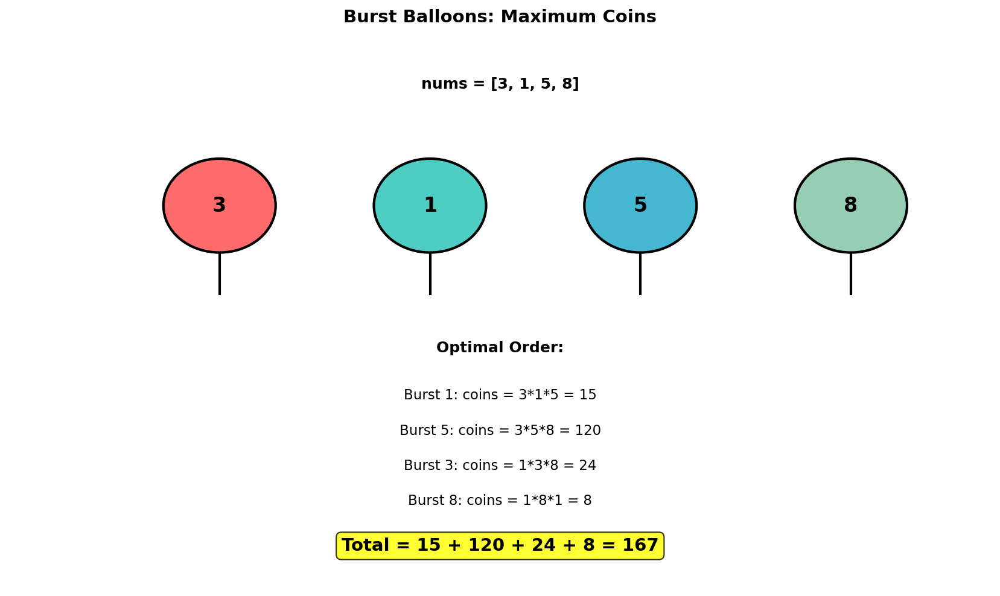
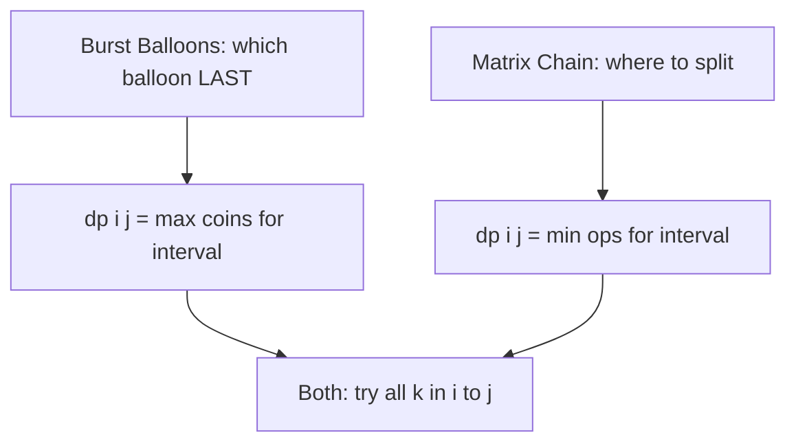
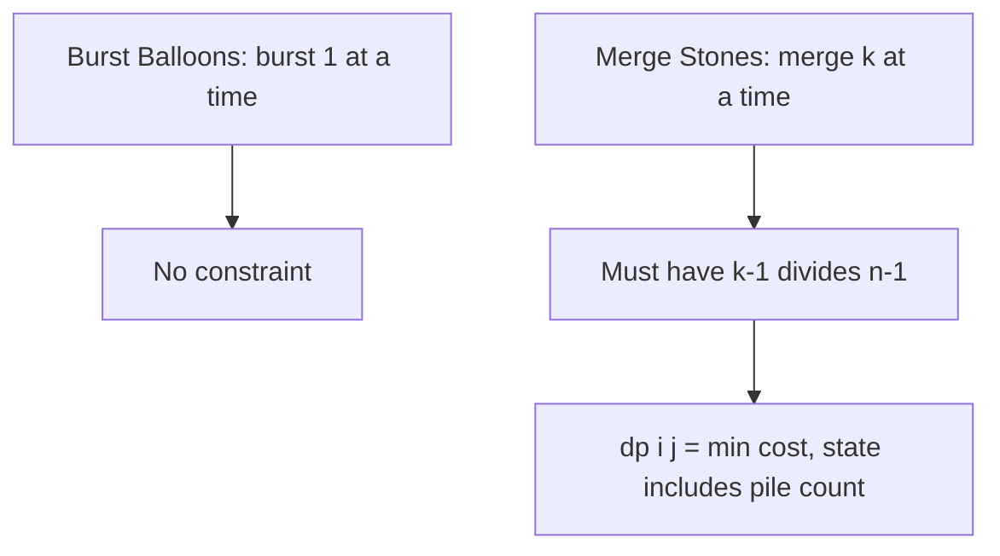
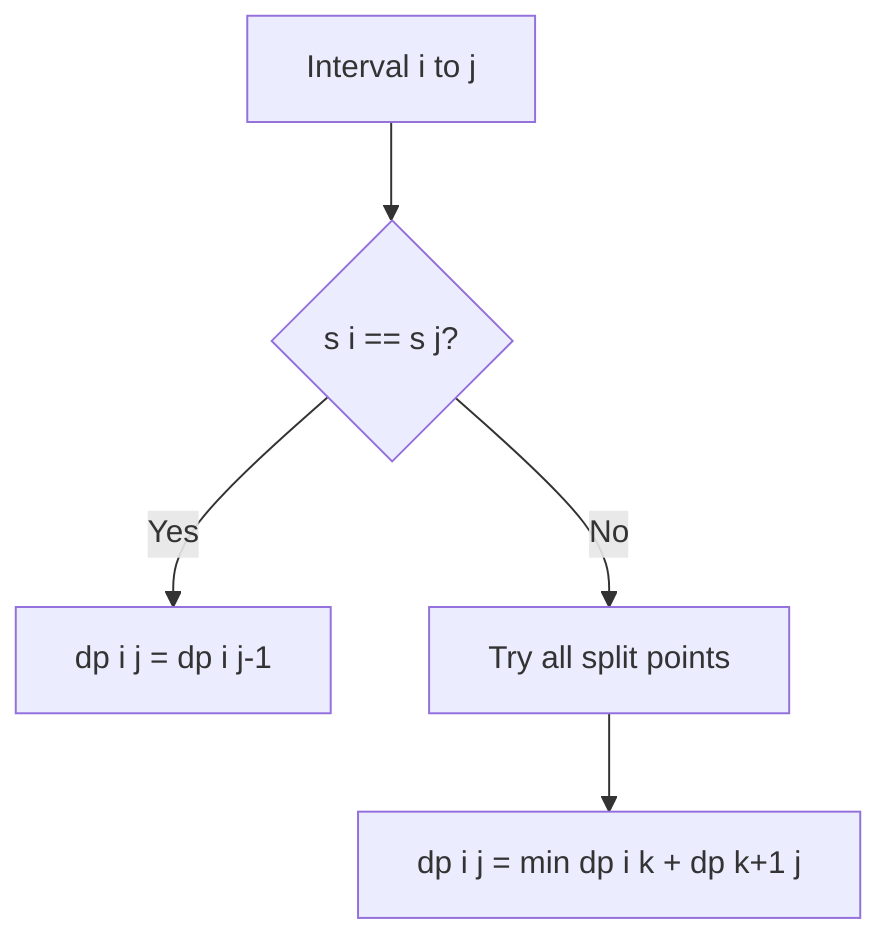
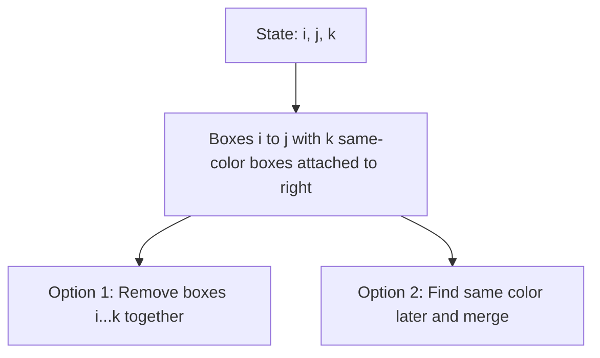

# Burst Balloons

## Problem Statement

You are given `n` balloons, indexed from `0` to `n - 1`. Each balloon is painted with a number on it represented by an array `nums`. You are asked to burst all the balloons.

If you burst the `i`th balloon, you will get `nums[i - 1] * nums[i] * nums[i + 1]` coins. If `i - 1` or `i + 1` goes out of bounds of the array, then treat it as if there is a balloon with a `1` painted on it.

Return the **maximum coins** you can collect by bursting the balloons wisely.

## Input/Output Format

**Input:**
- `nums` (List[int]): Array of balloon values

**Output:**
- (int): Maximum coins obtainable

## Constraints

- `n == nums.length`
- `1 <= n <= 300`
- `0 <= nums[i] <= 100`

## Examples

### Example 1: Standard Case

**Input:** `nums = [3, 1, 5, 8]`

**Output:** `167`

**Explanation:**
```
Original: [3, 1, 5, 8] (with virtual 1s: [1, 3, 1, 5, 8, 1])

Optimal order (one possible):
1. Burst balloon 1 (value 1): coins = 3 * 1 * 5 = 15
   Array becomes: [3, 5, 8]

2. Burst balloon 5: coins = 3 * 5 * 8 = 120
   Array becomes: [3, 8]

3. Burst balloon 3: coins = 1 * 3 * 8 = 24
   Array becomes: [8]

4. Burst balloon 8: coins = 1 * 8 * 1 = 8
   Array becomes: []

Total: 15 + 120 + 24 + 8 = 167
```

### Example 2: Single Balloon

**Input:** `nums = [1, 5]`

**Output:** `10`

**Explanation:**
```
With virtual 1s: [1, 1, 5, 1]

Option 1: Burst 1 first, then 5
  - Burst 1: 1 * 1 * 5 = 5
  - Burst 5: 1 * 5 * 1 = 5
  - Total: 10

Option 2: Burst 5 first, then 1
  - Burst 5: 1 * 5 * 1 = 5
  - Burst 1: 1 * 1 * 1 = 1
  - Total: 6

Maximum: 10
```

### Example 3: Single Element

**Input:** `nums = [10]`

**Output:** `10`

**Explanation:**
Only one balloon. Coins = 1 * 10 * 1 = 10.

## Visual Explanation



## ASCII Art: Thinking in Reverse

```
Key insight: Think of which balloon to burst LAST in a range!

nums = [3, 1, 5, 8] with virtual 1s becomes [1, 3, 1, 5, 8, 1]
                                             ^                 ^
                                           virtual           virtual

If we burst balloon k LAST in range (i, j):
- All other balloons in (i, j) are already gone
- Neighbors of k are balloons i and j (boundary balloons)
- Coins from k = nums[i] * nums[k] * nums[j]

DP[i][j] = max coins from bursting all balloons between i and j
         (excluding i and j, which are boundaries)

For range (0, 5) with k=3 (balloon with value 5):
- Left part: DP[0][3] = max coins bursting (3, 1)
- Right part: DP[3][5] = max coins bursting (8)
- Burst k: nums[0] * nums[3] * nums[5] = 1 * 5 * 1 = 5
- Total = DP[0][3] + DP[3][5] + 5
```

## Why "Burst Last" Works

```
Problem with "burst first" thinking:
- After bursting balloon i, its neighbors change
- This creates dependency on burst order
- Exponential number of states

"Burst last" insight:
- If balloon k is the LAST to be burst in range (i, j):
  - Left side (i, k) is already empty
  - Right side (k, j) is already empty
  - When bursting k, its neighbors are EXACTLY i and j
- No dependency on intermediate burst order!
```

## Solution Code

### Approach 1: Top-Down (Memoization)

```python
from typing import List
from functools import lru_cache

def maxCoins(nums: List[int]) -> int:
    """
    Find max coins using memoization with "burst last" strategy.

    For each range, try each balloon as the last to burst.

    Args:
        nums: Array of balloon values

    Returns:
        Maximum coins obtainable

    Time Complexity: O(n^3)
    Space Complexity: O(n^2)
    """
    # Add virtual balloons at boundaries
    balloons = [1] + nums + [1]
    n = len(balloons)

    @lru_cache(maxsize=None)
    def dp(left: int, right: int) -> int:
        """
        Max coins from bursting all balloons between left and right
        (exclusive of left and right boundaries).
        """
        # No balloons between left and right
        if left + 1 >= right:
            return 0

        max_coins = 0

        # Try each balloon as the LAST to burst
        for k in range(left + 1, right):
            # Coins from bursting k last
            coins = balloons[left] * balloons[k] * balloons[right]

            # Add coins from left and right subproblems
            total = dp(left, k) + coins + dp(k, right)
            max_coins = max(max_coins, total)

        return max_coins

    return dp(0, n - 1)
```

::: info Complexity: Time O(n^3) · Space O(n^2)
- **Time:** There are O(n^2) subproblems (all pairs left, right) and each tries O(n) choices for which balloon to burst last.
- **Space:** The memoization cache stores O(n^2) entries plus O(n) recursion stack depth.
:::

### Approach 2: Bottom-Up (Tabulation)

```python
from typing import List

def maxCoins(nums: List[int]) -> int:
    """
    Find max coins using bottom-up DP.

    Build solution for increasing range lengths.

    Args:
        nums: Array of balloon values

    Returns:
        Maximum coins obtainable

    Time Complexity: O(n^3)
    Space Complexity: O(n^2)
    """
    # Add virtual balloons
    balloons = [1] + nums + [1]
    n = len(balloons)

    # dp[i][j] = max coins from bursting balloons between i and j
    dp = [[0] * n for _ in range(n)]

    # Iterate by range length
    for length in range(2, n):  # Minimum length 2 to have balloons between
        for left in range(n - length):
            right = left + length

            # Try each balloon as last to burst
            for k in range(left + 1, right):
                coins = balloons[left] * balloons[k] * balloons[right]
                dp[left][right] = max(
                    dp[left][right],
                    dp[left][k] + coins + dp[k][right]
                )

    return dp[0][n - 1]
```

::: info Complexity: Time O(n^3) · Space O(n^2)
- **Time:** Three nested loops: range length (n), left boundary (n), and balloon choice k (n), giving O(n^3).
- **Space:** The 2D dp table of size n x n stores maximum coins for each interval.
:::

### Approach 3: With Reconstruction

```python
from typing import List, Tuple

def maxCoins_with_order(nums: List[int]) -> Tuple[int, List[int]]:
    """
    Find max coins and return the optimal burst order.

    Args:
        nums: Array of balloon values

    Returns:
        Tuple of (max coins, list of indices in burst order)

    Time Complexity: O(n^3)
    Space Complexity: O(n^2)
    """
    balloons = [1] + nums + [1]
    n = len(balloons)

    dp = [[0] * n for _ in range(n)]
    choice = [[0] * n for _ in range(n)]  # Track which balloon bursts last

    for length in range(2, n):
        for left in range(n - length):
            right = left + length

            for k in range(left + 1, right):
                coins = balloons[left] * balloons[k] * balloons[right]
                total = dp[left][k] + coins + dp[k][right]

                if total > dp[left][right]:
                    dp[left][right] = total
                    choice[left][right] = k

    # Reconstruct burst order (reverse of "last burst" order)
    def get_burst_order(left: int, right: int) -> List[int]:
        if left + 1 >= right:
            return []

        k = choice[left][right]
        # k is bursted LAST in this range
        # So first burst left part, then right part, then k
        order = get_burst_order(left, k)
        order.extend(get_burst_order(k, right))
        order.append(k - 1)  # Convert back to original indexing
        return order

    return dp[0][n - 1], get_burst_order(0, n - 1)
```

::: info Complexity: Time O(n^3) · Space O(n^2)
- **Time:** Same O(n^3) DP computation, plus O(n) for reconstructing the burst order via recursion.
- **Space:** Two n x n tables (dp and choice) for O(n^2) space, plus O(n) recursion stack for reconstruction.
:::

## Complexity Analysis

| Approach | Time Complexity | Space Complexity |
|----------|----------------|------------------|
| Top-Down | O(n^3) | O(n^2) |
| Bottom-Up | O(n^3) | O(n^2) |

The O(n^3) comes from:
- O(n^2) subproblems (all pairs left, right)
- O(n) choices for k in each subproblem

## Edge Cases

1. **Single balloon:**
   ```python
   maxCoins([10])  # Returns 10 (1 * 10 * 1)
   ```

2. **Two balloons:**
   ```python
   maxCoins([3, 5])  # Returns max(1*3*5 + 1*5*1, 1*5*3 + 1*3*1) = 20
   ```

3. **All zeros:**
   ```python
   maxCoins([0, 0, 0])  # Returns 0
   ```

4. **Array with zero:**
   ```python
   maxCoins([3, 0, 5])  # Zero balloon gives 0 coins but affects neighbors
   ```

5. **All same values:**
   ```python
   maxCoins([5, 5, 5])  # Any order gives same result
   ```

## DP Table Visualization

```
nums = [3, 1, 5], balloons = [1, 3, 1, 5, 1]

DP Table: dp[i][j] = max coins bursting balloons strictly between i and j

          j=0  j=1  j=2  j=3  j=4
        +----+----+----+----+----+
   i=0  |  0 |  0 |  3 | 30 | 40 |
        +----+----+----+----+----+
   i=1  |  - |  0 |  0 | 15 | 35 |
        +----+----+----+----+----+
   i=2  |  - |  - |  0 |  0 |  5 |
        +----+----+----+----+----+
   i=3  |  - |  - |  - |  0 |  0 |
        +----+----+----+----+----+
   i=4  |  - |  - |  - |  - |  0 |
        +----+----+----+----+----+

Building dp[0][4]:
For k=1 (balloon 3): 1*3*1 + dp[0][1] + dp[1][4] = 3 + 0 + 35 = 38
For k=2 (balloon 1): 1*1*1 + dp[0][2] + dp[2][4] = 1 + 3 + 5 = 9
For k=3 (balloon 5): 1*5*1 + dp[0][3] + dp[3][4] = 5 + 30 + 0 = 35

Wait, let me recalculate...
Actually for this example, let me trace properly.

dp[0][2] means burst balloons between 0 and 2, only balloon at index 1 (value 3)
  k=1: coins = 1*3*1 = 3, dp[0][2] = 3

dp[2][4] means burst balloons between 2 and 4, only balloon at index 3 (value 5)
  k=3: coins = 1*5*1 = 5, dp[2][4] = 5

dp[0][3] means burst balloons between 0 and 3, balloons at 1 (3) and 2 (1)
  k=1: 1*3*5 + dp[0][1] + dp[1][3] = 15 + 0 + 0 = 15
  k=2: 1*1*5 + dp[0][2] + dp[2][3] = 5 + 3 + 0 = 8
  dp[0][3] = 15

And so on...
```

## Key Insights

1. **Reverse Thinking**: Instead of "which to burst first", think "which to burst last" in each range.

2. **Boundary Trick**: Add virtual balloons with value 1 at boundaries to simplify edge cases.

3. **Interval DP**: Classic interval DP where dp[i][j] represents the answer for range (i, j).

4. **Independence**: Once we fix the last balloon k, the left and right subproblems become independent.

5. **Similar to Matrix Chain**: Both are O(n^3) interval DP problems with similar structure.

## Related Problems

::: details Matrix Chain Multiplication (Classic)
**Problem:** Given matrix dimensions, find minimum scalar multiplications to compute product.

**Key Insight:** Identical interval DP structure. Choose split point to minimize cost.



**Approach:** `dp[i][j] = min(dp[i][k] + dp[k+1][j] + dims[i-1]*dims[k]*dims[j])`. Same O(n^3) complexity.

**Complexity:** O(n^3) time, O(n^2) space
:::

::: details Minimum Cost to Merge Stones (LeetCode 1000)
**Problem:** Merge k consecutive piles into one, cost = sum of merged piles. Find minimum cost to merge all into one pile.

**Key Insight:** Interval DP with extra constraint - can only merge k piles at a time.



**Approach:** `dp[i][j]` = min cost to merge stones[i:j+1] into minimum possible piles. Can only fully merge when (j-i) % (k-1) == 0.

**Complexity:** O(n^3 / k) time, O(n^2) space
:::

::: details Strange Printer (LeetCode 664)
**Problem:** Printer prints sequences of same character. Find minimum turns to print string s.

**Key Insight:** Interval DP. If s[i] == s[j], can print s[i] while printing s[j] for "free".



**Approach:** `dp[i][j] = dp[i][j-1]` if s[i] == s[j], else `min(dp[i][k] + dp[k+1][j])` for all splits. Print overlapping characters together.

**Complexity:** O(n^3) time, O(n^2) space
:::

::: details Remove Boxes (LeetCode 546)
**Problem:** Remove boxes of same color together, earn k^2 points for k boxes. Maximize total points.

**Key Insight:** More complex than standard interval DP. Need extra state to track consecutive same-color boxes.



**Approach:** `dp[i][j][k]` = max points for boxes[i:j+1] with k extra boxes of color boxes[j] attached. Either remove immediately or find matching colors to combine.

**Complexity:** O(n^4) time, O(n^3) space
:::
