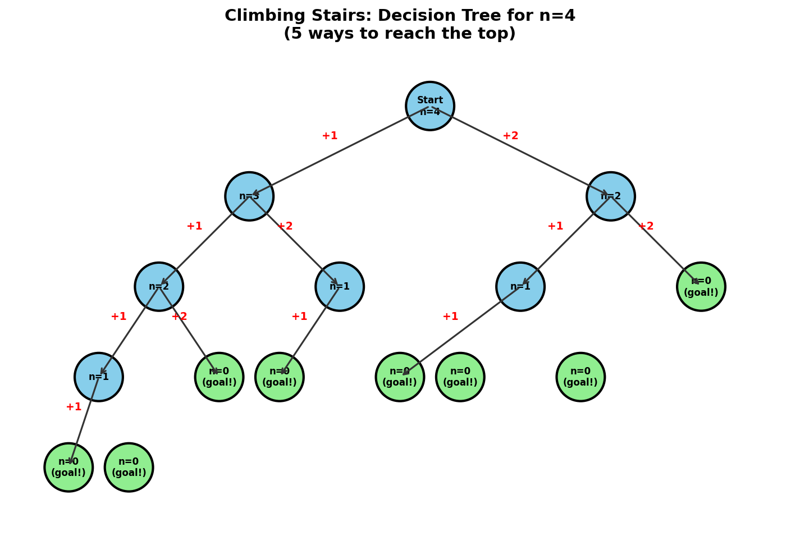
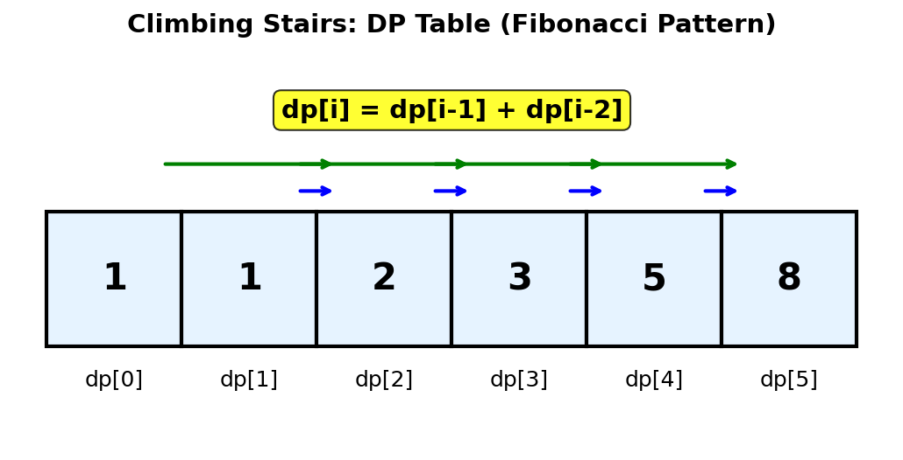
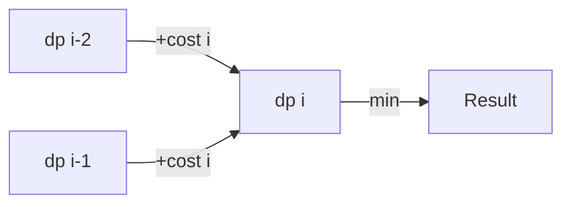
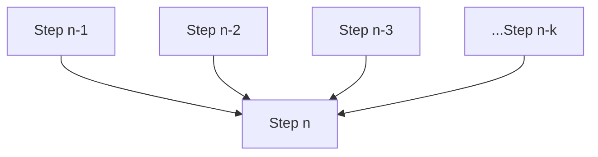
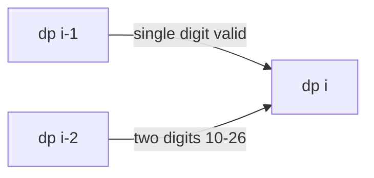
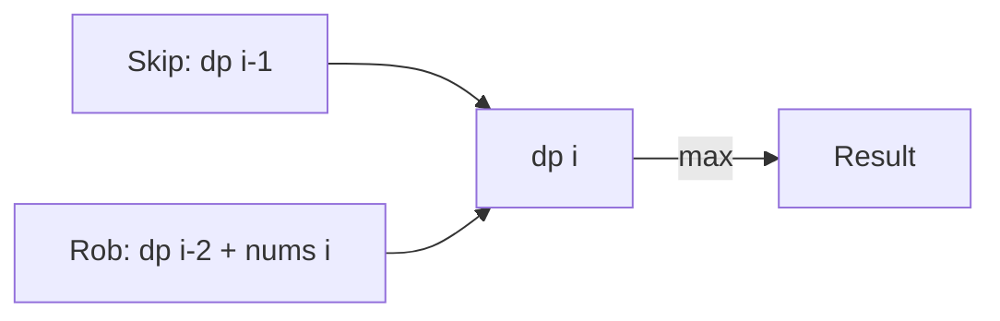

# Climbing Stairs

## Problem Statement

You are climbing a staircase that has `n` steps. Each time you can either climb **1 step** or **2 steps**. In how many distinct ways can you climb to the top of the staircase?

This is a classic dynamic programming problem that introduces the fundamental concepts of overlapping subproblems and optimal substructure. The problem is equivalent to computing Fibonacci numbers.

## Input/Output Format

**Input:**
- `n` (int): The total number of steps in the staircase

**Output:**
- (int): The number of distinct ways to climb to the top

## Constraints

- `1 <= n <= 45`
- The answer is guaranteed to fit in a 32-bit signed integer

## Examples

### Example 1: Small Staircase

**Input:** `n = 2`

**Output:** `2`

**Explanation:**
There are two ways to climb to the top:
1. 1 step + 1 step
2. 2 steps

```
Step 2:  [TOP]
           ^
          /  \
         1    2
        /      \
Step 1: *       |
        ^       |
        |       |
        1       |
        |       |
Step 0: [START]-+

Way 1: 1 -> 1 (two single steps)
Way 2: 2 (one double step)
```

### Example 2: Medium Staircase

**Input:** `n = 3`

**Output:** `3`

**Explanation:**
There are three ways to climb to the top:
1. 1 step + 1 step + 1 step
2. 1 step + 2 steps
3. 2 steps + 1 step

```
Step-by-step breakdown:
======================

Way 1: [0] --(1)--> [1] --(1)--> [2] --(1)--> [3]
Way 2: [0] --(1)--> [1] --(2)--> [3]
Way 3: [0] --(2)--> [2] --(1)--> [3]
```

### Example 3: Larger Staircase

**Input:** `n = 5`

**Output:** `8`

**Explanation:**
The 8 distinct ways are:
1. 1+1+1+1+1
2. 1+1+1+2
3. 1+1+2+1
4. 1+2+1+1
5. 2+1+1+1
6. 1+2+2
7. 2+1+2
8. 2+2+1

Notice that this follows the Fibonacci pattern: `fib(5) = fib(4) + fib(3) = 5 + 3 = 8`

## Visual Explanation

### Decision Tree for n=4

The following diagram shows all possible paths when climbing 4 stairs:



### DP Table Visualization

The DP array follows the Fibonacci pattern:



## ASCII Art: DP Table Building

```
Building the DP table for n = 5:

Index:    0    1    2    3    4    5
        +----+----+----+----+----+----+
dp[]:   | 1  | 1  | 2  | 3  | 5  | 8  |
        +----+----+----+----+----+----+
               ^    ^
               |    |
          base cases

Recurrence: dp[i] = dp[i-1] + dp[i-2]

Calculation trace:
dp[0] = 1  (base case: 1 way to stay at ground)
dp[1] = 1  (base case: 1 way to reach step 1)
dp[2] = dp[1] + dp[0] = 1 + 1 = 2
dp[3] = dp[2] + dp[1] = 2 + 1 = 3
dp[4] = dp[3] + dp[2] = 3 + 2 = 5
dp[5] = dp[4] + dp[3] = 5 + 3 = 8

Answer: dp[5] = 8
```

## Solution Code

### Approach 1: Top-Down (Memoization)

```python
def climbStairs(n: int) -> int:
    """
    Count distinct ways to climb n stairs using memoization.

    The key insight is that to reach step i, we can either:
    - Take 1 step from step (i-1), OR
    - Take 2 steps from step (i-2)

    So: ways(i) = ways(i-1) + ways(i-2)

    Args:
        n: Number of stairs to climb

    Returns:
        Number of distinct ways to reach the top

    Time Complexity: O(n) - each subproblem solved once
    Space Complexity: O(n) - recursion stack + memoization
    """
    memo = {}

    def dp(step: int) -> int:
        # Base cases
        if step <= 1:
            return 1

        # Check memo
        if step in memo:
            return memo[step]

        # Recurrence relation
        memo[step] = dp(step - 1) + dp(step - 2)
        return memo[step]

    return dp(n)
```

::: info Complexity: Time O(n) · Space O(n)
- **Time:** Each of the n subproblems is computed exactly once due to memoization, with O(1) work per subproblem.
- **Space:** The memo dictionary stores up to n values, plus recursion stack depth of O(n).
:::

### Approach 2: Bottom-Up (Tabulation)

```python
def climbStairs(n: int) -> int:
    """
    Count distinct ways to climb n stairs using bottom-up DP.

    Build the solution iteratively from smaller subproblems.

    Args:
        n: Number of stairs to climb

    Returns:
        Number of distinct ways to reach the top

    Time Complexity: O(n)
    Space Complexity: O(n)
    """
    if n <= 2:
        return n

    # dp[i] = number of ways to reach step i
    dp = [0] * (n + 1)
    dp[0] = 1  # 1 way to stay at ground (do nothing)
    dp[1] = 1  # 1 way to reach step 1

    for i in range(2, n + 1):
        dp[i] = dp[i - 1] + dp[i - 2]

    return dp[n]
```

::: info Complexity: Time O(n) · Space O(n)
- **Time:** Single pass through n steps, with O(1) work per step computing dp[i] = dp[i-1] + dp[i-2].
- **Space:** The dp array stores n+1 values to track the number of ways to reach each step.
:::

### Approach 3: Space-Optimized Bottom-Up

```python
def climbStairs(n: int) -> int:
    """
    Count distinct ways to climb n stairs with O(1) space.

    Since we only need the previous two values, we can use
    two variables instead of an array.

    Args:
        n: Number of stairs to climb

    Returns:
        Number of distinct ways to reach the top

    Time Complexity: O(n)
    Space Complexity: O(1)
    """
    if n <= 2:
        return n

    # Only track the previous two values
    prev2 = 1  # dp[i-2]
    prev1 = 1  # dp[i-1]

    for i in range(2, n + 1):
        current = prev1 + prev2
        prev2 = prev1
        prev1 = current

    return prev1
```

::: info Complexity: Time O(n) · Space O(1)
- **Time:** Single pass through n steps, computing each step in constant time.
- **Space:** Only two variables (prev1, prev2) are used regardless of input size, achieving optimal space.
:::

### Approach 4: Matrix Exponentiation (O(log n))

```python
def climbStairs(n: int) -> int:
    """
    Count distinct ways using matrix exponentiation.

    The Fibonacci recurrence can be expressed as matrix multiplication:
    [F(n+1)]   [1 1]^n   [F(1)]
    [F(n)  ] = [1 0]   * [F(0)]

    Using fast matrix exponentiation, we achieve O(log n) time.

    Args:
        n: Number of stairs to climb

    Returns:
        Number of distinct ways to reach the top

    Time Complexity: O(log n)
    Space Complexity: O(1)
    """
    def matrix_multiply(A, B):
        """Multiply two 2x2 matrices."""
        return [
            [A[0][0]*B[0][0] + A[0][1]*B[1][0], A[0][0]*B[0][1] + A[0][1]*B[1][1]],
            [A[1][0]*B[0][0] + A[1][1]*B[1][0], A[1][0]*B[0][1] + A[1][1]*B[1][1]]
        ]

    def matrix_power(M, p):
        """Compute M^p using fast exponentiation."""
        result = [[1, 0], [0, 1]]  # Identity matrix

        while p > 0:
            if p % 2 == 1:
                result = matrix_multiply(result, M)
            M = matrix_multiply(M, M)
            p //= 2

        return result

    if n <= 2:
        return n

    # Base matrix for Fibonacci
    M = [[1, 1], [1, 0]]
    result = matrix_power(M, n)

    return result[0][0]
```

::: info Complexity: Time O(log n) · Space O(1)
- **Time:** Matrix exponentiation uses binary exponentiation, halving the exponent each iteration for O(log n) 2x2 matrix multiplications.
- **Space:** Only stores a constant number of 2x2 matrices regardless of n.
:::

## Complexity Analysis

| Approach | Time Complexity | Space Complexity |
|----------|----------------|------------------|
| Top-Down (Memoization) | O(n) | O(n) |
| Bottom-Up (Tabulation) | O(n) | O(n) |
| Space-Optimized | O(n) | O(1) |
| Matrix Exponentiation | O(log n) | O(1) |

## Edge Cases

1. **n = 1**: Only one way (take 1 step)
   ```python
   climbStairs(1)  # Returns 1
   ```

2. **n = 2**: Two ways (1+1 or 2)
   ```python
   climbStairs(2)  # Returns 2
   ```

3. **Large n**: Values grow exponentially (Fibonacci growth)
   ```python
   climbStairs(45)  # Returns 1836311903 (fits in 32-bit int)
   ```

## Key Insights

1. **Fibonacci Connection**: This problem is equivalent to finding the (n+1)th Fibonacci number. The number of ways to reach step n equals the sum of ways to reach steps n-1 and n-2.

2. **Overlapping Subproblems**: Without memoization, calculating ways(n) would recompute ways(k) for k < n many times.

3. **Optimal Substructure**: The optimal solution to the whole problem can be constructed from optimal solutions of its subproblems.

4. **State Definition**: `dp[i]` = number of distinct ways to reach step i from step 0.

5. **Recurrence Relation**: `dp[i] = dp[i-1] + dp[i-2]` because we can arrive at step i either from step i-1 (1 step) or step i-2 (2 steps).

## Related Problems

::: details Min Cost Climbing Stairs (LeetCode 746)
**Problem:** Given an array `cost` where `cost[i]` is the cost of the ith step, find the minimum cost to reach the top. You can start from step 0 or step 1.

**Key Insight:** Similar Fibonacci-like recurrence, but tracking minimum cost instead of counting paths.



**Approach:** `dp[i] = min(dp[i-1], dp[i-2]) + cost[i]`. Can be space-optimized to O(1).

**Complexity:** O(n) time, O(1) space
:::

::: details Climbing Stairs with K Steps (Generalization)
**Problem:** Instead of 1 or 2 steps, you can take 1, 2, ..., or k steps at a time. Count distinct ways to reach step n.

**Key Insight:** Extend the Fibonacci recurrence to sum over k previous states.



**Approach:** `dp[i] = dp[i-1] + dp[i-2] + ... + dp[i-k]`. Use sliding window for O(n) time.

**Complexity:** O(n*k) naive, O(n) with sliding window optimization
:::

::: details Decode Ways (LeetCode 91)
**Problem:** A message encoded as digits (A=1, B=2, ..., Z=26). Given a string of digits, count the number of ways to decode it.

**Key Insight:** Similar to climbing stairs but with validity constraints on single (1-9) and double (10-26) digit codes.



**Approach:** `dp[i] = (valid single ? dp[i-1] : 0) + (valid double ? dp[i-2] : 0)`. Handle '0' carefully.

**Complexity:** O(n) time, O(1) space
:::

::: details House Robber (LeetCode 198)
**Problem:** Given an array of house values, find maximum money you can rob without robbing adjacent houses.

**Key Insight:** Same recurrence structure as climbing stairs: `dp[i] = max(dp[i-1], dp[i-2] + nums[i])`.



**Approach:** At each house, decide to rob (add value + skip previous) or skip (take previous result).

**Complexity:** O(n) time, O(1) space
:::
