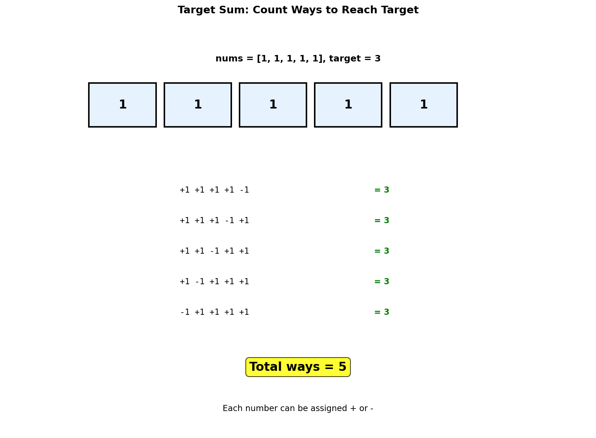

# Coin Change, Target Sum & Unique Paths

> **Classic DP problems with detailed visualizations**

---

## Table of Contents
1. [Coin Change](#coin-change)
2. [Target Sum](#target-sum)
3. [Partition Equal Subset Sum](#partition-equal-subset-sum)
4. [Unique Paths](#unique-paths)
5. [Interview Applications](#interview-applications)

---

## Coin Change

### Problem Statement (LeetCode 322)

Given an array of coin denominations `coins` and a target `amount`, return the **minimum number of coins** needed to make up that amount. If that amount cannot be made up by any combination of the coins, return -1. You may assume that you have an infinite number of each kind of coin.

**Example:**
- Input: `coins = [1, 2, 5]`, `amount = 11`
- Output: `3` (explanation: 11 = 5 + 5 + 1)

### Why Greedy Fails

Greedy approaches (always picking the largest coin) don't work for all coin systems:

```
coins = [1, 7, 10], amount = 14

Greedy: 10 + 1 + 1 + 1 + 1 = 5 coins (WRONG!)
Optimal: 7 + 7 = 2 coins (CORRECT!)
```

### DP Intuition

**Key Insight:** To find the minimum coins for amount `a`, we check all coins and take:
```
dp[a] = min(dp[a - coin] + 1) for all valid coins
```

This builds solutions from smaller subproblems (optimal substructure).

### DP State Visualization

```
Coins: [1, 2, 5], Amount: 11

Building the DP table step by step:

Amount:   0   1   2   3   4   5   6   7   8   9  10  11
        ─────────────────────────────────────────────────
Init:   [ 0 , ∞ , ∞ , ∞ , ∞ , ∞ , ∞ , ∞ , ∞ , ∞ , ∞ , ∞ ]
         ↑
       base case (0 coins for amount 0)

After processing all amounts:
Min:    [ 0 , 1 , 1 , 2 , 2 , 1 , 2 , 2 , 3 , 3 , 2 , 3 ]
         ↑   ↑   ↑   ↑   ↑   ↑
        base 1   2  1+2  2+2  5
             coin coin      coin

Detailed breakdown for key amounts:
┌─────────┬────────────────────────────────────────────────┐
│ dp[0]   │ 0 (base case)                                  │
│ dp[1]   │ min(dp[1-1]+1) = dp[0]+1 = 1                  │
│ dp[2]   │ min(dp[2-1]+1, dp[2-2]+1) = min(2,1) = 1      │
│ dp[3]   │ min(dp[3-1]+1, dp[3-2]+1) = min(2,2) = 2      │
│ dp[5]   │ min(dp[4]+1, dp[3]+1, dp[0]+1) = min(3,3,1)=1 │
│ dp[11]  │ min(dp[10]+1, dp[9]+1, dp[6]+1) = min(3,4,3)=3│
└─────────┴────────────────────────────────────────────────┘

Answer: dp[11] = 3 coins (5 + 5 + 1)
```

### Solution

::: code-group
```python [Python]
def coinChange(coins: list[int], amount: int) -> int:
    """
    Find minimum coins needed to make up amount.

    Time Complexity: O(amount * len(coins))
    Space Complexity: O(amount)

    Args:
        coins: List of coin denominations
        amount: Target amount to make

    Returns:
        Minimum coins needed, or -1 if impossible
    """
    # Initialize DP array with infinity (impossible state)
    dp = [float('inf')] * (amount + 1)
    dp[0] = 0  # Base case: 0 coins needed for amount 0

    # Build up solution for each amount from 1 to target
    for a in range(1, amount + 1):
        for coin in coins:
            if coin <= a:
                # Take minimum: don't use coin vs use coin
                dp[a] = min(dp[a], dp[a - coin] + 1)

    return dp[amount] if dp[amount] != float('inf') else -1
```

```java [Java]
public int coinChange(int[] coins, int amount) {
    int[] dp = new int[amount + 1];
    Arrays.fill(dp, amount + 1); // impossible sentinel
    dp[0] = 0;

    for (int a = 1; a <= amount; a++) {
        for (int coin : coins) {
            if (coin <= a) {
                dp[a] = Math.min(dp[a], dp[a - coin] + 1);
            }
        }
    }

    return dp[amount] <= amount ? dp[amount] : -1;
}
```
:::

::: info Complexity: Time O(amount * k) · Space O(amount)
- **Time:** Outer loop over amounts, inner loop over k coins
- **Space:** Single 1D array of size amount+1
:::

### Alternative: BFS Solution

```python
from collections import deque

def coinChange_BFS(coins: list[int], amount: int) -> int:
    """BFS approach - finds shortest path (min coins)"""
    if amount == 0:
        return 0

    visited = set([0])
    queue = deque([(0, 0)])  # (current_amount, num_coins)

    while queue:
        curr, num_coins = queue.popleft()

        for coin in coins:
            next_amount = curr + coin

            if next_amount == amount:
                return num_coins + 1

            if next_amount < amount and next_amount not in visited:
                visited.add(next_amount)
                queue.append((next_amount, num_coins + 1))

    return -1
```

::: info Complexity: Time O(amount * k) · Space O(amount)
- **Time:** BFS explores each amount state once, trying k coins per state
- **Space:** Visited set and queue can hold up to amount distinct values
:::

### Visual Guide

The following visualization shows the coin change DP array, indicating the minimum coins needed for each amount:


### Complexity Analysis

| Approach | Time | Space |
|----------|------|-------|
| Brute Force (recursion) | O(k^amount) | O(amount) |
| Memoization | O(amount * k) | O(amount) |
| Tabulation (DP) | O(amount * k) | O(amount) |
| BFS | O(amount * k) | O(amount) |

Where `k` = number of coin denominations

---

## Coin Change II (Count Ways)

### Problem Statement (LeetCode 518)

Return the **number of combinations** that make up the amount. Unlike Coin Change I, we count distinct ways (not minimum coins).

### DP Visualization

```
Coins: [1, 2, 5], Amount: 5

Processing coins one by one (order matters for avoiding duplicates!):

Amount:     0   1   2   3   4   5
          ──────────────────────────
Init:     [ 1 , 0 , 0 , 0 , 0 , 0 ]
           ↑
          base case (1 way to make 0)

After coin 1:
          [ 1 , 1 , 1 , 1 , 1 , 1 ]
              all amounts reachable with 1s

After coin 2:
          [ 1 , 1 , 2 , 2 , 3 , 3 ]
                   ↑       ↑   ↑
                 1+1,2   ways  ways

After coin 5:
          [ 1 , 1 , 2 , 2 , 3 , 4 ]
                               ↑
                          +1 (just coin 5)

Answer: 4 ways to make amount 5
- [5]
- [2, 2, 1]
- [2, 1, 1, 1]
- [1, 1, 1, 1, 1]
```

### Solution

::: code-group
```python [Python]
def change(amount: int, coins: list[int]) -> int:
    """
    Count number of combinations to make amount.

    Key difference from Coin Change I:
    - Outer loop: iterate over coins (not amounts)
    - This ensures we count combinations, not permutations

    Time: O(amount * len(coins))
    Space: O(amount)
    """
    dp = [0] * (amount + 1)
    dp[0] = 1  # One way to make amount 0: use no coins

    # Process each coin type
    for coin in coins:
        # Update amounts that can use this coin
        for a in range(coin, amount + 1):
            dp[a] += dp[a - coin]

    return dp[amount]
```

```java [Java]
public int change(int amount, int[] coins) {
    int[] dp = new int[amount + 1];
    dp[0] = 1; // one way to make amount 0: use no coins

    // Outer loop over coins ensures combinations, not permutations
    for (int coin : coins) {
        for (int a = coin; a <= amount; a++) {
            dp[a] += dp[a - coin];
        }
    }

    return dp[amount];
}
```
:::

::: info Complexity: Time O(amount * k) · Space O(amount)
- **Time:** For each coin, iterate through all amounts from coin to target
- **Space:** Single 1D array of size amount+1
:::

---

## Target Sum

### Problem Statement (LeetCode 494)

Given an integer array `nums` and an integer `target`, find the **number of ways** to assign `+` or `-` signs to elements to reach the target sum.

**Example:**
- Input: `nums = [1, 1, 1, 1, 1]`, `target = 3`
- Output: `5` (ways: -1+1+1+1+1, +1-1+1+1+1, +1+1-1+1+1, +1+1+1-1+1, +1+1+1+1-1)

### Mathematical Transformation

The key insight is transforming this into a **subset sum** problem:

```
Let P = set of positive numbers, N = set of negative numbers

sum(P) - sum(N) = target
sum(P) + sum(N) = total

Adding these equations:
2 * sum(P) = target + total
sum(P) = (target + total) / 2

Problem transforms to: Count subsets with sum = (target + total) / 2
```

### Visualization

```
nums = [1, 1, 1, 1, 1], target = 3
total = 5
subset_sum = (3 + 5) / 2 = 4

Finding subsets that sum to 4:

Sum:    0   1   2   3   4
      ──────────────────────
Init: [ 1 , 0 , 0 , 0 , 0 ]

+1:   [ 1 , 1 , 0 , 0 , 0 ]
+1:   [ 1 , 2 , 1 , 0 , 0 ]
+1:   [ 1 , 3 , 3 , 1 , 0 ]
+1:   [ 1 , 4 , 6 , 4 , 1 ]
+1:   [ 1 , 5 ,10 ,10 , 5 ]
                        ↑
                   Answer: 5 ways

These 5 subsets of size 4:
{1,1,1,1} (indices 0,1,2,3)
{1,1,1,1} (indices 0,1,2,4)
{1,1,1,1} (indices 0,1,3,4)
{1,1,1,1} (indices 0,2,3,4)
{1,1,1,1} (indices 1,2,3,4)
```

### Solution

::: code-group
```python [Python]
def findTargetSumWays(nums: list[int], target: int) -> int:
    """
    Find number of ways to assign +/- to reach target.

    Transform to subset sum problem:
    - sum(P) - sum(N) = target
    - sum(P) + sum(N) = total
    - 2 * sum(P) = target + total
    - sum(P) = (target + total) / 2

    Time: O(n * subset_sum)
    Space: O(subset_sum)
    """
    total = sum(nums)

    # Check if solution is possible
    if (target + total) % 2 != 0:  # Must be even
        return 0
    if abs(target) > total:  # Target unreachable
        return 0

    subset_sum = (target + total) // 2

    # Count subsets with given sum
    dp = [0] * (subset_sum + 1)
    dp[0] = 1

    for num in nums:
        # Iterate backwards to avoid using same element twice
        for s in range(subset_sum, num - 1, -1):
            dp[s] += dp[s - num]

    return dp[subset_sum]
```

```java [Java]
public int findTargetSumWays(int[] nums, int target) {
    int total = 0;
    for (int n : nums) total += n;

    if ((target + total) % 2 != 0) return 0;
    if (Math.abs(target) > total) return 0;

    int subsetSum = (target + total) / 2;

    int[] dp = new int[subsetSum + 1];
    dp[0] = 1;

    for (int num : nums) {
        // Iterate backwards to avoid using same element twice
        for (int s = subsetSum; s >= num; s--) {
            dp[s] += dp[s - num];
        }
    }

    return dp[subsetSum];
}
```
:::

::: info Complexity: Time O(n * sum) · Space O(sum)
- **Time:** For each number, iterate backwards through achievable sums
- **Space:** Single 1D array of size (target + total) / 2 + 1
:::

### Alternative: 2D DP Solution

```python
def findTargetSumWays_2D(nums: list[int], target: int) -> int:
    """
    Direct DP without transformation.
    dp[i][s] = ways to reach sum s using first i elements
    """
    from collections import defaultdict

    dp = defaultdict(int)
    dp[0] = 1

    for num in nums:
        next_dp = defaultdict(int)
        for s, count in dp.items():
            next_dp[s + num] += count  # Add with +
            next_dp[s - num] += count  # Add with -
        dp = next_dp

    return dp[target]
```

::: info Complexity: Time O(n * sum) · Space O(sum)
- **Time:** For each number, update all reachable sums (positive and negative)
- **Space:** Dictionary stores all achievable sum values, bounded by 2 * sum + 1
:::

### Visual Guide

The following visualization shows the Target Sum DP evolution:



---

## Partition Equal Subset Sum

### Problem Statement (LeetCode 416)

Given an integer array `nums`, return `true` if you can partition the array into two subsets such that the sum of elements in both subsets is equal.

**Example:**
- Input: `nums = [1, 5, 11, 5]`
- Output: `true` (subsets: [1, 5, 5] and [11])

### Key Insight

If total sum is odd, partition is impossible. Otherwise, find if a subset with sum = total/2 exists.

### DP Visualization

```
nums = [1, 5, 11, 5]
Total = 22, Target = 11

Building DP table (T = True, F = False):

Sum:     0   1   2   3   4   5   6   7   8   9  10  11
       ─────────────────────────────────────────────────
Init:  [ T , F , F , F , F , F , F , F , F , F , F , F ]
        ↑
       empty subset has sum 0

After processing num = 1:
       [ T , T , F , F , F , F , F , F , F , F , F , F ]
            ↑
          {1}

After processing num = 5:
       [ T , T , F , F , F , T , T , F , F , F , F , F ]
                            ↑   ↑
                          {5} {1,5}

After processing num = 11:
       [ T , T , F , F , F , T , T , F , F , F , F , T ]
                                                    ↑
                                                 {11}

After processing num = 5:
       [ T , T , F , F , F , T , T , F , F , F , T , T ]
                                               ↑   ↑
                                           {5,5} {11} or {1,5,5}

Answer: dp[11] = True

Valid partitions:
- {11} and {1, 5, 5}: both sum to 11
- {1, 5, 5} and {11}: same partition
```

### Step-by-Step Trace

```
Processing 1:
  Check sums from 11 down to 1
  dp[1] = dp[1] OR dp[1-1] = F OR dp[0] = T

Processing 5:
  dp[6] = dp[6] OR dp[6-5] = F OR dp[1] = T
  dp[5] = dp[5] OR dp[5-5] = F OR dp[0] = T

Processing 11:
  dp[11] = dp[11] OR dp[11-11] = F OR dp[0] = T

Processing 5:
  dp[11] remains T
  dp[10] = dp[10] OR dp[10-5] = F OR dp[5] = T
```

### Solution

::: code-group
```python [Python]
def canPartition(nums: list[int]) -> bool:
    """
    Determine if array can be partitioned into two equal-sum subsets.

    Reduces to: Does a subset with sum = total/2 exist?

    Time: O(n * target)
    Space: O(target)
    """
    total = sum(nums)

    # Odd sum cannot be partitioned equally
    if total % 2 != 0:
        return False

    target = total // 2

    # dp[s] = True if subset with sum s exists
    dp = [False] * (target + 1)
    dp[0] = True  # Empty subset has sum 0

    for num in nums:
        # Iterate backwards to avoid reusing same element
        for s in range(target, num - 1, -1):
            dp[s] = dp[s] or dp[s - num]

        # Early termination if target found
        if dp[target]:
            return True

    return dp[target]
```

```java [Java]
public boolean canPartition(int[] nums) {
    int total = 0;
    for (int n : nums) total += n;

    if (total % 2 != 0) return false;

    int target = total / 2;

    boolean[] dp = new boolean[target + 1];
    dp[0] = true;

    for (int num : nums) {
        // Iterate backwards to avoid reusing same element
        for (int s = target; s >= num; s--) {
            dp[s] = dp[s] || dp[s - num];
        }
        if (dp[target]) return true;
    }

    return dp[target];
}
```
:::

::: info Complexity: Time O(n * sum) · Space O(sum)
- **Time:** For each number, iterate backwards through sums up to target
- **Space:** Boolean array of size target+1 where target = sum/2
:::

### With Path Reconstruction

```python
def canPartition_with_path(nums: list[int]) -> tuple[bool, list[int]]:
    """Return both answer and one valid partition if exists"""
    total = sum(nums)
    if total % 2 != 0:
        return False, []

    target = total // 2
    n = len(nums)

    # dp[i][s] = True if subset of first i elements has sum s
    dp = [[False] * (target + 1) for _ in range(n + 1)]
    for i in range(n + 1):
        dp[i][0] = True

    for i in range(1, n + 1):
        for s in range(target + 1):
            dp[i][s] = dp[i-1][s]
            if s >= nums[i-1]:
                dp[i][s] = dp[i][s] or dp[i-1][s - nums[i-1]]

    if not dp[n][target]:
        return False, []

    # Reconstruct path
    subset = []
    s = target
    for i in range(n, 0, -1):
        if s >= nums[i-1] and dp[i-1][s - nums[i-1]]:
            subset.append(nums[i-1])
            s -= nums[i-1]

    return True, subset
```

::: info Complexity: Time O(n * sum) · Space O(n * sum)
- **Time:** Filling n rows and sum/2 columns with O(1) work per cell
- **Space:** 2D DP table required to enable path reconstruction via backtracking
:::

---

## Unique Paths

### Problem Statement (LeetCode 62)

A robot is located at the top-left corner of an `m x n` grid. The robot can only move **down** or **right**. Count the number of unique paths to reach the bottom-right corner.

### DP Intuition

```
Each cell (i,j) can be reached from:
- Cell above: (i-1, j)
- Cell to left: (i, j-1)

Therefore: dp[i][j] = dp[i-1][j] + dp[i][j-1]

Base case: First row and first column all have 1 path (only one direction)
```

### DP Grid Visualization

```
3x4 Grid:

Starting position: (0,0) marked as 'S'
Ending position: (2,3) marked as 'E'

Grid with path counts:

         col 0   col 1   col 2   col 3
       ┌───────┬───────┬───────┬───────┐
row 0  │   1   │   1   │   1   │   1   │  (only right moves)
       │  (S)  │   →   │   →   │   →   │
       ├───────┼───────┼───────┼───────┤
row 1  │   1   │   2   │   3   │   4   │
       │   ↓   │  ↓→   │  ↓→   │  ↓→   │
       ├───────┼───────┼───────┼───────┤
row 2  │   1   │   3   │   6   │  10   │
       │   ↓   │  ↓→   │  ↓→   │  (E)  │
       └───────┴───────┴───────┴───────┘
                               ↑
                         Answer: 10 paths

Calculation example for cell (2,2):
dp[2][2] = dp[1][2] + dp[2][1]
         =    3     +    3     = 6
```

### Path Enumeration for 2x3 Grid

```
2x3 Grid (m=2, n=3):

All 3 unique paths from S to E:

Path 1: R → R → D        Path 2: R → D → R        Path 3: D → R → R
┌───┬───┬───┐            ┌───┬───┬───┐            ┌───┬───┬───┐
│ S → → │   │            │ S → │   │              │ S │   │   │
├───┼───┼─↓─┤            ├───┼─↓─┼───┤            ├─↓─┼───┼───┤
│   │   │ E │            │   │ → → E │            │ → → → E │
└───┴───┴───┘            └───┴───┴───┘            └───┴───┴───┘

R = Right, D = Down
```

### Solution

::: code-group
```python [Python]
def uniquePaths_optimized(m: int, n: int) -> int:
    """
    Space-optimized version using single row.

    Time: O(m * n)
    Space: O(n)
    """
    dp = [1] * n

    for _ in range(1, m):
        for j in range(1, n):
            dp[j] += dp[j-1]  # dp[j] = old dp[j] + dp[j-1]

    return dp[n-1]
```

```java [Java]
public int uniquePaths(int m, int n) {
    // Space-optimized: single row, reused in-place
    int[] dp = new int[n];
    Arrays.fill(dp, 1); // base case: first row all 1s

    for (int i = 1; i < m; i++) {
        for (int j = 1; j < n; j++) {
            dp[j] += dp[j - 1]; // dp[j] = old dp[j] (above) + dp[j-1] (left)
        }
    }

    return dp[n - 1];
}
```
:::

::: info Complexity: Time O(m * n) · Space O(n)
- **Time:** Fill m rows with n columns each
- **Space:** Single row of size n; previous row values reused in-place
:::

```python
def uniquePaths_math(m: int, n: int) -> int:
    """
    Mathematical solution using combinatorics.

    Total moves: (m-1) down + (n-1) right = (m+n-2) moves
    Choose which (m-1) are down: C(m+n-2, m-1)

    Time: O(min(m,n))
    Space: O(1)
    """
    from math import comb
    return comb(m + n - 2, m - 1)
```

::: info Complexity: Time O(min(m, n)) · Space O(1)
- **Time:** Computing C(m+n-2, m-1) requires min(m-1, n-1) multiplications/divisions
- **Space:** Only stores intermediate computation values
:::

### Visual Guide

The following visualization shows the Unique Paths DP grid as a heatmap:


### Unique Paths II (With Obstacles)

```python
def uniquePathsWithObstacles(grid: list[list[int]]) -> int:
    """
    Count paths with obstacles (1 = obstacle, 0 = free).
    LeetCode 63.
    """
    m, n = len(grid), len(grid[0])

    # Start or end blocked
    if grid[0][0] == 1 or grid[m-1][n-1] == 1:
        return 0

    dp = [0] * n
    dp[0] = 1

    for i in range(m):
        for j in range(n):
            if grid[i][j] == 1:
                dp[j] = 0  # Blocked cell
            elif j > 0:
                dp[j] += dp[j-1]

    return dp[n-1]
```

::: info Complexity: Time O(m * n) · Space O(n)
- **Time:** Iterate through all m*n cells once
- **Space:** Single row of size n; obstacles handled by setting cell to 0
:::

---

## Minimum Path Sum

### Problem Statement (LeetCode 64)

Given an `m x n` grid filled with non-negative numbers, find a path from top-left to bottom-right that **minimizes the sum** of all numbers along the path.

### Solution

```python
def minPathSum(grid: list[list[int]]) -> int:
    """
    Find minimum path sum from top-left to bottom-right.

    Time: O(m * n)
    Space: O(1) - modify in place, or O(n) with separate array
    """
    m, n = len(grid), len(grid[0])

    # Fill first row (can only come from left)
    for j in range(1, n):
        grid[0][j] += grid[0][j-1]

    # Fill first column (can only come from above)
    for i in range(1, m):
        grid[i][0] += grid[i-1][0]

    # Fill rest of grid
    for i in range(1, m):
        for j in range(1, n):
            grid[i][j] += min(grid[i-1][j], grid[i][j-1])

    return grid[m-1][n-1]
```

::: info Complexity: Time O(m * n) · Space O(1)
- **Time:** Single pass through all m*n cells
- **Space:** Modifies grid in-place; use O(n) auxiliary array if input must be preserved
:::

---

## Pattern Recognition

### Common DP Patterns in These Problems

| Problem | Pattern | State | Transition |
|---------|---------|-------|------------|
| Coin Change | Unbounded Knapsack | dp[amount] | min(dp[a-coin]+1) |
| Coin Change II | Count Combinations | dp[amount] | dp[a] += dp[a-coin] |
| Target Sum | Subset Sum | dp[sum] | Transform + count |
| Partition | 0/1 Knapsack | dp[sum] | dp[s] or dp[s-num] |
| Unique Paths | Grid DP | dp[i][j] | dp[i-1][j] + dp[i][j-1] |

### When to Use Each Pattern

```
Unbounded Knapsack (reuse items allowed):
├── Coin Change (min coins)
├── Coin Change II (count combinations)
└── Perfect Squares

0/1 Knapsack (each item once):
├── Partition Equal Subset Sum
├── Target Sum
└── Subset Sum

Grid DP (2D traversal):
├── Unique Paths
├── Minimum Path Sum
└── Triangle
```

---

## Interview Applications

### Common Interview Variations

1. **Payment Systems:** Minimum coins for change (exact Coin Change)
2. **Resource Allocation:** Partition tasks into equal-load buckets
3. **Route Planning:** Count paths in grid-based maps (like Google Maps routing)
4. **Ad Budget Optimization:** Target sum for reaching advertising goals
5. **Data Center Load Balancing:** Partition workloads equally across servers

### Interview Tips

1. **Always clarify constraints:**
   - Can coins/items be reused?
   - Are there obstacles in the grid?
   - What if no solution exists?

2. **Start with brute force, then optimize:**
   - Explain recursive solution first
   - Identify overlapping subproblems
   - Add memoization, then convert to tabulation

3. **Space optimization:**
   - Interviewers love seeing O(n) space solutions
   - Demonstrate understanding of state dependencies

4. **Edge cases to handle:**
   - Empty input
   - Target = 0
   - Single element arrays
   - All zeros or all same values

### Practice Problems

| Difficulty | Problem | Link |
|------------|---------|------|
| Medium | Coin Change | [LeetCode 322](https://leetcode.com/problems/coin-change/) |
| Medium | Coin Change II | [LeetCode 518](https://leetcode.com/problems/coin-change-ii/) |
| Medium | Target Sum | [LeetCode 494](https://leetcode.com/problems/target-sum/) |
| Medium | Partition Equal Subset Sum | [LeetCode 416](https://leetcode.com/problems/partition-equal-subset-sum/) |
| Medium | Unique Paths | [LeetCode 62](https://leetcode.com/problems/unique-paths/) |
| Medium | Unique Paths II | [LeetCode 63](https://leetcode.com/problems/unique-paths-ii/) |
| Medium | Minimum Path Sum | [LeetCode 64](https://leetcode.com/problems/minimum-path-sum/) |
| Medium | Perfect Squares | [LeetCode 279](https://leetcode.com/problems/perfect-squares/) |

---

## Complexity Summary

| Problem | Time | Space | Space (Optimized) |
|---------|------|-------|-------------------|
| Coin Change | O(amount * k) | O(amount) | O(amount) |
| Coin Change II | O(amount * k) | O(amount) | O(amount) |
| Target Sum | O(n * sum) | O(sum) | O(sum) |
| Partition | O(n * sum/2) | O(sum/2) | O(sum/2) |
| Unique Paths | O(m * n) | O(m * n) | O(n) |

---

## String Difference (Edit Operations)

### Overview

The classic **Edit Distance** (LeetCode 72) problem returns the minimum number of operations to transform one string into another. But what if you need to **list the actual edits** - not just count them? This is common in:
- Diff tools (Git, text editors)
- Spell checkers (suggesting corrections)
- DNA sequence alignment
- Version control systems

### Problem: List Edit Operations

Given two strings `word1` and `word2`, return the **sequence of operations** (Insert, Delete, Replace) to transform `word1` into `word2` using the minimum number of edits.

### Example

```
word1 = "horse"
word2 = "ros"

Minimum edits: 3
Operations:
1. Replace 'h' with 'r' -> "rorse"
2. Delete 'r' -> "rose"
3. Delete 'e' -> "ros"

Alternative valid sequence:
1. Delete 'h' -> "orse"
2. Replace 'o' with 'r' -> "rrse" (this is wrong, let's think again...)

Better sequence:
1. Replace 'h' with 'r' at index 0 -> "rorse"
2. Delete 'o' at index 1 -> "rrse" (no, still wrong)

Correct sequence:
1. Replace word1[0] 'h' -> 'r': "rorse"
2. Delete word1[2] 'r': "rose"
3. Delete word1[4] 'e': "ros"
```

### Building the DP Table (Review)

First, let's recall how Edit Distance builds its DP table:

```python
def minDistance(word1: str, word2: str) -> int:
    """
    Edit Distance - returns minimum operations count.

    dp[i][j] = min edits to transform word1[0:i] to word2[0:j]

    Time: O(m * n)
    Space: O(m * n)
    """
    m, n = len(word1), len(word2)

    # dp[i][j] = min edits for word1[:i] -> word2[:j]
    dp = [[0] * (n + 1) for _ in range(m + 1)]

    # Base cases
    for i in range(m + 1):
        dp[i][0] = i  # Delete all characters
    for j in range(n + 1):
        dp[0][j] = j  # Insert all characters

    # Fill DP table
    for i in range(1, m + 1):
        for j in range(1, n + 1):
            if word1[i - 1] == word2[j - 1]:
                dp[i][j] = dp[i - 1][j - 1]  # No operation needed
            else:
                dp[i][j] = 1 + min(
                    dp[i - 1][j],      # Delete from word1
                    dp[i][j - 1],      # Insert into word1
                    dp[i - 1][j - 1]   # Replace
                )

    return dp[m][n]
```

::: info Complexity: Time O(m * n) · Space O(m * n)
- **Time:** Fill m x n DP table with O(1) work per cell
- **Space:** 2D DP table of size (m+1) x (n+1)
:::

### Backtracking to Find Operations

The key insight is that we can **backtrack** through the DP table to reconstruct the operations:

```python
from dataclasses import dataclass
from enum import Enum
from typing import Optional


class EditType(Enum):
    INSERT = "INSERT"
    DELETE = "DELETE"
    REPLACE = "REPLACE"
    MATCH = "MATCH"  # No operation needed


@dataclass
class EditOperation:
    """Represents a single edit operation."""
    type: EditType
    position: int  # Position in word1 (for DELETE/REPLACE)
    old_char: Optional[str] = None  # Character being replaced/deleted
    new_char: Optional[str] = None  # Character being inserted/replacing

    def __str__(self):
        if self.type == EditType.INSERT:
            return f"INSERT '{self.new_char}' at position {self.position}"
        elif self.type == EditType.DELETE:
            return f"DELETE '{self.old_char}' at position {self.position}"
        elif self.type == EditType.REPLACE:
            return f"REPLACE '{self.old_char}' with '{self.new_char}' at position {self.position}"
        else:
            return f"MATCH '{self.old_char}' at position {self.position}"


def getEditOperations(word1: str, word2: str) -> list[EditOperation]:
    """
    Find the sequence of edit operations to transform word1 into word2.

    Time: O(m * n) for DP + O(m + n) for backtracking
    Space: O(m * n) for DP table
    """
    m, n = len(word1), len(word2)

    # Build DP table
    dp = [[0] * (n + 1) for _ in range(m + 1)]

    for i in range(m + 1):
        dp[i][0] = i
    for j in range(n + 1):
        dp[0][j] = j

    for i in range(1, m + 1):
        for j in range(1, n + 1):
            if word1[i - 1] == word2[j - 1]:
                dp[i][j] = dp[i - 1][j - 1]
            else:
                dp[i][j] = 1 + min(
                    dp[i - 1][j],      # Delete
                    dp[i][j - 1],      # Insert
                    dp[i - 1][j - 1]   # Replace
                )

    # Backtrack to find operations
    operations = []
    i, j = m, n

    while i > 0 or j > 0:
        if i > 0 and j > 0 and word1[i - 1] == word2[j - 1]:
            # Characters match - no operation, just move diagonally
            operations.append(EditOperation(
                type=EditType.MATCH,
                position=i - 1,
                old_char=word1[i - 1]
            ))
            i -= 1
            j -= 1

        elif i > 0 and j > 0 and dp[i][j] == dp[i - 1][j - 1] + 1:
            # Replace operation
            operations.append(EditOperation(
                type=EditType.REPLACE,
                position=i - 1,
                old_char=word1[i - 1],
                new_char=word2[j - 1]
            ))
            i -= 1
            j -= 1

        elif i > 0 and dp[i][j] == dp[i - 1][j] + 1:
            # Delete operation
            operations.append(EditOperation(
                type=EditType.DELETE,
                position=i - 1,
                old_char=word1[i - 1]
            ))
            i -= 1

        elif j > 0 and dp[i][j] == dp[i][j - 1] + 1:
            # Insert operation
            operations.append(EditOperation(
                type=EditType.INSERT,
                position=i,  # Insert at current position in word1
                new_char=word2[j - 1]
            ))
            j -= 1

    # Reverse to get operations in order
    operations.reverse()

    return operations


def applyOperations(word1: str, operations: list[EditOperation]) -> str:
    """Apply operations to word1 to verify correctness."""
    result = list(word1)
    offset = 0  # Track position shifts from inserts/deletes

    for op in operations:
        if op.type == EditType.MATCH:
            pass  # No change
        elif op.type == EditType.REPLACE:
            result[op.position + offset] = op.new_char
        elif op.type == EditType.DELETE:
            result.pop(op.position + offset)
            offset -= 1
        elif op.type == EditType.INSERT:
            result.insert(op.position + offset, op.new_char)
            offset += 1

    return ''.join(result)
```

::: info Complexity: Time O(m * n) · Space O(m * n)
- **Time:** O(m * n) for DP table construction plus O(m + n) for backtracking
- **Space:** Full 2D table required to enable path reconstruction
:::

### Visual Walkthrough

```
word1 = "horse", word2 = "ros"

DP Table:
      ""  r  o  s
   "" [0, 1, 2, 3]
   h  [1, 1, 2, 3]
   o  [2, 2, 1, 2]
   r  [3, 2, 2, 2]
   s  [4, 3, 3, 2]
   e  [5, 4, 4, 3]

Backtracking from dp[5][3] = 3:

Position (5,3): dp[5][3]=3, word1[4]='e', word2[2]='s'
  - dp[4][2]=2, dp[4][3]=2, dp[5][2]=4
  - dp[5][3] = dp[4][2] + 1? 3 = 2 + 1? YES -> DELETE 'e'
  - Move to (4, 3)

Position (4,3): dp[4][3]=2, word1[3]='s', word2[2]='s'
  - word1[3] == word2[2]? 's' == 's'? YES -> MATCH
  - Move to (3, 2)

Position (3,2): dp[3][2]=2, word1[2]='r', word2[1]='o'
  - dp[2][1]=2, dp[2][2]=1, dp[3][1]=2
  - dp[3][2] = dp[2][1] + 1? 2 = 2 + 1? NO
  - dp[3][2] = dp[2][2] + 1? 2 = 1 + 1? YES -> DELETE 'r'
  - Move to (2, 2)

Position (2,2): dp[2][2]=1, word1[1]='o', word2[1]='o'
  - word1[1] == word2[1]? 'o' == 'o'? YES -> MATCH
  - Move to (1, 1)

Position (1,1): dp[1][1]=1, word1[0]='h', word2[0]='r'
  - dp[0][0]=0, dp[0][1]=1, dp[1][0]=1
  - dp[1][1] = dp[0][0] + 1? 1 = 0 + 1? YES -> REPLACE 'h' with 'r'
  - Move to (0, 0)

Operations (in reverse order):
1. REPLACE 'h' -> 'r' at position 0
2. MATCH 'o' at position 1
3. DELETE 'r' at position 2
4. MATCH 's' at position 3
5. DELETE 'e' at position 4

Actual edits (excluding MATCH):
1. REPLACE 'h' -> 'r': "horse" -> "rorse"
2. DELETE 'r': "rorse" -> "rose"
3. DELETE 'e': "rose" -> "ros"
```

### Simplified Version (Just Edit Types)

```python
def getEditSequence(word1: str, word2: str) -> list[str]:
    """
    Return simplified edit sequence as list of strings.

    Time: O(m * n)
    Space: O(m * n)
    """
    m, n = len(word1), len(word2)

    # Build DP table
    dp = [[0] * (n + 1) for _ in range(m + 1)]

    for i in range(m + 1):
        dp[i][0] = i
    for j in range(n + 1):
        dp[0][j] = j

    for i in range(1, m + 1):
        for j in range(1, n + 1):
            if word1[i - 1] == word2[j - 1]:
                dp[i][j] = dp[i - 1][j - 1]
            else:
                dp[i][j] = 1 + min(dp[i-1][j], dp[i][j-1], dp[i-1][j-1])

    # Backtrack
    edits = []
    i, j = m, n

    while i > 0 or j > 0:
        if i > 0 and j > 0 and word1[i-1] == word2[j-1]:
            i -= 1
            j -= 1
        elif i > 0 and j > 0 and dp[i][j] == dp[i-1][j-1] + 1:
            edits.append(f"Replace '{word1[i-1]}' with '{word2[j-1]}'")
            i -= 1
            j -= 1
        elif i > 0 and dp[i][j] == dp[i-1][j] + 1:
            edits.append(f"Delete '{word1[i-1]}'")
            i -= 1
        else:  # j > 0 and dp[i][j] == dp[i][j-1] + 1
            edits.append(f"Insert '{word2[j-1]}'")
            j -= 1

    edits.reverse()
    return edits


# Example usage
word1 = "intention"
word2 = "execution"
edits = getEditSequence(word1, word2)
print(f"Edits: {len(edits)}")
for edit in edits:
    print(f"  - {edit}")

# Output:
# Edits: 5
#   - Replace 'i' with 'e'
#   - Replace 'n' with 'x'
#   - Replace 't' with 'e'
#   - Replace 'e' with 'c'
#   - Replace 'n' with 'u'
```

::: info Complexity: Time O(m * n) · Space O(m * n)
- **Time:** O(m * n) for DP table plus O(m + n) for backtracking path
- **Space:** 2D DP table needed to reconstruct edit sequence
:::

### Complexity Analysis

| Approach | Time | Space |
|----------|------|-------|
| Count only (Edit Distance) | O(m * n) | O(min(m, n))* |
| With backtracking | O(m * n) | O(m * n) |
| Space-optimized count | O(m * n) | O(min(m, n)) |

*Can be space-optimized since we only need the previous row

### Related Problems

| Problem | Key Concept |
|---------|-------------|
| [Edit Distance](https://leetcode.com/problems/edit-distance/) (LC 72) | Basic DP formulation |
| [One Edit Distance](https://leetcode.com/problems/one-edit-distance/) (LC 161) | Check if exactly 1 edit apart |
| [Delete Operation for Two Strings](https://leetcode.com/problems/delete-operation-for-two-strings/) (LC 583) | Only deletions allowed |
| [Minimum ASCII Delete Sum](https://leetcode.com/problems/minimum-ascii-delete-sum-for-two-strings/) (LC 712) | Weighted deletions |
| [Longest Common Subsequence](https://leetcode.com/problems/longest-common-subsequence/) (LC 1143) | Related DP structure |

### Interview Tips

1. **Start with count**: First explain/implement basic Edit Distance
2. **Then add backtracking**: Show how to reconstruct the path
3. **Handle ties**: When multiple operations have the same cost, pick consistently (e.g., prioritize Replace > Delete > Insert)
4. **Verify correctness**: Apply operations to word1 and check if you get word2
5. **Real-world applications**: Mention Git diff, spell checkers, DNA alignment

### Diff-Style Output

```python
def getDiff(word1: str, word2: str) -> str:
    """
    Generate diff-style output showing changes.

    Returns string with:
    - '-' prefix for deleted characters
    - '+' prefix for inserted characters
    - ' ' prefix for unchanged characters
    """
    operations = getEditOperations(word1, word2)

    lines = []
    for op in operations:
        if op.type == EditType.MATCH:
            lines.append(f"  {op.old_char}")
        elif op.type == EditType.DELETE:
            lines.append(f"- {op.old_char}")
        elif op.type == EditType.INSERT:
            lines.append(f"+ {op.new_char}")
        elif op.type == EditType.REPLACE:
            lines.append(f"- {op.old_char}")
            lines.append(f"+ {op.new_char}")

    return '\n'.join(lines)


# Example:
# word1 = "horse", word2 = "ros"
# Output:
# - h
# + r
#   o
# - r
#   s
# - e
```

::: info Complexity: Time O(m * n) · Space O(m * n)
- **Time:** Relies on getEditOperations which builds full DP table
- **Space:** Stores operations list plus the diff output string
:::

---

## References

- [LeetCode 322: Coin Change](https://leetcode.com/problems/coin-change/)
- [LeetCode 518: Coin Change II](https://leetcode.com/problems/coin-change-ii/)
- [LeetCode 494: Target Sum](https://leetcode.com/problems/target-sum/)
- [LeetCode 416: Partition Equal Subset Sum](https://leetcode.com/problems/partition-equal-subset-sum/)
- [LeetCode 62: Unique Paths](https://leetcode.com/problems/unique-paths/)
- [LeetCode 63: Unique Paths II](https://leetcode.com/problems/unique-paths-ii/)
- [GeeksforGeeks: Coin Change DP](https://www.geeksforgeeks.org/dsa/coin-change-dp-7/)
- [AlgoMap: Coin Change Solution](https://algomap.io/problems/coin-change)
- [AlgoMap: Unique Paths Solution](https://algomap.io/problems/unique-paths)
- [Design Gurus: Coin Change Explanation](https://www.designgurus.io/answers/detail/322-coin-change-nhs56)
- [Design Gurus: Unique Paths Explanation](https://www.designgurus.io/answers/detail/62-unique-paths-pth2)
- [Algo Monster: Coin Change In-Depth](https://algo.monster/liteproblems/322)
