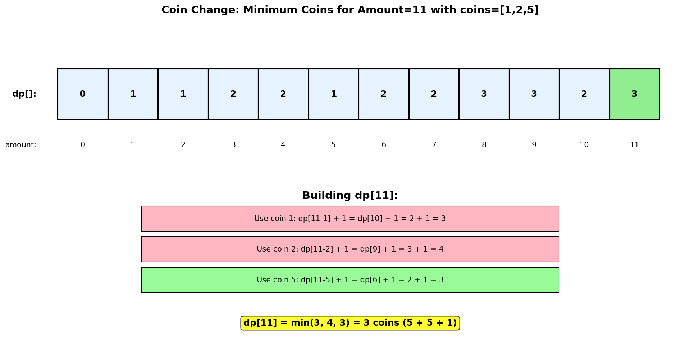
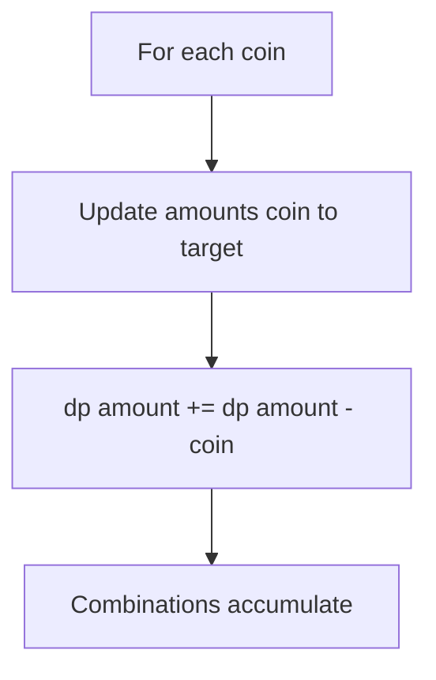
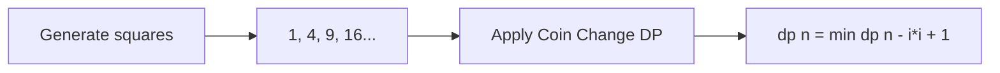
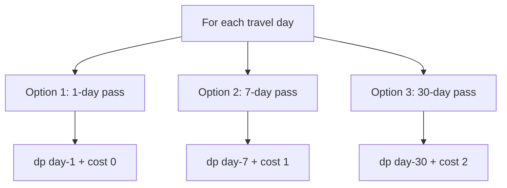
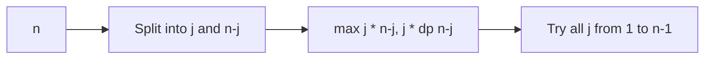

# Coin Change

## Problem Statement

You are given an integer array `coins` representing coins of different denominations and an integer `amount` representing a total amount of money. Return the **fewest number of coins** that you need to make up that amount. If that amount of money cannot be made up by any combination of the coins, return `-1`.

You may assume that you have an **infinite number** of each kind of coin.

## Input/Output Format

**Input:**
- `coins` (List[int]): Array of coin denominations
- `amount` (int): Target amount to achieve

**Output:**
- (int): Minimum number of coins needed, or -1 if impossible

## Constraints

- `1 <= coins.length <= 12`
- `1 <= coins[i] <= 2^31 - 1`
- `0 <= amount <= 10^4`

## Examples

### Example 1: Standard Case

**Input:** `coins = [1, 2, 5]`, `amount = 11`

**Output:** `3`

**Explanation:**
11 = 5 + 5 + 1 (3 coins)

```
Possible combinations:
=====================
11 = 5 + 5 + 1     = 3 coins  <-- Optimal
11 = 5 + 2 + 2 + 2 = 4 coins
11 = 5 + 2 + 2 + 1 + 1 = 5 coins
11 = 2 + 2 + 2 + 2 + 2 + 1 = 6 coins
... and many more

Greedy doesn't always work!
For amount = 11, coins = [1, 5, 6]:
Greedy: 6 + 5 = 11 (2 coins) - happens to be optimal
For amount = 10, coins = [1, 5, 6]:
Greedy: 6 + 1 + 1 + 1 + 1 = 10 (5 coins)
Optimal: 5 + 5 = 10 (2 coins)
```

### Example 2: Impossible Case

**Input:** `coins = [2]`, `amount = 3`

**Output:** `-1`

**Explanation:**
Cannot make amount 3 with only coin denomination 2.

```
With only coin 2:
- 2 coins = 4 (too much)
- 1 coin = 2 (too little)
- No way to make exactly 3
```

### Example 3: Zero Amount

**Input:** `coins = [1]`, `amount = 0`

**Output:** `0`

**Explanation:**
No coins needed to make amount 0.

### Example 4: Single Coin Type

**Input:** `coins = [1]`, `amount = 5`

**Output:** `5`

**Explanation:**
5 = 1 + 1 + 1 + 1 + 1 (5 coins)

## Visual Explanation



## ASCII Art: DP Table Building

```
coins = [1, 2, 5], amount = 11

DP Table: dp[i] = minimum coins needed for amount i
        (INF means impossible)

Amount:    0    1    2    3    4    5    6    7    8    9   10   11
         +----+----+----+----+----+----+----+----+----+----+----+----+
dp[]:    | 0  | 1  | 1  | 2  | 2  | 1  | 2  | 2  | 3  | 3  | 2  | 3  |
         +----+----+----+----+----+----+----+----+----+----+----+----+

Building dp[11]:
================
For each coin c in [1, 2, 5]:
  - coin 1: dp[11-1] + 1 = dp[10] + 1 = 2 + 1 = 3
  - coin 2: dp[11-2] + 1 = dp[9] + 1 = 3 + 1 = 4
  - coin 5: dp[11-5] + 1 = dp[6] + 1 = 2 + 1 = 3

dp[11] = min(3, 4, 3) = 3

Reconstruction: 11 -> 6 (used 5) -> 1 (used 5) -> 0 (used 1)
Answer: [5, 5, 1] = 3 coins
```

## Solution Code

### Approach 1: Top-Down (Memoization)

```python
from typing import List
from functools import lru_cache

def coinChange(coins: List[int], amount: int) -> int:
    """
    Find minimum coins using memoization.

    For each amount, try using each coin and take the minimum.

    Args:
        coins: Available coin denominations
        amount: Target amount

    Returns:
        Minimum number of coins, or -1 if impossible

    Time Complexity: O(amount * len(coins))
    Space Complexity: O(amount)
    """
    @lru_cache(maxsize=None)
    def dp(remaining: int) -> int:
        """Return min coins needed for remaining amount."""
        # Base cases
        if remaining == 0:
            return 0
        if remaining < 0:
            return float('inf')

        # Try each coin
        min_coins = float('inf')
        for coin in coins:
            result = dp(remaining - coin)
            if result != float('inf'):
                min_coins = min(min_coins, result + 1)

        return min_coins

    result = dp(amount)
    return result if result != float('inf') else -1
```

::: info Complexity: Time O(amount * n) · Space O(amount)
- **Time:** Each amount from 0 to target is computed once via memoization. For each amount, we try all n coin denominations.
- **Space:** The memoization cache stores at most amount+1 entries, plus recursion stack depth proportional to amount.
:::

### Approach 2: Bottom-Up (Tabulation)

```python
from typing import List

def coinChange(coins: List[int], amount: int) -> int:
    """
    Find minimum coins using bottom-up DP.

    Build solution from amount 0 to target amount.

    Args:
        coins: Available coin denominations
        amount: Target amount

    Returns:
        Minimum number of coins, or -1 if impossible

    Time Complexity: O(amount * len(coins))
    Space Complexity: O(amount)
    """
    # dp[i] = minimum coins needed for amount i
    # Initialize with amount + 1 (impossible value)
    dp = [amount + 1] * (amount + 1)
    dp[0] = 0  # 0 coins for amount 0

    for i in range(1, amount + 1):
        for coin in coins:
            if coin <= i:
                dp[i] = min(dp[i], dp[i - coin] + 1)

    return dp[amount] if dp[amount] <= amount else -1
```

::: info Complexity: Time O(amount * n) · Space O(amount)
- **Time:** Outer loop runs amount times, inner loop tries all n coins for each amount, giving O(amount * n) total operations.
- **Space:** The dp array of size amount+1 stores the minimum coins needed for each sub-amount.
:::

### Approach 3: BFS (Shortest Path)

```python
from typing import List
from collections import deque

def coinChange(coins: List[int], amount: int) -> int:
    """
    Find minimum coins using BFS.

    Treat this as a shortest path problem where each state
    is a remaining amount and edges are coin choices.

    Args:
        coins: Available coin denominations
        amount: Target amount

    Returns:
        Minimum number of coins, or -1 if impossible

    Time Complexity: O(amount * len(coins))
    Space Complexity: O(amount)
    """
    if amount == 0:
        return 0

    visited = [False] * (amount + 1)
    queue = deque([amount])
    visited[amount] = True
    level = 0

    while queue:
        level += 1
        for _ in range(len(queue)):
            curr = queue.popleft()

            for coin in coins:
                remaining = curr - coin

                if remaining == 0:
                    return level

                if remaining > 0 and not visited[remaining]:
                    visited[remaining] = True
                    queue.append(remaining)

    return -1
```

::: info Complexity: Time O(amount * n) · Space O(amount)
- **Time:** BFS visits each reachable amount at most once. For each visited state, we try all n coin transitions.
- **Space:** The visited array and queue can each hold up to amount elements in the worst case.
:::

### Approach 4: With Coin Tracking

```python
from typing import List, Tuple

def coinChangeWithCoins(coins: List[int], amount: int) -> Tuple[int, List[int]]:
    """
    Find minimum coins and return the actual coins used.

    Args:
        coins: Available coin denominations
        amount: Target amount

    Returns:
        Tuple of (minimum coins, list of coins used)

    Time Complexity: O(amount * len(coins))
    Space Complexity: O(amount)
    """
    if amount == 0:
        return (0, [])

    dp = [amount + 1] * (amount + 1)
    dp[0] = 0

    # Track which coin was used to reach each amount
    parent = [-1] * (amount + 1)

    for i in range(1, amount + 1):
        for coin in coins:
            if coin <= i and dp[i - coin] + 1 < dp[i]:
                dp[i] = dp[i - coin] + 1
                parent[i] = coin

    if dp[amount] > amount:
        return (-1, [])

    # Reconstruct the coins used
    coins_used = []
    current = amount
    while current > 0:
        coin = parent[current]
        coins_used.append(coin)
        current -= coin

    return (dp[amount], coins_used)
```

::: info Complexity: Time O(amount * n) · Space O(amount)
- **Time:** Same as Approach 2, with additional O(amount) work to reconstruct the coins used by following parent pointers.
- **Space:** Two arrays of size amount+1 (dp and parent) for tracking both minimum coins and which coin was used.
:::

## Complexity Analysis

| Approach | Time Complexity | Space Complexity |
|----------|----------------|------------------|
| Top-Down (Memoization) | O(amount * n) | O(amount) |
| Bottom-Up (Tabulation) | O(amount * n) | O(amount) |
| BFS | O(amount * n) | O(amount) |

Where n = number of coin denominations.

## Edge Cases

1. **Amount is 0:**
   ```python
   coinChange([1, 2, 5], 0)  # Returns 0
   ```

2. **Single coin that divides evenly:**
   ```python
   coinChange([5], 10)  # Returns 2 (5 + 5)
   ```

3. **Single coin that doesn't divide evenly:**
   ```python
   coinChange([5], 11)  # Returns -1
   ```

4. **Coin equals amount:**
   ```python
   coinChange([1, 5, 10], 5)  # Returns 1
   ```

5. **Large coin denominations:**
   ```python
   coinChange([100, 200], 50)  # Returns -1
   ```

6. **Amount smaller than all coins:**
   ```python
   coinChange([5, 10], 3)  # Returns -1
   ```

## Key Insights

1. **Unbounded Knapsack Variant**: This is a classic unbounded knapsack problem where each coin can be used unlimited times.

2. **Optimal Substructure**: The minimum coins for amount `a` can be computed from minimum coins for amount `a - coin` for each coin.

3. **Greedy Doesn't Work**: A greedy approach (always pick largest coin) fails for cases like coins=[1,3,4], amount=6 where greedy gives 4+1+1=3 coins but optimal is 3+3=2 coins.

4. **State Definition**: `dp[i]` = minimum number of coins needed to make amount `i`.

5. **Recurrence Relation**: `dp[i] = min(dp[i - coin] + 1)` for all valid coins.

6. **Initialization**: Use `amount + 1` or `infinity` as impossible marker, not `-1`, to make min comparisons work correctly.

## Related Problems

::: details Coin Change II (LeetCode 518)
**Problem:** Count the number of distinct combinations to make up the target amount using given coins (unlimited supply).

**Key Insight:** Unlike Coin Change I (minimizing), this counts combinations. Iterate coins in outer loop to avoid counting permutations.



**Approach:** `dp[a] += dp[a - coin]` with outer loop over coins. This ensures each combination is counted once, not each permutation.

**Complexity:** O(amount * n) time, O(amount) space
:::

::: details Perfect Squares (LeetCode 279)
**Problem:** Given integer n, find the minimum number of perfect square numbers (1, 4, 9, 16, ...) that sum to n.

**Key Insight:** Identical structure to Coin Change, but "coins" are perfect squares up to sqrt(n).



**Approach:** `dp[n] = min(dp[n - i*i] + 1)` for all i where i*i <= n. Every number can be represented (by Lagrange's Four Square Theorem, max 4).

**Complexity:** O(n * sqrt(n)) time, O(n) space
:::

::: details Minimum Cost For Tickets (LeetCode 983)
**Problem:** Given travel days and ticket costs for 1-day, 7-day, 30-day passes, find minimum cost to cover all travel days.

**Key Insight:** Similar unbounded knapsack but with variable "coverage" per ticket type.



**Approach:** `dp[d] = min(dp[d-1] + cost[0], dp[d-7] + cost[1], dp[d-30] + cost[2])` on travel days.

**Complexity:** O(max(days)) time, O(max(days)) space
:::

::: details Integer Break (LeetCode 343)
**Problem:** Given integer n >= 2, break it into sum of positive integers and maximize their product.

**Key Insight:** Similar DP structure but maximize product instead of minimize count. Choose optimal split point.



**Approach:** `dp[i] = max(j * (i-j), j * dp[i-j])` for j in [1, i-1]. The key is choosing between (i-j) directly or dp[i-j].

**Complexity:** O(n^2) time, O(n) space
:::
