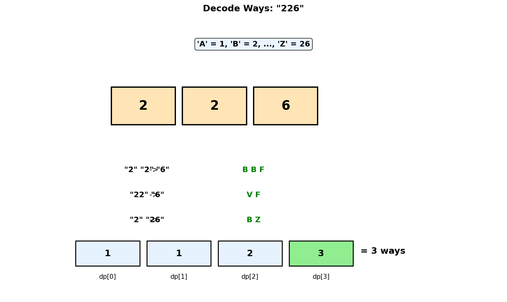
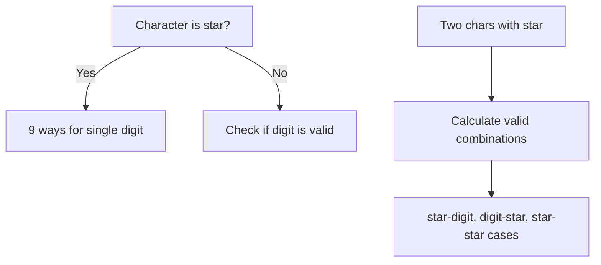
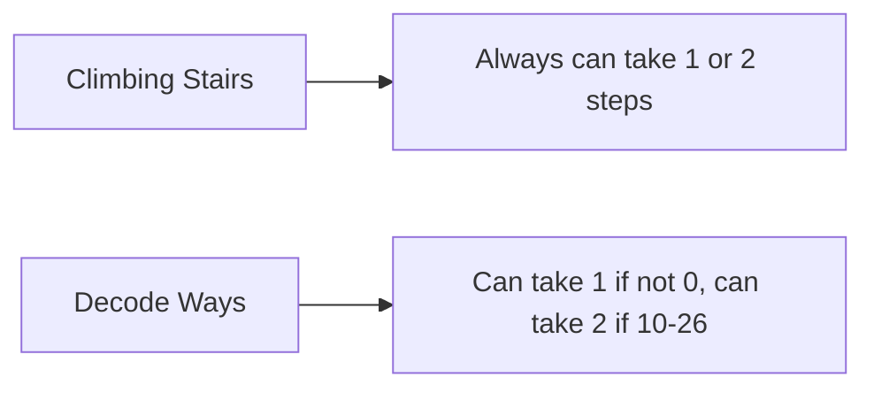
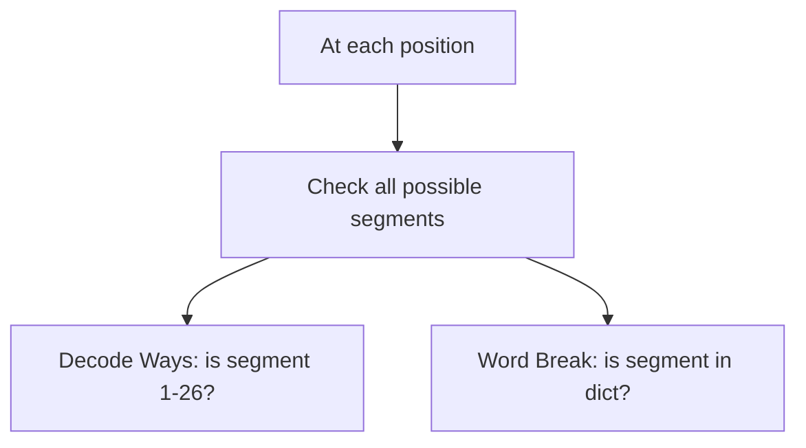
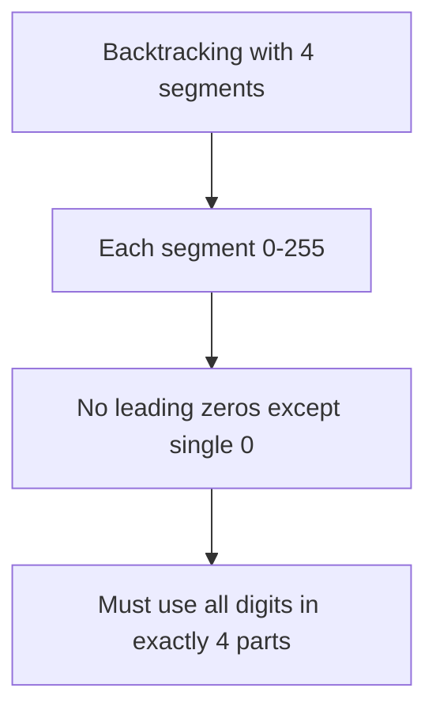

# Decode Ways

## Problem Statement

A message containing letters from `A-Z` can be **encoded** into numbers using the following mapping:

```
'A' -> "1"
'B' -> "2"
...
'Z' -> "26"
```

To **decode** an encoded message, all the digits must be grouped then mapped back into letters using the reverse of the mapping above (there may be multiple ways).

Given a string `s` containing only digits, return the **number of ways** to decode it. The test cases are generated so that the answer fits in a **32-bit** integer.

**Note**: The grouping can only be done with valid codes (1-26). A string with leading zeros or codes > 26 is invalid.

## Input/Output Format

**Input:**
- `s` (str): A string of digits

**Output:**
- (int): Number of ways to decode the string

## Constraints

- `1 <= s.length <= 100`
- `s` contains only digits and may contain leading zero(s)

## Examples

### Example 1: Multiple Decodings

**Input:** `s = "226"`

**Output:** `3`

**Explanation:**
```
"226" can be decoded as:
1. "2" "2" "6"  -> B B F
2. "22" "6"    -> V F
3. "2" "26"    -> B Z

Total: 3 ways

Breakdown:
- "2" is valid (B)
- "22" is valid (V)
- "26" is valid (Z)
- "6" is valid (F)
```

### Example 2: Single Decoding

**Input:** `s = "12"`

**Output:** `2`

**Explanation:**
```
"12" can be decoded as:
1. "1" "2"  -> A B
2. "12"    -> L

Total: 2 ways
```

### Example 3: Leading Zero

**Input:** `s = "06"`

**Output:** `0`

**Explanation:**
```
"06" cannot be decoded.
- "0" is not a valid code
- "06" is not a valid code (leading zero)

No valid decodings exist.
```

### Example 4: Zero in Middle

**Input:** `s = "10"`

**Output:** `1`

**Explanation:**
```
"10" can only be decoded as:
- "10" -> J

"1" "0" is invalid because "0" is not a valid code.

Total: 1 way
```

## Visual Explanation



## ASCII Art: DP Table Building

```
s = "226"

Character codes: 'A'=1, 'B'=2, ..., 'Z'=26

DP Array: dp[i] = number of ways to decode s[0:i]

Index:    0    1    2    3
String:   _    2    2    6
        +----+----+----+----+
dp[]:   | 1  | 1  | 2  | 3  |
        +----+----+----+----+
          ^    ^    ^    ^
          |    |    |    |
     base  "2" "22" or "226"
     case      "2"+"2"   combinations

Building dp[3] (s = "226"):
===========================
Option 1: Single digit - s[2] = "6"
  - "6" is valid (1-9)
  - Add dp[2] = 2 ways

Option 2: Two digits - s[1:3] = "26"
  - "26" is valid (10-26)
  - Add dp[1] = 1 way

dp[3] = dp[2] + dp[1] = 2 + 1 = 3

Answer: dp[3] = 3
```

## Solution Code

### Approach 1: Top-Down (Memoization)

```python
from functools import lru_cache

def numDecodings(s: str) -> int:
    """
    Count decoding ways using memoization.

    At each position, try decoding 1 or 2 digits.

    Args:
        s: String of digits

    Returns:
        Number of decoding ways

    Time Complexity: O(n)
    Space Complexity: O(n)
    """
    n = len(s)

    @lru_cache(maxsize=None)
    def dp(i: int) -> int:
        """Return number of ways to decode s[i:]."""
        # Base case: reached end
        if i == n:
            return 1

        # Invalid: leading zero
        if s[i] == '0':
            return 0

        # Decode single digit (always valid if not '0')
        ways = dp(i + 1)

        # Try decoding two digits
        if i + 1 < n:
            two_digit = int(s[i:i + 2])
            if 10 <= two_digit <= 26:
                ways += dp(i + 2)

        return ways

    return dp(0)
```

### Approach 2: Bottom-Up (Tabulation)

```python
def numDecodings(s: str) -> int:
    """
    Count decoding ways using bottom-up DP.

    dp[i] = number of ways to decode s[0:i]

    Args:
        s: String of digits

    Returns:
        Number of decoding ways

    Time Complexity: O(n)
    Space Complexity: O(n)
    """
    n = len(s)

    # Edge case: starts with '0'
    if s[0] == '0':
        return 0

    # dp[i] = ways to decode s[0:i]
    dp = [0] * (n + 1)
    dp[0] = 1  # Empty string (base case)
    dp[1] = 1  # First character (already checked non-zero)

    for i in range(2, n + 1):
        # Single digit: s[i-1]
        if s[i - 1] != '0':
            dp[i] += dp[i - 1]

        # Two digits: s[i-2:i]
        two_digit = int(s[i - 2:i])
        if 10 <= two_digit <= 26:
            dp[i] += dp[i - 2]

    return dp[n]
```

### Approach 3: Space-Optimized

```python
def numDecodings(s: str) -> int:
    """
    Count decoding ways with O(1) space.

    Only need the previous two values.

    Args:
        s: String of digits

    Returns:
        Number of decoding ways

    Time Complexity: O(n)
    Space Complexity: O(1)
    """
    n = len(s)

    if s[0] == '0':
        return 0

    # prev2 = dp[i-2], prev1 = dp[i-1]
    prev2 = 1  # dp[0]
    prev1 = 1  # dp[1]

    for i in range(2, n + 1):
        current = 0

        # Single digit
        if s[i - 1] != '0':
            current += prev1

        # Two digits
        two_digit = int(s[i - 2:i])
        if 10 <= two_digit <= 26:
            current += prev2

        prev2 = prev1
        prev1 = current

    return prev1
```

### Approach 4: With Decoding Output

```python
from typing import List

def decodeWays_all(s: str) -> List[str]:
    """
    Return all possible decodings of the string.

    Args:
        s: String of digits

    Returns:
        List of all valid decoded strings

    Time Complexity: O(2^n) worst case
    Space Complexity: O(n * 2^n)
    """
    def decode_char(code: int) -> str:
        """Convert number 1-26 to character A-Z."""
        return chr(ord('A') + code - 1)

    def backtrack(index: int, current: List[str]) -> List[str]:
        """Generate all decodings starting from index."""
        if index == len(s):
            return [''.join(current)]

        if s[index] == '0':
            return []

        results = []

        # Single digit
        current.append(decode_char(int(s[index])))
        results.extend(backtrack(index + 1, current))
        current.pop()

        # Two digits
        if index + 1 < len(s):
            two_digit = int(s[index:index + 2])
            if 10 <= two_digit <= 26:
                current.append(decode_char(two_digit))
                results.extend(backtrack(index + 2, current))
                current.pop()

        return results

    return backtrack(0, [])
```

## Complexity Analysis

| Approach | Time Complexity | Space Complexity |
|----------|----------------|------------------|
| Top-Down (Memoization) | O(n) | O(n) |
| Bottom-Up (Tabulation) | O(n) | O(n) |
| Space-Optimized | O(n) | O(1) |

## Edge Cases

1. **Starts with '0':**
   ```python
   numDecodings("0")    # Returns 0
   numDecodings("06")   # Returns 0
   ```

2. **Contains '0' in middle:**
   ```python
   numDecodings("10")   # Returns 1 ("J")
   numDecodings("20")   # Returns 1 ("T")
   numDecodings("30")   # Returns 0 (invalid)
   numDecodings("100")  # Returns 0 (trailing "00" invalid)
   ```

3. **All '1's or '2's:**
   ```python
   numDecodings("11111")  # Returns 8 (Fibonacci-like)
   numDecodings("22222")  # Returns 8
   ```

4. **Large numbers:**
   ```python
   numDecodings("27")   # Returns 1 ("2" "7" only)
   numDecodings("99")   # Returns 1 ("9" "9" only)
   ```

5. **Single digit:**
   ```python
   numDecodings("1")   # Returns 1
   numDecodings("9")   # Returns 1
   ```

## Valid Two-Digit Codes

```
10-26 are valid two-digit codes:
- 10: J
- 11: K
- 12: L
- 13: M
- 14: N
- 15: O
- 16: P
- 17: Q
- 18: R
- 19: S
- 20: T
- 21: U
- 22: V
- 23: W
- 24: X
- 25: Y
- 26: Z

Invalid two-digit combinations:
- 00-09: Leading zeros
- 27-99: No corresponding letter
```

## Key Insights

1. **Similar to Climbing Stairs**: This problem has a Fibonacci-like structure, but with additional constraints based on digit validity.

2. **Zero Handling**: '0' cannot be decoded alone. It must be part of "10" or "20".

3. **State Definition**: `dp[i]` = number of ways to decode `s[0:i]`.

4. **Recurrence**:
   - If `s[i-1] != '0'`: add `dp[i-1]` (single digit valid)
   - If `10 <= int(s[i-2:i]) <= 26`: add `dp[i-2]` (two digits valid)

5. **Base Cases**:
   - `dp[0] = 1` (empty string - one way to decode nothing)
   - `dp[1] = 1` if `s[0] != '0'`, else `0`

## Related Problems

::: details Decode Ways II (LeetCode 639)
**Problem:** Same as Decode Ways but string can contain '*' which represents any digit 1-9.

**Key Insight:** Handle '*' by summing over all possible digit values. Track contributions from single-char and two-char decodings.



**Approach:** For single `*`: contributes 9 ways. For `**`: contributes 15 ways (11-19 and 21-26). For `*d`: depends on d. For `d*`: depends on d.

**Complexity:** O(n) time, O(1) space
:::

::: details Climbing Stairs (LeetCode 70)
**Problem:** You can climb 1 or 2 steps. Count distinct ways to reach the top of n steps.

**Key Insight:** Pure Fibonacci - Decode Ways is essentially Climbing Stairs with validity constraints on "steps" (digits).



**Approach:** `dp[i] = dp[i-1] + dp[i-2]`. Decode Ways adds: single digit must be 1-9, double digit must be 10-26.

**Complexity:** O(n) time, O(1) space
:::

::: details Word Break (LeetCode 139)
**Problem:** Check if string can be segmented into space-separated dictionary words.

**Key Insight:** Similar segmentation structure. Instead of checking digit validity (1-26), check dictionary membership.



**Approach:** `dp[i] = True if dp[j] and s[j:i] in dict` for some j < i. Similar to checking if two-digit code is valid.

**Complexity:** O(n^2 * m) time where m = max word length, O(n) space
:::

::: details Restore IP Addresses (LeetCode 93)
**Problem:** Given digit string, return all valid IP addresses (4 parts, each 0-255, no leading zeros except "0").

**Key Insight:** Similar digit grouping but with 4 segments constraint and 0-255 range instead of 1-26.



**Approach:** Backtrack trying 1, 2, or 3 digit segments at each step. Validate range [0, 255] and no leading zeros. Must have exactly 4 parts using all digits.

**Complexity:** O(3^4) = O(1) time (bounded), O(1) space for output
:::
