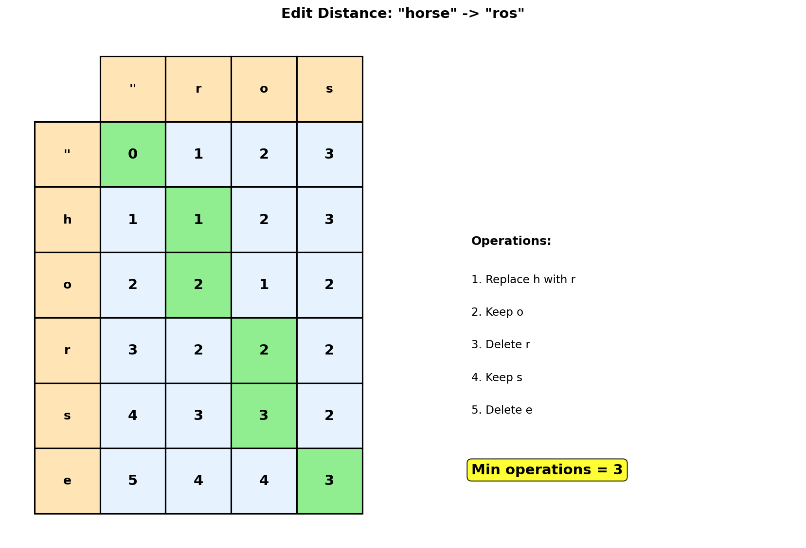
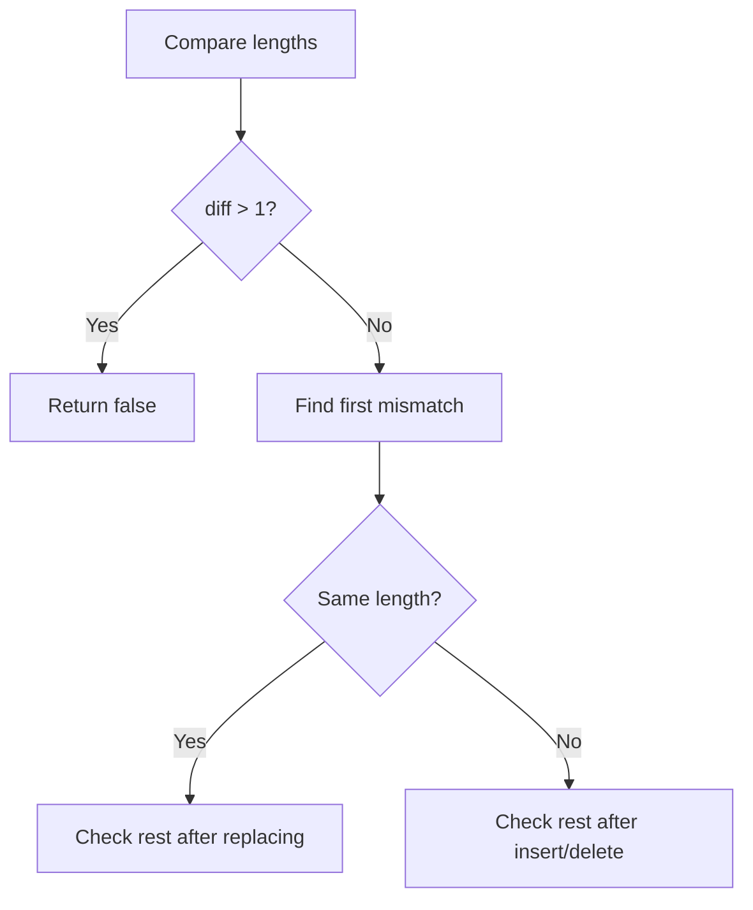
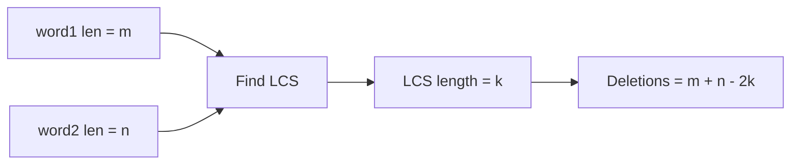
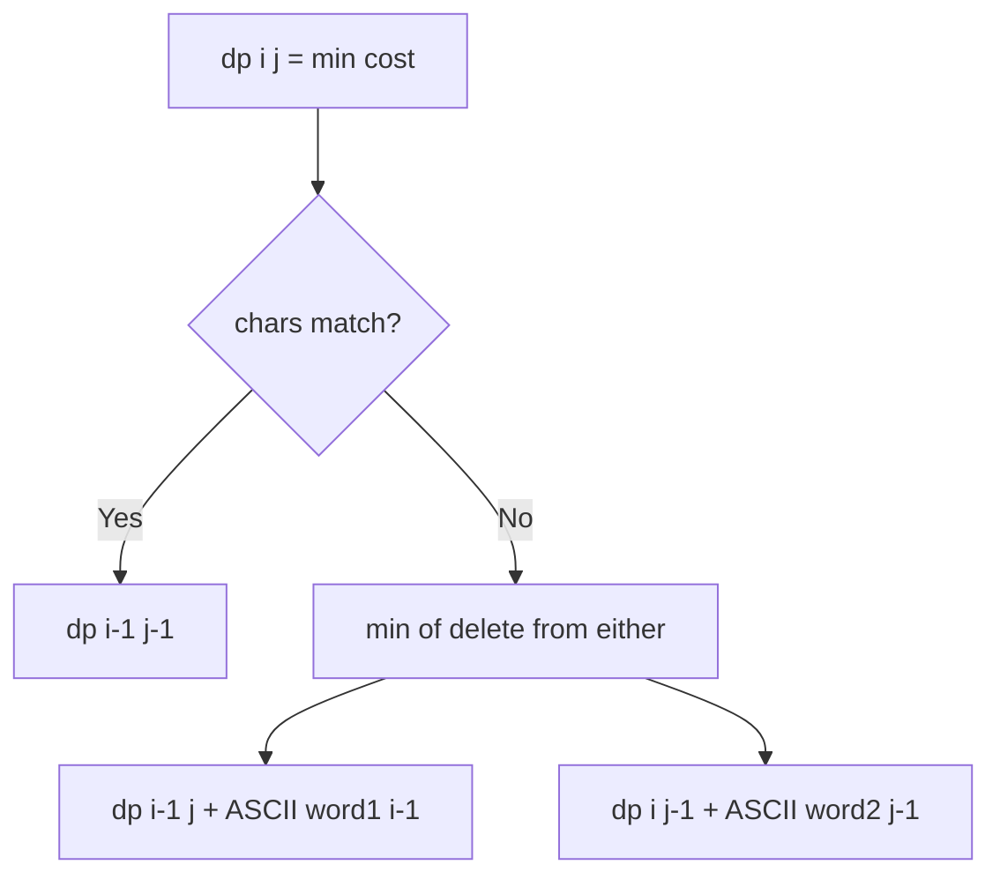
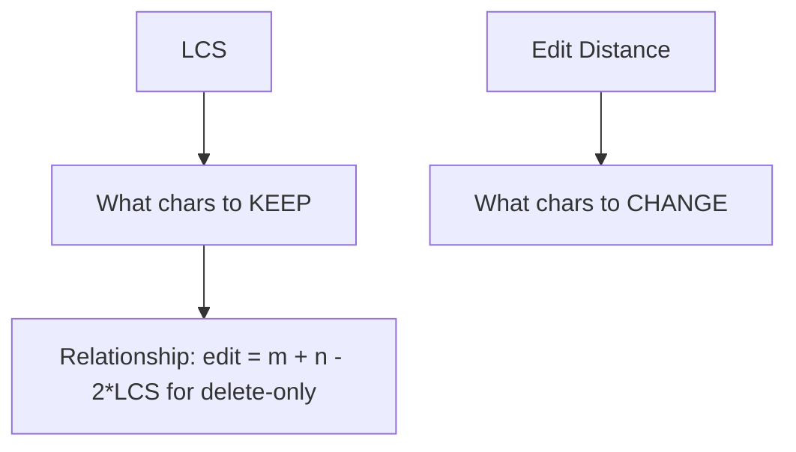

# Edit Distance (Levenshtein Distance)

## Problem Statement

Given two strings `word1` and `word2`, return the minimum number of operations required to convert `word1` to `word2`.

You have the following three operations permitted on a word:
- **Insert** a character
- **Delete** a character
- **Replace** a character

This problem is also known as the **Levenshtein Distance** and has applications in spell checking, DNA sequence alignment, and plagiarism detection.

## Input/Output Format

**Input:**
- `word1` (str): Source string to transform
- `word2` (str): Target string

**Output:**
- (int): Minimum number of operations to transform word1 to word2

## Constraints

- `0 <= word1.length, word2.length <= 500`
- `word1` and `word2` consist of lowercase English letters

## Examples

### Example 1: Standard Case

**Input:** `word1 = "horse"`, `word2 = "ros"`

**Output:** `3`

**Explanation:**
```
horse -> rorse (replace 'h' with 'r')
rorse -> rose  (delete 'r')
rose  -> ros   (delete 'e')

Total: 3 operations
```

### Example 2: Longer Transformation

**Input:** `word1 = "intention"`, `word2 = "execution"`

**Output:** `5`

**Explanation:**
```
intention -> inention  (delete 't')
inention  -> enention  (replace 'i' with 'e')
enention  -> exention  (replace 'n' with 'x')
exention  -> exection  (replace 'n' with 'c')
exection  -> execution (insert 'u')

Total: 5 operations
```

### Example 3: Empty String

**Input:** `word1 = ""`, `word2 = "abc"`

**Output:** `3`

**Explanation:**
Insert 'a', insert 'b', insert 'c'.

### Example 4: Same Strings

**Input:** `word1 = "abc"`, `word2 = "abc"`

**Output:** `0`

**Explanation:**
No operations needed.

## Visual Explanation



## ASCII Art: DP Table Building

```
word1 = "horse", word2 = "ros"

DP Table: dp[i][j] = min operations to convert word1[0..i-1] to word2[0..j-1]

            ""    r    o    s
          +----+----+----+----+
    ""    | 0  | 1  | 2  | 3  |  <- insert all of word2
          +----+----+----+----+
    h     | 1  | 1  | 2  | 3  |  <- h != r, replace
          +----+----+----+----+
    o     | 2  | 2  | 1  | 2  |  <- o == o, diagonal
          +----+----+----+----+
    r     | 3  | 2  | 2  | 2  |  <- r == r, but...
          +----+----+----+----+
    s     | 4  | 3  | 3  | 2  |  <- s == s, diagonal
          +----+----+----+----+
    e     | 5  | 4  | 4  | 3  |  <- e != s, min+1
          +----+----+----+----+
          ^
          |
      delete all of word1

Recurrence:
If word1[i-1] == word2[j-1]:
    dp[i][j] = dp[i-1][j-1]           (no operation needed)
Else:
    dp[i][j] = 1 + min(
        dp[i-1][j-1],  (replace)
        dp[i-1][j],    (delete from word1)
        dp[i][j-1]     (insert into word1)
    )

Answer: dp[5][3] = 3
```

## Solution Code

### Approach 1: Top-Down (Memoization)

```python
from functools import lru_cache

def minDistance(word1: str, word2: str) -> int:
    """
    Find minimum edit distance using memoization.

    At each position, if characters match, move diagonally.
    Otherwise, try all three operations and take minimum.

    Args:
        word1: Source string
        word2: Target string

    Returns:
        Minimum number of operations

    Time Complexity: O(m * n)
    Space Complexity: O(m * n)
    """
    @lru_cache(maxsize=None)
    def dp(i: int, j: int) -> int:
        """
        Return min operations to convert word1[i:] to word2[j:].
        """
        # Base cases
        if i == len(word1):
            return len(word2) - j  # Insert remaining chars
        if j == len(word2):
            return len(word1) - i  # Delete remaining chars

        if word1[i] == word2[j]:
            # Characters match, no operation needed
            return dp(i + 1, j + 1)
        else:
            # Try all three operations
            replace = dp(i + 1, j + 1)  # Replace word1[i] with word2[j]
            delete = dp(i + 1, j)        # Delete word1[i]
            insert = dp(i, j + 1)        # Insert word2[j]
            return 1 + min(replace, delete, insert)

    return dp(0, 0)
```

::: info Complexity: Time O(m * n) · Space O(m * n)
- **Time:** Each (i, j) state is computed once via memoization. With m characters in word1 and n in word2, there are O(m * n) unique states.
- **Space:** The cache stores O(m * n) entries, plus recursion stack depth of O(m + n) in the worst case.
:::

### Approach 2: Bottom-Up (Tabulation)

::: code-group
```python [Python]
def minDistance(word1: str, word2: str) -> int:
    """
    Find minimum edit distance using bottom-up DP.

    Build a 2D table where dp[i][j] represents minimum operations
    to convert word1[0..i-1] to word2[0..j-1].

    Args:
        word1: Source string
        word2: Target string

    Returns:
        Minimum number of operations

    Time Complexity: O(m * n)
    Space Complexity: O(m * n)
    """
    m, n = len(word1), len(word2)

    # dp[i][j] = min ops to convert word1[0..i-1] to word2[0..j-1]
    dp = [[0] * (n + 1) for _ in range(m + 1)]

    # Base cases: converting to/from empty string
    for i in range(m + 1):
        dp[i][0] = i  # Delete all characters
    for j in range(n + 1):
        dp[0][j] = j  # Insert all characters

    # Fill the table
    for i in range(1, m + 1):
        for j in range(1, n + 1):
            if word1[i - 1] == word2[j - 1]:
                dp[i][j] = dp[i - 1][j - 1]  # No operation
            else:
                dp[i][j] = 1 + min(
                    dp[i - 1][j - 1],  # Replace
                    dp[i - 1][j],      # Delete
                    dp[i][j - 1]       # Insert
                )

    return dp[m][n]
```

```java [Java]
public int minDistance(String word1, String word2) {
    int m = word1.length(), n = word2.length();

    // dp[i][j] = min ops to convert word1[0..i-1] to word2[0..j-1]
    int[][] dp = new int[m + 1][n + 1];

    // Base cases: converting to/from empty string
    for (int i = 0; i <= m; i++) dp[i][0] = i; // Delete all characters
    for (int j = 0; j <= n; j++) dp[0][j] = j; // Insert all characters

    // Fill the table
    for (int i = 1; i <= m; i++) {
        for (int j = 1; j <= n; j++) {
            if (word1.charAt(i - 1) == word2.charAt(j - 1)) {
                dp[i][j] = dp[i - 1][j - 1]; // No operation
            } else {
                dp[i][j] = 1 + Math.min(
                    dp[i - 1][j - 1],  // Replace
                    Math.min(
                        dp[i - 1][j],  // Delete
                        dp[i][j - 1]   // Insert
                    )
                );
            }
        }
    }

    return dp[m][n];
}
```
:::

::: info Complexity: Time O(m * n) · Space O(m * n)
- **Time:** Two nested loops fill all (m+1) * (n+1) cells with constant-time operations per cell.
- **Space:** The 2D dp table stores edit distances for all prefix combinations of both strings.
:::

### Approach 3: Space-Optimized

```python
def minDistance(word1: str, word2: str) -> int:
    """
    Find minimum edit distance with O(n) space.

    Since we only need the previous row, optimize space.

    Args:
        word1: Source string
        word2: Target string

    Returns:
        Minimum number of operations

    Time Complexity: O(m * n)
    Space Complexity: O(min(m, n))
    """
    # Ensure word2 is shorter for space optimization
    if len(word1) < len(word2):
        word1, word2 = word2, word1

    m, n = len(word1), len(word2)

    # Previous and current row
    prev = list(range(n + 1))
    curr = [0] * (n + 1)

    for i in range(1, m + 1):
        curr[0] = i  # Delete all from word1[0..i-1]

        for j in range(1, n + 1):
            if word1[i - 1] == word2[j - 1]:
                curr[j] = prev[j - 1]
            else:
                curr[j] = 1 + min(
                    prev[j - 1],  # Replace
                    prev[j],      # Delete
                    curr[j - 1]   # Insert
                )

        prev, curr = curr, prev

    return prev[n]
```

::: info Complexity: Time O(m * n) · Space O(min(m, n))
- **Time:** Same O(m * n) iterations processing all state pairs row by row.
- **Space:** Only two arrays of size n+1 are maintained. By swapping words if needed, n is the shorter length.
:::

### Approach 4: Get Edit Operations

```python
from typing import List, Tuple

def minDistance_with_operations(word1: str, word2: str) -> Tuple[int, List[str]]:
    """
    Find minimum edit distance and return the actual operations.

    Args:
        word1: Source string
        word2: Target string

    Returns:
        Tuple of (distance, list of operations)

    Time Complexity: O(m * n)
    Space Complexity: O(m * n)
    """
    m, n = len(word1), len(word2)
    dp = [[0] * (n + 1) for _ in range(m + 1)]

    for i in range(m + 1):
        dp[i][0] = i
    for j in range(n + 1):
        dp[0][j] = j

    for i in range(1, m + 1):
        for j in range(1, n + 1):
            if word1[i - 1] == word2[j - 1]:
                dp[i][j] = dp[i - 1][j - 1]
            else:
                dp[i][j] = 1 + min(
                    dp[i - 1][j - 1],
                    dp[i - 1][j],
                    dp[i][j - 1]
                )

    # Backtrack to find operations
    operations = []
    i, j = m, n

    while i > 0 or j > 0:
        if i > 0 and j > 0 and word1[i - 1] == word2[j - 1]:
            # No operation, characters match
            i -= 1
            j -= 1
        elif i > 0 and j > 0 and dp[i][j] == dp[i - 1][j - 1] + 1:
            # Replace
            operations.append(f"Replace '{word1[i-1]}' with '{word2[j-1]}' at position {i-1}")
            i -= 1
            j -= 1
        elif i > 0 and dp[i][j] == dp[i - 1][j] + 1:
            # Delete
            operations.append(f"Delete '{word1[i-1]}' at position {i-1}")
            i -= 1
        else:
            # Insert
            operations.append(f"Insert '{word2[j-1]}' at position {i}")
            j -= 1

    return dp[m][n], operations[::-1]
```

::: info Complexity: Time O(m * n) · Space O(m * n)
- **Time:** O(m * n) to build the DP table, plus O(m + n) to backtrack and reconstruct the sequence of operations.
- **Space:** The full 2D table is required for backtracking to determine which operation was taken at each step.
:::

## Complexity Analysis

| Approach | Time Complexity | Space Complexity |
|----------|----------------|------------------|
| Top-Down (Memoization) | O(m * n) | O(m * n) |
| Bottom-Up (Tabulation) | O(m * n) | O(m * n) |
| Space-Optimized | O(m * n) | O(min(m, n)) |

## Edge Cases

1. **Both empty:**
   ```python
   minDistance("", "")  # Returns 0
   ```

2. **One empty:**
   ```python
   minDistance("abc", "")  # Returns 3 (delete all)
   minDistance("", "xyz")  # Returns 3 (insert all)
   ```

3. **Same strings:**
   ```python
   minDistance("hello", "hello")  # Returns 0
   ```

4. **Single character difference:**
   ```python
   minDistance("a", "b")  # Returns 1 (replace)
   ```

5. **Completely different:**
   ```python
   minDistance("abc", "xyz")  # Returns 3 (replace all)
   ```

6. **Substring relationship:**
   ```python
   minDistance("abc", "ab")   # Returns 1 (delete 'c')
   minDistance("ab", "abc")   # Returns 1 (insert 'c')
   ```

## Understanding Operations

```
Convert "horse" to "ros":

Initial: h o r s e
Target:  r o s

Step 1: Replace 'h' with 'r'
        r o r s e

Step 2: Delete 'r' (the second one)
        r o s e

Step 3: Delete 'e'
        r o s

Total: 3 operations

Alternative path (also 3 ops):
Step 1: Delete 'h'    -> o r s e
Step 2: Delete 'r'    -> o s e
Step 3: Delete 'e'    -> o s
Step 4: Insert 'r'    -> r o s
Wait, that's 4 operations!

The DP finds the OPTIMAL path automatically.
```

## Key Insights

1. **Three Operations**: At any mismatch, we have three choices - insert, delete, or replace. DP explores all efficiently.

2. **State Definition**: `dp[i][j]` = minimum operations to convert `word1[0..i-1]` to `word2[0..j-1]`.

3. **Base Cases**:
   - `dp[i][0] = i`: Delete all i characters from word1
   - `dp[0][j] = j`: Insert all j characters into word1

4. **Optimal Substructure**: The edit distance for longer strings can be computed from shorter prefixes.

5. **Symmetry**: Edit distance is symmetric: `edit(A, B) = edit(B, A)`.

6. **Triangle Inequality**: `edit(A, C) <= edit(A, B) + edit(B, C)`.

## Applications

- **Spell Checkers**: Find closest dictionary words
- **DNA Sequence Alignment**: Compare genetic sequences
- **Plagiarism Detection**: Measure document similarity
- **Auto-correct**: Suggest corrections for typos
- **Fuzzy String Matching**: Match similar but not identical strings

## Related Problems

::: details One Edit Distance (LeetCode 161)
**Problem:** Determine if two strings are exactly one edit (insert, delete, or replace) apart.

**Key Insight:** No DP needed - linear scan with length checks. If lengths differ by more than 1, return false.



**Approach:** Handle three cases based on length difference. For same length, find first mismatch and verify rest matches. For diff=1, skip one char in longer string and verify rest matches.

**Complexity:** O(n) time, O(1) space
:::

::: details Delete Operation for Two Strings (LeetCode 583)
**Problem:** Find minimum number of delete operations to make two strings equal (no insert/replace allowed).

**Key Insight:** Reduce to LCS. Min deletions = total chars - 2 * LCS length.



**Approach:** `min_deletions = len(word1) + len(word2) - 2 * LCS(word1, word2)`. Characters not in LCS must be deleted from both strings.

**Complexity:** O(m * n) time, O(min(m, n)) space
:::

::: details Minimum ASCII Delete Sum (LeetCode 712)
**Problem:** Find lowest ASCII sum of deleted characters to make two strings equal.

**Key Insight:** Weighted version of delete operation problem. Track ASCII values instead of counts.



**Approach:** `dp[i][j] = min(dp[i-1][j] + ord(s1[i-1]), dp[i][j-1] + ord(s2[j-1]))` when no match. Characters match: `dp[i][j] = dp[i-1][j-1]`.

**Complexity:** O(m * n) time, O(m * n) space
:::

::: details Longest Common Subsequence (LeetCode 1143)
**Problem:** Find length of longest common subsequence between two strings.

**Key Insight:** Closely related to edit distance. LCS focuses on what to keep; edit distance focuses on what to change.



**Approach:** `dp[i][j] = dp[i-1][j-1] + 1` if match, else `max(dp[i-1][j], dp[i][j-1])`.

**Complexity:** O(m * n) time, O(min(m, n)) space
:::
