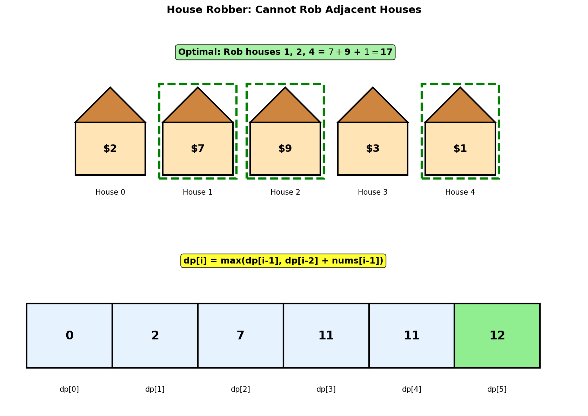
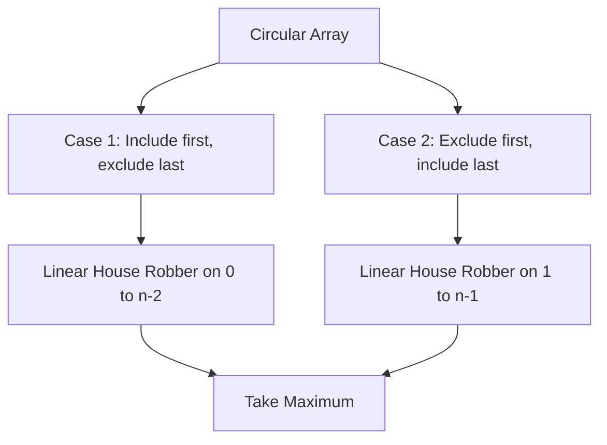
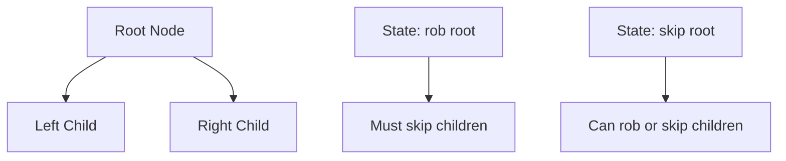
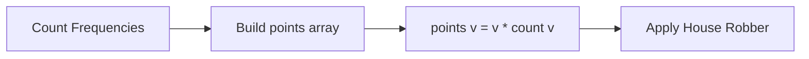
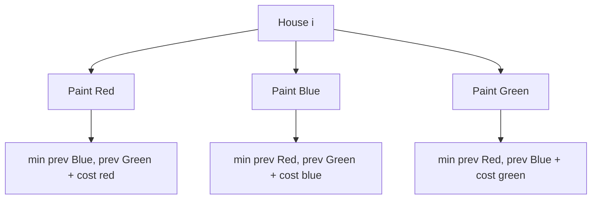

# House Robber

## Problem Statement

You are a professional robber planning to rob houses along a street. Each house has a certain amount of money stashed. The only constraint stopping you from robbing each of them is that **adjacent houses have security systems connected**, and it will automatically contact the police if two adjacent houses are broken into on the same night.

Given an integer array `nums` representing the amount of money at each house, return the **maximum amount of money** you can rob tonight **without alerting the police**.

## Input/Output Format

**Input:**
- `nums` (List[int]): An array where `nums[i]` represents the money in house `i`

**Output:**
- (int): Maximum amount of money that can be robbed without robbing adjacent houses

## Constraints

- `1 <= nums.length <= 100`
- `0 <= nums[i] <= 400`

## Examples

### Example 1: Simple Case

**Input:** `nums = [1, 2, 3, 1]`

**Output:** `4`

**Explanation:**
- Rob house 0 (money = 1) and house 2 (money = 3)
- Total = 1 + 3 = 4

```
Houses:    [0]    [1]    [2]    [3]
            |      |      |      |
Money:     $1     $2     $3     $1
            ^             ^
           ROB           ROB

Cannot rob adjacent houses!
Option 1: Rob [0, 2] = 1 + 3 = 4  <-- Best
Option 2: Rob [0, 3] = 1 + 1 = 2
Option 3: Rob [1, 3] = 2 + 1 = 3
Option 4: Rob [1]    = 2
Option 5: Rob [2]    = 3
```

### Example 2: Larger Array

**Input:** `nums = [2, 7, 9, 3, 1]`

**Output:** `12`

**Explanation:**
- Rob house 0 (money = 2), house 2 (money = 9), and house 4 (money = 1)
- Total = 2 + 9 + 1 = 12

```
Houses:    [0]    [1]    [2]    [3]    [4]
            |      |      |      |      |
Money:     $2     $7     $9     $3     $1
            ^             ^             ^
           ROB           ROB           ROB

Analysis:
- Rob [0, 2, 4]: 2 + 9 + 1 = 12  <-- Best
- Rob [1, 3]:    7 + 3 = 10
- Rob [1, 4]:    7 + 1 = 8
- Rob [0, 2]:    2 + 9 = 11
- Rob [0, 3]:    2 + 3 = 5
```

### Example 3: Two Houses

**Input:** `nums = [2, 1]`

**Output:** `2`

**Explanation:**
Only one house can be robbed. Choose the one with more money.

```
Houses:    [0]    [1]
            |      |
Money:     $2     $1
            ^
           ROB

Max(2, 1) = 2
```

## Visual Explanation



## ASCII Art: DP Table Building

```
nums = [2, 7, 9, 3, 1]

Building DP table:
dp[i] = max money robbing houses 0..i-1

Index:     0     1     2     3     4     5
         +-----+-----+-----+-----+-----+-----+
dp[]:    |  0  |  2  |  7  |  11 |  11 |  12 |
         +-----+-----+-----+-----+-----+-----+
           ^     ^
           |     |
       base    can only rob
       case    house 0

Recurrence: dp[i] = max(dp[i-1], dp[i-2] + nums[i-1])

Decision at each house:
- Skip this house: keep dp[i-1]
- Rob this house:  dp[i-2] + nums[i-1]

Trace:
dp[0] = 0                                    (no houses)
dp[1] = 2                                    (only house 0)
dp[2] = max(dp[1], dp[0] + 7) = max(2, 7) = 7
dp[3] = max(dp[2], dp[1] + 9) = max(7, 11) = 11
dp[4] = max(dp[3], dp[2] + 3) = max(11, 10) = 11
dp[5] = max(dp[4], dp[3] + 1) = max(11, 12) = 12

Answer: dp[5] = 12
```

## Solution Code

### Approach 1: Top-Down (Memoization)

```python
from typing import List

def rob(nums: List[int]) -> int:
    """
    Find maximum money that can be robbed using memoization.

    At each house, we have two choices:
    1. Rob current house: Add its value + max from house+2 onwards
    2. Skip current house: Take max from house+1 onwards

    Args:
        nums: Array of money in each house

    Returns:
        Maximum money that can be robbed

    Time Complexity: O(n)
    Space Complexity: O(n)
    """
    n = len(nums)
    memo = {}

    def dp(i: int) -> int:
        """Return max money robbing houses from index i to end."""
        # Base case: no more houses
        if i >= n:
            return 0

        if i in memo:
            return memo[i]

        # Choice: rob this house or skip it
        rob_current = nums[i] + dp(i + 2)  # Must skip next house
        skip_current = dp(i + 1)

        memo[i] = max(rob_current, skip_current)
        return memo[i]

    return dp(0)
```

::: info Complexity: Time O(n) · Space O(n)
- **Time:** Each house index from 0 to n-1 is computed exactly once due to memoization, giving O(n) total operations.
- **Space:** The memoization dictionary stores at most n entries, plus the recursion stack can go n levels deep in the worst case.
:::

### Approach 2: Bottom-Up (Tabulation)

```python
from typing import List

def rob(nums: List[int]) -> int:
    """
    Find maximum money that can be robbed using bottom-up DP.

    dp[i] represents the maximum money that can be robbed
    from houses 0 to i-1.

    Args:
        nums: Array of money in each house

    Returns:
        Maximum money that can be robbed

    Time Complexity: O(n)
    Space Complexity: O(n)
    """
    n = len(nums)

    if n == 0:
        return 0
    if n == 1:
        return nums[0]

    # dp[i] = max money robbing from house 0 to house i-1
    dp = [0] * (n + 1)
    dp[0] = 0         # No houses
    dp[1] = nums[0]   # Only first house

    for i in range(2, n + 1):
        # Either skip house i-1, or rob it
        dp[i] = max(dp[i - 1], dp[i - 2] + nums[i - 1])

    return dp[n]
```

::: info Complexity: Time O(n) · Space O(n)
- **Time:** Single pass through the array from index 2 to n, performing constant-time operations at each step.
- **Space:** The dp array of size n+1 stores the maximum value achievable for each prefix of houses.
:::

### Approach 3: Space-Optimized Bottom-Up

::: code-group
```python [Python]
from typing import List

def rob(nums: List[int]) -> int:
    """
    Find maximum money with O(1) space.

    Since we only need the previous two values, we can
    optimize space to O(1).

    Args:
        nums: Array of money in each house

    Returns:
        Maximum money that can be robbed

    Time Complexity: O(n)
    Space Complexity: O(1)
    """
    n = len(nums)

    if n == 0:
        return 0
    if n == 1:
        return nums[0]

    # prev2 = dp[i-2], prev1 = dp[i-1]
    prev2 = 0
    prev1 = nums[0]

    for i in range(1, n):
        # Current house decision
        current = max(prev1, prev2 + nums[i])
        prev2 = prev1
        prev1 = current

    return prev1
```

```java [Java]
public int rob(int[] nums) {
    int n = nums.length;

    if (n == 0) return 0;
    if (n == 1) return nums[0];

    // prev2 = dp[i-2], prev1 = dp[i-1]
    int prev2 = 0;
    int prev1 = nums[0];

    for (int i = 1; i < n; i++) {
        // Current house decision
        int current = Math.max(prev1, prev2 + nums[i]);
        prev2 = prev1;
        prev1 = current;
    }

    return prev1;
}
```
:::

::: info Complexity: Time O(n) · Space O(1)
- **Time:** Single linear pass through the array performing constant-time max operations at each house.
- **Space:** Only two variables (prev1, prev2) are maintained regardless of input size, achieving constant space.
:::

### Approach 4: Alternative Formulation

```python
from typing import List

def rob(nums: List[int]) -> int:
    """
    Alternative approach tracking 'rob' and 'not_rob' states.

    At each position, track:
    - rob: max money if we rob current house
    - not_rob: max money if we don't rob current house

    Args:
        nums: Array of money in each house

    Returns:
        Maximum money that can be robbed

    Time Complexity: O(n)
    Space Complexity: O(1)
    """
    if not nums:
        return 0

    # rob = max money if previous house was robbed
    # not_rob = max money if previous house was NOT robbed
    rob_prev = 0
    not_rob_prev = 0

    for money in nums:
        # If we rob current, previous must NOT have been robbed
        rob_curr = not_rob_prev + money

        # If we don't rob current, take max of previous states
        not_rob_curr = max(rob_prev, not_rob_prev)

        rob_prev = rob_curr
        not_rob_prev = not_rob_curr

    return max(rob_prev, not_rob_prev)
```

::: info Complexity: Time O(n) · Space O(1)
- **Time:** Iterates through each house exactly once, updating two state variables in constant time per iteration.
- **Space:** Uses only four variables (rob_prev, not_rob_prev, rob_curr, not_rob_curr) regardless of array size.
:::

## Complexity Analysis

| Approach | Time Complexity | Space Complexity |
|----------|----------------|------------------|
| Top-Down (Memoization) | O(n) | O(n) |
| Bottom-Up (Tabulation) | O(n) | O(n) |
| Space-Optimized | O(n) | O(1) |
| State-based | O(n) | O(1) |

## Edge Cases

1. **Empty array:**
   ```python
   rob([])  # Returns 0
   ```

2. **Single house:**
   ```python
   rob([5])  # Returns 5
   ```

3. **Two houses:**
   ```python
   rob([1, 2])  # Returns 2 (rob house with more money)
   ```

4. **All equal values:**
   ```python
   rob([5, 5, 5, 5])  # Returns 10 (rob houses 0 and 2)
   ```

5. **Decreasing values:**
   ```python
   rob([10, 5, 3, 1])  # Returns 13 (rob houses 0 and 2)
   ```

6. **One very large value:**
   ```python
   rob([1, 100, 1])  # Returns 100 (just rob middle house)
   ```

## Key Insights

1. **Decision at Each Step**: For each house, decide whether to rob it or skip it. This creates a binary decision tree that DP efficiently handles.

2. **Non-Adjacency Constraint**: If we rob house `i`, we cannot rob house `i-1` or `i+1`. This gives us the recurrence: `dp[i] = max(dp[i-1], dp[i-2] + nums[i])`.

3. **State Definition**: `dp[i]` = maximum money obtainable considering houses from index 0 to i-1.

4. **Optimal Substructure**: The maximum money from houses 0 to i depends only on the solutions for houses 0 to i-1 and 0 to i-2.

5. **No Backtracking Needed**: The greedy choice of "rob or skip" at each position, when done with DP, guarantees the global optimum.

## Related Problems

::: details House Robber II (LeetCode 213)
**Problem:** Houses are arranged in a circle, meaning the first and last houses are adjacent. Find maximum money you can rob without robbing adjacent houses.

**Key Insight:** Since first and last are adjacent, we cannot rob both. Split into two linear subproblems: rob houses [0, n-2] OR rob houses [1, n-1].



**Approach:** `max(rob(nums[0:n-1]), rob(nums[1:n]))` using the original House Robber algorithm.

**Complexity:** O(n) time, O(1) space
:::

::: details House Robber III (LeetCode 337)
**Problem:** Houses are arranged in a binary tree. The thief cannot rob two directly connected (parent-child) houses. Find maximum money.

**Key Insight:** Tree DP with two states per node: max if we rob this node vs. max if we skip this node.



**Approach:** DFS returning tuple (rob_this, skip_this). If rob current: sum skip values of children. If skip current: sum max of each child's options.

**Complexity:** O(n) time, O(h) space where h is tree height
:::

::: details Delete and Earn (LeetCode 740)
**Problem:** Given array `nums`, if you take element `x`, you earn `x` points but must delete all `x-1` and `x+1`. Find maximum points.

**Key Insight:** Transform to House Robber by counting frequency. Taking all occurrences of value `v` prevents taking `v-1` or `v+1`.



**Approach:** Create array where `points[v] = v * count[v]`. Then apply House Robber DP on points array.

**Complexity:** O(n + max(nums)) time, O(max(nums)) space
:::

::: details Paint House (LeetCode 256)
**Problem:** Paint n houses with 3 colors (red, blue, green). Each house has different costs for each color. No two adjacent houses can have the same color. Find minimum total cost.

**Key Insight:** Similar non-adjacency constraint but with multiple choices instead of binary. Track minimum cost ending with each color.



**Approach:** `dp[i][c] = cost[i][c] + min(dp[i-1][other colors])`. Track 3 states per house.

**Complexity:** O(n) time, O(1) space
:::
