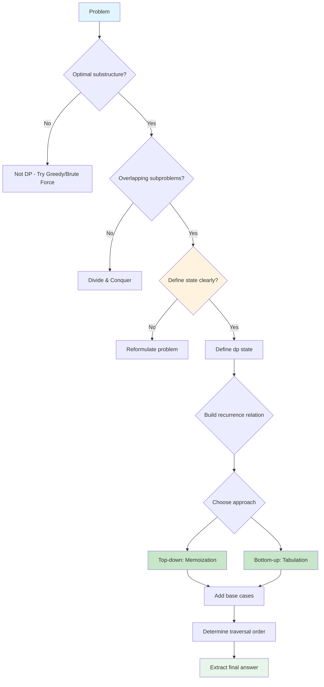
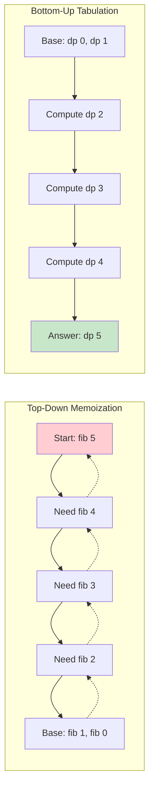
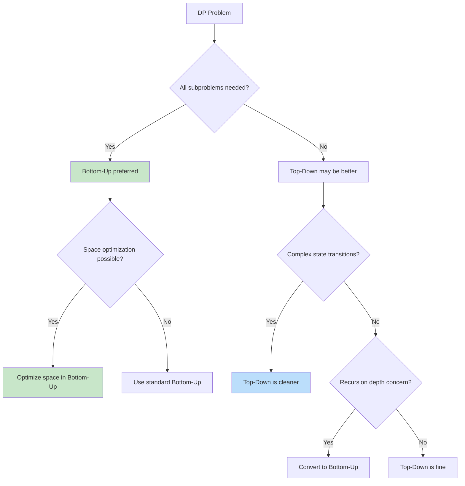

# Dynamic Programming

> **Optimal substructure and overlapping subproblems**

---

## Overview

**Dynamic Programming (DP)** is an algorithmic technique to optimize recursive solutions when subproblems repeat. The core idea is to store solutions to subproblems so each subproblem is solved only once, transforming exponential time complexity into polynomial time.

### What is Dynamic Programming?

DP breaks a problem into smaller, overlapping subproblems, solving each subproblem only once and storing its solution. This technique is essential for solving many classic interview problems efficiently: Longest Common Subsequence, Edit Distance, 0/1 Knapsack, Coin Change, and more.

### Key Concepts

| Concept | Description | Example |
|---------|-------------|---------|
| **Optimal Substructure** | Optimal solution uses optimal solutions to subproblems | Shortest path: optimal path to B uses optimal path to intermediate nodes |
| **Overlapping Subproblems** | Same subproblems are solved multiple times | Fibonacci: fib(3) computed multiple times when calculating fib(5) |
| **Memoization** | Top-down approach storing results in cache | Recursive with @lru_cache |
| **Tabulation** | Bottom-up approach filling a table iteratively | Iterative with dp array |

### When to Use DP vs Other Techniques

| Technique | When to Use | Example |
|-----------|-------------|---------|
| **Dynamic Programming** | Overlapping subproblems + optimal substructure | Fibonacci, Knapsack |
| **Divide & Conquer** | Subproblems don't overlap | Merge Sort, Quick Sort |
| **Greedy** | Local optimal leads to global optimal | Activity Selection |
| **Backtracking** | Need all solutions, not just optimal | N-Queens, Permutations |

---

## Document Structure

| Problem | Difficulty | Pattern | Link |
|---------|------------|---------|------|
| Climbing Stairs | Easy | Linear DP | [Link](./climbing-stairs) |
| House Robber | Medium | Linear DP | [Link](./house-robber) |
| Coin Change | Medium | Unbounded Knapsack | [Link](./coin-change) |
| Longest Increasing Subsequence | Medium | LIS Pattern | [Link](./longest-increasing-subsequence) |
| Longest Common Subsequence | Medium | 2D String DP | [Link](./longest-common-subsequence) |
| Edit Distance | Medium | 2D String DP | [Link](./edit-distance) |
| 0/1 Knapsack | Medium | Knapsack Pattern | [Link](./knapsack) |
| Word Break | Medium | Linear DP + Set | [Link](./word-break) |
| Unique Paths | Medium | 2D Grid DP | [Link](./unique-paths) |
| Minimum Path Sum | Medium | 2D Grid DP | [Link](./minimum-path-sum) |
| Maximum Subarray | Medium | Kadane's Algorithm | [Link](./maximum-subarray) |
| Decode Ways | Medium | Linear DP | [Link](./decode-ways) |
| Partition Equal Subset Sum | Medium | Subset Sum | [Link](./partition-equal-subset) |
| Target Sum | Medium | Knapsack Variant | [Link](./target-sum) |
| Matrix Chain Multiplication | Hard | Interval DP | [Link](./matrix-chain) |
| Burst Balloons | Hard | Interval DP | [Link](./burst-balloons) |
| Regular Expression Matching | Hard | 2D String DP | [Link](./regex-matching) |
| Wildcard Matching | Hard | 2D String DP | [Link](./wildcard-matching) |

---

## DP Problem Recognition

### When to Use DP

Dynamic programming applies when a problem exhibits these two key properties:

1. **Optimal substructure**: The optimal solution to the problem uses optimal solutions to its subproblems
2. **Overlapping subproblems**: The same subproblems are solved multiple times during recursion

### Keyword Triggers

| Keyword/Phrase | Example Problem |
|----------------|-----------------|
| "minimum cost" | Minimum Path Sum |
| "maximum profit" | House Robber |
| "count ways" | Climbing Stairs |
| "is possible" | Word Break |
| "longest/shortest" | Longest Common Subsequence |
| "partition into" | Partition Equal Subset Sum |
| "can we achieve" | Target Sum |
| "number of ways" | Coin Change II |

### Mermaid: DP Decision Tree



---

## DP Framework: 5 Steps

Every DP problem can be solved using this systematic framework:

### Step 1: Define State

What does `dp[i]` or `dp[i][j]` represent?

```python
# Linear DP
dp[i] = "answer for first i elements" or "answer ending at index i"

# 2D DP
dp[i][j] = "answer for subproblem involving i and j"

# Examples:
# Fibonacci: dp[i] = i-th Fibonacci number
# Climbing Stairs: dp[i] = number of ways to reach step i
# Knapsack: dp[i][w] = max value using first i items with capacity w
# LCS: dp[i][j] = LCS length of first i chars of s1 and first j chars of s2
```

### Step 2: Identify Base Cases

What are the trivial solutions?

```python
# Fibonacci
dp[0] = 0
dp[1] = 1

# Climbing Stairs
dp[0] = 1  # One way to stay at ground
dp[1] = 1  # One way to reach step 1

# 2D Grid (Unique Paths)
dp[0][j] = 1  # Only one way to reach any cell in first row
dp[i][0] = 1  # Only one way to reach any cell in first column
```

### Step 3: Build Recurrence Relation

How do states relate to each other?

```python
# Fibonacci
dp[i] = dp[i-1] + dp[i-2]

# Climbing Stairs (1 or 2 steps)
dp[i] = dp[i-1] + dp[i-2]

# Unique Paths
dp[i][j] = dp[i-1][j] + dp[i][j-1]

# Knapsack
dp[i][w] = max(dp[i-1][w],                    # Don't take item i
               dp[i-1][w-weight[i]] + value[i]) # Take item i

# LCS
if s1[i-1] == s2[j-1]:
    dp[i][j] = dp[i-1][j-1] + 1
else:
    dp[i][j] = max(dp[i-1][j], dp[i][j-1])
```

### Step 4: Determine Traversal Order

In what order should we fill the table?

```
For bottom-up, ensure all dependent states are computed first:

Linear DP:       i = 0 --> n (left to right)
2D Grid DP:      row by row, left to right
Interval DP:     by length, then start position
Knapsack:        row by row (items), then by capacity
```

### Step 5: Extract Final Answer

Which state contains the answer?

```python
# Fibonacci: dp[n]
# Climbing Stairs: dp[n]
# Knapsack: dp[n][W]
# LCS: dp[m][n]
# LIS: max(dp)  # Maximum value in dp array
```

---

## Visualization: Fibonacci DP Table

### Recursive Tree (Without Memoization)

```
Computing fib(5) recursively - Notice repeated subproblems!

                         fib(5)
                        /      \
                   fib(4)      fib(3)      <-- fib(3) computed twice!
                  /     \      /    \
             fib(3)   fib(2) fib(2) fib(1)  <-- fib(2) computed 3 times!
             /   \     /  \   /  \
        fib(2) fib(1) f(1) f(0) f(1) f(0)
        /   \
      f(1) f(0)

Time Complexity: $O(2^n)$ - Exponential!
```

### Tabulation (Bottom-Up)

```
Computing fib(5) with tabulation:

Step-by-step table filling:

Index:    0     1     2     3     4     5
        +-----+-----+-----+-----+-----+-----+
Step 1: |  0  |  1  |     |     |     |     |  <- Base cases
        +-----+-----+-----+-----+-----+-----+

Step 2: |  0  |  1  |  1  |     |     |     |  <- dp[2] = dp[1] + dp[0] = 1
        +-----+-----+-----+-----+-----+-----+

Step 3: |  0  |  1  |  1  |  2  |     |     |  <- dp[3] = dp[2] + dp[1] = 2
        +-----+-----+-----+-----+-----+-----+

Step 4: |  0  |  1  |  1  |  2  |  3  |     |  <- dp[4] = dp[3] + dp[2] = 3
        +-----+-----+-----+-----+-----+-----+

Step 5: |  0  |  1  |  1  |  2  |  3  |  5  |  <- dp[5] = dp[4] + dp[3] = 5
        +-----+-----+-----+-----+-----+-----+

Time Complexity: $O(n)$ - Linear!
Space Complexity: $O(n)$ - Can be optimized to $O(1)$
```

### Dependency Visualization

```
Each cell depends on the previous two cells:

         +-------+-------+-------+-------+-------+-------+
dp:      |   0   |   1   |   1   |   2   |   3   |   5   |
         +-------+-------+-------+-------+-------+-------+
              \       \       \       \       \
               \_______\_______\_______\_______\____
                       |       |       |       |    \
                      Uses   Uses   Uses   Uses   Result

Direction of computation: =========>
```

---

## Visualization: 2D DP Table (LCS)

### Longest Common Subsequence: "ABCDE" vs "ACE"

```
Building the LCS table:

           ""    A     C     E
         +-----+-----+-----+-----+
    ""   |  0  |  0  |  0  |  0  |
         +-----+-----+-----+-----+
    A    |  0  |  1  |  1  |  1  |  <- 'A' matches 'A'
         +-----+-----+-----+-----+
    B    |  0  |  1  |  1  |  1  |  <- No match, carry forward
         +-----+-----+-----+-----+
    C    |  0  |  1  |  2  |  2  |  <- 'C' matches 'C'
         +-----+-----+-----+-----+
    D    |  0  |  1  |  2  |  2  |  <- No match, carry forward
         +-----+-----+-----+-----+
    E    |  0  |  1  |  2  |  3  |  <- 'E' matches 'E'
         +-----+-----+-----+-----+
                             ^
                             |
                        Answer: 3

LCS = "ACE" (length 3)
```

### Cell Dependency for LCS

```
For dp[i][j], we look at three cells:

                     dp[i-1][j-1]    dp[i-1][j]
                          \              |
                           \             |
                            \            v
                             +----> dp[i][j]
                            /
                           /
                          /
                    dp[i][j-1]

If s1[i-1] == s2[j-1]:
    dp[i][j] = dp[i-1][j-1] + 1  (diagonal + 1)
Else:
    dp[i][j] = max(dp[i-1][j], dp[i][j-1])  (max of top and left)
```

---

## Visual Guides

The following diagram illustrates the common patterns and decision-making process when solving DP problems:

<!-- TODO: Add visualization  -->

---

## Top-Down vs Bottom-Up

### Comparison

| Aspect | Top-Down (Memoization) | Bottom-Up (Tabulation) |
|--------|----------------------|----------------------|
| **Approach** | Recursive with cache | Iterative with table |
| **Implementation** | Natural recursive thinking | Requires understanding dependencies |
| **Space** | Call stack + cache | Only table (can optimize) |
| **Computation** | Only needed subproblems | All subproblems |
| **When to Use** | Complex state transitions | When you need space optimization |
| **Debugging** | Harder (recursive calls) | Easier (iterative) |

### Mermaid: Top-Down vs Bottom-Up Flow



### Code Comparison

```python
from functools import lru_cache

# ===========================================
# TOP-DOWN (Memoization)
# ===========================================

# Method 1: Using @lru_cache decorator
@lru_cache(maxsize=None)
def fib_top_down(n):
    """
    Top-down approach using Python's built-in memoization.
    Time: O(n), Space: O(n) for cache + O(n) for call stack
    """
    if n <= 1:
        return n
    return fib_top_down(n - 1) + fib_top_down(n - 2)

# Method 2: Manual memoization with dictionary
def fib_top_down_manual(n, memo=None):
    """
    Top-down approach with explicit memoization dictionary.
    """
    if memo is None:
        memo = {}

    if n in memo:
        return memo[n]

    if n <= 1:
        return n

    memo[n] = fib_top_down_manual(n - 1, memo) + fib_top_down_manual(n - 2, memo)
    return memo[n]


# ===========================================
# BOTTOM-UP (Tabulation)
# ===========================================

# Method 1: Standard tabulation
def fib_bottom_up(n):
    """
    Bottom-up approach with DP table.
    Time: O(n), Space: O(n)
    """
    if n <= 1:
        return n

    dp = [0] * (n + 1)
    dp[0], dp[1] = 0, 1

    for i in range(2, n + 1):
        dp[i] = dp[i - 1] + dp[i - 2]

    return dp[n]

# Method 2: Space-optimized tabulation
def fib_optimized(n):
    """
    Space-optimized bottom-up approach.
    Time: O(n), Space: O(1)
    """
    if n <= 1:
        return n

    prev2, prev1 = 0, 1

    for i in range(2, n + 1):
        curr = prev1 + prev2
        prev2 = prev1
        prev1 = curr

    return prev1
```

### When to Choose Each Approach



---

## DP Patterns

### Pattern Overview

| Pattern | State Definition | Recurrence | Example Problems |
|---------|-----------------|------------|------------------|
| **Linear DP** | `dp[i]` = answer for index i | `dp[i] = f(dp[i-1], dp[i-2], ...)` | Climbing Stairs, House Robber |
| **2D Grid DP** | `dp[i][j]` = answer for cell (i,j) | `dp[i][j] = f(dp[i-1][j], dp[i][j-1])` | Unique Paths, Minimum Path Sum |
| **String DP** | `dp[i][j]` = answer for s1[:i], s2[:j] | Depends on character match | LCS, Edit Distance |
| **Knapsack** | `dp[i][w]` = answer for i items, capacity w | Take or skip item | 0/1 Knapsack, Subset Sum |
| **Interval DP** | `dp[i][j]` = answer for interval [i,j] | `dp[i][j] = f(dp[i][k], dp[k+1][j])` | Matrix Chain, Burst Balloons |
| **State Machine** | `dp[i][state]` = answer at i with state | State transitions | Stock Problems, Paint House |
| **Bitmask DP** | `dp[mask]` = answer for subset represented by mask | Iterate over bits | Traveling Salesman, Assign Tasks |

### Pattern Details with ASCII Visualizations

#### 1. Linear DP

```
Pattern: Each state depends on a fixed number of previous states

House Robber: dp[i] = max money robbing houses 0..i
Cannot rob adjacent houses.

Houses:    [2]   [7]   [9]   [3]   [1]
            0     1     2     3     4

dp[0] = 2       (Rob house 0)
dp[1] = 7       (Rob house 1, skip 0)
dp[2] = 11      (Rob 0 and 2: 2+9=11)
dp[3] = 11      (Best is still dp[2])
dp[4] = 12      (Rob 0,2,4: 2+9+1=12)

Recurrence: dp[i] = max(dp[i-1], dp[i-2] + nums[i])

         dp[i-2]                    dp[i-1]
            \                          |
             \_____ + nums[i] ___     max
                              |  \     |
                              v   v    v
                            dp[i]
```

#### 2. 2D Grid DP

```
Pattern: Each cell depends on adjacent cells (usually top and left)

Unique Paths: dp[i][j] = number of ways to reach (i,j) from (0,0)

Grid:
    +---+---+---+---+
    | 1 | 1 | 1 | 1 |  <- Only one way to reach any cell in first row
    +---+---+---+---+
    | 1 | 2 | 3 | 4 |
    +---+---+---+---+
    | 1 | 3 | 6 | 10|  <- dp[2][3] = 10 ways
    +---+---+---+---+
      ^
      |
    Only one way to reach any cell in first column

Recurrence: dp[i][j] = dp[i-1][j] + dp[i][j-1]

    dp[i-1][j]
        |
        v
    dp[i][j-1] --> dp[i][j]
```

#### 3. Knapsack DP

```
Pattern: For each item, decide to take or skip

0/1 Knapsack: dp[i][w] = max value using items 0..i-1 with capacity w

Items: [(weight=1, value=1), (weight=3, value=4), (weight=4, value=5)]
Capacity: 7

             Capacity w
            0   1   2   3   4   5   6   7
          +---+---+---+---+---+---+---+---+
   Item 0 | 0 | 1 | 1 | 1 | 1 | 1 | 1 | 1 |
          +---+---+---+---+---+---+---+---+
   Item 1 | 0 | 1 | 1 | 4 | 5 | 5 | 5 | 5 |
          +---+---+---+---+---+---+---+---+
   Item 2 | 0 | 1 | 1 | 4 | 5 | 6 | 6 | 9 |
          +---+---+---+---+---+---+---+---+
                                        ^
                                        |
                                   Answer: 9

Recurrence: dp[i][w] = max(dp[i-1][w], dp[i-1][w-weight[i]] + value[i])

    Skip item i        Take item i (if weight[i] <= w)
         |                    |
    dp[i-1][w]    vs    dp[i-1][w-weight[i]] + value[i]
```

#### 4. Interval DP

```
Pattern: Solve for all intervals of increasing length

Matrix Chain: dp[i][j] = min cost to multiply matrices i..j

Matrices: A1(10x30), A2(30x5), A3(5x60)

             j
           1   2   3
         +---+---+---+
    i  1 | 0 |1500|4500|
         +---+---+---+
       2 | - | 0 |9000|
         +---+---+---+
       3 | - | - | 0 |
         +---+---+---+

Fill order: by length of interval
- Length 1: dp[1][1]=0, dp[2][2]=0, dp[3][3]=0
- Length 2: dp[1][2], dp[2][3]
- Length 3: dp[1][3]

Recurrence: dp[i][j] = min over k of (dp[i][k] + dp[k+1][j] + cost(i,k,j))
```

---

## Space Optimization Techniques

### Rolling Array Technique

When `dp[i]` only depends on `dp[i-1]` (and maybe `dp[i-2]`), compress to constant space:

```python
# Before: O(n) space
def fib_standard(n):
    dp = [0] * (n + 1)
    dp[1] = 1
    for i in range(2, n + 1):
        dp[i] = dp[i-1] + dp[i-2]
    return dp[n]

# After: O(1) space
def fib_optimized(n):
    if n <= 1:
        return n
    prev2, prev1 = 0, 1
    for i in range(2, n + 1):
        curr = prev1 + prev2
        prev2, prev1 = prev1, curr
    return prev1
```

### Row Compression for 2D DP

When `dp[i][j]` only depends on `dp[i-1][...]`, use two rows:

```python
# Before: O(m*n) space
def unique_paths_standard(m, n):
    dp = [[1]*n for _ in range(m)]
    for i in range(1, m):
        for j in range(1, n):
            dp[i][j] = dp[i-1][j] + dp[i][j-1]
    return dp[m-1][n-1]

# After: O(n) space
def unique_paths_optimized(m, n):
    dp = [1] * n
    for i in range(1, m):
        for j in range(1, n):
            dp[j] += dp[j-1]  # dp[j] acts as dp[i-1][j], dp[j-1] as dp[i][j-1]
    return dp[n-1]
```

### Visualization of Space Optimization

```
2D to 1D compression for Unique Paths:

Original 2D table:
    j:  0   1   2   3
   +---+---+---+---+
i=0| 1 | 1 | 1 | 1 |  <- prev row
   +---+---+---+---+
i=1| 1 | 2 | 3 | 4 |  <- curr row (being computed)
   +---+---+---+---+

With 1D array:
Before processing row i=1:  dp = [1, 1, 1, 1]  (represents row i=0)

Processing j=0: dp[0] = 1 (unchanged, always 1)
Processing j=1: dp[1] = dp[1] + dp[0] = 1 + 1 = 2
Processing j=2: dp[2] = dp[2] + dp[1] = 1 + 2 = 3
Processing j=3: dp[3] = dp[3] + dp[2] = 1 + 3 = 4

After processing row i=1:   dp = [1, 2, 3, 4]  (represents row i=1)
```

---

## Common DP Problem Templates

### Template 1: Linear DP (Climbing Stairs)

```python
def climb_stairs(n: int) -> int:
    """
    Count ways to climb n stairs, taking 1 or 2 steps at a time.
    Time: O(n), Space: O(1)
    """
    if n <= 2:
        return n

    prev2, prev1 = 1, 2
    for i in range(3, n + 1):
        curr = prev1 + prev2
        prev2, prev1 = prev1, curr

    return prev1
```

### Template 2: 2D Grid DP (Minimum Path Sum)

```python
def min_path_sum(grid: list[list[int]]) -> int:
    """
    Find minimum sum path from top-left to bottom-right.
    Time: O(m*n), Space: O(n) with optimization
    """
    m, n = len(grid), len(grid[0])
    dp = [float('inf')] * n
    dp[0] = 0

    for i in range(m):
        for j in range(n):
            if j == 0:
                dp[j] = dp[j] + grid[i][j]
            else:
                dp[j] = min(dp[j], dp[j-1]) + grid[i][j]

    return dp[n-1]
```

### Template 3: String DP (Longest Common Subsequence)

```python
def longest_common_subsequence(text1: str, text2: str) -> int:
    """
    Find length of LCS of two strings.
    Time: O(m*n), Space: O(min(m,n)) with optimization
    """
    if len(text1) < len(text2):
        text1, text2 = text2, text1

    m, n = len(text1), len(text2)
    prev = [0] * (n + 1)

    for i in range(1, m + 1):
        curr = [0] * (n + 1)
        for j in range(1, n + 1):
            if text1[i-1] == text2[j-1]:
                curr[j] = prev[j-1] + 1
            else:
                curr[j] = max(prev[j], curr[j-1])
        prev = curr

    return prev[n]
```

### Template 4: 0/1 Knapsack

```python
def knapsack(weights: list[int], values: list[int], capacity: int) -> int:
    """
    Maximum value achievable with given capacity.
    Time: O(n*W), Space: O(W)
    """
    n = len(weights)
    dp = [0] * (capacity + 1)

    for i in range(n):
        # Traverse backwards to avoid using same item twice
        for w in range(capacity, weights[i] - 1, -1):
            dp[w] = max(dp[w], dp[w - weights[i]] + values[i])

    return dp[capacity]
```

### Template 5: Interval DP (Burst Balloons)

```python
def max_coins(nums: list[int]) -> int:
    """
    Maximum coins from bursting all balloons.
    Time: O(n^3), Space: O(n^2)
    """
    # Add virtual balloons at boundaries
    nums = [1] + nums + [1]
    n = len(nums)
    dp = [[0] * n for _ in range(n)]

    # Fill by interval length
    for length in range(2, n):
        for left in range(n - length):
            right = left + length
            for k in range(left + 1, right):
                coins = nums[left] * nums[k] * nums[right]
                dp[left][right] = max(
                    dp[left][right],
                    dp[left][k] + coins + dp[k][right]
                )

    return dp[0][n-1]
```

---

## Interview Focus Areas

Based on recent interview patterns from SDE interviews (2025-2026), these DP topics are most frequently tested:

### High Priority Topics

1. **Linear DP Problems** - House Robber, Climbing Stairs, Decode Ways
2. **String DP** - LCS, Edit Distance, Word Break
3. **Grid DP** - Unique Paths, Minimum Path Sum
4. **Subsequence Problems** - LIS, Longest Palindromic Subsequence
5. **Knapsack Variants** - Subset Sum, Partition Equal Subset Sum

### Common Google DP Questions (2025-2026)

| Question Type | Example Problem | Key Insight |
|--------------|-----------------|-------------|
| Linear DP | "Maximum profit robbing non-adjacent houses" | dp[i] = max(skip, take + dp[i-2]) |
| String DP | "Minimum edits to transform string A to B" | 2D DP with insert/delete/replace ops |
| Subset Sum | "Can array be partitioned into two equal halves?" | 0/1 Knapsack with target = sum/2 |
| Sequence | "Length of longest increasing subsequence" | $O(n \log n)$ with binary search |
| Path Count | "Count unique paths in grid with obstacles" | Grid DP with obstacle handling |

### What Interviewers Look For

1. **Correct State Definition**
   - Can you clearly explain what dp[i] or dp[i][j] represents?
   - Is the state sufficient to build the solution?

2. **Valid Recurrence**
   - Does your recurrence capture all cases?
   - Are there edge cases in the transition?

3. **Base Cases**
   - Have you identified all trivial cases?
   - Are boundary conditions handled?

4. **Complexity Analysis**
   - Time: Usually $O(n)$, $O(n^2)$, or $O(n \times m)$
   - Space: Can it be optimized?

5. **Code Quality**
   - Clean implementation
   - Meaningful variable names
   - Proper handling of indices

### Interview Strategy for DP Problems


### Common Mistakes to Avoid

1. **Wrong state definition** - State doesn't capture enough information
2. **Off-by-one errors** - Check array indices carefully
3. **Missing base cases** - Always handle n=0, n=1 explicitly
4. **Wrong traversal order** - Ensure dependencies are computed first
5. **Not considering edge cases** - Empty input, single element, all same values

---

## Practice Progression

### Week 1: Foundations

| Day | Focus | Problems |
|-----|-------|----------|
| 1 | Linear DP Basics | Climbing Stairs, Fibonacci, House Robber |
| 2 | More Linear DP | House Robber II, Maximum Subarray, Decode Ways |
| 3 | Grid DP | Unique Paths, Unique Paths II, Minimum Path Sum |

### Week 2: Intermediate

| Day | Focus | Problems |
|-----|-------|----------|
| 4 | String DP | Longest Common Subsequence, Edit Distance |
| 5 | Subsequence Problems | LIS, Longest Palindromic Subsequence |
| 6 | Knapsack | 0/1 Knapsack, Subset Sum, Partition Equal Subset Sum |

### Week 3: Advanced

| Day | Focus | Problems |
|-----|-------|----------|
| 7 | Advanced String DP | Word Break, Regular Expression Matching |
| 8 | Interval DP | Matrix Chain Multiplication, Burst Balloons |
| 9 | Mixed Practice | Random selection from all patterns |

---

## Visual Learning Resources

### Interactive Visualization Tools

- [VisuAlgo - Recursion and DP](https://visualgo.net/en/recursion) - Step-by-step visualization of recursion trees and DP
- [Algorithm Visualizer](https://algorithm-visualizer.org/) - Interactive platform for visualizing algorithms from code
- [Dynamic Programming Visualization](https://dynamic-programming.debkbanerji.com/) - In-browser code editor and visualization tool for DP
- [USF Algorithm Visualization](https://www.cs.usfca.edu/~galles/visualization/DPFib.html) - University of San Francisco's interactive DP animations
- [dpvis](https://arxiv.org/html/2411.07705v1) - Research tool for visual and interactive learning of DP
- [CS 1332 Visualizations](https://csvistool.com/) - Georgia Tech's data structures visualization tool
- [DSA Visualizer](https://www.dsavisualizer.in/) - Interactive DSA visualization platform

### Recommended Courses

- [Grokking Dynamic Programming Patterns](https://www.designgurus.io/course/grokking-dynamic-programming) - Pattern-based approach covering 35+ problems
- [Educative: Grokking Dynamic Programming Interview](https://www.educative.io/courses/grokking-dynamic-programming-interview) - AI-powered course for interview prep
- [Tech Interview Handbook - DP Cheatsheet](https://www.techinterviewhandbook.org/algorithms/dynamic-programming/) - Concise reference for coding interviews

### Practice Platforms

- [LeetCode DP Problems](https://leetcode.com/tag/dynamic-programming/)
- [GeeksforGeeks - Top 20 DP Interview Questions](https://www.geeksforgeeks.org/dsa/top-20-dynamic-programming-interview-questions/)
- [GitHub - DP Interview Questions](https://github.com/Devinterview-io/dynamic-programming-interview-questions)

---

## Quick Reference Card

### Time Complexity Cheat Sheet

```
Linear DP:        O(n)          - Single array traversal
2D DP:            O(n*m)        - Two nested loops
Knapsack:         O(n*W)        - Items * Capacity
String DP:        O(n*m)        - Length(s1) * Length(s2)
Interval DP:      O(n^3)        - Length * Start * Split point
LIS (optimal):    O(n log n)    - With binary search
```

### Space Optimization Cheat Sheet

```
Linear DP:        O(n) -> O(1)      If only prev 1-2 states needed
2D Grid DP:       O(m*n) -> O(n)    If only prev row needed
String DP:        O(m*n) -> O(min(m,n))  Use shorter string for columns
Knapsack:         O(n*W) -> O(W)    Process items in outer loop
```

### Pattern Recognition Triggers

| If you see... | Think about... |
|--------------|----------------|
| "Count ways" | DP with addition in recurrence |
| "Minimum/Maximum" | DP with min/max in recurrence |
| "Is possible" | DP with boolean OR |
| "Contiguous subarray" | Kadane's or Prefix Sum |
| "Subsequence" | 2D DP (LCS-style) |
| "Partition" | Subset Sum / Knapsack |
| "String transformation" | Edit Distance style |
| "Cut/merge cost" | Interval DP |

---

*Last updated: January 2026*

*Dynamic Programming is the gateway to solving complex optimization problems efficiently. Master the patterns and framework here, and you will find that even "hard" DP problems follow predictable structures.*
