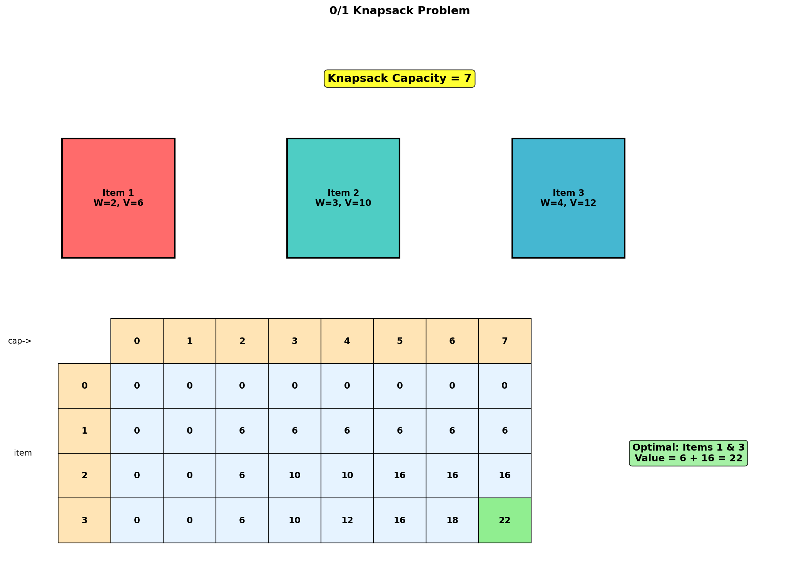
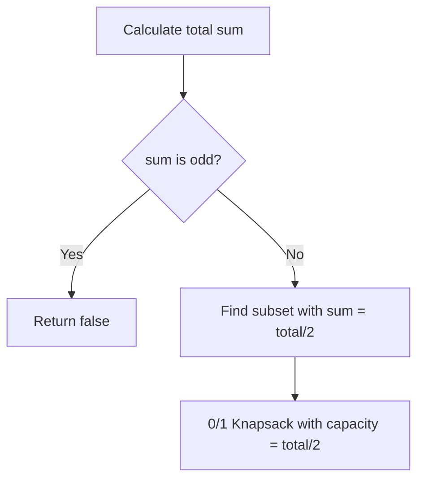
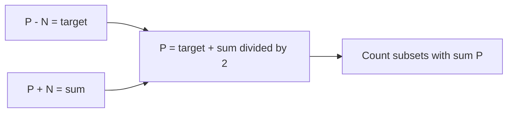
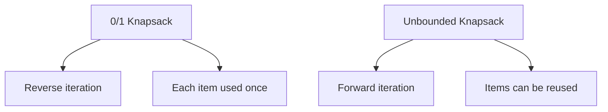
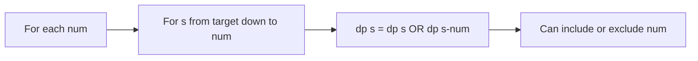
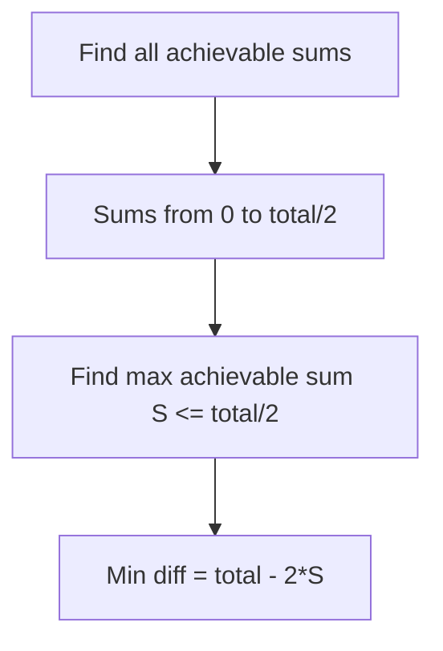

# 0/1 Knapsack Problem

## Problem Statement

You are given `n` items where each item has a **weight** and a **value**. You have a knapsack with a maximum weight capacity `W`. Your goal is to determine the **maximum value** you can carry in the knapsack without exceeding the weight capacity.

**Important Constraint**: Each item can only be included **once** (0/1 property - either take it or leave it).

This is one of the most fundamental dynamic programming problems and serves as the basis for many other optimization problems.

## Input/Output Format

**Input:**
- `weights` (List[int]): Weight of each item
- `values` (List[int]): Value of each item
- `W` (int): Maximum weight capacity of knapsack

**Output:**
- (int): Maximum value that can be achieved

## Constraints

- `1 <= n <= 1000`
- `1 <= weights[i], values[i] <= 1000`
- `1 <= W <= 1000`

## Examples

### Example 1: Standard Case

**Input:**
- `weights = [2, 3, 4]`
- `values = [6, 10, 12]`
- `W = 7`

**Output:** `18`

**Explanation:**
Take items with weights 2 and 3 (total weight = 5, value = 6 + 10 = 16)
OR take items with weights 3 and 4 (total weight = 7, value = 10 + 12 = 22)
Wait, let's verify:
- Item 0: weight=2, value=6
- Item 1: weight=3, value=10
- Item 2: weight=4, value=12

Options:
- Take [0]: weight=2, value=6
- Take [1]: weight=3, value=10
- Take [2]: weight=4, value=12
- Take [0,1]: weight=5, value=16
- Take [0,2]: weight=6, value=18 <-- Best!
- Take [1,2]: weight=7, value=22 <-- Even Better!
- Take [0,1,2]: weight=9 > 7, invalid

Wait, [1,2] gives 22. Let me recalculate...

Actually the maximum is **22** by taking items 1 and 2.

### Example 2: Capacity Limitation

**Input:**
- `weights = [1, 2, 3]`
- `values = [10, 15, 40]`
- `W = 5`

**Output:** `55`

**Explanation:**
- Take item 0 (weight=1, value=10) and item 2 (weight=3, value=40)
- Total weight = 4, Total value = 50
- Or take items 1 and 2: weight=5, value=55 <-- Best!

### Example 3: Single Item Fits

**Input:**
- `weights = [5]`
- `values = [100]`
- `W = 5`

**Output:** `100`

**Explanation:**
Only one item fits exactly in the knapsack.

## Visual Explanation



## ASCII Art: DP Table Building

```
Items: [(w=2, v=6), (w=3, v=10), (w=4, v=12)]
Capacity W = 7

DP Table: dp[i][w] = max value using first i items with capacity w

            Capacity w
            0    1    2    3    4    5    6    7
          +----+----+----+----+----+----+----+----+
Item 0    | 0  | 0  | 0  | 0  | 0  | 0  | 0  | 0  |
(none)    +----+----+----+----+----+----+----+----+
Item 1    | 0  | 0  | 6  | 6  | 6  | 6  | 6  | 6  |
(w=2,v=6) +----+----+----+----+----+----+----+----+
Item 2    | 0  | 0  | 6  | 10 | 10 | 16 | 16 | 16 |
(w=3,v=10)+----+----+----+----+----+----+----+----+
Item 3    | 0  | 0  | 6  | 10 | 12 | 16 | 18 | 22 |
(w=4,v=12)+----+----+----+----+----+----+----+----+

Building dp[3][7] (last row, capacity 7):
- Don't take item 3: dp[2][7] = 16
- Take item 3:       dp[2][7-4] + 12 = dp[2][3] + 12 = 10 + 12 = 22
- dp[3][7] = max(16, 22) = 22

Answer: dp[3][7] = 22
```

## Solution Code

### Approach 1: Top-Down (Memoization)

```python
from typing import List
from functools import lru_cache

def knapsack(weights: List[int], values: List[int], W: int) -> int:
    """
    Solve 0/1 knapsack using memoization.

    For each item, decide whether to include it or not.
    Include if: remaining capacity >= item weight

    Args:
        weights: Weight of each item
        values: Value of each item
        W: Maximum capacity

    Returns:
        Maximum achievable value

    Time Complexity: O(n * W)
    Space Complexity: O(n * W)
    """
    n = len(weights)

    @lru_cache(maxsize=None)
    def dp(i: int, remaining: int) -> int:
        """
        Max value using items i..n-1 with remaining capacity.
        """
        # Base case: no items left
        if i == n:
            return 0

        # Option 1: Don't take item i
        not_take = dp(i + 1, remaining)

        # Option 2: Take item i (if it fits)
        take = 0
        if weights[i] <= remaining:
            take = values[i] + dp(i + 1, remaining - weights[i])

        return max(take, not_take)

    return dp(0, W)
```

::: info Complexity: Time O(n * W) · Space O(n * W)
- **Time:** There are n * W unique states (item index, remaining capacity), and each state is computed once via memoization.
- **Space:** The cache stores n * W entries, plus recursion stack depth of O(n) for processing items sequentially.
:::

### Approach 2: Bottom-Up (Tabulation)

```python
from typing import List

def knapsack(weights: List[int], values: List[int], W: int) -> int:
    """
    Solve 0/1 knapsack using bottom-up DP.

    Build a 2D table where dp[i][w] = max value using first i items
    with capacity w.

    Args:
        weights: Weight of each item
        values: Value of each item
        W: Maximum capacity

    Returns:
        Maximum achievable value

    Time Complexity: O(n * W)
    Space Complexity: O(n * W)
    """
    n = len(weights)

    # dp[i][w] = max value using items 0..i-1 with capacity w
    dp = [[0] * (W + 1) for _ in range(n + 1)]

    for i in range(1, n + 1):
        for w in range(W + 1):
            # Don't take item i-1
            dp[i][w] = dp[i - 1][w]

            # Take item i-1 if it fits
            if weights[i - 1] <= w:
                dp[i][w] = max(
                    dp[i][w],
                    values[i - 1] + dp[i - 1][w - weights[i - 1]]
                )

    return dp[n][W]
```

::: info Complexity: Time O(n * W) · Space O(n * W)
- **Time:** Two nested loops iterate through all n items and all W+1 capacities, performing constant-time operations.
- **Space:** The 2D dp table of size (n+1) x (W+1) stores maximum values for all item/capacity combinations.
:::

### Approach 3: Space-Optimized (1D Array)

```python
from typing import List

def knapsack(weights: List[int], values: List[int], W: int) -> int:
    """
    Solve 0/1 knapsack with O(W) space.

    Key insight: We only need the previous row, and we can
    update in reverse order to avoid overwriting needed values.

    Args:
        weights: Weight of each item
        values: Value of each item
        W: Maximum capacity

    Returns:
        Maximum achievable value

    Time Complexity: O(n * W)
    Space Complexity: O(W)
    """
    n = len(weights)

    # dp[w] = max value with capacity w
    dp = [0] * (W + 1)

    for i in range(n):
        # Traverse in REVERSE to avoid using same item twice
        for w in range(W, weights[i] - 1, -1):
            dp[w] = max(dp[w], values[i] + dp[w - weights[i]])

    return dp[W]
```

::: info Complexity: Time O(n * W) · Space O(W)
- **Time:** Same O(n * W) iterations, but processes each item once and updates relevant capacities in reverse order.
- **Space:** Only a 1D array of size W+1 is needed. Reverse iteration ensures each item is used at most once.
:::

### Approach 4: With Item Tracking

```python
from typing import List, Tuple

def knapsack_with_items(
    weights: List[int],
    values: List[int],
    W: int
) -> Tuple[int, List[int]]:
    """
    Solve 0/1 knapsack and return selected items.

    Args:
        weights: Weight of each item
        values: Value of each item
        W: Maximum capacity

    Returns:
        Tuple of (max value, list of selected item indices)

    Time Complexity: O(n * W)
    Space Complexity: O(n * W)
    """
    n = len(weights)
    dp = [[0] * (W + 1) for _ in range(n + 1)]

    # Fill DP table
    for i in range(1, n + 1):
        for w in range(W + 1):
            dp[i][w] = dp[i - 1][w]
            if weights[i - 1] <= w:
                dp[i][w] = max(
                    dp[i][w],
                    values[i - 1] + dp[i - 1][w - weights[i - 1]]
                )

    # Backtrack to find items
    selected = []
    w = W
    for i in range(n, 0, -1):
        if dp[i][w] != dp[i - 1][w]:
            # Item i-1 was taken
            selected.append(i - 1)
            w -= weights[i - 1]

    return dp[n][W], selected[::-1]
```

::: info Complexity: Time O(n * W) · Space O(n * W)
- **Time:** O(n * W) for building the DP table, plus O(n) for backtracking to find selected items.
- **Space:** The full 2D table must be kept for backtracking to reconstruct which items were chosen.
:::

## Complexity Analysis

| Approach | Time Complexity | Space Complexity |
|----------|----------------|------------------|
| Top-Down (Memoization) | O(n * W) | O(n * W) |
| Bottom-Up (Tabulation) | O(n * W) | O(n * W) |
| Space-Optimized | O(n * W) | O(W) |

## Edge Cases

1. **Empty items:**
   ```python
   knapsack([], [], 10)  # Returns 0
   ```

2. **Zero capacity:**
   ```python
   knapsack([1, 2, 3], [10, 20, 30], 0)  # Returns 0
   ```

3. **All items fit:**
   ```python
   knapsack([1, 1, 1], [10, 20, 30], 10)  # Returns 60
   ```

4. **No item fits:**
   ```python
   knapsack([10, 20], [100, 200], 5)  # Returns 0
   ```

5. **Single item:**
   ```python
   knapsack([5], [100], 5)  # Returns 100
   knapsack([5], [100], 4)  # Returns 0
   ```

## Why Reverse Order in Space-Optimized?

```
Consider items = [(w=2, v=3), (w=2, v=3)] and W = 4

If we iterate FORWARD (w = 0 to W):
Initial: dp = [0, 0, 0, 0, 0]

Item 0 (w=2, v=3):
  w=2: dp[2] = max(dp[2], dp[0]+3) = 3 -> dp = [0, 0, 3, 0, 0]
  w=3: dp[3] = max(dp[3], dp[1]+3) = 3 -> dp = [0, 0, 3, 3, 0]
  w=4: dp[4] = max(dp[4], dp[2]+3) = 6 -> dp = [0, 0, 3, 3, 6]
                          ^^^^
              Using updated value! Wrong for 0/1 knapsack!

Item was used TWICE in same iteration!

If we iterate BACKWARD (w = W to 0):
Item 0 (w=2, v=3):
  w=4: dp[4] = max(dp[4], dp[2]+3) = max(0, 0+3) = 3
  w=3: dp[3] = max(dp[3], dp[1]+3) = max(0, 0+3) = 3
  w=2: dp[2] = max(dp[2], dp[0]+3) = max(0, 0+3) = 3

Each item used at most once! Correct!
```

## Knapsack Variants

| Variant | Description | Key Difference |
|---------|-------------|----------------|
| 0/1 Knapsack | Each item used at most once | Standard version |
| Unbounded | Items can be used unlimited times | Forward iteration |
| Bounded | Each item has limited quantity | Expand or special handling |
| Fractional | Can take fractions of items | Greedy works (sort by value/weight) |
| Multi-dimensional | Multiple constraints (weight, volume) | Higher dimensional DP |

## Key Insights

1. **0/1 Decision**: For each item, binary choice - take it or leave it.

2. **State Definition**: `dp[i][w]` = maximum value achievable using first i items with capacity w.

3. **Recurrence**: `dp[i][w] = max(dp[i-1][w], values[i-1] + dp[i-1][w-weights[i-1]])` if item fits.

4. **Space Optimization**: Reverse iteration ensures each item is considered only once.

5. **Pseudo-Polynomial**: O(nW) is pseudo-polynomial because W can be exponentially large in input size.

## Related Problems

::: details Partition Equal Subset Sum (LeetCode 416)
**Problem:** Given array nums, determine if it can be partitioned into two subsets with equal sum.

**Key Insight:** Find if a subset with sum = total/2 exists. This is a 0/1 knapsack where we check reachability instead of maximizing value.



**Approach:** `dp[s] = True` if subset with sum s exists. For each num: `dp[s] = dp[s] or dp[s-num]` (reverse iteration for 0/1).

**Complexity:** O(n * sum) time, O(sum) space
:::

::: details Target Sum (LeetCode 494)
**Problem:** Given array nums and target, count ways to assign +/- to each element to reach target.

**Key Insight:** Transform to subset sum. Let P = positive set, N = negative set. P - N = target, P + N = sum. So P = (target + sum) / 2.



**Approach:** Count subsets with sum = (target + sum) / 2. Use 0/1 knapsack counting: `dp[s] += dp[s-num]`.

**Complexity:** O(n * sum) time, O(sum) space
:::

::: details Coin Change (LeetCode 322)
**Problem:** Find minimum coins to make amount (unlimited coins of each denomination).

**Key Insight:** Unbounded knapsack variant. Unlike 0/1, we can reuse coins, so iterate forward (not reverse).



**Approach:** `dp[a] = min(dp[a], dp[a-coin] + 1)` with forward iteration allows reusing same coin multiple times.

**Complexity:** O(amount * n) time, O(amount) space
:::

::: details Subset Sum (Classic Problem)
**Problem:** Given array and target sum, determine if any subset sums to target.

**Key Insight:** Boolean version of 0/1 knapsack. Track reachability instead of maximum value.



**Approach:** `dp[s] = dp[s] or dp[s-num]`. Base case: `dp[0] = True` (empty subset has sum 0).

**Complexity:** O(n * target) time, O(target) space
:::

::: details Minimum Subset Sum Difference (LeetCode 2035 variant)
**Problem:** Partition array into two subsets minimizing the absolute difference of their sums.

**Key Insight:** Find the subset sum closest to total/2. The other subset has sum = total - S. Minimize |S - (total - S)| = |2S - total|.



**Approach:** Use subset sum DP to find all achievable sums. Find largest sum <= total/2. Difference = total - 2 * max_sum.

**Complexity:** O(n * sum) time, O(sum) space
:::
