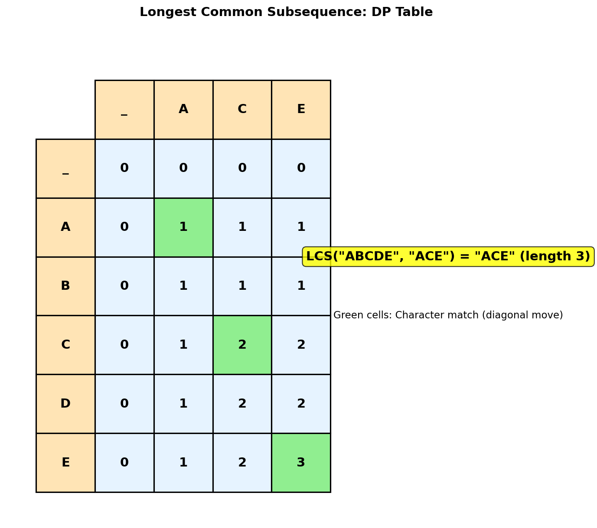
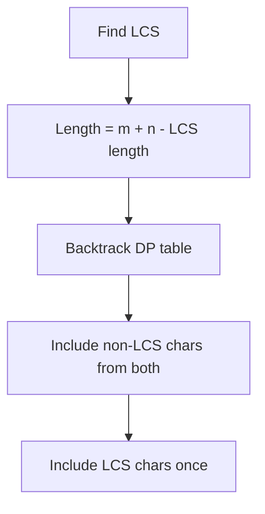
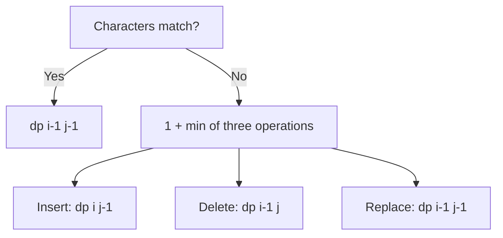
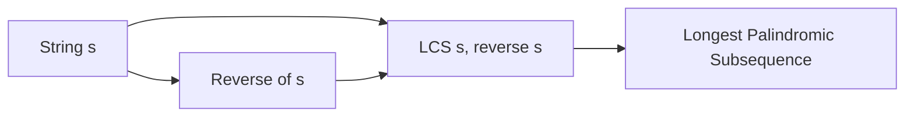
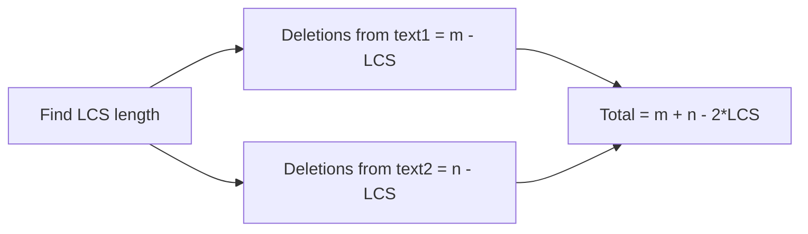

# Longest Common Subsequence

## Problem Statement

Given two strings `text1` and `text2`, return the length of their **longest common subsequence**. If there is no common subsequence, return `0`.

A **subsequence** of a string is a new string generated from the original string with some characters (can be none) deleted without changing the relative order of the remaining characters.

For example, `"ace"` is a subsequence of `"abcde"`.

A **common subsequence** of two strings is a subsequence that is common to both strings.

## Input/Output Format

**Input:**
- `text1` (str): First string
- `text2` (str): Second string

**Output:**
- (int): Length of the longest common subsequence

## Constraints

- `1 <= text1.length, text2.length <= 1000`
- `text1` and `text2` consist of only lowercase English characters

## Examples

### Example 1: Standard Case

**Input:** `text1 = "abcde"`, `text2 = "ace"`

**Output:** `3`

**Explanation:**
The longest common subsequence is `"ace"` with length 3.

```
text1: a b c d e
          |   |   |
text2: a - c - e

Common subsequence: "ace" (length 3)

Other common subsequences:
- "a"   (length 1)
- "c"   (length 1)
- "e"   (length 1)
- "ac"  (length 2)
- "ae"  (length 2)
- "ce"  (length 2)
- "ace" (length 3)  <-- Longest
```

### Example 2: Different Strings

**Input:** `text1 = "abc"`, `text2 = "abc"`

**Output:** `3`

**Explanation:**
The entire string is common. LCS = `"abc"`.

### Example 3: No Common Subsequence

**Input:** `text1 = "abc"`, `text2 = "def"`

**Output:** `0`

**Explanation:**
No characters in common, so no common subsequence.

### Example 4: One Character Match

**Input:** `text1 = "bl"`, `text2 = "yby"`

**Output:** `1`

**Explanation:**
The longest common subsequence is `"b"` with length 1.

## Visual Explanation



## ASCII Art: DP Table Building

```
text1 = "ABCDE", text2 = "ACE"

DP Table: dp[i][j] = LCS length for text1[0..i-1] and text2[0..j-1]

            ""    A    C    E
          +----+----+----+----+
    ""    | 0  | 0  | 0  | 0  |
          +----+----+----+----+
    A     | 0  | 1  | 1  | 1  |  <- A matches A
          +----+----+----+----+
    B     | 0  | 1  | 1  | 1  |  <- B no match
          +----+----+----+----+
    C     | 0  | 1  | 2  | 2  |  <- C matches C
          +----+----+----+----+
    D     | 0  | 1  | 2  | 2  |  <- D no match
          +----+----+----+----+
    E     | 0  | 1  | 2  | 3  |  <- E matches E
          +----+----+----+----+

Recurrence:
If text1[i-1] == text2[j-1]:
    dp[i][j] = dp[i-1][j-1] + 1  (diagonal + 1)
Else:
    dp[i][j] = max(dp[i-1][j], dp[i][j-1])  (max of top or left)

Answer: dp[5][3] = 3
```

## Solution Code

### Approach 1: Top-Down (Memoization)

```python
from functools import lru_cache

def longestCommonSubsequence(text1: str, text2: str) -> int:
    """
    Find LCS length using memoization.

    For each position (i, j), compare characters:
    - If match: 1 + LCS of remaining strings
    - If no match: max of skipping char from either string

    Args:
        text1: First string
        text2: Second string

    Returns:
        Length of longest common subsequence

    Time Complexity: O(m * n)
    Space Complexity: O(m * n)
    """
    @lru_cache(maxsize=None)
    def dp(i: int, j: int) -> int:
        """Return LCS length for text1[i:] and text2[j:]."""
        # Base case: one string is empty
        if i == len(text1) or j == len(text2):
            return 0

        if text1[i] == text2[j]:
            # Characters match, include in LCS
            return 1 + dp(i + 1, j + 1)
        else:
            # No match, try skipping from either string
            return max(dp(i + 1, j), dp(i, j + 1))

    return dp(0, 0)
```

::: info Complexity: Time O(m * n) · Space O(m * n)
- **Time:** Each unique (i, j) pair is computed exactly once due to memoization. With m positions in text1 and n in text2, we have O(m * n) states.
- **Space:** The memoization cache stores O(m * n) entries, plus recursion stack depth of O(m + n) for the deepest call path.
:::

### Approach 2: Bottom-Up (Tabulation)

```python
def longestCommonSubsequence(text1: str, text2: str) -> int:
    """
    Find LCS length using bottom-up DP.

    Build a 2D table where dp[i][j] represents the LCS length
    for text1[0..i-1] and text2[0..j-1].

    Args:
        text1: First string
        text2: Second string

    Returns:
        Length of longest common subsequence

    Time Complexity: O(m * n)
    Space Complexity: O(m * n)
    """
    m, n = len(text1), len(text2)

    # dp[i][j] = LCS length for text1[0..i-1] and text2[0..j-1]
    dp = [[0] * (n + 1) for _ in range(m + 1)]

    for i in range(1, m + 1):
        for j in range(1, n + 1):
            if text1[i - 1] == text2[j - 1]:
                # Characters match
                dp[i][j] = dp[i - 1][j - 1] + 1
            else:
                # No match, take max of excluding either char
                dp[i][j] = max(dp[i - 1][j], dp[i][j - 1])

    return dp[m][n]
```

::: info Complexity: Time O(m * n) · Space O(m * n)
- **Time:** Two nested loops iterate through all (m+1) * (n+1) cells, with constant-time work at each cell.
- **Space:** The 2D dp table has dimensions (m+1) x (n+1) to store LCS lengths for all prefix combinations.
:::

### Approach 3: Space-Optimized (O(min(m,n)) space)

```python
def longestCommonSubsequence(text1: str, text2: str) -> int:
    """
    Find LCS length with optimized space.

    Since we only need the previous row, we can use O(n) space.
    Further optimize by using the shorter string as columns.

    Args:
        text1: First string
        text2: Second string

    Returns:
        Length of longest common subsequence

    Time Complexity: O(m * n)
    Space Complexity: O(min(m, n))
    """
    # Ensure text2 is the shorter string
    if len(text1) < len(text2):
        text1, text2 = text2, text1

    m, n = len(text1), len(text2)

    # Only need current and previous row
    prev = [0] * (n + 1)
    curr = [0] * (n + 1)

    for i in range(1, m + 1):
        for j in range(1, n + 1):
            if text1[i - 1] == text2[j - 1]:
                curr[j] = prev[j - 1] + 1
            else:
                curr[j] = max(prev[j], curr[j - 1])

        # Swap rows
        prev, curr = curr, prev

    return prev[n]
```

::: info Complexity: Time O(m * n) · Space O(min(m, n))
- **Time:** Same O(m * n) iterations as Approach 2, processing all cells row by row.
- **Space:** Only two arrays of size n+1 (prev and curr) are maintained. By swapping text1/text2 if needed, we ensure n = min(m, n).
:::

### Approach 4: Print Actual LCS

```python
def longestCommonSubsequence_with_string(text1: str, text2: str) -> str:
    """
    Find and return the actual longest common subsequence.

    Args:
        text1: First string
        text2: Second string

    Returns:
        The longest common subsequence string

    Time Complexity: O(m * n)
    Space Complexity: O(m * n)
    """
    m, n = len(text1), len(text2)

    # Build DP table
    dp = [[0] * (n + 1) for _ in range(m + 1)]

    for i in range(1, m + 1):
        for j in range(1, n + 1):
            if text1[i - 1] == text2[j - 1]:
                dp[i][j] = dp[i - 1][j - 1] + 1
            else:
                dp[i][j] = max(dp[i - 1][j], dp[i][j - 1])

    # Backtrack to find the LCS
    lcs = []
    i, j = m, n

    while i > 0 and j > 0:
        if text1[i - 1] == text2[j - 1]:
            lcs.append(text1[i - 1])
            i -= 1
            j -= 1
        elif dp[i - 1][j] > dp[i][j - 1]:
            i -= 1
        else:
            j -= 1

    return ''.join(reversed(lcs))
```

::: info Complexity: Time O(m * n) · Space O(m * n)
- **Time:** O(m * n) to build the DP table, plus O(m + n) to backtrack and reconstruct the actual LCS string.
- **Space:** The full 2D table is needed for backtracking, requiring O(m * n) space. The output string uses O(min(m, n)) additional space.
:::

## Complexity Analysis

| Approach | Time Complexity | Space Complexity |
|----------|----------------|------------------|
| Top-Down (Memoization) | O(m * n) | O(m * n) |
| Bottom-Up (Tabulation) | O(m * n) | O(m * n) |
| Space-Optimized | O(m * n) | O(min(m, n)) |

Where m = len(text1), n = len(text2).

## Edge Cases

1. **Empty string:**
   ```python
   longestCommonSubsequence("", "abc")  # Returns 0
   ```

2. **Identical strings:**
   ```python
   longestCommonSubsequence("abc", "abc")  # Returns 3
   ```

3. **No common characters:**
   ```python
   longestCommonSubsequence("abc", "xyz")  # Returns 0
   ```

4. **One is subsequence of other:**
   ```python
   longestCommonSubsequence("abc", "aXbYcZ")  # Returns 3
   ```

5. **Single character strings:**
   ```python
   longestCommonSubsequence("a", "a")  # Returns 1
   longestCommonSubsequence("a", "b")  # Returns 0
   ```

6. **Repeated characters:**
   ```python
   longestCommonSubsequence("aaa", "aa")  # Returns 2
   ```

## Backtracking to Find LCS

```
text1 = "ABCDE", text2 = "ACE"

DP Table after filling:
            ""    A    C    E
    ""       0    0    0    0
    A        0   [1]   1    1
    B        0    1    1    1
    C        0    1   [2]   2
    D        0    1    2    2
    E        0    1    2   [3]

Backtrack from dp[5][3] = 3:
- (5,3): E == E, add 'E', go to (4,2)
- (4,2): D != C, dp[3][2] > dp[4][1], go to (3,2)
- (3,2): C == C, add 'C', go to (2,1)
- (2,1): B != A, dp[1][1] > dp[2][0], go to (1,1)
- (1,1): A == A, add 'A', go to (0,0)
- (0,0): Done

LCS = reverse(['E', 'C', 'A']) = "ACE"
```

## Key Insights

1. **Optimal Substructure**: The LCS of two strings can be computed from LCS of their prefixes.

2. **Two Choices at Each Position**:
   - If characters match: Include in LCS and advance both pointers
   - If not match: Try excluding from either string

3. **State Definition**: `dp[i][j]` = LCS length for `text1[0..i-1]` and `text2[0..j-1]`.

4. **Base Cases**: If either string is empty, LCS length is 0.

5. **LCS vs LIS**: LCS finds common elements between two sequences; LIS finds increasing elements in one sequence.

## Related Problems

::: details Shortest Common Supersequence (LeetCode 1092)
**Problem:** Find the shortest string that has both text1 and text2 as subsequences.

**Key Insight:** Build from LCS. The supersequence includes all characters from both strings, but shared characters (LCS) appear only once.



**Approach:** `len(SCS) = len(text1) + len(text2) - len(LCS)`. Backtrack through DP table, including characters from both strings, with LCS characters added once.

**Complexity:** O(m * n) time, O(m * n) space
:::

::: details Edit Distance (LeetCode 72)
**Problem:** Find minimum operations (insert, delete, replace) to transform word1 into word2.

**Key Insight:** Similar 2D DP structure. When characters match, no operation needed. Otherwise, try all three operations and take minimum.



**Approach:** `dp[i][j] = dp[i-1][j-1]` if match, else `1 + min(dp[i-1][j], dp[i][j-1], dp[i-1][j-1])`.

**Complexity:** O(m * n) time, O(m * n) space (optimizable to O(min(m,n)))
:::

::: details Longest Palindromic Subsequence (LeetCode 516)
**Problem:** Find the length of the longest palindromic subsequence in a string.

**Key Insight:** LCS of string with its reverse gives the longest palindromic subsequence.



**Approach:** `LPS(s) = LCS(s, reverse(s))`. Alternatively, use interval DP: `dp[i][j]` = LPS length for substring `s[i..j]`.

**Complexity:** O(n^2) time, O(n^2) space (or O(n) with optimization)
:::

::: details Delete Operation for Two Strings (LeetCode 583)
**Problem:** Find minimum number of deletions to make two strings equal.

**Key Insight:** The remaining characters after deletions form the LCS. So min deletions = total chars - 2*LCS.



**Approach:** `min_deletions = len(text1) + len(text2) - 2 * LCS(text1, text2)`.

**Complexity:** O(m * n) time, O(min(m, n)) space
:::
