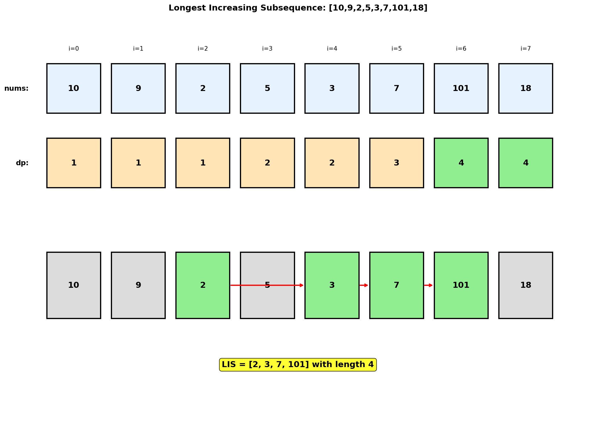
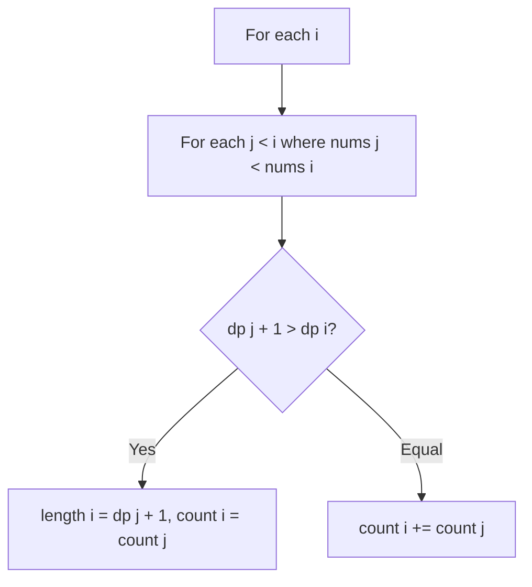
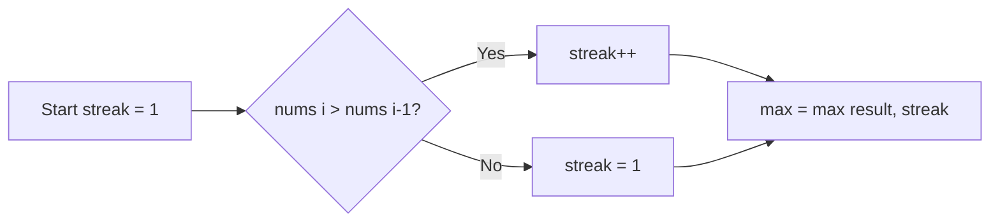
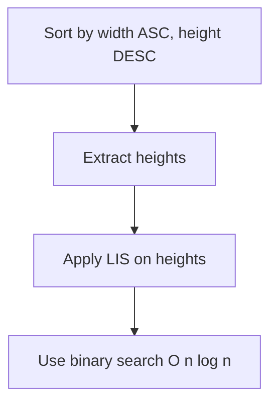
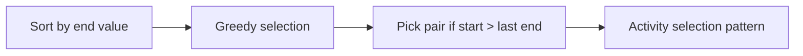

# Longest Increasing Subsequence

## Problem Statement

Given an integer array `nums`, return the length of the **longest strictly increasing subsequence**.

A **subsequence** is a sequence that can be derived from an array by deleting some or no elements without changing the order of the remaining elements. For example, `[3,6,2,7]` is a subsequence of the array `[0,3,1,6,2,2,7]`.

## Input/Output Format

**Input:**
- `nums` (List[int]): Array of integers

**Output:**
- (int): Length of the longest strictly increasing subsequence

## Constraints

- `1 <= nums.length <= 2500`
- `-10^4 <= nums[i] <= 10^4`

## Examples

### Example 1: Standard Case

**Input:** `nums = [10, 9, 2, 5, 3, 7, 101, 18]`

**Output:** `4`

**Explanation:**
The longest increasing subsequence is `[2, 3, 7, 101]` or `[2, 5, 7, 101]`, both have length 4.

```
Array: [10, 9, 2, 5, 3, 7, 101, 18]
Index:   0   1  2  3  4  5   6    7

LIS ending at each index:
Index 0 (10): [10]         -> length 1
Index 1 (9):  [9]          -> length 1
Index 2 (2):  [2]          -> length 1
Index 3 (5):  [2, 5]       -> length 2
Index 4 (3):  [2, 3]       -> length 2
Index 5 (7):  [2, 3, 7] or [2, 5, 7]  -> length 3
Index 6 (101): [2, 3, 7, 101]         -> length 4
Index 7 (18):  [2, 3, 7, 18]          -> length 4

Maximum length = 4
```

### Example 2: All Same Elements

**Input:** `nums = [7, 7, 7, 7, 7, 7, 7]`

**Output:** `1`

**Explanation:**
No strictly increasing pair exists. Each element alone forms an LIS of length 1.

### Example 3: Already Sorted

**Input:** `nums = [0, 1, 0, 3, 2, 3]`

**Output:** `4`

**Explanation:**
The longest increasing subsequence is `[0, 1, 2, 3]`.

```
Array: [0, 1, 0, 3, 2, 3]
Index:  0  1  2  3  4  5

Multiple valid LIS of length 4:
- [0, 1, 2, 3] using indices 0, 1, 4, 5
- [0, 1, 3] is only length 3
```

### Example 4: Decreasing Array

**Input:** `nums = [5, 4, 3, 2, 1]`

**Output:** `1`

**Explanation:**
No increasing pair exists. Maximum LIS is any single element.

## Visual Explanation



## ASCII Art: DP Table Building

```
nums = [10, 9, 2, 5, 3, 7, 101, 18]

DP Array: dp[i] = length of LIS ending at index i

Index:     0    1    2    3    4    5    6    7
         +----+----+----+----+----+----+----+----+
nums:    | 10 | 9  | 2  | 5  | 3  | 7  |101 | 18 |
         +----+----+----+----+----+----+----+----+
dp:      | 1  | 1  | 1  | 2  | 2  | 3  | 4  | 4  |
         +----+----+----+----+----+----+----+----+

Building dp[5] (nums[5] = 7):
=============================
Check all j < 5 where nums[j] < nums[5]:
- j=0: nums[0]=10 > 7, skip
- j=1: nums[1]=9 > 7, skip
- j=2: nums[2]=2 < 7, dp[5] = max(dp[5], dp[2]+1) = max(1, 2) = 2
- j=3: nums[3]=5 < 7, dp[5] = max(dp[5], dp[3]+1) = max(2, 3) = 3
- j=4: nums[4]=3 < 7, dp[5] = max(dp[5], dp[4]+1) = max(3, 3) = 3

dp[5] = 3

Answer: max(dp) = 4
```

## Solution Code

### Approach 1: O(n^2) Dynamic Programming

```python
from typing import List

def lengthOfLIS(nums: List[int]) -> int:
    """
    Find LIS length using O(n^2) DP.

    dp[i] = length of longest increasing subsequence ending at index i.

    For each position i, check all previous positions j where nums[j] < nums[i].
    The LIS ending at i is max of (LIS ending at j) + 1 for all valid j.

    Args:
        nums: Input array

    Returns:
        Length of longest increasing subsequence

    Time Complexity: O(n^2)
    Space Complexity: O(n)
    """
    if not nums:
        return 0

    n = len(nums)
    # dp[i] = length of LIS ending at index i
    dp = [1] * n  # Every element is an LIS of length 1

    for i in range(1, n):
        for j in range(i):
            if nums[j] < nums[i]:
                dp[i] = max(dp[i], dp[j] + 1)

    return max(dp)
```

::: info Complexity: Time O(n^2) · Space O(n)
- **Time:** For each of the n positions, we check all previous positions (0 to i-1), resulting in 1+2+...+(n-1) = O(n^2) comparisons.
- **Space:** The dp array stores one value per element, requiring O(n) space.
:::

### Approach 2: O(n log n) with Binary Search

::: code-group
```python [Python]
from typing import List
import bisect

def lengthOfLIS(nums: List[int]) -> int:
    """
    Find LIS length using binary search approach.

    Maintain a list 'tails' where tails[i] is the smallest tail
    of all increasing subsequences of length i+1.

    Key insight: tails is always sorted, so we can use binary search.

    Args:
        nums: Input array

    Returns:
        Length of longest increasing subsequence

    Time Complexity: O(n log n)
    Space Complexity: O(n)
    """
    tails = []

    for num in nums:
        # Find position where num should be inserted
        pos = bisect.bisect_left(tails, num)

        if pos == len(tails):
            # num is larger than all tails, extend LIS
            tails.append(num)
        else:
            # Replace tail at pos with smaller num
            tails[pos] = num

    return len(tails)
```

```java [Java]
public int lengthOfLIS(int[] nums) {
    // tails[i] = smallest tail of all increasing subsequences of length i+1
    int[] tails = new int[nums.length];
    int size = 0;

    for (int num : nums) {
        // bisect_left: find leftmost position where tails[pos] >= num
        int pos = Arrays.binarySearch(tails, 0, size, num);
        if (pos < 0) pos = -(pos + 1); // convert to insertion point

        tails[pos] = num;
        if (pos == size) size++; // extending the LIS
    }

    return size;
}
```
:::

::: info Complexity: Time O(n log n) · Space O(n)
- **Time:** For each of the n elements, we perform a binary search on the tails array which has at most n elements, giving O(log n) per element.
- **Space:** The tails array can grow to at most n elements (when the entire array is strictly increasing).
:::

### Approach 3: O(n log n) with Explicit Binary Search

```python
from typing import List

def lengthOfLIS(nums: List[int]) -> int:
    """
    Find LIS length with explicit binary search implementation.

    Args:
        nums: Input array

    Returns:
        Length of longest increasing subsequence

    Time Complexity: O(n log n)
    Space Complexity: O(n)
    """
    def binary_search(arr: List[int], target: int) -> int:
        """Find leftmost position to insert target."""
        left, right = 0, len(arr)
        while left < right:
            mid = (left + right) // 2
            if arr[mid] < target:
                left = mid + 1
            else:
                right = mid
        return left

    tails = []

    for num in nums:
        pos = binary_search(tails, num)

        if pos == len(tails):
            tails.append(num)
        else:
            tails[pos] = num

    return len(tails)
```

::: info Complexity: Time O(n log n) · Space O(n)
- **Time:** Same as Approach 2 - manual binary search implementation has the same O(log n) complexity per element.
- **Space:** The tails array requires O(n) space in the worst case.
:::

### Approach 4: Return Actual LIS (not just length)

```python
from typing import List
import bisect

def lengthOfLIS_with_sequence(nums: List[int]) -> List[int]:
    """
    Find the actual longest increasing subsequence.

    Args:
        nums: Input array

    Returns:
        One valid longest increasing subsequence

    Time Complexity: O(n log n)
    Space Complexity: O(n)
    """
    if not nums:
        return []

    n = len(nums)
    # tails[i] = smallest tail of LIS of length i+1
    tails = []
    # parent[i] = index of previous element in LIS ending at i
    parent = [-1] * n
    # indices[i] = index in nums of tails[i]
    indices = []

    for i, num in enumerate(nums):
        pos = bisect.bisect_left(tails, num)

        if pos == len(tails):
            tails.append(num)
            indices.append(i)
        else:
            tails[pos] = num
            indices[pos] = i

        # Set parent
        if pos > 0:
            parent[i] = indices[pos - 1]

    # Reconstruct LIS
    lis = []
    idx = indices[-1]
    while idx != -1:
        lis.append(nums[idx])
        idx = parent[idx]

    return lis[::-1]
```

::: info Complexity: Time O(n log n) · Space O(n)
- **Time:** Same O(n log n) for building the tails array, plus O(n) for reconstructing the actual subsequence by following parent pointers.
- **Space:** Three arrays (tails, parent, indices) each of size O(n), giving O(n) total space.
:::

## Complexity Analysis

| Approach | Time Complexity | Space Complexity |
|----------|----------------|------------------|
| O(n^2) DP | O(n^2) | O(n) |
| Binary Search | O(n log n) | O(n) |

## Edge Cases

1. **Empty array:**
   ```python
   lengthOfLIS([])  # Returns 0
   ```

2. **Single element:**
   ```python
   lengthOfLIS([5])  # Returns 1
   ```

3. **All identical:**
   ```python
   lengthOfLIS([1, 1, 1, 1])  # Returns 1 (strictly increasing)
   ```

4. **Sorted ascending:**
   ```python
   lengthOfLIS([1, 2, 3, 4, 5])  # Returns 5
   ```

5. **Sorted descending:**
   ```python
   lengthOfLIS([5, 4, 3, 2, 1])  # Returns 1
   ```

6. **Two elements:**
   ```python
   lengthOfLIS([2, 1])  # Returns 1
   lengthOfLIS([1, 2])  # Returns 2
   ```

## Understanding the Binary Search Approach

```
Process nums = [10, 9, 2, 5, 3, 7, 101, 18]:

Step 1: num = 10
  tails = [] -> [10]

Step 2: num = 9
  9 < 10, replace tails[0]
  tails = [10] -> [9]

Step 3: num = 2
  2 < 9, replace tails[0]
  tails = [9] -> [2]

Step 4: num = 5
  5 > 2, append
  tails = [2] -> [2, 5]

Step 5: num = 3
  2 < 3 < 5, replace tails[1]
  tails = [2, 5] -> [2, 3]

Step 6: num = 7
  7 > 3, append
  tails = [2, 3] -> [2, 3, 7]

Step 7: num = 101
  101 > 7, append
  tails = [2, 3, 7] -> [2, 3, 7, 101]

Step 8: num = 18
  7 < 18 < 101, replace tails[3]
  tails = [2, 3, 7, 101] -> [2, 3, 7, 18]

Final: len(tails) = 4

Note: tails is NOT the actual LIS, just used to track length!
```

## Key Insights

1. **State Definition**: In the O(n^2) approach, `dp[i]` represents the length of LIS ending at index i.

2. **Patience Sorting**: The O(n log n) approach is based on patience sorting. Each element is placed on the leftmost pile where it can go (or creates a new pile).

3. **Binary Search Invariant**: The `tails` array is always sorted, enabling binary search to find the correct position for each new element.

4. **Strictly Increasing**: Use `bisect_left` for strictly increasing. For non-decreasing, use `bisect_right`.

5. **Multiple Valid LIS**: There can be multiple LIS of the same maximum length. The O(n^2) approach can be modified to track the actual sequence.

## Related Problems

::: details Number of Longest Increasing Subsequence (LeetCode 673)
**Problem:** Given an integer array, return the number of longest increasing subsequences.

**Key Insight:** Track both length and count of LIS ending at each index. When finding a longer LIS, reset count. When finding equal length, add to count.



**Approach:** `dp[i], cnt[i]` = (length, count) of LIS ending at i. Sum counts where dp[i] equals max length.

**Complexity:** O(n^2) time, O(n) space
:::

::: details Longest Continuous Increasing Subsequence (LeetCode 674)
**Problem:** Find the length of the longest continuous increasing subarray (elements must be contiguous).

**Key Insight:** Much simpler than LIS - just track current streak length and reset when not increasing.



**Approach:** Linear scan tracking current streak. Reset when `nums[i] <= nums[i-1]`.

**Complexity:** O(n) time, O(1) space
:::

::: details Russian Doll Envelopes (LeetCode 354)
**Problem:** Given envelopes with width and height, find maximum number that can be nested (both dimensions must be strictly smaller).

**Key Insight:** 2D LIS problem. Sort by width ascending, then by height descending. Apply LIS on heights.



**Approach:** Sort `(w, h)` by w ascending, h descending. Then find LIS of heights. Height descending prevents using same-width envelopes.

**Complexity:** O(n log n) time, O(n) space
:::

::: details Maximum Length of Pair Chain (LeetCode 646)
**Problem:** Given pairs `[a, b]` where a < b, find longest chain where for consecutive pairs `[c, d]` and `[e, f]`, d < e.

**Key Insight:** Greedy works! Sort by end value and greedily pick pairs. Unlike LIS, order of elements doesn't matter here.



**Approach:** Sort by second element. Greedily select pairs where `pair[0] > last_end`. This is the interval scheduling / activity selection pattern.

**Complexity:** O(n log n) time, O(1) space
:::
