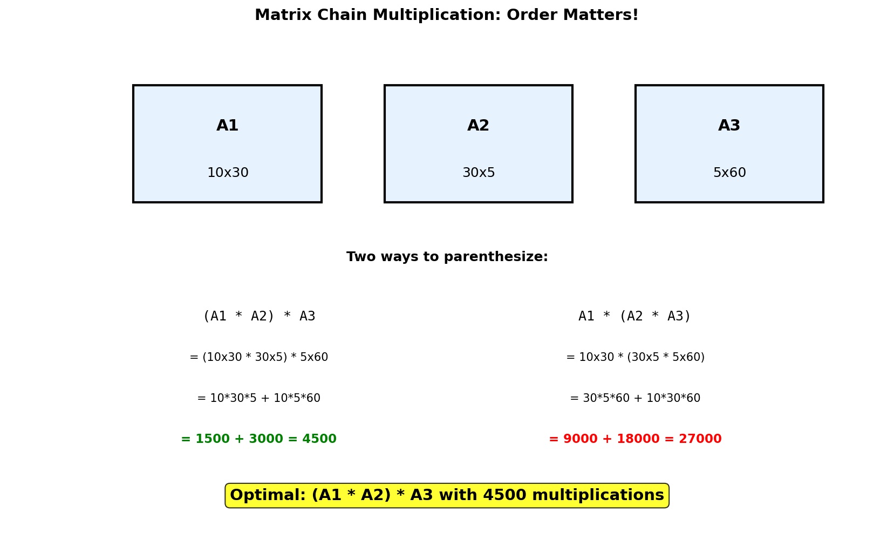
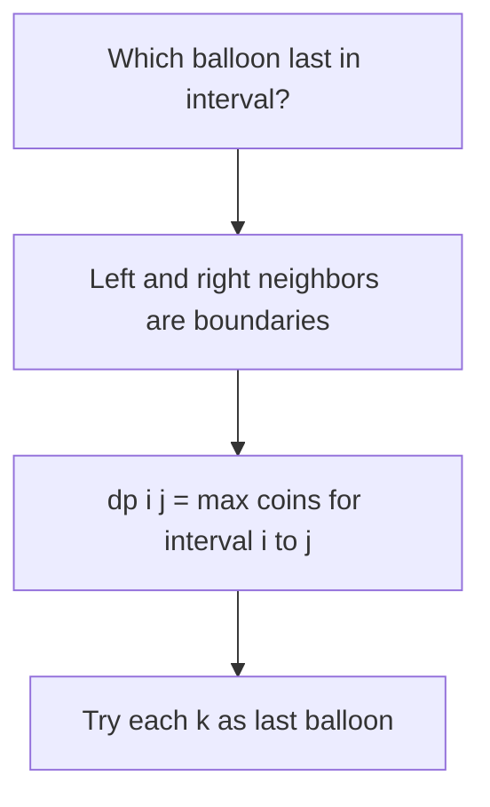
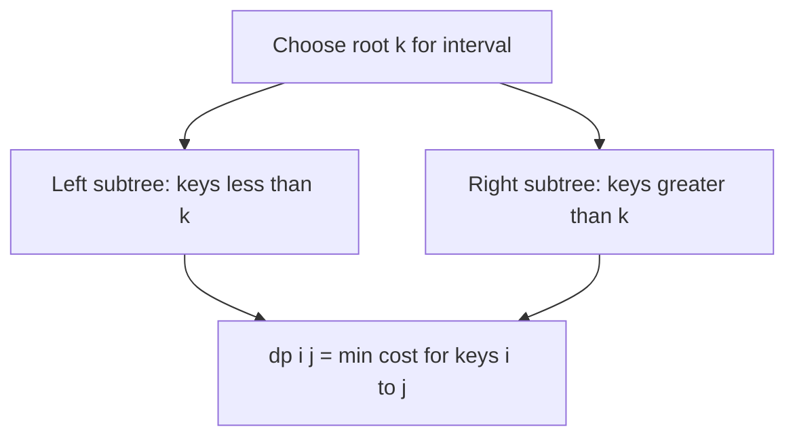
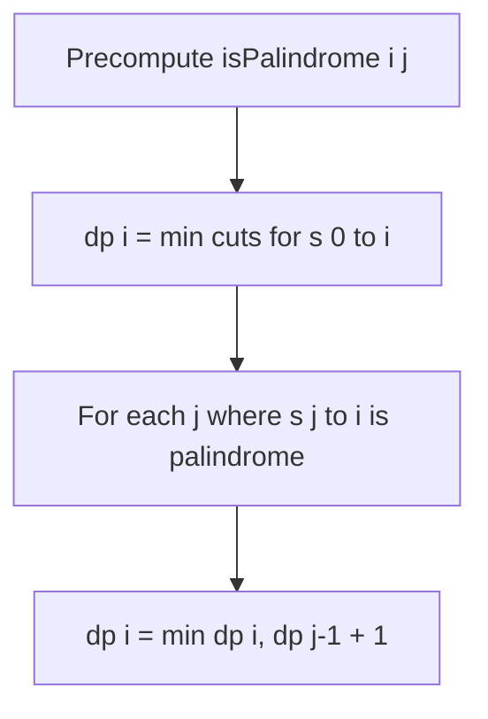
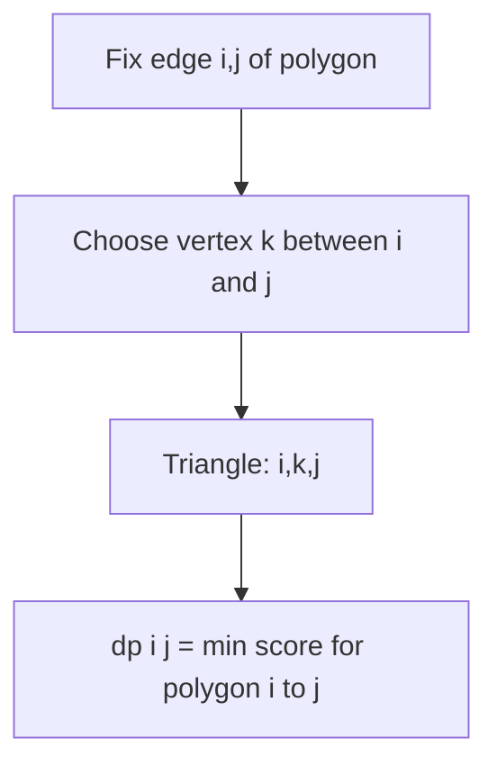

# Matrix Chain Multiplication

## Problem Statement

Given a sequence of matrices, find the most efficient way to multiply these matrices together. The goal is to minimize the total number of scalar multiplications.

Given an array `dimensions` where `dimensions[i-1] x dimensions[i]` represents the dimensions of matrix `i`, return the minimum number of scalar multiplications needed to compute the product of all matrices.

**Note**: Matrix multiplication is associative, so the order of multiplication affects the cost but not the result.

## Input/Output Format

**Input:**
- `dimensions` (List[int]): Array where matrix i has dimensions `dimensions[i-1] x dimensions[i]`

**Output:**
- (int): Minimum number of scalar multiplications

## Constraints

- `2 <= dimensions.length <= 100`
- `1 <= dimensions[i] <= 500`

## Examples

### Example 1: Three Matrices

**Input:** `dimensions = [10, 30, 5, 60]`

This represents:
- A1: 10 x 30
- A2: 30 x 5
- A3: 5 x 60

**Output:** `4500`

**Explanation:**
```
Two ways to parenthesize:

Option 1: (A1 * A2) * A3
- A1 * A2: (10x30) * (30x5) = 10 * 30 * 5 = 1500 ops
- Result: (10x5) * (5x60) = 10 * 5 * 60 = 3000 ops
- Total: 1500 + 3000 = 4500

Option 2: A1 * (A2 * A3)
- A2 * A3: (30x5) * (5x60) = 30 * 5 * 60 = 9000 ops
- A1 * Result: (10x30) * (30x60) = 10 * 30 * 60 = 18000 ops
- Total: 9000 + 18000 = 27000

Optimal: (A1 * A2) * A3 with 4500 multiplications
```

### Example 2: Four Matrices

**Input:** `dimensions = [40, 20, 30, 10, 30]`

This represents:
- A1: 40 x 20
- A2: 20 x 30
- A3: 30 x 10
- A4: 10 x 30

**Output:** `26000`

**Explanation:**
The optimal parenthesization is `((A1 * A2) * A3) * A4`.

### Example 3: Two Matrices

**Input:** `dimensions = [10, 20, 30]`

**Output:** `6000`

**Explanation:**
Only one way: `A1 * A2` = 10 * 20 * 30 = 6000.

## Visual Explanation



## ASCII Art: DP Table Building

```
dimensions = [10, 30, 5, 60]
Matrices: A1(10x30), A2(30x5), A3(5x60)

DP Table: dp[i][j] = min cost to multiply matrices i to j

Let's number matrices 1, 2, 3:

          j=1    j=2    j=3
        +------+------+------+
   i=1  |   0  | 1500 | 4500 |
        +------+------+------+
   i=2  |   -  |   0  | 9000 |
        +------+------+------+
   i=3  |   -  |   -  |   0  |
        +------+------+------+

Building dp[1][3] (multiply A1, A2, A3):
=======================================
Try all split points k:

k=1: (A1) * (A2, A3)
  = dp[1][1] + dp[2][3] + dim[0]*dim[1]*dim[3]
  = 0 + 9000 + 10*30*60
  = 0 + 9000 + 18000 = 27000

k=2: (A1, A2) * (A3)
  = dp[1][2] + dp[3][3] + dim[0]*dim[2]*dim[3]
  = 1500 + 0 + 10*5*60
  = 1500 + 0 + 3000 = 4500

dp[1][3] = min(27000, 4500) = 4500

Answer: 4500
```

## Solution Code

### Approach 1: Top-Down (Memoization)

```python
from typing import List
from functools import lru_cache

def matrixMultiplication(dimensions: List[int]) -> int:
    """
    Find minimum cost using memoization.

    Try all possible split points and take minimum.

    Args:
        dimensions: Array of matrix dimensions

    Returns:
        Minimum number of scalar multiplications

    Time Complexity: O(n^3)
    Space Complexity: O(n^2)
    """
    n = len(dimensions) - 1  # Number of matrices

    @lru_cache(maxsize=None)
    def dp(i: int, j: int) -> int:
        """Min cost to multiply matrices i to j (1-indexed)."""
        # Base case: single matrix
        if i == j:
            return 0

        min_cost = float('inf')

        # Try all split points
        for k in range(i, j):
            # Cost = left + right + cost of final multiplication
            cost = (dp(i, k) + dp(k + 1, j) +
                   dimensions[i - 1] * dimensions[k] * dimensions[j])
            min_cost = min(min_cost, cost)

        return min_cost

    return dp(1, n)
```

::: info Complexity: Time O(n^3) · Space O(n^2)
- **Time:** There are O(n^2) subproblems (all pairs i,j) and each subproblem tries O(n) split points, giving O(n^3) total.
- **Space:** The memoization cache stores O(n^2) entries plus recursion stack depth of O(n).
:::

### Approach 2: Bottom-Up (Tabulation)

```python
from typing import List

def matrixMultiplication(dimensions: List[int]) -> int:
    """
    Find minimum cost using bottom-up DP.

    Build solution for increasing chain lengths.

    Args:
        dimensions: Array of matrix dimensions

    Returns:
        Minimum number of scalar multiplications

    Time Complexity: O(n^3)
    Space Complexity: O(n^2)
    """
    n = len(dimensions) - 1  # Number of matrices

    # dp[i][j] = min cost to multiply matrices i to j
    dp = [[0] * (n + 1) for _ in range(n + 1)]

    # length = 1 means single matrix, cost = 0 (already set)

    # Fill for increasing chain lengths
    for length in range(2, n + 1):  # Chain length
        for i in range(1, n - length + 2):  # Start index
            j = i + length - 1  # End index
            dp[i][j] = float('inf')

            # Try all split points
            for k in range(i, j):
                cost = (dp[i][k] + dp[k + 1][j] +
                       dimensions[i - 1] * dimensions[k] * dimensions[j])
                dp[i][j] = min(dp[i][j], cost)

    return dp[1][n]
```

::: info Complexity: Time O(n^3) · Space O(n^2)
- **Time:** Three nested loops: length (n iterations), start position (n iterations), and split point (n iterations).
- **Space:** The 2D dp table of size (n+1) x (n+1) stores minimum costs for all interval pairs.
:::

### Approach 3: With Parenthesization Tracking

```python
from typing import List, Tuple

def matrixMultiplication_with_order(
    dimensions: List[int]
) -> Tuple[int, str]:
    """
    Find minimum cost and return optimal parenthesization.

    Args:
        dimensions: Array of matrix dimensions

    Returns:
        Tuple of (minimum cost, optimal parenthesization string)

    Time Complexity: O(n^3)
    Space Complexity: O(n^2)
    """
    n = len(dimensions) - 1

    dp = [[0] * (n + 1) for _ in range(n + 1)]
    split = [[0] * (n + 1) for _ in range(n + 1)]

    for length in range(2, n + 1):
        for i in range(1, n - length + 2):
            j = i + length - 1
            dp[i][j] = float('inf')

            for k in range(i, j):
                cost = (dp[i][k] + dp[k + 1][j] +
                       dimensions[i - 1] * dimensions[k] * dimensions[j])
                if cost < dp[i][j]:
                    dp[i][j] = cost
                    split[i][j] = k

    def build_parenthesization(i: int, j: int) -> str:
        """Reconstruct optimal parenthesization."""
        if i == j:
            return f"A{i}"

        k = split[i][j]
        left = build_parenthesization(i, k)
        right = build_parenthesization(k + 1, j)
        return f"({left} * {right})"

    return dp[1][n], build_parenthesization(1, n)
```

::: info Complexity: Time O(n^3) · Space O(n^2)
- **Time:** Same as Approach 2, with additional O(n) work to reconstruct the parenthesization string via recursion.
- **Space:** Two 2D tables (dp and split) each of size O(n^2), plus O(n) recursion stack for reconstruction.
:::

### Approach 4: Alternative Indexing (0-based)

```python
from typing import List

def matrixMultiplication(dimensions: List[int]) -> int:
    """
    Find minimum cost with 0-based indexing.

    Args:
        dimensions: Array of matrix dimensions

    Returns:
        Minimum number of scalar multiplications

    Time Complexity: O(n^3)
    Space Complexity: O(n^2)
    """
    n = len(dimensions) - 1

    # dp[i][j] = min cost for matrices i to j (0-indexed)
    dp = [[0] * n for _ in range(n)]

    for length in range(2, n + 1):
        for i in range(n - length + 1):
            j = i + length - 1
            dp[i][j] = float('inf')

            for k in range(i, j):
                cost = (dp[i][k] + dp[k + 1][j] +
                       dimensions[i] * dimensions[k + 1] * dimensions[j + 1])
                dp[i][j] = min(dp[i][j], cost)

    return dp[0][n - 1]
```

::: info Complexity: Time O(n^3) · Space O(n^2)
- **Time:** Identical algorithm to Approach 2, just with 0-based indexing instead of 1-based.
- **Space:** The dp table is n x n instead of (n+1) x (n+1), but still O(n^2).
:::

## Complexity Analysis

| Approach | Time Complexity | Space Complexity |
|----------|----------------|------------------|
| Top-Down | O(n^3) | O(n^2) |
| Bottom-Up | O(n^3) | O(n^2) |

The O(n^3) comes from:
- O(n^2) subproblems (all pairs i, j)
- O(n) split points for each subproblem

## Edge Cases

1. **Two matrices (one multiplication):**
   ```python
   matrixMultiplication([10, 20, 30])  # 10*20*30 = 6000
   ```

2. **All same dimensions:**
   ```python
   matrixMultiplication([10, 10, 10, 10])  # All square matrices
   ```

3. **Single matrix:**
   ```python
   matrixMultiplication([10, 20])  # Returns 0 (no multiplication needed)
   ```

4. **Large dimension differences:**
   ```python
   matrixMultiplication([1, 1000, 1])  # Strategic ordering matters a lot
   ```

## Understanding the Recurrence

```
For matrices A[i..j], we try every split point k:

    A[i..j] = A[i..k] * A[k+1..j]

Cost = cost(A[i..k]) + cost(A[k+1..j]) + cost(final multiplication)

The final multiplication combines:
- Result of A[i..k]: dimensions[i-1] x dimensions[k]
- Result of A[k+1..j]: dimensions[k] x dimensions[j]
- Final product: dimensions[i-1] x dimensions[j]

Cost of multiplying two matrices (p x q) * (q x r) = p * q * r

So: final_cost = dimensions[i-1] * dimensions[k] * dimensions[j]
```

## Key Insights

1. **Interval DP**: This is a classic interval DP problem where we solve for all intervals [i, j] of increasing length.

2. **Optimal Substructure**: The optimal solution for [i, j] is built from optimal solutions of [i, k] and [k+1, j].

3. **Non-commutative**: Matrix multiplication is associative but not commutative. We can change grouping but not order.

4. **Cost Formula**: Multiplying (p x q) and (q x r) matrices costs p * q * r scalar multiplications.

5. **Catalan Numbers**: The number of ways to parenthesize n matrices is the (n-1)th Catalan number.

## Related Problems

::: details Burst Balloons (LeetCode 312)
**Problem:** Given balloons with values, burst all to maximize coins. Bursting balloon i earns nums[left] * nums[i] * nums[right].

**Key Insight:** Same interval DP structure. Think of which balloon to burst LAST in each interval, not first.



**Approach:** `dp[i][j] = max(dp[i][k-1] + dp[k+1][j] + nums[i-1]*nums[k]*nums[j+1])` for k in [i,j]. Add boundary 1s to handle edges.

**Complexity:** O(n^3) time, O(n^2) space
:::

::: details Optimal Binary Search Tree (Classic)
**Problem:** Given keys with search frequencies, construct BST minimizing expected search cost.

**Key Insight:** Interval DP choosing root for each interval. Cost = sum of frequencies in subtree * depth.



**Approach:** `dp[i][j] = min(dp[i][k-1] + dp[k+1][j] + sum(freq[i:j+1]))` for k in [i,j]. Root at depth 0, children increase depth.

**Complexity:** O(n^3) time, O(n^2) space
:::

::: details Palindrome Partitioning II (LeetCode 132)
**Problem:** Find minimum cuts to partition string into palindromes.

**Key Insight:** Different from matrix chain - use 1D DP with precomputed palindrome info.



**Approach:** First compute `isPalin[i][j]` for all substrings. Then `dp[i] = min(dp[j-1] + 1)` for all j where s[j:i+1] is palindrome.

**Complexity:** O(n^2) time, O(n^2) space
:::

::: details Minimum Score Triangulation (LeetCode 1039)
**Problem:** Triangulate polygon, minimize sum of triangle scores (product of three vertices).

**Key Insight:** Interval DP on polygon vertices. Fix one edge, choose third vertex of triangle.



**Approach:** `dp[i][j] = min(dp[i][k] + dp[k][j] + A[i]*A[k]*A[j])` for k in [i+1, j-1]. Similar to matrix chain with edge as boundary.

**Complexity:** O(n^3) time, O(n^2) space
:::
