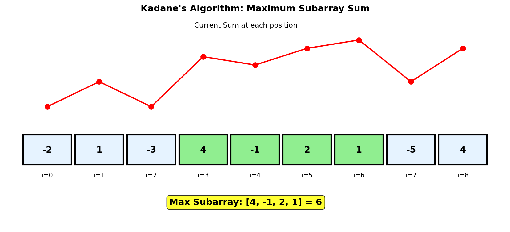
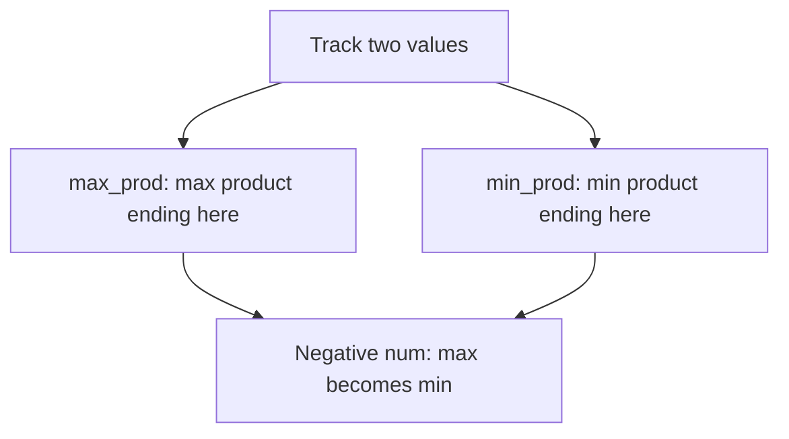
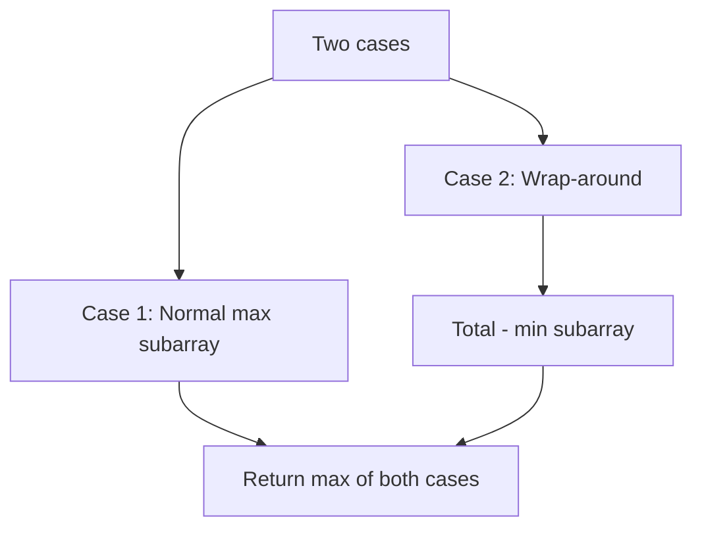
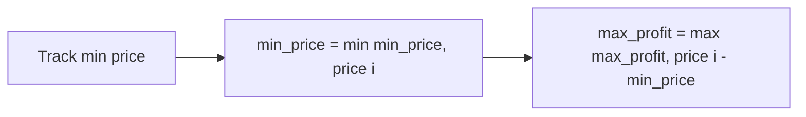
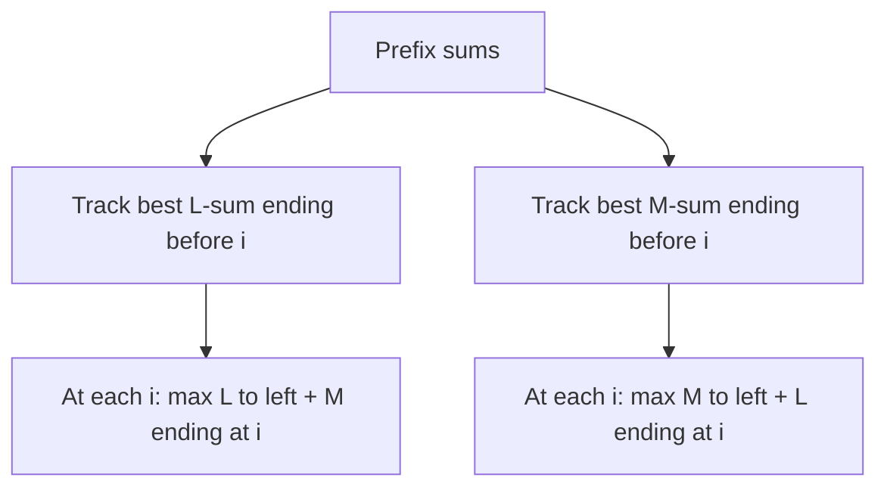

# Maximum Subarray (Kadane's Algorithm)

## Problem Statement

Given an integer array `nums`, find the **subarray** with the largest sum, and return its sum.

A **subarray** is a contiguous non-empty sequence of elements within an array.

## Input/Output Format

**Input:**
- `nums` (List[int]): Array of integers (can include negative numbers)

**Output:**
- (int): Maximum sum of any contiguous subarray

## Constraints

- `1 <= nums.length <= 10^5`
- `-10^4 <= nums[i] <= 10^4`

## Examples

### Example 1: Mixed Array

**Input:** `nums = [-2, 1, -3, 4, -1, 2, 1, -5, 4]`

**Output:** `6`

**Explanation:**
```
Array: [-2, 1, -3, 4, -1, 2, 1, -5, 4]
                  |-----------|
                   Maximum subarray

The subarray [4, -1, 2, 1] has the largest sum = 6.

Breakdown:
- [4] = 4
- [4, -1] = 3
- [4, -1, 2] = 5
- [4, -1, 2, 1] = 6  <-- Maximum
- [4, -1, 2, 1, -5] = 1
```

### Example 2: Single Element

**Input:** `nums = [1]`

**Output:** `1`

**Explanation:**
The subarray [1] has sum 1.

### Example 3: All Positive

**Input:** `nums = [5, 4, -1, 7, 8]`

**Output:** `23`

**Explanation:**
The entire array is the maximum subarray: 5 + 4 + (-1) + 7 + 8 = 23.

### Example 4: All Negative

**Input:** `nums = [-3, -1, -2]`

**Output:** `-1`

**Explanation:**
The subarray [-1] has the largest sum among all negative numbers.

## Visual Explanation



## ASCII Art: Kadane's Algorithm Trace

```
nums = [-2, 1, -3, 4, -1, 2, 1, -5, 4]

Kadane's Algorithm tracks:
- current_sum: max sum ending at current position
- max_sum: global maximum found so far

Index:  0    1    2    3    4    5    6    7    8
nums:  -2    1   -3    4   -1    2    1   -5    4
       ---  ---  ---  ---  ---  ---  ---  ---  ---
curr:  -2    1   -2    4    3    5    6    1    5
       ^           ^
       |           |
    start      reset to 4 (4 > -2+4)

max:   -2    1    1    4    4    5    6    6    6

Step-by-step:
i=0: curr = max(-2, 0+(-2)) = -2, max_sum = -2
i=1: curr = max(1, -2+1=-1) = 1, max_sum = 1
i=2: curr = max(-3, 1+(-3)=-2) = -2, max_sum = 1
i=3: curr = max(4, -2+4=2) = 4, max_sum = 4   <-- Start new subarray
i=4: curr = max(-1, 4+(-1)=3) = 3, max_sum = 4
i=5: curr = max(2, 3+2=5) = 5, max_sum = 5
i=6: curr = max(1, 5+1=6) = 6, max_sum = 6   <-- Maximum found!
i=7: curr = max(-5, 6+(-5)=1) = 1, max_sum = 6
i=8: curr = max(4, 1+4=5) = 5, max_sum = 6

Answer: max_sum = 6
```

## Solution Code

### Approach 1: Kadane's Algorithm (Optimal)

```python
from typing import List

def maxSubArray(nums: List[int]) -> int:
    """
    Find maximum subarray sum using Kadane's algorithm.

    At each position, decide whether to:
    - Extend the previous subarray (add current element)
    - Start a new subarray from current element

    Args:
        nums: Array of integers

    Returns:
        Maximum subarray sum

    Time Complexity: O(n)
    Space Complexity: O(1)
    """
    current_sum = nums[0]
    max_sum = nums[0]

    for i in range(1, len(nums)):
        # Either extend or start new
        current_sum = max(nums[i], current_sum + nums[i])
        max_sum = max(max_sum, current_sum)

    return max_sum
```

::: info Complexity: Time O(n) · Space O(1)
- **Time:** Single pass through the array, performing constant-time comparison and update operations at each element.
- **Space:** Only two variables (current_sum, max_sum) are maintained regardless of array size.
:::

### Approach 2: Kadane's with Indices

```python
from typing import List, Tuple

def maxSubArray_with_indices(nums: List[int]) -> Tuple[int, int, int]:
    """
    Find maximum subarray sum and return the subarray indices.

    Args:
        nums: Array of integers

    Returns:
        Tuple of (max_sum, start_index, end_index)

    Time Complexity: O(n)
    Space Complexity: O(1)
    """
    current_sum = nums[0]
    max_sum = nums[0]

    # Track indices
    temp_start = 0
    start = 0
    end = 0

    for i in range(1, len(nums)):
        if nums[i] > current_sum + nums[i]:
            # Start new subarray
            current_sum = nums[i]
            temp_start = i
        else:
            # Extend current subarray
            current_sum += nums[i]

        if current_sum > max_sum:
            max_sum = current_sum
            start = temp_start
            end = i

    return max_sum, start, end
```

::: info Complexity: Time O(n) · Space O(1)
- **Time:** Same O(n) as Approach 1, with additional bookkeeping for indices at each step.
- **Space:** Uses O(1) extra variables to track start and end indices along with temp_start.
:::

### Approach 3: Dynamic Programming (Explicit)

```python
from typing import List

def maxSubArray(nums: List[int]) -> int:
    """
    Find maximum subarray sum using explicit DP.

    dp[i] = maximum subarray sum ending at index i.

    Args:
        nums: Array of integers

    Returns:
        Maximum subarray sum

    Time Complexity: O(n)
    Space Complexity: O(n)
    """
    n = len(nums)

    # dp[i] = max subarray sum ending at index i
    dp = [0] * n
    dp[0] = nums[0]

    for i in range(1, n):
        dp[i] = max(nums[i], dp[i - 1] + nums[i])

    return max(dp)
```

::: info Complexity: Time O(n) · Space O(n)
- **Time:** Two passes: O(n) to fill the dp array, then O(n) to find the maximum value in dp.
- **Space:** The dp array explicitly stores the maximum subarray sum ending at each index, requiring O(n) space.
:::

### Approach 4: Divide and Conquer

```python
from typing import List

def maxSubArray(nums: List[int]) -> int:
    """
    Find maximum subarray sum using divide and conquer.

    Divide array in half, find max in:
    1. Left half
    2. Right half
    3. Crossing the middle

    Args:
        nums: Array of integers

    Returns:
        Maximum subarray sum

    Time Complexity: O(n log n)
    Space Complexity: O(log n) - recursion stack
    """
    def max_crossing_sum(nums: List[int], left: int, mid: int, right: int) -> int:
        """Find max sum that crosses the midpoint."""
        # Left side of mid (going left)
        left_sum = float('-inf')
        curr_sum = 0
        for i in range(mid, left - 1, -1):
            curr_sum += nums[i]
            left_sum = max(left_sum, curr_sum)

        # Right side of mid (going right)
        right_sum = float('-inf')
        curr_sum = 0
        for i in range(mid + 1, right + 1):
            curr_sum += nums[i]
            right_sum = max(right_sum, curr_sum)

        return left_sum + right_sum

    def helper(nums: List[int], left: int, right: int) -> int:
        """Find max subarray sum in nums[left:right+1]."""
        if left == right:
            return nums[left]

        mid = (left + right) // 2

        return max(
            helper(nums, left, mid),           # Left half
            helper(nums, mid + 1, right),      # Right half
            max_crossing_sum(nums, left, mid, right)  # Crossing
        )

    return helper(nums, 0, len(nums) - 1)
```

::: info Complexity: Time O(n log n) · Space O(log n)
- **Time:** Recurrence T(n) = 2T(n/2) + O(n) gives O(n log n). We split into halves (log n levels) and do O(n) work per level for crossing sum.
- **Space:** The recursion stack depth is O(log n) for a balanced divide-and-conquer tree.
:::

### Approach 5: Prefix Sum

```python
from typing import List

def maxSubArray(nums: List[int]) -> int:
    """
    Find maximum subarray sum using prefix sums.

    max_subarray_sum = max(prefix[j] - prefix[i]) for j > i
    which equals max(prefix[j]) - min(prefix[i]) for i < j

    Args:
        nums: Array of integers

    Returns:
        Maximum subarray sum

    Time Complexity: O(n)
    Space Complexity: O(1)
    """
    max_sum = float('-inf')
    prefix_sum = 0
    min_prefix = 0  # Minimum prefix sum seen so far

    for num in nums:
        prefix_sum += num
        max_sum = max(max_sum, prefix_sum - min_prefix)
        min_prefix = min(min_prefix, prefix_sum)

    return max_sum
```

::: info Complexity: Time O(n) · Space O(1)
- **Time:** Single pass computing running prefix sum and tracking minimum seen so far.
- **Space:** Only three variables (max_sum, prefix_sum, min_prefix) regardless of input size.
:::

## Complexity Analysis

| Approach | Time Complexity | Space Complexity |
|----------|----------------|------------------|
| Kadane's Algorithm | O(n) | O(1) |
| Explicit DP | O(n) | O(n) |
| Divide and Conquer | O(n log n) | O(log n) |
| Prefix Sum | O(n) | O(1) |

## Edge Cases

1. **Single element:**
   ```python
   maxSubArray([5])   # Returns 5
   maxSubArray([-5])  # Returns -5
   ```

2. **All negative:**
   ```python
   maxSubArray([-3, -1, -2])  # Returns -1 (least negative)
   ```

3. **All positive:**
   ```python
   maxSubArray([1, 2, 3])  # Returns 6 (entire array)
   ```

4. **Zeros:**
   ```python
   maxSubArray([0, 0, 0])  # Returns 0
   maxSubArray([-1, 0, -2])  # Returns 0
   ```

5. **Large array:**
   ```python
   maxSubArray([1] * 100000)  # Returns 100000
   ```

## Why Kadane's Algorithm Works

```
Key Insight: At each position i, we have two choices:
1. Extend the previous subarray by adding nums[i]
2. Start a new subarray from nums[i]

We choose the option that gives a larger sum.

If current_sum + nums[i] < nums[i]:
    - Previous subarray has negative sum
    - Better to start fresh from nums[i]

If current_sum + nums[i] >= nums[i]:
    - Previous subarray contributes positively
    - Extend it by including nums[i]

This is optimal because:
- We always maintain the maximum sum ending at each position
- We track the global maximum across all positions
- No need to explicitly try all O(n^2) subarrays
```

## Key Insights

1. **State Definition**: In DP terms, `dp[i]` = maximum subarray sum ending at index i.

2. **Recurrence**: `dp[i] = max(nums[i], dp[i-1] + nums[i])`.

3. **Space Optimization**: Only need previous value, so O(1) space suffices.

4. **Negative Numbers**: If all numbers are negative, return the least negative (single element).

5. **Greedy Nature**: Kadane's is essentially greedy - always make locally optimal choice.

## Related Problems

::: details Maximum Product Subarray (LeetCode 152)
**Problem:** Find contiguous subarray with the largest product. Array may contain negative numbers.

**Key Insight:** Track both max and min at each position. A negative number can flip min to max when multiplied.



**Approach:** `max_prod[i] = max(nums[i], max_prod[i-1]*nums[i], min_prod[i-1]*nums[i])`. Similarly for min_prod. Negative * negative can become large positive.

**Complexity:** O(n) time, O(1) space
:::

::: details Maximum Sum Circular Subarray (LeetCode 918)
**Problem:** Find maximum sum subarray in a circular array (can wrap around from end to beginning).

**Key Insight:** Max circular subarray is either: (1) normal max subarray, or (2) total sum - min subarray.



**Approach:** Run Kadane's for max and min. Circular max = total - min_subarray. Answer = max(normal_max, circular_max). Edge case: if all negative, return normal_max.

**Complexity:** O(n) time, O(1) space
:::

::: details Best Time to Buy and Sell Stock (LeetCode 121)
**Problem:** Given stock prices over time, find maximum profit from one buy-sell transaction.

**Key Insight:** Track minimum price seen so far. At each day, profit = current_price - min_price_so_far.



**Approach:** Similar to max subarray thinking. `max_profit = max(max_profit, price[i] - min_price)`, `min_price = min(min_price, price[i])`.

**Complexity:** O(n) time, O(1) space
:::

::: details Maximum Sum of Two Non-Overlapping Subarrays (LeetCode 1031)
**Problem:** Given array and lengths L and M, find maximum sum of two non-overlapping subarrays of lengths L and M.

**Key Insight:** For each position, track best L-subarray to the left and best M-subarray to the left. Try both orderings (L first or M first).



**Approach:** Compute prefix sums. Track `maxL` (best L-subarray ending before current position). For each position, update answer with `maxL + current M-subarray sum`. Do for both orderings.

**Complexity:** O(n) time, O(n) space
:::
