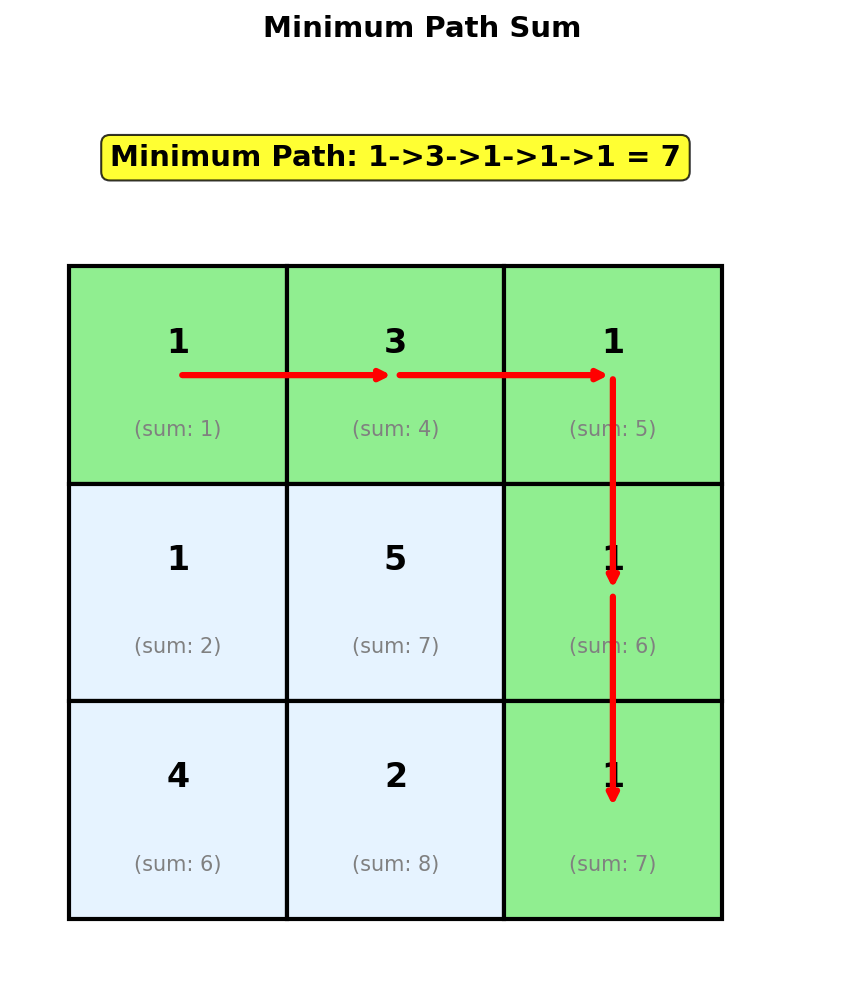
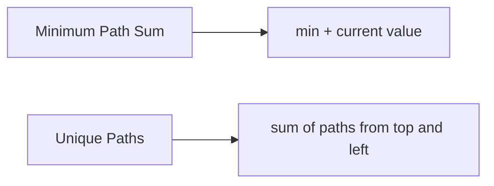
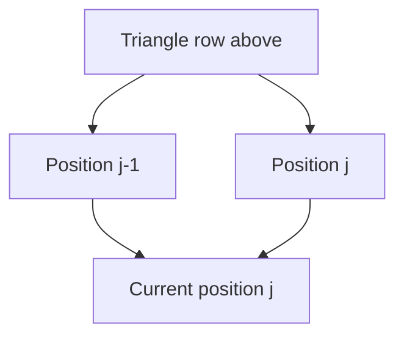
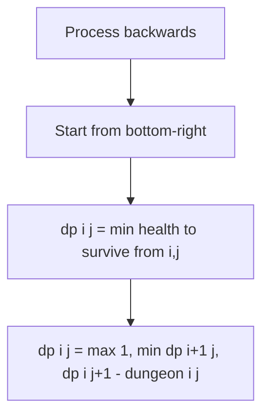
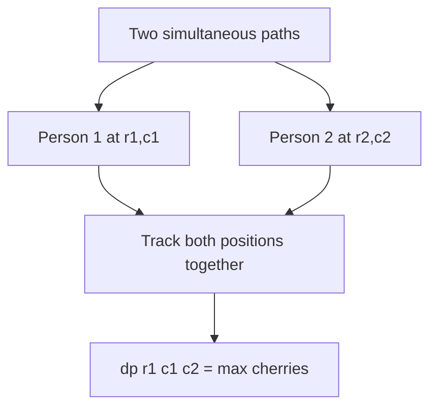

# Minimum Path Sum

## Problem Statement

Given a `m x n` grid filled with non-negative numbers, find a path from the **top-left corner** to the **bottom-right corner** which **minimizes the sum** of all numbers along its path.

**Note**: You can only move either **down** or **right** at any point in time.

## Input/Output Format

**Input:**
- `grid` (List[List[int]]): 2D grid of non-negative integers

**Output:**
- (int): Minimum sum of all numbers along a path from top-left to bottom-right

## Constraints

- `m == grid.length`
- `n == grid[i].length`
- `1 <= m, n <= 200`
- `0 <= grid[i][j] <= 200`

## Examples

### Example 1: Standard Grid

**Input:**
```
grid = [
    [1, 3, 1],
    [1, 5, 1],
    [4, 2, 1]
]
```

**Output:** `7`

**Explanation:**
```
+---+---+---+
| 1 | 3 | 1 |     Path: 1 -> 3 -> 1 -> 1 -> 1
+---+---+---+     Sum:  1 + 3 + 1 + 1 + 1 = 7
| 1 | 5 | 1 |
+---+---+---+     Optimal path shown below:
| 4 | 2 | 1 |
+---+---+---+

+---+---+---+
|[1]|[3]|[1]|     [x] = path taken
+---+---+---+
| 1 | 5 |[1]|
+---+---+---+
| 4 | 2 |[1]|
+---+---+---+
```

### Example 2: Single Row

**Input:**
```
grid = [[1, 2, 3]]
```

**Output:** `6`

**Explanation:**
Only one path exists: right -> right. Sum = 1 + 2 + 3 = 6.

### Example 3: Single Column

**Input:**
```
grid = [
    [1],
    [2],
    [3]
]
```

**Output:** `6`

**Explanation:**
Only one path exists: down -> down. Sum = 1 + 2 + 3 = 6.

### Example 4: Grid with Zeros

**Input:**
```
grid = [
    [1, 0, 1],
    [0, 0, 1],
    [1, 1, 0]
]
```

**Output:** `1`

**Explanation:**
Optimal path: 1 -> 0 -> 0 -> 0 -> 0 = 1

## Visual Explanation



## ASCII Art: DP Table Building

```
grid = [[1,3,1], [1,5,1], [4,2,1]]

DP Table: dp[i][j] = minimum sum to reach cell (i, j)

Original Grid:          DP Table:
+---+---+---+           +---+---+---+
| 1 | 3 | 1 |           | 1 | 4 | 5 |
+---+---+---+           +---+---+---+
| 1 | 5 | 1 |           | 2 | 7 | 6 |
+---+---+---+           +---+---+---+
| 4 | 2 | 1 |           | 6 | 8 | 7 |
+---+---+---+           +---+---+---+

Building DP table:
==================
dp[0][0] = grid[0][0] = 1

First row (can only come from left):
dp[0][1] = dp[0][0] + grid[0][1] = 1 + 3 = 4
dp[0][2] = dp[0][1] + grid[0][2] = 4 + 1 = 5

First column (can only come from above):
dp[1][0] = dp[0][0] + grid[1][0] = 1 + 1 = 2
dp[2][0] = dp[1][0] + grid[2][0] = 2 + 4 = 6

Interior cells (min of above and left, plus current):
dp[1][1] = min(dp[0][1], dp[1][0]) + grid[1][1]
         = min(4, 2) + 5 = 7
dp[1][2] = min(dp[0][2], dp[1][1]) + grid[1][2]
         = min(5, 7) + 1 = 6
dp[2][1] = min(dp[1][1], dp[2][0]) + grid[2][1]
         = min(7, 6) + 2 = 8
dp[2][2] = min(dp[1][2], dp[2][1]) + grid[2][2]
         = min(6, 8) + 1 = 7

Answer: dp[2][2] = 7
```

## Solution Code

### Approach 1: Top-Down (Memoization)

```python
from typing import List
from functools import lru_cache

def minPathSum(grid: List[List[int]]) -> int:
    """
    Find minimum path sum using memoization.

    The minimum sum to reach (i, j) is the minimum of
    coming from above or left, plus the current cell value.

    Args:
        grid: 2D grid of non-negative integers

    Returns:
        Minimum path sum

    Time Complexity: O(m * n)
    Space Complexity: O(m * n)
    """
    m, n = len(grid), len(grid[0])

    @lru_cache(maxsize=None)
    def dp(i: int, j: int) -> int:
        """Return minimum sum to reach cell (i, j)."""
        # Base case: starting cell
        if i == 0 and j == 0:
            return grid[0][0]

        # Out of bounds
        if i < 0 or j < 0:
            return float('inf')

        # Minimum of coming from above or left
        return grid[i][j] + min(dp(i - 1, j), dp(i, j - 1))

    return dp(m - 1, n - 1)
```

::: info Complexity: Time O(m * n) · Space O(m * n)
- **Time:** Each cell is computed once via memoization, giving m * n total subproblems with O(1) work each.
- **Space:** The cache stores m * n entries, plus recursion stack of O(m + n) depth.
:::

### Approach 2: Bottom-Up (Tabulation)

::: code-group
```python [Python]
from typing import List

def minPathSum(grid: List[List[int]]) -> int:
    """
    Find minimum path sum using bottom-up DP.

    Build solution from top-left to bottom-right.

    Args:
        grid: 2D grid of non-negative integers

    Returns:
        Minimum path sum

    Time Complexity: O(m * n)
    Space Complexity: O(m * n)
    """
    m, n = len(grid), len(grid[0])

    # Create DP table
    dp = [[0] * n for _ in range(m)]
    dp[0][0] = grid[0][0]

    # Fill first row
    for j in range(1, n):
        dp[0][j] = dp[0][j - 1] + grid[0][j]

    # Fill first column
    for i in range(1, m):
        dp[i][0] = dp[i - 1][0] + grid[i][0]

    # Fill the rest
    for i in range(1, m):
        for j in range(1, n):
            dp[i][j] = min(dp[i - 1][j], dp[i][j - 1]) + grid[i][j]

    return dp[m - 1][n - 1]
```

```java [Java]
public int minPathSum(int[][] grid) {
    int m = grid.length, n = grid[0].length;

    // Create DP table
    int[][] dp = new int[m][n];
    dp[0][0] = grid[0][0];

    // Fill first row
    for (int j = 1; j < n; j++) {
        dp[0][j] = dp[0][j - 1] + grid[0][j];
    }

    // Fill first column
    for (int i = 1; i < m; i++) {
        dp[i][0] = dp[i - 1][0] + grid[i][0];
    }

    // Fill the rest
    for (int i = 1; i < m; i++) {
        for (int j = 1; j < n; j++) {
            dp[i][j] = Math.min(dp[i - 1][j], dp[i][j - 1]) + grid[i][j];
        }
    }

    return dp[m - 1][n - 1];
}
```
:::

::: info Complexity: Time O(m * n) · Space O(m * n)
- **Time:** Three phases: O(n) for first row, O(m) for first column, O(m*n) for remaining cells.
- **Space:** The 2D dp table stores minimum sums to reach each cell.
:::

### Approach 3: Space-Optimized (1D Array)

```python
from typing import List

def minPathSum(grid: List[List[int]]) -> int:
    """
    Find minimum path sum with O(n) space.

    Only need the current row. The value "above" is the
    old value at that position.

    Args:
        grid: 2D grid of non-negative integers

    Returns:
        Minimum path sum

    Time Complexity: O(m * n)
    Space Complexity: O(n)
    """
    m, n = len(grid), len(grid[0])

    # Initialize with first row
    dp = [0] * n
    dp[0] = grid[0][0]
    for j in range(1, n):
        dp[j] = dp[j - 1] + grid[0][j]

    # Process remaining rows
    for i in range(1, m):
        dp[0] += grid[i][0]  # First column
        for j in range(1, n):
            # dp[j] = old value (from above)
            # dp[j-1] = new value (from left)
            dp[j] = min(dp[j], dp[j - 1]) + grid[i][j]

    return dp[n - 1]
```

::: info Complexity: Time O(m * n) · Space O(n)
- **Time:** Same O(m * n) work processing all cells row by row.
- **Space:** Only a 1D array of size n is maintained. The old dp[j] represents "from above", updated dp[j-1] represents "from left".
:::

### Approach 4: In-Place Modification

```python
from typing import List

def minPathSum(grid: List[List[int]]) -> int:
    """
    Find minimum path sum by modifying grid in-place.

    Warning: This modifies the input grid!

    Args:
        grid: 2D grid of non-negative integers

    Returns:
        Minimum path sum

    Time Complexity: O(m * n)
    Space Complexity: O(1)
    """
    m, n = len(grid), len(grid[0])

    # Fill first row (cumulative sum from left)
    for j in range(1, n):
        grid[0][j] += grid[0][j - 1]

    # Fill first column (cumulative sum from above)
    for i in range(1, m):
        grid[i][0] += grid[i - 1][0]

    # Fill the rest
    for i in range(1, m):
        for j in range(1, n):
            grid[i][j] += min(grid[i - 1][j], grid[i][j - 1])

    return grid[m - 1][n - 1]
```

::: info Complexity: Time O(m * n) · Space O(1)
- **Time:** Same O(m * n) iterations as other approaches, modifying grid values in place.
- **Space:** No additional space beyond the input grid. Warning: This destroys the original grid values.
:::

### Approach 5: Path Reconstruction

```python
from typing import List, Tuple

def minPathSum_with_path(grid: List[List[int]]) -> Tuple[int, List[Tuple[int, int]]]:
    """
    Find minimum path sum and return the actual path.

    Args:
        grid: 2D grid of non-negative integers

    Returns:
        Tuple of (minimum sum, list of coordinates in path)

    Time Complexity: O(m * n)
    Space Complexity: O(m * n)
    """
    m, n = len(grid), len(grid[0])

    # Build DP table
    dp = [[0] * n for _ in range(m)]
    dp[0][0] = grid[0][0]

    for j in range(1, n):
        dp[0][j] = dp[0][j - 1] + grid[0][j]

    for i in range(1, m):
        dp[i][0] = dp[i - 1][0] + grid[i][0]

    for i in range(1, m):
        for j in range(1, n):
            dp[i][j] = min(dp[i - 1][j], dp[i][j - 1]) + grid[i][j]

    # Backtrack to find path
    path = [(m - 1, n - 1)]
    i, j = m - 1, n - 1

    while i > 0 or j > 0:
        if i == 0:
            j -= 1
        elif j == 0:
            i -= 1
        elif dp[i - 1][j] < dp[i][j - 1]:
            i -= 1
        else:
            j -= 1
        path.append((i, j))

    return dp[m - 1][n - 1], path[::-1]
```

::: info Complexity: Time O(m * n) · Space O(m * n)
- **Time:** O(m * n) to build the DP table, plus O(m + n) to backtrack from bottom-right to top-left.
- **Space:** The full 2D table must be kept for backtracking to determine the optimal path taken.
:::

## Complexity Analysis

| Approach | Time Complexity | Space Complexity |
|----------|----------------|------------------|
| Top-Down (Memoization) | O(m * n) | O(m * n) |
| Bottom-Up (Tabulation) | O(m * n) | O(m * n) |
| Space-Optimized | O(m * n) | O(n) |
| In-Place | O(m * n) | O(1) |

## Edge Cases

1. **Single cell:**
   ```python
   minPathSum([[5]])  # Returns 5
   ```

2. **Single row:**
   ```python
   minPathSum([[1, 2, 3]])  # Returns 6
   ```

3. **Single column:**
   ```python
   minPathSum([[1], [2], [3]])  # Returns 6
   ```

4. **All zeros:**
   ```python
   minPathSum([[0, 0], [0, 0]])  # Returns 0
   ```

5. **All same values:**
   ```python
   minPathSum([[1, 1], [1, 1]])  # Returns 3 (any path)
   ```

6. **Large values in path:**
   ```python
   minPathSum([[1, 100], [1, 1]])  # Returns 3 (avoid 100)
   ```

## Key Insights

1. **State Definition**: `dp[i][j]` = minimum sum to reach cell (i, j) from (0, 0).

2. **Recurrence**: `dp[i][j] = grid[i][j] + min(dp[i-1][j], dp[i][j-1])`.

3. **Base Cases**:
   - `dp[0][0] = grid[0][0]`
   - First row: can only come from left
   - First column: can only come from above

4. **Optimal Substructure**: The minimum path to (i, j) must pass through either (i-1, j) or (i, j-1), so we take the minimum of those.

5. **In-Place vs Extra Space**: Can modify input to save space, but this destroys original data.

## Comparison with Unique Paths

| Aspect | Unique Paths | Minimum Path Sum |
|--------|--------------|------------------|
| Grid Values | Not used | Used (costs) |
| Objective | Count paths | Minimize sum |
| Recurrence | Sum | Min + current |
| First row/col | All 1s | Prefix sums |

## Related Problems

::: details Unique Paths (LeetCode 62)
**Problem:** Count the number of unique paths from top-left to bottom-right in a grid.

**Key Insight:** Same grid structure but count paths instead of summing values. Uses addition instead of min operation.



**Approach:** `dp[i][j] = dp[i-1][j] + dp[i][j-1]`. No values to add, just counting paths.

**Complexity:** O(m * n) time, O(n) space
:::

::: details Triangle (LeetCode 120)
**Problem:** Given a triangle array, find minimum path sum from top to bottom. Each step moves to adjacent numbers on the row below.

**Key Insight:** Similar to minimum path sum but triangle shape. Can come from 2 positions above instead of strict left/top.



**Approach:** `dp[j] = min(dp[j-1], dp[j]) + triangle[i][j]`. Process bottom-up for simpler code: `dp[j] = triangle[i][j] + min(dp[j], dp[j+1])`.

**Complexity:** O(n^2) time, O(n) space
:::

::: details Dungeon Game (LeetCode 174)
**Problem:** Find minimum initial health to reach princess at bottom-right, where cells can heal or damage. Health must stay positive throughout.

**Key Insight:** Process from end to start (reverse of minimum path sum). Track minimum health needed to survive from each cell.



**Approach:** Reverse DP: `dp[i][j] = max(1, min(dp[i+1][j], dp[i][j+1]) - dungeon[i][j])`. Health must always be at least 1.

**Complexity:** O(m * n) time, O(n) space
:::

::: details Cherry Pickup (LeetCode 741)
**Problem:** Collect maximum cherries going from (0,0) to (n-1,n-1) and back. Can only pick each cherry once.

**Key Insight:** Model as two people walking simultaneously from start to end. 3D DP: (row1, col1, col2) where row2 = row1+col1-col2.



**Approach:** `dp[r1][c1][c2]` = max cherries with person1 at (r1,c1) and person2 at (r2,c2). Both move down/right simultaneously.

**Complexity:** O(n^3) time, O(n^3) space
:::
