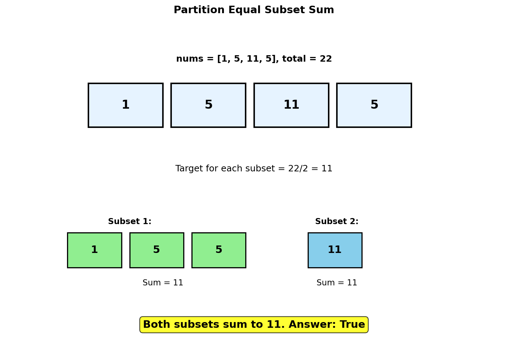
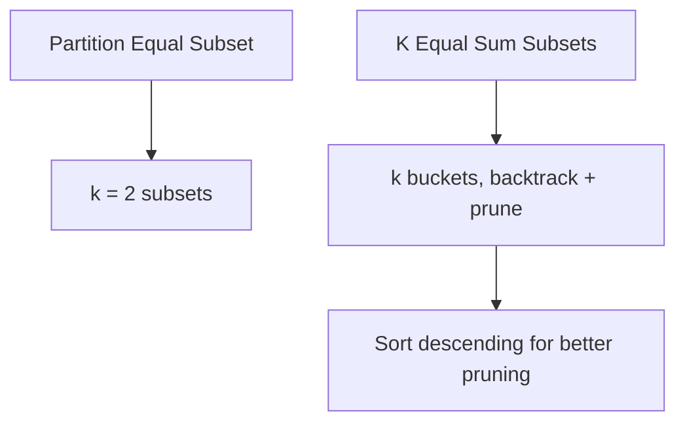
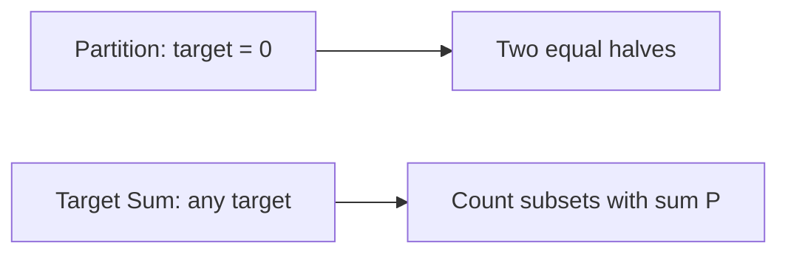
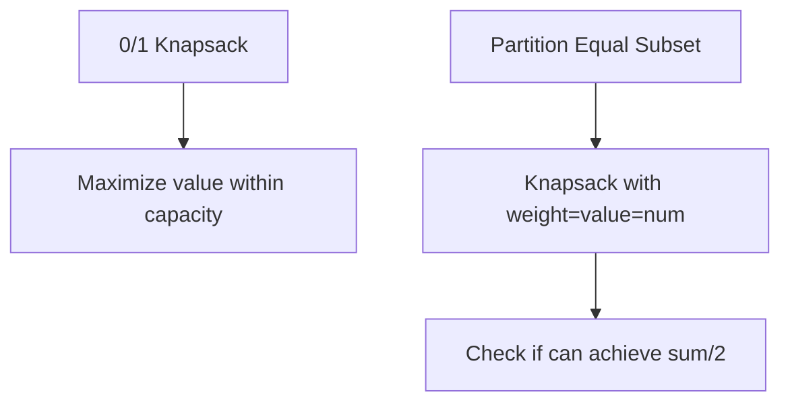
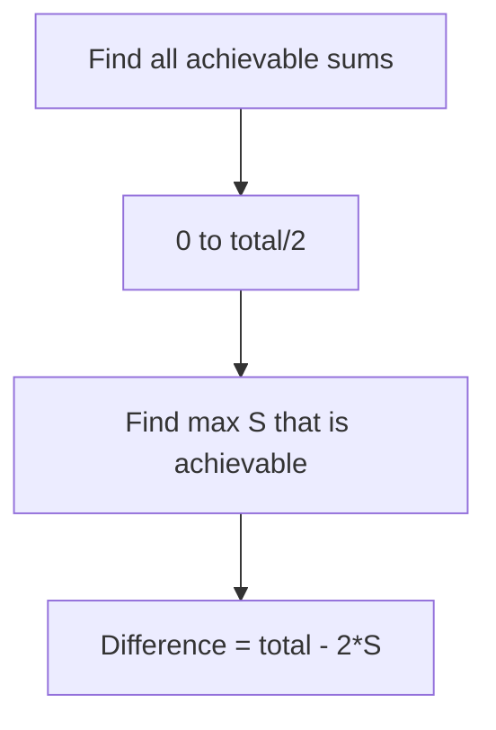

# Partition Equal Subset Sum

## Problem Statement

Given an integer array `nums`, return `true` if you can partition the array into two subsets such that the sum of the elements in both subsets is equal, or `false` otherwise.

This is a classic **subset sum** problem, which is a special case of the **0/1 Knapsack** problem.

## Input/Output Format

**Input:**
- `nums` (List[int]): Array of positive integers

**Output:**
- (bool): True if array can be partitioned into two equal-sum subsets

## Constraints

- `1 <= nums.length <= 200`
- `1 <= nums[i] <= 100`

## Examples

### Example 1: Partitionable Array

**Input:** `nums = [1, 5, 11, 5]`

**Output:** `true`

**Explanation:**
```
Total sum = 1 + 5 + 11 + 5 = 22
Target for each subset = 22 / 2 = 11

Partition:
- Subset 1: [1, 5, 5] -> sum = 11
- Subset 2: [11]      -> sum = 11

Both subsets have equal sum!
```

### Example 2: Not Partitionable

**Input:** `nums = [1, 2, 3, 5]`

**Output:** `false`

**Explanation:**
```
Total sum = 1 + 2 + 3 + 5 = 11
Target would be 11 / 2 = 5.5

Since total is odd, equal partition is impossible.
```

### Example 3: Two Elements

**Input:** `nums = [1, 1]`

**Output:** `true`

**Explanation:**
```
Partition: [1] and [1]
```

### Example 4: Single Element

**Input:** `nums = [5]`

**Output:** `false`

**Explanation:**
Cannot partition single element into two non-empty subsets.

## Visual Explanation



## ASCII Art: DP Table Building

```
nums = [1, 5, 11, 5], target = 11

DP Table: dp[i][j] = true if we can achieve sum j using elements 0..i-1

            Sum j
            0    1    2    3    4    5    6    7    8    9   10   11
          +---+----+----+----+----+----+----+----+----+----+----+----+
Item 0    | T |  F |  F |  F |  F |  F |  F |  F |  F |  F |  F |  F |
(no item) +---+----+----+----+----+----+----+----+----+----+----+----+
Item 1    | T |  T |  F |  F |  F |  F |  F |  F |  F |  F |  F |  F |
(1)       +---+----+----+----+----+----+----+----+----+----+----+----+
Item 2    | T |  T |  F |  F |  F |  T |  T |  F |  F |  F |  F |  F |
(1,5)     +---+----+----+----+----+----+----+----+----+----+----+----+
Item 3    | T |  T |  F |  F |  F |  T |  T |  F |  F |  F |  F |  T |
(1,5,11)  +---+----+----+----+----+----+----+----+----+----+----+----+
Item 4    | T |  T |  F |  F |  F |  T |  T |  F |  F |  F |  T |  T |
(1,5,11,5)+---+----+----+----+----+----+----+----+----+----+----+----+
                                                                  ^
                                                                  |
                                                            Answer: T

dp[4][11] = True means we can form sum 11 using some subset.
```

## Solution Code

### Approach 1: Top-Down (Memoization)

```python
from typing import List
from functools import lru_cache

def canPartition(nums: List[int]) -> bool:
    """
    Check if array can be partitioned using memoization.

    If we can find a subset with sum = total/2, the remaining
    elements will also sum to total/2.

    Args:
        nums: Array of positive integers

    Returns:
        True if partitionable

    Time Complexity: O(n * sum)
    Space Complexity: O(n * sum)
    """
    total = sum(nums)

    # If total is odd, impossible to partition equally
    if total % 2 != 0:
        return False

    target = total // 2
    n = len(nums)

    @lru_cache(maxsize=None)
    def dp(index: int, remaining: int) -> bool:
        """Check if we can achieve 'remaining' sum using nums[index:]."""
        # Base cases
        if remaining == 0:
            return True
        if index >= n or remaining < 0:
            return False

        # Include or exclude current element
        return dp(index + 1, remaining - nums[index]) or dp(index + 1, remaining)

    return dp(0, target)
```

::: info Complexity: Time O(n * sum) · Space O(n * sum)
- **Time:** At most n*sum unique subproblems, each computed in O(1) with memoization
- **Space:** Memoization cache stores up to n*sum states plus O(n) recursion stack
:::

### Approach 2: Bottom-Up (Tabulation)

```python
from typing import List

def canPartition(nums: List[int]) -> bool:
    """
    Check if array can be partitioned using bottom-up DP.

    dp[i][j] = True if we can form sum j using elements 0..i-1.

    Args:
        nums: Array of positive integers

    Returns:
        True if partitionable

    Time Complexity: O(n * sum)
    Space Complexity: O(n * sum)
    """
    total = sum(nums)

    if total % 2 != 0:
        return False

    target = total // 2
    n = len(nums)

    # dp[i][j] = can form sum j using first i elements
    dp = [[False] * (target + 1) for _ in range(n + 1)]

    # Base case: sum 0 is achievable with empty subset
    for i in range(n + 1):
        dp[i][0] = True

    for i in range(1, n + 1):
        for j in range(1, target + 1):
            # Don't include nums[i-1]
            dp[i][j] = dp[i - 1][j]

            # Include nums[i-1] if possible
            if j >= nums[i - 1]:
                dp[i][j] = dp[i][j] or dp[i - 1][j - nums[i - 1]]

    return dp[n][target]
```

::: info Complexity: Time O(n * sum) · Space O(n * sum)
- **Time:** Filling n rows and sum columns with O(1) work per cell
- **Space:** 2D DP table of size (n+1) x (target+1)
:::

### Approach 3: Space-Optimized (1D Array)

::: code-group
```python [Python]
from typing import List

def canPartition(nums: List[int]) -> bool:
    """
    Check if array can be partitioned with O(sum) space.

    Key: Iterate in reverse to avoid using same element twice.

    Args:
        nums: Array of positive integers

    Returns:
        True if partitionable

    Time Complexity: O(n * sum)
    Space Complexity: O(sum)
    """
    total = sum(nums)

    if total % 2 != 0:
        return False

    target = total // 2

    # dp[j] = True if we can form sum j
    dp = [False] * (target + 1)
    dp[0] = True

    for num in nums:
        # Iterate in REVERSE to avoid using same element twice
        for j in range(target, num - 1, -1):
            dp[j] = dp[j] or dp[j - num]

    return dp[target]
```

```java [Java]
public boolean canPartition(int[] nums) {
    int total = 0;
    for (int n : nums) total += n;

    if (total % 2 != 0) return false;

    int target = total / 2;

    // dp[j] = true if we can form sum j
    boolean[] dp = new boolean[target + 1];
    dp[0] = true;

    for (int num : nums) {
        // Iterate in REVERSE to avoid using same element twice
        for (int j = target; j >= num; j--) {
            dp[j] = dp[j] || dp[j - num];
        }
    }

    return dp[target];
}
```
:::

::: info Complexity: Time O(n * sum) · Space O(sum)
- **Time:** For each of n elements, iterate through up to sum/2 values
- **Space:** Single 1D array of size target+1 (sum/2 + 1)
:::

### Approach 4: Using Set (Alternative)

```python
from typing import List

def canPartition(nums: List[int]) -> bool:
    """
    Check if array can be partitioned using a set.

    Track all achievable sums at each step.

    Args:
        nums: Array of positive integers

    Returns:
        True if partitionable

    Time Complexity: O(n * sum)
    Space Complexity: O(sum)
    """
    total = sum(nums)

    if total % 2 != 0:
        return False

    target = total // 2

    # Set of achievable sums
    achievable = {0}

    for num in nums:
        # Add new sums by including current number
        new_sums = set()
        for s in achievable:
            new_sum = s + num
            if new_sum == target:
                return True
            if new_sum < target:
                new_sums.add(new_sum)
        achievable.update(new_sums)

    return target in achievable
```

::: info Complexity: Time O(n * sum) · Space O(sum)
- **Time:** For each element, potentially add new sums up to target
- **Space:** Set stores at most target distinct achievable sums
:::

### Approach 5: Bitset Optimization

```python
from typing import List

def canPartition(nums: List[int]) -> bool:
    """
    Check if array can be partitioned using bitset.

    Use integer as a bitset where bit i is set if sum i is achievable.

    Args:
        nums: Array of positive integers

    Returns:
        True if partitionable

    Time Complexity: O(n * sum / 64) with bitset optimization
    Space Complexity: O(sum / 64)
    """
    total = sum(nums)

    if total % 2 != 0:
        return False

    target = total // 2

    # bits[i] = 1 means sum i is achievable
    bits = 1  # Sum 0 is achievable

    for num in nums:
        bits |= bits << num

    return (bits >> target) & 1 == 1
```

::: info Complexity: Time O(n * sum / 64) · Space O(sum / 64)
- **Time:** Bitwise OR and shift operations process 64 bits at once
- **Space:** Single integer acts as bitset, with implicit O(sum) bits
:::

## Complexity Analysis

| Approach | Time Complexity | Space Complexity |
|----------|----------------|------------------|
| Top-Down | O(n * sum) | O(n * sum) |
| Bottom-Up | O(n * sum) | O(n * sum) |
| 1D Array | O(n * sum) | O(sum) |
| Set | O(n * sum) | O(sum) |
| Bitset | O(n * sum / 64) | O(sum / 64) |

## Edge Cases

1. **Odd total sum:**
   ```python
   canPartition([1, 2, 4])  # Returns False (sum=7, odd)
   ```

2. **Single element:**
   ```python
   canPartition([2])  # Returns False
   ```

3. **Two equal elements:**
   ```python
   canPartition([5, 5])  # Returns True
   ```

4. **Already sorted:**
   ```python
   canPartition([1, 2, 3, 4, 5, 5])  # Returns True ([5,5] and [1,2,3,4])
   ```

5. **Large single element:**
   ```python
   canPartition([1, 1, 100])  # Returns False (102/2=51, can't reach)
   ```

6. **All same elements:**
   ```python
   canPartition([3, 3, 3, 3])  # Returns True ([3,3] and [3,3])
   ```

## Why Reverse Iteration in 1D?

```
Consider nums = [2, 2] with target = 2

Forward iteration (WRONG for 0/1 knapsack):
Initial: dp = [T, F, F]

num = 2:
  j=2: dp[2] = dp[2] or dp[0] = F or T = T -> dp = [T, F, T]

num = 2:
  j=2: dp[2] = dp[2] or dp[0] = T or T = T

Both items processed correctly? Let's check:
We need to ensure each item is used at most once.

Actually, forward iteration works here BUT consider:
nums = [2] with target = 4

Forward iteration:
  j=2: dp[2] = dp[0] = T
  j=4: dp[4] = dp[2] = T  <- WRONG! Used 2 twice!

Reverse iteration:
  j=4: dp[4] = dp[2] = F (dp[2] not yet updated)
  j=2: dp[2] = dp[0] = T

Reverse order ensures we use old values, not newly updated ones.
```

## Key Insights

1. **Reduction to Subset Sum**: If total sum is S, we need to find a subset with sum S/2. The remaining elements will automatically sum to S/2.

2. **Odd Sum = Impossible**: If total is odd, equal partition is impossible.

3. **0/1 Knapsack Variant**: This is exactly the subset sum problem, which is a special case of 0/1 knapsack where all values equal weights.

4. **State Definition**: `dp[j]` = True if we can form sum j using available elements.

5. **Recurrence**: `dp[j] = dp[j] or dp[j - nums[i]]` for each element.

6. **Early Termination**: Can return True as soon as target sum is achieved.

## Related Problems

::: details Partition to K Equal Sum Subsets (LeetCode 698)
**Problem:** Determine if array can be partitioned into k subsets with equal sum.

**Key Insight:** Generalization of equal partition. Use backtracking with pruning or bitmask DP. Each element must be assigned to exactly one of k buckets.



**Approach:** Sort descending, backtrack assigning each element to a bucket. Prune when bucket exceeds target. Bitmask DP: `dp[mask]` = true if elements in mask can be partitioned.

**Complexity:** O(k * 2^n) for bitmask DP, exponential for backtracking with good pruning
:::

::: details Target Sum (LeetCode 494)
**Problem:** Count ways to assign +/- to each element to achieve target sum.

**Key Insight:** Transform: P - N = target, P + N = sum, so P = (target + sum) / 2. Count subsets with sum P.



**Approach:** `dp[s] += dp[s-num]` counts subsets. Unlike partition (boolean), we count ways. Transform target sum problem to subset count problem.

**Complexity:** O(n * sum) time, O(sum) space
:::

::: details 0/1 Knapsack (Classic)
**Problem:** Given items with weights and values, maximize value within capacity constraint.

**Key Insight:** Partition is a special case where weight = value = element, and we check if target sum is achievable.



**Approach:** `dp[w] = max(dp[w], dp[w-weight[i]] + value[i])`. Partition subset sum is boolean variant: `dp[s] = dp[s] or dp[s-num]`.

**Complexity:** O(n * W) time, O(W) space
:::

::: details Minimum Subset Sum Difference (LeetCode 2035 variant)
**Problem:** Partition array into two subsets minimizing absolute difference of their sums.

**Key Insight:** Find largest achievable sum S <= total/2. Min difference = total - 2*S.



**Approach:** Run subset sum DP to find all achievable sums. Find largest sum not exceeding total/2. The complementary subset has sum total-S, so difference = |S - (total-S)| = |2S - total|.

**Complexity:** O(n * sum) time, O(sum) space
:::
