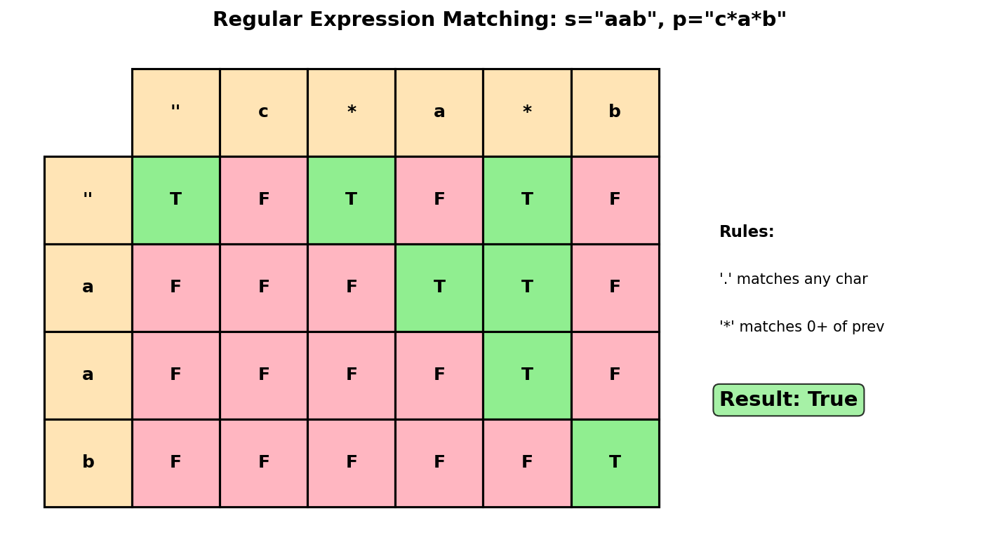
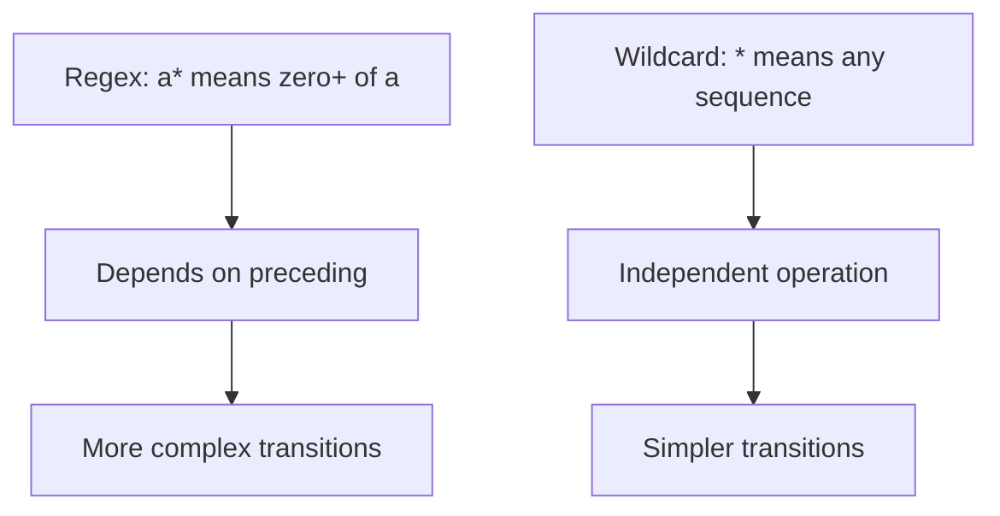
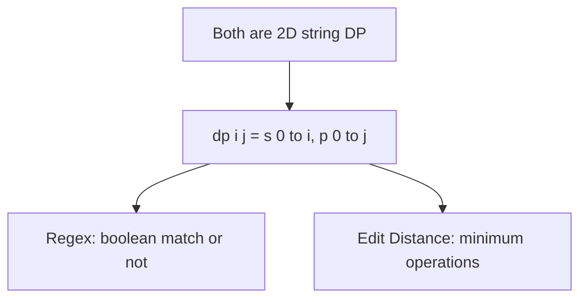
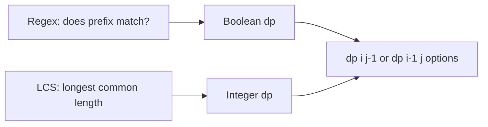
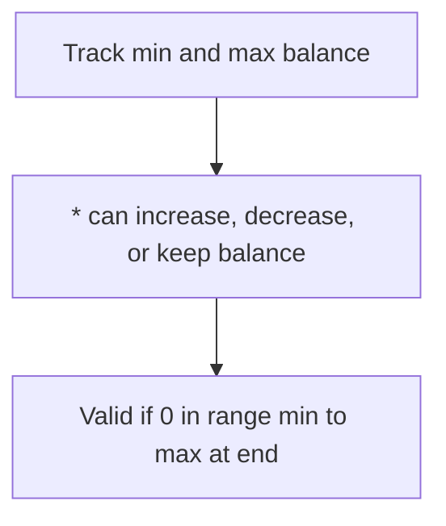

# Regular Expression Matching

## Problem Statement

Given an input string `s` and a pattern `p`, implement regular expression matching with support for `'.'` and `'*'` where:

- `'.'` Matches any single character.
- `'*'` Matches zero or more of the **preceding element**.

The matching should cover the **entire** input string (not partial).

## Input/Output Format

**Input:**
- `s` (str): Input string
- `p` (str): Pattern with `.` and `*` wildcards

**Output:**
- (bool): True if the entire string matches the pattern

## Constraints

- `1 <= s.length <= 20`
- `1 <= p.length <= 20`
- `s` contains only lowercase English letters
- `p` contains only lowercase English letters, `.`, and `*`
- It is guaranteed for each appearance of `*`, there will be a previous valid character to match

## Examples

### Example 1: No Match

**Input:** `s = "aa"`, `p = "a"`

**Output:** `false`

**Explanation:**
Pattern `"a"` matches only a single `'a'`, but the string has two.

### Example 2: Star Matches Multiple

**Input:** `s = "aa"`, `p = "a*"`

**Output:** `true`

**Explanation:**
`'a*'` means zero or more of `'a'`. With two `'a'`s, it matches.

### Example 3: Dot Star

**Input:** `s = "ab"`, `p = ".*"`

**Output:** `true`

**Explanation:**
`".*"` means zero or more of any character. It matches any string.

### Example 4: Complex Pattern

**Input:** `s = "aab"`, `p = "c*a*b"`

**Output:** `true`

**Explanation:**
```
c* -> matches zero 'c' (empty)
a* -> matches "aa"
b  -> matches "b"

So "c*a*b" matches "aab"
```

### Example 5: Mismatch

**Input:** `s = "mississippi"`, `p = "mis*is*p*."`

**Output:** `false`

**Explanation:**
The `p*` part can't match "ssissi" correctly. One `'p'` isn't enough.

## Visual Explanation



## ASCII Art: Pattern Matching States

```
s = "aab", p = "c*a*b"

State transitions:
==================

c* can match:
  - "" (zero c's) -> move past c* in pattern
  - "c" (one c) -> stay at c* in pattern
  - "cc" (two c's) -> stay at c* in pattern

a* can match:
  - "" (zero a's)
  - "a" (one a)
  - "aa" (two a's)
  - ...

DP Table: dp[i][j] = does s[0:i] match p[0:j]?

          ""   c    *    a    *    b
          p[0] p[1] p[2] p[3] p[4] p[5]
        +----+----+----+----+----+----+
 ""     | T  | F  | T  | F  | T  | F  |
 s[0]   +----+----+----+----+----+----+
 a      | F  | F  | F  | T  | T  | F  |
 s[1]   +----+----+----+----+----+----+
 a      | F  | F  | F  | F  | T  | F  |
 s[2]   +----+----+----+----+----+----+
 b      | F  | F  | F  | F  | F  | T  |
 s[3]   +----+----+----+----+----+----+

dp[3][5] = True -> Match!
```

## Solution Code

### Approach 1: Top-Down (Memoization)

```python
from functools import lru_cache

def isMatch(s: str, p: str) -> bool:
    """
    Check regex match using memoization.

    Handle three cases:
    1. Regular character match
    2. '.' matches any character
    3. '*' matches zero or more of preceding

    Args:
        s: Input string
        p: Pattern

    Returns:
        True if entire string matches pattern

    Time Complexity: O(m * n)
    Space Complexity: O(m * n)
    """
    @lru_cache(maxsize=None)
    def dp(i: int, j: int) -> bool:
        """Check if s[i:] matches p[j:]."""
        # Base case: pattern exhausted
        if j == len(p):
            return i == len(s)

        # Check if first characters match
        first_match = i < len(s) and (p[j] == s[i] or p[j] == '.')

        # Handle '*' (look ahead)
        if j + 1 < len(p) and p[j + 1] == '*':
            # Two options:
            # 1. '*' matches zero of preceding -> skip "x*"
            # 2. '*' matches one+ of preceding -> consume one char, stay at "*"
            return (dp(i, j + 2) or  # Zero match
                   (first_match and dp(i + 1, j)))  # One+ match

        # Regular match (including '.')
        return first_match and dp(i + 1, j + 1)

    return dp(0, 0)
```

::: info Complexity: Time O(m * n) · Space O(m * n)
- **Time:** Each unique (i, j) state is computed at most once due to memoization, where i ranges over string length m and j over pattern length n.
- **Space:** The cache stores O(m * n) entries, plus recursion stack depth of O(m + n) in the worst case.
:::

### Approach 2: Bottom-Up (Tabulation)

```python
def isMatch(s: str, p: str) -> bool:
    """
    Check regex match using bottom-up DP.

    Build solution from end of strings to beginning.

    Args:
        s: Input string
        p: Pattern

    Returns:
        True if entire string matches pattern

    Time Complexity: O(m * n)
    Space Complexity: O(m * n)
    """
    m, n = len(s), len(p)

    # dp[i][j] = True if s[i:] matches p[j:]
    dp = [[False] * (n + 1) for _ in range(m + 1)]
    dp[m][n] = True  # Empty string matches empty pattern

    # Fill from bottom-right to top-left
    for i in range(m, -1, -1):
        for j in range(n - 1, -1, -1):
            first_match = i < m and (p[j] == s[i] or p[j] == '.')

            if j + 1 < n and p[j + 1] == '*':
                # Option 1: Zero occurrences of p[j]
                # Option 2: One+ occurrences (if first char matches)
                dp[i][j] = dp[i][j + 2] or (first_match and dp[i + 1][j])
            else:
                dp[i][j] = first_match and dp[i + 1][j + 1]

    return dp[0][0]
```

::: info Complexity: Time O(m * n) · Space O(m * n)
- **Time:** Two nested loops iterate through all (m+1) * (n+1) states, with constant-time operations per state.
- **Space:** The 2D dp table has dimensions (m+1) x (n+1) to store boolean match results.
:::

### Approach 3: Forward DP (Alternative)

```python
def isMatch(s: str, p: str) -> bool:
    """
    Check regex match using forward DP.

    dp[i][j] = True if s[0:i] matches p[0:j]

    Args:
        s: Input string
        p: Pattern

    Returns:
        True if entire string matches pattern

    Time Complexity: O(m * n)
    Space Complexity: O(m * n)
    """
    m, n = len(s), len(p)

    # dp[i][j] = True if s[0:i] matches p[0:j]
    dp = [[False] * (n + 1) for _ in range(m + 1)]
    dp[0][0] = True

    # Handle patterns like a*, a*b*, a*b*c* that match empty string
    for j in range(2, n + 1):
        if p[j - 1] == '*':
            dp[0][j] = dp[0][j - 2]

    for i in range(1, m + 1):
        for j in range(1, n + 1):
            if p[j - 1] == '*':
                # Zero occurrences: dp[i][j-2]
                # One+ occurrences: dp[i-1][j] if chars match
                zero_match = dp[i][j - 2]
                one_plus = (dp[i - 1][j] and
                           (p[j - 2] == s[i - 1] or p[j - 2] == '.'))
                dp[i][j] = zero_match or one_plus
            elif p[j - 1] == '.' or p[j - 1] == s[i - 1]:
                dp[i][j] = dp[i - 1][j - 1]

    return dp[m][n]
```

::: info Complexity: Time O(m * n) · Space O(m * n)
- **Time:** Same as Approach 2, processing all states from top-left to bottom-right with constant-time transitions.
- **Space:** Full 2D table of size (m+1) x (n+1) to store reachability from string start.
:::

### Approach 4: Space-Optimized

```python
def isMatch(s: str, p: str) -> bool:
    """
    Check regex match with O(n) space.

    Only need current and previous row.

    Args:
        s: Input string
        p: Pattern

    Returns:
        True if entire string matches pattern

    Time Complexity: O(m * n)
    Space Complexity: O(n)
    """
    m, n = len(s), len(p)

    # Previous row
    prev = [False] * (n + 1)
    prev[0] = True

    # Initialize: patterns matching empty string
    for j in range(2, n + 1):
        if p[j - 1] == '*':
            prev[j] = prev[j - 2]

    for i in range(1, m + 1):
        curr = [False] * (n + 1)

        for j in range(1, n + 1):
            if p[j - 1] == '*':
                zero_match = curr[j - 2] if j >= 2 else False
                one_plus = (prev[j] and
                           (p[j - 2] == s[i - 1] or p[j - 2] == '.'))
                curr[j] = zero_match or one_plus
            elif p[j - 1] == '.' or p[j - 1] == s[i - 1]:
                curr[j] = prev[j - 1]

        prev = curr

    return prev[n]
```

::: info Complexity: Time O(m * n) · Space O(n)
- **Time:** Still processes all m * n states, but only keeps two rows in memory at a time.
- **Space:** Only two arrays of size n+1 (prev and curr) are maintained, reducing space from O(m*n) to O(n).
:::

## Complexity Analysis

| Approach | Time Complexity | Space Complexity |
|----------|----------------|------------------|
| Top-Down | O(m * n) | O(m * n) |
| Bottom-Up | O(m * n) | O(m * n) |
| Space-Optimized | O(m * n) | O(n) |

Where m = len(s), n = len(p).

## Edge Cases

1. **Empty string:**
   ```python
   isMatch("", "")      # True
   isMatch("", "a")     # False
   isMatch("", "a*")    # True (zero a's)
   isMatch("", ".*")    # True (zero any chars)
   isMatch("", "a*b*")  # True
   ```

2. **Star matching zero:**
   ```python
   isMatch("abc", "a*abc")    # True (a* matches zero)
   isMatch("b", "a*b")        # True
   ```

3. **Dot matching any:**
   ```python
   isMatch("ab", "..")    # True
   isMatch("ab", ".*")    # True
   isMatch("a", ".")      # True
   ```

4. **Complex patterns:**
   ```python
   isMatch("aaa", "a*a")      # True (a* matches "aa", then "a")
   isMatch("ab", ".*c")       # False
   ```

## Understanding the '*' Operator

```
The key insight: x* can match:
1. Zero 'x' characters (skip x* entirely)
2. One or more 'x' characters

For "aaa" matching "a*":
- dp(0, 0): trying to match "aaa" with "a*"
  - Zero match: dp(0, 2) = match "" with "" -> True? No wait...

Let me be more careful with indexing:
s = "aaa", p = "a*"

Using dp[i][j] = s[0:i] matches p[0:j]:
dp[0][0] = True (empty matches empty)
dp[0][2] = dp[0][0] = True (a* matches empty)
dp[1][2] = dp[0][2] or (match 'a' and dp[0][2]) = True or True = True
dp[2][2] = dp[1][2] or (match 'a' and dp[1][2]) = True
dp[3][2] = True

So "aaa" matches "a*"
```

## Key Insights

1. **'*' Operates on Preceding**: `a*` is a unit, not `*` alone.

2. **Two Choices for '*'**:
   - Skip the `x*` entirely (zero matches)
   - Match one character and stay at `x*` (one+ matches)

3. **'.' is Simple**: Just matches any single character.

4. **State Definition**: `dp[i][j]` = whether `s[0:i]` matches `p[0:j]`.

5. **Empty Pattern Edge**: Patterns like `a*b*c*` can match empty string.

## Related Problems

::: details Wildcard Matching (LeetCode 44)
**Problem:** Match string with pattern containing `?` (any single char) and `*` (any sequence).

**Key Insight:** Simpler than regex because `*` is independent - doesn't modify preceding character.



**Approach:** For `*`: `dp[i][j] = dp[i][j-1] or dp[i-1][j]` (match empty OR match one char). No need to look at preceding character.

**Complexity:** O(m * n) time, O(n) space optimized
:::

::: details Edit Distance (LeetCode 72)
**Problem:** Minimum insert/delete/replace operations to transform one string to another.

**Key Insight:** Same 2D DP structure comparing prefixes of two strings.



**Approach:** `dp[i][j] = dp[i-1][j-1]` if match, else `1 + min(insert, delete, replace)`. Similar structure but different recurrence.

**Complexity:** O(m * n) time, O(min(m,n)) space
:::

::: details Longest Common Subsequence (LeetCode 1143)
**Problem:** Find length of longest subsequence present in both strings.

**Key Insight:** Another 2D string DP. Different goal (maximize length) but similar table structure.



**Approach:** `dp[i][j] = dp[i-1][j-1] + 1` if match, else `max(dp[i-1][j], dp[i][j-1])`.

**Complexity:** O(m * n) time, O(min(m,n)) space
:::

::: details Valid Parenthesis String (LeetCode 678)
**Problem:** Check if string with `(`, `)`, and `*` (can be `(`, `)`, or empty) is valid.

**Key Insight:** Pattern matching with wildcard, but tracking balance instead of string match.



**Approach:** Track range [lo, hi] of possible open paren counts. `(` increases both, `)` decreases both, `*` expands range. Valid if 0 in final range.

**Complexity:** O(n) time, O(1) space
:::
