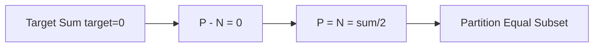
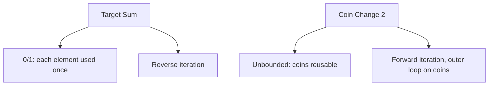
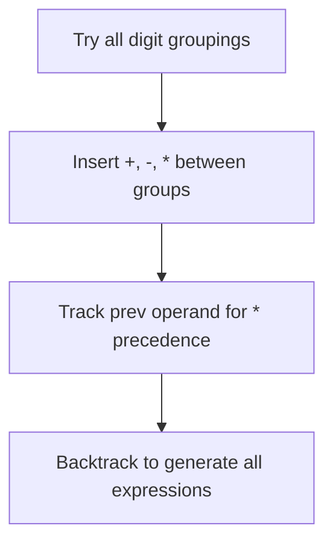
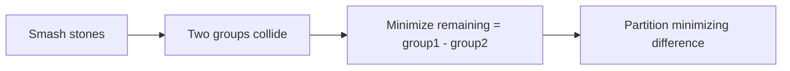

# Target Sum

## Problem Statement

You are given an integer array `nums` and an integer `target`.

You want to build an **expression** out of nums by adding one of the symbols `'+'` and `'-'` before each integer in nums and then concatenate all the integers.

- For example, if `nums = [2, 1]`, you can add a `'+'` before `2` and a `'-'` before `1` and concatenate them to build the expression `"+2-1"`.

Return the number of different expressions that you can build, which evaluates to `target`.

## Input/Output Format

**Input:**
- `nums` (List[int]): Array of non-negative integers
- `target` (int): Target sum to achieve

**Output:**
- (int): Number of ways to achieve the target

## Constraints

- `1 <= nums.length <= 20`
- `0 <= nums[i] <= 1000`
- `0 <= sum(nums[i]) <= 1000`
- `-1000 <= target <= 1000`

## Examples

### Example 1: Multiple Ways

**Input:** `nums = [1, 1, 1, 1, 1]`, `target = 3`

**Output:** `5`

**Explanation:**
```
There are 5 ways to assign symbols to make sum = 3:
1. -1 + 1 + 1 + 1 + 1 = 3
2. +1 - 1 + 1 + 1 + 1 = 3
3. +1 + 1 - 1 + 1 + 1 = 3
4. +1 + 1 + 1 - 1 + 1 = 3
5. +1 + 1 + 1 + 1 - 1 = 3

Pattern: Choose exactly one number to be negative.
C(5,1) = 5 ways
```

### Example 2: Single Way

**Input:** `nums = [1]`, `target = 1`

**Output:** `1`

**Explanation:**
Only `+1 = 1` works.

### Example 3: No Way

**Input:** `nums = [1, 2, 3]`, `target = 7`

**Output:** `0`

**Explanation:**
Maximum possible sum = 1 + 2 + 3 = 6 < 7, so impossible.

### Example 4: With Zeros

**Input:** `nums = [0, 0, 1]`, `target = 1`

**Output:** `4`

**Explanation:**
```
+0 + 0 + 1 = 1
+0 - 0 + 1 = 1
-0 + 0 + 1 = 1
-0 - 0 + 1 = 1

Note: +0 and -0 are considered different expressions!
```

## Visual Explanation


## ASCII Art: Decision Tree

```
nums = [1, 1, 1], target = 1

                    Start (sum=0)
                    /           \
                 +1             -1
                /  \           /  \
              +1   -1        +1   -1
             / \   / \      / \   / \
           +1 -1 +1 -1    +1 -1 +1 -1

Final sums at leaves:
+1+1+1 = 3
+1+1-1 = 1  <-- target!
+1-1+1 = 1  <-- target!
+1-1-1 = -1
-1+1+1 = 1  <-- target!
-1+1-1 = -1
-1-1+1 = -1
-1-1-1 = -3

Count of sum=1: 3 ways
```

## Mathematical Transformation

```
Key insight: Transform to subset sum problem!

Let P = sum of numbers with '+' sign
Let N = sum of numbers with '-' sign

We have:
P + N = total_sum
P - N = target

Adding these equations:
2P = total_sum + target
P = (total_sum + target) / 2

So the problem becomes:
"Count subsets with sum = (total_sum + target) / 2"

This is a subset count problem!
```

## Solution Code

### Approach 1: Top-Down (Memoization)

```python
from typing import List
from functools import lru_cache

def findTargetSumWays(nums: List[int], target: int) -> int:
    """
    Count ways to reach target using memoization.

    At each position, try adding + or - sign.

    Args:
        nums: Array of non-negative integers
        target: Target sum

    Returns:
        Number of ways to reach target

    Time Complexity: O(n * sum)
    Space Complexity: O(n * sum)
    """
    n = len(nums)

    @lru_cache(maxsize=None)
    def dp(index: int, current_sum: int) -> int:
        """Count ways to reach target from index with current_sum."""
        if index == n:
            return 1 if current_sum == target else 0

        # Try + and - for current number
        add = dp(index + 1, current_sum + nums[index])
        subtract = dp(index + 1, current_sum - nums[index])

        return add + subtract

    return dp(0, 0)
```

::: info Complexity: Time O(n * sum) · Space O(n * sum)
- **Time:** Each unique (index, current_sum) pair is computed once. With n elements and sums ranging from -total to +total, we have O(n * 2*total) = O(n * sum) states.
- **Space:** The memoization cache stores all computed states plus the recursion stack depth of n.
:::

### Approach 2: Bottom-Up (2D DP)

```python
from typing import List

def findTargetSumWays(nums: List[int], target: int) -> int:
    """
    Count ways using bottom-up DP with offset for negative sums.

    Args:
        nums: Array of non-negative integers
        target: Target sum

    Returns:
        Number of ways to reach target

    Time Complexity: O(n * sum)
    Space Complexity: O(n * sum)
    """
    total = sum(nums)

    # Target out of range
    if abs(target) > total:
        return 0

    n = len(nums)
    # Offset to handle negative indices
    # Sum ranges from -total to +total
    offset = total

    # dp[i][j] = ways to reach sum (j - offset) using first i numbers
    dp = [[0] * (2 * total + 1) for _ in range(n + 1)]
    dp[0][offset] = 1  # Sum 0 with 0 numbers

    for i in range(n):
        for j in range(2 * total + 1):
            if dp[i][j] > 0:
                # Add nums[i]
                dp[i + 1][j + nums[i]] += dp[i][j]
                # Subtract nums[i]
                dp[i + 1][j - nums[i]] += dp[i][j]

    return dp[n][target + offset]
```

::: info Complexity: Time O(n * sum) · Space O(n * sum)
- **Time:** We iterate through each of the n elements and for each, visit all 2*total+1 possible sums.
- **Space:** The 2D dp table has dimensions (n+1) x (2*total+1) to store counts for all (element index, sum) combinations.
:::

### Approach 3: Space-Optimized (1D)

```python
from typing import List
from collections import defaultdict

def findTargetSumWays(nums: List[int], target: int) -> int:
    """
    Count ways with O(sum) space using a dictionary.

    Args:
        nums: Array of non-negative integers
        target: Target sum

    Returns:
        Number of ways to reach target

    Time Complexity: O(n * sum)
    Space Complexity: O(sum)
    """
    # Count of ways to reach each sum
    dp = defaultdict(int)
    dp[0] = 1

    for num in nums:
        next_dp = defaultdict(int)
        for current_sum, count in dp.items():
            next_dp[current_sum + num] += count
            next_dp[current_sum - num] += count
        dp = next_dp

    return dp[target]
```

::: info Complexity: Time O(n * sum) · Space O(sum)
- **Time:** Each element is processed once, and for each element we update all reachable sums in constant time per sum.
- **Space:** Using a dictionary that stores only reachable sums instead of a full 2D array, reducing space to O(distinct sums).
:::

### Approach 4: Subset Sum Transformation (Optimal)

```python
from typing import List

def findTargetSumWays(nums: List[int], target: int) -> int:
    """
    Transform to subset sum problem for better efficiency.

    P - N = target
    P + N = total
    2P = target + total
    P = (target + total) / 2

    Count subsets with sum P.

    Args:
        nums: Array of non-negative integers
        target: Target sum

    Returns:
        Number of ways to reach target

    Time Complexity: O(n * sum)
    Space Complexity: O(sum)
    """
    total = sum(nums)

    # Check if solution is possible
    if abs(target) > total:
        return 0
    if (target + total) % 2 != 0:
        return 0

    subset_sum = (target + total) // 2

    # Count subsets with sum = subset_sum
    dp = [0] * (subset_sum + 1)
    dp[0] = 1

    for num in nums:
        # Iterate in reverse for 0/1 counting
        for j in range(subset_sum, num - 1, -1):
            dp[j] += dp[j - num]

    return dp[subset_sum]
```

::: info Complexity: Time O(n * sum) · Space O(sum)
- **Time:** Outer loop runs n times, inner loop runs up to subset_sum iterations. The mathematical transformation reduces the problem space.
- **Space:** Only a 1D dp array of size subset_sum+1 is needed since we iterate backwards to avoid double-counting.
:::

### Approach 5: With Expression Generation

```python
from typing import List, Tuple

def findTargetSumWays_with_expressions(
    nums: List[int],
    target: int
) -> Tuple[int, List[str]]:
    """
    Find count and generate all valid expressions.

    Args:
        nums: Array of non-negative integers
        target: Target sum

    Returns:
        Tuple of (count, list of expressions)

    Time Complexity: O(2^n)
    Space Complexity: O(n * 2^n)
    """
    expressions = []

    def backtrack(index: int, current_sum: int, path: List[str]):
        if index == len(nums):
            if current_sum == target:
                expressions.append(''.join(path))
            return

        # Try +
        path.append(f"+{nums[index]}")
        backtrack(index + 1, current_sum + nums[index], path)
        path.pop()

        # Try -
        path.append(f"-{nums[index]}")
        backtrack(index + 1, current_sum - nums[index], path)
        path.pop()

    backtrack(0, 0, [])
    return len(expressions), expressions
```

::: info Complexity: Time O(2^n) · Space O(n * 2^n)
- **Time:** Every element has 2 choices (+/-), creating a complete binary tree with 2^n leaves that must all be explored.
- **Space:** The recursion stack is O(n), but we store all valid expressions which can be up to 2^n paths of length n each.
:::

## Complexity Analysis

| Approach | Time Complexity | Space Complexity |
|----------|----------------|------------------|
| Top-Down | O(n * sum) | O(n * sum) |
| Bottom-Up 2D | O(n * sum) | O(n * sum) |
| Space-Optimized | O(n * sum) | O(sum) |
| Subset Sum Transform | O(n * sum) | O(sum) |

Where sum = sum of all elements in nums.

## Edge Cases

1. **Target out of range:**
   ```python
   findTargetSumWays([1, 2], 10)  # Returns 0
   findTargetSumWays([1, 2], -10)  # Returns 0
   ```

2. **Single element:**
   ```python
   findTargetSumWays([5], 5)   # Returns 1 (+5)
   findTargetSumWays([5], -5)  # Returns 1 (-5)
   findTargetSumWays([5], 0)   # Returns 0
   ```

3. **All zeros:**
   ```python
   findTargetSumWays([0, 0, 0], 0)  # Returns 8 (2^3)
   ```

4. **Target is zero:**
   ```python
   findTargetSumWays([1, 1], 0)  # Returns 2 (+1-1 or -1+1)
   ```

5. **Impossible parity:**
   ```python
   # target + total must be even for subset sum approach
   findTargetSumWays([1], 2)  # Returns 0 (1+2=3, odd)
   ```

## Why Subset Sum Works

```
Original problem:
Assign + or - to each number to get target.

Let P = sum of positive numbers
Let N = sum of negative numbers

Equations:
P + N = total_sum  (all numbers used)
P - N = target     (desired result)

Solving:
2P = total_sum + target
P = (total_sum + target) / 2

So we need to find subsets with sum P.
The remaining numbers (with - sign) will automatically
sum to N = total_sum - P.

And P - N = P - (total_sum - P) = 2P - total_sum = target

This transforms O(n * 2^n) brute force into O(n * sum) DP!
```

## Key Insights

1. **Binary Choice**: Each number gets either '+' or '-', creating 2^n possibilities in brute force.

2. **Subset Sum Reduction**: The mathematical transformation reduces this to a subset sum counting problem.

3. **Parity Check**: If `(target + total)` is odd, no solution exists.

4. **Range Check**: If `|target| > total`, no solution exists.

5. **Zeros**: Each zero doubles the count of solutions since +0 = -0 = 0.

## Related Problems

::: details Partition Equal Subset Sum (LeetCode 416)
**Problem:** Check if array can be partitioned into two equal-sum subsets.

**Key Insight:** Special case of Target Sum where target = 0. When P - N = 0, we need P = N = sum/2.



**Approach:** Same subset sum DP but boolean instead of counting: `dp[s] = dp[s] or dp[s-num]`. Just check reachability.

**Complexity:** O(n * sum) time, O(sum) space
:::

::: details Coin Change 2 (LeetCode 518)
**Problem:** Count number of combinations to make up amount using coins (can reuse coins).

**Key Insight:** Unlike Target Sum (0/1), coins can be reused. Iterate coins in outer loop to count combinations, not permutations.



**Approach:** `dp[a] += dp[a-coin]` with outer loop on coins. Forward iteration allows reuse. Outer coin loop ensures combinations, not permutations.

**Complexity:** O(n * amount) time, O(amount) space
:::

::: details Expression Add Operators (LeetCode 282)
**Problem:** Add +, -, * between digits to achieve target. Return all valid expressions.

**Key Insight:** More complex than Target Sum - must handle multiplication precedence and multi-digit numbers.



**Approach:** Backtrack with params (index, current_value, prev_operand). For *, adjust: `new_val = val - prev + prev * cur`. Generate multi-digit numbers avoiding leading zeros.

**Complexity:** O(4^n * n) time, O(n) space for recursion
:::

::: details Last Stone Weight II (LeetCode 1049)
**Problem:** Smash stones, remaining weight = |x - y|. Find minimum possible weight of last stone.

**Key Insight:** Equivalent to partitioning stones into two groups and minimizing their difference. Same as minimum subset sum difference.



**Approach:** Find subset sum closest to total/2. Min remaining = total - 2 * max_achievable_sum. Same as Target Sum with target = 0.

**Complexity:** O(n * sum) time, O(sum) space
:::
