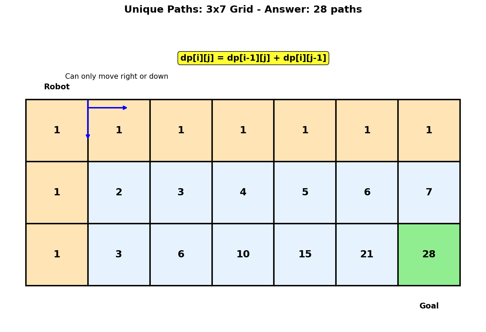
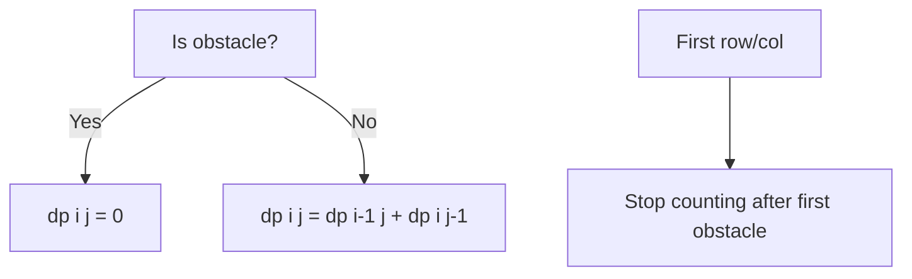
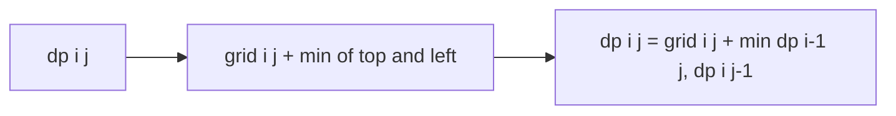
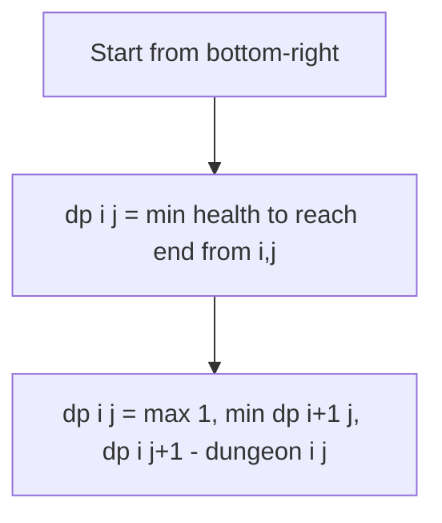
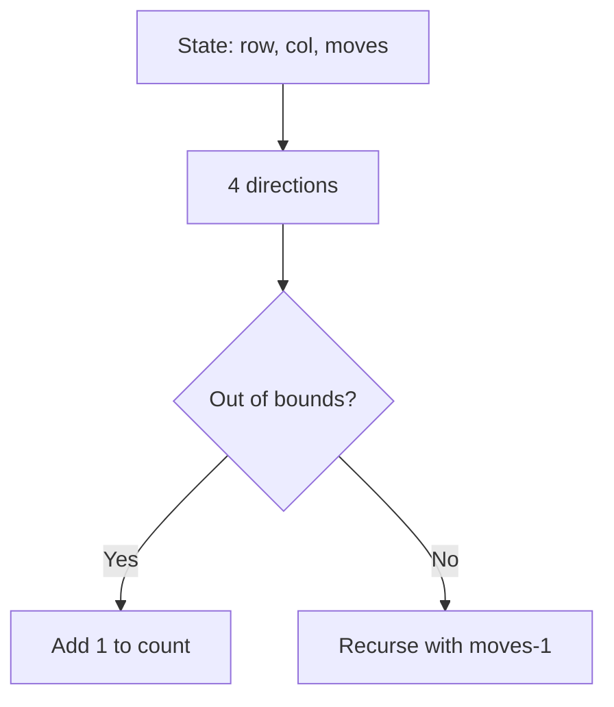

# Unique Paths

## Problem Statement

A robot is located at the top-left corner of a `m x n` grid. The robot can only move either **down** or **right** at any point in time. The robot is trying to reach the **bottom-right corner** of the grid.

How many possible **unique paths** are there?

## Input/Output Format

**Input:**
- `m` (int): Number of rows
- `n` (int): Number of columns

**Output:**
- (int): Number of unique paths from top-left to bottom-right

## Constraints

- `1 <= m, n <= 100`
- The answer is guaranteed to be less than or equal to `2 * 10^9`

## Examples

### Example 1: Small Grid

**Input:** `m = 3`, `n = 7`

**Output:** `28`

**Explanation:**
```
Grid (3x7):
+---+---+---+---+---+---+---+
| R |   |   |   |   |   |   |  R = Robot start
+---+---+---+---+---+---+---+
|   |   |   |   |   |   |   |
+---+---+---+---+---+---+---+
|   |   |   |   |   |   | G |  G = Goal
+---+---+---+---+---+---+---+

Robot must make exactly 2 down moves and 6 right moves.
Total moves = 8 (2 down + 6 right)
Number of ways = C(8, 2) = 8!/(2!*6!) = 28
```

### Example 2: Minimal Grid

**Input:** `m = 3`, `n = 2`

**Output:** `3`

**Explanation:**
```
Grid (3x2):
+---+---+
| R |   |
+---+---+
|   |   |
+---+---+
|   | G |
+---+---+

Three unique paths:
Path 1: Right -> Down -> Down
Path 2: Down -> Right -> Down
Path 3: Down -> Down -> Right
```

### Example 3: Single Row/Column

**Input:** `m = 1`, `n = 5`

**Output:** `1`

**Explanation:**
Only one path exists - move right 4 times.

```
+---+---+---+---+---+
| R | > | > | > | G |
+---+---+---+---+---+
```

## Visual Explanation



## ASCII Art: DP Table Building

```
Grid: m=3, n=4

DP Table: dp[i][j] = number of unique paths to cell (i, j)

        col 0   col 1   col 2   col 3
      +-------+-------+-------+-------+
row 0 |   1   |   1   |   1   |   1   |  <- All 1s (can only come from left)
      +-------+-------+-------+-------+
row 1 |   1   |   2   |   3   |   4   |
      +-------+-------+-------+-------+
row 2 |   1   |   3   |   6   |  10   |  <- Answer at [2][3]
      +-------+-------+-------+-------+
        ^
        |
    All 1s (can only come from above)

Recurrence: dp[i][j] = dp[i-1][j] + dp[i][j-1]
            (from above) + (from left)

Example: dp[2][2] = dp[1][2] + dp[2][1] = 3 + 3 = 6

Answer: dp[m-1][n-1] = dp[2][3] = 10
```

## Solution Code

### Approach 1: Top-Down (Memoization)

```python
from functools import lru_cache

def uniquePaths(m: int, n: int) -> int:
    """
    Count unique paths using memoization.

    From any cell, we can only come from above or left.
    Total paths to (i,j) = paths to (i-1,j) + paths to (i,j-1)

    Args:
        m: Number of rows
        n: Number of columns

    Returns:
        Number of unique paths

    Time Complexity: O(m * n)
    Space Complexity: O(m * n)
    """
    @lru_cache(maxsize=None)
    def dp(i: int, j: int) -> int:
        """Return number of paths to cell (i, j)."""
        # Base case: starting cell
        if i == 0 and j == 0:
            return 1

        # Out of bounds
        if i < 0 or j < 0:
            return 0

        # Sum paths from above and left
        return dp(i - 1, j) + dp(i, j - 1)

    return dp(m - 1, n - 1)
```

::: info Complexity: Time O(m * n) · Space O(m * n)
- **Time:** Each cell (i, j) is computed exactly once due to memoization, giving m * n total computations.
- **Space:** The cache stores m * n entries, plus recursion stack depth of O(m + n) for the deepest path.
:::

### Approach 2: Bottom-Up (Tabulation)

```python
def uniquePaths(m: int, n: int) -> int:
    """
    Count unique paths using bottom-up DP.

    Build solution from top-left to bottom-right.

    Args:
        m: Number of rows
        n: Number of columns

    Returns:
        Number of unique paths

    Time Complexity: O(m * n)
    Space Complexity: O(m * n)
    """
    # dp[i][j] = paths to cell (i, j)
    dp = [[1] * n for _ in range(m)]

    # First row and first column are all 1s (only one way)
    # Fill the rest
    for i in range(1, m):
        for j in range(1, n):
            dp[i][j] = dp[i - 1][j] + dp[i][j - 1]

    return dp[m - 1][n - 1]
```

::: info Complexity: Time O(m * n) · Space O(m * n)
- **Time:** Two nested loops fill all m * n cells with constant-time addition operations.
- **Space:** The 2D dp table stores path counts for all cells in the grid.
:::

### Approach 3: Space-Optimized (1D Array)

```python
def uniquePaths(m: int, n: int) -> int:
    """
    Count unique paths with O(n) space.

    Only need to track the current row. The value "above"
    is the old value at that position.

    Args:
        m: Number of rows
        n: Number of columns

    Returns:
        Number of unique paths

    Time Complexity: O(m * n)
    Space Complexity: O(n)
    """
    # Current row
    dp = [1] * n

    for i in range(1, m):
        for j in range(1, n):
            # dp[j] (old value) = paths from above
            # dp[j-1] (new value) = paths from left
            dp[j] += dp[j - 1]

    return dp[n - 1]
```

::: info Complexity: Time O(m * n) · Space O(n)
- **Time:** Same O(m * n) iterations processing rows one at a time.
- **Space:** Only a single 1D array of size n is needed. The "from above" value is the old dp[j] before updating.
:::

### Approach 4: Mathematical (Combinatorics)

```python
import math

def uniquePaths(m: int, n: int) -> int:
    """
    Count unique paths using combinatorics.

    We need exactly (m-1) down moves and (n-1) right moves.
    Total moves = (m-1) + (n-1) = m + n - 2
    Choose positions for down moves: C(m+n-2, m-1)

    Args:
        m: Number of rows
        n: Number of columns

    Returns:
        Number of unique paths

    Time Complexity: O(min(m, n))
    Space Complexity: O(1)
    """
    # C(m+n-2, m-1) = C(m+n-2, n-1)
    return math.comb(m + n - 2, m - 1)

::: info Complexity: Time O(min(m, n)) · Space O(1)
- **Time:** The combinatorial calculation C(m+n-2, m-1) requires min(m-1, n-1) multiplications and divisions.
- **Space:** Only a constant number of variables needed for the computation; no grid storage required.
:::

def uniquePaths_manual(m: int, n: int) -> int:
    """
    Count unique paths with manual combination calculation.

    Avoid overflow by alternating multiplication and division.

    Args:
        m: Number of rows
        n: Number of columns

    Returns:
        Number of unique paths

    Time Complexity: O(min(m, n))
    Space Complexity: O(1)
    """
    # Calculate C(m+n-2, min(m-1, n-1))
    total = m + n - 2
    k = min(m - 1, n - 1)

    result = 1
    for i in range(k):
        result = result * (total - i) // (i + 1)

    return result
```

::: info Complexity: Time O(min(m, n)) · Space O(1)
- **Time:** The loop runs min(m-1, n-1) iterations, each performing constant-time arithmetic.
- **Space:** Uses only a few integer variables regardless of grid size.
:::

## Complexity Analysis

| Approach | Time Complexity | Space Complexity |
|----------|----------------|------------------|
| Top-Down (Memoization) | O(m * n) | O(m * n) |
| Bottom-Up (Tabulation) | O(m * n) | O(m * n) |
| Space-Optimized | O(m * n) | O(min(m, n)) |
| Mathematical | O(min(m, n)) | O(1) |

## Edge Cases

1. **Single cell (1x1):**
   ```python
   uniquePaths(1, 1)  # Returns 1
   ```

2. **Single row:**
   ```python
   uniquePaths(1, 5)  # Returns 1
   ```

3. **Single column:**
   ```python
   uniquePaths(5, 1)  # Returns 1
   ```

4. **Square grid:**
   ```python
   uniquePaths(3, 3)  # Returns 6
   ```

5. **Large grid:**
   ```python
   uniquePaths(100, 100)  # Large number, use combinatorics
   ```

## Mathematical Insight

```
For a 3x4 grid:
- Need 2 down moves (D) and 3 right moves (R)
- Total moves = 5
- Question: In how many ways can we arrange DDDRRR... wait, DDRRRR?

Actually: D D R R R (2 D's and 3 R's)

This is choosing 2 positions out of 5 for D's:
C(5, 2) = 5!/(2!*3!) = 10

Alternatively, choose 3 positions for R's:
C(5, 3) = 5!/(3!*2!) = 10

General formula: C(m+n-2, m-1) = C(m+n-2, n-1)
```

## Pascal's Triangle Connection

```
The unique paths grid IS Pascal's Triangle rotated!

Pascal's Triangle:
         1
        1 1
       1 2 1
      1 3 3 1
     1 4 6 4 1
    1 5 10 10 5 1

Rotated 45 degrees:
    1  1  1  1
    1  2  3  4
    1  3  6  10
    1  4  10 20

Each cell = sum of cell above + cell to the left
Same recurrence as unique paths!
```

## Key Insights

1. **Only Two Moves**: Can only move right or down, making this a simple 2D DP.

2. **State Definition**: `dp[i][j]` = number of unique paths to reach cell (i, j) from (0, 0).

3. **Recurrence**: `dp[i][j] = dp[i-1][j] + dp[i][j-1]` (paths from above + paths from left).

4. **Base Cases**: First row and first column are all 1s (only one way to reach them).

5. **Combinatorial Interpretation**: Choosing which moves are "down" among all moves.

## Related Problems

::: details Unique Paths II (LeetCode 63)
**Problem:** Same as Unique Paths but grid has obstacles (cells marked 1). Find number of paths avoiding obstacles.

**Key Insight:** Same DP but set dp[i][j] = 0 for obstacle cells. Handle first row/column carefully - once blocked, all cells after are unreachable.



**Approach:** Same recurrence but with obstacle check: `dp[i][j] = 0 if obstacle else dp[i-1][j] + dp[i][j-1]`.

**Complexity:** O(m * n) time, O(n) space
:::

::: details Minimum Path Sum (LeetCode 64)
**Problem:** Given m x n grid with non-negative numbers, find path from top-left to bottom-right minimizing sum.

**Key Insight:** Same structure as Unique Paths but minimize sum instead of counting. Track minimum sum to reach each cell.



**Approach:** `dp[i][j] = grid[i][j] + min(dp[i-1][j], dp[i][j-1])`. Initialize first row/col as cumulative sums.

**Complexity:** O(m * n) time, O(n) space
:::

::: details Dungeon Game (LeetCode 174)
**Problem:** Find minimum initial health to traverse dungeon from top-left to bottom-right princess, where cells can add or subtract health, and health must always stay positive.

**Key Insight:** Process from bottom-right to top-left (reverse direction). Track minimum health needed to survive from each cell to end.



**Approach:** `dp[i][j] = max(1, min(dp[i+1][j], dp[i][j+1]) - dungeon[i][j])`. We need at least 1 health at every step.

**Complexity:** O(m * n) time, O(n) space
:::

::: details Out of Boundary Paths (LeetCode 576)
**Problem:** Given m x n grid, starting position, and maxMoves, count paths that move the ball out of grid boundary.

**Key Insight:** 3D DP with state (row, col, remaining moves). From each cell, try all 4 directions. Count when moving out of bounds.



**Approach:** `dp[i][j][k]` = ways to go out from (i,j) with k moves. Sum contributions from all 4 directions, counting boundary crossings.

**Complexity:** O(m * n * maxMoves) time and space
:::
