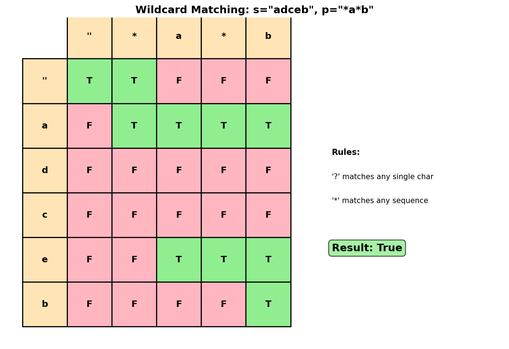
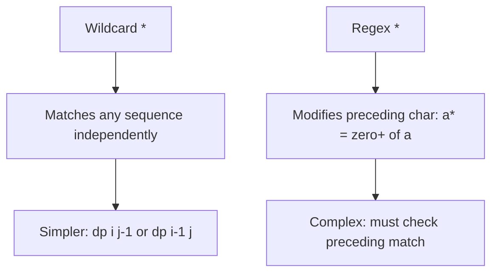
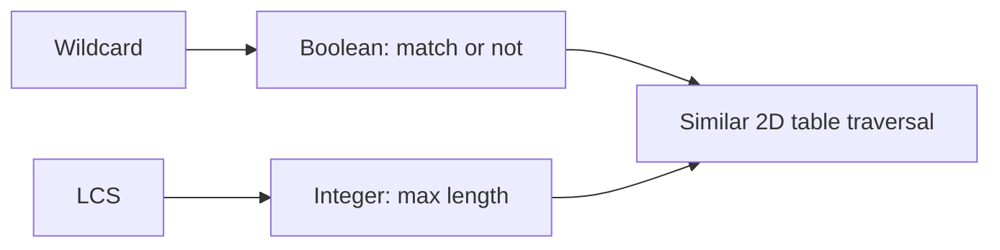
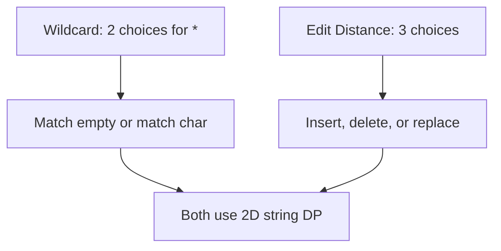
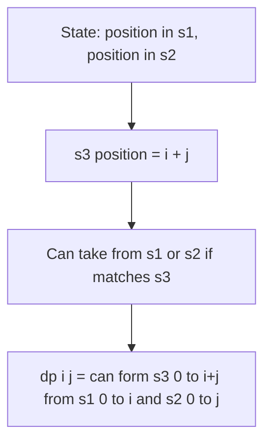

# Wildcard Matching

## Problem Statement

Given an input string `s` and a pattern `p`, implement wildcard pattern matching with support for `'?'` and `'*'` where:

- `'?'` Matches any single character.
- `'*'` Matches any sequence of characters (including the empty sequence).

The matching should cover the **entire** input string (not partial).

## Input/Output Format

**Input:**
- `s` (str): Input string
- `p` (str): Pattern with `?` and `*` wildcards

**Output:**
- (bool): True if the entire string matches the pattern

## Constraints

- `0 <= s.length, p.length <= 2000`
- `s` contains only lowercase English letters
- `p` contains only lowercase English letters, `'?'` or `'*'`

## Examples

### Example 1: Star Not Enough

**Input:** `s = "aa"`, `p = "a"`

**Output:** `false`

**Explanation:**
Pattern `"a"` doesn't match the entire string `"aa"`.

### Example 2: Star Matches All

**Input:** `s = "aa"`, `p = "*"`

**Output:** `true`

**Explanation:**
`'*'` matches any sequence, including `"aa"`.

### Example 3: Question Mark

**Input:** `s = "cb"`, `p = "?a"`

**Output:** `false`

**Explanation:**
`'?'` matches `'c'`, but `'a'` doesn't match `'b'`.

### Example 4: Complex Pattern

**Input:** `s = "adceb"`, `p = "*a*b"`

**Output:** `true`

**Explanation:**
```
*  -> matches "" (empty)
a  -> matches "a"
*  -> matches "dce"
b  -> matches "b"

So "*a*b" matches "adceb"
```

### Example 5: No Match

**Input:** `s = "acdcb"`, `p = "a*c?b"`

**Output:** `false`

**Explanation:**
```
a   -> matches "a"
*   -> must match "cdc" or "cd" or ...
c?b -> needs to match "cb" or "c?b"

No valid way to split - "a*c?b" doesn't match "acdcb"
```

## Visual Explanation



## ASCII Art: Pattern Matching

```
s = "adceb", p = "*a*b"

DP Table: dp[i][j] = does s[0:i] match p[0:j]?

            ""   *    a    *    b
           p[0] p[1] p[2] p[3] p[4]
         +----+----+----+----+----+
 ""      | T  | T  | F  | F  | F  |
 s[0]    +----+----+----+----+----+
 a       | F  | T  | T  | T  | F  |
 s[1]    +----+----+----+----+----+
 d       | F  | T  | F  | T  | F  |
 s[2]    +----+----+----+----+----+
 c       | F  | T  | F  | T  | F  |
 s[3]    +----+----+----+----+----+
 e       | F  | T  | F  | T  | F  |
 s[4]    +----+----+----+----+----+
 b       | F  | T  | F  | T  | T  |
 s[5]    +----+----+----+----+----+

How '*' propagates:
- '*' can match empty: look at dp[i][j-1]
- '*' can match one more char: look at dp[i-1][j]

dp[5][4] = True -> Match!
```

## Difference from Regex Matching

```
Wildcard Matching:
- '*' matches ANY sequence independently
- Pattern: "*a*" means (any)(a)(any)

Regular Expression Matching:
- '*' modifies the PRECEDING character
- Pattern: ".*a.*" means (any repeated)(a)(any repeated)

Example:
- Wildcard "*" matches "abc"
- Regex ".*" matches "abc" (. repeated 3 times)

Wildcard is simpler because '*' doesn't depend on preceding char.
```

## Solution Code

### Approach 1: Top-Down (Memoization)

```python
from functools import lru_cache

def isMatch(s: str, p: str) -> bool:
    """
    Check wildcard match using memoization.

    Handle three cases:
    1. Regular character match
    2. '?' matches any single character
    3. '*' matches any sequence (including empty)

    Args:
        s: Input string
        p: Pattern

    Returns:
        True if entire string matches pattern

    Time Complexity: O(m * n)
    Space Complexity: O(m * n)
    """
    @lru_cache(maxsize=None)
    def dp(i: int, j: int) -> bool:
        """Check if s[i:] matches p[j:]."""
        # Both exhausted
        if j == len(p):
            return i == len(s)

        # Pattern has '*'
        if p[j] == '*':
            # '*' matches empty OR '*' matches one char and continues
            return dp(i, j + 1) or (i < len(s) and dp(i + 1, j))

        # Match single character
        if i < len(s) and (p[j] == '?' or p[j] == s[i]):
            return dp(i + 1, j + 1)

        return False

    return dp(0, 0)
```

::: info Complexity: Time O(m * n) · Space O(m * n)
- **Time:** Each (i, j) pair is computed once due to memoization, where i is position in string (length m) and j is position in pattern (length n).
- **Space:** The cache stores O(m * n) states, plus recursion stack of O(m + n) for the deepest call path.
:::

### Approach 2: Bottom-Up (Tabulation)

::: code-group
```python [Python]
def isMatch(s: str, p: str) -> bool:
    """
    Check wildcard match using bottom-up DP.

    Build solution from beginning of strings.

    Args:
        s: Input string
        p: Pattern

    Returns:
        True if entire string matches pattern

    Time Complexity: O(m * n)
    Space Complexity: O(m * n)
    """
    m, n = len(s), len(p)

    # dp[i][j] = True if s[0:i] matches p[0:j]
    dp = [[False] * (n + 1) for _ in range(m + 1)]
    dp[0][0] = True

    # Initialize: patterns starting with '*' can match empty string
    for j in range(1, n + 1):
        if p[j - 1] == '*':
            dp[0][j] = dp[0][j - 1]
        else:
            break  # Can't match empty string after non-'*'

    for i in range(1, m + 1):
        for j in range(1, n + 1):
            if p[j - 1] == '*':
                # '*' matches empty (dp[i][j-1]) OR
                # '*' matches current char (dp[i-1][j])
                dp[i][j] = dp[i][j - 1] or dp[i - 1][j]
            elif p[j - 1] == '?' or p[j - 1] == s[i - 1]:
                # Direct match
                dp[i][j] = dp[i - 1][j - 1]

    return dp[m][n]
```

```java [Java]
public boolean isMatch(String s, String p) {
    int m = s.length(), n = p.length();

    // dp[i][j] = true if s[0:i] matches p[0:j]
    boolean[][] dp = new boolean[m + 1][n + 1];
    dp[0][0] = true;

    // Initialize: patterns starting with '*' can match empty string
    for (int j = 1; j <= n; j++) {
        if (p.charAt(j - 1) == '*') {
            dp[0][j] = dp[0][j - 1];
        } else {
            break; // Can't match empty string after non-'*'
        }
    }

    for (int i = 1; i <= m; i++) {
        for (int j = 1; j <= n; j++) {
            if (p.charAt(j - 1) == '*') {
                // '*' matches empty (dp[i][j-1]) OR
                // '*' matches current char (dp[i-1][j])
                dp[i][j] = dp[i][j - 1] || dp[i - 1][j];
            } else if (p.charAt(j - 1) == '?' || p.charAt(j - 1) == s.charAt(i - 1)) {
                // Direct match
                dp[i][j] = dp[i - 1][j - 1];
            }
        }
    }

    return dp[m][n];
}
```
:::

::: info Complexity: Time O(m * n) · Space O(m * n)
- **Time:** Two nested loops process all (m+1) * (n+1) cells with constant-time work per cell.
- **Space:** The 2D boolean table stores match results for all (string prefix, pattern prefix) combinations.
:::

### Approach 3: Space-Optimized

```python
def isMatch(s: str, p: str) -> bool:
    """
    Check wildcard match with O(n) space.

    Only need current and previous row.

    Args:
        s: Input string
        p: Pattern

    Returns:
        True if entire string matches pattern

    Time Complexity: O(m * n)
    Space Complexity: O(n)
    """
    m, n = len(s), len(p)

    # Previous row
    prev = [False] * (n + 1)
    prev[0] = True

    for j in range(1, n + 1):
        if p[j - 1] == '*':
            prev[j] = prev[j - 1]
        else:
            break

    for i in range(1, m + 1):
        curr = [False] * (n + 1)

        for j in range(1, n + 1):
            if p[j - 1] == '*':
                curr[j] = curr[j - 1] or prev[j]
            elif p[j - 1] == '?' or p[j - 1] == s[i - 1]:
                curr[j] = prev[j - 1]

        prev = curr

    return prev[n]
```

::: info Complexity: Time O(m * n) · Space O(n)
- **Time:** Same as Approach 2, iterating through all m rows and n columns.
- **Space:** Reduced to O(n) by keeping only two arrays (prev and curr) of size n+1 instead of the full 2D table.
:::

### Approach 4: Greedy with Backtracking (O(1) Extra Space)

```python
def isMatch(s: str, p: str) -> bool:
    """
    Check wildcard match using greedy approach with backtracking.

    Track position of last '*' and retry from there if needed.

    Args:
        s: Input string
        p: Pattern

    Returns:
        True if entire string matches pattern

    Time Complexity: O(m * n) worst case, often better
    Space Complexity: O(1)
    """
    m, n = len(s), len(p)
    i = j = 0
    star_idx = -1  # Position of last '*' in pattern
    match_idx = 0  # Position in s when we saw last '*'

    while i < m:
        # Current characters match
        if j < n and (p[j] == '?' or p[j] == s[i]):
            i += 1
            j += 1
        # '*' found - record and skip
        elif j < n and p[j] == '*':
            star_idx = j
            match_idx = i
            j += 1
        # No match, but we have a previous '*' to backtrack to
        elif star_idx != -1:
            j = star_idx + 1
            match_idx += 1
            i = match_idx
        # No match and no '*' to help
        else:
            return False

    # Check remaining pattern (should be all '*')
    while j < n and p[j] == '*':
        j += 1

    return j == n
```

::: info Complexity: Time O(m * n) worst case · Space O(1)
- **Time:** In the worst case (e.g., pattern "*a" and string "aaaa...b"), backtracking can revisit positions, but each character pair is processed at most O(m) times overall.
- **Space:** Only four integer variables (i, j, star_idx, match_idx) are used regardless of input size.
:::

## Complexity Analysis

| Approach | Time Complexity | Space Complexity |
|----------|----------------|------------------|
| Top-Down | O(m * n) | O(m * n) |
| Bottom-Up | O(m * n) | O(m * n) |
| Space-Optimized | O(m * n) | O(n) |
| Greedy | O(m * n) worst | O(1) |

Where m = len(s), n = len(p).

## Edge Cases

1. **Empty strings:**
   ```python
   isMatch("", "")     # True
   isMatch("", "*")    # True
   isMatch("", "?")    # False
   isMatch("a", "")    # False
   ```

2. **Only stars:**
   ```python
   isMatch("abc", "***")  # True
   isMatch("", "***")     # True
   ```

3. **Only question marks:**
   ```python
   isMatch("abc", "???")  # True
   isMatch("ab", "???")   # False
   ```

4. **Mixed:**
   ```python
   isMatch("abcd", "*?*?*")  # True (flexible matching)
   isMatch("a", "*?*")       # True
   ```

5. **Long string of stars:**
   ```python
   isMatch("a", "*" * 1000 + "a")  # True (but can be slow without optimization)
   ```

## Understanding '*' Behavior

```
'*' can match ANY sequence, including empty.

For pattern "*a*b":
- First '*' can match: "", "x", "xy", "xyz", ...
- Then 'a' must match exactly 'a'
- Second '*' can match anything
- Then 'b' must match exactly 'b'

Example: s = "xyzaAAAbBBb"
First '*' matches "xyz"
'a' matches 'a'
Second '*' matches "AAAbBB"
'b' matches 'b'
Result: True

The DP handles this by:
- dp[i][j-1]: '*' matches empty (move past '*' in pattern)
- dp[i-1][j]: '*' matches current char (consume char, stay at '*')
```

## Key Insights

1. **'*' is Independent**: Unlike regex, '*' doesn't depend on preceding character.

2. **Two Choices for '*'**:
   - Match empty: skip to next pattern char
   - Match current string char: consume char, stay at '*'

3. **'?' is Simple**: Just matches any single character.

4. **Greedy Approach**: Track last '*' position for backtracking. Often faster in practice.

5. **State Definition**: `dp[i][j]` = whether `s[0:i]` matches `p[0:j]`.

## Comparison: Wildcard vs Regex

| Feature | Wildcard | Regex |
|---------|----------|-------|
| `*` meaning | Any sequence | Zero+ of preceding |
| `?` meaning | Any single char | Not used (`.` instead) |
| `.` meaning | Literal dot | Any single char |
| Complexity | Simpler | More expressive |

## Related Problems

::: details Regular Expression Matching (LeetCode 10)
**Problem:** Match with `.` (any char) and `*` (zero or more of preceding element).

**Key Insight:** More complex because `*` depends on preceding character. Must handle `x*` as a unit.



**Approach:** For regex `x*`: `dp[i][j] = dp[i][j-2]` (zero x) OR `dp[i-1][j] if x matches s[i]` (one+ x). The preceding character matters.

**Complexity:** O(m * n) time, O(n) space
:::

::: details Longest Common Subsequence (LeetCode 1143)
**Problem:** Find length of longest subsequence present in both strings.

**Key Insight:** Similar 2D DP table structure, but maximizing length instead of boolean match.



**Approach:** `dp[i][j] = dp[i-1][j-1] + 1` if chars match, else `max(dp[i-1][j], dp[i][j-1])`.

**Complexity:** O(m * n) time, O(min(m,n)) space
:::

::: details Edit Distance (LeetCode 72)
**Problem:** Minimum operations (insert, delete, replace) to transform one string to another.

**Key Insight:** Same 2D DP on string prefixes. Three choices when characters don't match.



**Approach:** `dp[i][j] = dp[i-1][j-1]` if match, else `1 + min(dp[i-1][j], dp[i][j-1], dp[i-1][j-1])`.

**Complexity:** O(m * n) time, O(min(m,n)) space
:::

::: details Interleaving String (LeetCode 97)
**Problem:** Check if s3 is formed by interleaving s1 and s2.

**Key Insight:** 2D DP where state tracks position in both source strings. s3 position is determined by i+j.



**Approach:** `dp[i][j] = (dp[i-1][j] and s1[i-1]==s3[i+j-1]) or (dp[i][j-1] and s2[j-1]==s3[i+j-1])`.

**Complexity:** O(m * n) time, O(n) space
:::
