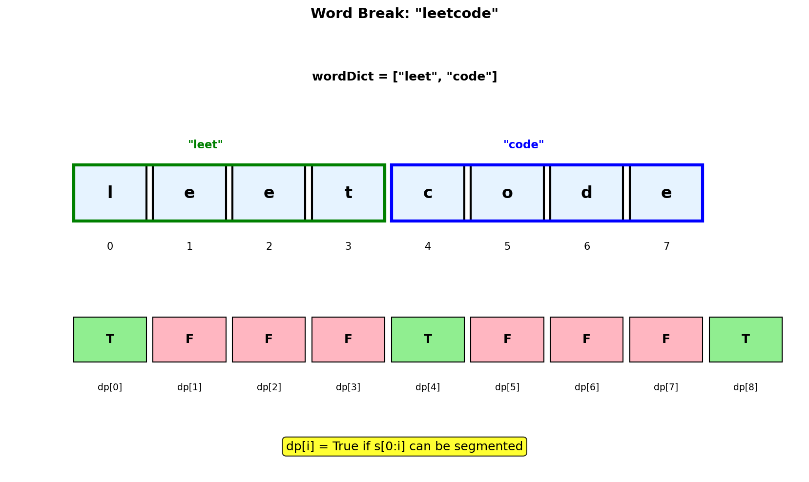
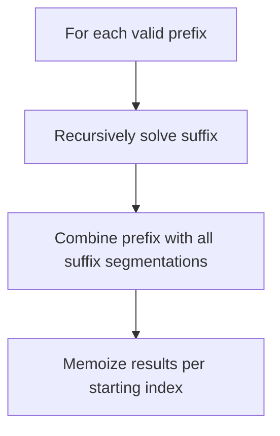
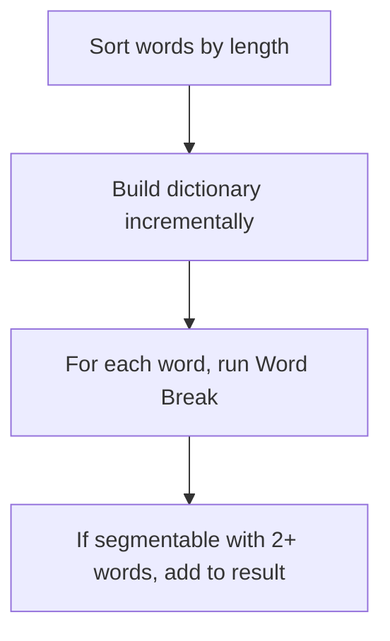
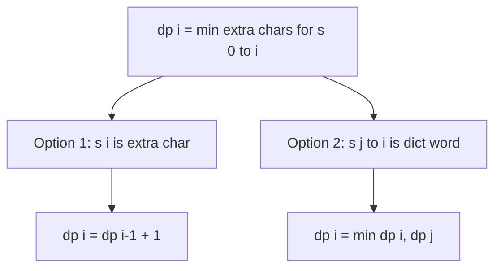
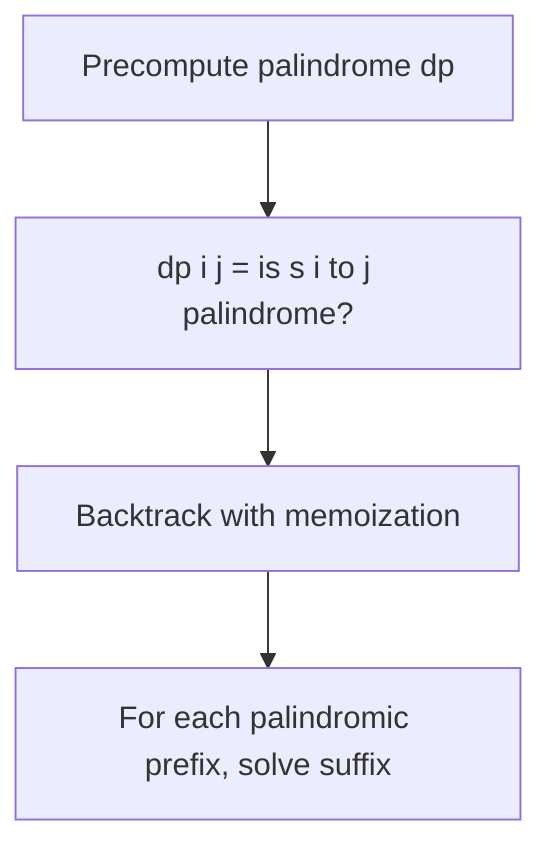

# Word Break

## Problem Statement

Given a string `s` and a dictionary of strings `wordDict`, return `true` if `s` can be segmented into a space-separated sequence of one or more dictionary words.

**Note**: The same word in the dictionary may be reused multiple times in the segmentation.

## Input/Output Format

**Input:**
- `s` (str): The string to segment
- `wordDict` (List[str]): Dictionary of valid words

**Output:**
- (bool): True if s can be segmented using dictionary words

## Constraints

- `1 <= s.length <= 300`
- `1 <= wordDict.length <= 1000`
- `1 <= wordDict[i].length <= 20`
- `s` and `wordDict[i]` consist of only lowercase English letters
- All strings in `wordDict` are **unique**

## Examples

### Example 1: Basic Segmentation

**Input:** `s = "leetcode"`, `wordDict = ["leet", "code"]`

**Output:** `true`

**Explanation:**
```
s = "leetcode"
     ----++++
     leet|code

The string can be segmented as "leet code".
Both "leet" and "code" are in the dictionary.
```

### Example 2: Reusing Words

**Input:** `s = "applepenapple"`, `wordDict = ["apple", "pen"]`

**Output:** `true`

**Explanation:**
```
s = "applepenapple"
     -----+++ -----
     apple|pen|apple

The string can be segmented as "apple pen apple".
"apple" is used twice, which is allowed.
```

### Example 3: Impossible Segmentation

**Input:** `s = "catsandog"`, `wordDict = ["cats", "dog", "sand", "and", "cat"]`

**Output:** `false`

**Explanation:**
```
Possible attempts:
- "cat" + "sandog"  -> "sandog" cannot be segmented
- "cats" + "andog"  -> "andog" cannot be segmented

No valid segmentation exists.

Note: "cats" + "and" + "og" fails because "og" is not in dict
      "cat" + "sand" + "og" fails because "og" is not in dict
```

### Example 4: Single Character Words

**Input:** `s = "aaaaaaa"`, `wordDict = ["a", "aa", "aaa"]`

**Output:** `true`

**Explanation:**
Multiple valid segmentations:
- "a a a a a a a"
- "aa aa aaa"
- "aaa aa aa"
- etc.

## Visual Explanation



## ASCII Art: DP Table Building

```
s = "leetcode", wordDict = ["leet", "code"]

DP Array: dp[i] = true if s[0:i] can be segmented

Index:    0    1    2    3    4    5    6    7    8
Char:     _    l    e    e    t    c    o    d    e
        +----+----+----+----+----+----+----+----+----+
dp[]:   | T  | F  | F  | F  | T  | F  | F  | F  | T  |
        +----+----+----+----+----+----+----+----+----+
          ^                   ^                   ^
          |                   |                   |
    base case          "leet" ends         "code" ends
                       here                here

Building dp[8]:
===============
For j = 0 to 7, check if dp[j] is True and s[j:8] is in dict:
- j=0: dp[0]=T, s[0:8]="leetcode" not in dict
- j=1: dp[1]=F, skip
- j=2: dp[2]=F, skip
- j=3: dp[3]=F, skip
- j=4: dp[4]=T, s[4:8]="code" IN DICT! -> dp[8] = True

Answer: dp[8] = True
```

## Solution Code

### Approach 1: Top-Down (Memoization)

```python
from typing import List
from functools import lru_cache

def wordBreak(s: str, wordDict: List[str]) -> bool:
    """
    Check if string can be segmented using memoization.

    Try each prefix - if it's a word, recursively check the suffix.

    Args:
        s: String to segment
        wordDict: Dictionary of valid words

    Returns:
        True if s can be segmented

    Time Complexity: O(n^3) - n states, O(n) work per state
    Space Complexity: O(n)
    """
    word_set = set(wordDict)

    @lru_cache(maxsize=None)
    def dp(start: int) -> bool:
        """Check if s[start:] can be segmented."""
        if start == len(s):
            return True

        for end in range(start + 1, len(s) + 1):
            if s[start:end] in word_set and dp(end):
                return True

        return False

    return dp(0)
```

::: info Complexity: Time O(n^3) · Space O(n)
- **Time:** O(n) unique starting positions, and for each we try O(n) ending positions. Each substring check/creation is O(n), giving O(n^3).
- **Space:** The memoization cache stores O(n) boolean values, plus O(n) recursion stack depth.
:::

### Approach 2: Bottom-Up (Tabulation)

```python
from typing import List

def wordBreak(s: str, wordDict: List[str]) -> bool:
    """
    Check if string can be segmented using bottom-up DP.

    dp[i] = True if s[0:i] can be segmented.

    Args:
        s: String to segment
        wordDict: Dictionary of valid words

    Returns:
        True if s can be segmented

    Time Complexity: O(n^3)
    Space Complexity: O(n)
    """
    word_set = set(wordDict)
    n = len(s)

    # dp[i] = True if s[0:i] can be segmented
    dp = [False] * (n + 1)
    dp[0] = True  # Empty string is valid

    for i in range(1, n + 1):
        for j in range(i):
            if dp[j] and s[j:i] in word_set:
                dp[i] = True
                break

    return dp[n]
```

::: info Complexity: Time O(n^3) · Space O(n)
- **Time:** Two nested loops give O(n^2) state pairs, and each substring check is O(n) for creation and hashing.
- **Space:** The dp array of size n+1 stores boolean segmentation results for each prefix.
:::

### Approach 3: Optimized with Word Length Bounds

```python
from typing import List

def wordBreak(s: str, wordDict: List[str]) -> bool:
    """
    Optimized solution using word length bounds.

    Only check substrings that could match dictionary word lengths.

    Args:
        s: String to segment
        wordDict: Dictionary of valid words

    Returns:
        True if s can be segmented

    Time Complexity: O(n * m * k) where m = max word length, k = avg word length
    Space Complexity: O(n + total dict chars)
    """
    word_set = set(wordDict)
    max_len = max(len(w) for w in wordDict) if wordDict else 0
    n = len(s)

    dp = [False] * (n + 1)
    dp[0] = True

    for i in range(1, n + 1):
        # Only check substrings up to max word length
        for j in range(max(0, i - max_len), i):
            if dp[j] and s[j:i] in word_set:
                dp[i] = True
                break

    return dp[n]
```

::: info Complexity: Time O(n * m * k) · Space O(n + dict)
- **Time:** For each position, we only check substrings up to max word length m. Each substring check averages O(k) for average word length.
- **Space:** O(n) for the dp array plus O(total dictionary characters) for the word set.
:::

### Approach 4: BFS Solution

```python
from typing import List
from collections import deque

def wordBreak(s: str, wordDict: List[str]) -> bool:
    """
    Check if string can be segmented using BFS.

    Each state is a starting index. Try all words from that index.

    Args:
        s: String to segment
        wordDict: Dictionary of valid words

    Returns:
        True if s can be segmented

    Time Complexity: O(n^3)
    Space Complexity: O(n)
    """
    word_set = set(wordDict)
    n = len(s)

    visited = [False] * n
    queue = deque([0])

    while queue:
        start = queue.popleft()

        if start == n:
            return True

        if visited[start]:
            continue
        visited[start] = True

        for end in range(start + 1, n + 1):
            if s[start:end] in word_set:
                queue.append(end)

    return False
```

::: info Complexity: Time O(n^3) · Space O(n)
- **Time:** BFS visits each starting index at most once (via visited array). For each, we try O(n) endings with O(n) substring work.
- **Space:** The visited array and queue each use O(n) space for tracking reachable positions.
:::

### Approach 5: Return All Segmentations

```python
from typing import List

def wordBreak_all(s: str, wordDict: List[str]) -> List[str]:
    """
    Return all possible segmentations of the string.

    Args:
        s: String to segment
        wordDict: Dictionary of valid words

    Returns:
        List of all valid segmentations

    Time Complexity: O(n^2 * 2^n) worst case
    Space Complexity: O(n * 2^n)
    """
    word_set = set(wordDict)
    n = len(s)
    memo = {}

    def backtrack(start: int) -> List[List[str]]:
        """Return all segmentations for s[start:]."""
        if start == n:
            return [[]]

        if start in memo:
            return memo[start]

        results = []
        for end in range(start + 1, n + 1):
            word = s[start:end]
            if word in word_set:
                for rest in backtrack(end):
                    results.append([word] + rest)

        memo[start] = results
        return results

    return [' '.join(words) for words in backtrack(0)]
```

::: info Complexity: Time O(n^2 * 2^n) worst case · Space O(n * 2^n)
- **Time:** In the worst case (e.g., "aaa...a" with dict {"a", "aa", ...}), there can be 2^n valid segmentations, each taking O(n) to build.
- **Space:** We store all segmentations, which can be O(2^n) paths each of length O(n) in the worst case.
:::

## Complexity Analysis

| Approach | Time Complexity | Space Complexity |
|----------|----------------|------------------|
| Top-Down | O(n^3) | O(n) |
| Bottom-Up | O(n^3) | O(n) |
| Length-Optimized | O(n * m * k) | O(n) |
| BFS | O(n^3) | O(n) |

Where n = len(s), m = max word length, k = average word length.

The O(n^3) comes from: O(n) states, O(n) transitions per state, O(n) for substring comparison/creation.

## Edge Cases

1. **Empty string:**
   ```python
   wordBreak("", ["a", "b"])  # Returns True (empty is trivially segmentable)
   ```

2. **Single character:**
   ```python
   wordBreak("a", ["a"])  # Returns True
   wordBreak("a", ["b"])  # Returns False
   ```

3. **Dictionary word equals string:**
   ```python
   wordBreak("hello", ["hello"])  # Returns True
   ```

4. **No valid segmentation:**
   ```python
   wordBreak("abcd", ["a", "bc"])  # Returns False
   ```

5. **Multiple valid segmentations:**
   ```python
   wordBreak("pineapplepenapple", ["apple", "pen", "applepen", "pine", "pineapple"])
   # Returns True (multiple ways)
   ```

## Understanding the DP Transition

```
s = "catsanddog", wordDict = ["cat", "cats", "and", "sand", "dog"]

Index:  0   1   2   3   4   5   6   7   8   9   10
Char:   c   a   t   s   a   n   d   d   o   g
        |-------|
            cat
        |-----------|
            cats

dp[0] = True (base case)
dp[3] = True ("cat")
dp[4] = True ("cats")
dp[7] = True? Let's check:
  - dp[4] && "and" -> True (cats + and)
  - dp[3] && "sand" -> True (cat + sand)
dp[10] = True? Let's check:
  - dp[7] && "dog" -> True!

Final: dp[10] = True

Segmentation: "cats and dog" or "cat sand dog"
```

## Key Insights

1. **State Definition**: `dp[i]` = True if `s[0:i]` can be segmented into dictionary words.

2. **Transition**: `dp[i] = True` if there exists some `j < i` where `dp[j] = True` AND `s[j:i]` is in dictionary.

3. **Base Case**: `dp[0] = True` because empty string is trivially segmentable.

4. **Optimization**: Limit `j` range based on min/max word lengths in dictionary.

5. **Use HashSet**: Convert wordDict to set for O(1) lookup.

## Related Problems

::: details Word Break II (LeetCode 140)
**Problem:** Return all possible valid segmentations of the string as a list of sentences.

**Key Insight:** Same DP structure but track all paths instead of just boolean. Use backtracking with memoization.



**Approach:** `dp(start)` returns list of all segmentations for s[start:]. For each valid prefix, recursively get suffix segmentations and combine.

**Complexity:** O(n^2 * 2^n) worst case time, O(2^n) space (exponential due to all solutions)
:::

::: details Concatenated Words (LeetCode 472)
**Problem:** Given list of words, find all words that can be formed by concatenating other words from the list.

**Key Insight:** For each word, apply Word Break using other words as dictionary. Requires at least 2 words to concatenate.



**Approach:** Sort words by length. For each word, check if it can be formed by previously seen shorter words. Add word to dictionary after checking.

**Complexity:** O(n * L^3) time where L = max word length, O(n * L) space
:::

::: details Extra Characters in a String (LeetCode 2707)
**Problem:** Given string s and dictionary, segment s to minimize leftover (extra) characters not part of any dictionary word.

**Key Insight:** Modified Word Break. Track count of unmatched characters instead of boolean reachability.



**Approach:** `dp[i] = min(dp[i-1] + 1, min(dp[j] for all j where s[j:i] in dict))`. Either current char is extra, or end a dictionary word here.

**Complexity:** O(n^2 * m) time where m = max word length, O(n) space
:::

::: details Palindrome Partitioning (LeetCode 131)
**Problem:** Partition string so every substring is a palindrome. Return all such partitionings.

**Key Insight:** Similar structure to Word Break II but checking palindrome instead of dictionary membership.



**Approach:** Precompute `isPalin[i][j]` for all substrings. Then backtrack: for each palindromic prefix, recursively partition suffix.

**Complexity:** O(n * 2^n) time, O(n^2) space for palindrome precomputation
:::
