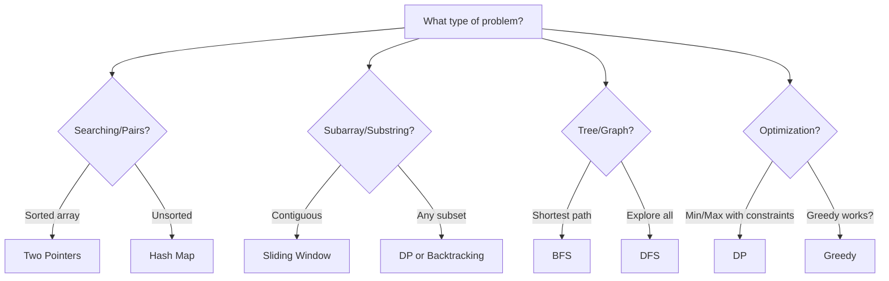

# How to Answer Any Coding Interview Question

> **A structured framework for approaching ANY coding problem in 45 minutes**

---

## The REACTO Framework

REACTO is a battle-tested methodology used by top engineers to systematically solve coding problems. Each letter represents a critical phase:

| Phase | Time | Purpose |
|-------|------|---------|
| **R**epeat | 1-2 min | Clarify the problem |
| **E**xamples | 3-4 min | Work through test cases |
| **A**pproach | 5-7 min | Plan your solution strategy |
| **C**ode | 15-20 min | Implement the solution |
| **T**est | 5-7 min | Verify with examples |
| **O**ptimize | 5-10 min | Discuss improvements |

---

## Phase 1: Repeat (1-2 minutes)

### What to Do

**Restate the problem in your own words** to confirm understanding. This catches misinterpretations early and shows the interviewer you're methodical.

### Key Questions to Ask

```
INPUT CLARIFICATION:
- What is the input type? (array, string, tree, graph?)
- What are the constraints? (size, value ranges?)
- Can the input be empty or null?
- Is the input sorted? Are there duplicates?

OUTPUT CLARIFICATION:
- What exactly should I return? (index, value, boolean, list?)
- What if there's no valid answer? (return -1, empty list, null?)
- Should I return one answer or all answers?
- Does order matter in the output?

EDGE CASES:
- What happens with empty input?
- What about single element?
- What about very large inputs? (will it fit in memory?)
```

### Example Dialogue

**Interviewer**: "Given an array of integers, find two numbers that add up to a target."

**You**: "Let me make sure I understand. I'm given an array of integers and a target sum. I need to find two numbers in the array that add up to exactly the target. Should I return their indices or the values themselves? And if there are multiple valid pairs, should I return all of them or just one? Also, can the same element be used twice?"

---

## Phase 2: Examples (3-4 minutes)

### What to Do

Work through **2-3 examples** including:
1. A normal/happy path case
2. An edge case (empty, single element, all same)
3. A tricky case (duplicates, negative numbers, boundary values)

### Template

```
Example 1 (Normal case):
Input: [2, 7, 11, 15], target = 9
Expected Output: [0, 1]
Reasoning: 2 + 7 = 9, indices are 0 and 1

Example 2 (Edge case):
Input: [], target = 5
Expected Output: [] or null
Reasoning: Empty array has no valid pairs

Example 3 (Tricky case):
Input: [3, 3], target = 6
Expected Output: [0, 1]
Reasoning: Same value at different indices is valid
```

### Why This Matters

- Catches edge cases you might miss
- Builds intuition for the solution
- Shows interviewer your thoroughness
- Creates test cases for later verification

---

## Phase 3: Approach (5-7 minutes)

### The Three-Step Method

```
1. START WITH BRUTE FORCE
   - What's the simplest (possibly slow) solution?
   - State its time/space complexity
   - "The naive approach would be O(n^2) by checking all pairs..."

2. IDENTIFY INEFFICIENCIES
   - What work is being repeated?
   - What data structures could help?
   - "We're recalculating sums repeatedly. A hash map could store..."

3. PROPOSE OPTIMAL SOLUTION
   - Describe the improved approach
   - State its complexity
   - Get interviewer buy-in before coding
```

### Approach Selection Guide



### Complexity Quick Reference

| Pattern | Time | Space |
|---------|------|-------|
| Brute force pairs | O(n^2) | O(1) |
| Hash map lookup | O(n) | O(n) |
| Two pointers (sorted) | O(n) | O(1) |
| Sliding window | O(n) | O(k) |
| Binary search | O(log n) | O(1) |
| DFS/BFS | O(V + E) | O(V) |
| DP | O(n * m) | O(n) or O(n * m) |

### Communicate Your Thinking

**Good**: "I'm thinking of using a hash map because we need O(1) lookups to check if the complement exists. This would give us O(n) time and O(n) space."

**Bad**: *Silent coding for 5 minutes*

---

## Phase 4: Code (15-20 minutes)

### Before You Start Coding

- [ ] Get verbal confirmation: "Does this approach sound good?"
- [ ] Outline the main steps in comments
- [ ] Identify helper functions needed

### Code Structure Template

```python
def solve_problem(input_data: list[int], target: int) -> list[int]:
    """
    Brief description of approach.

    Time: O(n)
    Space: O(n)
    """
    # Step 1: Handle edge cases
    if not input_data:
        return []

    # Step 2: Initialize data structures
    seen = {}

    # Step 3: Main logic
    for i, num in enumerate(input_data):
        complement = target - num
        if complement in seen:
            return [seen[complement], i]
        seen[num] = i

    # Step 4: Handle no-solution case
    return []
```

### Coding Best Practices

| Do | Don't |
|-----|-------|
| Use descriptive variable names | Use single letters (except i, j, k for indices) |
| Add brief comments for complex logic | Over-comment obvious code |
| Handle edge cases first | Assume input is always valid |
| Write clean, readable code | Optimize prematurely |
| Talk through your logic | Code silently |

### When You Get Stuck

1. **Re-read the problem** - Did you miss something?
2. **Walk through an example** - Step by step, by hand
3. **Simplify** - Can you solve a smaller version first?
4. **Think out loud** - The interviewer might give hints
5. **Ask for help** - "I'm stuck on X, could you give me a hint?"

---

## Phase 5: Test (5-7 minutes)

### Testing Strategy

```python
# Test with examples from Phase 2
assert solve_problem([2, 7, 11, 15], 9) == [0, 1]  # Normal case
assert solve_problem([], 5) == []                   # Edge case
assert solve_problem([3, 3], 6) == [0, 1]          # Tricky case

# Add one more: boundary or stress test
assert solve_problem([1], 1) == []                  # Single element, no pair
```

### Trace Through Your Code

Manually trace through one example:

```
Input: [2, 7, 11, 15], target = 9

i=0, num=2:
  complement = 9 - 2 = 7
  7 not in seen
  seen = {2: 0}

i=1, num=7:
  complement = 9 - 7 = 2
  2 is in seen! seen[2] = 0
  Return [0, 1] ✓
```

### Common Bug Categories

| Bug Type | How to Catch |
|----------|--------------|
| Off-by-one errors | Check loop boundaries, indices |
| Empty input | Test with [] or "" |
| Null pointer | Check before accessing properties |
| Integer overflow | Consider large inputs |
| Wrong return type | Verify return statement |

---

## Phase 6: Optimize (5-10 minutes)

### Discussion Points

1. **Current complexity**: "This solution is O(n) time and O(n) space."

2. **Trade-offs**: "We could use O(1) space with two pointers, but that requires sorting first, making it O(n log n) time."

3. **Follow-up questions**:
   - "What if the array is already sorted?" -> Two pointers
   - "What if we need all pairs?" -> Modify to collect all
   - "What if the array is huge and doesn't fit in memory?" -> External sorting, streaming

4. **Real-world considerations**:
   - Parallelization opportunities
   - Memory constraints
   - Streaming vs batch processing

### Optimization Patterns

| Current | Optimization | Trade-off |
|---------|--------------|-----------|
| O(n^2) brute force | Hash map | O(n) space |
| O(n log n) sort + search | Hash map | O(n) space |
| O(n) space DP | Space-optimized DP | Code complexity |
| Recursion | Iteration | Less intuitive |

---

## Time Management Guide

### 45-Minute Interview Breakdown

```
┌─────────────────────────────────────────────────────────────┐
│ 0-2 min  │ REPEAT: Clarify problem                          │
├──────────┼──────────────────────────────────────────────────┤
│ 2-6 min  │ EXAMPLES: Work through 2-3 test cases           │
├──────────┼──────────────────────────────────────────────────┤
│ 6-13 min │ APPROACH: Brute force → Optimize → Get buy-in   │
├──────────┼──────────────────────────────────────────────────┤
│ 13-33 min│ CODE: Implement with clean, commented code      │
├──────────┼──────────────────────────────────────────────────┤
│ 33-40 min│ TEST: Verify with examples, trace through       │
├──────────┼──────────────────────────────────────────────────┤
│ 40-45 min│ OPTIMIZE: Discuss improvements, follow-ups      │
└──────────┴──────────────────────────────────────────────────┘
```

### Time Checkpoints

- **10 min mark**: Should have examples done, starting approach
- **15 min mark**: Should be starting to code
- **30 min mark**: Should have working code, starting tests
- **40 min mark**: Should be discussing optimizations

### If You're Running Behind

| Situation | Action |
|-----------|--------|
| Stuck on approach at 15 min | Ask for a hint |
| Code not compiling at 35 min | Focus on logic, mention syntax issues |
| No time for optimization | Verbally mention improvements |

---

## Red Flags to Avoid

### Things That Hurt Your Evaluation

```
DON'T:
✗ Jump straight into coding without clarifying
✗ Code silently for extended periods
✗ Ignore the interviewer's hints
✗ Give up without asking for help
✗ Write messy, unreadable code
✗ Skip testing your solution
✗ Panic when you make mistakes

DO:
✓ Think out loud throughout
✓ Ask clarifying questions
✓ Acknowledge when you're stuck
✓ Accept hints gracefully
✓ Test your code thoroughly
✓ Stay calm and methodical
✓ Show your problem-solving process
```

---

## Practice Checklist

Before your interview, practice until you can:

- [ ] Explain brute force in under 1 minute
- [ ] Identify the optimal pattern in under 3 minutes
- [ ] Write bug-free code for medium problems in 15 minutes
- [ ] Trace through code without running it
- [ ] Discuss time/space complexity fluently
- [ ] Handle at least 3 edge cases per problem

---

## Quick Reference Card

```
THE REACTO MANTRA:

R - "Let me repeat the problem to make sure I understand..."
E - "Let me work through a few examples..."
A - "The brute force would be O(n^2), but we can do better with..."
C - "I'll start coding now. First, let me handle edge cases..."
T - "Let me trace through with our example: [2, 7, 11, 15]..."
O - "This is O(n) time and space. We could optimize space by..."

WHEN STUCK:
1. Re-read problem
2. Walk through example
3. Simplify the problem
4. Think out loud
5. Ask for a hint

COMPLEXITY TARGETS:
- Easy: O(n) or O(n log n)
- Medium: O(n) to O(n^2)
- Hard: O(n^2) to O(2^n) optimized
```

---

## Google-Specific Tips

### What Interviewers Look For

1. **Problem-solving ability**: Can you break down complex problems?
2. **Coding skills**: Can you write clean, correct code?
3. **Communication**: Can you explain your thinking?
4. **Collaboration**: Can you incorporate feedback?

### Interview Signals

| Strong Signal | Weak Signal |
|---------------|-------------|
| Asks clarifying questions | Makes assumptions |
| Discusses trade-offs | Picks first solution |
| Handles edge cases | Only tests happy path |
| Accepts hints well | Gets defensive |
| Analyzes complexity | Ignores efficiency |

### Common Google Patterns

Most Google coding questions fall into these categories:
- Arrays + Hash Maps (Two Sum variants)
- Trees + Recursion (Traversals, LCA)
- Graphs (BFS/DFS, shortest path)
- Dynamic Programming (Optimization)
- Sliding Window (Substring problems)
- Two Pointers (Sorted array problems)

---

## Sources

- [Fullstack Academy REACTO Method](https://www.fullstackacademy.com/blog/whiteboard-coding-interviews-a-6-step-process-to-solve-any-problem)
- [How to Approach Coding Interview Questions - Interview Cake](https://www.interviewcake.com/article/python/coding-interview-tips)
- [Technical Interview Framework - interviewing.io](https://interviewing.io/guides/hiring-process)
- [Google Coding Interview Tips - Tech Interview Handbook](https://www.techinterviewhandbook.org/coding-interview-techniques/)
