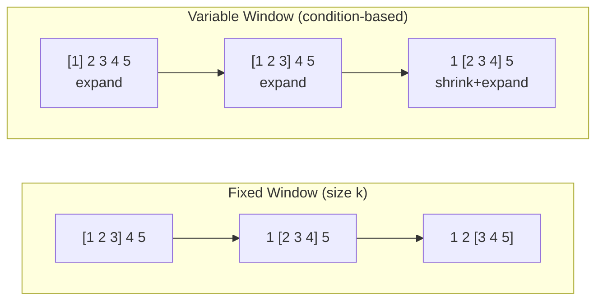

# Arrays, Two Pointers, Stacks & Sliding Window

> **Core techniques that appear in 60%+ of coding interviews**

---

## Arrays Fundamentals

### 5 Key Operations You Must Know

| Operation | Time Complexity | Notes |
|-----------|-----------------|-------|
| **Access by index** | O(1) | `arr[i]` - constant time |
| **Insert at end** | O(1) amortized | `append()` - usually constant |
| **Insert at index** | O(n) | Shifts all elements after |
| **Delete at index** | O(n) | Shifts all elements after |
| **Search (unsorted)** | O(n) | Linear scan required |

### Critical Array Patterns

```python
# 1. In-place reversal
def reverse(arr):
    left, right = 0, len(arr) - 1
    while left < right:
        arr[left], arr[right] = arr[right], arr[left]
        left += 1
        right -= 1

# 2. Prefix sum (for range queries)
prefix = [0]
for num in arr:
    prefix.append(prefix[-1] + num)
# Sum from i to j = prefix[j+1] - prefix[i]

# 3. Dutch National Flag (3-way partition)
def partition(arr, pivot):
    low, mid, high = 0, 0, len(arr) - 1
    while mid <= high:
        if arr[mid] < pivot:
            arr[low], arr[mid] = arr[mid], arr[low]
            low += 1
            mid += 1
        elif arr[mid] > pivot:
            arr[mid], arr[high] = arr[high], arr[mid]
            high -= 1
        else:
            mid += 1
```

---

## Two Pointer Pattern

> **Transforms O(n^2) brute force into O(n) solutions**

### When to Use

| Signal | Example Problem |
|--------|-----------------|
| **Sorted array** + pair/triplet search | Two Sum II, 3Sum |
| **Palindrome** checking | Valid Palindrome |
| **In-place** modification | Remove Duplicates |
| **Merge** two sorted arrays | Merge Sorted Array |
| **Container** problems | Container With Most Water |

**WARNING**: Two pointers on unsorted arrays is a common interview mistake. Either sort first or use a hash map.

### Template: Opposite Direction

```python
def two_pointer_opposite(arr, target):
    """Use when searching for pairs in SORTED array"""
    left, right = 0, len(arr) - 1

    while left < right:
        current_sum = arr[left] + arr[right]

        if current_sum == target:
            return [left, right]  # Found!
        elif current_sum < target:
            left += 1   # Need larger sum
        else:
            right -= 1  # Need smaller sum

    return []  # Not found
```

### Template: Same Direction (Fast/Slow)

```python
def two_pointer_same_direction(arr):
    """Use for in-place modifications or cycle detection"""
    slow = 0  # Write pointer

    for fast in range(len(arr)):  # Read pointer
        if arr[fast] != val_to_remove:
            arr[slow] = arr[fast]
            slow += 1

    return slow  # New length
```

### Classic Problems

| Problem | Key Insight | One-Liner Logic |
|---------|-------------|-----------------|
| **Two Sum II** | Sorted + target | Move pointers based on sum comparison |
| **3Sum** | Fix one, two-pointer rest | Sort first, skip duplicates |
| **Container With Most Water** | Max area | Move the shorter height pointer |
| **Remove Duplicates** | Slow/fast pointers | Slow writes only unique values |
| **Valid Palindrome** | Compare ends | Skip non-alphanumeric, compare |

---

## Sliding Window Pattern

> **Reduces O(n^2) or O(n^3) to O(n) for subarray/substring problems**

### Fixed vs Variable Window



**Decision Guide:**
- **Fixed Window**: "Find max/min sum of k consecutive elements"
- **Variable Window**: "Find smallest/longest subarray with condition X"

### Template: Fixed Window

```python
def fixed_sliding_window(arr, k):
    """Window of exactly k elements"""
    # Build initial window
    window_sum = sum(arr[:k])
    max_sum = window_sum

    # Slide: remove left, add right
    for i in range(k, len(arr)):
        window_sum += arr[i] - arr[i - k]
        max_sum = max(max_sum, window_sum)

    return max_sum
```

### Template: Variable Window

```python
def variable_sliding_window(arr, target):
    """Expand right, shrink left when condition violated"""
    left = 0
    window_sum = 0
    min_length = float('inf')

    for right in range(len(arr)):
        # Expand: add current element
        window_sum += arr[right]

        # Shrink: while condition is met, try smaller window
        while window_sum >= target:
            min_length = min(min_length, right - left + 1)
            window_sum -= arr[left]
            left += 1

    return min_length if min_length != float('inf') else 0
```

### Template: Sliding Window with HashMap

```python
def sliding_window_hashmap(s, k):
    """For substring problems with character frequency"""
    from collections import defaultdict

    char_count = defaultdict(int)
    left = 0
    max_length = 0

    for right in range(len(s)):
        char_count[s[right]] += 1

        # Shrink while window is invalid
        while len(char_count) > k:  # e.g., more than k distinct chars
            char_count[s[left]] -= 1
            if char_count[s[left]] == 0:
                del char_count[s[left]]
            left += 1

        max_length = max(max_length, right - left + 1)

    return max_length
```

### Classic Problems

| Problem | Window Type | Key Insight |
|---------|-------------|-------------|
| **Max Sum Subarray of Size K** | Fixed | Slide and track max |
| **Minimum Size Subarray Sum** | Variable | Shrink when sum >= target |
| **Longest Substring Without Repeating** | Variable | HashSet to track chars |
| **Longest Substring with K Distinct** | Variable | HashMap + count |
| **Minimum Window Substring** | Variable | HashMap + "have" vs "need" |

---

## Stack Essentials

> **LIFO structure - perfect for matching pairs and "next greater" problems**

### When Stack is the Answer

| Pattern | Signal Words | Example |
|---------|--------------|---------|
| **Matching pairs** | "valid", "balanced", "matching" | Valid Parentheses |
| **Next greater/smaller** | "next", "previous", "greater", "smaller" | Next Greater Element |
| **Expression evaluation** | "calculate", "evaluate", "RPN" | Basic Calculator |
| **Backtracking state** | "undo", "history", "path" | Simplify Path |
| **Monotonic sequence** | "increasing/decreasing order" | Daily Temperatures |

### Template: Matching Pairs

```python
def is_valid_parentheses(s):
    """Classic bracket matching"""
    stack = []
    mapping = {')': '(', '}': '{', ']': '['}

    for char in s:
        if char in mapping:  # Closing bracket
            if not stack or stack[-1] != mapping[char]:
                return False
            stack.pop()
        else:  # Opening bracket
            stack.append(char)

    return len(stack) == 0
```

### Template: Monotonic Stack (Decreasing)

```python
def next_greater_element(arr):
    """Find next greater element for each position"""
    n = len(arr)
    result = [-1] * n
    stack = []  # Stores indices

    for i in range(n):
        # Pop elements smaller than current
        while stack and arr[stack[-1]] < arr[i]:
            idx = stack.pop()
            result[idx] = arr[i]  # Current is the next greater
        stack.append(i)

    return result
```

### Template: Monotonic Stack (Increasing)

```python
def daily_temperatures(temperatures):
    """Days until warmer temperature"""
    n = len(temperatures)
    result = [0] * n
    stack = []  # Stores indices of decreasing temps

    for i in range(n):
        while stack and temperatures[i] > temperatures[stack[-1]]:
            prev_idx = stack.pop()
            result[prev_idx] = i - prev_idx
        stack.append(i)

    return result
```

### Classic Problems

| Problem | Stack Type | Key Insight |
|---------|------------|-------------|
| **Valid Parentheses** | Regular | Push open, pop on close |
| **Daily Temperatures** | Monotonic decreasing | Pop when temp rises |
| **Largest Rectangle in Histogram** | Monotonic increasing | Pop when height decreases |
| **Trapping Rain Water** | Monotonic or two-pointer | Stack tracks "pits" |
| **Evaluate RPN** | Regular | Pop operands, push result |

---

## Quick Problem Matrix

| Problem | Pattern | Key Insight |
|---------|---------|-------------|
| **Two Sum II** | Two Pointers | Sorted array, move based on sum |
| **3Sum** | Two Pointers | Fix one, two-pointer for rest |
| **Container With Most Water** | Two Pointers | Move shorter height pointer |
| **Remove Duplicates from Sorted Array** | Two Pointers | Slow/fast pointer in-place |
| **Maximum Subarray Sum (size k)** | Fixed Window | Slide, add right, remove left |
| **Minimum Size Subarray Sum** | Variable Window | Expand right, shrink left |
| **Longest Substring Without Repeating** | Variable Window + HashSet | Shrink on duplicate |
| **Valid Parentheses** | Stack | Push open, match on close |
| **Daily Temperatures** | Monotonic Stack | Pop when find warmer day |
| **Largest Rectangle in Histogram** | Monotonic Stack | Pop on smaller height |

---

## Google Interview Applications

### How These Patterns Appear at Google

1. **Two Pointers at Google**
   - Often combined with binary search for optimization
   - "Find pairs/triplets with specific sum" is a classic Google phone screen question
   - Watch for: sorted array inputs signal two-pointer approach

2. **Sliding Window at Google**
   - Google loves **substring problems** with character frequency conditions
   - Real-world connection: network packet analysis, log processing
   - Common variation: "Find minimum window containing all characters from target"

3. **Stack at Google**
   - **Expression parsing** (think Google Sheets formulas)
   - **Nested structure validation** (HTML/XML parsing)
   - **Histogram problems** are Google favorites (Largest Rectangle)

### Google-Style Problem Combinations

| Combination | Example |
|-------------|---------|
| Two Pointers + Binary Search | "Find pair with sum closest to target" |
| Sliding Window + HashMap | "Longest substring with at most K distinct characters" |
| Stack + Arrays | "Trapping Rain Water" (can solve with stack or two pointers) |
| Monotonic Stack + DP | "Sum of Subarray Minimums" |

### Interview Tips from Top Sources

1. **Start with brute force** - Explain why O(n^2) or O(n^3) is inefficient
2. **Identify the pattern signal** - Sorted array? Use two pointers. Subarray/substring? Try sliding window. Matching or ordering? Consider stack.
3. **Handle edge cases explicitly**:
   - Empty array
   - Single element
   - All same elements
   - Window size larger than array

---

## Quick Reference Card

```
PATTERN SELECTION FLOWCHART:

Is input sorted or needs pairs/triplets?
    YES -> Two Pointers (opposite direction)

Need to modify array in-place?
    YES -> Two Pointers (same direction)

Looking for contiguous subarray/substring with constraint?
    YES -> Sliding Window
    - Known size k? -> Fixed Window
    - Find min/max length? -> Variable Window

Need matching pairs or "next greater/smaller"?
    YES -> Stack (possibly monotonic)

Need to evaluate expressions or track history?
    YES -> Stack
```

---

## Sources

- [Two Pointers Technique - GeeksforGeeks](https://www.geeksforgeeks.org/dsa/two-pointers-technique/)
- [LeetCode Two Pointers Problem List](https://leetcode.com/problem-list/two-pointers/)
- [Master in Two Pointer - LeetCode Discussion](https://leetcode.com/discuss/study-guide/1905453/master-in-two-pointer)
- [The Complete Two Pointers Guide](https://leetcopilot.dev/leetcode-pattern/two-pointers/guide)
- [Top Sliding Window Problems for Interviews - GeeksforGeeks](https://www.geeksforgeeks.org/dsa/top-problems-on-sliding-window-technique-for-interviews/)
- [LeetCode Sliding Window Problem List](https://leetcode.com/problem-list/sliding-window/)
- [10 Sliding Window Patterns for Coding Interviews - LeetCode](https://leetcode.com/discuss/post/7344963/10-sliding-window-patterns-for-coding-in-pokf/)
- [Variable Length Sliding Window - Hello Interview](https://www.hellointerview.com/learn/code/sliding-window/variable-length)
- [Sliding Window Interview Questions & Tips](https://interviewing.io/sliding-window-interview-questions)
