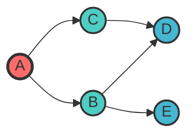
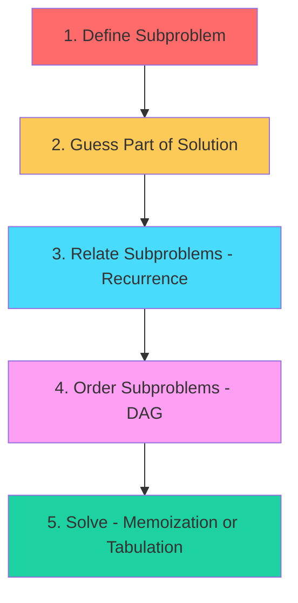
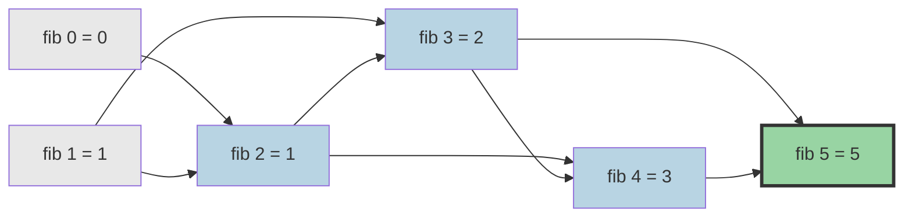

# Backtracking, Graphs & Dynamic Programming

> **Advanced techniques for complex problem solving**

---

## Backtracking

### Pattern Recognition

**When to use backtracking:**
- Generate all possible solutions (permutations, combinations, subsets)
- Constraint satisfaction problems (N-Queens, Sudoku)
- Path finding with specific conditions
- Problems with "all" or "every" in the description

**Key insight:** Backtracking = DFS + pruning invalid paths early

### The Template

::: code-group

```python [Python]
def backtrack(candidates, path, result):
    if is_solution(path):
        result.append(path[:])
        return

    for candidate in candidates:
        if is_valid(candidate, path):
            path.append(candidate)
            backtrack(candidates, path, result)
            path.pop()
```

```java [Java]
void backtrack(int[] candidates, List<Integer> path, List<List<Integer>> result) {
    if (isSolution(path)) {
        result.add(new ArrayList<>(path));
        return;
    }
    for (int candidate : candidates) {
        if (isValid(candidate, path)) {
            path.add(candidate);
            backtrack(candidates, path, result);
            path.remove(path.size() - 1);
        }
    }
}
```

:::

::: info Complexity: Time O(2^n) or O(n!) · Space O(n)
- **Time:** Depends on problem - O(2^n) for subsets, O(n!) for permutations
- **Space:** Recursion depth and path storage proportional to input size
:::

### Classic Problems

| Problem | Key Insight | Time Complexity |
|---------|-------------|-----------------|
| **Permutations** | Use visited set, order matters | O(n! * n) |
| **Combinations** | Use start index, avoid duplicates | O(C(n,k) * k) |
| **Subsets** | Include/exclude each element | O(2^n * n) |
| **N-Queens** | Track columns, diagonals with sets | O(n!) |
| **Sudoku** | Constraint propagation + backtrack | O(9^empty_cells) |

### Permutations Template

::: code-group

```python [Python]
def permute(nums):
    result = []

    def backtrack(path, used):
        if len(path) == len(nums):
            result.append(path[:]); return
        for i in range(len(nums)):
            if used[i]: continue
            used[i] = True; path.append(nums[i])
            backtrack(path, used)
            path.pop(); used[i] = False

    backtrack([], [False] * len(nums))
    return result
```

```java [Java]
List<List<Integer>> permute(int[] nums) {
    List<List<Integer>> result = new ArrayList<>();
    permuteHelper(nums, new ArrayList<>(), new boolean[nums.length], result);
    return result;
}
void permuteHelper(int[] nums, List<Integer> path, boolean[] used, List<List<Integer>> result) {
    if (path.size() == nums.length) { result.add(new ArrayList<>(path)); return; }
    for (int i = 0; i < nums.length; i++) {
        if (used[i]) continue;
        used[i] = true; path.add(nums[i]);
        permuteHelper(nums, path, used, result);
        path.remove(path.size() - 1); used[i] = false;
    }
}
```

:::

::: info Complexity: Time O(n! * n) · Space O(n)
- **Time:** n! permutations, each taking O(n) to copy into result
- **Space:** Recursion depth is n; path stores n elements
:::

### Combinations Template

::: code-group

```python [Python]
def combine(n, k):
    result = []

    def backtrack(start, path):
        if len(path) == k:
            result.append(path[:]); return
        for i in range(start, n - (k - len(path)) + 2):
            path.append(i)
            backtrack(i + 1, path)
            path.pop()

    backtrack(1, [])
    return result
```

```java [Java]
List<List<Integer>> combine(int n, int k) {
    List<List<Integer>> result = new ArrayList<>();
    combineHelper(n, k, 1, new ArrayList<>(), result);
    return result;
}
void combineHelper(int n, int k, int start, List<Integer> path, List<List<Integer>> result) {
    if (path.size() == k) { result.add(new ArrayList<>(path)); return; }
    for (int i = start; i <= n - (k - path.size()) + 1; i++) {
        path.add(i); combineHelper(n, k, i + 1, path, result); path.remove(path.size() - 1);
    }
}
```

:::

::: info Complexity: Time O(C(n,k) * k) · Space O(k)
- **Time:** Generate C(n,k) combinations, each of length k
- **Space:** Recursion depth and path size bounded by k
:::

### Subsets Template

::: code-group

```python [Python]
def subsets(nums):
    result = []

    def backtrack(start, path):
        result.append(path[:])
        for i in range(start, len(nums)):
            path.append(nums[i])
            backtrack(i + 1, path)
            path.pop()

    backtrack(0, [])
    return result
```

```java [Java]
List<List<Integer>> subsets(int[] nums) {
    List<List<Integer>> result = new ArrayList<>();
    subsetsHelper(nums, 0, new ArrayList<>(), result);
    return result;
}
void subsetsHelper(int[] nums, int start, List<Integer> path, List<List<Integer>> result) {
    result.add(new ArrayList<>(path));
    for (int i = start; i < nums.length; i++) {
        path.add(nums[i]); subsetsHelper(nums, i + 1, path, result); path.remove(path.size() - 1);
    }
}
```

:::

::: info Complexity: Time O(n * 2^n) · Space O(n)
- **Time:** 2^n subsets, each taking O(n) to copy into result
- **Space:** Recursion depth is n; path stores up to n elements
:::

---

## Graph Fundamentals

### Representations

| Representation | Space | Add Edge | Check Edge | Best For |
|----------------|-------|----------|------------|----------|
| **Adjacency List** | O(V + E) | O(1) | O(degree) | Sparse graphs, traversal |
| **Adjacency Matrix** | O(V^2) | O(1) | O(1) | Dense graphs, quick edge lookup |
| **Edge List** | O(E) | O(1) | O(E) | Kruskal's MST, simple storage |

```python
# Adjacency List (most common in interviews)
graph = {
    'A': ['B', 'C'],
    'B': ['A', 'D'],
    'C': ['A', 'D'],
    'D': ['B', 'C']
}

# Using defaultdict for dynamic graphs
from collections import defaultdict
graph = defaultdict(list)
for u, v in edges:
    graph[u].append(v)
    graph[v].append(u)  # For undirected
```

### Graph Traversal Visualization



**DFS Order:** A -> B -> D -> C -> E (goes deep first)
**BFS Order:** A -> B -> C -> D -> E (level by level)

### DFS Template (Recursive)

::: code-group

```python [Python]
def dfs(graph, node, visited):
    if node in visited: return
    visited.add(node)
    # Process node here
    for neighbor in graph[node]:
        dfs(graph, neighbor, visited)

visited = set()
dfs(graph, start_node, visited)
```

```java [Java]
void dfs(Map<Integer, List<Integer>> graph, int node, Set<Integer> visited) {
    if (!visited.add(node)) return;
    // Process node here
    for (int neighbor : graph.getOrDefault(node, Collections.emptyList()))
        dfs(graph, neighbor, visited);
}
```

:::

::: info Complexity: Time O(V + E) · Space O(V)
- **Time:** Visit each vertex and edge once
- **Space:** Visited set stores V vertices; recursion depth up to V
:::

### DFS Template (Iterative)

::: code-group

```python [Python]
def dfs_iterative(graph, start):
    visited, stack = set(), [start]
    while stack:
        node = stack.pop()
        if node in visited: continue
        visited.add(node)
        # Process node here
        for neighbor in graph[node]:
            if neighbor not in visited: stack.append(neighbor)
    return visited
```

```java [Java]
Set<Integer> dfsIterative(Map<Integer, List<Integer>> graph, int start) {
    Set<Integer> visited = new HashSet<>();
    Deque<Integer> stack = new ArrayDeque<>(); stack.push(start);
    while (!stack.isEmpty()) {
        int node = stack.pop();
        if (!visited.add(node)) continue;
        // Process node here
        for (int nb : graph.getOrDefault(node, Collections.emptyList()))
            if (!visited.contains(nb)) stack.push(nb);
    }
    return visited;
}
```

:::

::: info Complexity: Time O(V + E) · Space O(V)
- **Time:** Visit each vertex and edge once
- **Space:** Stack and visited set each store up to V vertices
:::

### BFS Template

::: code-group

```python [Python]
from collections import deque

def bfs(graph, start):
    visited, queue = {start}, deque([start])
    while queue:
        node = queue.popleft()
        # Process node here
        for neighbor in graph[node]:
            if neighbor not in visited:
                visited.add(neighbor); queue.append(neighbor)
    return visited
```

```java [Java]
Set<Integer> bfs(Map<Integer, List<Integer>> graph, int start) {
    Set<Integer> visited = new HashSet<>(); visited.add(start);
    Deque<Integer> queue = new ArrayDeque<>(); queue.offer(start);
    while (!queue.isEmpty()) {
        int node = queue.poll();
        // Process node here
        for (int nb : graph.getOrDefault(node, Collections.emptyList()))
            if (visited.add(nb)) queue.offer(nb);
    }
    return visited;
}
```

:::

::: info Complexity: Time O(V + E) · Space O(V)
- **Time:** Visit each vertex and edge once
- **Space:** Queue and visited set each store up to V vertices
:::

### BFS for Shortest Path (Unweighted)

::: code-group

```python [Python]
from collections import deque

def shortest_path(graph, start, target):
    if start == target: return 0
    visited, queue = {start}, deque([(start, 0)])
    while queue:
        node, dist = queue.popleft()
        for neighbor in graph[node]:
            if neighbor == target: return dist + 1
            if neighbor not in visited:
                visited.add(neighbor); queue.append((neighbor, dist + 1))
    return -1
```

```java [Java]
int shortestPath(Map<Integer, List<Integer>> graph, int start, int target) {
    if (start == target) return 0;
    Set<Integer> visited = new HashSet<>(); visited.add(start);
    Deque<int[]> queue = new ArrayDeque<>(); queue.offer(new int[]{start, 0});
    while (!queue.isEmpty()) {
        int[] cur = queue.poll(); int node = cur[0], dist = cur[1];
        for (int nb : graph.getOrDefault(node, Collections.emptyList())) {
            if (nb == target) return dist + 1;
            if (visited.add(nb)) queue.offer(new int[]{nb, dist + 1});
        }
    }
    return -1;
}
```

:::

::: info Complexity: Time O(V + E) · Space O(V)
- **Time:** BFS explores nodes level by level until target found
- **Space:** Queue stores frontier nodes; visited set stores explored nodes
:::

### 2D Grid Traversal (Common Interview Pattern)

::: code-group

```python [Python]
def bfs_grid(grid, start_row, start_col):
    rows, cols = len(grid), len(grid[0])
    directions = [(0, 1), (0, -1), (1, 0), (-1, 0)]
    visited = {(start_row, start_col)}
    queue = deque([(start_row, start_col, 0)])
    while queue:
        r, c, dist = queue.popleft()
        for dr, dc in directions:
            nr, nc = r + dr, c + dc
            if 0 <= nr < rows and 0 <= nc < cols:
                if (nr, nc) not in visited and grid[nr][nc] != '#':
                    visited.add((nr, nc)); queue.append((nr, nc, dist + 1))
    return visited
```

```java [Java]
void bfsGrid(char[][] grid, int startR, int startC) {
    int rows = grid.length, cols = grid[0].length;
    int[][] dirs = {{0,1},{0,-1},{1,0},{-1,0}};
    boolean[][] visited = new boolean[rows][cols]; visited[startR][startC] = true;
    Deque<int[]> queue = new ArrayDeque<>(); queue.offer(new int[]{startR, startC, 0});
    while (!queue.isEmpty()) {
        int[] cur = queue.poll(); int r = cur[0], c = cur[1], dist = cur[2];
        for (int[] d : dirs) {
            int nr = r + d[0], nc = c + d[1];
            if (nr >= 0 && nr < rows && nc >= 0 && nc < cols
                    && !visited[nr][nc] && grid[nr][nc] != '#') {
                visited[nr][nc] = true; queue.offer(new int[]{nr, nc, dist + 1});
            }
        }
    }
}
```

:::

::: info Complexity: Time O(m * n) · Space O(m * n)
- **Time:** Visit each cell at most once
- **Space:** Visited set can store all m*n cells; queue stores frontier
:::

### Topological Sort (Kahn's Algorithm)

**Use when:** Dependencies, course prerequisites, build order

::: code-group

```python [Python]
from collections import deque, defaultdict

def topological_sort(num_nodes, edges):
    graph = defaultdict(list)
    in_degree = [0] * num_nodes

    for u, v in edges:
        graph[u].append(v); in_degree[v] += 1

    queue = deque([i for i in range(num_nodes) if in_degree[i] == 0])
    result = []

    while queue:
        node = queue.popleft(); result.append(node)
        for neighbor in graph[node]:
            in_degree[neighbor] -= 1
            if in_degree[neighbor] == 0: queue.append(neighbor)

    return result if len(result) == num_nodes else []
```

```java [Java]
int[] topologicalSort(int numNodes, int[][] edges) {
    List<List<Integer>> graph = new ArrayList<>();
    int[] inDegree = new int[numNodes];
    for (int i = 0; i < numNodes; i++) graph.add(new ArrayList<>());
    for (int[] e : edges) { graph.get(e[0]).add(e[1]); inDegree[e[1]]++; }
    Deque<Integer> queue = new ArrayDeque<>();
    for (int i = 0; i < numNodes; i++) if (inDegree[i] == 0) queue.offer(i);
    int[] result = new int[numNodes]; int idx = 0;
    while (!queue.isEmpty()) {
        int node = queue.poll(); result[idx++] = node;
        for (int nb : graph.get(node)) if (--inDegree[nb] == 0) queue.offer(nb);
    }
    return idx == numNodes ? result : new int[]{};
}
```

:::

::: info Complexity: Time O(V + E) · Space O(V + E)
- **Time:** Process each vertex and edge once
- **Space:** Graph adjacency list and in-degree array store V + E
:::

### Cycle Detection

::: code-group

```python [Python]
# For Directed Graph (using colors)
def has_cycle_directed(graph, num_nodes):
    WHITE, GRAY, BLACK = 0, 1, 2
    color = [WHITE] * num_nodes

    def dfs(node):
        color[node] = GRAY
        for neighbor in graph[node]:
            if color[neighbor] == GRAY: return True
            if color[neighbor] == WHITE and dfs(neighbor): return True
        color[node] = BLACK
        return False

    return any(color[i] == WHITE and dfs(i) for i in range(num_nodes))

# For Undirected Graph (using parent)
def has_cycle_undirected(graph, num_nodes):
    visited = [False] * num_nodes

    def dfs(node, parent):
        visited[node] = True
        for neighbor in graph[node]:
            if not visited[neighbor]:
                if dfs(neighbor, node): return True
            elif neighbor != parent: return True
        return False

    return any(not visited[i] and dfs(i, -1) for i in range(num_nodes))
```

```java [Java]
// Directed Graph cycle detection (coloring)
boolean hasCycleDirected(List<List<Integer>> graph, int n) {
    int[] color = new int[n]; // 0=WHITE, 1=GRAY, 2=BLACK
    for (int i = 0; i < n; i++) if (color[i] == 0 && dfsCycle(graph, i, color)) return true;
    return false;
}
boolean dfsCycle(List<List<Integer>> graph, int node, int[] color) {
    color[node] = 1;
    for (int nb : graph.get(node)) {
        if (color[nb] == 1) return true;
        if (color[nb] == 0 && dfsCycle(graph, nb, color)) return true;
    }
    color[node] = 2; return false;
}

// Undirected Graph cycle detection
boolean hasCycleUndirected(List<List<Integer>> graph, int n) {
    boolean[] visited = new boolean[n];
    for (int i = 0; i < n; i++) if (!visited[i] && dfsUndirected(graph, i, -1, visited)) return true;
    return false;
}
boolean dfsUndirected(List<List<Integer>> graph, int node, int parent, boolean[] visited) {
    visited[node] = true;
    for (int nb : graph.get(node)) {
        if (!visited[nb]) { if (dfsUndirected(graph, nb, node, visited)) return true; }
        else if (nb != parent) return true;
    }
    return false;
}
```

:::

::: info Complexity: Time O(V + E) · Space O(V)
- **Time:** DFS visits each vertex and edge once
- **Space:** Color/visited array stores V vertices; recursion depth up to V
:::

### Dijkstra's Algorithm (Weighted Shortest Path)

::: code-group

```python [Python]
import heapq

def dijkstra(graph, start):
    # graph[u] = [(v, weight), ...]
    distances = {start: 0}
    heap = [(0, start)]

    while heap:
        dist, node = heapq.heappop(heap)
        if dist > distances.get(node, float('inf')): continue
        for neighbor, weight in graph[node]:
            new_dist = dist + weight
            if new_dist < distances.get(neighbor, float('inf')):
                distances[neighbor] = new_dist
                heapq.heappush(heap, (new_dist, neighbor))

    return distances
```

```java [Java]
int[] dijkstra(List<int[]>[] graph, int start, int n) {
    int[] dist = new int[n]; Arrays.fill(dist, Integer.MAX_VALUE); dist[start] = 0;
    PriorityQueue<int[]> heap = new PriorityQueue<>(Comparator.comparingInt(a -> a[0]));
    heap.offer(new int[]{0, start});
    while (!heap.isEmpty()) {
        int[] cur = heap.poll(); int d = cur[0], u = cur[1];
        if (d > dist[u]) continue;
        for (int[] edge : graph[u]) {
            int v = edge[0], w = edge[1];
            if (dist[u] + w < dist[v]) { dist[v] = dist[u] + w; heap.offer(new int[]{dist[v], v}); }
        }
    }
    return dist;
}
```

:::

::: info Complexity: Time O((V + E) log V) · Space O(V)
- **Time:** Each edge relaxation uses heap operations O(log V)
- **Space:** Distance array and heap store up to V vertices
:::

### Union-Find (Disjoint Set Union)

**Use when:** Connected components, detecting cycles in undirected graphs

::: code-group

```python [Python]
class UnionFind:
    def __init__(self, n):
        self.parent = list(range(n))
        self.rank = [0] * n

    def find(self, x):
        if self.parent[x] != x:
            self.parent[x] = self.find(self.parent[x])
        return self.parent[x]

    def union(self, x, y):
        px, py = self.find(x), self.find(y)
        if px == py: return False
        if self.rank[px] < self.rank[py]: px, py = py, px
        self.parent[py] = px
        if self.rank[px] == self.rank[py]: self.rank[px] += 1
        return True
```

```java [Java]
class UnionFind {
    int[] parent, rank;
    UnionFind(int n) {
        parent = new int[n]; rank = new int[n];
        for (int i = 0; i < n; i++) parent[i] = i;
    }
    int find(int x) {
        if (parent[x] != x) parent[x] = find(parent[x]);
        return parent[x];
    }
    boolean union(int x, int y) {
        int px = find(x), py = find(y);
        if (px == py) return false;
        if (rank[px] < rank[py]) { int t = px; px = py; py = t; }
        parent[py] = px;
        if (rank[px] == rank[py]) rank[px]++;
        return true;
    }
}
```

:::

::: info Complexity: Time O(alpha(n)) per operation · Space O(n)
- **Time:** Near-constant with path compression and union by rank; alpha is inverse Ackermann
- **Space:** Parent and rank arrays store n elements
:::

---

## Dynamic Programming

### Pattern Recognition

**DP is likely needed when you see:**
- "Maximum/minimum" result
- "Count all ways"
- "Is it possible?"
- "Longest/shortest" sequence
- Optimal substructure + overlapping subproblems

### The 5-Step Framework



1. **Define subproblem:** What state captures progress toward solution?
2. **Guess:** What choice do we make at each step?
3. **Recurrence:** How do subproblems relate? Write the formula.
4. **Order:** What order ensures subproblems are solved first?
5. **Solve:** Implement with memoization (top-down) or tabulation (bottom-up).

### DP State Transition (Fibonacci Example)



### Top-Down vs Bottom-Up

::: code-group

```python [Python]
from functools import lru_cache

# Top-down (Memoization)
@lru_cache(maxsize=None)
def fib(n):
    if n <= 1: return n
    return fib(n - 1) + fib(n - 2)

# Bottom-up (Tabulation)
def fib_bu(n):
    if n <= 1: return n
    dp = [0, 1]
    for i in range(2, n + 1): dp.append(dp[-1] + dp[-2])
    return dp[n]

# Space-optimized
def fib_optimized(n):
    if n <= 1: return n
    prev, curr = 0, 1
    for _ in range(2, n + 1): prev, curr = curr, prev + curr
    return curr
```

```java [Java]
// Top-down (memoization)
Map<Integer, Integer> memo = new HashMap<>();
int fib(int n) {
    if (n <= 1) return n;
    if (memo.containsKey(n)) return memo.get(n);
    int result = fib(n - 1) + fib(n - 2);
    memo.put(n, result); return result;
}

// Bottom-up (tabulation)
int fibBU(int n) {
    if (n <= 1) return n;
    int[] dp = new int[n + 1]; dp[1] = 1;
    for (int i = 2; i <= n; i++) dp[i] = dp[i-1] + dp[i-2];
    return dp[n];
}

// Space-optimized
int fibOptimized(int n) {
    if (n <= 1) return n;
    int prev = 0, curr = 1;
    for (int i = 2; i <= n; i++) { int next = prev + curr; prev = curr; curr = next; }
    return curr;
}
```

:::

::: info Complexity: Time O(n) · Space O(1) to O(n)
- **Time:** Single pass computing each value once
- **Space:** O(n) for table; O(1) when space-optimized with two variables
:::

### Common DP Patterns

#### 1. Linear DP (1D)

**Examples:** Climbing Stairs, House Robber, Maximum Subarray

::: code-group

```python [Python]
# House Robber: Can't rob adjacent houses
def rob(nums):
    prev2, prev1 = 0, 0
    for num in nums:
        curr = max(prev1, prev2 + num)
        prev2, prev1 = prev1, curr
    return prev1
```

```java [Java]
int rob(int[] nums) {
    int prev2 = 0, prev1 = 0;
    for (int num : nums) { int curr = Math.max(prev1, prev2 + num); prev2 = prev1; prev1 = curr; }
    return prev1;
}
```

:::

::: info Complexity: Time O(n) · Space O(n) or O(1)
- **Time:** Single pass through the array
- **Space:** O(n) for dp array; can optimize to O(1) with two variables
:::

#### 2. Grid DP (2D)

**Examples:** Unique Paths, Minimum Path Sum, Edit Distance

::: code-group

```python [Python]
# Minimum Path Sum
def min_path_sum(grid):
    m, n = len(grid), len(grid[0])
    dp = [[0] * n for _ in range(m)]
    dp[0][0] = grid[0][0]
    for i in range(1, m): dp[i][0] = dp[i-1][0] + grid[i][0]
    for j in range(1, n): dp[0][j] = dp[0][j-1] + grid[0][j]
    for i in range(1, m):
        for j in range(1, n):
            dp[i][j] = min(dp[i-1][j], dp[i][j-1]) + grid[i][j]
    return dp[m-1][n-1]
```

```java [Java]
int minPathSum(int[][] grid) {
    int m = grid.length, n = grid[0].length;
    int[][] dp = new int[m][n]; dp[0][0] = grid[0][0];
    for (int i = 1; i < m; i++) dp[i][0] = dp[i-1][0] + grid[i][0];
    for (int j = 1; j < n; j++) dp[0][j] = dp[0][j-1] + grid[0][j];
    for (int i = 1; i < m; i++)
        for (int j = 1; j < n; j++)
            dp[i][j] = Math.min(dp[i-1][j], dp[i][j-1]) + grid[i][j];
    return dp[m-1][n-1];
}
```

:::

::: info Complexity: Time O(m * n) · Space O(m * n) or O(n)
- **Time:** Visit each cell once
- **Space:** O(m*n) for 2D dp; can optimize to O(n) using single row
:::

#### 3. Knapsack Pattern

**0/1 Knapsack:** Each item used once

::: code-group

```python [Python]
def knapsack_01(weights, values, capacity):
    n = len(weights)
    dp = [0] * (capacity + 1)
    for i in range(n):
        for w in range(capacity, weights[i] - 1, -1):
            dp[w] = max(dp[w], dp[w - weights[i]] + values[i])
    return dp[capacity]
```

```java [Java]
int knapsack01(int[] weights, int[] values, int capacity) {
    int[] dp = new int[capacity + 1];
    for (int i = 0; i < weights.length; i++)
        for (int w = capacity; w >= weights[i]; w--)
            dp[w] = Math.max(dp[w], dp[w - weights[i]] + values[i]);
    return dp[capacity];
}
```

:::

::: info Complexity: Time O(n * W) · Space O(n * W) or O(W)
- **Time:** Fill n*W table entries
- **Space:** O(n*W) for 2D dp; can optimize to O(W) using 1D array
:::

**Unbounded Knapsack:** Items can be reused

::: code-group

```python [Python]
def knapsack_unbounded(weights, values, capacity):
    dp = [0] * (capacity + 1)
    for w in range(1, capacity + 1):
        for i in range(len(weights)):
            if weights[i] <= w:
                dp[w] = max(dp[w], dp[w - weights[i]] + values[i])
    return dp[capacity]
```

```java [Java]
int knapsackUnbounded(int[] weights, int[] values, int capacity) {
    int[] dp = new int[capacity + 1];
    for (int w = 1; w <= capacity; w++)
        for (int i = 0; i < weights.length; i++)
            if (weights[i] <= w) dp[w] = Math.max(dp[w], dp[w - weights[i]] + values[i]);
    return dp[capacity];
}
```

:::

::: info Complexity: Time O(n * W) · Space O(W)
- **Time:** For each capacity, consider all n items
- **Space:** Single 1D array of size W+1
:::

#### 4. Longest Common Subsequence (LCS)

::: code-group

```python [Python]
def lcs(text1, text2):
    m, n = len(text1), len(text2)
    dp = [[0] * (n + 1) for _ in range(m + 1)]
    for i in range(1, m + 1):
        for j in range(1, n + 1):
            dp[i][j] = dp[i-1][j-1] + 1 if text1[i-1] == text2[j-1] else max(dp[i-1][j], dp[i][j-1])
    return dp[m][n]
```

```java [Java]
int lcs(String text1, String text2) {
    int m = text1.length(), n = text2.length();
    int[][] dp = new int[m + 1][n + 1];
    for (int i = 1; i <= m; i++)
        for (int j = 1; j <= n; j++)
            dp[i][j] = text1.charAt(i-1) == text2.charAt(j-1)
                ? dp[i-1][j-1] + 1 : Math.max(dp[i-1][j], dp[i][j-1]);
    return dp[m][n];
}
```

:::

::: info Complexity: Time O(m * n) · Space O(m * n) or O(n)
- **Time:** Fill m*n table comparing each character pair
- **Space:** O(m*n) for 2D table; can optimize to O(n) with two rows
:::

#### 5. Longest Increasing Subsequence (LIS)

::: code-group

```python [Python]
# O(n^2) solution
def lis(nums):
    dp = [1] * len(nums)
    for i in range(1, len(nums)):
        for j in range(i):
            if nums[j] < nums[i]: dp[i] = max(dp[i], dp[j] + 1)
    return max(dp) if nums else 0

# O(n log n) with binary search
import bisect
def lis_optimized(nums):
    tails = []
    for num in nums:
        pos = bisect.bisect_left(tails, num)
        if pos == len(tails): tails.append(num)
        else: tails[pos] = num
    return len(tails)
```

```java [Java]
// O(n^2) solution
int lis(int[] nums) {
    int[] dp = new int[nums.length]; Arrays.fill(dp, 1);
    int max = 1;
    for (int i = 1; i < nums.length; i++) {
        for (int j = 0; j < i; j++) if (nums[j] < nums[i]) dp[i] = Math.max(dp[i], dp[j] + 1);
        max = Math.max(max, dp[i]);
    }
    return max;
}

// O(n log n) with binary search
int lisOptimized(int[] nums) {
    List<Integer> tails = new ArrayList<>();
    for (int num : nums) {
        int lo = 0, hi = tails.size();
        while (lo < hi) { int mid = lo + (hi-lo)/2; if (tails.get(mid) < num) lo = mid+1; else hi = mid; }
        if (lo == tails.size()) tails.add(num); else tails.set(lo, num);
    }
    return tails.size();
}
```

:::

::: info Complexity: Time O(n^2) or O(n log n) · Space O(n)
- **Time:** O(n^2) basic DP; O(n log n) with binary search optimization
- **Space:** O(n) for dp/tails array
:::

#### 6. Interval DP

**Examples:** Matrix Chain Multiplication, Burst Balloons

::: code-group

```python [Python]
# Burst Balloons
def max_coins(nums):
    nums = [1] + nums + [1]
    n = len(nums)
    dp = [[0] * n for _ in range(n)]
    for length in range(2, n):
        for left in range(n - length):
            right = left + length
            for k in range(left + 1, right):
                dp[left][right] = max(dp[left][right],
                    dp[left][k] + dp[k][right] + nums[left] * nums[k] * nums[right])
    return dp[0][n-1]
```

```java [Java]
int maxCoins(int[] nums) {
    int[] arr = new int[nums.length + 2];
    arr[0] = arr[arr.length - 1] = 1;
    for (int i = 0; i < nums.length; i++) arr[i + 1] = nums[i];
    int n = arr.length;
    int[][] dp = new int[n][n];
    for (int len = 2; len < n; len++)
        for (int left = 0; left < n - len; left++) {
            int right = left + len;
            for (int k = left + 1; k < right; k++)
                dp[left][right] = Math.max(dp[left][right],
                    dp[left][k] + dp[k][right] + arr[left] * arr[k] * arr[right]);
        }
    return dp[0][n - 1];
}
```

:::

::: info Complexity: Time O(n^3) · Space O(n^2)
- **Time:** Three nested loops over interval endpoints and split points
- **Space:** 2D dp table stores n^2 interval results
:::

#### 7. Tree DP

::: code-group

```python [Python]
# Maximum Path Sum in Binary Tree
def max_path_sum(root):
    max_sum = [float('-inf')]

    def dfs(node):
        if not node: return 0
        left = max(dfs(node.left), 0)
        right = max(dfs(node.right), 0)
        max_sum[0] = max(max_sum[0], left + right + node.val)
        return max(left, right) + node.val

    dfs(root)
    return max_sum[0]
```

```java [Java]
int maxPathSum(TreeNode root) {
    int[] maxSum = {Integer.MIN_VALUE};
    maxPathDFS(root, maxSum);
    return maxSum[0];
}
int maxPathDFS(TreeNode node, int[] maxSum) {
    if (node == null) return 0;
    int left = Math.max(maxPathDFS(node.left, maxSum), 0);
    int right = Math.max(maxPathDFS(node.right, maxSum), 0);
    maxSum[0] = Math.max(maxSum[0], left + right + node.val);
    return Math.max(left, right) + node.val;
}
```

:::

::: info Complexity: Time O(n) · Space O(h)
- **Time:** Visit each node exactly once
- **Space:** Recursion depth is O(h) where h is tree height
:::

### DP Problem Recognition Cheat Sheet

| Keyword in Problem | Likely Pattern |
|--------------------|----------------|
| "Minimum/maximum number of..." | Linear DP or BFS |
| "Count ways to..." | Linear DP (often Fibonacci-like) |
| "Can we achieve/reach..." | Knapsack or BFS |
| "Longest/shortest sequence..." | LIS/LCS variant |
| "Partition into groups..." | Knapsack variant |
| "String matching/edit..." | 2D DP (LCS family) |
| "Grid traversal optimal..." | 2D Grid DP |
| "Parenthesization/split..." | Interval DP |

---

## Interview Applications

### Graph Problems Frequently Asked

1. **Number of Islands** - BFS/DFS on 2D grid
2. **Course Schedule** - Topological sort + cycle detection
3. **Word Ladder** - BFS for shortest transformation
4. **Clone Graph** - DFS/BFS with hash map
5. **Network Delay Time** - Dijkstra's algorithm
6. **Alien Dictionary** - Topological sort from constraints

### DP Problems Frequently Asked

1. **Longest Increasing Subsequence** - Classic LIS
2. **Word Break** - 1D DP with substring matching
3. **Coin Change** - Unbounded knapsack
4. **Edit Distance** - 2D DP
5. **Decode Ways** - 1D DP (Fibonacci variant)
6. **Maximum Product Subarray** - Track min and max

### Backtracking Problems

1. **Generate Parentheses** - Valid combinations
2. **Letter Combinations of Phone** - Cartesian product
3. **Word Search** - Grid backtracking
4. **Combination Sum** - Classic backtracking with duplicates
5. **Palindrome Partitioning** - Backtrack + DP optimization

---

## Quick Reference: Time Complexities

| Algorithm | Time | Space |
|-----------|------|-------|
| DFS/BFS | O(V + E) | O(V) |
| Topological Sort | O(V + E) | O(V) |
| Dijkstra (heap) | O((V + E) log V) | O(V) |
| Bellman-Ford | O(V * E) | O(V) |
| Floyd-Warshall | O(V^3) | O(V^2) |
| Union-Find | O(alpha(n)) per op | O(n) |
| LCS | O(m * n) | O(m * n) |
| LIS (optimized) | O(n log n) | O(n) |
| 0/1 Knapsack | O(n * W) | O(n * W) |

---

## Resources

- [Tech Interview Handbook - Graph Cheatsheet](https://www.techinterviewhandbook.org/algorithms/graph/)
- [Tech Interview Handbook - DP Cheatsheet](https://www.techinterviewhandbook.org/algorithms/dynamic-programming/)
- [Memgraph - Graph Algorithms Cheat Sheet](https://memgraph.com/blog/graph-algorithms-cheat-sheet-for-coding-interviews)
- [Design Gurus - Grokking Dynamic Programming](https://www.designgurus.io/course/grokking-dynamic-programming)
- [LockedIn AI - 10 DP Patterns](https://www.lockedinai.com/blog/dynamic-programming-interview-patterns-success)
- [LeetCode Graph Algorithms List](https://leetcode.com/discuss/general-discussion/753236/list-of-graph-algorithms-for-coding-interview/)
