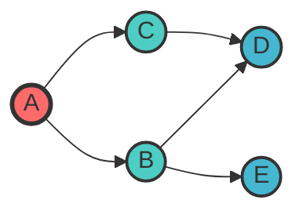
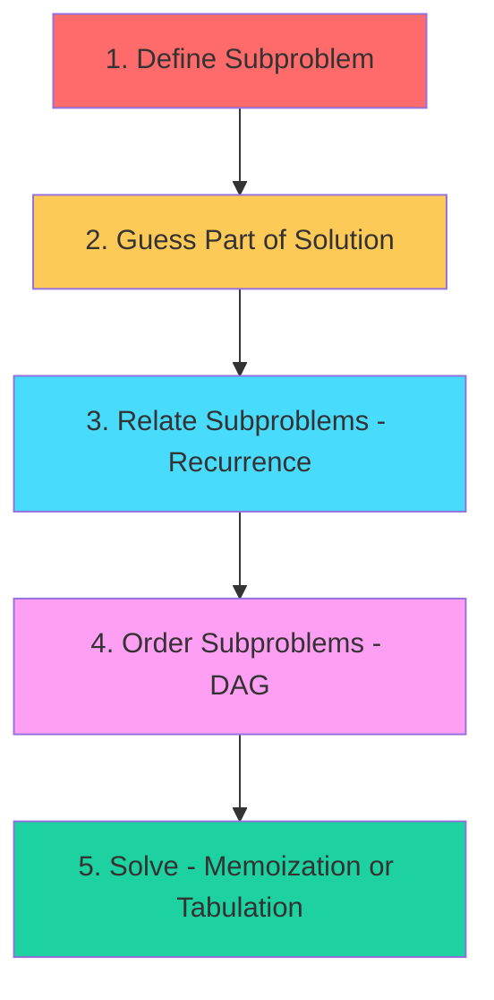
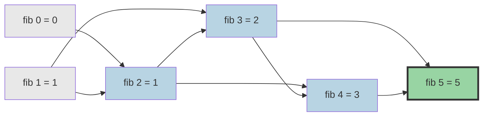

# Backtracking, Graphs & Dynamic Programming

> **Advanced techniques for complex problem solving**

---

## Backtracking

### Pattern Recognition

**When to use backtracking:**
- Generate all possible solutions (permutations, combinations, subsets)
- Constraint satisfaction problems (N-Queens, Sudoku)
- Path finding with specific conditions
- Problems with "all" or "every" in the description

**Key insight:** Backtracking = DFS + pruning invalid paths early

### The Template

```python
def backtrack(candidates, path, result):
    # Base case: found a valid solution
    if is_solution(path):
        result.append(path[:])  # Make a copy!
        return

    # Try each candidate
    for candidate in candidates:
        if is_valid(candidate, path):
            # Choose
            path.append(candidate)

            # Explore
            backtrack(candidates, path, result)

            # Un-choose (backtrack)
            path.pop()
```

::: info Complexity: Time O(2^n) or O(n!) · Space O(n)
- **Time:** Depends on problem - O(2^n) for subsets, O(n!) for permutations
- **Space:** Recursion depth and path storage proportional to input size
:::

### Classic Problems

| Problem | Key Insight | Time Complexity |
|---------|-------------|-----------------|
| **Permutations** | Use visited set, order matters | O(n! * n) |
| **Combinations** | Use start index, avoid duplicates | O(C(n,k) * k) |
| **Subsets** | Include/exclude each element | O(2^n * n) |
| **N-Queens** | Track columns, diagonals with sets | O(n!) |
| **Sudoku** | Constraint propagation + backtrack | O(9^empty_cells) |

### Permutations Template

```python
def permute(nums):
    result = []

    def backtrack(path, remaining):
        if not remaining:
            result.append(path[:])
            return

        for i, num in enumerate(remaining):
            path.append(num)
            backtrack(path, remaining[:i] + remaining[i+1:])
            path.pop()

    backtrack([], nums)
    return result
```

::: info Complexity: Time O(n! * n) · Space O(n)
- **Time:** n! permutations, each taking O(n) to copy into result
- **Space:** Recursion depth is n; path stores n elements
:::

### Combinations Template

```python
def combine(n, k):
    result = []

    def backtrack(start, path):
        if len(path) == k:
            result.append(path[:])
            return

        # Pruning: ensure enough elements remain
        for i in range(start, n - (k - len(path)) + 2):
            path.append(i)
            backtrack(i + 1, path)
            path.pop()

    backtrack(1, [])
    return result
```

::: info Complexity: Time O(C(n,k) * k) · Space O(k)
- **Time:** Generate C(n,k) combinations, each of length k
- **Space:** Recursion depth and path size bounded by k
:::

### Subsets Template

```python
def subsets(nums):
    result = []

    def backtrack(start, path):
        result.append(path[:])  # Every path is a valid subset

        for i in range(start, len(nums)):
            path.append(nums[i])
            backtrack(i + 1, path)
            path.pop()

    backtrack(0, [])
    return result
```

::: info Complexity: Time O(n * 2^n) · Space O(n)
- **Time:** 2^n subsets, each taking O(n) to copy into result
- **Space:** Recursion depth is n; path stores up to n elements
:::

---

## Graph Fundamentals

### Representations

| Representation | Space | Add Edge | Check Edge | Best For |
|----------------|-------|----------|------------|----------|
| **Adjacency List** | O(V + E) | O(1) | O(degree) | Sparse graphs, traversal |
| **Adjacency Matrix** | O(V^2) | O(1) | O(1) | Dense graphs, quick edge lookup |
| **Edge List** | O(E) | O(1) | O(E) | Kruskal's MST, simple storage |

```python
# Adjacency List (most common in interviews)
graph = {
    'A': ['B', 'C'],
    'B': ['A', 'D'],
    'C': ['A', 'D'],
    'D': ['B', 'C']
}

# Using defaultdict for dynamic graphs
from collections import defaultdict
graph = defaultdict(list)
for u, v in edges:
    graph[u].append(v)
    graph[v].append(u)  # For undirected
```

### Graph Traversal Visualization



**DFS Order:** A -> B -> D -> C -> E (goes deep first)
**BFS Order:** A -> B -> C -> D -> E (level by level)

### DFS Template (Recursive)

```python
def dfs(graph, node, visited):
    if node in visited:
        return
    visited.add(node)

    # Process node here
    print(node)

    for neighbor in graph[node]:
        dfs(graph, neighbor, visited)

# Usage
visited = set()
dfs(graph, start_node, visited)
```

::: info Complexity: Time O(V + E) · Space O(V)
- **Time:** Visit each vertex and edge once
- **Space:** Visited set stores V vertices; recursion depth up to V
:::

### DFS Template (Iterative)

```python
def dfs_iterative(graph, start):
    visited = set()
    stack = [start]

    while stack:
        node = stack.pop()
        if node in visited:
            continue
        visited.add(node)

        # Process node here

        for neighbor in graph[node]:
            if neighbor not in visited:
                stack.append(neighbor)

    return visited
```

::: info Complexity: Time O(V + E) · Space O(V)
- **Time:** Visit each vertex and edge once
- **Space:** Stack and visited set each store up to V vertices
:::

### BFS Template

```python
from collections import deque

def bfs(graph, start):
    visited = {start}
    queue = deque([start])

    while queue:
        node = queue.popleft()

        # Process node here

        for neighbor in graph[node]:
            if neighbor not in visited:
                visited.add(neighbor)
                queue.append(neighbor)

    return visited
```

::: info Complexity: Time O(V + E) · Space O(V)
- **Time:** Visit each vertex and edge once
- **Space:** Queue and visited set each store up to V vertices
:::

### BFS for Shortest Path (Unweighted)

```python
from collections import deque

def shortest_path(graph, start, target):
    if start == target:
        return 0

    visited = {start}
    queue = deque([(start, 0)])  # (node, distance)

    while queue:
        node, dist = queue.popleft()

        for neighbor in graph[node]:
            if neighbor == target:
                return dist + 1
            if neighbor not in visited:
                visited.add(neighbor)
                queue.append((neighbor, dist + 1))

    return -1  # No path found
```

::: info Complexity: Time O(V + E) · Space O(V)
- **Time:** BFS explores nodes level by level until target found
- **Space:** Queue stores frontier nodes; visited set stores explored nodes
:::

### 2D Grid Traversal (Common Interview Pattern)

```python
def bfs_grid(grid, start_row, start_col):
    rows, cols = len(grid), len(grid[0])
    directions = [(0, 1), (0, -1), (1, 0), (-1, 0)]  # right, left, down, up

    visited = {(start_row, start_col)}
    queue = deque([(start_row, start_col, 0)])  # (row, col, distance)

    while queue:
        r, c, dist = queue.popleft()

        for dr, dc in directions:
            nr, nc = r + dr, c + dc

            # Check bounds and validity
            if 0 <= nr < rows and 0 <= nc < cols:
                if (nr, nc) not in visited and grid[nr][nc] != '#':
                    visited.add((nr, nc))
                    queue.append((nr, nc, dist + 1))

    return visited
```

::: info Complexity: Time O(m * n) · Space O(m * n)
- **Time:** Visit each cell at most once
- **Space:** Visited set can store all m*n cells; queue stores frontier
:::

### Topological Sort (Kahn's Algorithm)

**Use when:** Dependencies, course prerequisites, build order

```python
from collections import deque, defaultdict

def topological_sort(num_nodes, edges):
    # Build graph and calculate in-degrees
    graph = defaultdict(list)
    in_degree = [0] * num_nodes

    for u, v in edges:  # u -> v (u must come before v)
        graph[u].append(v)
        in_degree[v] += 1

    # Start with nodes having no dependencies
    queue = deque([i for i in range(num_nodes) if in_degree[i] == 0])
    result = []

    while queue:
        node = queue.popleft()
        result.append(node)

        for neighbor in graph[node]:
            in_degree[neighbor] -= 1
            if in_degree[neighbor] == 0:
                queue.append(neighbor)

    # Check for cycle
    if len(result) != num_nodes:
        return []  # Cycle detected!

    return result
```

::: info Complexity: Time O(V + E) · Space O(V + E)
- **Time:** Process each vertex and edge once
- **Space:** Graph adjacency list and in-degree array store V + E
:::

### Cycle Detection

```python
# For Directed Graph (using colors)
def has_cycle_directed(graph, num_nodes):
    WHITE, GRAY, BLACK = 0, 1, 2
    color = [WHITE] * num_nodes

    def dfs(node):
        color[node] = GRAY  # Being processed

        for neighbor in graph[node]:
            if color[neighbor] == GRAY:  # Back edge = cycle
                return True
            if color[neighbor] == WHITE and dfs(neighbor):
                return True

        color[node] = BLACK  # Finished
        return False

    return any(color[i] == WHITE and dfs(i) for i in range(num_nodes))

# For Undirected Graph (using parent)
def has_cycle_undirected(graph, num_nodes):
    visited = [False] * num_nodes

    def dfs(node, parent):
        visited[node] = True

        for neighbor in graph[node]:
            if not visited[neighbor]:
                if dfs(neighbor, node):
                    return True
            elif neighbor != parent:  # Visited but not parent = cycle
                return True
        return False

    return any(not visited[i] and dfs(i, -1) for i in range(num_nodes))
```

::: info Complexity: Time O(V + E) · Space O(V)
- **Time:** DFS visits each vertex and edge once
- **Space:** Color/visited array stores V vertices; recursion depth up to V
:::

### Dijkstra's Algorithm (Weighted Shortest Path)

```python
import heapq
from collections import defaultdict

def dijkstra(graph, start):
    # graph[u] = [(v, weight), ...]
    distances = {start: 0}
    heap = [(0, start)]  # (distance, node)

    while heap:
        dist, node = heapq.heappop(heap)

        if dist > distances.get(node, float('inf')):
            continue

        for neighbor, weight in graph[node]:
            new_dist = dist + weight
            if new_dist < distances.get(neighbor, float('inf')):
                distances[neighbor] = new_dist
                heapq.heappush(heap, (new_dist, neighbor))

    return distances
```

::: info Complexity: Time O((V + E) log V) · Space O(V)
- **Time:** Each edge relaxation uses heap operations O(log V)
- **Space:** Distance array and heap store up to V vertices
:::

### Union-Find (Disjoint Set Union)

**Use when:** Connected components, detecting cycles in undirected graphs

```python
class UnionFind:
    def __init__(self, n):
        self.parent = list(range(n))
        self.rank = [0] * n

    def find(self, x):
        if self.parent[x] != x:
            self.parent[x] = self.find(self.parent[x])  # Path compression
        return self.parent[x]

    def union(self, x, y):
        px, py = self.find(x), self.find(y)
        if px == py:
            return False  # Already connected

        # Union by rank
        if self.rank[px] < self.rank[py]:
            px, py = py, px
        self.parent[py] = px
        if self.rank[px] == self.rank[py]:
            self.rank[px] += 1
        return True
```

::: info Complexity: Time O(alpha(n)) per operation · Space O(n)
- **Time:** Near-constant with path compression and union by rank; alpha is inverse Ackermann
- **Space:** Parent and rank arrays store n elements
:::

---

## Dynamic Programming

### Pattern Recognition

**DP is likely needed when you see:**
- "Maximum/minimum" result
- "Count all ways"
- "Is it possible?"
- "Longest/shortest" sequence
- Optimal substructure + overlapping subproblems

### The 5-Step Framework



1. **Define subproblem:** What state captures progress toward solution?
2. **Guess:** What choice do we make at each step?
3. **Recurrence:** How do subproblems relate? Write the formula.
4. **Order:** What order ensures subproblems are solved first?
5. **Solve:** Implement with memoization (top-down) or tabulation (bottom-up).

### DP State Transition (Fibonacci Example)



### Top-Down vs Bottom-Up

```python
from functools import lru_cache

# Top-down (Memoization) - Start from problem, recurse to base
@lru_cache(maxsize=None)
def fib(n):
    if n <= 1:
        return n
    return fib(n - 1) + fib(n - 2)

# Bottom-up (Tabulation) - Start from base, build to problem
def fib_bu(n):
    if n <= 1:
        return n
    dp = [0, 1]
    for i in range(2, n + 1):
        dp.append(dp[-1] + dp[-2])
    return dp[n]

# Space-optimized Bottom-up
def fib_optimized(n):
    if n <= 1:
        return n
    prev, curr = 0, 1
    for _ in range(2, n + 1):
        prev, curr = curr, prev + curr
    return curr
```

::: info Complexity: Time O(n) · Space O(1) to O(n)
- **Time:** Single pass computing each value once
- **Space:** O(n) for table; O(1) when space-optimized with two variables
:::

### Common DP Patterns

#### 1. Linear DP (1D)

**Examples:** Climbing Stairs, House Robber, Maximum Subarray

```python
# House Robber: Can't rob adjacent houses
def rob(nums):
    if not nums:
        return 0
    if len(nums) <= 2:
        return max(nums)

    dp = [0] * len(nums)
    dp[0] = nums[0]
    dp[1] = max(nums[0], nums[1])

    for i in range(2, len(nums)):
        dp[i] = max(dp[i-1], dp[i-2] + nums[i])

    return dp[-1]
```

::: info Complexity: Time O(n) · Space O(n) or O(1)
- **Time:** Single pass through the array
- **Space:** O(n) for dp array; can optimize to O(1) with two variables
:::

#### 2. Grid DP (2D)

**Examples:** Unique Paths, Minimum Path Sum, Edit Distance

```python
# Minimum Path Sum
def min_path_sum(grid):
    m, n = len(grid), len(grid[0])
    dp = [[0] * n for _ in range(m)]

    dp[0][0] = grid[0][0]

    # Fill first row and column
    for i in range(1, m):
        dp[i][0] = dp[i-1][0] + grid[i][0]
    for j in range(1, n):
        dp[0][j] = dp[0][j-1] + grid[0][j]

    # Fill rest
    for i in range(1, m):
        for j in range(1, n):
            dp[i][j] = min(dp[i-1][j], dp[i][j-1]) + grid[i][j]

    return dp[m-1][n-1]
```

::: info Complexity: Time O(m * n) · Space O(m * n) or O(n)
- **Time:** Visit each cell once
- **Space:** O(m*n) for 2D dp; can optimize to O(n) using single row
:::

#### 3. Knapsack Pattern

**0/1 Knapsack:** Each item used once

```python
def knapsack_01(weights, values, capacity):
    n = len(weights)
    dp = [[0] * (capacity + 1) for _ in range(n + 1)]

    for i in range(1, n + 1):
        for w in range(capacity + 1):
            # Don't take item i
            dp[i][w] = dp[i-1][w]
            # Take item i (if possible)
            if weights[i-1] <= w:
                dp[i][w] = max(dp[i][w],
                              dp[i-1][w - weights[i-1]] + values[i-1])

    return dp[n][capacity]
```

::: info Complexity: Time O(n * W) · Space O(n * W) or O(W)
- **Time:** Fill n*W table entries
- **Space:** O(n*W) for 2D dp; can optimize to O(W) using 1D array
:::

**Unbounded Knapsack:** Items can be reused

```python
def knapsack_unbounded(weights, values, capacity):
    dp = [0] * (capacity + 1)

    for w in range(1, capacity + 1):
        for i in range(len(weights)):
            if weights[i] <= w:
                dp[w] = max(dp[w], dp[w - weights[i]] + values[i])

    return dp[capacity]
```

::: info Complexity: Time O(n * W) · Space O(W)
- **Time:** For each capacity, consider all n items
- **Space:** Single 1D array of size W+1
:::

#### 4. Longest Common Subsequence (LCS)

```python
def lcs(text1, text2):
    m, n = len(text1), len(text2)
    dp = [[0] * (n + 1) for _ in range(m + 1)]

    for i in range(1, m + 1):
        for j in range(1, n + 1):
            if text1[i-1] == text2[j-1]:
                dp[i][j] = dp[i-1][j-1] + 1
            else:
                dp[i][j] = max(dp[i-1][j], dp[i][j-1])

    return dp[m][n]
```

::: info Complexity: Time O(m * n) · Space O(m * n) or O(n)
- **Time:** Fill m*n table comparing each character pair
- **Space:** O(m*n) for 2D table; can optimize to O(n) with two rows
:::

#### 5. Longest Increasing Subsequence (LIS)

```python
# O(n^2) solution
def lis(nums):
    if not nums:
        return 0

    dp = [1] * len(nums)  # Each element is a subsequence of length 1

    for i in range(1, len(nums)):
        for j in range(i):
            if nums[j] < nums[i]:
                dp[i] = max(dp[i], dp[j] + 1)

    return max(dp)

# O(n log n) solution with binary search
import bisect

def lis_optimized(nums):
    tails = []
    for num in nums:
        pos = bisect.bisect_left(tails, num)
        if pos == len(tails):
            tails.append(num)
        else:
            tails[pos] = num
    return len(tails)
```

::: info Complexity: Time O(n^2) or O(n log n) · Space O(n)
- **Time:** O(n^2) basic DP; O(n log n) with binary search optimization
- **Space:** O(n) for dp/tails array
:::

#### 6. Interval DP

**Examples:** Matrix Chain Multiplication, Burst Balloons

```python
# Burst Balloons
def max_coins(nums):
    nums = [1] + nums + [1]
    n = len(nums)
    dp = [[0] * n for _ in range(n)]

    for length in range(2, n):  # length of interval
        for left in range(n - length):
            right = left + length
            for k in range(left + 1, right):  # last balloon to burst
                dp[left][right] = max(
                    dp[left][right],
                    dp[left][k] + dp[k][right] +
                    nums[left] * nums[k] * nums[right]
                )

    return dp[0][n-1]
```

::: info Complexity: Time O(n^3) · Space O(n^2)
- **Time:** Three nested loops over interval endpoints and split points
- **Space:** 2D dp table stores n^2 interval results
:::

#### 7. Tree DP

```python
# Maximum Path Sum in Binary Tree
def max_path_sum(root):
    max_sum = float('-inf')

    def dfs(node):
        nonlocal max_sum
        if not node:
            return 0

        left = max(dfs(node.left), 0)   # Ignore negative paths
        right = max(dfs(node.right), 0)

        # Path through this node
        max_sum = max(max_sum, left + right + node.val)

        # Return max path starting from this node going down
        return max(left, right) + node.val

    dfs(root)
    return max_sum
```

::: info Complexity: Time O(n) · Space O(h)
- **Time:** Visit each node exactly once
- **Space:** Recursion depth is O(h) where h is tree height
:::

### DP Problem Recognition Cheat Sheet

| Keyword in Problem | Likely Pattern |
|--------------------|----------------|
| "Minimum/maximum number of..." | Linear DP or BFS |
| "Count ways to..." | Linear DP (often Fibonacci-like) |
| "Can we achieve/reach..." | Knapsack or BFS |
| "Longest/shortest sequence..." | LIS/LCS variant |
| "Partition into groups..." | Knapsack variant |
| "String matching/edit..." | 2D DP (LCS family) |
| "Grid traversal optimal..." | 2D Grid DP |
| "Parenthesization/split..." | Interval DP |

---

## Interview Applications

### Graph Problems Frequently Asked

1. **Number of Islands** - BFS/DFS on 2D grid
2. **Course Schedule** - Topological sort + cycle detection
3. **Word Ladder** - BFS for shortest transformation
4. **Clone Graph** - DFS/BFS with hash map
5. **Network Delay Time** - Dijkstra's algorithm
6. **Alien Dictionary** - Topological sort from constraints

### DP Problems Frequently Asked

1. **Longest Increasing Subsequence** - Classic LIS
2. **Word Break** - 1D DP with substring matching
3. **Coin Change** - Unbounded knapsack
4. **Edit Distance** - 2D DP
5. **Decode Ways** - 1D DP (Fibonacci variant)
6. **Maximum Product Subarray** - Track min and max

### Backtracking Problems

1. **Generate Parentheses** - Valid combinations
2. **Letter Combinations of Phone** - Cartesian product
3. **Word Search** - Grid backtracking
4. **Combination Sum** - Classic backtracking with duplicates
5. **Palindrome Partitioning** - Backtrack + DP optimization

---

## Quick Reference: Time Complexities

| Algorithm | Time | Space |
|-----------|------|-------|
| DFS/BFS | O(V + E) | O(V) |
| Topological Sort | O(V + E) | O(V) |
| Dijkstra (heap) | O((V + E) log V) | O(V) |
| Bellman-Ford | O(V * E) | O(V) |
| Floyd-Warshall | O(V^3) | O(V^2) |
| Union-Find | O(alpha(n)) per op | O(n) |
| LCS | O(m * n) | O(m * n) |
| LIS (optimized) | O(n log n) | O(n) |
| 0/1 Knapsack | O(n * W) | O(n * W) |

---

## Resources

- [Tech Interview Handbook - Graph Cheatsheet](https://www.techinterviewhandbook.org/algorithms/graph/)
- [Tech Interview Handbook - DP Cheatsheet](https://www.techinterviewhandbook.org/algorithms/dynamic-programming/)
- [Memgraph - Graph Algorithms Cheat Sheet](https://memgraph.com/blog/graph-algorithms-cheat-sheet-for-coding-interviews)
- [Design Gurus - Grokking Dynamic Programming](https://www.designgurus.io/course/grokking-dynamic-programming)
- [LockedIn AI - 10 DP Patterns](https://www.lockedinai.com/blog/dynamic-programming-interview-patterns-success)
- [LeetCode Graph Algorithms List](https://leetcode.com/discuss/general-discussion/753236/list-of-graph-algorithms-for-coding-interview/)
