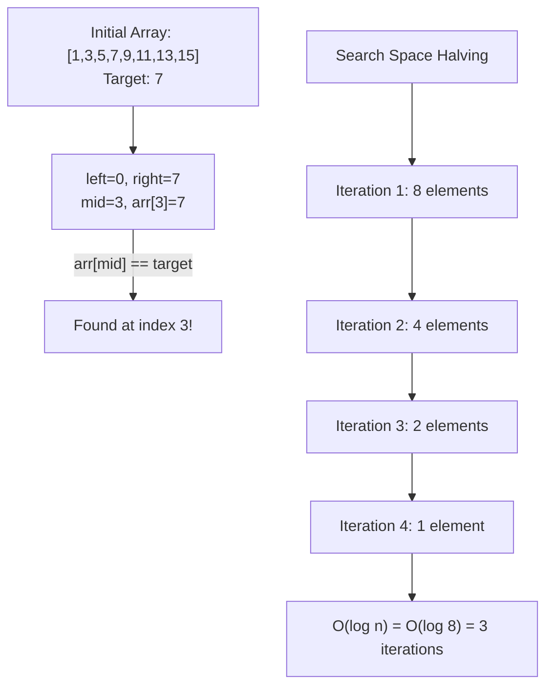
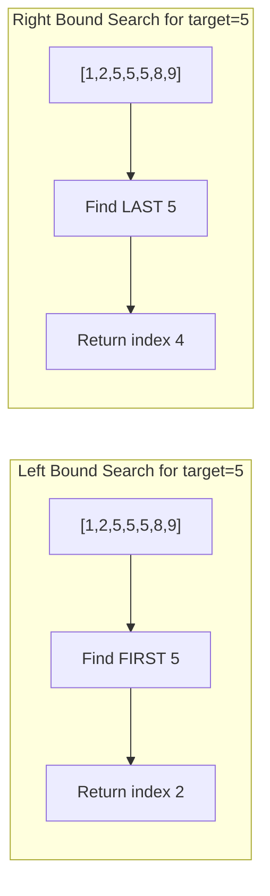
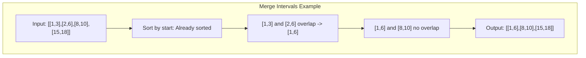

# Binary Search, Heaps & Intervals

> **Logarithmic efficiency and priority-based processing**

---

## Binary Search Mastery

Binary search is a fundamental algorithm that reduces the search space by half with each iteration. Understanding the three core templates will help you solve the majority of binary search problems.

### The 3 Templates

**Template 1: Exact Match**

::: code-group

```python [Python]
def binary_search_exact(arr, target):
    """Find exact target position, return -1 if not found"""
    left, right = 0, len(arr) - 1

    while left <= right:
        mid = left + (right - left) // 2  # Avoid overflow
        if arr[mid] == target:
            return mid
        elif arr[mid] < target:
            left = mid + 1
        else:
            right = mid - 1

    return -1  # Not found
```

```java [Java]
int binarySearchExact(int[] arr, int target) {
    int left = 0, right = arr.length - 1;
    while (left <= right) {
        int mid = left + (right - left) / 2;
        if (arr[mid] == target) return mid;
        else if (arr[mid] < target) left = mid + 1;
        else right = mid - 1;
    }
    return -1;
}
```

:::

::: info Complexity: Time O(log n) · Space O(1)
- **Time:** Halve search space each iteration
- **Space:** Only three pointer variables used
:::

**Template 2: Left Bound (First Occurrence / Lower Bound)**

::: code-group

```python [Python]
def binary_search_left(arr, target):
    """Find first position where arr[i] >= target"""
    left, right = 0, len(arr)  # Note: right = len(arr)

    while left < right:  # Note: < not <=
        mid = left + (right - left) // 2
        if arr[mid] < target:
            left = mid + 1
        else:
            right = mid  # Note: not mid - 1

    return left  # Returns insertion point if not found
```

```java [Java]
int binarySearchLeft(int[] arr, int target) {
    int left = 0, right = arr.length; // right = len (open bound)
    while (left < right) {
        int mid = left + (right - left) / 2;
        if (arr[mid] < target) left = mid + 1;
        else right = mid;
    }
    return left;
}
```

:::

::: info Complexity: Time O(log n) · Space O(1)
- **Time:** Halve search space each iteration
- **Space:** Only three pointer variables used
:::

**Template 3: Right Bound (Last Occurrence / Upper Bound)**

::: code-group

```python [Python]
def binary_search_right(arr, target):
    """Find first position where arr[i] > target"""
    left, right = 0, len(arr)

    while left < right:
        mid = left + (right - left) // 2
        if arr[mid] <= target:  # Note: <= instead of <
            left = mid + 1
        else:
            right = mid

    return left  # Points to first element > target
```

```java [Java]
int binarySearchRight(int[] arr, int target) {
    int left = 0, right = arr.length;
    while (left < right) {
        int mid = left + (right - left) / 2;
        if (arr[mid] <= target) left = mid + 1;
        else right = mid;
    }
    return left; // points to first element > target
}
```

:::

::: info Complexity: Time O(log n) · Space O(1)
- **Time:** Halve search space each iteration
- **Space:** Only three pointer variables used
:::

**Finding First and Last Position (LeetCode 34)**

::: code-group

```python [Python]
def search_range(arr, target):
    """Find [first, last] occurrence of target"""
    def find_left():
        left, right = 0, len(arr)
        while left < right:
            mid = (left + right) // 2
            if arr[mid] < target:
                left = mid + 1
            else:
                right = mid
        return left

    def find_right():
        left, right = 0, len(arr)
        while left < right:
            mid = (left + right) // 2
            if arr[mid] <= target:
                left = mid + 1
            else:
                right = mid
        return left - 1

    first = find_left()
    if first >= len(arr) or arr[first] != target:
        return [-1, -1]
    return [first, find_right()]
```

```java [Java]
int[] searchRange(int[] arr, int target) {
    int first = lowerBound(arr, target);
    if (first >= arr.length || arr[first] != target) return new int[]{-1, -1};
    int last = upperBound(arr, target) - 1;
    return new int[]{first, last};
}
int lowerBound(int[] arr, int target) {
    int left = 0, right = arr.length;
    while (left < right) { int mid = left + (right-left)/2; if (arr[mid] < target) left = mid+1; else right = mid; }
    return left;
}
int upperBound(int[] arr, int target) {
    int left = 0, right = arr.length;
    while (left < right) { int mid = left + (right-left)/2; if (arr[mid] <= target) left = mid+1; else right = mid; }
    return left;
}
```

:::

::: info Complexity: Time O(log n) · Space O(1)
- **Time:** Two binary searches, each O(log n)
- **Space:** Only pointer variables used
:::

### When Binary Search Applies

| Scenario | Example Problems |
|----------|-----------------|
| **Sorted Array** | Classic search, Find First/Last Position |
| **Rotated Sorted Array** | Search in Rotated Array, Find Minimum |
| **Monotonic Function** | Sqrt(x), Valid Perfect Square |
| **Search Space Reduction** | Capacity to Ship, Koko Eating Bananas |
| **2D Matrix** | Search 2D Matrix, Search Row-Col Sorted |
| **Answer Optimization** | Minimize Maximum, Split Array Largest Sum |

**Key Insight**: Binary search works when there's a **monotonic condition** - if condition(x) is true, then condition(x+1) is also true (or vice versa).

### Binary Search on Answer Space

::: code-group

```python [Python]
def binary_search_on_answer(check_feasible, low, high):
    """
    Template for 'minimize maximum' or 'maximize minimum' problems
    check_feasible(x) returns True if x is a feasible answer
    """
    while low < high:
        mid = (low + high) // 2
        if check_feasible(mid):
            high = mid  # Try to find smaller feasible answer
        else:
            low = mid + 1
    return low

# Example: Koko Eating Bananas
def min_eating_speed(piles, h):
    def can_finish(speed):
        hours = sum((pile + speed - 1) // speed for pile in piles)
        return hours <= h

    return binary_search_on_answer(can_finish, 1, max(piles))
```

```java [Java]
// Template for 'minimize maximum' problems
int binarySearchOnAnswer(int[] piles, int h) {
    int low = 1, high = 0;
    for (int p : piles) high = Math.max(high, p);
    while (low < high) {
        int mid = low + (high - low) / 2;
        if (canFinish(piles, mid, h)) high = mid;
        else low = mid + 1;
    }
    return low;
}
boolean canFinish(int[] piles, int speed, int h) {
    int hours = 0;
    for (int pile : piles) hours += (pile + speed - 1) / speed;
    return hours <= h;
}
```

:::

::: info Complexity: Time O(n log m) · Space O(1)
- **Time:** O(log m) binary search iterations, each with O(n) feasibility check
- **Space:** Only tracking search bounds and counters
:::

### Mermaid Diagram: Search Space Reduction





---

## Heap Essentials

### Min Heap vs Max Heap

Python's `heapq` module implements a **min-heap** by default. For a max-heap, negate the values.

::: code-group

```python [Python]
import heapq

# MIN HEAP (default)
min_heap = []
heapq.heappush(min_heap, 5)
heapq.heappush(min_heap, 3)
heapq.heappush(min_heap, 7)
print(heapq.heappop(min_heap))  # Output: 3 (smallest)

# MAX HEAP (negate values)
max_heap = []
heapq.heappush(max_heap, -5)
heapq.heappush(max_heap, -3)
heapq.heappush(max_heap, -7)
print(-heapq.heappop(max_heap))  # Output: 7 (largest)

# Heapify existing list - O(n)
arr = [5, 3, 7, 1, 9]
heapq.heapify(arr)  # Now arr is a min-heap
```

```java [Java]
// MIN HEAP (default)
PriorityQueue<Integer> minHeap = new PriorityQueue<>();
minHeap.offer(5); minHeap.offer(3); minHeap.offer(7);
System.out.println(minHeap.poll()); // 3 (smallest)

// MAX HEAP (reverse order)
PriorityQueue<Integer> maxHeap = new PriorityQueue<>(Comparator.reverseOrder());
maxHeap.offer(5); maxHeap.offer(3); maxHeap.offer(7);
System.out.println(maxHeap.poll()); // 7 (largest)

// Heapify from existing collection
int[] arr = {5, 3, 7, 1, 9};
PriorityQueue<Integer> heap = new PriorityQueue<>();
for (int x : arr) heap.offer(x); // O(n log n); no direct O(n) heapify in Java
```

:::

::: info Complexity: Time O(log n) push/pop · Space O(n)
- **Time:** Push and pop are O(log n); heapify is O(n)
- **Space:** Heap stores n elements
:::

**Key Operations Complexity:**
| Operation | Time Complexity |
|-----------|----------------|
| heappush | O(log n) |
| heappop | O(log n) |
| heapify | O(n) |
| heap[0] (peek) | O(1) |
| nlargest(k, arr) | O(n log k) |
| nsmallest(k, arr) | O(n log k) |

### Top-K Pattern

The Top-K pattern is one of the most common heap applications. **Key insight**: Use a min-heap of size K to find K largest, and max-heap of size K to find K smallest.

::: code-group

```python [Python]
import heapq

def top_k_largest_manual(arr, k):
    """Manual implementation with O(n log k) complexity"""
    min_heap = []

    for num in arr:
        heapq.heappush(min_heap, num)
        if len(min_heap) > k:
            heapq.heappop(min_heap)  # Remove smallest

    return sorted(min_heap, reverse=True)

def kth_largest_element(arr, k):
    """Find the kth largest element (LeetCode 215)"""
    min_heap = []

    for num in arr:
        heapq.heappush(min_heap, num)
        if len(min_heap) > k:
            heapq.heappop(min_heap)

    return min_heap[0]  # kth largest is at root

def top_k_frequent(nums, k):
    from collections import Counter
    count = Counter(nums)
    return heapq.nlargest(k, count.keys(), key=count.get)
```

```java [Java]
// Top-K largest (min-heap of size k)
List<Integer> topKLargestManual(int[] arr, int k) {
    PriorityQueue<Integer> minHeap = new PriorityQueue<>();
    for (int num : arr) {
        minHeap.offer(num);
        if (minHeap.size() > k) minHeap.poll();
    }
    List<Integer> result = new ArrayList<>(minHeap);
    result.sort(Comparator.reverseOrder());
    return result;
}

// Kth largest element
int kthLargestElement(int[] arr, int k) {
    PriorityQueue<Integer> minHeap = new PriorityQueue<>();
    for (int num : arr) {
        minHeap.offer(num);
        if (minHeap.size() > k) minHeap.poll();
    }
    return minHeap.peek();
}

// Top K frequent elements
int[] topKFrequent(int[] nums, int k) {
    Map<Integer, Integer> count = new HashMap<>();
    for (int n : nums) count.merge(n, 1, Integer::sum);
    PriorityQueue<int[]> minHeap = new PriorityQueue<>(Comparator.comparingInt(a -> a[1]));
    for (Map.Entry<Integer, Integer> e : count.entrySet()) {
        minHeap.offer(new int[]{e.getKey(), e.getValue()});
        if (minHeap.size() > k) minHeap.poll();
    }
    int[] result = new int[k];
    for (int i = k - 1; i >= 0; i--) result[i] = minHeap.poll()[0];
    return result;
}
```

:::

::: info Complexity: Time O(n log k) · Space O(n)
- **Time:** O(n) to process elements; heap operations O(log k) for k-sized heap
- **Space:** O(n) for frequency counter; O(k) for heap
:::

### Two Heaps Pattern

Used when you need to track both smallest and largest elements, commonly for finding median.

::: code-group

```python [Python]
import heapq

class MedianFinder:
    """Find Median from Data Stream (LeetCode 295)"""

    def __init__(self):
        self.small = []  # Max-heap (negated) for smaller half
        self.large = []  # Min-heap for larger half

    def addNum(self, num):
        heapq.heappush(self.small, -num)

        if self.small and self.large and (-self.small[0] > self.large[0]):
            heapq.heappush(self.large, -heapq.heappop(self.small))

        if len(self.small) > len(self.large) + 1:
            heapq.heappush(self.large, -heapq.heappop(self.small))
        if len(self.large) > len(self.small):
            heapq.heappush(self.small, -heapq.heappop(self.large))

    def findMedian(self):
        if len(self.small) > len(self.large):
            return -self.small[0]
        return (-self.small[0] + self.large[0]) / 2
```

```java [Java]
class MedianFinder {
    private PriorityQueue<Integer> small = new PriorityQueue<>(Comparator.reverseOrder()); // max-heap
    private PriorityQueue<Integer> large = new PriorityQueue<>(); // min-heap

    public void addNum(int num) {
        small.offer(num);
        if (!small.isEmpty() && !large.isEmpty() && small.peek() > large.peek())
            large.offer(small.poll());
        if (small.size() > large.size() + 1) large.offer(small.poll());
        if (large.size() > small.size()) small.offer(large.poll());
    }

    public double findMedian() {
        if (small.size() > large.size()) return small.peek();
        return (small.peek() + large.peek()) / 2.0;
    }
}
```

:::

::: info Complexity: Time O(log n) add · O(1) median · Space O(n)
- **Time:** Each add involves heap operations O(log n); median is O(1) peek
- **Space:** Both heaps together store all n elements
:::

### Streaming/Online Problems

Heaps excel when processing data streams where you need to maintain order without storing everything.

::: code-group

```python [Python]
import heapq

class KthLargestStream:
    """Kth Largest Element in a Stream (LeetCode 703)"""

    def __init__(self, k, nums):
        self.k = k
        self.heap = nums[:]
        heapq.heapify(self.heap)
        while len(self.heap) > k:
            heapq.heappop(self.heap)

    def add(self, val):
        heapq.heappush(self.heap, val)
        if len(self.heap) > self.k:
            heapq.heappop(self.heap)
        return self.heap[0]

def merge_k_sorted_lists(lists):
    """Merge K Sorted Lists (LeetCode 23)"""
    result = []
    heap = []

    for i, lst in enumerate(lists):
        if lst:
            heapq.heappush(heap, (lst[0], i, 0))

    while heap:
        val, list_idx, elem_idx = heapq.heappop(heap)
        result.append(val)

        if elem_idx + 1 < len(lists[list_idx]):
            next_val = lists[list_idx][elem_idx + 1]
            heapq.heappush(heap, (next_val, list_idx, elem_idx + 1))

    return result
```

```java [Java]
class KthLargestStream {
    private PriorityQueue<Integer> heap;
    private int k;
    KthLargestStream(int k, int[] nums) {
        this.k = k; heap = new PriorityQueue<>();
        for (int n : nums) { heap.offer(n); if (heap.size() > k) heap.poll(); }
    }
    int add(int val) {
        heap.offer(val); if (heap.size() > k) heap.poll(); return heap.peek();
    }
}

// Merge K Sorted Lists (LeetCode 23)
ListNode mergeKSortedLists(ListNode[] lists) {
    PriorityQueue<ListNode> heap = new PriorityQueue<>(Comparator.comparingInt(n -> n.val));
    for (ListNode node : lists) if (node != null) heap.offer(node);
    ListNode dummy = new ListNode(0), curr = dummy;
    while (!heap.isEmpty()) {
        curr.next = heap.poll(); curr = curr.next;
        if (curr.next != null) heap.offer(curr.next);
    }
    return dummy.next;
}
```

:::

::: info Complexity: Time O(n log k) · Space O(k)
- **Time:** Process n total elements; each heap operation O(log k) for k lists
- **Space:** Heap stores at most k elements (one from each list)
:::

### Heap with Custom Objects

```python
import heapq
from dataclasses import dataclass, field

@dataclass(order=True)
class Task:
    priority: int
    name: str = field(compare=False)

# Using custom comparison
tasks = []
heapq.heappush(tasks, Task(2, "Low priority"))
heapq.heappush(tasks, Task(1, "High priority"))
print(heapq.heappop(tasks).name)  # "High priority"

# Alternative: tuple approach
heap = []
heapq.heappush(heap, (priority, index, item))  # index breaks ties
```

::: info Complexity: Time O(log n) · Space O(n)
- **Time:** Heap operations O(log n) with custom comparison
- **Space:** Heap stores n custom objects
:::

---

## Interval Problems

### The Sorting Trick

**Always sort intervals first!** The sorting key depends on the problem:
- **Merge intervals**: Sort by start time
- **Meeting rooms**: Sort by start time
- **Non-overlapping intervals**: Sort by end time (greedy)

### Merge vs Insert vs Intersection

::: code-group

```python [Python]
def merge_intervals(intervals):
    """Merge Overlapping Intervals (LeetCode 56)"""
    if not intervals:
        return []

    intervals.sort(key=lambda x: x[0])
    merged = [intervals[0]]

    for start, end in intervals[1:]:
        if start <= merged[-1][1]:
            merged[-1][1] = max(merged[-1][1], end)
        else:
            merged.append([start, end])

    return merged

def insert_interval(intervals, new_interval):
    """Insert Interval (LeetCode 57)"""
    result = []
    i, n = 0, len(intervals)

    while i < n and intervals[i][1] < new_interval[0]:
        result.append(intervals[i]); i += 1

    while i < n and intervals[i][0] <= new_interval[1]:
        new_interval[0] = min(new_interval[0], intervals[i][0])
        new_interval[1] = max(new_interval[1], intervals[i][1])
        i += 1
    result.append(new_interval)

    while i < n:
        result.append(intervals[i]); i += 1

    return result

def interval_intersection(A, B):
    """Interval List Intersections (LeetCode 986)"""
    result = []
    i = j = 0

    while i < len(A) and j < len(B):
        start = max(A[i][0], B[j][0])
        end = min(A[i][1], B[j][1])

        if start <= end:
            result.append([start, end])

        if A[i][1] < B[j][1]:
            i += 1
        else:
            j += 1

    return result
```

```java [Java]
// Merge Overlapping Intervals
int[][] mergeIntervals(int[][] intervals) {
    Arrays.sort(intervals, Comparator.comparingInt(a -> a[0]));
    List<int[]> merged = new ArrayList<>();
    merged.add(intervals[0]);
    for (int i = 1; i < intervals.length; i++) {
        int[] last = merged.get(merged.size() - 1);
        if (intervals[i][0] <= last[1]) last[1] = Math.max(last[1], intervals[i][1]);
        else merged.add(intervals[i]);
    }
    return merged.toArray(new int[0][]);
}

// Insert Interval
int[][] insertInterval(int[][] intervals, int[] newInterval) {
    List<int[]> result = new ArrayList<>();
    int i = 0, n = intervals.length;
    while (i < n && intervals[i][1] < newInterval[0]) result.add(intervals[i++]);
    while (i < n && intervals[i][0] <= newInterval[1]) {
        newInterval[0] = Math.min(newInterval[0], intervals[i][0]);
        newInterval[1] = Math.max(newInterval[1], intervals[i][1]); i++;
    }
    result.add(newInterval);
    while (i < n) result.add(intervals[i++]);
    return result.toArray(new int[0][]);
}

// Interval Intersection
int[][] intervalIntersection(int[][] A, int[][] B) {
    List<int[]> result = new ArrayList<>();
    int i = 0, j = 0;
    while (i < A.length && j < B.length) {
        int start = Math.max(A[i][0], B[j][0]), end = Math.min(A[i][1], B[j][1]);
        if (start <= end) result.add(new int[]{start, end});
        if (A[i][1] < B[j][1]) i++; else j++;
    }
    return result.toArray(new int[0][]);
}
```

:::

::: info Complexity: Merge O(n log n) · Insert O(n) · Intersection O(n + m)
- **Time:** Merge requires sorting; insert/intersection are linear scans
- **Space:** O(n) for result arrays
:::

### Meeting Rooms Problems

::: code-group

```python [Python]
def min_meeting_rooms(intervals):
    """Meeting Rooms II (LeetCode 253) - Using Heap"""
    if not intervals:
        return 0

    intervals.sort(key=lambda x: x[0])
    rooms = []  # Min-heap of end times

    for start, end in intervals:
        if rooms and rooms[0] <= start:
            heapq.heappop(rooms)  # Reuse room
        heapq.heappush(rooms, end)

    return len(rooms)

def min_meeting_rooms_sweep_line(intervals):
    """Alternative: Sweep Line Algorithm"""
    events = []
    for start, end in intervals:
        events.append((start, 1))
        events.append((end, -1))

    events.sort()
    max_rooms = current_rooms = 0

    for time, delta in events:
        current_rooms += delta
        max_rooms = max(max_rooms, current_rooms)

    return max_rooms
```

```java [Java]
// Meeting Rooms II - Using Heap
int minMeetingRooms(int[][] intervals) {
    if (intervals.length == 0) return 0;
    Arrays.sort(intervals, Comparator.comparingInt(a -> a[0]));
    PriorityQueue<Integer> rooms = new PriorityQueue<>(); // min-heap of end times
    for (int[] interval : intervals) {
        if (!rooms.isEmpty() && rooms.peek() <= interval[0]) rooms.poll();
        rooms.offer(interval[1]);
    }
    return rooms.size();
}

// Meeting Rooms II - Sweep Line
int minMeetingRoomsSweep(int[][] intervals) {
    int[] starts = new int[intervals.length], ends = new int[intervals.length];
    for (int i = 0; i < intervals.length; i++) { starts[i] = intervals[i][0]; ends[i] = intervals[i][1]; }
    Arrays.sort(starts); Arrays.sort(ends);
    int rooms = 0, maxRooms = 0, s = 0, e = 0, n = intervals.length;
    while (s < n) {
        if (starts[s] < ends[e]) { rooms++; s++; maxRooms = Math.max(maxRooms, rooms); }
        else { rooms--; e++; }  // reuse a room
    }
    return maxRooms;
}
```

:::

::: info Complexity: Time O(n log n) · Space O(n)
- **Time:** Dominated by sorting; processing is O(n)
- **Space:** Heap or events array stores up to n elements
:::

### Non-Overlapping Intervals

::: code-group

```python [Python]
def erase_overlap_intervals(intervals):
    """Non-overlapping Intervals (LeetCode 435)
    Find minimum number of intervals to remove"""
    if not intervals:
        return 0

    intervals.sort(key=lambda x: x[1])

    count = 0
    prev_end = float('-inf')

    for start, end in intervals:
        if start >= prev_end:
            prev_end = end
        else:
            count += 1

    return count
```

```java [Java]
int eraseOverlapIntervals(int[][] intervals) {
    Arrays.sort(intervals, Comparator.comparingInt(a -> a[1]));
    int count = 0; int prevEnd = Integer.MIN_VALUE;
    for (int[] interval : intervals) {
        if (interval[0] >= prevEnd) prevEnd = interval[1];
        else count++;
    }
    return count;
}
```

:::

::: info Complexity: Time O(n log n) · Space O(1)
- **Time:** Sorting dominates; greedy scan is O(n)
- **Space:** Sorting may use O(log n) stack; otherwise constant
:::

### Interval Diagram



---

## Quick Problem Matrix

| Problem | Technique | Time | Space | Key Insight |
|---------|-----------|------|-------|-------------|
| Binary Search | Template 1 | O(log n) | O(1) | Exact match in sorted array |
| First/Last Position | Template 2+3 | O(log n) | O(1) | Use both bounds |
| Search Rotated Array | Modified BS | O(log n) | O(1) | Check which half is sorted |
| Find Peak Element | BS | O(log n) | O(1) | Go towards larger neighbor |
| Sqrt(x) | BS on answer | O(log n) | O(1) | Search space is [0, x] |
| Koko Eating Bananas | BS on answer | O(n log m) | O(1) | Binary search on speed |
| Kth Largest | Min-heap size K | O(n log k) | O(k) | Maintain K largest |
| Top K Frequent | Heap + HashMap | O(n log k) | O(n) | Count then heap |
| Find Median Stream | Two Heaps | O(log n) | O(n) | Balance max/min heaps |
| Merge K Lists | Min-heap | O(n log k) | O(k) | Track heads of lists |
| Merge Intervals | Sort + Sweep | O(n log n) | O(n) | Sort by start |
| Meeting Rooms II | Sort + Heap | O(n log n) | O(n) | Track end times |
| Non-Overlapping | Sort by end | O(n log n) | O(1) | Greedy: earliest end |

---

## Interview Applications

Based on actual interview questions and patterns from top companies:

### Classic Google Questions

**1. Top 100 Google Searches (Design + Heap)**
> "Design a system to find the top 100 unique Google searches from a billion searches per day."

```python
from collections import Counter
import heapq

def top_100_searches(searches):
    # Count frequencies
    count = Counter(searches)
    # Use heap to get top 100
    return heapq.nlargest(100, count.items(), key=lambda x: x[1])
```

**2. Search in 2D Matrix (Multi-dimensional Binary Search)**

::: code-group

```python [Python]
def search_matrix(matrix, target):
    """Google-style 2D matrix search"""
    if not matrix:
        return False

    rows, cols = len(matrix), len(matrix[0])
    left, right = 0, rows * cols - 1

    while left <= right:
        mid = (left + right) // 2
        row, col = mid // cols, mid % cols

        if matrix[row][col] == target:
            return True
        elif matrix[row][col] < target:
            left = mid + 1
        else:
            right = mid - 1

    return False
```

```java [Java]
boolean searchMatrix(int[][] matrix, int target) {
    int rows = matrix.length, cols = matrix[0].length;
    int left = 0, right = rows * cols - 1;
    while (left <= right) {
        int mid = left + (right - left) / 2;
        int val = matrix[mid / cols][mid % cols];
        if (val == target) return true;
        else if (val < target) left = mid + 1;
        else right = mid - 1;
    }
    return false;
}
```

:::

**3. Find Peak Element (Common Interview)**
```python
def find_peak_element(nums):
    """O(log n) solution using binary search"""
    left, right = 0, len(nums) - 1

    while left < right:
        mid = (left + right) // 2
        if nums[mid] > nums[mid + 1]:
            right = mid  # Peak is on left side (including mid)
        else:
            left = mid + 1  # Peak is on right side

    return left
```

**4. Capacity to Ship Packages (Binary Search on Answer)**

::: code-group

```python [Python]
def ship_within_days(weights, days):
    """Minimize maximum capacity needed"""
    def can_ship(capacity):
        day_count = 1
        current_load = 0
        for weight in weights:
            if current_load + weight > capacity:
                day_count += 1
                current_load = weight
            else:
                current_load += weight
        return day_count <= days

    left = max(weights)
    right = sum(weights)

    while left < right:
        mid = (left + right) // 2
        if can_ship(mid):
            right = mid
        else:
            left = mid + 1

    return left
```

```java [Java]
int shipWithinDays(int[] weights, int days) {
    int left = 0, right = 0;
    for (int w : weights) { left = Math.max(left, w); right += w; }
    while (left < right) {
        int mid = left + (right - left) / 2;
        if (canShip(weights, mid, days)) right = mid;
        else left = mid + 1;
    }
    return left;
}
boolean canShip(int[] weights, int capacity, int days) {
    int dayCount = 1, load = 0;
    for (int w : weights) {
        if (load + w > capacity) { dayCount++; load = w; }
        else load += w;
    }
    return dayCount <= days;
}
```

:::

### Problem Recognition Cheat Sheet

| If you see... | Think... | Pattern |
|--------------|----------|---------|
| "Sorted array" | Binary Search | Template 1/2/3 |
| "Find first/last" | Binary Search | Left/Right bound |
| "Minimize maximum" | Binary Search on answer | Feasibility check |
| "K largest/smallest" | Heap | Top-K pattern |
| "Median of stream" | Two Heaps | Max-heap + Min-heap |
| "K sorted lists" | Heap | Merge with min-heap |
| "Overlapping intervals" | Sort + Merge | Sort by start |
| "Meeting rooms" | Sort + Heap | Track end times |
| "Maximum concurrent" | Sweep Line | Events array |

---

## Common Mistakes to Avoid

### Binary Search Pitfalls
1. **Off-by-one errors**: Know when to use `<` vs `<=` and `mid` vs `mid+1`
2. **Overflow**: Use `mid = left + (right - left) // 2` instead of `(left + right) // 2`
3. **Wrong boundary**: `right = len(arr)` for bounds, `right = len(arr) - 1` for exact

### Heap Pitfalls
1. **Forgetting heapq is min-heap**: Negate for max-heap
2. **Modifying heap directly**: Only use heapq functions
3. **Tuple comparison**: Include index to break ties

### Interval Pitfalls
1. **Not sorting first**: Always sort before processing
2. **Wrong sort key**: End for greedy selection, start for merging
3. **Edge cases**: Empty list, single interval, all overlapping

---

## References

- [LeetCode Binary Search Template](https://leetcode.com/discuss/post/786126/Python-Powerful-Ultimate-Binary-Search-Template.-Solved-many-problems/)
- [Tech Interview Handbook - Heap](https://www.techinterviewhandbook.org/algorithms/heap/)
- [Top K Elements Pattern](https://www.designgurus.io/answers/detail/what-is-the-top-k-elements-pattern-for-coding-interviews)
- [Google Coding Interview Questions](https://www.educative.io/blog/google-coding-interview-questions)
- [Binary Search Interview Questions](https://interviewing.io/binary-search-interview-questions)
