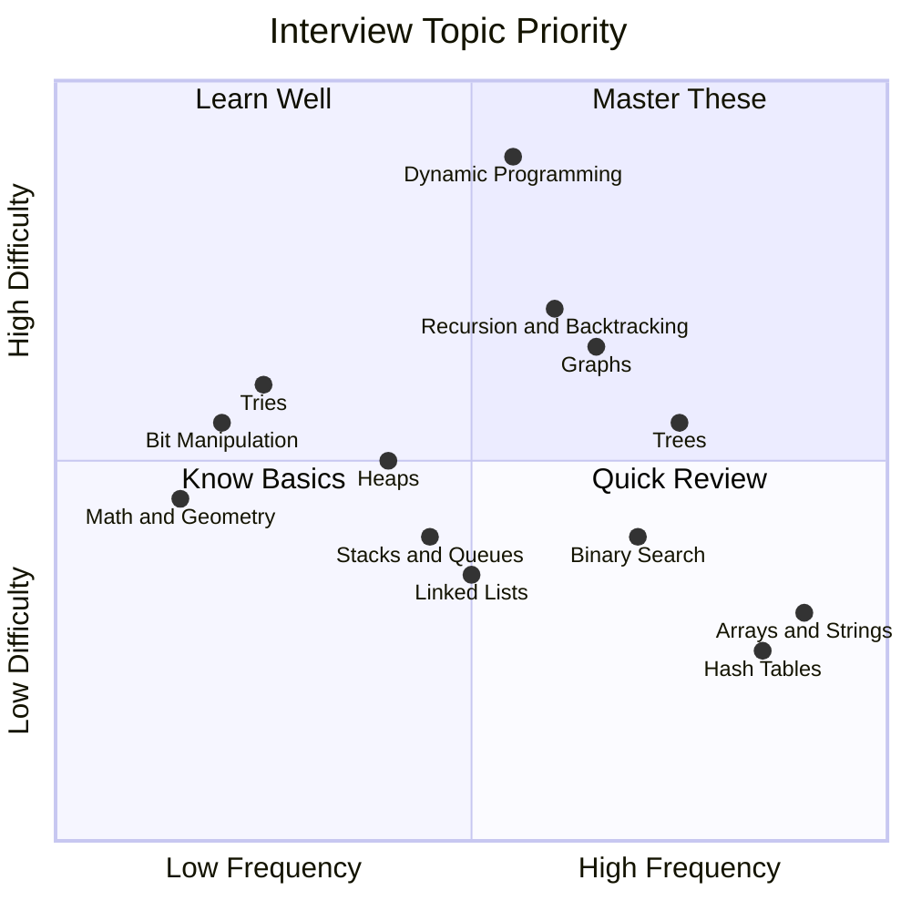

# Fast Track: Rapid Interview Preparation

> **Accelerated preparation when time is limited**

---

## Overview

The Fast Track section is designed for candidates who have **limited preparation time** (typically 1-4 weeks) before their SDE interview. This approach prioritizes high-impact topics and pattern recognition over exhaustive coverage.

### When to Use Fast Track

- **Short notice interview**: You received an interview invitation with 2-4 weeks notice
- **Working professional**: Limited daily study time (1-2 hours) due to current job responsibilities
- **Refresher needed**: You have prior DSA knowledge but need to sharpen skills quickly
- **Final sprint**: Supplementing longer preparation with intensive last-minute review

### What This Section Covers

- Prioritized topic coverage based on interview frequency at top tech companies
- Day-by-day structured study plans
- Essential patterns that solve 80% of problems
- Time-boxed practice strategies
- Mock interview scheduling and feedback loops

---

## Document Structure

| Document | Description | Time Investment |
|----------|-------------|-----------------|
| [index.md](./index.md) | This overview and 2-week plan | 15 min read |
| [week1-foundations.md](./week1-foundations.md) | Day-by-day Week 1 breakdown | 7 days |
| [week2-advanced.md](./week2-advanced.md) | Day-by-day Week 2 breakdown | 7 days |
| [essential-patterns.md](./essential-patterns.md) | Top 10 patterns for rapid prep | 2-3 hours |
| [priority-problems.md](./priority-problems.md) | 50 must-solve problems list | 25-30 hours |
| [mock-interview-guide.md](./mock-interview-guide.md) | How to conduct effective mocks | 1 hour read |
| [day-of-checklist.md](./day-of-checklist.md) | Interview day preparation | 30 min |
| [common-mistakes.md](./common-mistakes.md) | Pitfalls to avoid in fast prep | 20 min read |

---

## The 2-Week Intensive Plan

> **Time commitment**: 3-4 hours daily (21-28 hours/week)
>
> *Research shows completing 5+ technical mock interviews doubles your chances of passing subsequent interviews.*

### Week 1: Foundations

Build structural intuition and master fundamental data structures.

| Day | Focus Area | Topics | Practice Problems | Hours |
|-----|------------|--------|-------------------|-------|
| **Day 1** | Arrays & Strings | Two pointers, sliding window, prefix sums | 5-6 problems | 3-4h |
| **Day 2** | Hash Tables | Frequency counting, two-sum patterns, anagram detection | 5-6 problems | 3-4h |
| **Day 3** | Linked Lists | Reversal, cycle detection, merge operations | 4-5 problems | 3-4h |
| **Day 4** | Stacks & Queues | Monotonic stack, valid parentheses, queue with stacks | 4-5 problems | 3-4h |
| **Day 5** | Binary Trees | Traversals (in/pre/post/level), height, validation | 5-6 problems | 3-4h |
| **Day 6** | Binary Search Trees | Search, insert, delete, lowest common ancestor | 4-5 problems | 3-4h |
| **Day 7** | Review + Mock #1 | Full review, 45-min timed mock interview | 2 problems + mock | 4h |

**Week 1 Goals**:
- Solve 30-35 problems across fundamental data structures
- Complete 1 full mock interview (recorded if possible)
- Build pattern recognition for basic problem types
- Establish consistent daily practice routine

### Week 2: Advanced + Practice

Master complex patterns and simulate real interview conditions.

| Day | Focus Area | Topics | Practice Problems | Hours |
|-----|------------|--------|-------------------|-------|
| **Day 8** | Graphs (BFS/DFS) | Graph traversal, connected components, cycle detection | 5-6 problems | 3-4h |
| **Day 9** | Graphs (Advanced) | Shortest path, topological sort, union-find | 4-5 problems | 3-4h |
| **Day 10** | Recursion & Backtracking | Subsets, permutations, N-Queens, word search | 5-6 problems | 3-4h |
| **Day 11** | Dynamic Programming (Basic) | 1D DP, climbing stairs, house robber, coin change | 5-6 problems | 4h |
| **Day 12** | Dynamic Programming (Advanced) | 2D DP, LCS, edit distance, knapsack variants | 4-5 problems | 4h |
| **Day 13** | Mixed Practice + Mock #2 | Random problems from all topics, full mock | 3 problems + mock | 4h |
| **Day 14** | Final Review + Mock #3 | Weak areas review, final confidence mock | 2 problems + mock | 4h |

**Week 2 Goals**:
- Solve 30-35 additional problems (total: 60-70)
- Complete 3 mock interviews total (at least 1 with a human)
- Master the art of thinking out loud
- Build confidence handling unfamiliar problems

---

## Priority Matrix



### Priority Interpretation

| Quadrant | Strategy | Topics |
|----------|----------|--------|
| **Master These** (Q1) | Deep practice, multiple variations | Trees, Graphs, Binary Search |
| **Learn Well** (Q2) | Understand patterns, practice key problems | DP, Recursion/Backtracking, Heaps |
| **Quick Review** (Q4) | High frequency, low difficulty - quick wins | Arrays, Hash Tables, Strings |
| **Know Basics** (Q3) | Lower priority, cover fundamentals only | Tries, Bit Manipulation, Math |

---

## Essential Patterns to Master

For rapid preparation, focus on these **10 patterns** that appear in 80%+ of technical interviews:

| Pattern | Key Problems | Time to Learn |
|---------|--------------|---------------|
| **1. Two Pointers** | 3Sum, Container With Most Water, Trapping Rain Water | 2 hours |
| **2. Sliding Window** | Longest Substring Without Repeating, Minimum Window Substring | 2 hours |
| **3. Fast & Slow Pointers** | Linked List Cycle, Find Middle, Happy Number | 1 hour |
| **4. Merge Intervals** | Merge Intervals, Insert Interval, Meeting Rooms | 1.5 hours |
| **5. Binary Search Variations** | Search in Rotated Array, Find Peak Element | 2 hours |
| **6. BFS/DFS on Trees** | Level Order Traversal, Maximum Depth, Path Sum | 2 hours |
| **7. BFS/DFS on Graphs** | Number of Islands, Clone Graph, Course Schedule | 3 hours |
| **8. Backtracking** | Subsets, Permutations, Combination Sum | 3 hours |
| **9. Dynamic Programming (1D)** | Climbing Stairs, House Robber, Longest Increasing Subsequence | 3 hours |
| **10. Dynamic Programming (2D)** | Unique Paths, Longest Common Subsequence, Edit Distance | 4 hours |

---

## How to Use This Section

### Navigation Guide

1. **Start here** - Read this index page completely (~15 minutes)
2. **Assess your level** - If you're rusty on basics, begin with [essential-patterns.md](./essential-patterns.md)
3. **Follow the plan** - Use [week1-foundations.md](./week1-foundations.md) and [week2-advanced.md](./week2-advanced.md) as daily guides
4. **Track progress** - Use [priority-problems.md](./priority-problems.md) as your checklist
5. **Practice mocks** - Schedule using [mock-interview-guide.md](./mock-interview-guide.md)
6. **Final prep** - Review [day-of-checklist.md](./day-of-checklist.md) before your interview

### Tips for Success

**Do:**
- Dedicate 3-4 hours daily of focused, uninterrupted practice
- Solve problems by pattern, not randomly
- Always explain your thought process out loud
- Time yourself (35-40 minutes per problem max)
- Review mistakes immediately after each session
- Complete at least 3 mock interviews

**Don't:**
- Rush into complex problems without mastering basics
- Memorize solutions - understand the patterns
- Skip edge case testing
- Practice passively (reading solutions without implementing)
- Ignore communication skills - they matter as much as code

### Leveraging AI Tools (2026 Approach)

Modern preparation can benefit from AI assistance, but use it wisely:

- **Good**: Use AI to explain complex patterns, generate similar practice problems, review your solutions
- **Avoid**: Relying on AI to solve problems for you, skipping the struggle phase of learning
- **Remember**: The interview tests YOUR reasoning, not your ability to prompt an AI

---

## Past Google Fast-Prep Success Stories

### Story 1: The 2-Week Refresh

> *"I requested 2 weeks to get back on track with DSA as a working professional. Google agreed and checked in after 1.5 weeks. My strategy was to first cover breadth - getting hands dirty with all different types of Data Structures and Algorithms."*
>
> **- SDE candidate, 2024** ([Source](https://medium.com/@dinkeymahawar2016/interview-preparation-tifor-google-sde2-5ad7ca7df5f5))

**Key takeaway**: It's acceptable to request preparation time from recruiters. Focus on breadth first when time is limited.

### Story 2: Pattern Recognition Victory

> *"I had 4 virtual on-site rounds back to back in 4 days, nailed them all, and got the offer within 2 weeks. The turning point was finding a structured problem list and committing to solve at least one problem every day."*
>
> **- Google SDE-2, joined 2024** ([Source](https://medium.com/@flick_23/my-journey-to-cracking-google-as-a-software-engineer-2b212de4bfb0))

**Key takeaway**: Consistent daily practice with a structured list beats sporadic intensive sessions.

### Story 3: The Working Professional Strategy

> *"For working professionals with tight schedules, it's more about smart prep rather than long prep. Speaking out loud is key - the interview is not just about getting the code right; it's about brainstorming various approaches."*
>
> **- Google L4, Bosscoder Academy guide** ([Source](https://www.bosscoderacademy.com/blog/google-sde2-interview-questions))

**Key takeaway**: Quality over quantity. Articulate your thinking process during practice.

### Common Threads in Success Stories

1. **Structured approach** beats random LeetCode grinding
2. **Daily consistency** (even 1 hour) beats weekend marathons
3. **Mock interviews** are non-negotiable - aim for 5+ before the real thing
4. **Communication skills** are equally weighted with technical skills
5. **Edge case handling** is what separates good from great candidates

---

## Quick Reference: Daily Checklist

Use this template for each study day:

```
[ ] Review yesterday's weak points (15 min)
[ ] Learn/review one pattern or concept (30 min)
[ ] Solve 2-3 problems with timer (90 min)
[ ] Review solutions and alternatives (30 min)
[ ] Practice explaining one solution out loud (15 min)
[ ] Log what went well and what didn't (10 min)
```

---

## Resources & Further Reading

### Recommended Problem Lists
- **Blind 75**: Essential 75 problems covering all major patterns
- **Grind 75**: Curated progression from Blind 75 creator
- **NeetCode 150**: Expanded list with video explanations
- **TakeUForward SDE Sheet**: Comprehensive Indian tech interview prep

### External Preparation Guides
- [Tech Interview Handbook - Study Plan](https://www.techinterviewhandbook.org/coding-interview-study-plan/)
- [IGotAnOffer - Coding Interview Prep](https://igotanoffer.com/blogs/tech/coding-interview-prep)
- [Interviewing.io - FAANG Guide](https://interviewing.io/guides/hiring-process)

### Books for Quick Reference
- *Cracking the Coding Interview* - Gayle Laakmann McDowell (189 problems)
- *Grokking the Coding Interview* - Educative (pattern-based approach)
- *Elements of Programming Interviews* - Adnan Aziz (comprehensive but dense)

---

## Next Steps

Ready to begin? Start with:

1. **[Week 1 Foundations](./week1-foundations.md)** - Detailed Day 1-7 breakdown
2. **[Essential Patterns](./essential-patterns.md)** - Deep dive into the 10 core patterns
3. **[Priority Problems](./priority-problems.md)** - Your 50-problem checklist

---

*Last updated: January 2026*

*Remember: The goal isn't perfection - it's building enough pattern recognition and communication skills to demonstrate your problem-solving ability under pressure. You've got this!*
