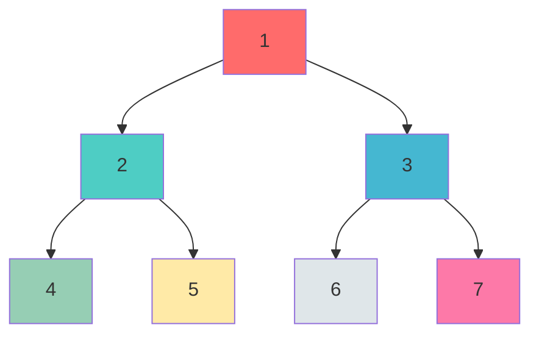

# Linked Lists, Trees & Tries

> **Mastering pointer-based data structures**

---

## Linked List Patterns

### The 4 Essential Techniques

| Technique | Use Case | Time | Space |
|-----------|----------|------|-------|
| **Fast/Slow Pointers** | Cycle detection, find middle | O(n) | O(1) |
| **Dummy Head** | Simplify edge cases (empty list, head changes) | - | O(1) |
| **Reversal** | Reverse entire or partial list | O(n) | O(1) iterative |
| **Merge** | Combine sorted lists | O(n+m) | O(1) |

### Templates

:::code-group

```python [Python]
# 1. Cycle Detection (Floyd's Algorithm)
def has_cycle(head):
    slow = fast = head
    while fast and fast.next:
        slow = slow.next
        fast = fast.next.next
        if slow == fast:
            return True
    return False

# Find cycle start point
def find_cycle_start(head):
    slow = fast = head
    while fast and fast.next:
        slow = slow.next
        fast = fast.next.next
        if slow == fast:
            slow = head
            while slow != fast:
                slow = slow.next
                fast = fast.next
            return slow
    return None

# 2. Dummy Head Pattern
def remove_elements(head, val):
    dummy = ListNode(0)
    dummy.next = head
    curr = dummy
    while curr.next:
        if curr.next.val == val:
            curr.next = curr.next.next
        else:
            curr = curr.next
    return dummy.next

# 3. Reversal - Iterative
def reverse_list(head):
    prev = None
    curr = head
    while curr:
        next_temp = curr.next
        curr.next = prev
        prev = curr
        curr = next_temp
    return prev

# 4. Merge Two Sorted Lists
def merge_two_lists(l1, l2):
    dummy = ListNode(0)
    curr = dummy
    while l1 and l2:
        if l1.val <= l2.val:
            curr.next = l1; l1 = l1.next
        else:
            curr.next = l2; l2 = l2.next
        curr = curr.next
    curr.next = l1 or l2
    return dummy.next

# BONUS: Find Middle Node
def find_middle(head):
    slow = fast = head
    while fast and fast.next:
        slow = slow.next
        fast = fast.next.next
    return slow
```

```java [Java]
// 1. Cycle Detection
boolean hasCycle(ListNode head) {
    ListNode slow = head, fast = head;
    while (fast != null && fast.next != null) {
        slow = slow.next; fast = fast.next.next;
        if (slow == fast) return true;
    }
    return false;
}

// Find cycle start point
ListNode findCycleStart(ListNode head) {
    ListNode slow = head, fast = head;
    while (fast != null && fast.next != null) {
        slow = slow.next; fast = fast.next.next;
        if (slow == fast) {
            slow = head;
            while (slow != fast) { slow = slow.next; fast = fast.next; }
            return slow;
        }
    }
    return null;
}

// 2. Dummy Head Pattern
ListNode removeElements(ListNode head, int val) {
    ListNode dummy = new ListNode(0); dummy.next = head;
    ListNode curr = dummy;
    while (curr.next != null) {
        if (curr.next.val == val) curr.next = curr.next.next;
        else curr = curr.next;
    }
    return dummy.next;
}

// 3. Reversal - Iterative
ListNode reverseList(ListNode head) {
    ListNode prev = null, curr = head;
    while (curr != null) {
        ListNode next = curr.next; curr.next = prev; prev = curr; curr = next;
    }
    return prev;
}

// 4. Merge Two Sorted Lists
ListNode mergeTwoLists(ListNode l1, ListNode l2) {
    ListNode dummy = new ListNode(0), curr = dummy;
    while (l1 != null && l2 != null) {
        if (l1.val <= l2.val) { curr.next = l1; l1 = l1.next; }
        else { curr.next = l2; l2 = l2.next; }
        curr = curr.next;
    }
    curr.next = (l1 != null) ? l1 : l2;
    return dummy.next;
}

// BONUS: Find Middle Node
ListNode findMiddle(ListNode head) {
    ListNode slow = head, fast = head;
    while (fast != null && fast.next != null) { slow = slow.next; fast = fast.next.next; }
    return slow;
}
```

:::

::: info Complexity: Time O(n) · Space O(1)
- **Time:** Each operation traverses the list at most once
- **Space:** All operations use only pointer variables
:::

---

## Tree Traversals

### DFS vs BFS Visual



| Traversal | Order | Result | Use Case |
|-----------|-------|--------|----------|
| **Preorder** | Root -> Left -> Right | 1,2,4,5,3,6,7 | Copy tree, serialize |
| **Inorder** | Left -> Root -> Right | 4,2,5,1,6,3,7 | BST sorted order |
| **Postorder** | Left -> Right -> Root | 4,5,2,6,7,3,1 | Delete tree, evaluate |
| **Level-order** | Top to Bottom, Left to Right | 1,2,3,4,5,6,7 | BFS, shortest path |

### Recursive Implementations

:::code-group

```python [Python]
# Preorder: Root -> Left -> Right
def preorder_recursive(root, result=None):
    if result is None: result = []
    if root:
        result.append(root.val)
        preorder_recursive(root.left, result)
        preorder_recursive(root.right, result)
    return result

# Inorder: Left -> Root -> Right
def inorder_recursive(root, result=None):
    if result is None: result = []
    if root:
        inorder_recursive(root.left, result)
        result.append(root.val)
        inorder_recursive(root.right, result)
    return result

# Postorder: Left -> Right -> Root
def postorder_recursive(root, result=None):
    if result is None: result = []
    if root:
        postorder_recursive(root.left, result)
        postorder_recursive(root.right, result)
        result.append(root.val)
    return result
```

```java [Java]
List<Integer> preorderRecursive(TreeNode root) {
    List<Integer> result = new ArrayList<>();
    preorderHelper(root, result); return result;
}
void preorderHelper(TreeNode node, List<Integer> result) {
    if (node == null) return;
    result.add(node.val); preorderHelper(node.left, result); preorderHelper(node.right, result);
}

List<Integer> inorderRecursive(TreeNode root) {
    List<Integer> result = new ArrayList<>();
    inorderHelper(root, result); return result;
}
void inorderHelper(TreeNode node, List<Integer> result) {
    if (node == null) return;
    inorderHelper(node.left, result); result.add(node.val); inorderHelper(node.right, result);
}

List<Integer> postorderRecursive(TreeNode root) {
    List<Integer> result = new ArrayList<>();
    postorderHelper(root, result); return result;
}
void postorderHelper(TreeNode node, List<Integer> result) {
    if (node == null) return;
    postorderHelper(node.left, result); postorderHelper(node.right, result); result.add(node.val);
}
```

:::

::: info Complexity: Time O(n) · Space O(n)
- **Time:** Visit each node exactly once
- **Space:** Result list stores n values; recursion uses O(h) call stack where h is tree height
:::

### Iterative Implementations (Using Stack)

:::code-group

```python [Python]
# Preorder - Iterative
def preorder_iterative(root):
    if not root: return []
    result, stack = [], [root]
    while stack:
        node = stack.pop()
        result.append(node.val)
        if node.right: stack.append(node.right)
        if node.left: stack.append(node.left)
    return result

# Inorder - Iterative
def inorder_iterative(root):
    result, stack, curr = [], [], root
    while curr or stack:
        while curr:
            stack.append(curr); curr = curr.left
        curr = stack.pop()
        result.append(curr.val)
        curr = curr.right
    return result

# Postorder - Iterative (Two Stack Method)
def postorder_iterative(root):
    if not root: return []
    result, stack1, stack2 = [], [root], []
    while stack1:
        node = stack1.pop(); stack2.append(node)
        if node.left: stack1.append(node.left)
        if node.right: stack1.append(node.right)
    while stack2: result.append(stack2.pop().val)
    return result
```

```java [Java]
// Preorder - Iterative
List<Integer> preorderIterative(TreeNode root) {
    List<Integer> result = new ArrayList<>();
    if (root == null) return result;
    Deque<TreeNode> stack = new ArrayDeque<>(); stack.push(root);
    while (!stack.isEmpty()) {
        TreeNode node = stack.pop(); result.add(node.val);
        if (node.right != null) stack.push(node.right);
        if (node.left != null) stack.push(node.left);
    }
    return result;
}

// Inorder - Iterative
List<Integer> inorderIterative(TreeNode root) {
    List<Integer> result = new ArrayList<>();
    Deque<TreeNode> stack = new ArrayDeque<>();
    TreeNode curr = root;
    while (curr != null || !stack.isEmpty()) {
        while (curr != null) { stack.push(curr); curr = curr.left; }
        curr = stack.pop(); result.add(curr.val); curr = curr.right;
    }
    return result;
}

// Postorder - Iterative (Two Stack Method)
List<Integer> postorderIterative(TreeNode root) {
    List<Integer> result = new ArrayList<>();
    if (root == null) return result;
    Deque<TreeNode> s1 = new ArrayDeque<>(), s2 = new ArrayDeque<>();
    s1.push(root);
    while (!s1.isEmpty()) {
        TreeNode node = s1.pop(); s2.push(node);
        if (node.left != null) s1.push(node.left);
        if (node.right != null) s1.push(node.right);
    }
    while (!s2.isEmpty()) result.add(s2.pop().val);
    return result;
}
```

:::

::: info Complexity: Time O(n) · Space O(n)
- **Time:** Visit each node exactly once
- **Space:** Stack holds at most O(h) nodes; result list stores n values
:::

### BFS Template (Level-Order Traversal)

:::code-group

```python [Python]
from collections import deque

def bfs(root):
    if not root: return []
    queue, result = deque([root]), []
    while queue:
        node = queue.popleft(); result.append(node.val)
        if node.left: queue.append(node.left)
        if node.right: queue.append(node.right)
    return result

# Level-by-Level (returns list of lists)
def level_order(root):
    if not root: return []
    result, queue = [], deque([root])
    while queue:
        level_size = len(queue); current_level = []
        for _ in range(level_size):
            node = queue.popleft(); current_level.append(node.val)
            if node.left: queue.append(node.left)
            if node.right: queue.append(node.right)
        result.append(current_level)
    return result
```

```java [Java]
List<Integer> bfs(TreeNode root) {
    List<Integer> result = new ArrayList<>();
    if (root == null) return result;
    Deque<TreeNode> queue = new ArrayDeque<>(); queue.offer(root);
    while (!queue.isEmpty()) {
        TreeNode node = queue.poll(); result.add(node.val);
        if (node.left != null) queue.offer(node.left);
        if (node.right != null) queue.offer(node.right);
    }
    return result;
}

// Level-by-Level
List<List<Integer>> levelOrder(TreeNode root) {
    List<List<Integer>> result = new ArrayList<>();
    if (root == null) return result;
    Deque<TreeNode> queue = new ArrayDeque<>(); queue.offer(root);
    while (!queue.isEmpty()) {
        int size = queue.size(); List<Integer> level = new ArrayList<>();
        for (int i = 0; i < size; i++) {
            TreeNode node = queue.poll(); level.add(node.val);
            if (node.left != null) queue.offer(node.left);
            if (node.right != null) queue.offer(node.right);
        }
        result.add(level);
    }
    return result;
}
```

:::

::: info Complexity: Time O(n) · Space O(w)
- **Time:** Visit each node exactly once
- **Space:** Queue holds at most O(w) nodes where w is maximum tree width
:::

### Complexity Analysis

| Traversal | Time | Space (Recursive) | Space (Iterative) |
|-----------|------|-------------------|-------------------|
| DFS (all) | O(n) | O(h) call stack | O(h) explicit stack |
| BFS | O(n) | N/A | O(w) queue width |

- **h** = height of tree (log n for balanced, n for skewed)
- **w** = maximum width of tree

---

## Binary Search Tree (BST)

### BST Property

```
     8
    / \
   3   10
  / \    \
 1   6    14
    / \   /
   4   7 13
```

**Key Property**: For any node, all values in left subtree < node < all values in right subtree

**Inorder traversal of BST gives sorted order**: 1, 3, 4, 6, 7, 8, 10, 13, 14

### Common Operations

:::code-group

```python [Python]
# Search in BST - O(h)
def search_bst(root, val):
    if not root or root.val == val: return root
    if val < root.val: return search_bst(root.left, val)
    return search_bst(root.right, val)

# Insert into BST - O(h)
def insert_bst(root, val):
    if not root: return TreeNode(val)
    if val < root.val: root.left = insert_bst(root.left, val)
    else: root.right = insert_bst(root.right, val)
    return root

# Delete from BST - O(h)
def delete_bst(root, key):
    if not root: return None
    if key < root.val: root.left = delete_bst(root.left, key)
    elif key > root.val: root.right = delete_bst(root.right, key)
    else:
        if not root.left: return root.right
        if not root.right: return root.left
        successor = find_min(root.right)
        root.val = successor.val
        root.right = delete_bst(root.right, successor.val)
    return root

def find_min(node):
    while node.left: node = node.left
    return node
```

```java [Java]
// Search in BST
TreeNode searchBST(TreeNode root, int val) {
    if (root == null || root.val == val) return root;
    return val < root.val ? searchBST(root.left, val) : searchBST(root.right, val);
}

// Insert into BST
TreeNode insertBST(TreeNode root, int val) {
    if (root == null) return new TreeNode(val);
    if (val < root.val) root.left = insertBST(root.left, val);
    else root.right = insertBST(root.right, val);
    return root;
}

// Delete from BST
TreeNode deleteBST(TreeNode root, int key) {
    if (root == null) return null;
    if (key < root.val) root.left = deleteBST(root.left, key);
    else if (key > root.val) root.right = deleteBST(root.right, key);
    else {
        if (root.left == null) return root.right;
        if (root.right == null) return root.left;
        TreeNode successor = root.right;
        while (successor.left != null) successor = successor.left;
        root.val = successor.val;
        root.right = deleteBST(root.right, successor.val);
    }
    return root;
}
```

:::

::: info Complexity: Time O(h) · Space O(h)
- **Time:** Operations traverse at most the height of the tree
- **Space:** Recursive call stack depth is O(h) where h = log n for balanced, n for skewed
:::

### Validate BST

:::code-group

```python [Python]
def is_valid_bst(root, min_val=float('-inf'), max_val=float('inf')):
    if not root: return True
    if root.val <= min_val or root.val >= max_val: return False
    return (is_valid_bst(root.left, min_val, root.val) and
            is_valid_bst(root.right, root.val, max_val))

# Alternative: Inorder should be strictly increasing
def is_valid_bst_inorder(root):
    stack, prev, curr = [], float('-inf'), root
    while curr or stack:
        while curr: stack.append(curr); curr = curr.left
        curr = stack.pop()
        if curr.val <= prev: return False
        prev = curr.val; curr = curr.right
    return True
```

```java [Java]
boolean isValidBST(TreeNode root) { return validateBST(root, Long.MIN_VALUE, Long.MAX_VALUE); }
boolean validateBST(TreeNode node, long min, long max) {
    if (node == null) return true;
    if (node.val <= min || node.val >= max) return false;
    return validateBST(node.left, min, node.val) && validateBST(node.right, node.val, max);
}

// Alternative: Iterative inorder
boolean isValidBSTInorder(TreeNode root) {
    Deque<TreeNode> stack = new ArrayDeque<>();
    long prev = Long.MIN_VALUE; TreeNode curr = root;
    while (curr != null || !stack.isEmpty()) {
        while (curr != null) { stack.push(curr); curr = curr.left; }
        curr = stack.pop();
        if (curr.val <= prev) return false;
        prev = curr.val; curr = curr.right;
    }
    return true;
}
```

:::

::: info Complexity: Time O(n) · Space O(h)
- **Time:** Visit each node at most once
- **Space:** Recursion depth is O(h); iterative version uses O(h) stack space
:::

### Lowest Common Ancestor (LCA) in BST

:::code-group

```python [Python]
def lca_bst(root, p, q):
    while root:
        if p.val < root.val and q.val < root.val:
            root = root.left
        elif p.val > root.val and q.val > root.val:
            root = root.right
        else:
            return root
    return None
```

```java [Java]
TreeNode lcaBST(TreeNode root, TreeNode p, TreeNode q) {
    while (root != null) {
        if (p.val < root.val && q.val < root.val) root = root.left;
        else if (p.val > root.val && q.val > root.val) root = root.right;
        else return root;
    }
    return null;
}
```

:::

::: info Complexity: Time O(h) · Space O(1)
- **Time:** Traverse at most the height of the tree
- **Space:** Iterative approach uses constant space
:::

---

## Trie (Prefix Tree)

### When to Use Trie

| Application | Why Trie? |
|-------------|-----------|
| **Autocomplete** | Find all words with given prefix |
| **Spell Checker** | Check if word exists, suggest corrections |
| **IP Routing** | Longest prefix matching |
| **Word Games** | Validate words, find patterns |
| **Search Engines** | Query suggestions, prefix matching |

### Trie Structure

```
          (root)
         /  |  \
        a   b   c
       /    |
      p     a
     / \    |
    p   e   t     <- 'bat' ends here
    |       |
    l       h
    |
    e       <- 'apple', 'ape' end here
```

### Complete Implementation

:::code-group

```python [Python]
class TrieNode:
    def __init__(self):
        self.children = {}  # char -> TrieNode
        self.is_end = False

class Trie:
    def __init__(self):
        self.root = TrieNode()

    def insert(self, word: str) -> None:
        node = self.root
        for char in word:
            if char not in node.children:
                node.children[char] = TrieNode()
            node = node.children[char]
        node.is_end = True

    def search(self, word: str) -> bool:
        node = self._find_node(word)
        return node is not None and node.is_end

    def starts_with(self, prefix: str) -> bool:
        return self._find_node(prefix) is not None

    def _find_node(self, prefix: str) -> TrieNode:
        node = self.root
        for char in prefix:
            if char not in node.children: return None
            node = node.children[char]
        return node
```

```java [Java]
class Trie {
    private static class TrieNode {
        Map<Character, TrieNode> children = new HashMap<>();
        boolean isEnd = false;
    }
    private final TrieNode root = new TrieNode();

    public void insert(String word) {
        TrieNode node = root;
        for (char c : word.toCharArray()) {
            node.children.putIfAbsent(c, new TrieNode());
            node = node.children.get(c);
        }
        node.isEnd = true;
    }

    public boolean search(String word) {
        TrieNode node = findNode(word);
        return node != null && node.isEnd;
    }

    public boolean startsWith(String prefix) {
        return findNode(prefix) != null;
    }

    private TrieNode findNode(String prefix) {
        TrieNode node = root;
        for (char c : prefix.toCharArray()) {
            if (!node.children.containsKey(c)) return null;
            node = node.children.get(c);
        }
        return node;
    }
}
```

:::

::: info Complexity: Time O(L) · Space O(L) per word
- **Time:** Each operation traverses the length of the word/prefix
- **Space:** Each inserted word can add up to L new nodes
:::

### Autocomplete Feature

:::code-group

```python [Python]
def autocomplete(self, prefix: str) -> list:
    node = self._find_node(prefix)
    if not node: return []
    results = []
    self._dfs_collect(node, prefix, results)
    return results

def _dfs_collect(self, node: TrieNode, path: str, results: list) -> None:
    if node.is_end: results.append(path)
    for char, child in node.children.items():
        self._dfs_collect(child, path + char, results)
```

```java [Java]
List<String> autocomplete(String prefix) {
    TrieNode node = findNode(prefix);
    List<String> results = new ArrayList<>();
    if (node != null) dfsCollect(node, new StringBuilder(prefix), results);
    return results;
}
void dfsCollect(TrieNode node, StringBuilder path, List<String> results) {
    if (node.isEnd) results.add(path.toString());
    for (Map.Entry<Character, TrieNode> e : node.children.entrySet()) {
        path.append(e.getKey());
        dfsCollect(e.getValue(), path, results);
        path.deleteCharAt(path.length() - 1);
    }
}
```

:::

::: info Complexity: Time O(L + K) · Space O(K)
- **Time:** O(L) to reach prefix node, O(K) to collect K matching words
- **Space:** Results list stores K matching words
:::

### Word Search with Wildcards

:::code-group

```python [Python]
def search_with_wildcard(self, word: str) -> bool:
    """Support '.' as wildcard matching any character"""

    def dfs(node, index):
        if index == len(word): return node.is_end
        char = word[index]
        if char == '.':
            for child in node.children.values():
                if dfs(child, index + 1): return True
            return False
        else:
            if char not in node.children: return False
            return dfs(node.children[char], index + 1)

    return dfs(self.root, 0)
```

```java [Java]
boolean searchWithWildcard(String word) { return wildcardDFS(root, word, 0); }
boolean wildcardDFS(TrieNode node, String word, int idx) {
    if (idx == word.length()) return node.isEnd;
    char c = word.charAt(idx);
    if (c == '.') {
        for (TrieNode child : node.children.values())
            if (wildcardDFS(child, word, idx + 1)) return true;
        return false;
    }
    if (!node.children.containsKey(c)) return false;
    return wildcardDFS(node.children.get(c), word, idx + 1);
}
```

:::

::: info Complexity: Time O(L) to O(26^L) · Space O(L)
- **Time:** O(L) without wildcards; worst case O(26^L) if all wildcards
- **Space:** Recursion depth is O(L) for word length L
:::

### Complexity Analysis

| Operation | Time | Space |
|-----------|------|-------|
| Insert | O(L) | O(L) per word |
| Search | O(L) | O(1) |
| StartsWith | O(L) | O(1) |
| Autocomplete | O(L + K) | O(K) results |

- **L** = length of word/prefix
- **K** = number of matching words

### Trie vs HashSet

| Aspect | Trie | HashSet |
|--------|------|---------|
| Prefix search | O(L) | O(n * L) |
| Exact search | O(L) | O(L) |
| Space | O(ALPHABET * L * n) | O(L * n) |
| Autocomplete | Native support | Not supported |

---

## Interview Applications

### Common Problem Patterns

| Problem | Data Structure | Key Insight |
|---------|---------------|-------------|
| LRU Cache | Linked List + HashMap | O(1) operations with doubly linked list |
| Serialize Tree | Tree Traversal | Preorder with null markers |
| Word Search II | Trie + Backtracking | Build trie from word list, DFS on board |
| Design Search Autocomplete | Trie + Priority Queue | Store frequencies, return top-k |
| Merge K Sorted Lists | Linked List + Heap | Min heap for efficient minimum |
| Flatten Nested List | Tree/Stack | Treat as tree, iterative with stack |

### Google-Style Questions

1. **Search Autocomplete System** (Trie + Top-K)
   - Design autocomplete for search box
   - Support: insert sentence, get top 3 suggestions

2. **Serialize/Deserialize Binary Tree** (DFS)
   - Convert tree to string and back
   - Handle null nodes explicitly

3. **LRU Cache** (Doubly Linked List + HashMap)
   - O(1) get and put operations
   - Evict least recently used on capacity

4. **Word Search II** (Trie + Backtracking)
   - Find all dictionary words in a board
   - Optimize with trie prefix pruning

### Quick Reference Card

```
Linked List:
  - Cycle? -> Fast/Slow pointers
  - Edge cases? -> Dummy head
  - Reverse? -> Three pointers (prev, curr, next)
  - Merge? -> Two pointers + dummy

Trees:
  - Path problems -> DFS (preorder/postorder)
  - Level problems -> BFS
  - BST validation -> Inorder should be sorted
  - LCA in BST -> Compare values, go left/right

Trie:
  - Prefix matching -> Trie over HashSet
  - Multiple string search -> Build trie once
  - Autocomplete -> DFS from prefix node
```

---

## References

- [Tree Traversal - Wikipedia](https://en.wikipedia.org/wiki/Tree_traversal)
- [Tree Traversal: In-Order, Pre-Order, Post-Order | Skilled.dev](https://skilled.dev/course/tree-traversal-in-order-pre-order-post-order)
- [Binary Tree Traversal: DFS and BFS Techniques | Launch School](https://launchschool.com/books/advanced_dsa/read/binary_tree_traversal)
- [Tree Traversal Techniques - GeeksforGeeks](https://www.geeksforgeeks.org/dsa/tree-traversals-inorder-preorder-and-postorder/)
- [Binary Tree Traversals Demystified 2025](https://algorithmangle.com/binary-tree-traversals/)
- [Trie Data Structure: Complete Guide | Codecademy](https://www.codecademy.com/article/trie-data-structure-complete-guide-to-prefix-trees)
- [Implement Trie (Prefix Tree) - LeetCode 208](https://leetcode.com/problems/implement-trie-prefix-tree/)
- [Implementing Trie with Auto-Completion in Python](https://llego.dev/posts/implementing-trie-auto-completion-python-step-step-guide/)
- [Trie Data Structure - GeeksforGeeks](https://www.geeksforgeeks.org/dsa/trie-insert-and-search/)
