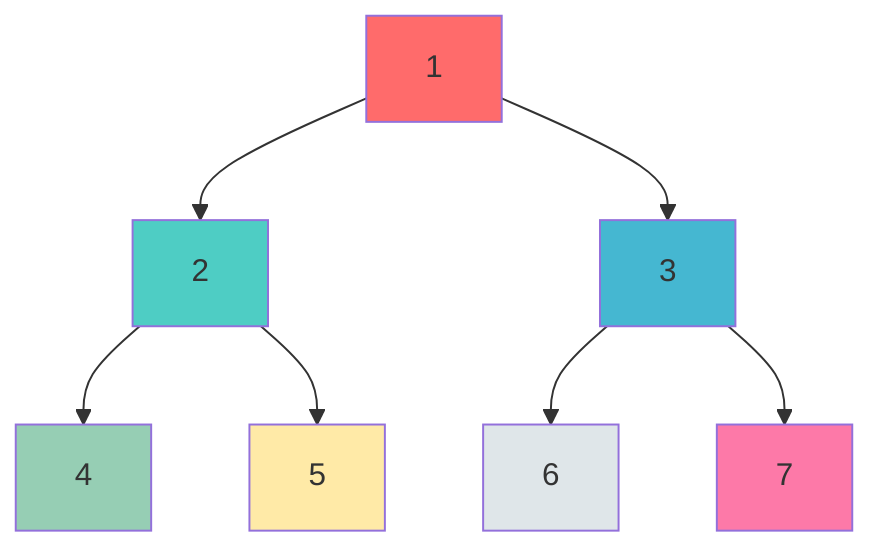

# Linked Lists, Trees & Tries

> **Mastering pointer-based data structures**

---

## Linked List Patterns

### The 4 Essential Techniques

| Technique | Use Case | Time | Space |
|-----------|----------|------|-------|
| **Fast/Slow Pointers** | Cycle detection, find middle | O(n) | O(1) |
| **Dummy Head** | Simplify edge cases (empty list, head changes) | - | O(1) |
| **Reversal** | Reverse entire or partial list | O(n) | O(1) iterative |
| **Merge** | Combine sorted lists | O(n+m) | O(1) |

### Templates

```python
# 1. Cycle Detection (Floyd's Algorithm)
def has_cycle(head):
    slow = fast = head
    while fast and fast.next:
        slow = slow.next
        fast = fast.next.next
        if slow == fast:
            return True
    return False

# Find cycle start point
def find_cycle_start(head):
    slow = fast = head
    while fast and fast.next:
        slow = slow.next
        fast = fast.next.next
        if slow == fast:
            # Reset slow to head, move both at same speed
            slow = head
            while slow != fast:
                slow = slow.next
                fast = fast.next
            return slow
    return None
```

```python
# 2. Dummy Head Pattern
def remove_elements(head, val):
    dummy = ListNode(0)
    dummy.next = head
    curr = dummy

    while curr.next:
        if curr.next.val == val:
            curr.next = curr.next.next
        else:
            curr = curr.next

    return dummy.next
```

```python
# 3. Reversal - Iterative
def reverse_list(head):
    prev = None
    curr = head

    while curr:
        next_temp = curr.next
        curr.next = prev
        prev = curr
        curr = next_temp

    return prev

# 3. Reversal - Recursive
def reverse_list_recursive(head):
    if not head or not head.next:
        return head

    new_head = reverse_list_recursive(head.next)
    head.next.next = head
    head.next = None

    return new_head
```

```python
# 4. Merge Two Sorted Lists
def merge_two_lists(l1, l2):
    dummy = ListNode(0)
    curr = dummy

    while l1 and l2:
        if l1.val <= l2.val:
            curr.next = l1
            l1 = l1.next
        else:
            curr.next = l2
            l2 = l2.next
        curr = curr.next

    curr.next = l1 or l2
    return dummy.next
```

```python
# BONUS: Find Middle Node
def find_middle(head):
    slow = fast = head
    while fast and fast.next:
        slow = slow.next
        fast = fast.next.next
    return slow  # Middle (or second middle if even)
```

---

## Tree Traversals

### DFS vs BFS Visual



| Traversal | Order | Result | Use Case |
|-----------|-------|--------|----------|
| **Preorder** | Root -> Left -> Right | 1,2,4,5,3,6,7 | Copy tree, serialize |
| **Inorder** | Left -> Root -> Right | 4,2,5,1,6,3,7 | BST sorted order |
| **Postorder** | Left -> Right -> Root | 4,5,2,6,7,3,1 | Delete tree, evaluate |
| **Level-order** | Top to Bottom, Left to Right | 1,2,3,4,5,6,7 | BFS, shortest path |

### Recursive Implementations

```python
class TreeNode:
    def __init__(self, val=0, left=None, right=None):
        self.val = val
        self.left = left
        self.right = right

# Preorder: Root -> Left -> Right
def preorder_recursive(root, result=None):
    if result is None:
        result = []
    if root:
        result.append(root.val)          # Process root
        preorder_recursive(root.left, result)
        preorder_recursive(root.right, result)
    return result

# Inorder: Left -> Root -> Right
def inorder_recursive(root, result=None):
    if result is None:
        result = []
    if root:
        inorder_recursive(root.left, result)
        result.append(root.val)          # Process root
        inorder_recursive(root.right, result)
    return result

# Postorder: Left -> Right -> Root
def postorder_recursive(root, result=None):
    if result is None:
        result = []
    if root:
        postorder_recursive(root.left, result)
        postorder_recursive(root.right, result)
        result.append(root.val)          # Process root
    return result
```

### Iterative Implementations (Using Stack)

```python
# Preorder - Iterative
def preorder_iterative(root):
    if not root:
        return []

    result = []
    stack = [root]

    while stack:
        node = stack.pop()
        result.append(node.val)
        # Push right first so left is processed first
        if node.right:
            stack.append(node.right)
        if node.left:
            stack.append(node.left)

    return result

# Inorder - Iterative
def inorder_iterative(root):
    result = []
    stack = []
    curr = root

    while curr or stack:
        # Go to leftmost node
        while curr:
            stack.append(curr)
            curr = curr.left

        curr = stack.pop()
        result.append(curr.val)
        curr = curr.right

    return result

# Postorder - Iterative (Two Stack Method)
def postorder_iterative(root):
    if not root:
        return []

    result = []
    stack1 = [root]
    stack2 = []

    while stack1:
        node = stack1.pop()
        stack2.append(node)
        if node.left:
            stack1.append(node.left)
        if node.right:
            stack1.append(node.right)

    while stack2:
        result.append(stack2.pop().val)

    return result

# Postorder - Single Stack (Reversed Preorder approach)
def postorder_single_stack(root):
    if not root:
        return []

    result = []
    stack = [root]

    while stack:
        node = stack.pop()
        result.append(node.val)
        if node.left:
            stack.append(node.left)
        if node.right:
            stack.append(node.right)

    return result[::-1]  # Reverse the result
```

### BFS Template (Level-Order Traversal)

```python
from collections import deque

def bfs(root):
    if not root:
        return []

    queue = deque([root])
    result = []

    while queue:
        node = queue.popleft()
        result.append(node.val)

        if node.left:
            queue.append(node.left)
        if node.right:
            queue.append(node.right)

    return result

# Level-by-Level (returns list of lists)
def level_order(root):
    if not root:
        return []

    result = []
    queue = deque([root])

    while queue:
        level_size = len(queue)
        current_level = []

        for _ in range(level_size):
            node = queue.popleft()
            current_level.append(node.val)

            if node.left:
                queue.append(node.left)
            if node.right:
                queue.append(node.right)

        result.append(current_level)

    return result
```

### Complexity Analysis

| Traversal | Time | Space (Recursive) | Space (Iterative) |
|-----------|------|-------------------|-------------------|
| DFS (all) | O(n) | O(h) call stack | O(h) explicit stack |
| BFS | O(n) | N/A | O(w) queue width |

- **h** = height of tree (log n for balanced, n for skewed)
- **w** = maximum width of tree

---

## Binary Search Tree (BST)

### BST Property

```
     8
    / \
   3   10
  / \    \
 1   6    14
    / \   /
   4   7 13
```

**Key Property**: For any node, all values in left subtree < node < all values in right subtree

**Inorder traversal of BST gives sorted order**: 1, 3, 4, 6, 7, 8, 10, 13, 14

### Common Operations

```python
# Search in BST - O(h)
def search_bst(root, val):
    if not root or root.val == val:
        return root

    if val < root.val:
        return search_bst(root.left, val)
    return search_bst(root.right, val)

# Insert into BST - O(h)
def insert_bst(root, val):
    if not root:
        return TreeNode(val)

    if val < root.val:
        root.left = insert_bst(root.left, val)
    else:
        root.right = insert_bst(root.right, val)

    return root

# Delete from BST - O(h)
def delete_bst(root, key):
    if not root:
        return None

    if key < root.val:
        root.left = delete_bst(root.left, key)
    elif key > root.val:
        root.right = delete_bst(root.right, key)
    else:
        # Node found - handle 3 cases
        # Case 1 & 2: One or no child
        if not root.left:
            return root.right
        if not root.right:
            return root.left

        # Case 3: Two children - find inorder successor
        successor = find_min(root.right)
        root.val = successor.val
        root.right = delete_bst(root.right, successor.val)

    return root

def find_min(node):
    while node.left:
        node = node.left
    return node
```

### Validate BST

```python
def is_valid_bst(root, min_val=float('-inf'), max_val=float('inf')):
    if not root:
        return True

    if root.val <= min_val or root.val >= max_val:
        return False

    return (is_valid_bst(root.left, min_val, root.val) and
            is_valid_bst(root.right, root.val, max_val))

# Alternative: Inorder should be strictly increasing
def is_valid_bst_inorder(root):
    stack = []
    prev = float('-inf')
    curr = root

    while curr or stack:
        while curr:
            stack.append(curr)
            curr = curr.left

        curr = stack.pop()
        if curr.val <= prev:
            return False
        prev = curr.val
        curr = curr.right

    return True
```

### Lowest Common Ancestor (LCA) in BST

```python
def lca_bst(root, p, q):
    while root:
        if p.val < root.val and q.val < root.val:
            root = root.left
        elif p.val > root.val and q.val > root.val:
            root = root.right
        else:
            return root
    return None
```

---

## Trie (Prefix Tree)

### When to Use Trie

| Application | Why Trie? |
|-------------|-----------|
| **Autocomplete** | Find all words with given prefix |
| **Spell Checker** | Check if word exists, suggest corrections |
| **IP Routing** | Longest prefix matching |
| **Word Games** | Validate words, find patterns |
| **Search Engines** | Query suggestions, prefix matching |

### Trie Structure

```
          (root)
         /  |  \
        a   b   c
       /    |
      p     a
     / \    |
    p   e   t     <- 'bat' ends here
    |       |
    l       h
    |
    e       <- 'apple', 'ape' end here
```

### Complete Implementation

```python
class TrieNode:
    def __init__(self):
        self.children = {}  # char -> TrieNode
        self.is_end = False  # marks end of word

class Trie:
    def __init__(self):
        self.root = TrieNode()

    def insert(self, word: str) -> None:
        """Insert a word into the trie. O(L) where L = len(word)"""
        node = self.root
        for char in word:
            if char not in node.children:
                node.children[char] = TrieNode()
            node = node.children[char]
        node.is_end = True

    def search(self, word: str) -> bool:
        """Return True if word is in trie. O(L)"""
        node = self._find_node(word)
        return node is not None and node.is_end

    def starts_with(self, prefix: str) -> bool:
        """Return True if any word starts with prefix. O(L)"""
        return self._find_node(prefix) is not None

    def _find_node(self, prefix: str) -> TrieNode:
        """Helper: traverse to node at end of prefix"""
        node = self.root
        for char in prefix:
            if char not in node.children:
                return None
            node = node.children[char]
        return node
```

### Autocomplete Feature

```python
def autocomplete(self, prefix: str) -> list:
    """Return all words starting with prefix"""
    node = self._find_node(prefix)
    if not node:
        return []

    results = []
    self._dfs_collect(node, prefix, results)
    return results

def _dfs_collect(self, node: TrieNode, path: str, results: list) -> None:
    """DFS to collect all words from current node"""
    if node.is_end:
        results.append(path)

    for char, child in node.children.items():
        self._dfs_collect(child, path + char, results)
```

### Word Search with Wildcards

```python
def search_with_wildcard(self, word: str) -> bool:
    """Support '.' as wildcard matching any character"""

    def dfs(node, index):
        if index == len(word):
            return node.is_end

        char = word[index]
        if char == '.':
            # Try all possible children
            for child in node.children.values():
                if dfs(child, index + 1):
                    return True
            return False
        else:
            if char not in node.children:
                return False
            return dfs(node.children[char], index + 1)

    return dfs(self.root, 0)
```

### Complexity Analysis

| Operation | Time | Space |
|-----------|------|-------|
| Insert | O(L) | O(L) per word |
| Search | O(L) | O(1) |
| StartsWith | O(L) | O(1) |
| Autocomplete | O(L + K) | O(K) results |

- **L** = length of word/prefix
- **K** = number of matching words

### Trie vs HashSet

| Aspect | Trie | HashSet |
|--------|------|---------|
| Prefix search | O(L) | O(n * L) |
| Exact search | O(L) | O(L) |
| Space | O(ALPHABET * L * n) | O(L * n) |
| Autocomplete | Native support | Not supported |

---

## Google Interview Applications

### Common Problem Patterns

| Problem | Data Structure | Key Insight |
|---------|---------------|-------------|
| LRU Cache | Linked List + HashMap | O(1) operations with doubly linked list |
| Serialize Tree | Tree Traversal | Preorder with null markers |
| Word Search II | Trie + Backtracking | Build trie from word list, DFS on board |
| Design Search Autocomplete | Trie + Priority Queue | Store frequencies, return top-k |
| Merge K Sorted Lists | Linked List + Heap | Min heap for efficient minimum |
| Flatten Nested List | Tree/Stack | Treat as tree, iterative with stack |

### Google-Style Questions

1. **Search Autocomplete System** (Trie + Top-K)
   - Design autocomplete for search box
   - Support: insert sentence, get top 3 suggestions

2. **Serialize/Deserialize Binary Tree** (DFS)
   - Convert tree to string and back
   - Handle null nodes explicitly

3. **LRU Cache** (Doubly Linked List + HashMap)
   - O(1) get and put operations
   - Evict least recently used on capacity

4. **Word Search II** (Trie + Backtracking)
   - Find all dictionary words in a board
   - Optimize with trie prefix pruning

### Quick Reference Card

```
Linked List:
  - Cycle? -> Fast/Slow pointers
  - Edge cases? -> Dummy head
  - Reverse? -> Three pointers (prev, curr, next)
  - Merge? -> Two pointers + dummy

Trees:
  - Path problems -> DFS (preorder/postorder)
  - Level problems -> BFS
  - BST validation -> Inorder should be sorted
  - LCA in BST -> Compare values, go left/right

Trie:
  - Prefix matching -> Trie over HashSet
  - Multiple string search -> Build trie once
  - Autocomplete -> DFS from prefix node
```

---

## References

- [Tree Traversal - Wikipedia](https://en.wikipedia.org/wiki/Tree_traversal)
- [Tree Traversal: In-Order, Pre-Order, Post-Order | Skilled.dev](https://skilled.dev/course/tree-traversal-in-order-pre-order-post-order)
- [Binary Tree Traversal: DFS and BFS Techniques | Launch School](https://launchschool.com/books/advanced_dsa/read/binary_tree_traversal)
- [Tree Traversal Techniques - GeeksforGeeks](https://www.geeksforgeeks.org/dsa/tree-traversals-inorder-preorder-and-postorder/)
- [Binary Tree Traversals Demystified 2025](https://algorithmangle.com/binary-tree-traversals/)
- [Trie Data Structure: Complete Guide | Codecademy](https://www.codecademy.com/article/trie-data-structure-complete-guide-to-prefix-trees)
- [Implement Trie (Prefix Tree) - LeetCode 208](https://leetcode.com/problems/implement-trie-prefix-tree/)
- [Implementing Trie with Auto-Completion in Python](https://llego.dev/posts/implementing-trie-auto-completion-python-step-step-guide/)
- [Trie Data Structure - GeeksforGeeks](https://www.geeksforgeeks.org/dsa/trie-insert-and-search/)
