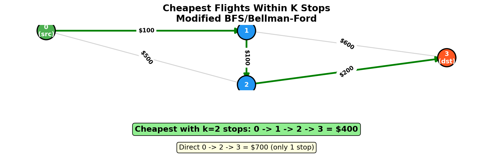
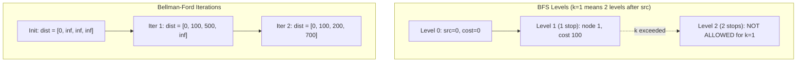
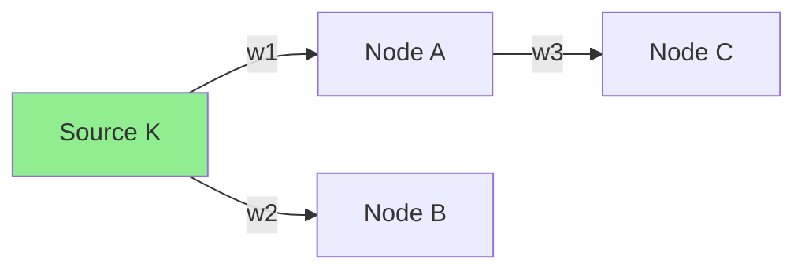
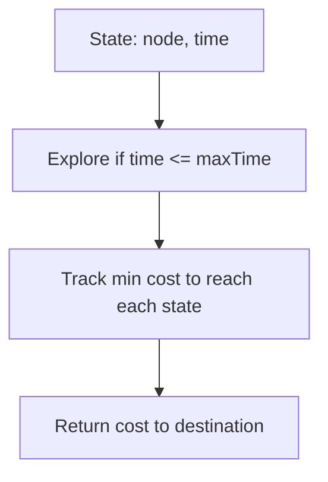
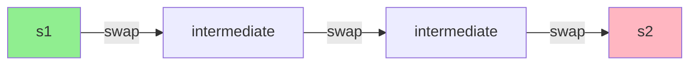

# Cheapest Flights Within K Stops

> **Shortest path with hop constraint using BFS or Bellman-Ford**

---

## Problem Statement

**LeetCode 787: Cheapest Flights Within K Stops**

There are `n` cities connected by some number of flights. You are given an array `flights` where `flights[i] = [fromi, toi, pricei]` indicates that there is a flight from city `fromi` to city `toi` with cost `pricei`.

You are also given three integers `src`, `dst`, and `k`, return the cheapest price from `src` to `dst` with at most `k` stops. If there is no such route, return `-1`.

**Note**: A route with `k` stops means `k + 1` edges (flights).

---

## Visual Overview



---

## Examples

### Example 1

```
Input: n = 4, flights = [[0,1,100],[1,2,100],[2,0,100],[1,3,600],[2,3,200]]
       src = 0, dst = 3, k = 1
Output: 700

Explanation:
        0 --$100--> 1 --$600--> 3
        |          |
      $100       $100
        v          v
        2 <-------/
        |
      $200
        v
        3

With at most k=1 stops:
  - 0 -> 3 (no direct flight)
  - 0 -> 1 -> 3 = $100 + $600 = $700 (1 stop) VALID
  - 0 -> 1 -> 2 -> 3 = $100 + $100 + $200 = $400 (2 stops) INVALID (k=1)

Answer: $700
```

### Example 2

```
Input: n = 3, flights = [[0,1,100],[1,2,100],[0,2,500]]
       src = 0, dst = 2, k = 1
Output: 200

  0 --$100--> 1 --$100--> 2
  |                       ^
  +-------$500-----------+

With k=1 stop:
  - 0 -> 2 = $500 (0 stops)
  - 0 -> 1 -> 2 = $200 (1 stop)

Answer: $200 (cheaper even though more stops)
```

---

## Why Dijkstra Doesn't Work Directly

Standard Dijkstra might skip a shorter-distance path that uses more edges, but that path might be necessary to satisfy the k-stop constraint later.

```
Example: k=2
  Path A: 0 -> 1 -> 3 (cost $800, 1 stop)
  Path B: 0 -> 2 -> 4 -> 3 (cost $400, 2 stops)

Dijkstra at node 3 might only keep Path A (shorter edges to 3).
But if we need to go to node 5 with k=3:
  - Via A: 0 -> 1 -> 3 -> 5 (2 stops) VALID
  - Via B: 0 -> 2 -> 4 -> 3 -> 5 (3 stops) VALID and cheaper!
```

---

## Solution 1: BFS with Level Tracking

Process level by level, where each level represents one more stop.

```python
from collections import defaultdict, deque

def findCheapestPrice(n: int, flights: list[list[int]], src: int, dst: int, k: int) -> int:
    # Build adjacency list
    graph = defaultdict(list)
    for u, v, price in flights:
        graph[u].append((v, price))

    # BFS with level tracking
    # dist[node] = minimum cost to reach node
    dist = [float('inf')] * n
    dist[src] = 0

    queue = deque([(src, 0)])  # (node, cost)
    stops = 0

    while queue and stops <= k:
        # Process all nodes at current level
        for _ in range(len(queue)):
            node, cost = queue.popleft()

            for neighbor, price in graph[node]:
                new_cost = cost + price

                # Only add if we found a cheaper path
                if new_cost < dist[neighbor]:
                    dist[neighbor] = new_cost
                    queue.append((neighbor, new_cost))

        stops += 1

    return dist[dst] if dist[dst] != float('inf') else -1
```

::: info Complexity: Time O(E * K) · Space O(N + E)
- **Time:** BFS processes up to K levels, each level can examine all E edges in worst case
- **Space:** Distance array O(N), queue can hold multiple instances of nodes O(N*K), adjacency list O(E)
:::

### Complexity

| Aspect | Complexity | Explanation |
|--------|------------|-------------|
| Time | O(E * K) | Each edge processed up to K times |
| Space | O(N + E) | Distance array + queue |

---

## Solution 2: Bellman-Ford (K iterations)

Bellman-Ford naturally limits the number of edges by controlling iterations.

```python
def findCheapestPrice(n: int, flights: list[list[int]], src: int, dst: int, k: int) -> int:
    # Initialize distances
    INF = float('inf')
    dist = [INF] * n
    dist[src] = 0

    # k stops = k + 1 edges, so k + 1 iterations
    for _ in range(k + 1):
        # Important: use a copy to prevent using updates from this iteration
        temp = dist.copy()

        for u, v, price in flights:
            if dist[u] != INF and dist[u] + price < temp[v]:
                temp[v] = dist[u] + price

        dist = temp

    return dist[dst] if dist[dst] != INF else -1
```

::: info Complexity: Time O(E * K) · Space O(N)
- **Time:** K+1 iterations (for K stops), each iterating through all E edges
- **Space:** Two distance arrays of size N (current and temp); no graph storage needed
:::

### Why Copy is Necessary

```python
# WITHOUT copy (WRONG):
dist = [0, inf, inf]
for u, v, price in [[0,1,100], [1,2,100]]:
    if dist[u] + price < dist[v]:
        dist[v] = dist[u] + price
# After iteration 1: dist = [0, 100, 200]
# But we only wanted 1 edge! Node 2 shouldn't be updated yet.

# WITH copy (CORRECT):
temp = dist.copy()  # temp = [0, inf, inf]
for u, v, price in flights:
    if dist[u] + price < temp[v]:
        temp[v] = dist[u] + price
# After: temp = [0, 100, inf] (correct for 1 edge)
```

### Complexity

| Aspect | Complexity | Explanation |
|--------|------------|-------------|
| Time | O(E * K) | K iterations, each processing E edges |
| Space | O(N) | Distance array |

---

## Solution 3: Modified Dijkstra with State

Track both cost AND number of stops as state.

```python
import heapq
from collections import defaultdict

def findCheapestPrice(n: int, flights: list[list[int]], src: int, dst: int, k: int) -> int:
    graph = defaultdict(list)
    for u, v, price in flights:
        graph[u].append((v, price))

    # Min-heap: (cost, node, stops)
    heap = [(0, src, 0)]

    # Track minimum stops to reach each node
    # (we might revisit with more cost but fewer stops)
    min_stops = [float('inf')] * n

    while heap:
        cost, node, stops = heapq.heappop(heap)

        # Reached destination
        if node == dst:
            return cost

        # Skip if we've visited with fewer stops
        if stops > min_stops[node] or stops > k + 1:
            continue

        min_stops[node] = stops

        for neighbor, price in graph[node]:
            heapq.heappush(heap, (cost + price, neighbor, stops + 1))

    return -1
```

::: info Complexity: Time O(E * K * log(N*K)) · Space O(N * K)
- **Time:** Potentially N*K states in heap, each extraction/insertion O(log(N*K)); can revisit nodes with different stop counts
- **Space:** Heap can hold O(N*K) entries, min_stops array O(N), adjacency list O(E)
:::

**Note**: This Dijkstra variant can be slower due to revisiting nodes with different stop counts.

---

## Comparison of Approaches

| Approach | Time | Space | Pros | Cons |
|----------|------|-------|------|------|
| BFS | O(E * K) | O(N + E) | Simple, level-based | May process same node multiple times |
| Bellman-Ford | O(E * K) | O(N) | Clean, guaranteed correctness | Processes all edges each iteration |
| Modified Dijkstra | O(E * K * log(NK)) | O(N * K) | Can be faster for small K | More complex, heap overhead |

---

## Process Visualization



---

## Common Mistakes

### 1. Using k Instead of k+1 Iterations

```python
# WRONG: k stops means k+1 edges!
for _ in range(k):  # Should be k+1
    # ...
```

### 2. Not Using Copy in Bellman-Ford

```python
# WRONG: Updates propagate within same iteration
for u, v, price in flights:
    if dist[u] + price < dist[v]:
        dist[v] = dist[u] + price  # Uses updated dist[u]!

# CORRECT: Use copy
temp = dist.copy()
for u, v, price in flights:
    if dist[u] + price < temp[v]:  # Read from dist, write to temp
        temp[v] = dist[u] + price
dist = temp
```

### 3. Standard Dijkstra Without Stop Tracking

```python
# WRONG: Doesn't track stops
if neighbor not in dist:
    dist[neighbor] = cost + price
    heap.push((cost + price, neighbor))

# CORRECT: Track stops as part of state
heap.push((cost + price, neighbor, stops + 1))
```

---

## Edge Cases

1. **src == dst**: Return 0 (already at destination)
2. **k = 0**: Only direct flights allowed
3. **No path exists**: Return -1
4. **Multiple paths with same cost**: Either works
5. **Negative prices**: Problem states prices are positive

---

## Variations

### Exactly K Stops (Not At Most)

```python
# Only check at iteration K, not update at all iterations
for i in range(k + 1):
    # ...
# Only return dist[dst] if exactly k+1 edges used
```

### Return the Path

```python
def findCheapestPath(n, flights, src, dst, k):
    # Track parent at each (node, stops) state
    parent = {}
    # ... run algorithm ...
    # Reconstruct path from dst
```

---

## Related Problems

::: details Network Delay Time (LeetCode 743)
**Problem:** Find minimum time for a signal to reach all nodes in a weighted directed graph from a source node.

**Key Insight:** Classic single-source shortest path - find max of all shortest paths (Dijkstra).



**Approach:** Run Dijkstra from source, return maximum distance among all reachable nodes.

**Complexity:** O((V+E) log V) time, O(V+E) space
:::

::: details Minimum Cost to Reach Destination in Time (LeetCode 1928)
**Problem:** Find minimum cost path where total travel time must be within maxTime constraint.

**Key Insight:** State-based shortest path tracking both cost and time as separate dimensions.



**Approach:** Modified Dijkstra with state (node, remaining_time). Prune paths exceeding time limit.

**Complexity:** O(V * maxTime * log(V * maxTime)) time, O(V * maxTime) space
:::

::: details K-Similar Strings (LeetCode 854)
**Problem:** Find minimum swaps to transform string s1 into s2 where strings are anagrams.

**Key Insight:** BFS where each state is a string configuration, edges are single swaps.



**Approach:** BFS from s1, generate neighbors by swapping mismatched characters, stop when reaching s2.

**Complexity:** O(N! / (N-K)!) worst case, where K is number of different positions
:::

---

## Interview Tips

1. **Recognize the constraint**: The "at most K stops" prevents standard Dijkstra
2. **Mention multiple approaches**: BFS and Bellman-Ford both work well
3. **Explain why copy matters**: Key insight for Bellman-Ford
4. **Clarify K vs edges**: K stops = K+1 edges

### Follow-up Questions

- **Q: What if we want exactly K stops?**
  - A: Only consider paths with exactly K+1 edges

- **Q: What if there are negative prices (refunds)?**
  - A: Bellman-Ford still works, but need to check for negative cycles

- **Q: How to handle ties (same price)?**
  - A: Return any valid path, or prefer fewer stops

---

## References

- [LeetCode 787: Cheapest Flights Within K Stops](https://leetcode.com/problems/cheapest-flights-within-k-stops/)
- [NeetCode Solution](https://neetcode.io/solutions/cheapest-flights-within-k-stops)
- [Cheapest Flights - In-Depth Explanation](https://algo.monster/liteproblems/787)
