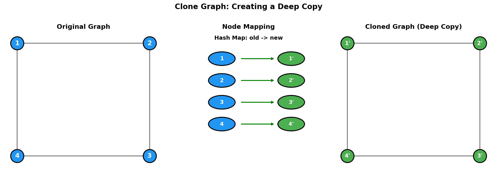
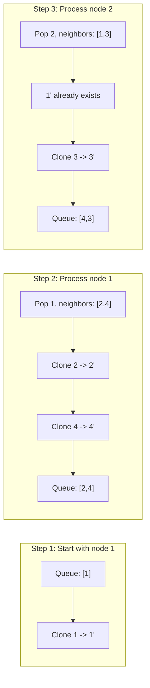
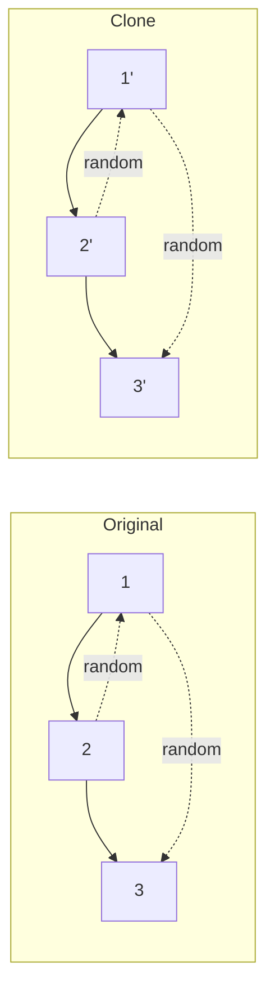
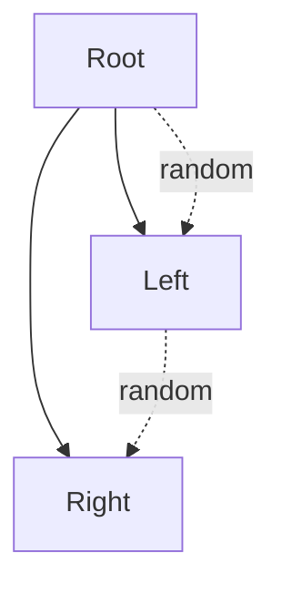
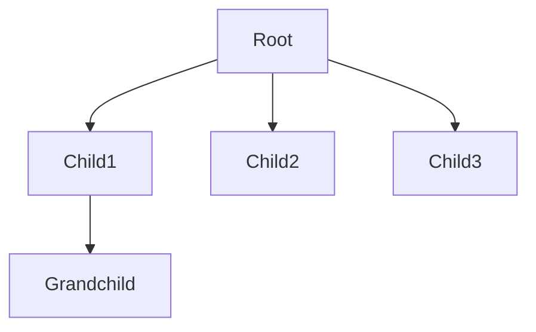

# Clone Graph

> **Creating a deep copy of an undirected graph**

---

## Problem Statement

**LeetCode 133: Clone Graph**

Given a reference of a node in a connected undirected graph, return a deep copy (clone) of the graph.

Each node in the graph contains a value (`int`) and a list (`List[Node]`) of its neighbors.

```python
class Node:
    def __init__(self, val = 0, neighbors = None):
        self.val = val
        self.neighbors = neighbors if neighbors is not None else []
```

**Key Constraints:**
- The number of nodes is in the range `[0, 100]`
- `1 <= Node.val <= 100`
- Node.val is unique for each node
- The graph is connected and has no repeated edges or self-loops

---

## Visual Overview



---

## Examples

### Example 1

```
Input: adjList = [[2,4],[1,3],[2,4],[1,3]]
Output: [[2,4],[1,3],[2,4],[1,3]]

Explanation:
Graph structure:
    1 --- 2
    |     |
    4 --- 3

Node 1: neighbors = [2, 4]
Node 2: neighbors = [1, 3]
Node 3: neighbors = [2, 4]
Node 4: neighbors = [1, 3]
```

### Example 2

```
Input: adjList = [[]]
Output: [[]]

Explanation: Single node with no neighbors
```

### Example 3

```
Input: adjList = []
Output: []

Explanation: Empty graph
```

---

## Approach

### Key Insight

The main challenge is handling **cycles** and **shared references**. When we encounter a node we've already cloned, we must return the existing clone rather than creating a duplicate.

### Strategy

1. **Use a hash map** to track: `original_node -> cloned_node`
2. **DFS or BFS** to traverse the graph
3. For each node:
   - If already cloned, return the clone from hash map
   - Otherwise, create a clone and recursively clone all neighbors

### Why Hash Map?

```
Without hash map (WRONG):
  Clone(1) -> creates 1'
    Clone neighbor 2 -> creates 2'
      Clone neighbor 1 -> creates 1'' (DUPLICATE!)

With hash map (CORRECT):
  Clone(1) -> creates 1', stores {1: 1'}
    Clone neighbor 2 -> creates 2', stores {1: 1', 2: 2'}
      Clone neighbor 1 -> sees 1 in map, returns 1' (NO DUPLICATE!)
```

---

## Solution 1: DFS (Recursive)

::: code-group
```python [Python]
class Node:
    def __init__(self, val = 0, neighbors = None):
        self.val = val
        self.neighbors = neighbors if neighbors is not None else []

def cloneGraph(node: 'Node') -> 'Node':
    if not node:
        return None

    # Hash map: original -> clone
    cloned = {}

    def dfs(node: 'Node') -> 'Node':
        # If already cloned, return the clone
        if node in cloned:
            return cloned[node]

        # Create clone and store in hash map
        copy = Node(node.val)
        cloned[node] = copy

        # Recursively clone all neighbors
        for neighbor in node.neighbors:
            copy.neighbors.append(dfs(neighbor))

        return copy

    return dfs(node)
```

```java [Java]
public Node cloneGraph(Node node) {
    if (node == null) return null;
    Map<Node, Node> cloned = new HashMap<>();
    return dfs(node, cloned);
}

private Node dfs(Node node, Map<Node, Node> cloned) {
    if (cloned.containsKey(node)) return cloned.get(node);
    Node copy = new Node(node.val);
    cloned.put(node, copy);
    for (Node neighbor : node.neighbors)
        copy.neighbors.add(dfs(neighbor, cloned));
    return copy;
}
```
:::

::: info Complexity: Time O(V + E) · Space O(V)
- **Time:** Each node cloned exactly once, each edge traversed once when building neighbor lists
- **Space:** Hash map stores V node mappings, recursion stack depth up to O(V) for linear graphs
:::

### Complexity Analysis

| Aspect | Complexity | Explanation |
|--------|------------|-------------|
| Time | O(V + E) | Visit each node and edge once |
| Space | O(V) | Hash map stores all nodes + recursion stack |

---

## Solution 2: BFS (Iterative)

```python
from collections import deque

def cloneGraph(node: 'Node') -> 'Node':
    if not node:
        return None

    # Create clone of starting node
    cloned = {node: Node(node.val)}
    queue = deque([node])

    while queue:
        curr = queue.popleft()

        for neighbor in curr.neighbors:
            # If neighbor not yet cloned, clone it
            if neighbor not in cloned:
                cloned[neighbor] = Node(neighbor.val)
                queue.append(neighbor)

            # Add cloned neighbor to current node's clone
            cloned[curr].neighbors.append(cloned[neighbor])

    return cloned[node]
```

::: info Complexity: Time O(V + E) · Space O(V)
- **Time:** Each node added to queue once, each edge examined once when wiring neighbors
- **Space:** Hash map O(V), queue up to O(V) nodes at widest level of graph
:::

### BFS Process Visualization



---

## Solution 3: DFS with Explicit Stack

```python
def cloneGraph(node: 'Node') -> 'Node':
    if not node:
        return None

    cloned = {node: Node(node.val)}
    stack = [node]

    while stack:
        curr = stack.pop()

        for neighbor in curr.neighbors:
            if neighbor not in cloned:
                cloned[neighbor] = Node(neighbor.val)
                stack.append(neighbor)

            cloned[curr].neighbors.append(cloned[neighbor])

    return cloned[node]
```

::: info Complexity: Time O(V + E) · Space O(V)
- **Time:** Same as BFS - each node and edge processed once during traversal
- **Space:** Hash map O(V), explicit stack replaces recursion stack with same O(V) depth
:::

---

## Common Mistakes

### 1. Not Handling Cycles

```python
# WRONG - infinite loop on cycles
def cloneGraph_wrong(node):
    copy = Node(node.val)
    for neighbor in node.neighbors:
        copy.neighbors.append(cloneGraph_wrong(neighbor))  # Never terminates!
    return copy
```

### 2. Creating Duplicate Clones

```python
# WRONG - creates multiple copies of same node
cloned = {}
def dfs(node):
    copy = Node(node.val)  # Should check if already cloned first!
    cloned[node] = copy
    # ...
```

### 3. Not Storing Clone Before Recursing

```python
# WRONG - race condition on back edges
def dfs(node):
    if node in cloned:
        return cloned[node]
    copy = Node(node.val)
    for neighbor in node.neighbors:
        copy.neighbors.append(dfs(neighbor))  # May recurse back to node before storing!
    cloned[node] = copy  # Too late - should store before recursion
    return copy
```

**Correct order:**
```python
def dfs(node):
    if node in cloned:
        return cloned[node]
    copy = Node(node.val)
    cloned[node] = copy  # Store BEFORE recursion
    for neighbor in node.neighbors:
        copy.neighbors.append(dfs(neighbor))
    return copy
```

---

## Related Problems

::: details Copy List with Random Pointer (LeetCode 138)
**Problem:** Deep copy a linked list where each node has a next pointer and a random pointer to any node in the list.

**Key Insight:** Same hash map pattern - map original nodes to clones to handle random pointers.



**Approach:** Two-pass: first create all clones with hash map, then wire up next and random pointers.

**Complexity:** O(N) time, O(N) space (can optimize to O(1) space with interleaving)
:::

::: details Clone Binary Tree With Random Pointer (LeetCode 1485)
**Problem:** Deep copy a binary tree where each node has left, right, and random pointers.

**Key Insight:** Combine tree traversal with hash map for random pointer handling.



**Approach:** DFS/BFS traversal with hash map mapping original to clone nodes.

**Complexity:** O(N) time, O(N) space
:::

::: details Clone N-ary Tree (LeetCode 1490)
**Problem:** Deep copy an N-ary tree where each node can have multiple children.

**Key Insight:** Simpler than graph clone - no cycles possible, so no need for visited tracking.



**Approach:** Recursive DFS - for each node, create clone and recursively clone all children.

**Complexity:** O(N) time, O(H) space where H is tree height
:::

---

## Interview Tips

1. **Clarify the graph structure**: Ask about the Node class definition
2. **Discuss cycle handling**: Explain why hash map is needed
3. **Choose DFS vs BFS**: Both work, DFS is often more natural for this problem
4. **Mention edge cases**: Empty graph, single node, fully connected graph
5. **Verify deep copy**: Modifying clone should not affect original

### Follow-up Questions

- **Q: What if nodes don't have unique values?**
  - A: Use object identity (the node reference itself) as hash key, not node.val

- **Q: What if the graph is directed?**
  - A: Same approach works, just follow directed edges

- **Q: How would you verify the clone is correct?**
  - A: Compare structure using BFS/DFS, ensure no shared references between original and clone

---

## References

- [LeetCode 133: Clone Graph](https://leetcode.com/problems/clone-graph/)
- [NeetCode Solution](https://neetcode.io/solutions/clone-graph)
- [Clone Graph - In-Depth Explanation](https://algo.monster/liteproblems/133)
