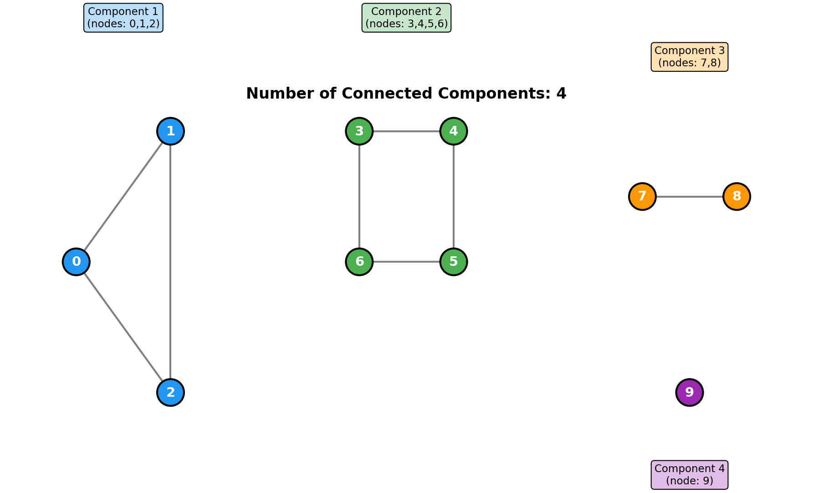
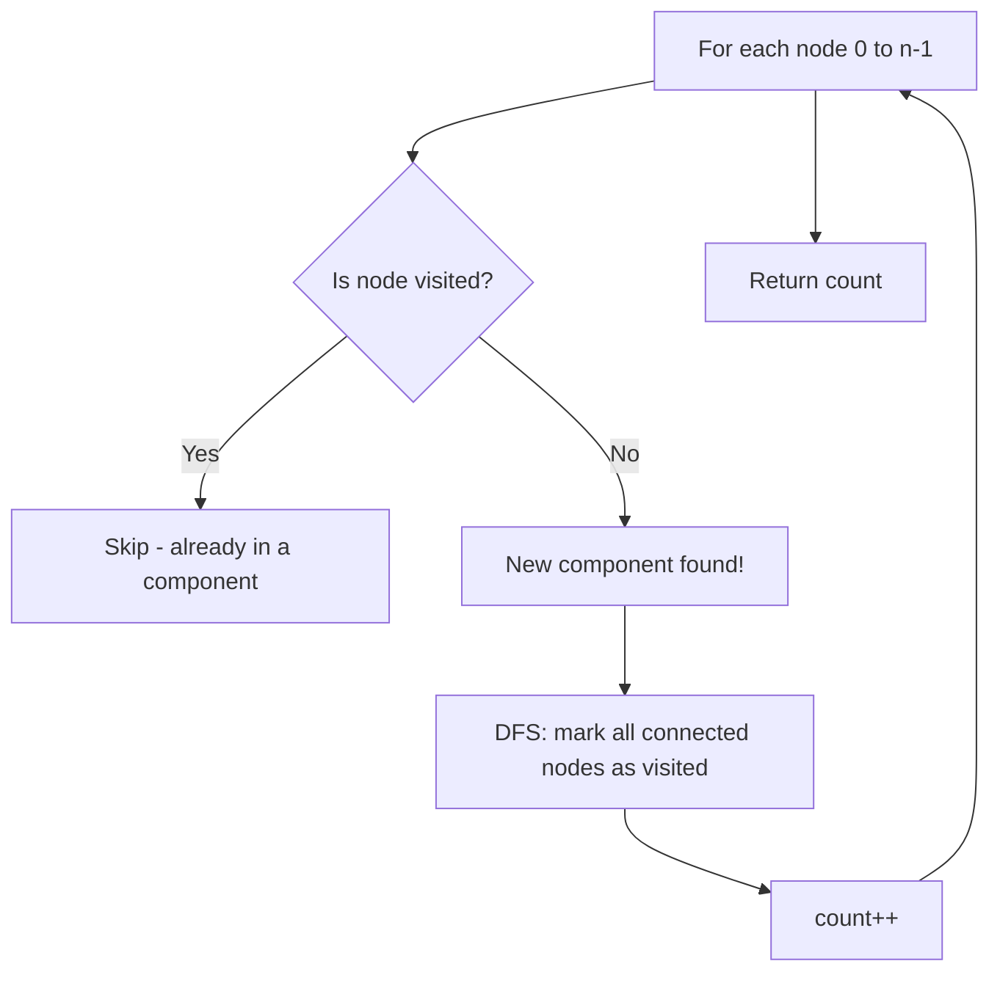
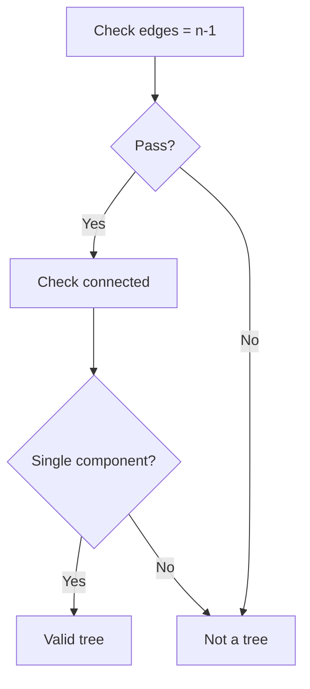
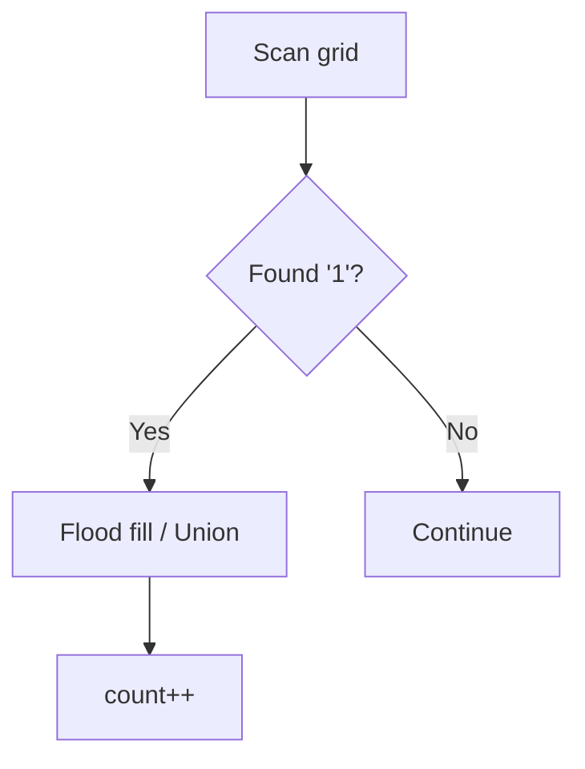
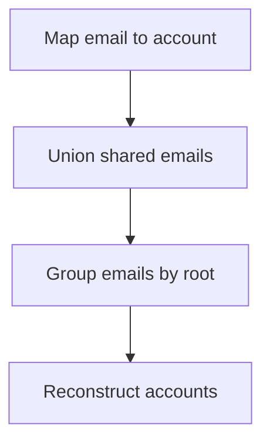
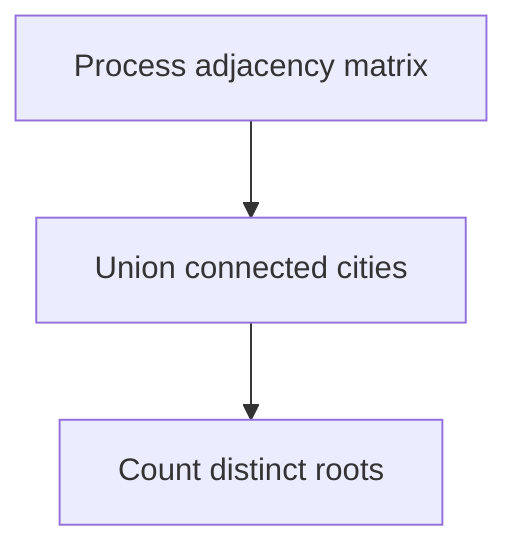

# Number of Connected Components

> **Counting disjoint subgraphs using Union-Find or DFS**

---

## Problem Statement

**LeetCode 323: Number of Connected Components in an Undirected Graph** (Premium)

You have a graph of `n` nodes. You are given an integer `n` and an array `edges` where `edges[i] = [ai, bi]` indicates that there is an edge between `ai` and `bi` in the graph.

Return the number of connected components in the graph.

---

## Visual Overview



---

## Examples

### Example 1

```
Input: n = 5, edges = [[0,1], [1,2], [3,4]]
Output: 2

  0 - 1 - 2     3 - 4

Component 1: {0, 1, 2}
Component 2: {3, 4}
```

### Example 2

```
Input: n = 5, edges = [[0,1], [1,2], [2,3], [3,4]]
Output: 1

  0 - 1 - 2 - 3 - 4

All nodes connected: 1 component
```

### Example 3

```
Input: n = 5, edges = []
Output: 5

  0   1   2   3   4

Each node is isolated: 5 components
```

---

## Solution 1: Union-Find (Optimal)

```python
class UnionFind:
    def __init__(self, n):
        self.parent = list(range(n))
        self.rank = [0] * n
        self.count = n  # Initially, n separate components

    def find(self, x):
        if self.parent[x] != x:
            self.parent[x] = self.find(self.parent[x])  # Path compression
        return self.parent[x]

    def union(self, x, y):
        px, py = self.find(x), self.find(y)
        if px == py:
            return  # Already in same component

        # Union by rank
        if self.rank[px] < self.rank[py]:
            px, py = py, px
        self.parent[py] = px
        if self.rank[px] == self.rank[py]:
            self.rank[px] += 1

        self.count -= 1  # Merged two components into one

def countComponents(n: int, edges: list[list[int]]) -> int:
    uf = UnionFind(n)

    for u, v in edges:
        uf.union(u, v)

    return uf.count
```

::: info Complexity: Time O(E * alpha(n)) · Space O(n)
- **Time:** E union operations, each O(alpha(n)) amortized; count maintained during unions
- **Space:** Parent and rank arrays O(n), count variable O(1)
:::

### How It Works

```
Initial: 5 nodes, 5 components
  0   1   2   3   4
  [0] [1] [2] [3] [4]  <- each node is its own parent

Edge [0,1]: union(0, 1)
  0   2   3   4         count = 4
  |
  1

Edge [1,2]: union(1, 2)
  0   3   4             count = 3
 / \
1   2

Edge [3,4]: union(3, 4)
  0   3                 count = 2
 / \   \
1   2   4

Final: 2 components
```

### Complexity

| Aspect | Complexity | Explanation |
|--------|------------|-------------|
| Time | O(E * alpha(n)) | Nearly O(E) for E edges |
| Space | O(n) | Parent and rank arrays |

---

## Solution 2: DFS

```python
from collections import defaultdict

def countComponents(n: int, edges: list[list[int]]) -> int:
    # Build adjacency list
    graph = defaultdict(list)
    for u, v in edges:
        graph[u].append(v)
        graph[v].append(u)

    visited = set()
    count = 0

    def dfs(node: int) -> None:
        visited.add(node)
        for neighbor in graph[node]:
            if neighbor not in visited:
                dfs(neighbor)

    for node in range(n):
        if node not in visited:
            dfs(node)
            count += 1

    return count
```

::: info Complexity: Time O(V + E) · Space O(V + E)
- **Time:** Each node visited once when starting new DFS or during recursive exploration; each edge examined twice
- **Space:** Adjacency list O(E), visited set O(V), recursion stack up to O(V) depth
:::

### DFS Process



### Complexity

| Aspect | Complexity | Explanation |
|--------|------------|-------------|
| Time | O(V + E) | Visit each node and edge once |
| Space | O(V + E) | Adjacency list + visited set + recursion stack |

---

## Solution 3: BFS

```python
from collections import defaultdict, deque

def countComponents(n: int, edges: list[list[int]]) -> int:
    graph = defaultdict(list)
    for u, v in edges:
        graph[u].append(v)
        graph[v].append(u)

    visited = set()
    count = 0

    def bfs(start: int) -> None:
        queue = deque([start])
        visited.add(start)

        while queue:
            node = queue.popleft()
            for neighbor in graph[node]:
                if neighbor not in visited:
                    visited.add(neighbor)
                    queue.append(neighbor)

    for node in range(n):
        if node not in visited:
            bfs(node)
            count += 1

    return count
```

::: info Complexity: Time O(V + E) · Space O(V + E)
- **Time:** BFS visits each node once, processes each edge twice (undirected)
- **Space:** Adjacency list O(E), visited set O(V), queue up to O(V) nodes
:::

---

## Alternative: Count Unique Roots

After processing all edges with Union-Find, count unique roots:

```python
def countComponents(n: int, edges: list[list[int]]) -> int:
    parent = list(range(n))

    def find(x):
        if parent[x] != x:
            parent[x] = find(parent[x])
        return parent[x]

    def union(x, y):
        parent[find(x)] = find(y)

    for u, v in edges:
        union(u, v)

    # Count unique roots
    return len(set(find(i) for i in range(n)))
```

::: info Complexity: Time O(E * alpha(n) + n) · Space O(n)
- **Time:** E unions during edge processing, then n find operations to count unique roots
- **Space:** Parent array O(n), set for unique roots O(n) worst case
:::

---

## Comparison of Approaches

| Approach | Time | Space | Pros | Cons |
|----------|------|-------|------|------|
| Union-Find | O(E * alpha(n)) | O(n) | Efficient, tracks count | More code |
| DFS | O(V + E) | O(V + E) | Intuitive | Stack overflow risk |
| BFS | O(V + E) | O(V + E) | No stack overflow | More memory for queue |

---

## Variations

### Get Component Sizes

```python
def getComponentSizes(n: int, edges: list[list[int]]) -> list[int]:
    uf = UnionFind(n)
    for u, v in edges:
        uf.union(u, v)

    # Count nodes per root
    from collections import Counter
    roots = [uf.find(i) for i in range(n)]
    return list(Counter(roots).values())

# Example: n=5, edges=[[0,1],[1,2],[3,4]]
# Returns: [3, 2] (component sizes)
```

### Get Nodes in Each Component

```python
def getComponents(n: int, edges: list[list[int]]) -> list[list[int]]:
    from collections import defaultdict

    uf = UnionFind(n)
    for u, v in edges:
        uf.union(u, v)

    components = defaultdict(list)
    for node in range(n):
        root = uf.find(node)
        components[root].append(node)

    return list(components.values())

# Example: n=5, edges=[[0,1],[1,2],[3,4]]
# Returns: [[0, 1, 2], [3, 4]]
```

### Dynamic Component Count

Track components as edges are added:

```python
def dynamicComponents(n: int, edges: list[list[int]]) -> list[int]:
    """Return component count after each edge is added."""
    uf = UnionFind(n)
    result = []

    for u, v in edges:
        uf.union(u, v)
        result.append(uf.count)

    return result

# Example: n=5, edges=[[0,1],[1,2],[3,4]]
# Returns: [4, 3, 2] (count after each edge)
```

---

## Edge Cases

1. **No edges**: Each node is its own component, return `n`
2. **Fully connected**: Return `1`
3. **n = 0**: Return `0` (no nodes)
4. **Self-loops**: Handle or ignore based on problem constraints
5. **Duplicate edges**: Union-Find handles gracefully

---

## Interview Tips

1. **Choose the right approach**:
   - Union-Find: Best for dynamic graphs or many queries
   - DFS/BFS: Fine for single count, easier to explain

2. **Mention optimizations**:
   - Path compression in find()
   - Union by rank in union()

3. **Track the count efficiently**:
   - Decrement on successful union (Union-Find)
   - Increment on new DFS/BFS start

### Follow-up Questions

- **Q: What if edges are added dynamically?**
  - A: Union-Find is perfect - O(alpha(n)) per edge

- **Q: What if edges are removed?**
  - A: Much harder - need decremental connectivity or recompute

- **Q: What if the graph is directed?**
  - A: Different problem - need Kosaraju's or Tarjan's algorithm for strongly connected components

---

## Related Problems

::: details Graph Valid Tree (LeetCode 261)
**Problem:** Determine if an undirected graph with n nodes and edges is a valid tree.

**Key Insight:** Tree requires exactly n-1 edges AND single connected component (no cycles).



**Approach:** Union-Find: verify n-1 edges and no cycle (union fails = cycle detected).

**Complexity:** O(N * alpha(N)) time, O(N) space
:::

::: details Number of Islands (LeetCode 200)
**Problem:** Count connected components of '1' cells in a 2D grid.

**Key Insight:** Same as connected components but on implicit grid graph.



**Approach:** DFS/BFS flood fill from each unvisited '1', or Union-Find on adjacent '1' cells.

**Complexity:** O(M*N) time, O(M*N) space
:::

::: details Accounts Merge (LeetCode 721)
**Problem:** Merge accounts that share at least one email address.

**Key Insight:** Union-Find on emails - accounts sharing an email belong to same person.



**Approach:** Union-Find: union emails from same account, then group by representative.

**Complexity:** O(N * K * alpha(NK)) time where N = accounts, K = emails per account
:::

::: details Number of Provinces (LeetCode 547)
**Problem:** Count provinces in an n x n adjacency matrix where isConnected[i][j] = 1 means cities i and j are connected.

**Key Insight:** Same as connected components but with matrix input instead of edge list.



**Approach:** Union-Find or DFS - process matrix to find connected components.

**Complexity:** O(N^2 * alpha(N)) time with Union-Find, O(N) space
:::

---

## References

- [LeetCode 323: Number of Connected Components](https://leetcode.com/problems/number-of-connected-components-in-an-undirected-graph/)
- [Number of Connected Components - NeetCode](https://neetcode.io/solutions/number-of-connected-components-in-an-undirected-graph)
- [Connected Components - GeeksforGeeks](https://www.geeksforgeeks.org/connected-components-in-an-undirected-graph/)
