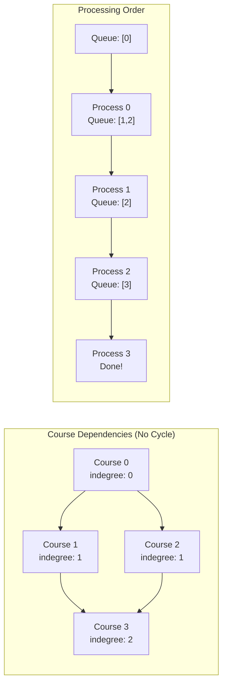
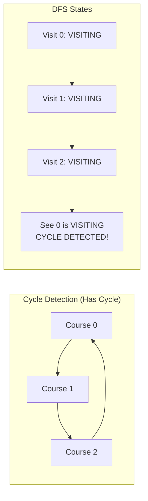
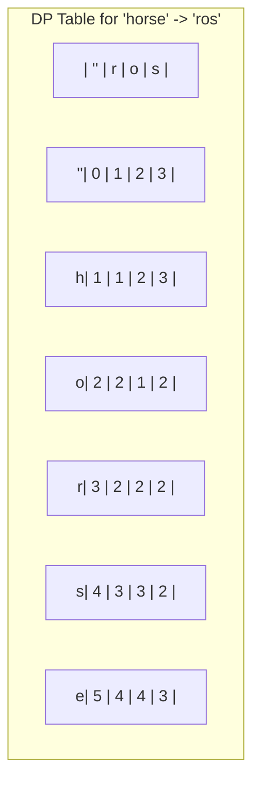
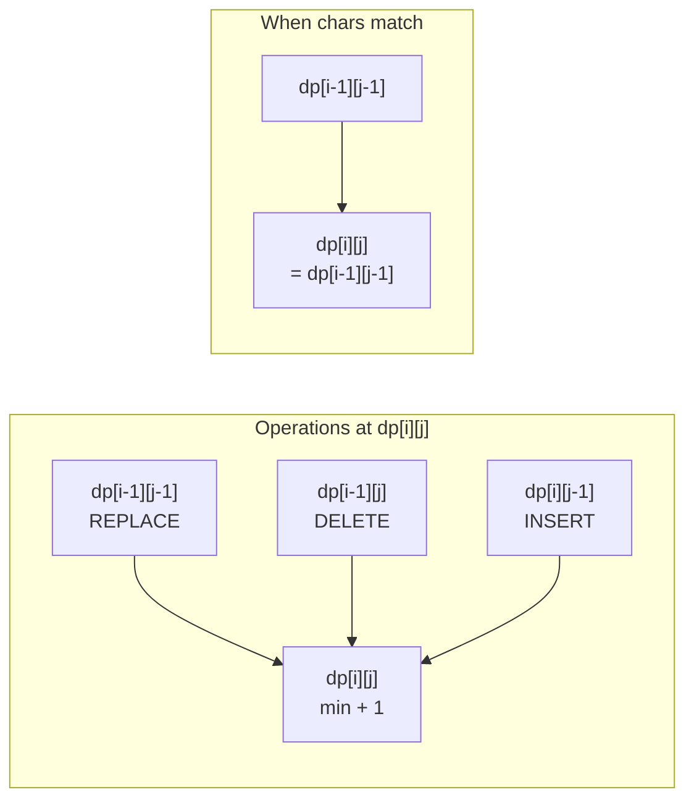

# Course Schedule & Edit Distance

> **Topological sorting and string transformation**

---

## Course Schedule

### Problem Statement

There are `numCourses` courses labeled `0` to `numCourses-1`. You are given an array `prerequisites` where `prerequisites[i] = [ai, bi]` indicates that you must take course `bi` first if you want to take course `ai`. Return `true` if you can finish all courses, otherwise return `false`.

This problem is equivalent to **detecting if a cycle exists in a directed graph**. If a cycle exists, no topological ordering exists, and therefore it will be impossible to take all courses.

### Example

```
Input: numCourses = 2, prerequisites = [[1,0]]
Output: true
Explanation: Take course 0 first, then course 1.

Input: numCourses = 2, prerequisites = [[1,0],[0,1]]
Output: false
Explanation: Cycle exists - course 0 requires 1, course 1 requires 0.
```

### Approach: Topological Sort (Kahn's Algorithm)

**Key Insight:** Topological sort only works for Directed Acyclic Graphs (DAG). If we can process all nodes in topological order, no cycle exists.

**Kahn's Algorithm (BFS):**
1. Build adjacency list and count in-degrees for each node
2. Add all nodes with in-degree 0 to a queue (no prerequisites)
3. Process queue: for each node, decrement in-degree of neighbors
4. When a neighbor's in-degree becomes 0, add it to queue
5. If all nodes are processed, no cycle exists

**DFS Approach:**
1. Use three states: UNVISITED (0), VISITING (1), VISITED (2)
2. If we encounter a VISITING node during DFS, a cycle exists
3. Mark nodes as VISITED after processing all neighbors

### Mermaid Diagram





### Solution (BFS - Kahn's Algorithm)

```python
from collections import deque, defaultdict

def canFinish(numCourses: int, prerequisites: list[list[int]]) -> bool:
    # Build graph and indegree count
    graph = defaultdict(list)
    indegree = [0] * numCourses

    for course, prereq in prerequisites:
        graph[prereq].append(course)
        indegree[course] += 1

    # Start with courses having no prerequisites
    queue = deque([i for i in range(numCourses) if indegree[i] == 0])
    completed = 0

    while queue:
        course = queue.popleft()
        completed += 1

        for next_course in graph[course]:
            indegree[next_course] -= 1
            if indegree[next_course] == 0:
                queue.append(next_course)

    return completed == numCourses
```

::: info Complexity: Time O(V + E) · Space O(V + E)
- **Time:** Each vertex is processed once when its in-degree becomes 0, and each edge is examined once when decrementing in-degrees
- **Space:** Adjacency list stores all edges O(E), in-degree array and queue each use O(V)
:::

### Solution (DFS - Cycle Detection)

```python
def canFinish_dfs(numCourses: int, prerequisites: list[list[int]]) -> bool:
    graph = defaultdict(list)
    for course, prereq in prerequisites:
        graph[prereq].append(course)

    # 0: unvisited, 1: visiting, 2: visited
    state = [0] * numCourses

    def has_cycle(course):
        if state[course] == 1:  # Currently visiting - cycle!
            return True
        if state[course] == 2:  # Already processed
            return False

        state[course] = 1
        for next_course in graph[course]:
            if has_cycle(next_course):
                return True
        state[course] = 2
        return False

    return not any(has_cycle(i) for i in range(numCourses))
```

::: info Complexity: Time O(V + E) · Space O(V + E)
- **Time:** Each vertex visited once with state tracking, each edge traversed once during DFS exploration
- **Space:** Adjacency list O(E), state array O(V), recursion stack depth up to O(V) in worst case
:::

### Course Schedule II (Return Order)

```python
def findOrder(numCourses: int, prerequisites: list[list[int]]) -> list[int]:
    graph = defaultdict(list)
    indegree = [0] * numCourses

    for course, prereq in prerequisites:
        graph[prereq].append(course)
        indegree[course] += 1

    queue = deque([i for i in range(numCourses) if indegree[i] == 0])
    order = []

    while queue:
        course = queue.popleft()
        order.append(course)

        for next_course in graph[course]:
            indegree[next_course] -= 1
            if indegree[next_course] == 0:
                queue.append(next_course)

    return order if len(order) == numCourses else []
```

::: info Complexity: Time O(V + E) · Space O(V + E)
- **Time:** Same as BFS approach - each course processed once, each prerequisite edge examined once
- **Space:** Graph storage O(E), in-degree array O(V), queue O(V), output order list O(V)
:::

### Complexity

| Approach | Time | Space |
|----------|------|-------|
| BFS (Kahn's) | O(V + E) | O(V + E) |
| DFS | O(V + E) | O(V + E) |

Where V = numCourses, E = number of prerequisites

---

## Edit Distance (Levenshtein)

### Problem Statement

Given two strings `word1` and `word2`, return the minimum number of operations required to convert `word1` to `word2`. You have three operations permitted:
- **Insert** a character
- **Delete** a character
- **Replace** a character

This is also known as the **Levenshtein distance** or **Wagner-Fischer algorithm**.

### Example

```
Input: word1 = "horse", word2 = "ros"
Output: 3
Explanation:
  horse -> rorse (replace 'h' with 'r')
  rorse -> rose (remove 'r')
  rose -> ros (remove 'e')

Input: word1 = "intention", word2 = "execution"
Output: 5
```

### Approach

**2D DP Table:** `dp[i][j]` represents the minimum edit distance between `word1[:i]` and `word2[:j]`.

**Recurrence Relation:**
- If `word1[i-1] == word2[j-1]`: `dp[i][j] = dp[i-1][j-1]` (no operation needed)
- Otherwise: `dp[i][j] = 1 + min(dp[i-1][j], dp[i][j-1], dp[i-1][j-1])`
  - `dp[i-1][j] + 1`: Delete from word1
  - `dp[i][j-1] + 1`: Insert into word1
  - `dp[i-1][j-1] + 1`: Replace character

**Base Cases:**
- `dp[i][0] = i`: Delete all i characters from word1
- `dp[0][j] = j`: Insert all j characters into empty word1

### Mermaid Diagram





### Solution (Python)

```python
def minDistance(word1: str, word2: str) -> int:
    m, n = len(word1), len(word2)

    # dp[i][j] = edit distance for word1[:i] and word2[:j]
    dp = [[0] * (n + 1) for _ in range(m + 1)]

    # Base cases
    for i in range(m + 1):
        dp[i][0] = i  # Delete all
    for j in range(n + 1):
        dp[0][j] = j  # Insert all

    # Fill DP table
    for i in range(1, m + 1):
        for j in range(1, n + 1):
            if word1[i-1] == word2[j-1]:
                dp[i][j] = dp[i-1][j-1]  # No operation needed
            else:
                dp[i][j] = 1 + min(
                    dp[i-1][j],    # Delete from word1
                    dp[i][j-1],    # Insert into word1
                    dp[i-1][j-1]   # Replace
                )

    return dp[m][n]
```

::: info Complexity: Time O(m * n) · Space O(m * n)
- **Time:** We fill every cell of the m x n DP table exactly once with O(1) operations per cell
- **Space:** The 2D DP table requires m+1 rows and n+1 columns to store all subproblem solutions
:::

### Space Optimized O(n)

```python
def minDistance_optimized(word1: str, word2: str) -> int:
    m, n = len(word1), len(word2)
    prev = list(range(n + 1))

    for i in range(1, m + 1):
        curr = [i] + [0] * n
        for j in range(1, n + 1):
            if word1[i-1] == word2[j-1]:
                curr[j] = prev[j-1]
            else:
                curr[j] = 1 + min(prev[j], curr[j-1], prev[j-1])
        prev = curr

    return prev[n]
```

::: info Complexity: Time O(m * n) · Space O(n)
- **Time:** Still computing all m*n subproblems, just with optimized space
- **Space:** Only two arrays of size n+1 are maintained (prev and curr), reducing from O(m*n) to O(n)
:::

### Recursive with Memoization

```python
from functools import lru_cache

def minDistance_memo(word1: str, word2: str) -> int:
    @lru_cache(maxsize=None)
    def dp(i, j):
        if i == 0:
            return j
        if j == 0:
            return i

        if word1[i-1] == word2[j-1]:
            return dp(i-1, j-1)

        return 1 + min(
            dp(i-1, j),    # Delete
            dp(i, j-1),    # Insert
            dp(i-1, j-1)   # Replace
        )

    return dp(len(word1), len(word2))
```

::: info Complexity: Time O(m * n) · Space O(m * n)
- **Time:** Each unique (i, j) pair computed once due to memoization; m*n total subproblems
- **Space:** Memoization cache stores m*n results, plus recursion stack depth up to O(m + n)
:::

### Complexity

| Approach | Time | Space |
|----------|------|-------|
| Standard 2D DP | O(m * n) | O(m * n) |
| Space Optimized | O(m * n) | O(n) |
| Recursive + Memo | O(m * n) | O(m * n) |

---

## Interview Applications

### Course Schedule Variations

1. **Detect if schedule is possible** (Course Schedule I)
2. **Return valid order** (Course Schedule II)
3. **Minimum semesters to complete all courses** (parallel processing)
4. **Build order for dependencies** (compilation order, task scheduling)

### Edit Distance Variations

1. **Spell checker** - suggest words within edit distance k
2. **DNA sequence alignment** - biological applications
3. **Autocomplete suggestions** - fuzzy matching
4. **Plagiarism detection** - document similarity

### Common Interview Follow-ups

**For Course Schedule:**
- "What if there are parallel processing constraints?"
- "How would you find all valid orderings?"
- "Can you detect which courses form a cycle?"

**For Edit Distance:**
- "Can you reconstruct the actual operations?"
- "What if operations have different costs?"
- "How would you handle wildcard characters?"

### Related Problems

| Problem | Pattern | LeetCode |
|---------|---------|----------|
| Course Schedule | Topological Sort | #207 |
| Course Schedule II | Topological Sort | #210 |
| Alien Dictionary | Topological Sort | #269 |
| Edit Distance | DP on Strings | #72 |
| One Edit Distance | String Comparison | #161 |
| Delete Operation for Two Strings | DP on Strings | #583 |
| Minimum ASCII Delete Sum | DP on Strings | #712 |

---

## Key Takeaways

### Topological Sort

1. **When to use:** Tasks with dependencies, ordering constraints
2. **Two approaches:** BFS (Kahn's) and DFS with cycle detection
3. **Cycle detection:** If not all nodes processed (BFS) or visiting node seen again (DFS)
4. **Time complexity:** Always O(V + E) for both approaches

### Edit Distance DP

1. **State definition:** `dp[i][j]` = min operations for first i chars of word1, first j chars of word2
2. **Three operations:** Insert, Delete, Replace - each adds 1 to cost
3. **Optimal substructure:** Solution builds from smaller subproblems
4. **Space optimization:** Only need previous row, reduce O(mn) to O(n)

---

## References

- [Course Schedule - LeetCode](https://leetcode.com/problems/course-schedule/)
- [Course Schedule II (Topological Sort) - AlgoMap](https://algomap.io/problems/course-schedule-ii)
- [Course Schedule I and II - TakeUForward](https://takeuforward.org/data-structure/course-schedule-i-and-ii-pre-requisite-tasks-topological-sort-g-24)
- [Cycle Detection and Topological Sort - Labuladong](https://labuladong.online/en/algo/data-structure/topological-sort/)
- [Edit Distance - LeetCode](https://leetcode.com/problems/edit-distance/)
- [Edit Distance In-Depth Explanation - Algo Monster](https://algo.monster/liteproblems/72)
- [Edit Distance - GeeksforGeeks](https://www.geeksforgeeks.org/dsa/edit-distance-dp-5/)
- [LeetCode 72: Edit Distance - SparkCodeHub](https://www.sparkcodehub.com/leetcode/72/edit-distance)
