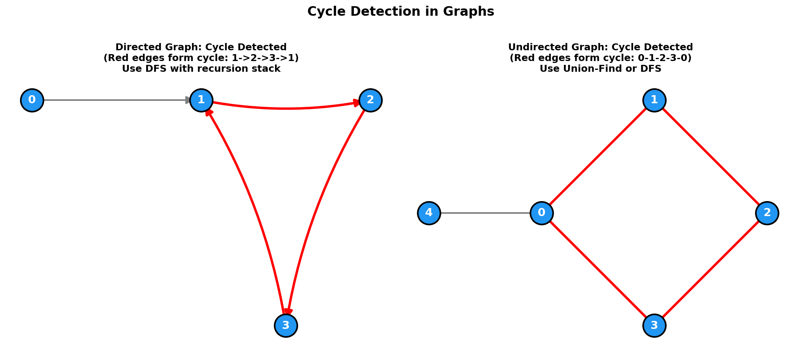

# Cycle Detection in Graphs

> **Finding cycles in directed and undirected graphs**

---

## Overview

Cycle detection is a fundamental graph problem with different approaches depending on whether the graph is directed or undirected.

| Graph Type | Recommended Approach |
|------------|---------------------|
| Undirected | Union-Find or DFS with parent tracking |
| Directed | DFS with three-color marking (white/gray/black) |

---

## Visual Overview



---

## Part 1: Undirected Graph Cycle Detection

### Problem

Given an undirected graph, determine if it contains a cycle.

### Example

```
Input: n = 5, edges = [[0,1], [1,2], [2,3], [3,0], [0,4]]
Output: true

Graph:
  4
  |
  0 --- 1
  |     |
  3 --- 2

Cycle: 0 -> 1 -> 2 -> 3 -> 0
```

### Approach 1: Union-Find

**Key Insight**: If an edge connects two nodes that are already in the same connected component, adding that edge creates a cycle.

```python
class UnionFind:
    def __init__(self, n):
        self.parent = list(range(n))
        self.rank = [0] * n

    def find(self, x):
        if self.parent[x] != x:
            self.parent[x] = self.find(self.parent[x])  # Path compression
        return self.parent[x]

    def union(self, x, y):
        px, py = self.find(x), self.find(y)
        if px == py:
            return False  # Already connected = cycle!

        # Union by rank
        if self.rank[px] < self.rank[py]:
            px, py = py, px
        self.parent[py] = px
        if self.rank[px] == self.rank[py]:
            self.rank[px] += 1
        return True

def hasCycleUndirected(n: int, edges: list[list[int]]) -> bool:
    uf = UnionFind(n)

    for u, v in edges:
        if not uf.union(u, v):
            return True  # Cycle detected!

    return False
```

::: info Complexity: Time O(E * alpha(N)) · Space O(N)
- **Time:** Each edge is processed once; Union and Find operations take O(alpha(N)) amortized due to path compression and union by rank
- **Space:** Parent and rank arrays each require O(N) space for N nodes
:::

### Approach 2: DFS with Parent Tracking

**Key Insight**: In DFS, if we encounter a visited node that is NOT our parent, we've found a cycle.

```python
from collections import defaultdict

def hasCycleUndirected(n: int, edges: list[list[int]]) -> bool:
    # Build adjacency list
    graph = defaultdict(list)
    for u, v in edges:
        graph[u].append(v)
        graph[v].append(u)

    visited = set()

    def dfs(node: int, parent: int) -> bool:
        """Returns True if cycle detected."""
        visited.add(node)

        for neighbor in graph[node]:
            if neighbor == parent:
                continue  # Skip edge we came from

            if neighbor in visited:
                return True  # Back edge = cycle!

            if dfs(neighbor, node):
                return True

        return False

    # Check all components (graph may be disconnected)
    for node in range(n):
        if node not in visited:
            if dfs(node, -1):
                return True

    return False
```

::: info Complexity: Time O(V + E) · Space O(V)
- **Time:** Each node visited once, each edge examined twice (once from each endpoint in undirected graph)
- **Space:** Visited set O(V), adjacency list O(E), recursion stack up to O(V) depth
:::

### Why Parent Tracking Matters

In undirected graphs, each edge appears twice in the adjacency list (once for each direction). Without parent tracking:

```
Edge: 0 -- 1
Adjacency list: {0: [1], 1: [0]}

DFS from 0:
  Visit 0, mark visited
  Go to neighbor 1
  Visit 1, mark visited
  Go to neighbor 0
  0 is visited! Is this a cycle?
  NO - this is just the edge we came from!
```

---

## Part 2: Directed Graph Cycle Detection

### Problem

Given a directed graph, determine if it contains a cycle.

### Example

```
Input: n = 4, edges = [[0,1], [1,2], [2,3], [3,1]]
Output: true

Graph:
  0 --> 1 --> 2
        ^     |
        |     v
        +--3--+

Cycle: 1 -> 2 -> 3 -> 1
```

### Approach: DFS with Three Colors

**States**:
- **White (0)**: Unvisited
- **Gray (1)**: Currently in recursion stack (being processed)
- **Black (2)**: Completely processed

**Key Insight**: If we encounter a gray node, we've found a back edge (cycle).

::: code-group
```python [Python]
from collections import defaultdict

def hasCycleDirected(n: int, edges: list[list[int]]) -> bool:
    # Build adjacency list
    graph = defaultdict(list)
    for u, v in edges:
        graph[u].append(v)

    # 0 = white (unvisited), 1 = gray (in progress), 2 = black (done)
    color = [0] * n

    def dfs(node: int) -> bool:
        """Returns True if cycle detected."""
        color[node] = 1  # Mark as in progress (gray)

        for neighbor in graph[node]:
            if color[neighbor] == 1:
                return True  # Back edge to node in current path = cycle!
            if color[neighbor] == 0:
                if dfs(neighbor):
                    return True

        color[node] = 2  # Mark as done (black)
        return False

    # Check all nodes (graph may be disconnected)
    for node in range(n):
        if color[node] == 0:
            if dfs(node):
                return True

    return False
```

```java [Java]
public boolean hasCycleDirected(int n, int[][] edges) {
    List<List<Integer>> graph = new ArrayList<>();
    for (int i = 0; i < n; i++) graph.add(new ArrayList<>());
    for (int[] e : edges) graph.get(e[0]).add(e[1]);

    // 0 = white, 1 = gray, 2 = black
    int[] color = new int[n];

    for (int node = 0; node < n; node++)
        if (color[node] == 0 && dfsDirected(graph, color, node)) return true;

    return false;
}

private boolean dfsDirected(List<List<Integer>> graph, int[] color, int node) {
    color[node] = 1;
    for (int neighbor : graph.get(node)) {
        if (color[neighbor] == 1) return true;
        if (color[neighbor] == 0 && dfsDirected(graph, color, neighbor)) return true;
    }
    color[node] = 2;
    return false;
}
```
:::

::: info Complexity: Time O(V + E) · Space O(V)
- **Time:** Each node colored once (white to gray to black), each directed edge followed once
- **Space:** Color array O(V), adjacency list O(E), recursion stack up to O(V) for long paths
:::

### Alternative: Using Two Sets

```python
def hasCycleDirected(n: int, edges: list[list[int]]) -> bool:
    graph = defaultdict(list)
    for u, v in edges:
        graph[u].append(v)

    visited = set()      # All visited nodes
    rec_stack = set()    # Nodes in current recursion path

    def dfs(node: int) -> bool:
        visited.add(node)
        rec_stack.add(node)

        for neighbor in graph[node]:
            if neighbor in rec_stack:
                return True  # Cycle!
            if neighbor not in visited:
                if dfs(neighbor):
                    return True

        rec_stack.remove(node)  # Backtrack
        return False

    for node in range(n):
        if node not in visited:
            if dfs(node):
                return True

    return False
```

::: info Complexity: Time O(V + E) · Space O(V)
- **Time:** Same as three-color approach; each vertex and edge processed once
- **Space:** Two sets (visited, rec_stack) each up to O(V), plus recursion stack O(V)
:::

---

## Why Directed Graphs Need Different Approach

```
Directed graph:
  0 --> 1 --> 2
        ^
        |
        3

With edges: 0->1, 1->2, 3->1

DFS from 0:
  Visit 0 (gray)
  Visit 1 (gray)
  Visit 2 (gray)
  2 has no neighbors, mark black
  Back to 1, mark black
  Back to 0, mark black

DFS from 3:
  Visit 3 (gray)
  Neighbor 1 is BLACK (not gray)
  This is NOT a cycle - 1 was fully processed
```

If we used simple visited set (like undirected), we'd incorrectly report a cycle when visiting node 1 from node 3.

---

## Cycle Detection Using Topological Sort

If a directed graph has a valid topological ordering, it has NO cycles (it's a DAG).

```python
from collections import defaultdict, deque

def hasCycleTopological(n: int, edges: list[list[int]]) -> bool:
    graph = defaultdict(list)
    in_degree = [0] * n

    for u, v in edges:
        graph[u].append(v)
        in_degree[v] += 1

    # Kahn's algorithm
    queue = deque([i for i in range(n) if in_degree[i] == 0])
    processed = 0

    while queue:
        node = queue.popleft()
        processed += 1

        for neighbor in graph[node]:
            in_degree[neighbor] -= 1
            if in_degree[neighbor] == 0:
                queue.append(neighbor)

    # If not all nodes processed, cycle exists
    return processed != n
```

::: info Complexity: Time O(V + E) · Space O(V + E)
- **Time:** Building graph O(E), computing in-degrees O(V), BFS processes each node and edge once
- **Space:** Adjacency list O(E), in-degree array O(V), queue up to O(V) nodes
:::

---

## Finding the Cycle (Not Just Detecting)

### Undirected: Return Cycle Nodes

```python
def findCycleUndirected(n: int, edges: list[list[int]]) -> list[int]:
    graph = defaultdict(list)
    for u, v in edges:
        graph[u].append(v)
        graph[v].append(u)

    visited = set()
    parent = {}

    def dfs(node: int, par: int) -> int:
        """Returns the node where cycle starts, or -1."""
        visited.add(node)
        parent[node] = par

        for neighbor in graph[node]:
            if neighbor == par:
                continue
            if neighbor in visited:
                return neighbor  # Cycle found!
            result = dfs(neighbor, node)
            if result != -1:
                return result

        return -1

    for node in range(n):
        if node not in visited:
            cycle_start = dfs(node, -1)
            if cycle_start != -1:
                # Reconstruct cycle
                cycle = []
                current = cycle_start
                # ... backtrack using parent to build cycle
                return cycle

    return []
```

::: info Complexity: Time O(V + E) · Space O(V)
- **Time:** DFS traversal O(V + E), path reconstruction O(cycle length) in worst case O(V)
- **Space:** Visited set O(V), parent dictionary O(V), recursion stack O(V)
:::

### Directed: Return Cycle Nodes

```python
def findCycleDirected(n: int, edges: list[list[int]]) -> list[int]:
    graph = defaultdict(list)
    for u, v in edges:
        graph[u].append(v)

    color = [0] * n
    parent = [-1] * n
    cycle_start = -1
    cycle_end = -1

    def dfs(node: int) -> bool:
        nonlocal cycle_start, cycle_end
        color[node] = 1

        for neighbor in graph[node]:
            if color[neighbor] == 1:
                cycle_start = neighbor
                cycle_end = node
                return True
            if color[neighbor] == 0:
                parent[neighbor] = node
                if dfs(neighbor):
                    return True

        color[node] = 2
        return False

    for node in range(n):
        if color[node] == 0:
            if dfs(node):
                # Reconstruct cycle
                cycle = [cycle_start]
                current = cycle_end
                while current != cycle_start:
                    cycle.append(current)
                    current = parent[current]
                cycle.append(cycle_start)
                return cycle[::-1]

    return []
```

::: info Complexity: Time O(V + E) · Space O(V)
- **Time:** DFS traversal O(V + E), cycle reconstruction by backtracking through parent pointers O(V)
- **Space:** Color and parent arrays O(V), adjacency list O(E), recursion stack O(V)
:::

---

## Comparison Summary

| Aspect | Undirected | Directed |
|--------|------------|----------|
| **Union-Find** | Works | Not recommended |
| **DFS with parent** | Works | Not sufficient |
| **DFS with colors** | Overkill | Required |
| **Topological sort** | N/A | Works (DAG check) |
| **Key condition** | Visited AND not parent | Gray (in recursion stack) |

---

## LeetCode Problems

| Problem | Type | Key Concept |
|---------|------|-------------|
| Graph Valid Tree (261) | Undirected | No cycle + connected |
| Course Schedule (207) | Directed | Cycle = can't complete |
| Course Schedule II (210) | Directed | Topological sort if no cycle |
| Redundant Connection (684) | Undirected | Find cycle-causing edge |
| Redundant Connection II (685) | Directed | More complex variant |

---

## Interview Tips

1. **Clarify graph type first**: Directed or undirected?
2. **Choose appropriate method**:
   - Undirected: Union-Find is elegant and efficient
   - Directed: DFS with colors is the standard approach
3. **Handle disconnected graphs**: Always loop through all nodes
4. **Explain the "why"**: Why parent tracking for undirected, why colors for directed

### Common Follow-ups

- **Q: Find the cycle, not just detect it?**
  - A: Track parent pointers and backtrack when cycle found

- **Q: What if there are multiple cycles?**
  - A: Return first found, or modify to find all

- **Q: What about weighted graphs?**
  - A: Cycle detection logic is the same, weights don't matter

---

## References

- [LeetCode 207: Course Schedule](https://leetcode.com/problems/course-schedule/)
- [LeetCode 261: Graph Valid Tree](https://leetcode.com/problems/graph-valid-tree/)
- [Cycle Detection - GeeksforGeeks](https://www.geeksforgeeks.org/detect-cycle-in-a-graph/)
- [DFS Three-Color Algorithm](https://cp-algorithms.com/graph/finding-cycle.html)
