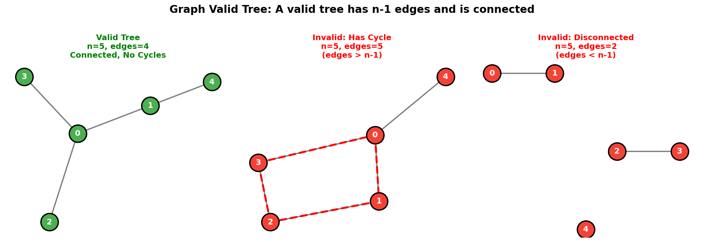
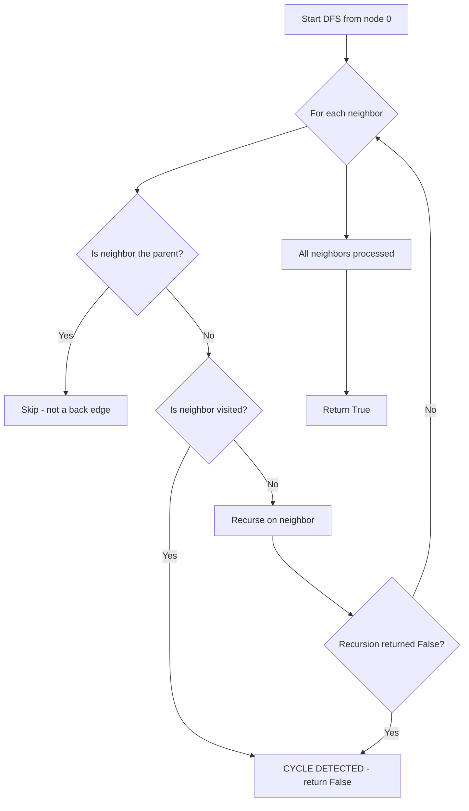
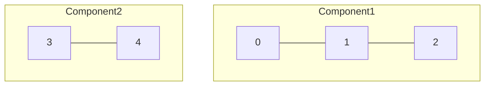
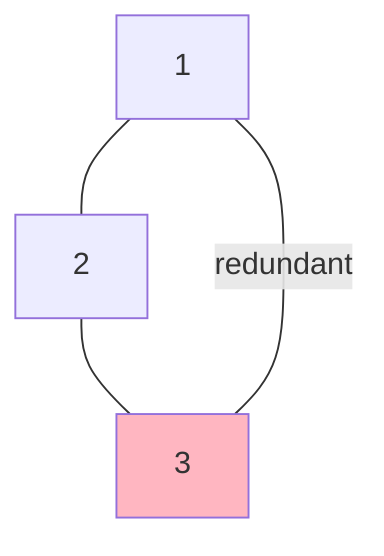
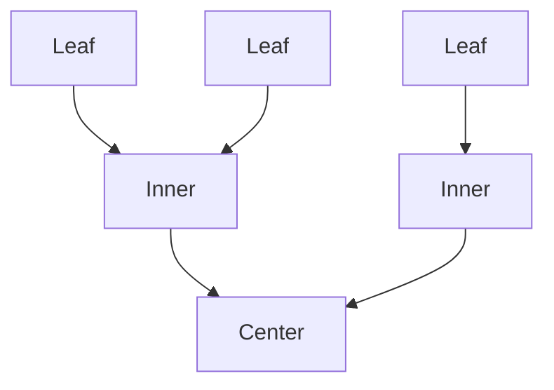

# Graph Valid Tree

> **Checking if an undirected graph forms a valid tree**

---

## Problem Statement

**LeetCode 261: Graph Valid Tree** (Premium)

Given `n` nodes labeled from `0` to `n - 1` and a list of undirected edges (each edge is a pair of nodes), write a function to check whether these edges make up a valid tree.

A valid tree must satisfy:
1. **Connected**: All nodes are reachable from any other node
2. **Acyclic**: No cycles exist in the graph

---

## Visual Overview



---

## Examples

### Example 1: Valid Tree

```
Input: n = 5, edges = [[0,1], [0,2], [0,3], [1,4]]
Output: true

    0
   /|\
  1 2 3
  |
  4

- 5 nodes, 4 edges (n-1 edges: check!)
- All nodes connected: check!
- No cycles: check!
```

### Example 2: Invalid (Has Cycle)

```
Input: n = 5, edges = [[0,1], [1,2], [2,3], [1,3], [1,4]]
Output: false

  0 - 1 - 4
      |\
      2-3

- 5 nodes, 5 edges (more than n-1: cycle exists!)
- Cycle: 1 -> 2 -> 3 -> 1
```

### Example 3: Invalid (Disconnected)

```
Input: n = 5, edges = [[0,1], [2,3]]
Output: false

  0 - 1    2 - 3    4

- 5 nodes, 2 edges (less than n-1: disconnected!)
- Node 4 is isolated
```

---

## Tree Properties

A graph is a valid tree if and only if:

| Property | Requirement |
|----------|-------------|
| **Edge Count** | Exactly `n - 1` edges |
| **Connectivity** | All nodes reachable from any node |
| **No Cycles** | No path that returns to starting node |

**Key Insight**: For an undirected graph, if it has exactly `n - 1` edges AND is connected, it MUST be acyclic (and vice versa). So we only need to verify:
- Edge count = n - 1
- Graph is connected (or no cycle detected)

---

## Solution 1: Union-Find (Optimal)

::: code-group
```python [Python]
class UnionFind:
    def __init__(self, n):
        self.parent = list(range(n))
        self.rank = [0] * n

    def find(self, x):
        if self.parent[x] != x:
            self.parent[x] = self.find(self.parent[x])  # Path compression
        return self.parent[x]

    def union(self, x, y):
        px, py = self.find(x), self.find(y)
        if px == py:
            return False  # Already connected = cycle!

        # Union by rank
        if self.rank[px] < self.rank[py]:
            px, py = py, px
        self.parent[py] = px
        if self.rank[px] == self.rank[py]:
            self.rank[px] += 1
        return True

def validTree(n: int, edges: list[list[int]]) -> bool:
    # Tree property: exactly n-1 edges
    if len(edges) != n - 1:
        return False

    uf = UnionFind(n)

    for u, v in edges:
        # If union fails, nodes already connected = cycle
        if not uf.union(u, v):
            return False

    return True
```

```java [Java]
public boolean validTree(int n, int[][] edges) {
    if (edges.length != n - 1) return false;

    int[] parent = new int[n];
    int[] rank = new int[n];
    for (int i = 0; i < n; i++) parent[i] = i;

    for (int[] edge : edges) {
        int pu = find(parent, edge[0]), pv = find(parent, edge[1]);
        if (pu == pv) return false;
        if (rank[pu] < rank[pv]) { int tmp = pu; pu = pv; pv = tmp; }
        parent[pv] = pu;
        if (rank[pu] == rank[pv]) rank[pu]++;
    }
    return true;
}

private int find(int[] parent, int x) {
    if (parent[x] != x) parent[x] = find(parent, parent[x]);
    return parent[x];
}
```
:::

::: info Complexity: Time O(n * alpha(n)) · Space O(n)
- **Time:** Edge count check O(1), then n-1 union operations each taking O(alpha(n)) amortized time
- **Space:** UnionFind parent and rank arrays each require O(n) space
:::

### Why This Works

1. **Edge count check**: A tree with n nodes has exactly n-1 edges
2. **Union-Find check**: If adding an edge connects two already-connected nodes, there's a cycle
3. **If n-1 edges and no cycle**: Graph must be connected (pigeonhole principle)

### Complexity

| Aspect | Complexity | Explanation |
|--------|------------|-------------|
| Time | O(n * alpha(n)) | Nearly O(n), alpha is inverse Ackermann |
| Space | O(n) | Parent and rank arrays |

---

## Solution 2: DFS Cycle Detection

```python
from collections import defaultdict

def validTree(n: int, edges: list[list[int]]) -> bool:
    if len(edges) != n - 1:
        return False

    # Build adjacency list
    graph = defaultdict(list)
    for u, v in edges:
        graph[u].append(v)
        graph[v].append(u)

    visited = set()

    def dfs(node: int, parent: int) -> bool:
        """Returns True if no cycle detected."""
        visited.add(node)

        for neighbor in graph[node]:
            if neighbor == parent:
                continue  # Don't go back to parent
            if neighbor in visited:
                return False  # Cycle detected!
            if not dfs(neighbor, node):
                return False

        return True

    # Start DFS from node 0
    if not dfs(0, -1):
        return False

    # Check if all nodes were visited (connected)
    return len(visited) == n
```

::: info Complexity: Time O(n) · Space O(n)
- **Time:** Edge count check O(1), DFS visits each node once; with n-1 edges, this is O(n)
- **Space:** Adjacency list O(n-1) = O(n), visited set O(n), recursion stack up to O(n)
:::

### DFS Logic



---

## Solution 3: BFS

```python
from collections import defaultdict, deque

def validTree(n: int, edges: list[list[int]]) -> bool:
    if len(edges) != n - 1:
        return False

    graph = defaultdict(list)
    for u, v in edges:
        graph[u].append(v)
        graph[v].append(u)

    visited = set([0])
    queue = deque([0])

    while queue:
        node = queue.popleft()
        for neighbor in graph[node]:
            if neighbor in visited:
                continue
            visited.add(neighbor)
            queue.append(neighbor)

    return len(visited) == n
```

::: info Complexity: Time O(n) · Space O(n)
- **Time:** BFS visits each node once through n-1 edges; queue operations O(1) each
- **Space:** Adjacency list O(n), visited set O(n), queue up to O(n) nodes
:::

---

## Alternative: Without Edge Count Check

If you can't rely on edge count, you need to check both connectivity AND no cycles:

```python
def validTree(n: int, edges: list[list[int]]) -> bool:
    if n == 0:
        return True

    graph = defaultdict(list)
    for u, v in edges:
        graph[u].append(v)
        graph[v].append(u)

    visited = set()

    def dfs(node: int, parent: int) -> bool:
        visited.add(node)
        for neighbor in graph[node]:
            if neighbor == parent:
                continue
            if neighbor in visited:
                return False  # Cycle
            if not dfs(neighbor, node):
                return False
        return True

    # Check no cycle starting from node 0
    if not dfs(0, -1):
        return False

    # Check all nodes visited (connected)
    return len(visited) == n
```

::: info Complexity: Time O(V + E) · Space O(V + E)
- **Time:** DFS traverses all nodes and edges; connectivity check requires visiting all reachable nodes
- **Space:** Adjacency list O(E), visited set O(V), recursion stack up to O(V)
:::

---

## Common Mistakes

### 1. Forgetting Edge Count Check

```python
# WRONG - Missing edge count check
def validTree(n, edges):
    uf = UnionFind(n)
    for u, v in edges:
        if not uf.union(u, v):
            return False
    return True  # What if graph is disconnected?

# CORRECT
def validTree(n, edges):
    if len(edges) != n - 1:
        return False
    # ... rest of the code
```

### 2. Treating Parent Edge as Cycle (DFS)

```python
# WRONG - Undirected edge looks like a "back edge"
def dfs(node):
    visited.add(node)
    for neighbor in graph[node]:
        if neighbor in visited:
            return False  # False positive! Parent is visited!
        if not dfs(neighbor):
            return False
    return True

# CORRECT - Skip parent
def dfs(node, parent):
    visited.add(node)
    for neighbor in graph[node]:
        if neighbor == parent:
            continue  # Skip the edge we came from
        if neighbor in visited:
            return False
        if not dfs(neighbor, node):
            return False
    return True
```

### 3. Not Handling n=0 or n=1

```python
# Edge cases:
# n=0, edges=[] -> False with the edge-count check (0 != -1); the
#   "Without Edge Count Check" variant returns True (empty tree is valid)
# n=1, edges=[] -> True (single node is valid tree)
# n=2, edges=[] -> False (disconnected)
```

---

## Comparison of Approaches

| Approach | Time | Space | Best For |
|----------|------|-------|----------|
| Union-Find | O(n * alpha(n)) | O(n) | General purpose, multiple queries |
| DFS | O(n) | O(n) | Single query, intuitive |
| BFS | O(n) | O(n) | Single query, iterative |

---

## Interview Tips

1. **State the tree properties**: n-1 edges, connected, acyclic
2. **Mention the shortcut**: With n-1 edges, just check connectivity OR no cycle
3. **Union-Find is impressive**: Shows knowledge of advanced data structures
4. **Handle edge cases**: n=0, n=1, empty edges

### Follow-up Questions

- **Q: What if edges are directed?**
  - A: Different problem - need to check if there's exactly one root with all edges pointing away

- **Q: Can you return the cycle if one exists?**
  - A: Use DFS, track path, when cycle found, backtrack to find cycle nodes

- **Q: What if we want to make it a valid tree by removing edges?**
  - A: Count edges - (n-1) is the number to remove; use cycle detection to find which ones

---

## Related Problems

::: details Number of Connected Components in Undirected Graph (LeetCode 323)
**Problem:** Count number of connected components in an undirected graph with n nodes and edges list.

**Key Insight:** Union-Find counting distinct roots, or DFS/BFS counting traversal starts.



**Approach:** Union-Find: start with n components, decrement on each successful union. Or DFS: count traversal initiations.

**Complexity:** O(E * alpha(N)) with Union-Find, O(V+E) with DFS
:::

::: details Redundant Connection (LeetCode 684)
**Problem:** Find the edge that, when removed, makes the graph a valid tree (find cycle-causing edge).

**Key Insight:** Union-Find - the edge that connects two already-connected nodes creates the cycle.



**Approach:** Process edges with Union-Find. First edge where both endpoints are already in same component is redundant.

**Complexity:** O(N * alpha(N)) time, O(N) space
:::

::: details Minimum Height Trees (LeetCode 310)
**Problem:** Find root(s) that minimize tree height when the graph is rooted at that node.

**Key Insight:** The center(s) of the tree minimize height. Peel leaves layer by layer until 1-2 nodes remain.



**Approach:** Topological sort from leaves (degree 1 nodes) inward. Remaining nodes are roots of MHTs.

**Complexity:** O(V+E) time, O(V+E) space
:::

---

## References

- [LeetCode 261: Graph Valid Tree](https://leetcode.com/problems/graph-valid-tree/)
- [Graph Valid Tree - NeetCode](https://neetcode.io/solutions/graph-valid-tree)
- [Graph Valid Tree - In-Depth Explanation](https://algo.monster/liteproblems/261)
