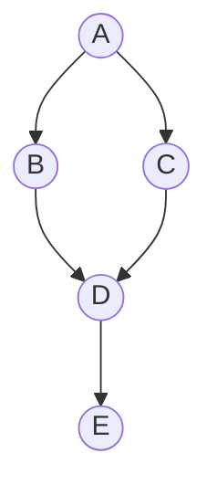
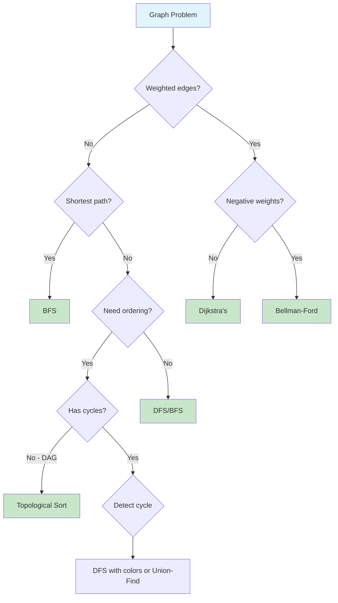

# Graphs

> **Modeling relationships and connectivity**

---

## Overview

A **graph** is a non-linear data structure consisting of **vertices (nodes)** and **edges** that connect pairs of vertices. Graphs are used to represent relationships between objects and are essential for modeling real-world networks, dependencies, and connections.

### What is a Graph?

A graph G = (V, E) consists of:
- **V**: A set of vertices (or nodes)
- **E**: A set of edges connecting pairs of vertices

Graphs can be **directed** (edges have direction) or **undirected** (edges are bidirectional), and **weighted** (edges have costs) or **unweighted**.

### Graph Types Visualization

```
Undirected Graph:          Directed Graph (Digraph):
    A --- B                     A --> B
    |     |                     |     |
    C --- D                     v     v
                                C --> D

Weighted Graph:            Cyclic vs Acyclic:
    A --5-- B                  Cyclic: A -> B -> C -> A
    |       |                  Acyclic (DAG): A -> B -> C
   3|      2|                              (no back edges)
    C --4-- D
```

### When to Use Graphs

| Use Case | Why Graphs Work Well |
|----------|---------------------|
| **Social networks** | Model friendships, followers, connections |
| **Maps/Navigation** | Roads as edges, intersections as vertices |
| **Dependencies** | Course prerequisites, build systems, task scheduling |
| **Web crawling** | Pages as nodes, links as edges |
| **Network routing** | Routers/servers as nodes, connections as edges |
| **Game state trees** | States as nodes, moves as edges |

### When to Consider Alternatives

| Scenario | Better Alternative |
|----------|-------------------|
| Simple parent-child relationships | Tree |
| Linear sequence | Array or Linked List |
| Key-value lookups | Hash Table |
| Priority-based processing | Heap |

---

## Document Structure

| Problem | Difficulty | Algorithm | Link |
|---------|------------|-----------|------|
| Number of Islands | Medium | DFS/BFS | [Link](./islands-oranges) |
| Rotting Oranges | Medium | Multi-source BFS | [Link](./islands-oranges) |
| Course Schedule | Medium | Topological Sort | [Link](./course-schedule-edit) |
| Course Schedule II | Medium | Topological Sort | [Link](./course-schedule-edit) |
| Clone Graph | Medium | DFS/BFS | [Link](./clone-graph) |
| Pacific Atlantic Water Flow | Medium | Multi-source DFS | [Link](./pacific-atlantic) |
| Graph Valid Tree | Medium | Union-Find/DFS | [Link](./graph-valid-tree) |
| Number of Connected Components | Medium | Union-Find/DFS | [Link](./connected-components) |
| Surrounded Regions | Medium | DFS/BFS | [Link](./surrounded-regions) |
| Word Ladder | Hard | BFS | [Link](./word-ladder) |
| Alien Dictionary | Hard | Topological Sort | [Link](./alien-dictionary) |
| Network Delay Time | Medium | Dijkstra's | [Link](./network-delay) |
| Cheapest Flights Within K Stops | Medium | BFS/Bellman-Ford | [Link](./cheapest-flights) |
| Redundant Connection | Medium | Union-Find | [Link](./redundant-connection) |
| Detect Cycle in Graph | Medium | DFS/Union-Find | [Link](./cycle-detection) |

---

## Graph Representations

Choosing the right representation is crucial for both time and space efficiency.

### Adjacency List (Preferred for Interviews)

Best for **sparse graphs** where E << V^2. Most interview problems use this representation.

```python
from collections import defaultdict

# Using defaultdict
graph = defaultdict(list)
graph['A'].append('B')
graph['A'].append('C')
graph['B'].append('D')

# Using regular dict with list comprehension
graph = {node: [] for node in nodes}
graph['A'].append('B')

# From edge list
edges = [(0, 1), (0, 2), (1, 2)]
graph = defaultdict(list)
for u, v in edges:
    graph[u].append(v)
    graph[v].append(u)  # For undirected graph

# Weighted graph
weighted_graph = defaultdict(list)
weighted_graph['A'].append(('B', 5))  # (neighbor, weight)
weighted_graph['A'].append(('C', 3))
```

**Complexity:**
- Space: O(V + E)
- Add edge: O(1)
- Check if edge exists: O(degree of vertex)
- Get all neighbors: O(1)

### Adjacency Matrix

Best for **dense graphs** or when you need O(1) edge lookup.

```python
# For dense graphs or when edge weights matter
n = 5  # number of vertices
matrix = [[0] * n for _ in range(n)]
matrix[i][j] = 1  # Edge from i to j

# Weighted adjacency matrix
INF = float('inf')
weights = [[INF] * n for _ in range(n)]
weights[0][1] = 5  # Edge from 0 to 1 with weight 5

# For undirected graph, set both directions
matrix[i][j] = matrix[j][i] = 1
```

**Complexity:**
- Space: O(V^2)
- Add edge: O(1)
- Check if edge exists: O(1)
- Get all neighbors: O(V)

### Edge List

Useful for **algorithm input** or when processing all edges sequentially.

```python
# Simple edge list
edges = [(0, 1), (1, 2), (2, 0)]

# Weighted edge list
weighted_edges = [(0, 1, 5), (1, 2, 3), (2, 0, 4)]  # (src, dst, weight)

# Convert to adjacency list
from collections import defaultdict
graph = defaultdict(list)
for u, v in edges:
    graph[u].append(v)
    graph[v].append(u)  # Undirected
```

**Complexity:**
- Space: O(E)
- Check if edge exists: O(E)
- Best for: Kruskal's MST, sparse graph storage

### Representation Comparison

| Aspect | Adjacency List | Adjacency Matrix | Edge List |
|--------|---------------|------------------|-----------|
| Space | O(V + E) | O(V^2) | O(E) |
| Add Edge | O(1) | O(1) | O(1) |
| Check Edge | O(degree) | O(1) | O(E) |
| Get Neighbors | O(1) | O(V) | O(E) |
| Best For | Sparse graphs | Dense graphs | Edge-centric algorithms |

---

## Graph Traversals

### Mermaid Diagram



### DFS vs BFS Comparison

| Aspect | DFS | BFS |
|--------|-----|-----|
| **Data Structure** | Stack/Recursion | Queue |
| **Space Complexity** | O(h) height of tree | O(w) width of level |
| **Order** | Goes deep first | Level by level |
| **Shortest Path** | No (unweighted) | Yes (unweighted) |
| **Use Cases** | Cycle detection, paths, topological sort | Shortest path, level order |
| **Memory** | Better for deep graphs | Better for wide graphs |
| **Implementation** | Often recursive | Iterative with queue |

### Depth-First Search (DFS)

Explores as far as possible along each branch before backtracking.

```python
# Recursive DFS
def dfs_recursive(graph, node, visited=None):
    if visited is None:
        visited = set()

    visited.add(node)
    print(node)  # Process node

    for neighbor in graph[node]:
        if neighbor not in visited:
            dfs_recursive(graph, neighbor, visited)

    return visited

# Iterative DFS (using stack)
def dfs_iterative(graph, start):
    visited = set()
    stack = [start]

    while stack:
        node = stack.pop()
        if node not in visited:
            visited.add(node)
            print(node)  # Process node
            # Add neighbors in reverse order for same order as recursive
            for neighbor in reversed(graph[node]):
                if neighbor not in visited:
                    stack.append(neighbor)

    return visited

# DFS for 2D Grid (common interview pattern)
def dfs_grid(grid, row, col, visited):
    rows, cols = len(grid), len(grid[0])

    # Boundary and visited check
    if (row < 0 or row >= rows or
        col < 0 or col >= cols or
        (row, col) in visited or
        grid[row][col] == 0):
        return

    visited.add((row, col))

    # Explore 4 directions
    directions = [(0, 1), (0, -1), (1, 0), (-1, 0)]
    for dr, dc in directions:
        dfs_grid(grid, row + dr, col + dc, visited)
```

### Breadth-First Search (BFS)

Explores all neighbors at current depth before moving to next level.

```python
from collections import deque

# Standard BFS
def bfs(graph, start):
    visited = set([start])
    queue = deque([start])

    while queue:
        node = queue.popleft()
        print(node)  # Process node

        for neighbor in graph[node]:
            if neighbor not in visited:
                visited.add(neighbor)
                queue.append(neighbor)

    return visited

# BFS with Level Tracking (common pattern)
def bfs_levels(graph, start):
    visited = set([start])
    queue = deque([start])
    level = 0

    while queue:
        level_size = len(queue)
        print(f"Level {level}:")

        for _ in range(level_size):
            node = queue.popleft()
            print(f"  {node}")

            for neighbor in graph[node]:
                if neighbor not in visited:
                    visited.add(neighbor)
                    queue.append(neighbor)

        level += 1

# BFS Shortest Path (unweighted graph)
def bfs_shortest_path(graph, start, end):
    if start == end:
        return [start]

    visited = set([start])
    queue = deque([(start, [start])])  # (node, path)

    while queue:
        node, path = queue.popleft()

        for neighbor in graph[node]:
            if neighbor == end:
                return path + [neighbor]

            if neighbor not in visited:
                visited.add(neighbor)
                queue.append((neighbor, path + [neighbor]))

    return []  # No path found

# BFS for 2D Grid
def bfs_grid(grid, start_row, start_col):
    rows, cols = len(grid), len(grid[0])
    visited = set()
    visited.add((start_row, start_col))
    queue = deque([(start_row, start_col, 0)])  # (row, col, distance)

    directions = [(0, 1), (0, -1), (1, 0), (-1, 0)]

    while queue:
        row, col, dist = queue.popleft()

        for dr, dc in directions:
            new_row, new_col = row + dr, col + dc

            if (0 <= new_row < rows and
                0 <= new_col < cols and
                (new_row, new_col) not in visited and
                grid[new_row][new_col] == 1):

                visited.add((new_row, new_col))
                queue.append((new_row, new_col, dist + 1))

    return visited
```

---

## Common Graph Algorithms

### 1. DFS/BFS Traversal

Core building blocks for most graph problems. See implementations above.

### 2. Topological Sort

Orders vertices in a DAG so every edge goes from earlier to later vertex.

```python
from collections import deque, defaultdict

# Kahn's Algorithm (BFS-based)
def topological_sort_kahn(num_vertices, edges):
    """
    Returns topological order or empty list if cycle exists.
    edges: list of (u, v) meaning u must come before v
    """
    graph = defaultdict(list)
    in_degree = [0] * num_vertices

    # Build graph and count in-degrees
    for u, v in edges:
        graph[u].append(v)
        in_degree[v] += 1

    # Start with all vertices with no incoming edges
    queue = deque([v for v in range(num_vertices) if in_degree[v] == 0])
    result = []

    while queue:
        node = queue.popleft()
        result.append(node)

        for neighbor in graph[node]:
            in_degree[neighbor] -= 1
            if in_degree[neighbor] == 0:
                queue.append(neighbor)

    # Check if all vertices are included (no cycle)
    return result if len(result) == num_vertices else []

# DFS-based Topological Sort
def topological_sort_dfs(num_vertices, edges):
    graph = defaultdict(list)
    for u, v in edges:
        graph[u].append(v)

    visited = set()
    rec_stack = set()  # For cycle detection
    result = []

    def dfs(node):
        if node in rec_stack:
            return False  # Cycle detected
        if node in visited:
            return True

        rec_stack.add(node)

        for neighbor in graph[node]:
            if not dfs(neighbor):
                return False

        rec_stack.remove(node)
        visited.add(node)
        result.append(node)
        return True

    for v in range(num_vertices):
        if v not in visited:
            if not dfs(v):
                return []  # Cycle exists

    return result[::-1]  # Reverse for correct order
```

### 3. Union-Find (Disjoint Set Union)

Tracks elements partitioned into disjoint sets. Essential for connected components and cycle detection.

```python
class UnionFind:
    def __init__(self, n):
        self.parent = list(range(n))
        self.rank = [0] * n
        self.count = n  # Number of connected components

    def find(self, x):
        """Find root with path compression"""
        if self.parent[x] != x:
            self.parent[x] = self.find(self.parent[x])
        return self.parent[x]

    def union(self, x, y):
        """Union by rank, returns False if already connected"""
        px, py = self.find(x), self.find(y)

        if px == py:
            return False  # Already in same set (cycle in undirected graph)

        # Union by rank
        if self.rank[px] < self.rank[py]:
            px, py = py, px
        self.parent[py] = px

        if self.rank[px] == self.rank[py]:
            self.rank[px] += 1

        self.count -= 1
        return True

    def connected(self, x, y):
        """Check if two elements are in the same set"""
        return self.find(x) == self.find(y)

# Example: Find number of connected components
def count_components(n, edges):
    uf = UnionFind(n)
    for u, v in edges:
        uf.union(u, v)
    return uf.count
```

### 4. Dijkstra's Algorithm (Weighted Shortest Path)

Finds shortest path from source to all vertices in weighted graph with non-negative edges.

```python
import heapq
from collections import defaultdict

def dijkstra(graph, start, n):
    """
    graph: adjacency list where graph[u] = [(v, weight), ...]
    Returns: distances dict from start to all vertices
    """
    distances = {i: float('inf') for i in range(n)}
    distances[start] = 0

    # Min-heap: (distance, node)
    heap = [(0, start)]
    visited = set()

    while heap:
        dist, node = heapq.heappop(heap)

        if node in visited:
            continue
        visited.add(node)

        for neighbor, weight in graph[node]:
            new_dist = dist + weight
            if new_dist < distances[neighbor]:
                distances[neighbor] = new_dist
                heapq.heappush(heap, (new_dist, neighbor))

    return distances

# Dijkstra with path reconstruction
def dijkstra_with_path(graph, start, end, n):
    distances = {i: float('inf') for i in range(n)}
    distances[start] = 0
    parent = {start: None}

    heap = [(0, start)]
    visited = set()

    while heap:
        dist, node = heapq.heappop(heap)

        if node == end:
            break

        if node in visited:
            continue
        visited.add(node)

        for neighbor, weight in graph[node]:
            new_dist = dist + weight
            if new_dist < distances[neighbor]:
                distances[neighbor] = new_dist
                parent[neighbor] = node
                heapq.heappush(heap, (new_dist, neighbor))

    # Reconstruct path
    if distances[end] == float('inf'):
        return float('inf'), []

    path = []
    current = end
    while current is not None:
        path.append(current)
        current = parent[current]

    return distances[end], path[::-1]
```

### 5. Cycle Detection

```python
# Cycle Detection in Undirected Graph (DFS)
def has_cycle_undirected(graph, n):
    visited = set()

    def dfs(node, parent):
        visited.add(node)

        for neighbor in graph[node]:
            if neighbor not in visited:
                if dfs(neighbor, node):
                    return True
            elif neighbor != parent:
                return True  # Found cycle

        return False

    # Check all components
    for v in range(n):
        if v not in visited:
            if dfs(v, -1):
                return True

    return False

# Cycle Detection in Directed Graph (DFS with recursion stack)
def has_cycle_directed(graph, n):
    visited = set()
    rec_stack = set()

    def dfs(node):
        visited.add(node)
        rec_stack.add(node)

        for neighbor in graph[node]:
            if neighbor not in visited:
                if dfs(neighbor):
                    return True
            elif neighbor in rec_stack:
                return True  # Back edge found

        rec_stack.remove(node)
        return False

    for v in range(n):
        if v not in visited:
            if dfs(v):
                return True

    return False

# Cycle Detection using Union-Find (Undirected only)
def has_cycle_union_find(n, edges):
    uf = UnionFind(n)
    for u, v in edges:
        if not uf.union(u, v):
            return True  # Already connected = cycle
    return False
```

### 6. Bellman-Ford Algorithm

Handles negative edge weights and detects negative cycles.

```python
def bellman_ford(n, edges, start):
    """
    edges: list of (u, v, weight)
    Returns: distances dict, or None if negative cycle exists
    """
    distances = {i: float('inf') for i in range(n)}
    distances[start] = 0

    # Relax all edges V-1 times
    for _ in range(n - 1):
        for u, v, weight in edges:
            if distances[u] != float('inf') and distances[u] + weight < distances[v]:
                distances[v] = distances[u] + weight

    # Check for negative cycle
    for u, v, weight in edges:
        if distances[u] != float('inf') and distances[u] + weight < distances[v]:
            return None  # Negative cycle detected

    return distances
```

### Algorithm Selection Guide



---

## Common Graph Patterns

### Pattern 1: Island Counting (Connected Components)

```python
def num_islands(grid):
    if not grid:
        return 0

    rows, cols = len(grid), len(grid[0])
    visited = set()
    count = 0

    def dfs(r, c):
        if (r < 0 or r >= rows or c < 0 or c >= cols or
            (r, c) in visited or grid[r][c] == '0'):
            return

        visited.add((r, c))
        dfs(r + 1, c)
        dfs(r - 1, c)
        dfs(r, c + 1)
        dfs(r, c - 1)

    for r in range(rows):
        for c in range(cols):
            if grid[r][c] == '1' and (r, c) not in visited:
                dfs(r, c)
                count += 1

    return count
```

### Pattern 2: Multi-source BFS (Rotting Oranges)

```python
from collections import deque

def oranges_rotting(grid):
    rows, cols = len(grid), len(grid[0])
    queue = deque()
    fresh = 0

    # Find all rotten oranges and count fresh ones
    for r in range(rows):
        for c in range(cols):
            if grid[r][c] == 2:
                queue.append((r, c))
            elif grid[r][c] == 1:
                fresh += 1

    if fresh == 0:
        return 0

    minutes = -1
    directions = [(0, 1), (0, -1), (1, 0), (-1, 0)]

    while queue:
        minutes += 1
        for _ in range(len(queue)):
            r, c = queue.popleft()

            for dr, dc in directions:
                nr, nc = r + dr, c + dc
                if (0 <= nr < rows and 0 <= nc < cols and
                    grid[nr][nc] == 1):
                    grid[nr][nc] = 2
                    fresh -= 1
                    queue.append((nr, nc))

    return minutes if fresh == 0 else -1
```

### Pattern 3: Clone Graph (Deep Copy)

```python
def clone_graph(node):
    if not node:
        return None

    cloned = {}

    def dfs(node):
        if node in cloned:
            return cloned[node]

        copy = Node(node.val)
        cloned[node] = copy

        for neighbor in node.neighbors:
            copy.neighbors.append(dfs(neighbor))

        return copy

    return dfs(node)
```

### Pattern 4: Course Schedule (Topological Sort)

```python
def can_finish(num_courses, prerequisites):
    graph = defaultdict(list)
    in_degree = [0] * num_courses

    for course, prereq in prerequisites:
        graph[prereq].append(course)
        in_degree[course] += 1

    queue = deque([c for c in range(num_courses) if in_degree[c] == 0])
    completed = 0

    while queue:
        course = queue.popleft()
        completed += 1

        for next_course in graph[course]:
            in_degree[next_course] -= 1
            if in_degree[next_course] == 0:
                queue.append(next_course)

    return completed == num_courses
```

---

## Interview Focus

Based on recent SDE interview patterns, these graph topics are most frequently tested:

### High Priority Topics

1. **2D Grid Traversal** - Number of Islands, Rotting Oranges, Flood Fill
2. **Topological Sort** - Course Schedule, Alien Dictionary, Build Order
3. **Shortest Path** - Word Ladder, Network Delay Time
4. **Cycle Detection** - Course Schedule validity, detecting circular dependencies
5. **Connected Components** - Union-Find problems, Graph Valid Tree

### Common Google Graph Questions

| Question Type | Example Problem | Key Insight |
|--------------|-----------------|-------------|
| Grid DFS/BFS | Number of Islands | Treat 2D matrix as implicit graph |
| Dependency Resolution | Course Schedule | Topological sort on prerequisites |
| Shortest Transformation | Word Ladder | BFS for unweighted shortest path |
| Graph Clone | Clone Graph | DFS/BFS with hash map for mapping |
| Connectivity | Graph Valid Tree | Union-Find or DFS cycle detection |
| Network Problems | Network Delay Time | Dijkstra's algorithm |

### Common Mistakes to Avoid

1. **Forgetting to mark visited before enqueueing** - Can lead to duplicate processing
2. **Creating copies of visited set in recursion** - Use the same set across all calls
3. **Not handling disconnected graphs** - Always iterate through all nodes
4. **Confusing directed vs undirected cycle detection** - Different algorithms needed
5. **Off-by-one errors in grid traversal** - Check boundary conditions carefully

### What Interviewers Look For

1. **Clarifying Questions**
   - Is the graph directed or undirected?
   - Are there any cycles?
   - Can there be disconnected components?
   - Are edge weights positive?

2. **Problem-Solving Approach**
   - Identify the graph structure (explicit vs implicit)
   - Choose appropriate representation
   - Select the right algorithm
   - Discuss time/space tradeoffs

3. **Code Quality**
   - Clean handling of visited nodes
   - Proper boundary checking for grids
   - Meaningful variable names
   - Handle edge cases (empty graph, single node)

4. **Complexity Analysis**
   - Time: Usually O(V + E) for traversals
   - Space: Consider recursion stack for DFS

---

## Practice Progression

### Week 1: Foundations

| Day | Focus | Problems |
|-----|-------|----------|
| 1 | DFS/BFS Basics | Number of Islands, Flood Fill |
| 2 | Grid Traversal | Rotting Oranges, Surrounded Regions |
| 3 | Graph Clone | Clone Graph, Copy List with Random Pointer |

### Week 2: Intermediate

| Day | Focus | Problems |
|-----|-------|----------|
| 4 | Topological Sort | Course Schedule I & II, Alien Dictionary |
| 5 | Shortest Path | Word Ladder, Network Delay Time |
| 6 | Union-Find | Number of Connected Components, Graph Valid Tree |

### Week 3: Advanced

| Day | Focus | Problems |
|-----|-------|----------|
| 7 | Cycle Detection | Detect Cycle (directed/undirected), Redundant Connection |
| 8 | Weighted Graphs | Cheapest Flights, Path with Minimum Effort |
| 9 | Mixed Practice | Random selection from all patterns |

---

## Quick Reference Card

### Time Complexity Cheat Sheet

```
BFS/DFS:         O(V + E)    - Visit each vertex and edge once
Topological Sort: O(V + E)   - Modified DFS/BFS
Dijkstra:        O((V + E) log V) - With binary heap
Bellman-Ford:    O(V * E)    - Relax all edges V-1 times
Union-Find:      O(alpha(n)) - Nearly O(1) with optimizations
```

### Pattern Recognition Triggers

| If you see... | Think about... |
|--------------|----------------|
| "Number of islands/regions" | DFS/BFS flood fill |
| "Shortest path" (unweighted) | BFS |
| "Shortest path" (weighted) | Dijkstra's |
| "Prerequisites/dependencies" | Topological Sort |
| "Valid tree" | Union-Find or DFS cycle detection |
| "Connected components" | Union-Find or DFS |
| "Clone/copy graph" | DFS with hash map |
| "Transform word to word" | BFS with word as node |
| "Detect cycle" | DFS (directed) or Union-Find (undirected) |

---

## Resources

### Recommended Practice

- [LeetCode Graph Problems](https://leetcode.com/tag/graph/)
- [NeetCode Graph Playlist](https://neetcode.io/roadmap)
- [Grind 75 - Graph Section](https://www.techinterviewhandbook.org/grind75)

### Further Reading

- [GeeksforGeeks - Top 50 Graph Coding Problems](https://www.geeksforgeeks.org/dsa/top-50-graph-coding-problems-for-interviews/)
- [Tech Interview Handbook - Graph Cheatsheet](https://www.techinterviewhandbook.org/algorithms/graph/)
- [IGotAnOffer - 50+ Graph Interview Questions](https://igotanoffer.com/blogs/tech/graph-interview-questions)
- [Striver Graph Series](https://takeuforward.org/graph/striver-graph-series-top-graph-interview-questions)

---

*Last updated: January 2026*

*Graphs are among the most versatile data structures in computer science. Master DFS, BFS, and topological sort first - they form the foundation for solving the majority of graph problems in technical interviews.*
