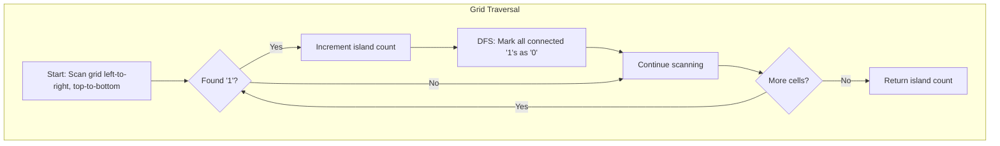
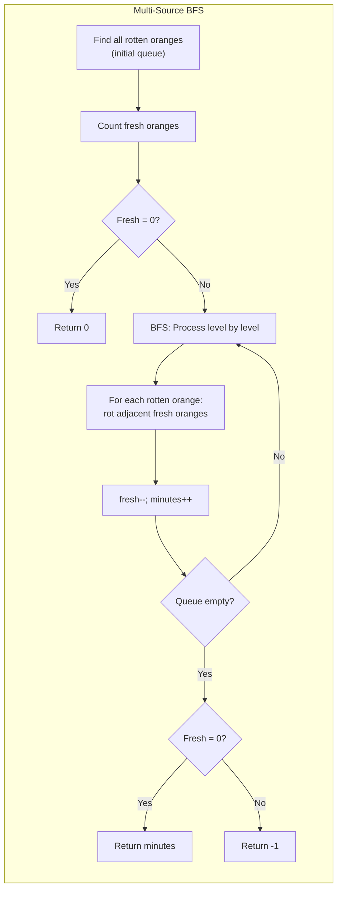
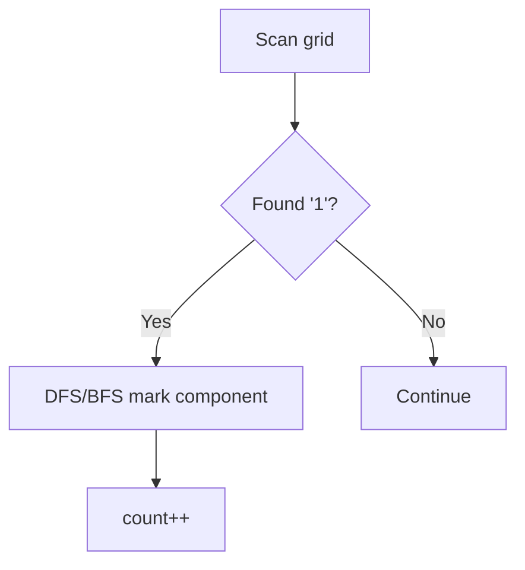
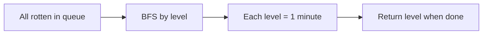
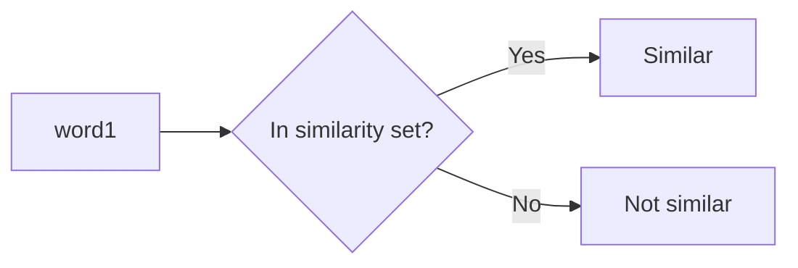
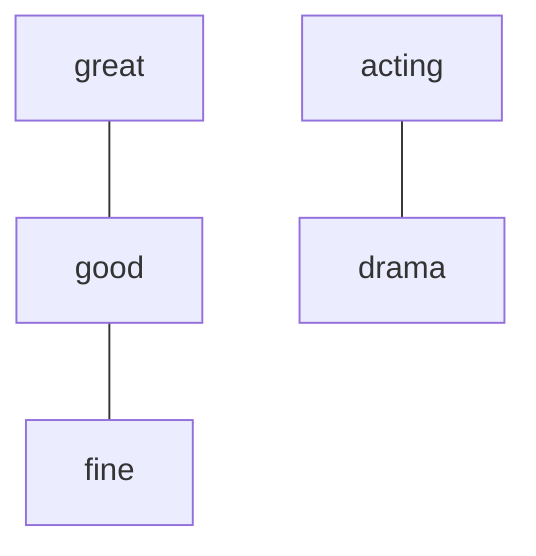
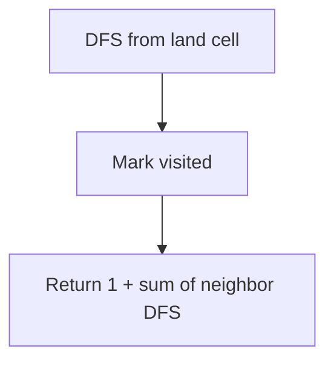
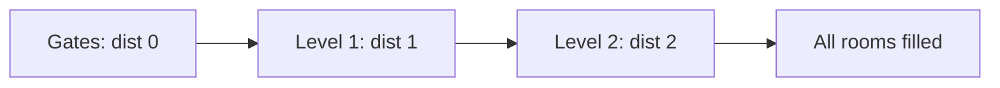
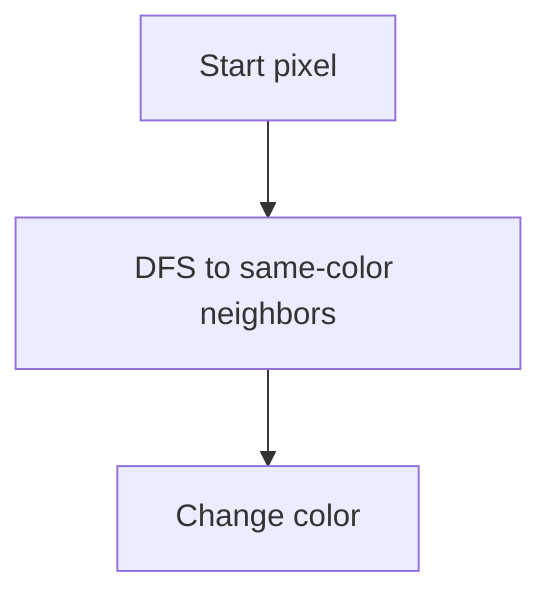
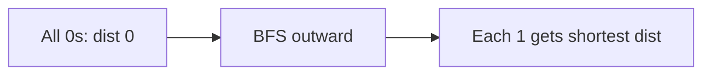

# Number of Islands & Rotting Oranges

> **Grid traversal and multi-source BFS**

---

## Overview

Grid-based graph problems are a staple of technical interviews, particularly at top tech companies. These problems treat a 2D grid as an implicit graph where each cell is a node and adjacent cells (up, down, left, right) are connected edges. The two most common traversal patterns are:

1. **Single-source DFS/BFS**: Start from one cell and explore connected components (Number of Islands)
2. **Multi-source BFS**: Start from multiple sources simultaneously and expand outward (Rotting Oranges)

---

## Number of Islands

### Problem Statement

Given an `m x n` 2D binary grid map of `'1'`s (land) and `'0'`s (water), return the number of islands. An island is surrounded by water and is formed by connecting adjacent lands horizontally or vertically. You may assume all four edges of the grid are surrounded by water.

**LeetCode 200** - Medium

### Example

```
Input:
11110
11010
11000
00000

Output: 1

Input:
11000
11000
00100
00011

Output: 3
```

### Approach

The key insight is that each island is a **connected component** of land cells. We can count islands by:

1. Iterate through every cell in the grid
2. When we find an unvisited land cell (`'1'`), we've discovered a new island
3. Use DFS/BFS to mark all connected land cells as visited (by changing them to `'0'`)
4. Increment our island counter

This "flood fill" technique ensures each island is counted exactly once.

### Mermaid Diagram



### Solution

::: code-group
```python [Python]
def numIslands(grid: list[list[str]]) -> int:
    if not grid or not grid[0]:
        return 0

    rows, cols = len(grid), len(grid[0])
    count = 0

    def dfs(r: int, c: int) -> None:
        # Base case: out of bounds or water
        if r < 0 or r >= rows or c < 0 or c >= cols or grid[r][c] != '1':
            return

        # Mark as visited by sinking the land
        grid[r][c] = '0'

        # Explore all 4 directions
        dfs(r + 1, c)  # down
        dfs(r - 1, c)  # up
        dfs(r, c + 1)  # right
        dfs(r, c - 1)  # left

    for r in range(rows):
        for c in range(cols):
            if grid[r][c] == '1':
                count += 1
                dfs(r, c)

    return count
```

```java [Java]
public int numIslands(char[][] grid) {
    if (grid == null || grid.length == 0) return 0;
    int rows = grid.length, cols = grid[0].length, count = 0;
    int[][] DIRS = {{0,1},{0,-1},{1,0},{-1,0}};

    for (int r = 0; r < rows; r++) {
        for (int c = 0; c < cols; c++) {
            if (grid[r][c] == '1') {
                count++;
                // BFS flood-fill
                Deque<int[]> q = new ArrayDeque<>();
                q.offer(new int[]{r, c});
                grid[r][c] = '0';
                while (!q.isEmpty()) {
                    int[] cur = q.poll();
                    for (int[] d : DIRS) {
                        int nr = cur[0] + d[0], nc = cur[1] + d[1];
                        if (nr >= 0 && nr < rows && nc >= 0 && nc < cols && grid[nr][nc] == '1') {
                            grid[nr][nc] = '0';
                            q.offer(new int[]{nr, nc});
                        }
                    }
                }
            }
        }
    }
    return count;
}
```
:::

::: info Complexity: Time O(m * n) · Space O(m * n)
- **Time:** Each cell visited at most once; DFS explores 4 neighbors per cell
- **Space:** Recursion stack can reach O(m*n) depth for a single large island (worst case: all land in spiral)
:::

### Solution (BFS)

```python
from collections import deque

def numIslands(grid: list[list[str]]) -> int:
    if not grid or not grid[0]:
        return 0

    rows, cols = len(grid), len(grid[0])
    count = 0
    directions = [(0, 1), (0, -1), (1, 0), (-1, 0)]

    def bfs(start_r: int, start_c: int) -> None:
        queue = deque([(start_r, start_c)])
        grid[start_r][start_c] = '0'

        while queue:
            r, c = queue.popleft()
            for dr, dc in directions:
                nr, nc = r + dr, c + dc
                if 0 <= nr < rows and 0 <= nc < cols and grid[nr][nc] == '1':
                    grid[nr][nc] = '0'
                    queue.append((nr, nc))

    for r in range(rows):
        for c in range(cols):
            if grid[r][c] == '1':
                count += 1
                bfs(r, c)

    return count
```

::: info Complexity: Time O(m * n) · Space O(min(m, n))
- **Time:** Each cell visited once, BFS processes each cell's 4 neighbors
- **Space:** Queue holds at most one "frontier" layer; for a grid, frontier width is O(min(m, n))
:::

### Complexity

| Aspect | Complexity | Explanation |
|--------|------------|-------------|
| Time | O(m * n) | Each cell is visited at most once |
| Space (DFS) | O(m * n) | Worst case recursion stack (all land in a line) |
| Space (BFS) | O(min(m, n)) | Queue holds at most one "frontier" |

### Edge Cases

- Empty grid: return 0
- Grid with all water: return 0
- Grid with all land: return 1
- Single cell grid

---

## Rotting Oranges

### Problem Statement

You are given an `m x n` grid where each cell can have one of three values:

- `0` representing an empty cell
- `1` representing a fresh orange
- `2` representing a rotten orange

Every minute, any fresh orange that is 4-directionally adjacent to a rotten orange becomes rotten. Return the minimum number of minutes that must elapse until no cell has a fresh orange. If this is impossible, return `-1`.

**LeetCode 994** - Medium

### Example

```
Input: grid = [[2,1,1],[1,1,0],[0,1,1]]
Output: 4

Visualization:
Minute 0:   Minute 1:   Minute 2:   Minute 3:   Minute 4:
2 1 1       2 2 1       2 2 2       2 2 2       2 2 2
1 1 0       2 1 0       2 2 0       2 2 0       2 2 0
0 1 1       0 1 1       0 1 1       0 2 1       0 2 2
```

### Approach

This is a classic **multi-source BFS** problem. Unlike Number of Islands where we start from a single source, here we need to simulate rot spreading from ALL rotten oranges simultaneously.

Key steps:
1. **Initialize**: Find all initially rotten oranges (add to queue) and count fresh oranges
2. **BFS by levels**: Process all oranges at the current "minute" before moving to the next
3. **Track time**: Each BFS level represents one minute passing
4. **Validate**: After BFS, check if any fresh oranges remain

### Mermaid Diagram



### Solution

::: code-group
```python [Python]
from collections import deque

def orangesRotting(grid: list[list[int]]) -> int:
    rows, cols = len(grid), len(grid[0])
    queue = deque()
    fresh = 0

    # Step 1: Initialize - find all rotten oranges and count fresh
    for r in range(rows):
        for c in range(cols):
            if grid[r][c] == 2:
                queue.append((r, c))
            elif grid[r][c] == 1:
                fresh += 1

    # Edge case: no fresh oranges to rot
    if fresh == 0:
        return 0

    directions = [(0, 1), (0, -1), (1, 0), (-1, 0)]
    minutes = 0

    # Step 2: Multi-source BFS
    while queue and fresh > 0:
        minutes += 1
        # Process all oranges at current minute (level-order BFS)
        for _ in range(len(queue)):
            r, c = queue.popleft()

            for dr, dc in directions:
                nr, nc = r + dr, c + dc
                # Check bounds and if orange is fresh
                if 0 <= nr < rows and 0 <= nc < cols and grid[nr][nc] == 1:
                    grid[nr][nc] = 2  # Rot the orange
                    fresh -= 1
                    queue.append((nr, nc))

    # Step 3: Check if all oranges are rotten
    return minutes if fresh == 0 else -1
```

```java [Java]
public int orangesRotting(int[][] grid) {
    int rows = grid.length, cols = grid[0].length;
    int[][] DIRS = {{0,1},{0,-1},{1,0},{-1,0}};
    Deque<int[]> q = new ArrayDeque<>();
    int fresh = 0;

    for (int r = 0; r < rows; r++)
        for (int c = 0; c < cols; c++) {
            if (grid[r][c] == 2) q.offer(new int[]{r, c});
            else if (grid[r][c] == 1) fresh++;
        }

    if (fresh == 0) return 0;

    int minutes = 0;
    while (!q.isEmpty() && fresh > 0) {
        minutes++;
        for (int size = q.size(); size > 0; size--) {
            int[] cur = q.poll();
            for (int[] d : DIRS) {
                int nr = cur[0] + d[0], nc = cur[1] + d[1];
                if (nr >= 0 && nr < rows && nc >= 0 && nc < cols && grid[nr][nc] == 1) {
                    grid[nr][nc] = 2;
                    fresh--;
                    q.offer(new int[]{nr, nc});
                }
            }
        }
    }
    return fresh == 0 ? minutes : -1;
}
```
:::

::: info Complexity: Time O(m * n) · Space O(m * n)
- **Time:** Each cell processed at most once; initialization scans entire grid O(m*n)
- **Space:** Queue can hold all cells in worst case when all are rotten; grid modified in-place
:::

### Alternative Solution (Track Time in Queue)

```python
from collections import deque

def orangesRotting(grid: list[list[int]]) -> int:
    rows, cols = len(grid), len(grid[0])
    queue = deque()
    fresh = 0

    for r in range(rows):
        for c in range(cols):
            if grid[r][c] == 2:
                queue.append((r, c, 0))  # (row, col, time)
            elif grid[r][c] == 1:
                fresh += 1

    if fresh == 0:
        return 0

    directions = [(0, 1), (0, -1), (1, 0), (-1, 0)]
    max_minutes = 0

    while queue:
        r, c, minutes = queue.popleft()

        for dr, dc in directions:
            nr, nc = r + dr, c + dc
            if 0 <= nr < rows and 0 <= nc < cols and grid[nr][nc] == 1:
                grid[nr][nc] = 2
                fresh -= 1
                max_minutes = max(max_minutes, minutes + 1)
                queue.append((nr, nc, minutes + 1))

    return max_minutes if fresh == 0 else -1
```

::: info Complexity: Time O(m * n) · Space O(m * n)
- **Time:** Same as level-order BFS; each cell dequeued once
- **Space:** Queue entries include timestamp; can hold O(m*n) tuples in worst case
:::

### Complexity

| Aspect | Complexity | Explanation |
|--------|------------|-------------|
| Time | O(m * n) | Each cell processed at most once |
| Space | O(m * n) | Queue can hold all cells in worst case |

### Edge Cases

- No fresh oranges initially: return 0
- Fresh orange isolated (surrounded by empty/edges): return -1
- All oranges already rotten: return 0
- Single rotten orange in corner

---

## Sentence Similarity

### Problem Statement

We can represent a sentence as an array of words. Given two sentences `sentence1` and `sentence2` each represented as a string array, and given an array of string pairs `similarPairs` where `similarPairs[i] = [xi, yi]` indicates that the two words `xi` and `yi` are similar.

Return `true` if `sentence1` and `sentence2` are similar, or `false` if they are not similar.

Two sentences are similar if:
- They have the same length
- `sentence1[i]` and `sentence2[i]` are similar for all valid `i`

**LeetCode 734** - Easy (non-transitive)
**LeetCode 737** - Medium (transitive similarity)

### Solution (Non-Transitive - LeetCode 734)

In the basic version, similarity is NOT transitive. If "great" ~ "good" and "good" ~ "fine", we cannot conclude "great" ~ "fine".

```python
def areSentencesSimilar(sentence1: list[str], sentence2: list[str],
                        similarPairs: list[list[str]]) -> bool:
    # Sentences must have same length
    if len(sentence1) != len(sentence2):
        return False

    # Build similarity set (store both directions for O(1) lookup)
    similar = set()
    for a, b in similarPairs:
        similar.add((a, b))
        similar.add((b, a))

    # Check each word pair
    for w1, w2 in zip(sentence1, sentence2):
        if w1 != w2 and (w1, w2) not in similar:
            return False

    return True
```

::: info Complexity: Time O(n + p) · Space O(p)
- **Time:** Building similarity set O(p), then O(n) word comparisons with O(1) set lookup each
- **Space:** Similarity set stores 2p pairs (both directions for each similar pair)
:::

### Transitive Similarity with Union-Find (LeetCode 737)

When similarity IS transitive, we need to group all transitively similar words together. Union-Find is perfect for this.

```python
class UnionFind:
    def __init__(self):
        self.parent = {}
        self.rank = {}

    def find(self, x: str) -> str:
        if x not in self.parent:
            self.parent[x] = x
            self.rank[x] = 0
        if self.parent[x] != x:
            self.parent[x] = self.find(self.parent[x])  # Path compression
        return self.parent[x]

    def union(self, x: str, y: str) -> None:
        px, py = self.find(x), self.find(y)
        if px == py:
            return
        # Union by rank
        if self.rank[px] < self.rank[py]:
            px, py = py, px
        self.parent[py] = px
        if self.rank[px] == self.rank[py]:
            self.rank[px] += 1

def areSentencesSimilarTwo(sentence1: list[str], sentence2: list[str],
                           similarPairs: list[list[str]]) -> bool:
    if len(sentence1) != len(sentence2):
        return False

    uf = UnionFind()

    # Build connected components of similar words
    for a, b in similarPairs:
        uf.union(a, b)

    # Check each word pair
    for w1, w2 in zip(sentence1, sentence2):
        if w1 != w2 and uf.find(w1) != uf.find(w2):
            return False

    return True
```

::: info Complexity: Time O((n + p) * alpha(p)) · Space O(p)
- **Time:** Building Union-Find O(p * alpha(p)), then O(n) word comparisons with O(alpha(p)) find each
- **Space:** Union-Find parent and rank dictionaries store up to 2p unique words
:::

### Alternative: DFS for Transitive Similarity

```python
from collections import defaultdict

def areSentencesSimilarTwo(sentence1: list[str], sentence2: list[str],
                           similarPairs: list[list[str]]) -> bool:
    if len(sentence1) != len(sentence2):
        return False

    # Build adjacency list graph
    graph = defaultdict(set)
    for a, b in similarPairs:
        graph[a].add(b)
        graph[b].add(a)

    def dfs(source: str, target: str, visited: set) -> bool:
        if source == target:
            return True
        visited.add(source)
        for neighbor in graph[source]:
            if neighbor not in visited:
                if dfs(neighbor, target, visited):
                    return True
        return False

    for w1, w2 in zip(sentence1, sentence2):
        if w1 != w2 and not dfs(w1, w2, set()):
            return False

    return True
```

::: info Complexity: Time O(n * p) · Space O(p)
- **Time:** For each of n word pairs, DFS may visit O(p) edges in the similarity graph
- **Space:** Adjacency list stores 2p edges; visited set up to O(p) per DFS call
:::

### Complexity Comparison

| Approach | Time | Space | Best For |
|----------|------|-------|----------|
| Set (non-transitive) | O(n + p) | O(p) | LeetCode 734 |
| Union-Find | O(n + p * alpha(p)) | O(p) | LeetCode 737, many queries |
| DFS | O(n * p) | O(p) | One-time check, small p |

Note: alpha(n) is the inverse Ackermann function, effectively constant.

---

## Pattern Recognition: Grid Problems

### When to Use DFS vs BFS

| Pattern | Use DFS | Use BFS |
|---------|---------|---------|
| Count connected components | Yes | Yes |
| Find shortest path | No | Yes |
| Spread from multiple sources | No | Yes |
| Detect cycles | Yes | Yes |
| Topological sort | Yes | No |

### Common Grid Problem Templates

**Template 1: Connected Components (Number of Islands)**
```python
def solve(grid):
    count = 0
    for each cell:
        if unvisited and meets_criteria:
            count += 1
            mark_all_connected(cell)
    return count
```

**Template 2: Multi-Source BFS (Rotting Oranges)**
```python
def solve(grid):
    queue = deque([all_sources])
    while queue:
        for _ in range(len(queue)):  # Process by level
            curr = queue.popleft()
            for neighbor in get_neighbors(curr):
                if valid(neighbor):
                    process(neighbor)
                    queue.append(neighbor)
```

**Template 3: Shortest Path in Unweighted Grid**
```python
def solve(grid, start, end):
    queue = deque([(start, 0)])
    visited = {start}
    while queue:
        curr, dist = queue.popleft()
        if curr == end:
            return dist
        for neighbor in get_neighbors(curr):
            if neighbor not in visited and valid(neighbor):
                visited.add(neighbor)
                queue.append((neighbor, dist + 1))
    return -1
```

---

## Interview Applications

These grid traversal patterns appear frequently in technical interviews:

1. **Number of Islands variations:**
   - Max Area of Island (LeetCode 695)
   - Number of Distinct Islands (LeetCode 694)
   - Making A Large Island (LeetCode 827)

2. **Multi-source BFS applications:**
   - Walls and Gates (LeetCode 286)
   - Shortest Distance from All Buildings (LeetCode 317)
   - Pacific Atlantic Water Flow (LeetCode 417)

3. **Union-Find on grids:**
   - Number of Islands II (LeetCode 305) - dynamic island counting
   - Surrounded Regions (LeetCode 130)
   - Redundant Connection (LeetCode 684)

### Interview Tips

1. **Clarify the grid representation**: Is it a list of strings or list of lists? Are values chars or ints?
2. **Ask about modifications**: Can you modify the input grid or need a visited set?
3. **Consider edge cases**: Empty grid, single cell, all same value
4. **Think about follow-ups**:
   - "What if we need to count cells in each island?"
   - "What if islands can be added dynamically?"
   - "What if we have 8-directional connectivity?"

---

## Practice Problems

::: details Number of Islands (LeetCode 200)
**Problem:** Count number of islands (connected '1' regions) in a 2D grid of '1's (land) and '0's (water).

**Key Insight:** Classic connected components on a grid using flood fill.



**Approach:** For each unvisited land cell, DFS to mark entire island, increment island count.

**Complexity:** O(M*N) time, O(M*N) space
:::

::: details Rotting Oranges (LeetCode 994)
**Problem:** Find minimum minutes for all fresh oranges to rot, given rotten oranges spread to adjacent fresh ones each minute.

**Key Insight:** Multi-source BFS from all initially rotten oranges.



**Approach:** Initialize queue with all rotten oranges, BFS level-by-level, count minutes.

**Complexity:** O(M*N) time, O(M*N) space
:::

::: details Sentence Similarity (LeetCode 734)
**Problem:** Check if two sentences are similar given pairs of directly similar words (non-transitive).

**Key Insight:** Simple hash set lookup for direct similarity pairs.



**Approach:** Build set of similar pairs, check each word pair in sentences.

**Complexity:** O(N + P) time, O(P) space where P = number of pairs
:::

::: details Sentence Similarity II (LeetCode 737)
**Problem:** Check if two sentences are similar with transitive similarity (if a~b and b~c, then a~c).

**Key Insight:** Union-Find to group transitively similar words into equivalence classes.



**Approach:** Union all similar pairs, then check if corresponding words share the same root.

**Complexity:** O((N+P) * alpha(P)) time, O(P) space
:::

::: details Max Area of Island (LeetCode 695)
**Problem:** Find the maximum area of an island in a 2D grid.

**Key Insight:** Flood fill tracking area - return count from DFS instead of just marking.



**Approach:** DFS returning area count, track maximum across all island starts.

**Complexity:** O(M*N) time, O(M*N) space
:::

::: details Walls and Gates (LeetCode 286)
**Problem:** Fill each empty room with distance to nearest gate in a grid.

**Key Insight:** Multi-source BFS from all gates - each level is distance + 1.



**Approach:** Add all gates to queue with distance 0, BFS propagating distances.

**Complexity:** O(M*N) time, O(M*N) space
:::

::: details Flood Fill (LeetCode 733)
**Problem:** Change all connected cells of same color to new color starting from given pixel.

**Key Insight:** Basic DFS/BFS flood fill - simplest grid traversal problem.



**Approach:** DFS from start pixel, change color of all connected same-color cells.

**Complexity:** O(M*N) time, O(M*N) space
:::

::: details 01 Matrix (LeetCode 542)
**Problem:** For each cell, find distance to nearest 0 in a binary matrix.

**Key Insight:** Multi-source BFS from all 0s simultaneously.



**Approach:** Initialize queue with all 0 cells, BFS to assign distances to 1 cells.

**Complexity:** O(M*N) time, O(M*N) space
:::

---

## References

- [Number of Islands - LeetCode](https://leetcode.com/problems/number-of-islands/)
- [Number of Islands - In-Depth Explanation](https://algo.monster/liteproblems/200)
- [Rotting Oranges - LeetCode](https://leetcode.com/problems/rotting-oranges/)
- [Rotting Oranges - In-Depth Explanation](https://algo.monster/liteproblems/994)
- [Sentence Similarity II - In-Depth Explanation](https://algo.monster/liteproblems/737)
- [Number of Islands - GeeksforGeeks](https://www.geeksforgeeks.org/dsa/find-the-number-of-islands-using-dfs/)
