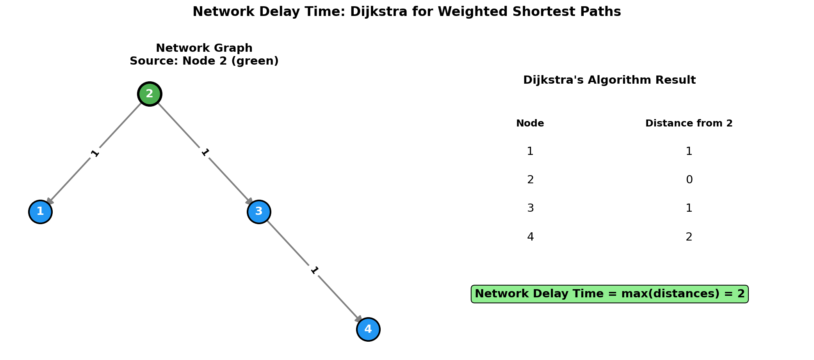
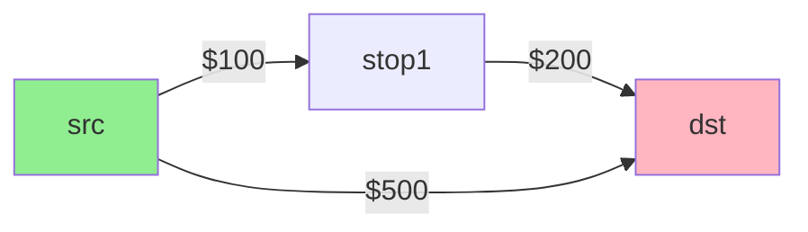
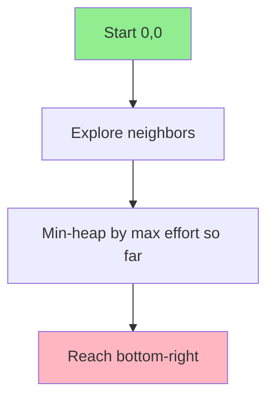
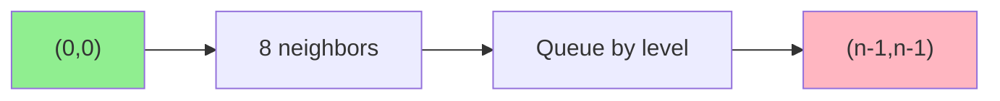

# Network Delay Time

> **Finding shortest paths in weighted graphs using Dijkstra's algorithm**

---

## Problem Statement

**LeetCode 743: Network Delay Time**

You are given a network of `n` nodes, labeled from `1` to `n`. You are also given `times`, a list of travel times as directed edges `times[i] = (ui, vi, wi)`, where `ui` is the source node, `vi` is the target node, and `wi` is the time it takes for a signal to travel from source to target.

We will send a signal from a given node `k`. Return the **minimum time** it takes for all the `n` nodes to receive the signal. If it is impossible for all the `n` nodes to receive the signal, return `-1`.

---

## Visual Overview



---

## Examples

### Example 1

```
Input: times = [[2,1,1],[2,3,1],[3,4,1]], n = 4, k = 2
Output: 2

Network:
     1
     ^
    /1
   2 --1--> 3
            |
            1
            v
            4

From node 2:
  To node 1: 1 (direct)
  To node 3: 1 (direct)
  To node 4: 2 (via 3)

Maximum time = 2
```

### Example 2

```
Input: times = [[1,2,1]], n = 2, k = 2
Output: -1

Explanation: Node 1 is unreachable from node 2
```

---

## Key Insight

This is a **single-source shortest path** problem in a **weighted directed graph** with **non-negative weights**. The answer is the maximum of all shortest paths from the source.

**Dijkstra's Algorithm** is perfect for this:
1. Find shortest path from source to all nodes
2. Return the maximum distance (time for last node to receive signal)
3. If any node is unreachable, return -1

---

## Solution: Dijkstra's Algorithm

::: code-group
```python [Python]
import heapq
from collections import defaultdict

def networkDelayTime(times: list[list[int]], n: int, k: int) -> int:
    # Build adjacency list
    graph = defaultdict(list)
    for u, v, w in times:
        graph[u].append((v, w))

    # Dijkstra's algorithm
    # Min-heap: (distance, node)
    heap = [(0, k)]  # Start from node k with distance 0
    dist = {}  # Shortest distance to each node

    while heap:
        d, node = heapq.heappop(heap)

        # Skip if we've already found a shorter path
        if node in dist:
            continue

        dist[node] = d

        # Explore neighbors
        for neighbor, weight in graph[node]:
            if neighbor not in dist:
                heapq.heappush(heap, (d + weight, neighbor))

    # Check if all nodes are reachable
    if len(dist) != n:
        return -1

    return max(dist.values())
```

```java [Java]
public int networkDelayTime(int[][] times, int n, int k) {
    Map<Integer, List<int[]>> graph = new HashMap<>();
    for (int[] t : times) {
        graph.computeIfAbsent(t[0], x -> new ArrayList<>()).add(new int[]{t[1], t[2]});
    }

    // Min-heap: [distance, node]
    PriorityQueue<int[]> pq = new PriorityQueue<>((a, b) -> Integer.compare(a[0], b[0]));
    pq.offer(new int[]{0, k});
    Map<Integer, Integer> dist = new HashMap<>();

    while (!pq.isEmpty()) {
        int[] cur = pq.poll();
        int d = cur[0], node = cur[1];
        if (dist.containsKey(node)) continue;
        dist.put(node, d);
        for (int[] neighbor : graph.getOrDefault(node, Collections.emptyList())) {
            if (!dist.containsKey(neighbor[0]))
                pq.offer(new int[]{d + neighbor[1], neighbor[0]});
        }
    }

    if (dist.size() != n) return -1;
    return Collections.max(dist.values());
}
```
:::

::: info Complexity: Time O((V + E) log V) · Space O(V + E)
- **Time:** Each node extracted from heap once O(V log V), each edge relaxation involves heap push O(E log V)
- **Space:** Adjacency list O(E), min-heap up to O(E) entries, distance dictionary O(V)
:::

---

## How Dijkstra's Works


### Step-by-Step for Example 1

```
Initial: heap = [(0, 2)], dist = {}

Step 1: Pop (0, 2)
  dist = {2: 0}
  Add neighbors: heap = [(1, 1), (1, 3)]

Step 2: Pop (1, 1)
  dist = {2: 0, 1: 1}
  No outgoing edges from 1

Step 3: Pop (1, 3)
  dist = {2: 0, 1: 1, 3: 1}
  Add neighbor: heap = [(2, 4)]

Step 4: Pop (2, 4)
  dist = {2: 0, 1: 1, 3: 1, 4: 2}

Result: max(dist.values()) = 2
```

---

## Complexity Analysis

| Aspect | Complexity | Explanation |
|--------|------------|-------------|
| Time | O((V + E) log V) | Each node/edge processed once, heap operations O(log V) |
| Space | O(V + E) | Graph + heap + dist dictionary |

For this problem:
- V = n (number of nodes)
- E = len(times) (number of edges)

---

## Alternative: Bellman-Ford

Use when edges can have **negative weights** (Dijkstra's doesn't work with negative weights).

```python
def networkDelayTime(times: list[list[int]], n: int, k: int) -> int:
    # Initialize distances
    INF = float('inf')
    dist = [INF] * (n + 1)
    dist[k] = 0

    # Relax all edges n-1 times
    for _ in range(n - 1):
        for u, v, w in times:
            if dist[u] != INF and dist[u] + w < dist[v]:
                dist[v] = dist[u] + w

    # Find maximum distance
    max_dist = max(dist[1:])  # Skip index 0 (1-indexed)

    return max_dist if max_dist != INF else -1
```

::: info Complexity: Time O(V * E) · Space O(V)
- **Time:** V-1 relaxation passes, each examining all E edges; handles negative weights unlike Dijkstra
- **Space:** Single distance array of size V; no heap or adjacency list needed (edges processed directly)
:::

### Complexity

| Aspect | Complexity | Explanation |
|--------|------------|-------------|
| Time | O(V * E) | V-1 iterations, each processing E edges |
| Space | O(V) | Distance array |

---

## Comparison of Approaches

| Aspect | Dijkstra's | Bellman-Ford |
|--------|------------|--------------|
| Time | O((V+E) log V) | O(V * E) |
| Negative weights | No | Yes |
| Negative cycles | No | Detects them |
| Best for | Sparse graphs, non-negative weights | Negative weights, cycle detection |

---

## Common Mistakes

### 1. Using BFS Instead of Dijkstra

```python
# WRONG - BFS doesn't account for edge weights
from collections import deque
queue = deque([k])
dist[k] = 0
while queue:
    node = queue.popleft()
    for neighbor, weight in graph[node]:
        if dist[neighbor] > dist[node] + weight:
            dist[neighbor] = dist[node] + weight
            queue.append(neighbor)  # May not be optimal!
```

BFS works for unweighted graphs, but for weighted graphs, you need a priority queue.

### 2. Not Checking Visited Before Processing

```python
# WRONG - processes same node multiple times
while heap:
    d, node = heapq.heappop(heap)
    # Should check: if node in dist: continue
    dist[node] = d  # Might overwrite with larger value!
```

### 3. 1-Indexed vs 0-Indexed Confusion

```python
# The problem uses 1-indexed nodes!
# Make sure to handle correctly
dist = [float('inf')] * (n + 1)  # n+1 to use 1-indexing
dist[k] = 0
# Don't forget to exclude index 0 in final answer
return max(dist[1:]) if all(d != float('inf') for d in dist[1:]) else -1
```

---

## Variations

### Find Shortest Path to Specific Target

```python
def shortestPath(times, n, k, target):
    # Same as above, but return dist[target]
    # Can optimize by stopping when target is popped
    if node == target:
        return d  # Early termination
```

### Count Reachable Nodes Within Time Limit

```python
def reachableNodes(times, n, k, max_time):
    # Run Dijkstra, count nodes with dist <= max_time
    return sum(1 for d in dist.values() if d <= max_time)
```

### Reconstruct Shortest Path

```python
def shortestPathWithReconstruction(times, n, k, target):
    parent = {k: None}

    while heap:
        d, node = heapq.heappop(heap)
        if node in dist:
            continue
        dist[node] = d

        for neighbor, weight in graph[node]:
            if neighbor not in dist:
                heapq.heappush(heap, (d + weight, neighbor))
                if neighbor not in parent or d + weight < dist.get(neighbor, float('inf')):
                    parent[neighbor] = node

    # Reconstruct path
    path = []
    current = target
    while current is not None:
        path.append(current)
        current = parent.get(current)
    return path[::-1], dist.get(target, -1)
```

---

## Edge Cases

1. **Source node with no outgoing edges**: Other nodes unreachable, return -1
2. **Disconnected graph**: Some nodes unreachable, return -1
3. **Single node (n=1)**: Return 0 (signal already at destination)
4. **Self-loops**: Dijkstra handles correctly (never optimal to revisit)
5. **Multiple edges between same nodes**: Take minimum automatically

---

## Interview Tips

1. **Recognize Dijkstra pattern**: Weighted graph + shortest path + non-negative weights
2. **Explain the heap**: Min-heap ensures we process nodes in order of increasing distance
3. **Mention the key insight**: Answer is max(all shortest paths), not sum
4. **Handle edge cases**: Unreachable nodes, single node

### Follow-up Questions

- **Q: What if some edges have negative weights?**
  - A: Use Bellman-Ford instead

- **Q: What if we need all-pairs shortest paths?**
  - A: Run Dijkstra from each node (O(V(V+E) log V)) or use Floyd-Warshall (O(V^3))

- **Q: How to find the actual path, not just the distance?**
  - A: Track parent pointers and backtrack from destination

---

## Related Problems

::: details Cheapest Flights Within K Stops (LeetCode 787)
**Problem:** Find the cheapest price from source to destination with at most K stops in a flight network.

**Key Insight:** Modified Dijkstra or Bellman-Ford with hop constraint.



**Approach:** Use Bellman-Ford with K+1 iterations, or BFS level-by-level tracking costs at each stop count.

**Complexity:** O(E * K) time, O(N) space
:::

::: details Path with Minimum Effort (LeetCode 1631)
**Problem:** Find a path from top-left to bottom-right in a grid where effort is the maximum absolute height difference between consecutive cells.

**Key Insight:** Dijkstra on a grid where edge weight is height difference (minimax path problem).



**Approach:** Modified Dijkstra where we minimize the maximum edge weight along the path, not the sum.

**Complexity:** O(M*N log(M*N)) time, O(M*N) space
:::

::: details Shortest Path in Binary Matrix (LeetCode 1091)
**Problem:** Find shortest clear path (all 0s) from top-left to bottom-right with 8-directional movement.

**Key Insight:** BFS for unweighted shortest path with diagonal neighbors.



**Approach:** Standard BFS since all moves have equal cost. Use 8 directions instead of 4.

**Complexity:** O(N^2) time, O(N^2) space
:::

::: details Find the City With Smallest Number of Neighbors (LeetCode 1334)
**Problem:** Find the city with fewest reachable cities within a distance threshold. Return highest numbered city on tie.

**Key Insight:** All-pairs shortest paths using Floyd-Warshall or Dijkstra from each node.

```mermaid
graph TD
    A[Compute all-pairs distances] --> B[Floyd-Warshall O(V^3)]
    A --> C[Dijkstra from each V O(V*E log V)]
    B --> D[Count neighbors within threshold]
    C --> D
```

**Approach:** Run Floyd-Warshall for dense graphs or Dijkstra from each node for sparse graphs.

**Complexity:** O(V^3) time with Floyd-Warshall, O(V + E) space
:::

---

## References

- [LeetCode 743: Network Delay Time](https://leetcode.com/problems/network-delay-time/)
- [NeetCode Solution](https://neetcode.io/solutions/network-delay-time)
- [Dijkstra's Algorithm Visualization](https://visualgo.net/en/sssp)
- [Dijkstra's Algorithm - GeeksforGeeks](https://www.geeksforgeeks.org/dijkstras-shortest-path-algorithm-greedy-algo-7/)
