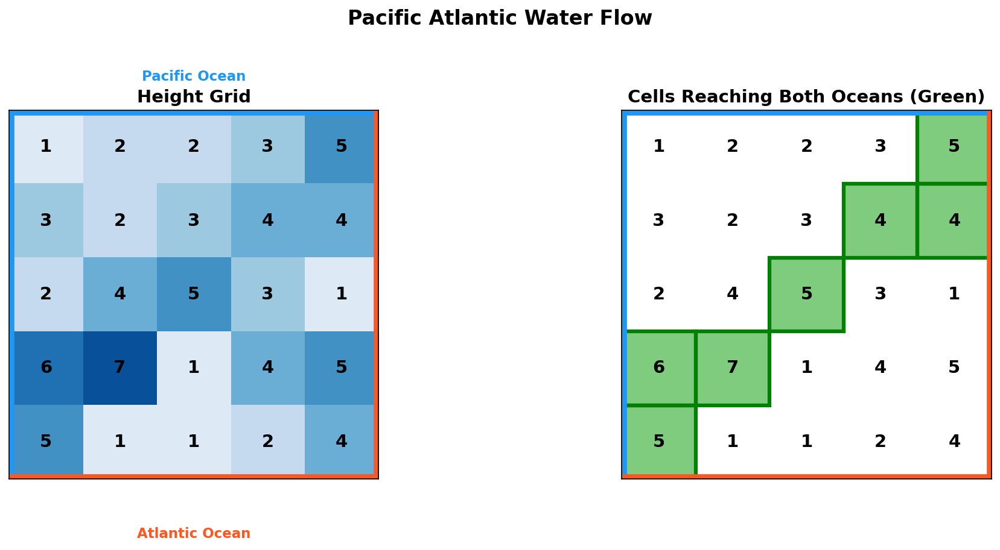
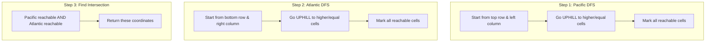
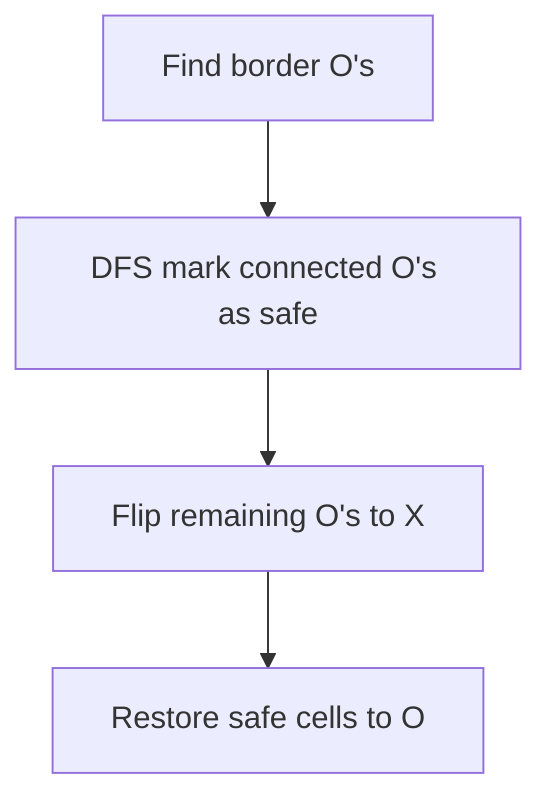
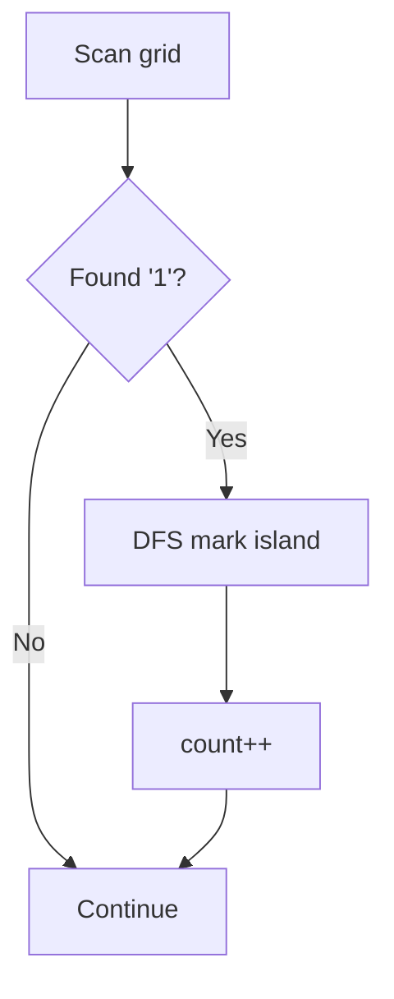
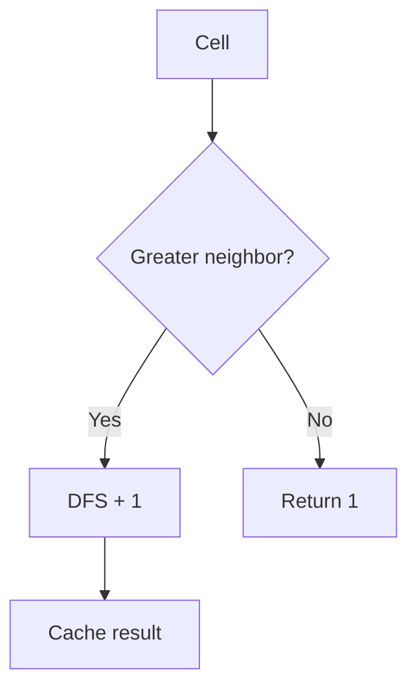

# Pacific Atlantic Water Flow

> **Multi-source DFS/BFS from ocean boundaries**

---

## Problem Statement

**LeetCode 417: Pacific Atlantic Water Flow**

There is an `m x n` rectangular island that borders both the Pacific Ocean and Atlantic Ocean. The Pacific Ocean touches the island's left and top edges, and the Atlantic Ocean touches the island's right and bottom edges.

The island is partitioned into a grid of square cells. You are given an `m x n` integer matrix `heights` where `heights[r][c]` represents the height above sea level of the cell at coordinate `(r, c)`.

The island receives a lot of rain, and the rain water can flow to neighboring cells directly north, south, east, and west if the neighboring cell's height is **less than or equal to** the current cell's height. Water can flow from any cell adjacent to an ocean into the ocean.

Return a 2D list of grid coordinates `result` where `result[i] = [ri, ci]` denotes that rain water can flow from cell `(ri, ci)` to **both** the Pacific and Atlantic oceans.

---

## Visual Overview



---

## Example

```
Input: heights = [
  [1, 2, 2, 3, 5],
  [3, 2, 3, 4, 4],
  [2, 4, 5, 3, 1],
  [6, 7, 1, 4, 5],
  [5, 1, 1, 2, 4]
]

Output: [[0,4],[1,3],[1,4],[2,2],[3,0],[3,1],[4,0]]

Explanation:
- Pacific Ocean: top and left borders (blue)
- Atlantic Ocean: bottom and right borders (orange)
- Water flows downhill (to cells with height <= current)
- Find cells that can reach BOTH oceans

Grid visualization:
        Pacific
       --------
     | 1  2  2  3 [5] |
     | 3  2  3 [4][4] |
  P  | 2  4 [5] 3  1  | A
  a  |[6][7] 1  4  5  | t
  c  |[5] 1  1  2  4  | l
       --------       a
        Atlantic      n
                      t
                      i
                      c

Cells in brackets [] can reach both oceans.
```

---

## Approach

### Key Insight: Reverse the Problem

**Naive approach (slow):** For each cell, try to reach both oceans - O(m*n * m*n)

**Optimal approach:** Start from oceans and work inward!
- Find all cells that can reach Pacific (DFS/BFS from Pacific border)
- Find all cells that can reach Atlantic (DFS/BFS from Atlantic border)
- Return intersection of both sets

### Why Reverse?

Water flows **downhill** (to lower or equal heights). But if we start from the ocean and go **uphill** (to higher or equal heights), we find all cells that can eventually drain to that ocean.

```
Forward (cell -> ocean): Hard to track all possible paths
Backward (ocean -> cell): Simple - just go uphill!
```

---

## Solution 1: DFS from Ocean Boundaries

```python
def pacificAtlantic(heights: list[list[int]]) -> list[list[int]]:
    if not heights or not heights[0]:
        return []

    rows, cols = len(heights), len(heights[0])

    # Sets to track cells that can reach each ocean
    pacific = set()
    atlantic = set()

    def dfs(r: int, c: int, visited: set, prev_height: int) -> None:
        # Out of bounds, already visited, or can't flow uphill
        if (r < 0 or r >= rows or c < 0 or c >= cols or
            (r, c) in visited or heights[r][c] < prev_height):
            return

        visited.add((r, c))

        # Explore all 4 directions
        dfs(r + 1, c, visited, heights[r][c])
        dfs(r - 1, c, visited, heights[r][c])
        dfs(r, c + 1, visited, heights[r][c])
        dfs(r, c - 1, visited, heights[r][c])

    # Start DFS from Pacific border (top row and left column)
    for c in range(cols):
        dfs(0, c, pacific, heights[0][c])  # Top row
    for r in range(rows):
        dfs(r, 0, pacific, heights[r][0])  # Left column

    # Start DFS from Atlantic border (bottom row and right column)
    for c in range(cols):
        dfs(rows - 1, c, atlantic, heights[rows - 1][c])  # Bottom row
    for r in range(rows):
        dfs(r, cols - 1, atlantic, heights[r][cols - 1])  # Right column

    # Return intersection: cells that reach both oceans
    return list(pacific & atlantic)
```

::: info Complexity: Time O(m * n) · Space O(m * n)
- **Time:** Each cell visited at most twice (once per ocean), DFS explores each cell's 4 neighbors
- **Space:** Two visited sets each up to O(m*n), recursion stack up to O(m*n) in worst case
:::

---

## Solution 2: BFS from Ocean Boundaries

```python
from collections import deque

def pacificAtlantic(heights: list[list[int]]) -> list[list[int]]:
    if not heights or not heights[0]:
        return []

    rows, cols = len(heights), len(heights[0])
    directions = [(0, 1), (0, -1), (1, 0), (-1, 0)]

    def bfs(starts: list[tuple[int, int]]) -> set:
        visited = set(starts)
        queue = deque(starts)

        while queue:
            r, c = queue.popleft()

            for dr, dc in directions:
                nr, nc = r + dr, c + dc
                # Check bounds, not visited, and can flow uphill
                if (0 <= nr < rows and 0 <= nc < cols and
                    (nr, nc) not in visited and
                    heights[nr][nc] >= heights[r][c]):
                    visited.add((nr, nc))
                    queue.append((nr, nc))

        return visited

    # Pacific border cells
    pacific_starts = [(0, c) for c in range(cols)] + [(r, 0) for r in range(1, rows)]

    # Atlantic border cells
    atlantic_starts = [(rows - 1, c) for c in range(cols)] + [(r, cols - 1) for r in range(rows - 1)]

    pacific = bfs(pacific_starts)
    atlantic = bfs(atlantic_starts)

    return [[r, c] for r, c in pacific & atlantic]
```

::: info Complexity: Time O(m * n) · Space O(m * n)
- **Time:** BFS from border cells visits each cell at most twice; O(m+n) border cells initiate traversal
- **Space:** Two visited sets O(m*n) each, queue can hold O(m*n) cells in worst case
:::

---

## Complexity Analysis

| Aspect | Complexity | Explanation |
|--------|------------|-------------|
| Time | O(m * n) | Each cell visited at most twice (once per ocean) |
| Space | O(m * n) | Two visited sets, each up to m*n cells |

---

## Process Visualization



---

## Common Mistakes

### 1. Wrong Flow Direction

```python
# WRONG: Checking if we can flow TO neighbor (downhill)
if heights[nr][nc] <= heights[r][c]:

# CORRECT: Checking if water can flow FROM neighbor TO ocean (uphill from ocean)
if heights[nr][nc] >= heights[r][c]:
```

### 2. Missing Border Cells

```python
# WRONG: Only starting from corners
pacific_starts = [(0, 0)]

# CORRECT: All cells on Pacific border
pacific_starts = [(0, c) for c in range(cols)] + [(r, 0) for r in range(rows)]
```

### 3. Duplicate Starting Cells

```python
# This adds (0,0) twice - not a bug but wasteful
pacific_starts = [(0, c) for c in range(cols)] + [(r, 0) for r in range(rows)]

# Cleaner (avoid duplicate at corner):
pacific_starts = [(0, c) for c in range(cols)] + [(r, 0) for r in range(1, rows)]
```

---

## Edge Cases

1. **Single cell island**: Returns `[[0, 0]]` (touches both oceans)
2. **All same height**: All cells can reach both oceans
3. **Strictly increasing from Pacific to Atlantic**: Only corner/edge cells
4. **Large peak in center**: Peak cell might reach both if high enough

---

## Variations

### What if Water Flows Only Strictly Downhill?

Change the comparison:
```python
# Original: Flow to lower OR EQUAL
heights[nr][nc] >= heights[r][c]

# Variation: Flow to STRICTLY lower
heights[nr][nc] > heights[r][c]
```

### Count Cells Instead of Returning Coordinates

```python
return len(pacific & atlantic)
```

---

## Interview Tips

1. **Draw the grid**: Visualize Pacific (top/left) and Atlantic (bottom/right)
2. **Explain the reversal**: Why starting from oceans is O(m*n) vs O(m*n)^2
3. **Clarify flow direction**: Water flows to <= heights, but we traverse to >= heights
4. **Mention both DFS and BFS**: Both work equally well here

### Follow-up Questions

- **Q: Can you do it with single DFS?**
  - A: No simple way - need to track reachability to BOTH oceans separately

- **Q: What if there are walls (impassable cells)?**
  - A: Add condition: `if heights[nr][nc] != -1` (assuming -1 = wall)

- **Q: What if we want the shortest path to both oceans?**
  - A: BFS from each cell, track distance to each ocean, more complex

---

## Related Problems

::: details Surrounded Regions (LeetCode 130)
**Problem:** Capture all 'O' regions surrounded by 'X', except those connected to the border.

**Key Insight:** Same reverse approach - start from border 'O's to mark safe cells.



**Approach:** DFS from border 'O's, mark as temporary, then sweep to capture surrounded regions.

**Complexity:** O(M*N) time, O(M*N) space
:::

::: details Number of Islands (LeetCode 200)
**Problem:** Count number of islands (connected land '1' cells) in a 2D grid.

**Key Insight:** Classic flood fill - count connected components.



**Approach:** For each unvisited '1', DFS to mark entire island, increment count.

**Complexity:** O(M*N) time, O(M*N) space worst case for recursion
:::

::: details Walls and Gates (LeetCode 286)
**Problem:** Fill each empty room with distance to nearest gate in a grid with walls, gates, and rooms.

**Key Insight:** Multi-source BFS from all gates simultaneously.


**Approach:** Start BFS from all gates (distance 0), propagate distances level by level.

**Complexity:** O(M*N) time, O(M*N) space
:::

::: details Longest Increasing Path in a Matrix (LeetCode 329)
**Problem:** Find the longest strictly increasing path in a matrix, moving 4-directionally.

**Key Insight:** DFS with memoization - cache longest path from each cell.



**Approach:** DFS from each cell with memoization. No visited set needed since strictly increasing prevents cycles.

**Complexity:** O(M*N) time, O(M*N) space for memoization
:::

---

## References

- [LeetCode 417: Pacific Atlantic Water Flow](https://leetcode.com/problems/pacific-atlantic-water-flow/)
- [NeetCode Solution](https://neetcode.io/solutions/pacific-atlantic-water-flow)
- [Pacific Atlantic Water Flow - In-Depth Explanation](https://algo.monster/liteproblems/417)
