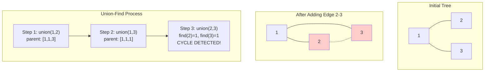
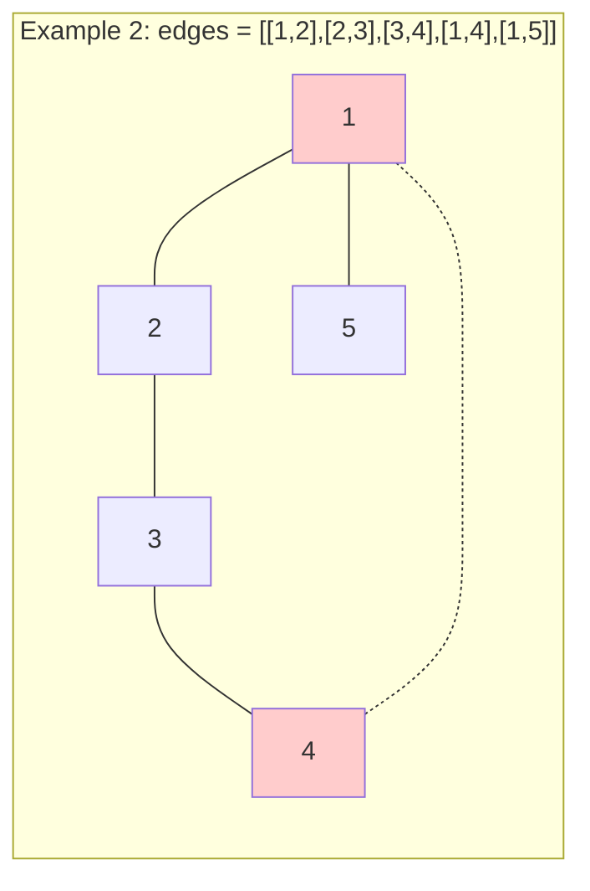

# Redundant Connection & Union-Find

> **Detecting cycles and managing disjoint sets**

---

## Visual Guides

### Union Operations Step-by-Step


### Path Compression


### Cycle Detection with Union-Find


---

## Union-Find (Disjoint Set Union)

### Overview

Union-Find (also known as Disjoint Set Union or DSU) is a data structure that stores a collection of disjoint (non-overlapping) sets. It efficiently supports two primary operations:

1. **Find**: Determine which set a particular element belongs to
2. **Union**: Merge two sets into one

**When to Use Union-Find:**
- Detecting cycles in undirected graphs
- Finding connected components
- Kruskal's algorithm for Minimum Spanning Tree
- Determining if two elements are in the same group
- Dynamic connectivity problems
- Network connectivity queries

The key insight is that Union-Find represents each set as a rooted tree, where each node points to its parent. The root of each tree serves as the representative (or "leader") of that set.

### Implementation

```python
class UnionFind:
    def __init__(self, n):
        self.parent = list(range(n))
        self.rank = [0] * n

    def find(self, x):
        if self.parent[x] != x:
            self.parent[x] = self.find(self.parent[x])  # Path compression
        return self.parent[x]

    def union(self, x, y):
        px, py = self.find(x), self.find(y)
        if px == py:
            return False  # Already connected

        # Union by rank
        if self.rank[px] < self.rank[py]:
            px, py = py, px
        self.parent[py] = px
        if self.rank[px] == self.rank[py]:
            self.rank[px] += 1

        return True

    def connected(self, x, y):
        return self.find(x) == self.find(y)
```

::: info Complexity: Time O(alpha(n)) per operation · Space O(n)
- **Time:** Find and Union operations take O(alpha(n)) amortized time where alpha is inverse Ackermann function (effectively constant)
- **Space:** Parent and rank arrays each require O(n) space for n elements
:::

### Key Optimizations

**1. Path Compression (in `find`)**
When finding the root of an element, we update each visited node to point directly to the root. This flattens the tree structure, making future operations faster.

```
Before: 1 -> 2 -> 3 -> 4 (root)
After:  1 -> 4, 2 -> 4, 3 -> 4
```

**2. Union by Rank (in `union`)**
Always attach the shorter tree under the root of the taller tree. This keeps trees balanced and prevents degenerate cases where trees become linked lists.

### Complexity

| Operation | Without Optimization | With Path Compression + Union by Rank |
|-----------|---------------------|---------------------------------------|
| Find      | O(n)                | O(alpha(n)) approx O(1) amortized          |
| Union     | O(n)                | O(alpha(n)) approx O(1) amortized          |
| Space     | O(n)                | O(n)                                  |

Where alpha(n) is the inverse Ackermann function, which grows so slowly that it is effectively constant (at most 4) for all practical values of n.

---

## Redundant Connection

### Problem Statement

**LeetCode 684: Redundant Connection**

In this problem, a tree is an undirected graph that is connected and has no cycles. You are given a graph that started as a tree with `n` nodes (labeled 1 to n), with one additional edge added.

The added edge connects two existing nodes and creates exactly one cycle. Return an edge that can be removed so that the resulting graph is a tree. If there are multiple answers, return the edge that occurs **last** in the input.

### Example

```
Input: edges = [[1,2],[1,3],[2,3]]
Output: [2,3]

Explanation:
  1
 / \
2 - 3

The edge [2,3] creates a cycle. Removing it leaves a valid tree.
```

```
Input: edges = [[1,2],[2,3],[3,4],[1,4],[1,5]]
Output: [1,4]

Explanation:
5 - 1 - 2
    |   |
    4 - 3

The edge [1,4] creates a cycle with path 1-2-3-4.
```

### Approach

**Key Insight:** Process edges in order. The first edge that connects two already-connected nodes creates a cycle - that's our redundant edge.

**Algorithm:**
1. Initialize Union-Find with n nodes
2. Iterate through each edge `[u, v]`
3. If `u` and `v` are already in the same component (connected), this edge creates a cycle - return it
4. Otherwise, union `u` and `v`

This works because:
- A tree with n nodes has exactly n-1 edges
- We have n edges (one extra), so exactly one edge creates a cycle
- Processing in order ensures we return the last such edge if multiple exist

### Mermaid Diagram





### Solution (Python)

```python
def findRedundantConnection(edges: list[list[int]]) -> list[int]:
    n = len(edges)
    uf = UnionFind(n + 1)  # 1-indexed nodes

    for u, v in edges:
        if not uf.union(u, v):
            return [u, v]  # This edge creates cycle

    return []
```

::: info Complexity: Time O(n * alpha(n)) · Space O(n)
- **Time:** Processing n edges, each union/find operation O(alpha(n)) with optimizations
- **Space:** UnionFind data structure uses O(n) for parent and rank arrays
:::

### Inline Version (Without Class)

```python
def findRedundantConnection_inline(edges: list[list[int]]) -> list[int]:
    parent = list(range(len(edges) + 1))

    def find(x):
        if parent[x] != x:
            parent[x] = find(parent[x])  # Path compression
        return parent[x]

    for u, v in edges:
        pu, pv = find(u), find(v)
        if pu == pv:
            return [u, v]  # Already connected - cycle!
        parent[pu] = pv  # Union

    return []
```

::: info Complexity: Time O(n * alpha(n)) · Space O(n)
- **Time:** Each edge processed once with find operations; path compression ensures near-constant amortized time
- **Space:** Single parent array of size n+1 for 1-indexed nodes
:::

### Complexity

| Aspect | Complexity |
|--------|------------|
| Time   | O(n * alpha(n)) approx O(n) |
| Space  | O(n) for parent array |

---

## Union-Find Applications

### Connected Components

Count the number of connected components in an undirected graph.

```python
def countComponents(n: int, edges: list[list[int]]) -> int:
    uf = UnionFind(n)
    for u, v in edges:
        uf.union(u, v)

    # Count unique roots
    return len(set(uf.find(i) for i in range(n)))
```

::: info Complexity: Time O(E * alpha(n)) · Space O(n)
- **Time:** E union operations plus n find operations to count unique roots
- **Space:** UnionFind structure O(n), set for counting roots O(n) worst case
:::

### Graph Valid Tree

Determine if given edges form a valid tree (connected, no cycles).

```python
def validTree(n: int, edges: list[list[int]]) -> bool:
    # Tree property: exactly n-1 edges for n nodes
    if len(edges) != n - 1:
        return False

    uf = UnionFind(n)
    for u, v in edges:
        if not uf.union(u, v):
            return False  # Cycle detected
    return True
```

::: info Complexity: Time O(n * alpha(n)) · Space O(n)
- **Time:** Edge count check O(1), then n-1 union operations each O(alpha(n))
- **Space:** UnionFind parent and rank arrays O(n)
:::

### Accounts Merge (LeetCode 721)

Merge accounts that share common emails using Union-Find.

```python
def accountsMerge(accounts: list[list[str]]) -> list[list[str]]:
    from collections import defaultdict

    email_to_id = {}
    email_to_name = {}

    # Map each email to a unique ID
    for account in accounts:
        name = account[0]
        for email in account[1:]:
            if email not in email_to_id:
                email_to_id[email] = len(email_to_id)
            email_to_name[email] = name

    uf = UnionFind(len(email_to_id))

    # Union emails within same account
    for account in accounts:
        first_id = email_to_id[account[1]]
        for email in account[2:]:
            uf.union(first_id, email_to_id[email])

    # Group emails by root
    groups = defaultdict(list)
    for email, idx in email_to_id.items():
        groups[uf.find(idx)].append(email)

    # Format result
    return [[email_to_name[emails[0]]] + sorted(emails)
            for emails in groups.values()]
```

::: info Complexity: Time O(N * K * alpha(NK) + NK log NK) · Space O(NK)
- **Time:** Building email maps O(NK), union operations O(NK * alpha(NK)), sorting emails O(NK log NK)
- **Space:** Maps and UnionFind store up to NK unique emails across N accounts with K emails each
:::

### Number of Islands II (LeetCode 305)

Track number of islands as land positions are added dynamically.

```python
def numIslands2(m: int, n: int, positions: list[list[int]]) -> list[int]:
    parent = {}
    count = 0
    result = []

    def find(x):
        if parent[x] != x:
            parent[x] = find(parent[x])
        return parent[x]

    def union(x, y):
        nonlocal count
        px, py = find(x), find(y)
        if px != py:
            parent[px] = py
            count -= 1

    directions = [(0, 1), (0, -1), (1, 0), (-1, 0)]

    for r, c in positions:
        if (r, c) in parent:
            result.append(count)
            continue

        parent[(r, c)] = (r, c)
        count += 1

        for dr, dc in directions:
            nr, nc = r + dr, c + dc
            if (nr, nc) in parent:
                union((r, c), (nr, nc))

        result.append(count)

    return result
```

::: info Complexity: Time O(L * alpha(mn)) · Space O(mn)
- **Time:** L positions processed, each with up to 4 union operations; each union/find O(alpha(mn))
- **Space:** Parent dictionary grows up to O(mn) for all possible grid cells
:::

---

## Google Interview Applications

Union-Find is a favorite data structure in Google interviews due to its elegant solution to connectivity problems. Common scenarios include:

### 1. Social Network Connectivity
Determine if two users are connected through friends, or count friend groups.

### 2. Image Processing
Connected component labeling in image segmentation - identifying distinct regions in binary images.

### 3. Network Design
- Determining if adding a connection would create a redundant path
- Finding minimum connections needed for full network connectivity

### 4. Distributed Systems
- Tracking which servers are in the same cluster
- Detecting partition boundaries

### 5. Related LeetCode Problems

| Problem | Difficulty | Key Concept |
|---------|------------|-------------|
| 684. Redundant Connection | Medium | Cycle detection |
| 685. Redundant Connection II | Hard | Directed graph cycle |
| 547. Number of Provinces | Medium | Connected components |
| 200. Number of Islands | Medium | Grid connectivity |
| 721. Accounts Merge | Medium | Grouping by shared attribute |
| 1319. Number of Operations to Make Network Connected | Medium | Component counting |
| 990. Satisfiability of Equality Equations | Medium | Constraint satisfaction |
| 1202. Smallest String With Swaps | Medium | Character grouping |

### Interview Tips

1. **Recognize the pattern**: Any problem involving grouping elements or checking connectivity is a candidate for Union-Find

2. **Consider alternatives**: Sometimes BFS/DFS is simpler for one-time queries, but Union-Find excels at multiple dynamic queries

3. **Don't forget optimizations**: Always mention path compression and union by rank in interviews

4. **Handle edge cases**:
   - 0-indexed vs 1-indexed nodes
   - Self-loops
   - Duplicate edges
   - Disconnected components

5. **Time complexity communication**: Explain that while technically O(alpha(n)), it's effectively O(1) for all practical purposes

---

## References

- [LeetCode 684: Redundant Connection](https://leetcode.com/problems/redundant-connection/)
- [NeetCode Solution & Explanation](https://neetcode.io/solutions/redundant-connection)
- [GeeksforGeeks: Introduction to Disjoint Set](https://www.geeksforgeeks.org/dsa/introduction-to-disjoint-set-data-structure-or-union-find-algorithm/)
- [CP Algorithms: Disjoint Set Union](https://cp-algorithms.com/data_structures/disjoint_set_union.html)
- [Wikipedia: Disjoint-set Data Structure](https://en.wikipedia.org/wiki/Disjoint-set_data_structure)
- [Algo.Monster: Redundant Connection Explanation](https://algo.monster/liteproblems/684)
