# Graph Search & Degrees of Friendship

> **Fundamental traversal algorithms and social network problems**

---

## Overview

Graph traversal is the process of visiting all nodes in a graph systematically. The two fundamental approaches are:

- **Depth-First Search (DFS)**: Explores as far as possible along each branch before backtracking
- **Breadth-First Search (BFS)**: Explores all neighbors at the current depth before moving deeper

These algorithms form the foundation for solving many graph problems, including finding paths, detecting cycles, and computing degrees of separation in social networks.

---

## Visual Guides

### BFS Level-Order Traversal


### DFS Depth-First Traversal


### BFS vs DFS Comparison


### Grid BFS (Shortest Path)


---

## DFS (Depth-First Search)

DFS searches "deep" before it searches "wide". If the current node has two neighbors n1 and n2 and we choose to visit n1 next, all nodes reachable from n1 will be visited before n2. This naturally forms a LIFO (Last In, First Out) structure, which is why it can be implemented with a stack or recursion.

### Recursive Implementation
```python
def dfs_recursive(graph, node, visited=None):
    if visited is None:
        visited = set()

    visited.add(node)
    print(node)  # Process node

    for neighbor in graph[node]:
        if neighbor not in visited:
            dfs_recursive(graph, neighbor, visited)

    return visited
```

::: info Complexity: Time O(V + E) · Space O(V)
- **Time:** Each vertex visited once, each edge examined once during neighbor exploration
- **Space:** Visited set O(V), recursion call stack up to O(V) depth for linear graphs
:::

### Iterative Implementation
```python
def dfs_iterative(graph, start):
    visited = set()
    stack = [start]

    while stack:
        node = stack.pop()
        if node not in visited:
            visited.add(node)
            print(node)  # Process node

            for neighbor in graph[node]:
                if neighbor not in visited:
                    stack.append(neighbor)

    return visited
```

::: info Complexity: Time O(V + E) · Space O(V)
- **Time:** Each node popped from stack once, each edge examined once
- **Space:** Visited set O(V), explicit stack replaces recursion with same O(V) worst-case size
:::

### DFS Applications
- **Cycle detection** in graphs
- **Topological sorting** of DAGs
- **Finding connected components**
- **Solving puzzles** (mazes, Sudoku)
- **Path finding** when any path is acceptable

### Complexity
- **Time**: O(V + E) where V = vertices, E = edges
- **Space**: O(V) for visited set; O(h) call stack where h = max depth

---

## BFS (Breadth-First Search)

BFS explores layer by layer. Starting from the source node, it visits all immediate neighbors (distance 1), then all nodes at distance 2, and so on. BFS uses a queue data structure and guarantees the shortest path in unweighted graphs.

### Implementation
```python
from collections import deque

def bfs(graph, start):
    visited = {start}
    queue = deque([start])

    while queue:
        node = queue.popleft()
        print(node)  # Process node

        for neighbor in graph[node]:
            if neighbor not in visited:
                visited.add(neighbor)
                queue.append(neighbor)

    return visited
```

::: info Complexity: Time O(V + E) · Space O(V)
- **Time:** Each vertex dequeued once, each edge examined once
- **Space:** Visited set O(V), queue holds at most O(V) nodes at widest level
:::

### BFS for Shortest Path
```python
from collections import deque

def shortest_path(graph, start, end):
    if start == end:
        return [start]

    visited = {start}
    queue = deque([(start, [start])])

    while queue:
        node, path = queue.popleft()

        for neighbor in graph[node]:
            if neighbor == end:
                return path + [neighbor]
            if neighbor not in visited:
                visited.add(neighbor)
                queue.append((neighbor, path + [neighbor]))

    return []  # No path found
```

::: info Complexity: Time O(V + E) · Space O(V * P)
- **Time:** Standard BFS traversal; path copying adds overhead but doesn't change asymptotic complexity
- **Space:** Each queue entry stores a path; worst case O(V) paths of length O(V) each
:::

### BFS with Level Tracking
```python
from collections import deque

def bfs_with_levels(graph, start):
    """Return nodes grouped by their distance from start."""
    visited = {start}
    queue = deque([(start, 0)])
    levels = {}

    while queue:
        node, level = queue.popleft()

        if level not in levels:
            levels[level] = []
        levels[level].append(node)

        for neighbor in graph[node]:
            if neighbor not in visited:
                visited.add(neighbor)
                queue.append((neighbor, level + 1))

    return levels
```

::: info Complexity: Time O(V + E) · Space O(V)
- **Time:** Each node processed once with level assignment; standard BFS traversal
- **Space:** Visited set O(V), queue O(V), levels dictionary O(V)
:::

### BFS Applications
- **Shortest path** in unweighted graphs
- **Level-order traversal** of trees
- **Finding minimum spanning tree** (Prim's uses similar approach)
- **Social network analysis** (degrees of separation)
- **Web crawling**

### Complexity
- **Time**: O(V + E)
- **Space**: O(V) - queue can hold all vertices at widest level

---

## DFS vs BFS Comparison

| Aspect | DFS | BFS |
|--------|-----|-----|
| **Data Structure** | Stack (or recursion) | Queue |
| **Order** | Goes deep, then backtracks | Explores level by level |
| **Shortest Path** | Not guaranteed | Guaranteed (unweighted) |
| **Memory** | O(depth) for recursion stack | O(width) for queue |
| **When to Use** | Solution is deep; memory limited | Need shortest path; solution is shallow |

### Decision Guide
- Use **BFS** when you need the shortest path in an unweighted graph
- Use **DFS** when exploring all possibilities (backtracking problems)
- Use **DFS** when the tree/graph is very wide (BFS would use too much memory)
- Use **BFS** when the tree/graph is very deep (DFS might stack overflow)

---

## Degrees of Friendship (Separation)

### Problem Statement
Find the minimum degrees of separation between two people in a social network. This is based on the famous "six degrees of separation" theory, which proposes that any two people on Earth can be connected through at most six intermediate acquaintances.

In graph terms: Given an undirected graph where nodes represent people and edges represent friendships, find the shortest path length between two nodes.

### Real-World Context
Research on Twitter found that the average degree of separation between two random users is approximately 3.43. The mathematical model by Watts and Strogatz shows that in random networks, the average path length equals log(n)/log(k), where n is total nodes and k is average connections per node.

### Approach
BFS from source to target - each level represents one degree of separation. BFS guarantees we find the minimum degrees because it explores all nodes at distance d before any node at distance d+1.

### Solution
::: code-group
```python [Python]
from collections import deque

def degrees_of_separation(graph, person1, person2):
    """
    Find minimum degrees of separation between two people.
    Returns -1 if they are not connected.
    """
    if person1 == person2:
        return 0

    if person1 not in graph or person2 not in graph:
        return -1

    visited = {person1}
    queue = deque([(person1, 0)])

    while queue:
        person, degree = queue.popleft()

        for friend in graph[person]:
            if friend == person2:
                return degree + 1
            if friend not in visited:
                visited.add(friend)
                queue.append((friend, degree + 1))

    return -1  # Not connected
```

```java [Java]
public int degreesOfSeparation(Map<String, List<String>> graph, String person1, String person2) {
    if (person1.equals(person2)) return 0;
    if (!graph.containsKey(person1) || !graph.containsKey(person2)) return -1;

    Set<String> visited = new HashSet<>();
    visited.add(person1);
    Deque<String> queue = new ArrayDeque<>();
    queue.offer(person1);
    int degree = 0;

    while (!queue.isEmpty()) {
        degree++;
        for (int size = queue.size(); size > 0; size--) {
            String person = queue.poll();
            for (String friend : graph.getOrDefault(person, Collections.emptyList())) {
                if (friend.equals(person2)) return degree;
                if (visited.add(friend)) queue.offer(friend);
            }
        }
    }
    return -1;
}
```
:::

::: info Complexity: Time O(V + E) · Space O(V)
- **Time:** Standard BFS; each person visited once, each friendship edge examined once
- **Space:** Visited set O(V), queue stores (person, degree) tuples O(V)
:::

### Bidirectional BFS for Optimization
For large social networks, bidirectional BFS is much more efficient. Instead of exploring all nodes up to distance d from the source, we explore distance d/2 from both ends and check for intersection.

```python
from collections import deque

def bidirectional_bfs(graph, person1, person2):
    """
    Optimized degrees of separation using bidirectional BFS.
    Significantly faster for large networks.
    """
    if person1 == person2:
        return 0

    if person1 not in graph or person2 not in graph:
        return -1

    # Frontiers expanding from each end
    front = {person1}
    back = {person2}
    visited_front = {person1: 0}  # node -> distance from person1
    visited_back = {person2: 0}   # node -> distance from person2

    degree = 0

    while front and back:
        degree += 1

        # Always expand the smaller frontier (optimization)
        if len(front) > len(back):
            front, back = back, front
            visited_front, visited_back = visited_back, visited_front

        next_front = set()
        for person in front:
            for friend in graph.get(person, []):
                # Check if we've met the other search
                if friend in back:
                    return degree
                if friend not in visited_front:
                    visited_front[friend] = degree
                    next_front.add(friend)

        front = next_front

    return -1  # Not connected
```

::: info Complexity: Time O(b^(d/2)) · Space O(b^(d/2))
- **Time:** Explores O(b^(d/2)) nodes from each end vs O(b^d) for regular BFS, where b = branching factor, d = distance
- **Space:** Two frontier sets and visited dictionaries each grow to O(b^(d/2))
:::

```python
def bidirectional_bfs_with_path(graph, person1, person2):
    """
    Returns both the degree of separation and the path.
    """
    if person1 == person2:
        return 0, [person1]

    if person1 not in graph or person2 not in graph:
        return -1, []

    # Track parents for path reconstruction
    parent_front = {person1: None}
    parent_back = {person2: None}

    front = {person1}
    back = {person2}

    def reconstruct_path(meeting_point, parent_front, parent_back):
        # Build path from person1 to meeting point
        path = []
        node = meeting_point
        while node is not None:
            path.append(node)
            node = parent_front.get(node)
        path.reverse()

        # Build path from meeting point to person2
        node = parent_back.get(meeting_point)
        while node is not None:
            path.append(node)
            node = parent_back.get(node)

        return path

    while front and back:
        # Expand smaller frontier
        if len(front) <= len(back):
            next_front = set()
            for person in front:
                for friend in graph.get(person, []):
                    if friend in back:
                        parent_front[friend] = person
                        path = reconstruct_path(friend, parent_front, parent_back)
                        return len(path) - 1, path
                    if friend not in parent_front:
                        parent_front[friend] = person
                        next_front.add(friend)
            front = next_front
        else:
            next_back = set()
            for person in back:
                for friend in graph.get(person, []):
                    if friend in front:
                        parent_back[friend] = person
                        path = reconstruct_path(friend, parent_front, parent_back)
                        return len(path) - 1, path
                    if friend not in parent_back:
                        parent_back[friend] = person
                        next_back.add(friend)
            back = next_back

    return -1, []
```

::: info Complexity: Time O(b^(d/2)) · Space O(b^(d/2) * d)
- **Time:** Same bidirectional advantage; path reconstruction adds O(d) overhead
- **Space:** Parent maps for both directions plus path storage O(d)
:::

### Mermaid Diagram

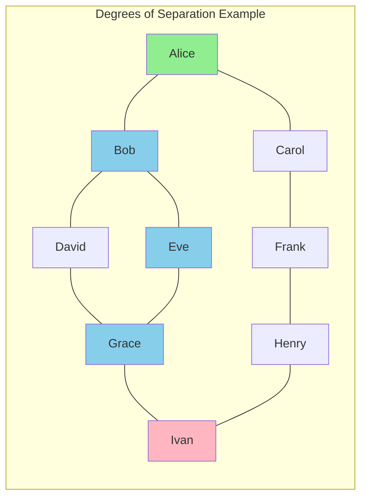

**Finding degrees from Alice to Ivan:**
- Degree 0: Alice
- Degree 1: Bob, Carol
- Degree 2: David, Eve, Frank
- Degree 3: Grace, Henry
- Degree 4: Ivan

**Shortest path: Alice -> Bob -> Eve -> Grace -> Ivan (4 degrees)**

### Why Bidirectional BFS is Faster

Consider a social network where each person has ~100 friends on average:

| Method | Nodes Explored (6 degrees) |
|--------|---------------------------|
| Regular BFS | 100^6 = 1 trillion |
| Bidirectional BFS | 2 * 100^3 = 2 million |

The bidirectional approach reduces exponential growth by half the exponent!

### Complexity
- **Time**: O(V + E) for standard BFS; O(b^(d/2)) for bidirectional where b = branching factor, d = distance
- **Space**: O(V) for visited set

---

## Complete Working Example

```python
from collections import deque

# Sample social network as adjacency list
social_network = {
    'Alice': ['Bob', 'Carol', 'Diana'],
    'Bob': ['Alice', 'Eve', 'Frank'],
    'Carol': ['Alice', 'George'],
    'Diana': ['Alice', 'Henry'],
    'Eve': ['Bob', 'Ivan'],
    'Frank': ['Bob', 'Ivan'],
    'George': ['Carol', 'Julia'],
    'Henry': ['Diana', 'Julia'],
    'Ivan': ['Eve', 'Frank', 'Kevin'],
    'Julia': ['George', 'Henry', 'Kevin'],
    'Kevin': ['Ivan', 'Julia', 'Larry'],
    'Larry': ['Kevin']
}

def find_all_distances(graph, start):
    """Find degrees of separation from start to all reachable nodes."""
    distances = {start: 0}
    queue = deque([start])

    while queue:
        person = queue.popleft()
        for friend in graph.get(person, []):
            if friend not in distances:
                distances[friend] = distances[person] + 1
                queue.append(friend)

    return distances

def find_path(graph, start, end):
    """Find the actual path between two people."""
    if start == end:
        return [start]

    parent = {start: None}
    queue = deque([start])

    while queue:
        person = queue.popleft()
        for friend in graph.get(person, []):
            if friend not in parent:
                parent[friend] = person
                if friend == end:
                    # Reconstruct path
                    path = []
                    node = end
                    while node:
                        path.append(node)
                        node = parent[node]
                    return path[::-1]
                queue.append(friend)

    return []  # No path

# Example usage
if __name__ == "__main__":
    # Find degrees from Alice to everyone
    print("Distances from Alice:")
    distances = find_all_distances(social_network, 'Alice')
    for person, dist in sorted(distances.items(), key=lambda x: x[1]):
        print(f"  {person}: {dist} degree(s)")

    print("\nPath from Alice to Larry:")
    path = find_path(social_network, 'Alice', 'Larry')
    print(f"  {' -> '.join(path)}")
    print(f"  Degrees of separation: {len(path) - 1}")
```

::: info Complexity: Time O(V + E) · Space O(V)
- **Time:** find_all_distances uses standard BFS O(V + E); find_path similarly O(V + E)
- **Space:** Distances/parent dictionaries O(V), queue O(V), path O(V) in worst case
:::

**Output:**
```
Distances from Alice:
  Alice: 0 degree(s)
  Bob: 1 degree(s)
  Carol: 1 degree(s)
  Diana: 1 degree(s)
  Eve: 2 degree(s)
  Frank: 2 degree(s)
  George: 2 degree(s)
  Henry: 2 degree(s)
  Ivan: 3 degree(s)
  Julia: 3 degree(s)
  Kevin: 4 degree(s)
  Larry: 5 degree(s)

Path from Alice to Larry:
  Alice -> Bob -> Eve -> Ivan -> Kevin -> Larry
  Degrees of separation: 5
```

---

## Interview Applications

### Common Interview Questions

1. **Word Ladder** (LeetCode 127)
   - Transform one word to another, changing one letter at a time
   - BFS where each word is a node, edges connect words differing by one letter

2. **Clone Graph** (LeetCode 133)
   - Deep copy a graph using BFS or DFS traversal

3. **Number of Islands** (LeetCode 200)
   - Count connected components using DFS/BFS

4. **Course Schedule** (LeetCode 207)
   - Detect cycles in directed graph using DFS

5. **Shortest Path in Binary Matrix** (LeetCode 1091)
   - BFS for shortest path in grid

6. **All Nodes Distance K in Binary Tree** (LeetCode 863)
   - Convert tree to graph, then BFS from target node

### Google-Specific Considerations

- **Scale**: Google deals with graphs containing billions of nodes (web pages, users)
- **Distributed Computing**: Solutions must work across multiple machines
- **Bidirectional Search**: Essential for large-scale shortest path problems
- **Memory Efficiency**: Iterative over recursive to avoid stack overflow
- **Early Termination**: Stop as soon as target is found

### Tips for Interviews

1. **Clarify the graph type**: Directed vs undirected? Weighted vs unweighted?
2. **Ask about constraints**: Number of nodes/edges? Connected graph?
3. **Consider edge cases**: Empty graph, single node, disconnected components
4. **State complexity**: Always mention time and space complexity
5. **Optimize if asked**: Bidirectional BFS, A* for informed search

---

## Practice Problems

::: details Number of Islands (LeetCode 200)
**Problem:** Count number of islands (connected '1' regions) in a 2D grid of '1's (land) and '0's (water).

**Key Insight:** DFS/BFS flood fill to count connected components on a grid.

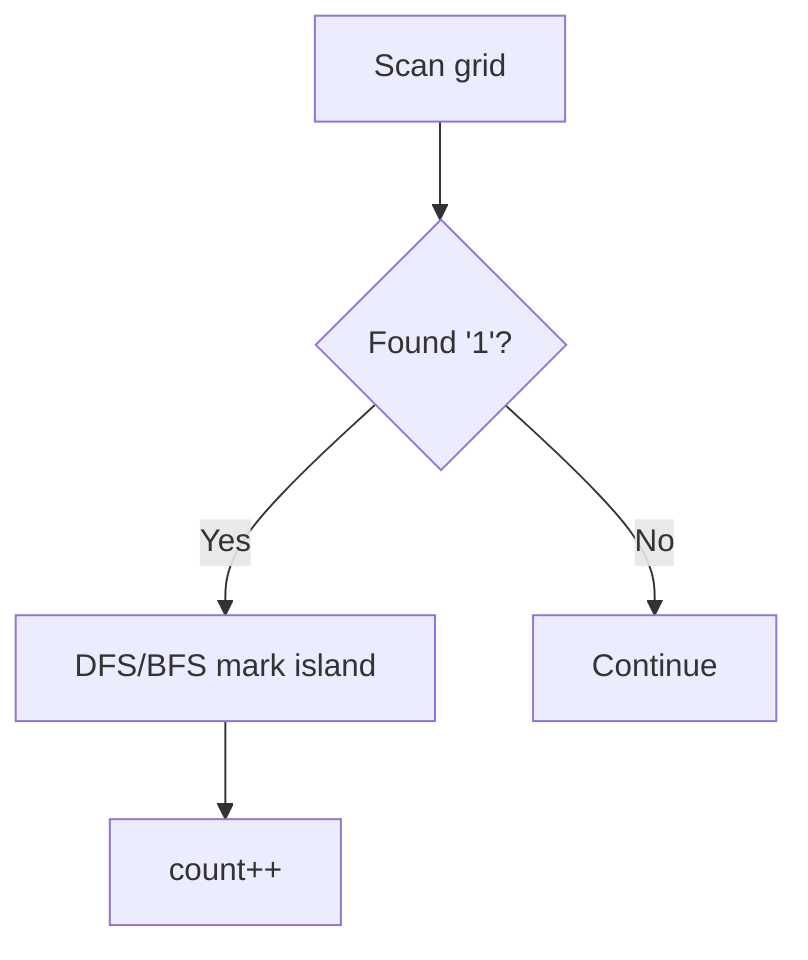

**Approach:** For each unvisited land cell, DFS to mark entire island, increment island count.

**Complexity:** O(M*N) time, O(M*N) space
:::

::: details Word Ladder (LeetCode 127)
**Problem:** Find shortest transformation sequence from beginWord to endWord, changing one letter at a time.

**Key Insight:** BFS on implicit graph where words differing by one character are neighbors.

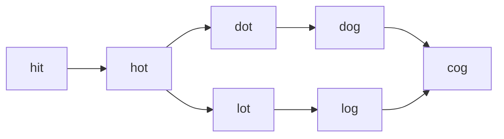

**Approach:** BFS from beginWord, generate all one-letter transformations, stop at endWord.

**Complexity:** O(M^2 * N) time where M = word length, N = wordList size
:::

::: details Clone Graph (LeetCode 133)
**Problem:** Create a deep copy of an undirected graph given a reference to a node.

**Key Insight:** Hash map to track original-to-clone mapping, handle cycles with visited check.

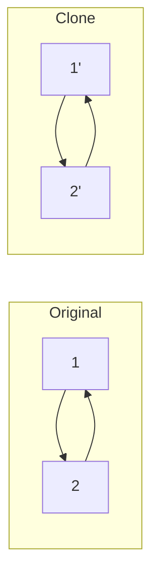

**Approach:** DFS/BFS traversal with hash map: if node seen, return clone; else create and recurse.

**Complexity:** O(V+E) time, O(V) space
:::

::: details Course Schedule (LeetCode 207)
**Problem:** Determine if all courses can be finished given prerequisite pairs (detect cycle in DAG).

**Key Insight:** Topological sort - cycle exists if not all nodes can be processed.


**Approach:** Kahn's algorithm (BFS) or DFS with 3-state coloring for cycle detection.

**Complexity:** O(V+E) time, O(V+E) space
:::

::: details Shortest Path in Binary Matrix (LeetCode 1091)
**Problem:** Find shortest clear path from top-left to bottom-right in binary grid with 8-directional movement.

**Key Insight:** BFS for unweighted shortest path, using 8 directions instead of 4.

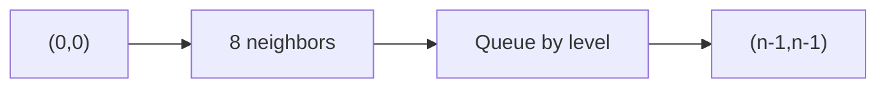

**Approach:** Standard BFS since all moves have equal cost, explore 8 directional neighbors.

**Complexity:** O(N^2) time, O(N^2) space
:::

::: details Open the Lock (LeetCode 752)
**Problem:** Find minimum turns to open a 4-wheel combination lock from "0000" to target, avoiding deadends.

**Key Insight:** BFS on state space - each combination is a node, neighbors are one-turn-away states.

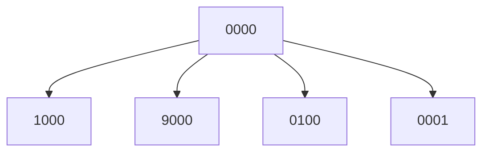

**Approach:** BFS from "0000", each state has 8 neighbors (4 wheels x 2 directions), skip deadends.

**Complexity:** O(10^4 * 8) = O(1) since state space is bounded
:::

::: details Minimum Genetic Mutation (LeetCode 433)
**Problem:** Find minimum mutations to transform startGene to endGene using genes from bank.

**Key Insight:** Same as Word Ladder - BFS with 4-char alphabet {A,C,G,T} on 8-char strings.


**Approach:** BFS where neighbors are valid genes differing by exactly one character.

**Complexity:** O(N * 8 * 4) time where N = bank size
:::

---

## Summary

| Algorithm | Data Structure | Best For | Complexity |
|-----------|---------------|----------|------------|
| DFS Recursive | Call Stack | Simple traversal, backtracking | O(V+E) time, O(V) space |
| DFS Iterative | Explicit Stack | Deep graphs, memory control | O(V+E) time, O(V) space |
| BFS | Queue | Shortest path (unweighted) | O(V+E) time, O(V) space |
| Bidirectional BFS | Two Queues | Large graphs, known target | O(b^(d/2)) time |

**Key Takeaways:**
- BFS guarantees shortest path in unweighted graphs
- DFS is memory-efficient for deep exploration
- Bidirectional BFS dramatically improves performance for point-to-point queries
- Both algorithms have O(V + E) time complexity
- Choose based on problem requirements and graph characteristics

---

## Sentence Similarity

### Overview

Sentence similarity problems test your ability to determine if two sentences are similar based on a set of similar word pairs. These problems appear frequently in interviews and have practical applications in natural language processing, search engines, and recommendation systems.

There are two variants:
- **LeetCode 734 (Sentence Similarity I)**: Direct similarity only - words are similar if explicitly listed as a pair
- **LeetCode 737 (Sentence Similarity II)**: Transitive similarity - if (a ~ b) and (b ~ c), then (a ~ c)

### Problem Statement

**Sentence Similarity I (LeetCode 734)**

Given two sentences `sentence1` and `sentence2`, and a list of `similarPairs`, return `true` if the sentences are similar.

Sentences are similar if:
1. They have the same length
2. For each word pair at the same position, either:
   - The words are identical, OR
   - The pair is in `similarPairs` (in either order)

**Sentence Similarity II (LeetCode 737)**

Same as above, but similarity is **transitive**: if "a" is similar to "b" and "b" is similar to "c", then "a" is similar to "c".

### Examples

```
Sentence Similarity I:
sentence1 = ["great", "acting", "skills"]
sentence2 = ["fine", "drama", "talent"]
similarPairs = [["great", "fine"], ["acting", "drama"], ["skills", "talent"]]
Output: true

Sentence Similarity II (Transitive):
sentence1 = ["great", "acting", "skills"]
sentence2 = ["fine", "drama", "talent"]
similarPairs = [["great", "good"], ["fine", "good"], ["acting", "drama"], ["skills", "talent"]]
Output: true
Explanation: "great" ~ "good" ~ "fine" (transitively similar)
```

### Approach Selection

| Problem | Approach | Time Complexity | Space Complexity |
|---------|----------|-----------------|------------------|
| Similarity I | HashMap of Sets | O(n + p) | O(p) |
| Similarity II | Union-Find | O(n * alpha(p) + p) | O(p) |
| Similarity II | DFS | O(n * p) | O(p) |

Where n = sentence length, p = number of similar pairs, alpha = inverse Ackermann function (nearly constant)

### Solution: Sentence Similarity I (HashMap)

```python
def areSentencesSimilar(
    sentence1: list[str],
    sentence2: list[str],
    similarPairs: list[list[str]]
) -> bool:
    """
    Sentence Similarity I - Direct similarity only.

    Time: O(n + p) where n = sentence length, p = pairs
    Space: O(p) for the similarity map
    """
    # Quick check: sentences must have same length
    if len(sentence1) != len(sentence2):
        return False

    # Build similarity map: word -> set of similar words
    similar = {}
    for w1, w2 in similarPairs:
        if w1 not in similar:
            similar[w1] = set()
        if w2 not in similar:
            similar[w2] = set()
        similar[w1].add(w2)
        similar[w2].add(w1)

    # Check each word pair
    for w1, w2 in zip(sentence1, sentence2):
        if w1 == w2:
            continue
        if w1 not in similar or w2 not in similar[w1]:
            return False

    return True
```

::: info Complexity: Time O(n + p) · Space O(p)
- **Time:** Building similarity map O(p), then O(n) comparisons with O(1) set lookup each
- **Space:** Similarity map stores up to 2p word pairs (both directions)
:::

### Solution: Sentence Similarity II (Union-Find)

The key insight is that transitive similarity creates **equivalence classes** of words. Union-Find is perfect for managing these groups.

```python
class UnionFind:
    """
    Union-Find (Disjoint Set Union) for string keys.

    Supports path compression and union by rank for
    near-constant time operations.
    """
    def __init__(self):
        self.parent = {}
        self.rank = {}

    def find(self, x: str) -> str:
        """Find root with path compression."""
        if x not in self.parent:
            self.parent[x] = x
            self.rank[x] = 0
        if self.parent[x] != x:
            self.parent[x] = self.find(self.parent[x])  # Path compression
        return self.parent[x]

    def union(self, x: str, y: str) -> None:
        """Union by rank."""
        root_x, root_y = self.find(x), self.find(y)
        if root_x == root_y:
            return
        # Attach smaller tree under larger tree
        if self.rank[root_x] < self.rank[root_y]:
            self.parent[root_x] = root_y
        elif self.rank[root_x] > self.rank[root_y]:
            self.parent[root_y] = root_x
        else:
            self.parent[root_y] = root_x
            self.rank[root_x] += 1

    def connected(self, x: str, y: str) -> bool:
        """Check if two elements are in the same set."""
        return self.find(x) == self.find(y)


def areSentencesSimilarTwo(
    sentence1: list[str],
    sentence2: list[str],
    similarPairs: list[list[str]]
) -> bool:
    """
    Sentence Similarity II - Transitive similarity with Union-Find.

    Time: O(n * alpha(p) + p * alpha(p)) ~ O(n + p) amortized
    Space: O(p) for Union-Find structure
    """
    if len(sentence1) != len(sentence2):
        return False

    # Build Union-Find structure from similar pairs
    uf = UnionFind()
    for w1, w2 in similarPairs:
        uf.union(w1, w2)

    # Check if each word pair is in the same equivalence class
    for w1, w2 in zip(sentence1, sentence2):
        if w1 == w2:
            continue
        if not uf.connected(w1, w2):
            return False

    return True
```

::: info Complexity: Time O((n + p) * alpha(p)) · Space O(p)
- **Time:** Building Union-Find from p pairs O(p * alpha(p)), n word comparisons O(n * alpha(p))
- **Space:** Union-Find parent and rank dictionaries store unique words from pairs O(p)
:::

### Visual Walkthrough: Union-Find

```
similarPairs = [["great", "good"], ["fine", "good"], ["acting", "drama"], ["skills", "talent"]]

Step 1: Process ("great", "good")
  great --- good

Step 2: Process ("fine", "good")
  great --- good --- fine
  (fine joins good's group, which already has great)

Step 3: Process ("acting", "drama")
  acting --- drama

Step 4: Process ("skills", "talent")
  skills --- talent

Final groups (equivalence classes):
  Group 1: {great, good, fine}
  Group 2: {acting, drama}
  Group 3: {skills, talent}

Query: Is "great" similar to "fine"?
  find("great") = "good" (or "great" depending on union order)
  find("fine") = "good" (or "great")
  Same root? YES -> Similar!
```

### Alternative: DFS Solution

```python
def areSentencesSimilarTwo_DFS(
    sentence1: list[str],
    sentence2: list[str],
    similarPairs: list[list[str]]
) -> bool:
    """
    Sentence Similarity II using DFS.

    Build a graph and check if words are in the same connected component.

    Time: O(n * p) worst case for DFS per word
    Space: O(p) for the graph
    """
    if len(sentence1) != len(sentence2):
        return False

    # Build adjacency list
    from collections import defaultdict
    graph = defaultdict(set)
    for w1, w2 in similarPairs:
        graph[w1].add(w2)
        graph[w2].add(w1)

    def dfs(source: str, target: str, visited: set) -> bool:
        """Check if target is reachable from source."""
        if source == target:
            return True
        visited.add(source)
        for neighbor in graph[source]:
            if neighbor not in visited:
                if dfs(neighbor, target, visited):
                    return True
        return False

    # Check each word pair
    for w1, w2 in zip(sentence1, sentence2):
        if w1 == w2:
            continue
        if not dfs(w1, w2, set()):
            return False

    return True
```

::: info Complexity: Time O(n * p) · Space O(p)
- **Time:** For each of n word pairs, DFS may traverse all p edges in similarity graph
- **Space:** Adjacency list O(p), visited set recreated per query O(p)
:::

### Mermaid Diagram: Similarity Graph

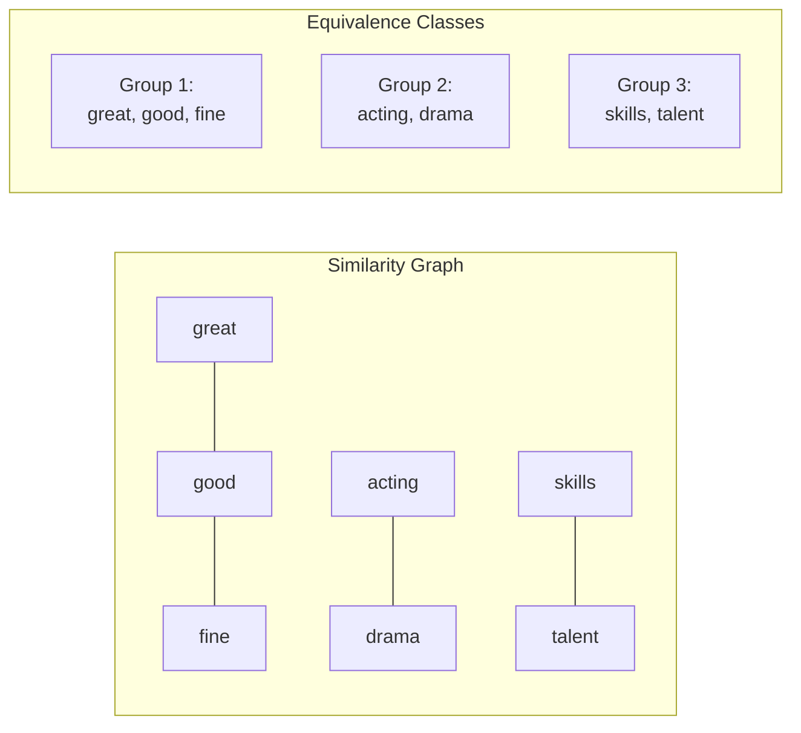

### Complexity Comparison

| Approach | Build Time | Query Time | Total Time | Space |
|----------|------------|------------|------------|-------|
| HashMap (I only) | O(p) | O(1) per pair | O(n + p) | O(p) |
| Union-Find | O(p * alpha) | O(alpha) per pair | O((n+p) * alpha) | O(p) |
| DFS | O(p) | O(p) per pair | O(n * p) | O(p) |

- **alpha** = inverse Ackermann function, effectively constant (< 5 for any practical input)
- Union-Find is the optimal choice for Sentence Similarity II

### When to Use Each Approach

| Scenario | Best Approach |
|----------|---------------|
| Direct similarity only | HashMap of sets |
| Transitive similarity, many queries | Union-Find |
| Transitive similarity, few queries | DFS (simpler code) |
| Dynamic additions to pairs | Union-Find |

### Edge Cases to Handle

```python
# Edge case 1: Different lengths
sentence1 = ["I", "love", "coding"]
sentence2 = ["I", "love"]
# Return False immediately

# Edge case 2: Identical sentences
sentence1 = ["hello", "world"]
sentence2 = ["hello", "world"]
# Return True (identical words don't need pairs)

# Edge case 3: Empty sentences
sentence1 = []
sentence2 = []
# Return True (both empty = similar)

# Edge case 4: Word not in any pair
sentence1 = ["unique"]
sentence2 = ["different"]
similarPairs = []
# Return False (no similarity defined)
```

### Interview Tips

1. **Clarify transitivity**: Ask if similarity is transitive (huge difference in approach)
2. **Union-Find mastery**: Google loves Union-Find - know path compression and union by rank
3. **Discuss trade-offs**: Mention that DFS is simpler but Union-Find scales better
4. **Handle strings carefully**: Use consistent case handling if not specified

### Related Problems

::: details Sentence Similarity (LeetCode 734)
**Problem:** Check if two sentences are similar given pairs of directly similar words (non-transitive).

**Key Insight:** Simple hash set lookup - no graph traversal needed.

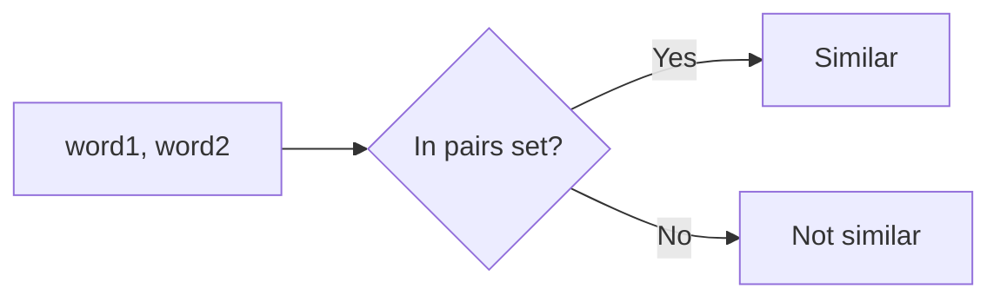

**Approach:** Build set of similar pairs, check each word pair in both sentences.

**Complexity:** O(N + P) time, O(P) space where P = number of pairs
:::

::: details Sentence Similarity II (LeetCode 737)
**Problem:** Check transitive similarity - if a~b and b~c, then a~c.

**Key Insight:** Union-Find groups transitively similar words into equivalence classes.

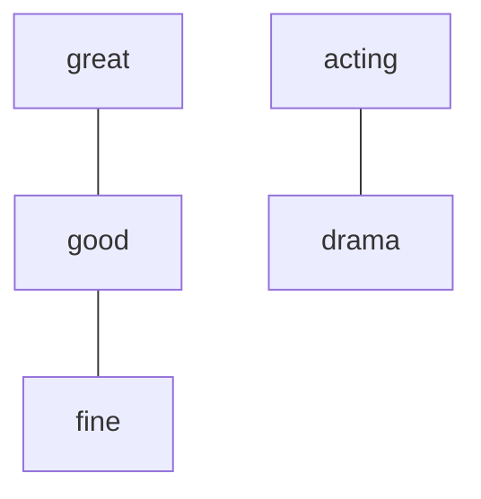

**Approach:** Union all similar pairs, check if corresponding words share the same root.

**Complexity:** O((N+P) * alpha(P)) time, O(P) space
:::

::: details Number of Provinces (LeetCode 547)
**Problem:** Count connected components in an adjacency matrix representing city connections.

**Key Insight:** Union-Find or DFS - same as connected components with matrix input.

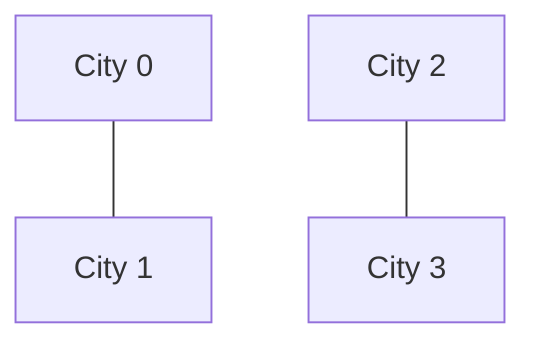

**Approach:** Process adjacency matrix with Union-Find, count distinct roots.

**Complexity:** O(N^2 * alpha(N)) time, O(N) space
:::

::: details Redundant Connection (LeetCode 684)
**Problem:** Find the edge that creates a cycle in an undirected graph that should be a tree.

**Key Insight:** Union-Find - the edge connecting two already-connected nodes is redundant.

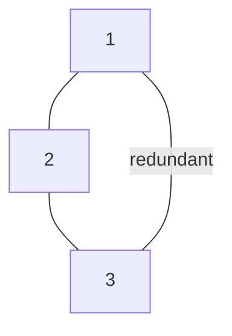

**Approach:** Process edges with Union-Find, return first edge where union fails.

**Complexity:** O(N * alpha(N)) time, O(N) space
:::

::: details Accounts Merge (LeetCode 721)
**Problem:** Merge accounts that share at least one email address.

**Key Insight:** Union-Find on string keys - emails from same account or shared emails get unioned.

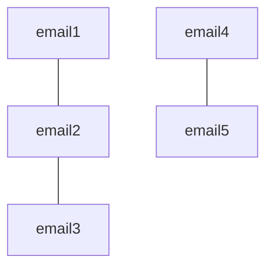

**Approach:** Union-Find where first email of each account is representative, union shared emails.

**Complexity:** O(N * K * alpha(NK)) time where N = accounts, K = emails per account
:::

---

## References

- [DFS vs BFS: A Guide for Deep Understanding](https://www.puppygraph.com/blog/depth-first-search-vs-breadth-first-search)
- [Difference between BFS and DFS - GeeksforGeeks](https://www.geeksforgeeks.org/dsa/difference-between-bfs-and-dfs/)
- [Graph Traversal - VisuAlgo](https://visualgo.net/en/dfsbfs)
- [Degrees of Separation in Social Networks](https://ojs.aaai.org/index.php/SOCS/article/view/18200)
- [Finding Degrees of Separation in a Social Graph](https://sangupta.com/tech/degrees-of-separation.html)
- [Graph Theory and Six Degrees of Separation - MIT](https://math.mit.edu/research/highschool/primes/circle/documents/2021/Heikkinen.pdf)
- [Matplotlib Animation Documentation](https://matplotlib.org/stable/api/animation_api.html)
- [NetworkX Documentation](https://networkx.org/documentation/stable/)
