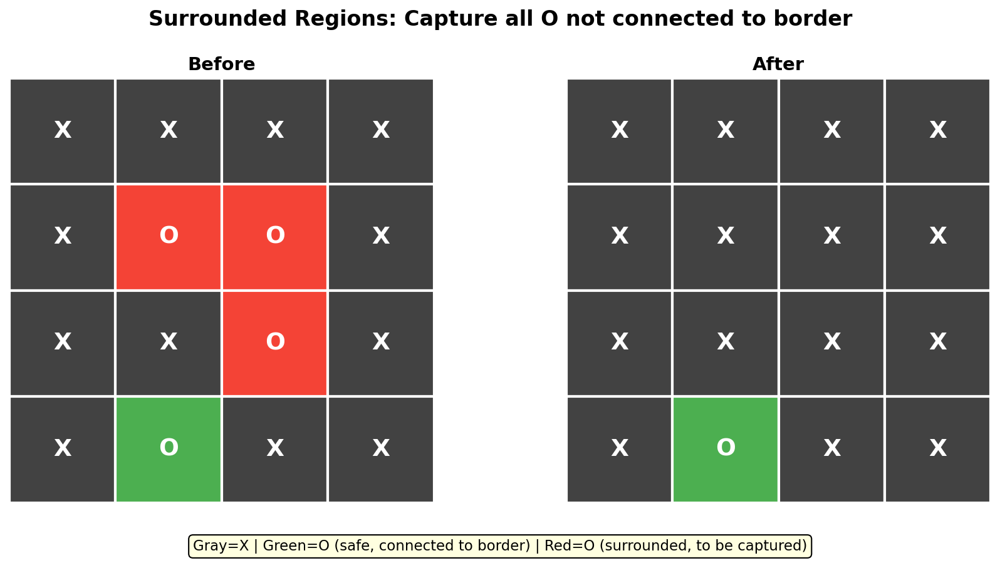
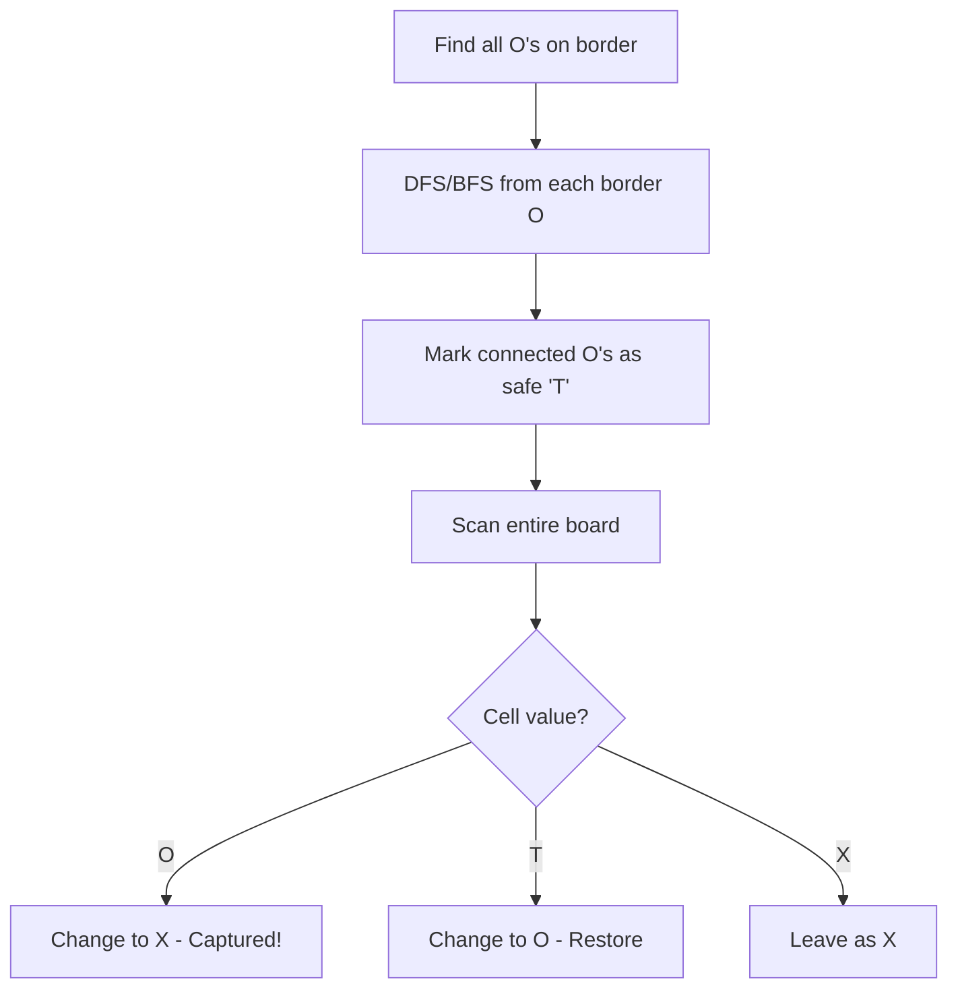
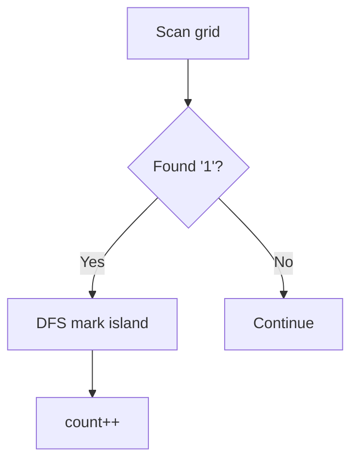
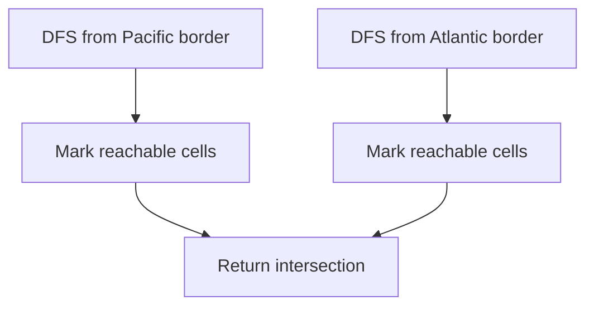
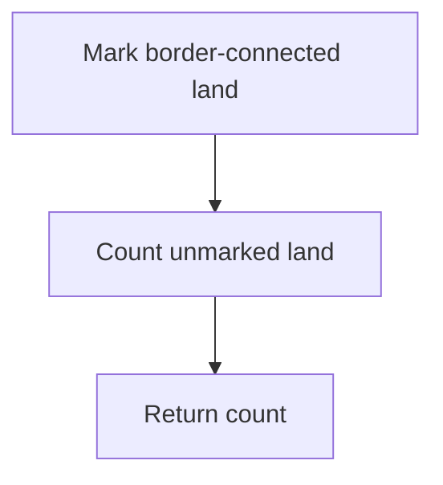
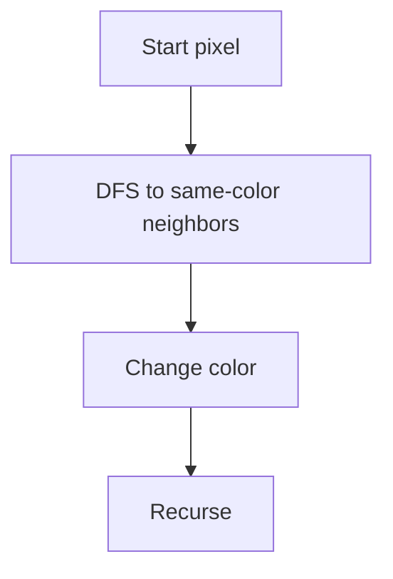

# Surrounded Regions

> **Capturing regions not connected to the border**

---

## Problem Statement

**LeetCode 130: Surrounded Regions**

Given an `m x n` matrix `board` containing `'X'` and `'O'`, capture all regions that are 4-directionally surrounded by `'X'`.

A region is captured by flipping all `'O'`s into `'X'`s in that surrounded region.

**Key Insight**: An `'O'` is NOT surrounded if it is:
- On the border of the board, OR
- Connected to a border `'O'` (directly or through other `'O'`s)

---

## Visual Overview



---

## Examples

### Example 1

```
Input:
X X X X
X O O X
X X O X
X O X X

Output:
X X X X
X X X X
X X X X
X O X X

Explanation:
- The O at (3,1) is on the border, so it's NOT captured
- The O's at (1,1), (1,2), (2,2) are surrounded, so they ARE captured
```

### Example 2

```
Input:
X X X X
X O O X
X O O X
X X X X

Output:
X X X X
X X X X
X X X X
X X X X

Explanation:
All O's are surrounded (not connected to border)
```

### Example 3

```
Input:
O O O
O O O
O O O

Output:
O O O
O O O
O O O

Explanation:
All O's are on or connected to the border
```

---

## Approach

### Key Insight: Start from the Border

**Naive approach (slow)**: For each `'O'`, check if it can reach the border

**Optimal approach**: Start from border `'O'`s and mark all connected `'O'`s as "safe"

### Algorithm

1. **Mark safe cells**: DFS/BFS from all border `'O'`s, mark them with temporary marker `'T'`
2. **Capture surrounded**: Change all remaining `'O'`s to `'X'`
3. **Restore safe cells**: Change all `'T'`s back to `'O'`

```
Step 1: Mark border-connected O's as T
X X X X       X X X X
X O O X  -->  X O O X
X X O X       X X O X
X O X X       X T X X

Step 2: Capture remaining O's (change to X)
X X X X       X X X X
X O O X  -->  X X X X
X X O X       X X X X
X T X X       X T X X

Step 3: Restore T's to O's
X X X X       X X X X
X X X X  -->  X X X X
X X X X       X X X X
X T X X       X O X X
```

---

## Solution 1: DFS from Border

```python
def solve(board: list[list[str]]) -> None:
    """
    Modify board in-place.
    """
    if not board or not board[0]:
        return

    rows, cols = len(board), len(board[0])

    def dfs(r: int, c: int) -> None:
        """Mark cell and all connected O's as safe (T)."""
        if (r < 0 or r >= rows or c < 0 or c >= cols or
            board[r][c] != 'O'):
            return

        board[r][c] = 'T'  # Temporary marker for "safe"

        dfs(r + 1, c)
        dfs(r - 1, c)
        dfs(r, c + 1)
        dfs(r, c - 1)

    # Step 1: Mark all O's connected to border
    # Check first and last row
    for c in range(cols):
        dfs(0, c)
        dfs(rows - 1, c)

    # Check first and last column
    for r in range(rows):
        dfs(r, 0)
        dfs(r, cols - 1)

    # Step 2 & 3: Capture surrounded O's and restore safe cells
    for r in range(rows):
        for c in range(cols):
            if board[r][c] == 'O':
                board[r][c] = 'X'  # Capture
            elif board[r][c] == 'T':
                board[r][c] = 'O'  # Restore
```

::: info Complexity: Time O(m * n) · Space O(m * n)
- **Time:** Border traversal O(m + n), DFS visits each cell at most once, final sweep O(m * n)
- **Space:** Recursion stack up to O(m * n) for large connected border regions; in-place board modification
:::

---

## Solution 2: BFS from Border

```python
from collections import deque

def solve(board: list[list[str]]) -> None:
    if not board or not board[0]:
        return

    rows, cols = len(board), len(board[0])
    directions = [(0, 1), (0, -1), (1, 0), (-1, 0)]

    def bfs(start_r: int, start_c: int) -> None:
        if board[start_r][start_c] != 'O':
            return

        queue = deque([(start_r, start_c)])
        board[start_r][start_c] = 'T'

        while queue:
            r, c = queue.popleft()

            for dr, dc in directions:
                nr, nc = r + dr, c + dc
                if (0 <= nr < rows and 0 <= nc < cols and
                    board[nr][nc] == 'O'):
                    board[nr][nc] = 'T'
                    queue.append((nr, nc))

    # Mark border-connected O's
    for c in range(cols):
        bfs(0, c)
        bfs(rows - 1, c)
    for r in range(rows):
        bfs(r, 0)
        bfs(r, cols - 1)

    # Capture and restore
    for r in range(rows):
        for c in range(cols):
            if board[r][c] == 'O':
                board[r][c] = 'X'
            elif board[r][c] == 'T':
                board[r][c] = 'O'
```

::: info Complexity: Time O(m * n) · Space O(m * n)
- **Time:** Border initialization O(m + n), BFS visits each O cell once, final sweep O(m * n)
- **Space:** Queue can hold O(m * n) cells for large border-connected regions; in-place marking
:::

---

## Solution 3: Union-Find

```python
class UnionFind:
    def __init__(self, n):
        self.parent = list(range(n))
        self.rank = [0] * n

    def find(self, x):
        if self.parent[x] != x:
            self.parent[x] = self.find(self.parent[x])
        return self.parent[x]

    def union(self, x, y):
        px, py = self.find(x), self.find(y)
        if px == py:
            return
        if self.rank[px] < self.rank[py]:
            px, py = py, px
        self.parent[py] = px
        if self.rank[px] == self.rank[py]:
            self.rank[px] += 1

def solve(board: list[list[str]]) -> None:
    if not board or not board[0]:
        return

    rows, cols = len(board), len(board[0])

    # Create a "dummy" border node
    # All border O's will be connected to this dummy
    dummy = rows * cols
    uf = UnionFind(rows * cols + 1)

    def index(r, c):
        return r * cols + c

    directions = [(0, 1), (0, -1), (1, 0), (-1, 0)]

    for r in range(rows):
        for c in range(cols):
            if board[r][c] == 'O':
                # If on border, connect to dummy
                if r == 0 or r == rows - 1 or c == 0 or c == cols - 1:
                    uf.union(index(r, c), dummy)
                else:
                    # Connect to adjacent O's
                    for dr, dc in directions:
                        nr, nc = r + dr, c + dc
                        if board[nr][nc] == 'O':
                            uf.union(index(r, c), index(nr, nc))

    # Capture O's not connected to dummy
    for r in range(rows):
        for c in range(cols):
            if board[r][c] == 'O' and uf.find(index(r, c)) != uf.find(dummy):
                board[r][c] = 'X'
```

::: info Complexity: Time O(m * n * alpha(m * n)) · Space O(m * n)
- **Time:** Processing each cell with union operations; alpha is inverse Ackermann (effectively constant)
- **Space:** UnionFind parent and rank arrays store m * n + 1 elements (including dummy border node)
:::

---

## Complexity Analysis

| Approach | Time | Space |
|----------|------|-------|
| DFS | O(m * n) | O(m * n) worst case recursion |
| BFS | O(m * n) | O(m * n) for queue |
| Union-Find | O(m * n * alpha) | O(m * n) |

---

## Process Visualization



---

## Common Mistakes

### 1. Starting DFS from Interior Cells

```python
# WRONG - starts from all O's
for r in range(rows):
    for c in range(cols):
        if board[r][c] == 'O':
            dfs(r, c)  # This marks ALL O's, not just border-connected

# CORRECT - start only from border
for c in range(cols):
    dfs(0, c)
    dfs(rows - 1, c)
```

### 2. Forgetting to Restore Safe Cells

```python
# WRONG - forgets to restore T's
for r in range(rows):
    for c in range(cols):
        if board[r][c] == 'O':
            board[r][c] = 'X'
        # Missing: restore T's to O's!
```

### 3. Modifying Board While Checking

```python
# WRONG - changes board before fully exploring
def dfs(r, c):
    if board[r][c] != 'O':
        return
    board[r][c] = 'X'  # Too early! Might be connected to border
    # ...

# CORRECT - use temporary marker
def dfs(r, c):
    if board[r][c] != 'O':
        return
    board[r][c] = 'T'  # Temporary, will decide later
    # ...
```

---

## Edge Cases

1. **Board with all X's**: Nothing to capture
2. **Board with all O's**: All on/connected to border, nothing captured
3. **Single row/column**: All cells are border cells
4. **1x1 board with O**: Border cell, not captured
5. **O's forming ring around X's**: O's are border-connected, not captured

---

## Related Problems

::: details Number of Islands (LeetCode 200)
**Problem:** Count number of islands (connected '1' regions) in a 2D grid.

**Key Insight:** Flood fill to mark and count connected components.



**Approach:** For each unvisited land cell, DFS to mark entire island, increment count.

**Complexity:** O(M*N) time, O(M*N) space
:::

::: details Pacific Atlantic Water Flow (LeetCode 417)
**Problem:** Find cells where water can flow to both Pacific (top/left) and Atlantic (bottom/right) oceans.

**Key Insight:** Reverse approach - DFS from ocean borders going uphill.



**Approach:** DFS from each ocean boundary going uphill, return intersection of both sets.

**Complexity:** O(M*N) time, O(M*N) space
:::

::: details Number of Enclaves (LeetCode 1020)
**Problem:** Count land cells that cannot reach border (surrounded land cells).

**Key Insight:** Same as Surrounded Regions but count instead of modify.



**Approach:** DFS from border land cells to mark escapable land, count remaining land cells.

**Complexity:** O(M*N) time, O(M*N) space
:::

::: details Flood Fill (LeetCode 733)
**Problem:** Change all connected cells of same color to new color starting from given pixel.

**Key Insight:** Basic DFS flood fill - foundation for grid traversal problems.



**Approach:** DFS from start pixel, change color of all connected same-color cells.

**Complexity:** O(M*N) time, O(M*N) space
:::

---

## Interview Tips

1. **Explain the reversal**: Instead of checking if each O is surrounded, check which O's are safe (border-connected)

2. **Choose marker wisely**: Any character not in original board works (T, #, *, etc.)

3. **Handle in-place modification**: Use temporary marker to avoid corrupting state during traversal

4. **Consider Union-Find**: Mention it as alternative, useful if multiple queries

### Follow-up Questions

- **Q: What if we want to count surrounded regions instead of capturing?**
  - A: Count DFS starts from interior O's not marked as safe

- **Q: What if 8-directional connectivity?**
  - A: Add 4 more directions: (1,1), (1,-1), (-1,1), (-1,-1)

- **Q: What if we want to find the largest surrounded region?**
  - A: Track size during DFS, keep max

---

## References

- [LeetCode 130: Surrounded Regions](https://leetcode.com/problems/surrounded-regions/)
- [NeetCode Solution](https://neetcode.io/solutions/surrounded-regions)
- [Surrounded Regions - In-Depth Explanation](https://algo.monster/liteproblems/130)
