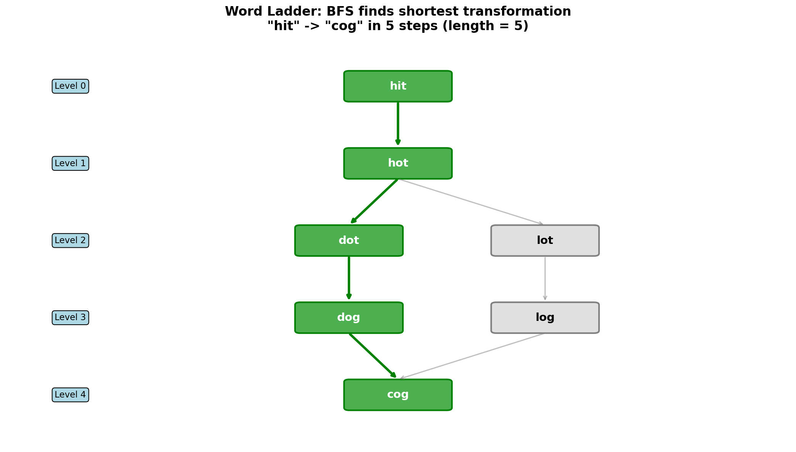
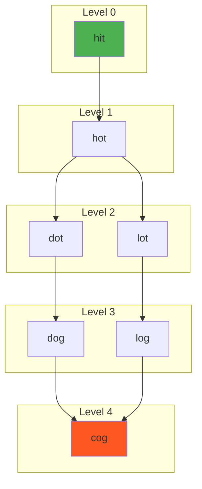
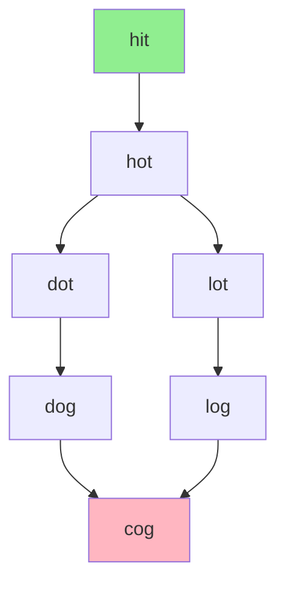
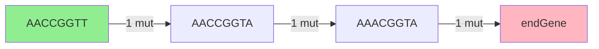
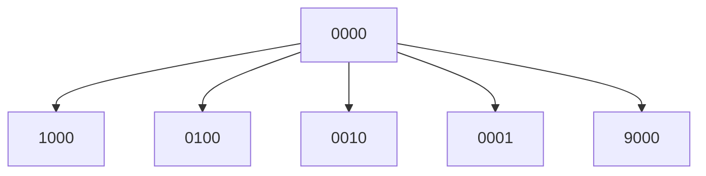
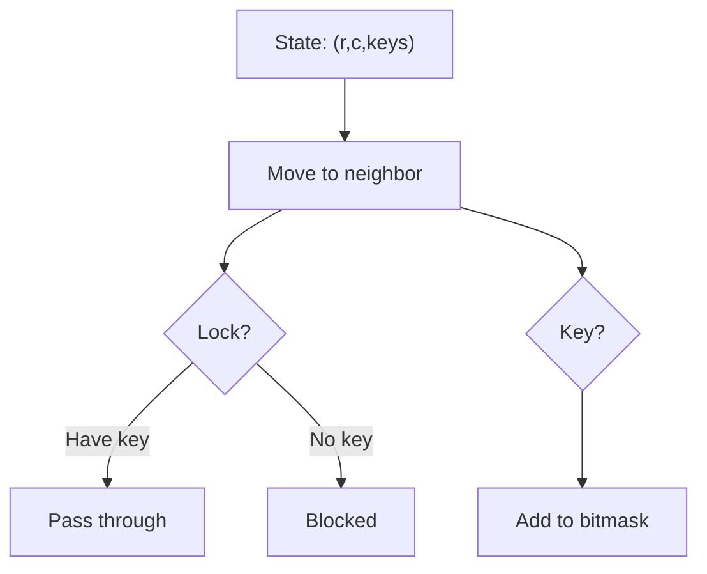

# Word Ladder

> **Finding shortest transformation sequence using BFS**

---

## Problem Statement

**LeetCode 127: Word Ladder**

A transformation sequence from word `beginWord` to word `endWord` using a dictionary `wordList` is a sequence of words `beginWord -> s1 -> s2 -> ... -> sk` such that:

- Every adjacent pair of words differs by a single letter
- Every `si` for `1 <= i <= k` is in `wordList`
- Note that `beginWord` does not need to be in `wordList`

Given two words, `beginWord` and `endWord`, and a dictionary `wordList`, return the **number of words** in the **shortest transformation sequence** from `beginWord` to `endWord`, or `0` if no such sequence exists.

---

## Visual Overview



---

## Examples

### Example 1

```
Input: beginWord = "hit", endWord = "cog", wordList = ["hot","dot","dog","lot","log","cog"]
Output: 5

Explanation: One shortest transformation sequence is:
"hit" -> "hot" -> "dot" -> "dog" -> "cog"
         (h->o)   (h->d)   (o->g)   (d->c)

Length = 5 words in the sequence
```

### Example 2

```
Input: beginWord = "hit", endWord = "cog", wordList = ["hot","dot","dog","lot","log"]
Output: 0

Explanation: The endWord "cog" is not in wordList, so no valid transformation exists.
```

---

## Key Insight

This is a **shortest path problem** in an implicit graph where:
- **Nodes**: Words
- **Edges**: Connect words that differ by exactly one letter
- **Goal**: Find shortest path from beginWord to endWord

Since the graph is **unweighted**, **BFS** finds the shortest path.

---

## Approach 1: BFS with Word Generation

For each word, generate all possible one-letter transformations and check if they exist in wordList.

::: code-group
```python [Python]
from collections import deque

def ladderLength(beginWord: str, endWord: str, wordList: list[str]) -> int:
    # Convert to set for O(1) lookup
    word_set = set(wordList)

    # Edge case: endWord not reachable
    if endWord not in word_set:
        return 0

    # BFS
    queue = deque([(beginWord, 1)])  # (word, length)
    visited = {beginWord}

    while queue:
        word, length = queue.popleft()

        # Try changing each character
        for i in range(len(word)):
            for c in 'abcdefghijklmnopqrstuvwxyz':
                if c == word[i]:
                    continue

                # Generate new word
                new_word = word[:i] + c + word[i+1:]

                if new_word == endWord:
                    return length + 1

                if new_word in word_set and new_word not in visited:
                    visited.add(new_word)
                    queue.append((new_word, length + 1))

    return 0  # No path found
```

```java [Java]
public int ladderLength(String beginWord, String endWord, List<String> wordList) {
    Set<String> wordSet = new HashSet<>(wordList);
    if (!wordSet.contains(endWord)) return 0;

    // Queue stores [word, length] pairs — mirrors Python's (word, length) tuples
    Deque<Object[]> queue = new ArrayDeque<>();
    queue.offer(new Object[]{beginWord, 1});
    Set<String> visited = new HashSet<>();
    visited.add(beginWord);

    while (!queue.isEmpty()) {
        Object[] entry = queue.poll();
        String word = (String) entry[0];
        int length = (int) entry[1];

        char[] chars = word.toCharArray();
        for (int i = 0; i < chars.length; i++) {
            char orig = chars[i];
            for (char c = 'a'; c <= 'z'; c++) {
                if (c == orig) continue;
                chars[i] = c;
                String newWord = new String(chars);
                if (newWord.equals(endWord)) return length + 1;
                if (wordSet.contains(newWord) && visited.add(newWord))
                    queue.offer(new Object[]{newWord, length + 1});
            }
            chars[i] = orig;
        }
    }
    return 0;
}
```
:::

::: info Complexity: Time O(M^2 * N) · Space O(M * N)
- **Time:** For each of N words in BFS, generate 26*M candidates; each string slice costs O(M)
- **Space:** Visited set stores up to N words of length M; queue holds word-length pairs
:::

### Complexity

| Aspect | Complexity | Explanation |
|--------|------------|-------------|
| Time | O(M^2 * N) | M = word length, N = wordList size |
| Space | O(M * N) | Queue and visited set |

- For each word (N), we try M positions
- At each position, we try 26 letters
- String operations (slicing) take O(M)

---

## Approach 2: Bidirectional BFS (Optimal)

Start BFS from both ends and meet in the middle. This dramatically reduces the search space.

```python
def ladderLength(beginWord: str, endWord: str, wordList: list[str]) -> int:
    word_set = set(wordList)

    if endWord not in word_set:
        return 0

    # Two frontiers
    front = {beginWord}
    back = {endWord}
    visited = {beginWord, endWord}
    length = 1

    while front and back:
        # Always expand the smaller frontier
        if len(front) > len(back):
            front, back = back, front

        next_front = set()

        for word in front:
            for i in range(len(word)):
                for c in 'abcdefghijklmnopqrstuvwxyz':
                    new_word = word[:i] + c + word[i+1:]

                    # Check if frontiers meet
                    if new_word in back:
                        return length + 1

                    if new_word in word_set and new_word not in visited:
                        visited.add(new_word)
                        next_front.add(new_word)

        front = next_front
        length += 1

    return 0
```

::: info Complexity: Time O(M^2 * N) · Space O(M * N)
- **Time:** Same worst case but explores O(b^(d/2)) vs O(b^d) nodes in practice where b=26, d=path length
- **Space:** Two frontier sets and visited set, each up to O(N) words of length M
:::

### Why Bidirectional is Faster

```
Regular BFS: Explores branching factor b to depth d
  Nodes visited: O(b^d)

Bidirectional BFS: Two searches each go depth d/2
  Nodes visited: O(2 * b^(d/2)) = O(b^(d/2))

Example: b=26, d=10
  Regular: 26^10 = 141 trillion
  Bidirectional: 2 * 26^5 = 23 million
```

---

## Approach 3: Pre-build Adjacency List (Pattern Matching)

Group words by patterns like `h*t`, `*ot`, `ho*` for faster neighbor lookup.

```python
from collections import defaultdict, deque

def ladderLength(beginWord: str, endWord: str, wordList: list[str]) -> int:
    if endWord not in wordList:
        return 0

    word_len = len(beginWord)

    # Build pattern -> words mapping
    # "hot" -> {"*ot": ["hot"], "h*t": ["hot"], "ho*": ["hot"]}
    patterns = defaultdict(list)
    for word in wordList:
        for i in range(word_len):
            pattern = word[:i] + '*' + word[i+1:]
            patterns[pattern].append(word)

    # BFS
    queue = deque([(beginWord, 1)])
    visited = {beginWord}

    while queue:
        word, length = queue.popleft()

        for i in range(word_len):
            pattern = word[:i] + '*' + word[i+1:]

            for neighbor in patterns[pattern]:
                if neighbor == endWord:
                    return length + 1

                if neighbor not in visited:
                    visited.add(neighbor)
                    queue.append((neighbor, length + 1))

            # Clear to avoid revisiting
            patterns[pattern] = []

    return 0
```

::: info Complexity: Time O(M^2 * N) · Space O(M^2 * N)
- **Time:** Building patterns O(M^2 * N), BFS accesses patterns instead of generating transformations
- **Space:** Pattern dictionary stores M patterns per word, each pattern maps to list of words
:::

### Complexity

| Aspect | Complexity | Explanation |
|--------|------------|-------------|
| Time | O(M^2 * N) | Building patterns + BFS |
| Space | O(M^2 * N) | Pattern dictionary |

---

## BFS Level Visualization



---

## Common Mistakes

### 1. Forgetting to Check endWord in wordList

```python
# WRONG - can infinite loop or return wrong answer
def ladderLength(beginWord, endWord, wordList):
    # Should check: if endWord not in wordList: return 0
    ...
```

### 2. Not Marking Visited Before Adding to Queue

```python
# WRONG - may add same word multiple times
if new_word in word_set:
    queue.append((new_word, length + 1))
    visited.add(new_word)  # Too late!

# CORRECT - mark visited immediately
if new_word in word_set and new_word not in visited:
    visited.add(new_word)  # Before adding to queue
    queue.append((new_word, length + 1))
```

### 3. Returning Length Instead of Word Count

```python
# The problem asks for number of WORDS in sequence, not edges
# "hit" -> "hot" -> "cog" has 3 words, not 2 transformations
return length + 1  # Add 1 for the final word
```

---

## Edge Cases

1. **beginWord equals endWord**: Return 1 (or 0 if endWord not in list)
2. **endWord not in wordList**: Return 0
3. **No valid transformation exists**: Return 0
4. **Single letter words**: Each letter is a potential neighbor
5. **Large wordList**: Use efficient data structures

---

## Word Ladder II (LeetCode 126)

Find ALL shortest transformation sequences (Hard problem).

Key differences:
- Store parent pointers during BFS
- Backtrack from endWord to find all paths
- More complex but uses same BFS foundation

```python
def findLadders(beginWord, endWord, wordList):
    word_set = set(wordList)
    if endWord not in word_set:
        return []

    # BFS to find shortest path length first
    # Then backtrack to find all paths
    # ... (more complex implementation)
```

---

## Related Problems

::: details Word Ladder II (LeetCode 126)
**Problem:** Find ALL shortest transformation sequences from beginWord to endWord.

**Key Insight:** BFS to find shortest length + backtracking to reconstruct all paths.



**Approach:** First BFS to build parent map at each level, then backtrack from endWord to find all paths.

**Complexity:** O(N * M^2) for BFS, path reconstruction can be exponential in worst case
:::

::: details Minimum Genetic Mutation (LeetCode 433)
**Problem:** Find minimum mutations to transform startGene to endGene using valid genes from bank.

**Key Insight:** Same as Word Ladder but with 4-character alphabet {A,C,G,T} and 8-char strings.



**Approach:** BFS where neighbors are genes differing by exactly one character.

**Complexity:** O(N * 8 * 4) = O(N) time where N = bank size
:::

::: details Open the Lock (LeetCode 752)
**Problem:** Find minimum turns to go from "0000" to target, avoiding deadends.

**Key Insight:** BFS on state space where each state is a 4-digit combination.



**Approach:** BFS from "0000", each state has 8 neighbors (4 wheels x 2 directions). Skip deadends.

**Complexity:** O(10^4 * 4 * 2) = O(1) since state space is bounded
:::

::: details Shortest Path to Get All Keys (LeetCode 864)
**Problem:** Find shortest path in grid to collect all keys, where locks require matching keys.

**Key Insight:** BFS with state = (position, keys_collected_bitmask).



**Approach:** BFS where state includes position and bitmask of collected keys. Different key sets = different states.

**Complexity:** O(M * N * 2^K) time and space where K = number of keys
:::

---

## Interview Tips

1. **Recognize BFS pattern**: Shortest path + unweighted graph = BFS
2. **Explain word as graph node**: Each word is a node, one-letter-different words are connected
3. **Mention bidirectional BFS**: Shows optimization thinking
4. **Discuss time complexity**: M^2 * N where M = word length, N = list size

### Follow-up Questions

- **Q: How would you find all shortest paths?**
  - A: BFS first to find length, then backtrack with parent tracking

- **Q: What if words have different lengths?**
  - A: Would need to allow insertions/deletions, becomes edit distance problem

- **Q: How to optimize for very long words?**
  - A: Use hash-based pattern matching or rolling hash

---

## References

- [LeetCode 127: Word Ladder](https://leetcode.com/problems/word-ladder/)
- [NeetCode Solution](https://neetcode.io/solutions/word-ladder)
- [Word Ladder - In-Depth Explanation](https://algo.monster/liteproblems/127)
- [Bidirectional BFS Explanation](https://efficientcodeblog.wordpress.com/2017/12/13/bidirectional-search-two-end-bfs/)
