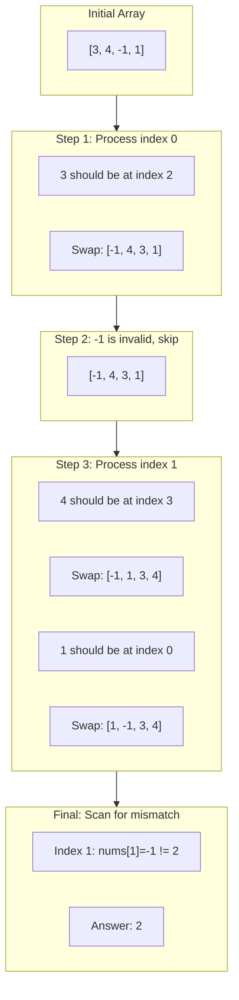
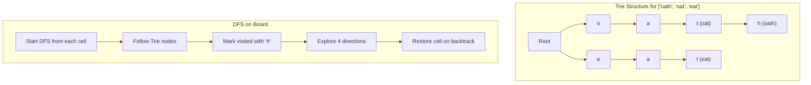
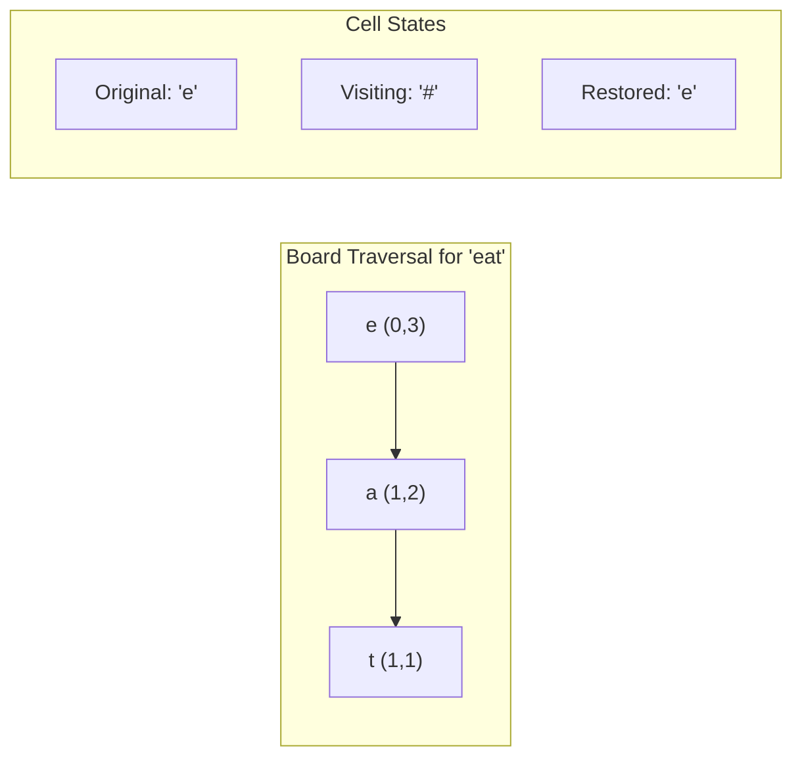

# Advanced Hash Table Problems

> **Set operations, missing elements, and grid searches**

---

## Difference of Arrays

### Problem Statement

Given two 0-indexed integer arrays `nums1` and `nums2`, return a list `answer` of size 2 where:
- `answer[0]` is a list of all **distinct** integers in `nums1` which are **not** present in `nums2`
- `answer[1]` is a list of all **distinct** integers in `nums2` which are **not** present in `nums1`

The integers in the lists may be returned in any order.

**LeetCode 2215: Find the Difference of Two Arrays**

### Examples

**Example 1:**
```
Input: nums1 = [1,2,3], nums2 = [2,4,6]
Output: [[1,3],[4,6]]
Explanation:
- For nums1: 1 and 3 are not present in nums2
- For nums2: 4 and 6 are not present in nums1
```

**Example 2:**
```
Input: nums1 = [1,2,3,3], nums2 = [1,1,2,2]
Output: [[3],[]]
Explanation:
- For nums1: Only 3 is not in nums2 (duplicates counted once)
- For nums2: Every integer is present in nums1
```

### Approach

The key insight is using **HashSets** to:
1. Convert both arrays to sets to eliminate duplicates
2. Use set difference operations to find unique elements

```mermaid
flowchart LR
    A[nums1: 1,2,3] --> B[set1: {'{'}1,2,3{'}'}]
    C[nums2: 2,4,6] --> D[set2: {'{'}2,4,6{'}'}]
    B --> E[set1 - set2 = {'{'}1,3{'}'}]
    D --> F[set2 - set1 = {'{'}4,6{'}'}]
    E --> G["Result: [[1,3],[4,6]]"]
    F --> G
```

### Solution (Python)

```python
def findDifference(nums1: list[int], nums2: list[int]) -> list[list[int]]:
    set1, set2 = set(nums1), set(nums2)
    return [list(set1 - set2), list(set2 - set1)]
```

### Alternative Solution (Explicit Iteration)

```python
def findDifference(nums1: list[int], nums2: list[int]) -> list[list[int]]:
    set1, set2 = set(nums1), set(nums2)

    diff1 = [num for num in set1 if num not in set2]
    diff2 = [num for num in set2 if num not in set1]

    return [diff1, diff2]
```

### Complexity

- **Time:** O(n + m) where n = len(nums1), m = len(nums2)
  - O(n) to build set1
  - O(m) to build set2
  - O(n) to compute set1 - set2
  - O(m) to compute set2 - set1
- **Space:** O(n + m) for storing both sets

### Key Insight

Set operations provide O(1) average lookup time, making this a classic hash table application for finding symmetric differences between collections.

---

## Smallest Missing Positive Integer

### Problem Statement

Given an unsorted integer array `nums`, return the **smallest missing positive integer**.

You must implement an algorithm that runs in **O(n) time** and uses **O(1) auxiliary space**.

**LeetCode 41: First Missing Positive** (Hard)

### Examples

**Example 1:**
```
Input: [1,2,0]
Output: 3
Explanation: Numbers 1 and 2 are present, so 3 is the first missing positive.
```

**Example 2:**
```
Input: [3,4,-1,1]
Output: 2
Explanation: 1 is present but 2 is missing.
```

**Example 3:**
```
Input: [7,8,9,11,12]
Output: 1
Explanation: The smallest positive integer 1 is missing.
```

### Approach

Use the **array itself as an implicit hash table** through the cyclic sort pattern:
- For an array of length n, the answer must be in range [1, n+1]
- Place each number x at index x-1 (if x is in range [1, n])
- After sorting, the first index where nums[i] != i+1 gives the answer



### Solution (Python)

```python
def firstMissingPositive(nums: list[int]) -> int:
    n = len(nums)

    # Place each number at its correct position
    # Number x should be at index x-1
    for i in range(n):
        while 1 <= nums[i] <= n and nums[nums[i] - 1] != nums[i]:
            # Swap nums[i] to its correct position
            correct_idx = nums[i] - 1
            nums[i], nums[correct_idx] = nums[correct_idx], nums[i]

    # Find first position where nums[i] != i + 1
    for i in range(n):
        if nums[i] != i + 1:
            return i + 1

    # All positions [1, n] are filled correctly
    return n + 1
```

### Alternative Approach: Index Marking

```python
def firstMissingPositive(nums: list[int]) -> int:
    n = len(nums)

    # Step 1: Mark non-positive numbers and numbers > n
    for i in range(n):
        if nums[i] <= 0 or nums[i] > n:
            nums[i] = n + 1

    # Step 2: Use sign as a marker
    # For each valid number x, mark index x-1 as negative
    for i in range(n):
        num = abs(nums[i])
        if num <= n:
            nums[num - 1] = -abs(nums[num - 1])

    # Step 3: First positive index + 1 is the answer
    for i in range(n):
        if nums[i] > 0:
            return i + 1

    return n + 1
```

### Complexity

- **Time:** O(n)
  - Each element is swapped at most once to its correct position
  - Linear scan to find the missing element
- **Space:** O(1)
  - Uses the input array as implicit storage (in-place modification)

### Key Insight

**Cyclic Sort Pattern**: When you need to find missing/duplicate elements in a range [1, n] with O(1) space, use the array indices as an implicit hash map. This technique transforms the array into its own hash table where value x maps to index x-1.

### Related Problems

::: details Missing Number (LeetCode 268)
**Problem:** Array of n distinct numbers in [0, n]. Find the missing one.

**Key Insight:** XOR all indices with all values - pairs cancel, leaving missing number.

**Approach:** XOR all numbers 0 to n with all array elements. Or use Gauss formula.

**Complexity:** Time O(n), Space O(1)
:::

::: details Find All Numbers Disappeared in an Array (LeetCode 448)
**Problem:** Array of n integers in [1, n], some appear twice. Find all missing.

**Key Insight:** Use array indices as implicit hash map. Mark presence by negating.

**Approach:** For each num, mark nums[abs(num)-1] negative. Indices still positive are missing.

**Complexity:** Time O(n), Space O(1) extra
:::

::: details Find All Duplicates in an Array (LeetCode 442)
**Problem:** Array of n integers in [1, n], each appears once or twice. Find duplicates.

**Key Insight:** Use sign flipping - if already negative when visiting, it's a duplicate.

**Approach:** For each num, check if nums[abs(num)-1] negative. If yes, duplicate. Otherwise negate.

**Complexity:** Time O(n), Space O(1) extra
:::

---

## Boggle Board (Word Search II)

### Problem Statement

Given an `m x n` board of characters and a list of strings `words`, return all words that can be found in the board.

Each word must be constructed from letters of **sequentially adjacent cells**, where adjacent cells are horizontally or vertically neighboring. The **same letter cell may not be used more than once** in a word.

**LeetCode 212: Word Search II** (Hard)

### Example

```
Input:
board = [
  ['o','a','a','n'],
  ['e','t','a','e'],
  ['i','h','k','r'],
  ['i','f','l','v']
]
words = ["oath","pea","eat","rain"]

Output: ["eat","oath"]
```

### Approach

**Trie + DFS Backtracking**

1. **Build a Trie** from all words to enable efficient prefix matching
2. **DFS from each cell** following Trie nodes
3. **Prune search paths** when no words share that prefix
4. **Backtrack** by restoring cell values after exploration



### Solution (Python)

```python
class TrieNode:
    def __init__(self):
        self.children = {}
        self.word = None  # Store complete word at leaf

def findWords(board: list[list[str]], words: list[str]) -> list[str]:
    # Build Trie from words
    root = TrieNode()
    for word in words:
        node = root
        for char in word:
            if char not in node.children:
                node.children[char] = TrieNode()
            node = node.children[char]
        node.word = word  # Mark end of word

    result = []
    rows, cols = len(board), len(board[0])

    def dfs(r: int, c: int, node: TrieNode):
        char = board[r][c]

        # Prune: character not in Trie path
        if char not in node.children:
            return

        next_node = node.children[char]

        # Found a word
        if next_node.word:
            result.append(next_node.word)
            next_node.word = None  # Avoid duplicate results

        # Mark cell as visited
        board[r][c] = '#'

        # Explore all 4 directions
        for dr, dc in [(0, 1), (0, -1), (1, 0), (-1, 0)]:
            nr, nc = r + dr, c + dc
            if 0 <= nr < rows and 0 <= nc < cols and board[nr][nc] != '#':
                dfs(nr, nc, next_node)

        # Restore cell (backtrack)
        board[r][c] = char

        # Optimization: prune empty Trie branches
        if not next_node.children:
            del node.children[char]

    # Start DFS from every cell
    for r in range(rows):
        for c in range(cols):
            dfs(r, c, root)

    return result
```

### DFS Traversal Visualization



### Complexity

- **Time:** O(m * n * 4^L) where:
  - m * n = board dimensions
  - L = maximum word length
  - 4^L = worst case DFS branching (4 directions)
  - Trie pruning significantly reduces this in practice

- **Space:** O(W * L) where:
  - W = number of words
  - L = average word length
  - Space for Trie structure

### Optimizations

1. **Trie Pruning**: Remove found words from Trie to avoid re-checking
2. **Early Termination**: Stop DFS when no words share current prefix
3. **Branch Cleanup**: Delete empty Trie branches after finding words

### Key Insight

**Hash Table in Trie**: Each Trie node uses a hash map (`children = {}`) for O(1) character lookup. This combines the prefix-matching efficiency of tries with hash table performance, making it ideal for multi-word search problems.

---

## Comparison of Techniques

| Problem | Data Structure | Key Technique |
|---------|---------------|---------------|
| Difference of Arrays | HashSet | Set operations (difference) |
| First Missing Positive | Array as Hash | Cyclic sort / index marking |
| Word Search II | Trie + HashMap | Prefix tree with backtracking |

---

## Past Google Interview Reference

These problems represent common Google interview patterns:

- **Set Difference**: Tests understanding of hash set operations and their time complexity
- **First Missing Positive**: A classic "hard" problem that tests in-place algorithms and creative use of array indices as hash keys
- **Word Search II/Boggle**: Frequently asked in Google interviews, combining Trie data structures with graph traversal

### Additional Resources

- [LeetCode 2215: Find the Difference of Two Arrays](https://leetcode.com/problems/find-the-difference-of-two-arrays/)
- [LeetCode 41: First Missing Positive](https://leetcode.com/problems/first-missing-positive/)
- [LeetCode 212: Word Search II](https://leetcode.com/problems/word-search-ii/)
- [Algo.monster - First Missing Positive Explanation](https://algo.monster/liteproblems/41)
- [Algo.monster - Word Search II Explanation](https://algo.monster/liteproblems/212)
- [GeeksforGeeks - Boggle using Trie](https://www.geeksforgeeks.org/dsa/boggle-using-trie/)
- [NeetCode - First Missing Positive](https://neetcode.io/problems/first-missing-positive?list=allNC)

---
