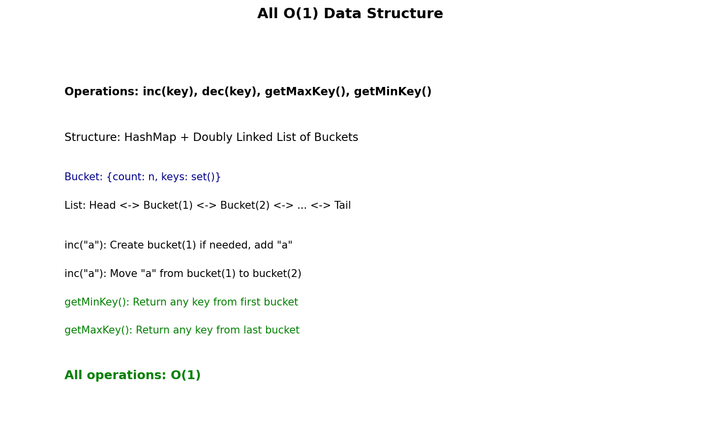

# All O(1) Data Structure

## Problem Statement

Design a data structure to store the strings' count with the ability to return the strings with minimum and maximum counts.

Implement the `AllOne` class:

- `AllOne()` Initializes the object of the data structure.
- `inc(String key)` Increments the count of the string `key` by 1. If `key` does not exist in the data structure, insert it with count 1.
- `dec(String key)` Decrements the count of the string `key` by 1. If the count of `key` is 0 after the decrement, remove it from the data structure. It is guaranteed that `key` exists in the data structure before the decrement.
- `getMaxKey()` Returns one of the keys with the maximal count. If no element exists, return an empty string `""`.
- `getMinKey()` Returns one of the keys with the minimal count. If no element exists, return an empty string `""`.

**Note:** Each function must run in **O(1)** average time complexity.

**LeetCode:** [432. All O(1) Data Structure](https://leetcode.com/problems/all-oone-data-structure/)

## Examples

**Example 1:**
```
Input:
["AllOne", "inc", "inc", "getMaxKey", "getMinKey", "inc", "getMaxKey", "getMinKey"]
[[], ["hello"], ["hello"], [], [], ["leet"], [], []]

Output:
[null, null, null, "hello", "hello", null, "hello", "leet"]

Explanation:
AllOne allOne = new AllOne();
allOne.inc("hello");     // "hello" count = 1
allOne.inc("hello");     // "hello" count = 2
allOne.getMaxKey();      // return "hello"
allOne.getMinKey();      // return "hello"
allOne.inc("leet");      // "leet" count = 1
allOne.getMaxKey();      // return "hello"
allOne.getMinKey();      // return "leet"
```

## Constraints

- `1 <= key.length <= 10`
- `key` consists of lowercase English letters.
- It is guaranteed that for each call to `dec`, `key` is existing in the data structure.
- At most `5 * 10^4` calls will be made to `inc`, `dec`, `getMaxKey`, and `getMinKey`.

## HashMap + Doubly Linked List of Buckets



### Key Insight

- **HashMap:** O(1) key -> bucket lookup
- **Doubly Linked List of Buckets:** Each bucket contains keys with same count, ordered by count
- Min key: First bucket's key
- Max key: Last bucket's key

### Data Structure

```
HashMap: key -> Bucket pointer

Doubly Linked List of Buckets:
Head <-> Bucket(1) <-> Bucket(2) <-> Bucket(5) <-> Tail
         {a, b}        {c}           {d}

Each bucket has:
- count: the frequency
- keys: set of keys with this count
- prev, next: pointers to adjacent buckets
```

## Solution

```python
class Bucket:
    """Bucket node in doubly linked list."""
    def __init__(self, count: int = 0):
        self.count = count
        self.keys = set()
        self.prev = None
        self.next = None


class AllOne:
    """
    All O(1) data structure.

    Time: O(1) for all operations
    Space: O(n) where n is number of unique keys
    """

    def __init__(self):
        # Dummy head and tail for easier operations
        self.head = Bucket(0)  # Before min count
        self.tail = Bucket(float('inf'))  # After max count
        self.head.next = self.tail
        self.tail.prev = self.head

        # Map: key -> bucket containing this key
        self.key_to_bucket = {}

    def _insert_bucket_after(self, bucket: Bucket, prev_bucket: Bucket) -> None:
        """Insert bucket after prev_bucket."""
        bucket.prev = prev_bucket
        bucket.next = prev_bucket.next
        prev_bucket.next.prev = bucket
        prev_bucket.next = bucket

    def _remove_bucket(self, bucket: Bucket) -> None:
        """Remove bucket from list."""
        bucket.prev.next = bucket.next
        bucket.next.prev = bucket.prev

    def _remove_key_from_bucket(self, key: str, bucket: Bucket) -> None:
        """Remove key from bucket, delete bucket if empty."""
        bucket.keys.remove(key)
        if not bucket.keys:
            self._remove_bucket(bucket)

    def inc(self, key: str) -> None:
        """Increment count of key by 1."""
        if key in self.key_to_bucket:
            # Key exists, move to next count bucket
            current_bucket = self.key_to_bucket[key]
            new_count = current_bucket.count + 1

            # Find or create bucket for new_count
            next_bucket = current_bucket.next
            if next_bucket.count != new_count:
                # Create new bucket
                next_bucket = Bucket(new_count)
                self._insert_bucket_after(next_bucket, current_bucket)

            # Move key to new bucket
            next_bucket.keys.add(key)
            self.key_to_bucket[key] = next_bucket

            # Remove from old bucket
            self._remove_key_from_bucket(key, current_bucket)
        else:
            # New key with count 1
            first_bucket = self.head.next
            if first_bucket.count != 1:
                first_bucket = Bucket(1)
                self._insert_bucket_after(first_bucket, self.head)

            first_bucket.keys.add(key)
            self.key_to_bucket[key] = first_bucket

    def dec(self, key: str) -> None:
        """Decrement count of key by 1."""
        current_bucket = self.key_to_bucket[key]
        new_count = current_bucket.count - 1

        if new_count == 0:
            # Remove key entirely
            del self.key_to_bucket[key]
        else:
            # Move to previous count bucket
            prev_bucket = current_bucket.prev
            if prev_bucket.count != new_count:
                prev_bucket = Bucket(new_count)
                self._insert_bucket_after(prev_bucket, current_bucket.prev)

            prev_bucket.keys.add(key)
            self.key_to_bucket[key] = prev_bucket

        # Remove from old bucket
        self._remove_key_from_bucket(key, current_bucket)

    def getMaxKey(self) -> str:
        """Return any key with maximum count."""
        if self.tail.prev == self.head:
            return ""
        # Return any key from last bucket
        return next(iter(self.tail.prev.keys))

    def getMinKey(self) -> str:
        """Return any key with minimum count."""
        if self.head.next == self.tail:
            return ""
        # Return any key from first bucket
        return next(iter(self.head.next.keys))
```

## Alternative: Using OrderedDict

```python
from collections import OrderedDict, defaultdict

class AllOneSimpler:
    """
    Simpler implementation using Python's OrderedDict.
    Note: This may not achieve true O(1) for all operations.
    """

    def __init__(self):
        self.key_count = {}
        self.count_keys = defaultdict(OrderedDict)
        self.min_count = 0
        self.max_count = 0

    def _update_min_max(self):
        """Update min and max counts."""
        if not self.key_count:
            self.min_count = 0
            self.max_count = 0
            return

        # Find new min
        self.min_count = min(c for c in self.count_keys if self.count_keys[c])
        self.max_count = max(c for c in self.count_keys if self.count_keys[c])

    def inc(self, key: str) -> None:
        if key in self.key_count:
            old_count = self.key_count[key]
            del self.count_keys[old_count][key]
            self.key_count[key] = old_count + 1
        else:
            self.key_count[key] = 1

        self.count_keys[self.key_count[key]][key] = True
        self._update_min_max()

    def dec(self, key: str) -> None:
        old_count = self.key_count[key]
        del self.count_keys[old_count][key]

        if old_count == 1:
            del self.key_count[key]
        else:
            self.key_count[key] = old_count - 1
            self.count_keys[old_count - 1][key] = True

        self._update_min_max()

    def getMaxKey(self) -> str:
        if not self.key_count:
            return ""
        return next(iter(self.count_keys[self.max_count]))

    def getMinKey(self) -> str:
        if not self.key_count:
            return ""
        return next(iter(self.count_keys[self.min_count]))
```

## Complexity Analysis

| Operation | Time | Space |
|-----------|------|-------|
| inc | O(1) | - |
| dec | O(1) | - |
| getMaxKey | O(1) | - |
| getMinKey | O(1) | - |
| Space | - | O(n) |

## Why True O(1)?

- **HashMap lookup:** O(1) to find bucket for a key
- **Bucket insertion/deletion:** O(1) with doubly linked list
- **Key insertion/deletion in bucket:** O(1) with hash set
- **Get min/max:** O(1) - just access first/last bucket

## Edge Cases

1. **Empty structure:** Return "" for getMinKey/getMaxKey
2. **Single key:** Same key is both min and max
3. **Decrement to zero:** Remove key from structure
4. **All same count:** Single bucket with all keys

## Variations

### Track Count for Each Key

```python
class AllOneWithCount(AllOne):
    """Extended to support getCount operation."""

    def getCount(self, key: str) -> int:
        """Return count for a key, 0 if not exists."""
        if key not in self.key_to_bucket:
            return 0
        return self.key_to_bucket[key].count
```

### Get All Keys with Min/Max Count

```python
class AllOneWithAllKeys(AllOne):
    """Extended to return all keys with min/max count."""

    def getAllMaxKeys(self) -> list:
        """Return all keys with maximum count."""
        if self.tail.prev == self.head:
            return []
        return list(self.tail.prev.keys)

    def getAllMinKeys(self) -> list:
        """Return all keys with minimum count."""
        if self.head.next == self.tail:
            return []
        return list(self.head.next.keys)
```

### Stream Version with Time Window

```python
import time

class AllOneWithTimeWindow:
    """
    All O(1) operations within a time window.
    Old entries automatically expire.
    """

    def __init__(self, window_seconds: float):
        self.window = window_seconds
        self.events = []  # (timestamp, key, delta)
        self.key_count = {}
        # ... rest similar to AllOne

    def _cleanup(self):
        """Remove expired events."""
        current_time = time.time()
        while self.events and current_time - self.events[0][0] > self.window:
            _, key, delta = self.events.pop(0)
            # Reverse the effect of old event
            self.key_count[key] = self.key_count.get(key, 0) - delta
            if self.key_count[key] <= 0:
                del self.key_count[key]
```

## Interview Tips

1. **Explain the data structure:** Draw the linked list of buckets
2. **Discuss why sets:** O(1) add/remove for keys in bucket
3. **Handle edge cases:** Empty buckets, single key
4. **Mention alternatives:** Trade-offs with simpler approaches

## Common Mistakes

1. Not handling empty bucket removal
2. Creating duplicate buckets with same count
3. Forgetting to update key_to_bucket map
4. Off-by-one errors when inserting buckets

## Related Problems

::: details LRU Cache (LeetCode 146)
**Problem:** Design cache that evicts least recently used item.

**Key Insight:** Hash map for O(1) lookup + doubly linked list for O(1) reordering.

**Approach:** Map keys to list nodes. Move accessed nodes to front. Evict from back when full.

**Complexity:** Time O(1) for get/put, Space O(capacity)
:::

::: details LFU Cache (LeetCode 460)
**Problem:** Design cache that evicts least frequently used item.

**Key Insight:** Track frequency of each key with multiple doubly linked lists.

**Approach:** One list per frequency level. Hash map for key lookup. Track minimum frequency.

**Complexity:** Time O(1) for get/put, Space O(capacity)
:::

::: details Insert Delete GetRandom O(1) (LeetCode 380)
**Problem:** Design set with O(1) insert, delete, and getRandom.

**Key Insight:** Array + hash map. Swap-delete trick for O(1) removal.

**Approach:** Store values in array, indices in hash map. Swap with last element to delete.

**Complexity:** Time O(1) for all operations, Space O(n)
:::

::: details Insert Delete GetRandom O(1) - Duplicates allowed (LeetCode 381)
**Problem:** Same as above but allow duplicate elements.

**Key Insight:** Map values to set of indices instead of single index.

**Approach:** Track all indices for each value. When deleting, pick any index, swap-delete.

**Complexity:** Time O(1) average for all operations, Space O(n)
:::
