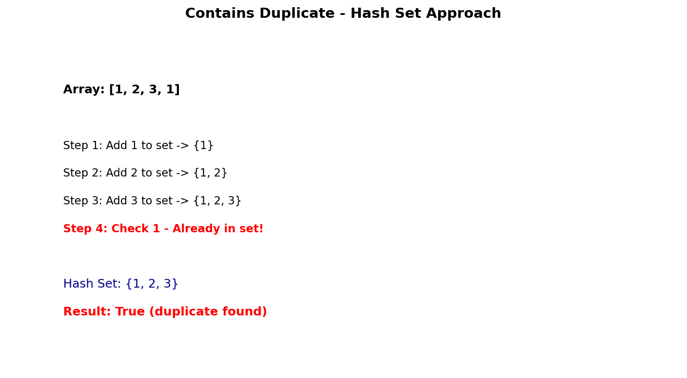

# Contains Duplicate

## Problem Statement

Given an integer array `nums`, return `true` if any value appears at least twice in the array, and return `false` if every element is distinct.

**LeetCode:** [217. Contains Duplicate](https://leetcode.com/problems/contains-duplicate/)

## Examples

**Example 1:**
```text
Input: nums = [1,2,3,1]
Output: true
Explanation: 1 appears twice.
```

**Example 2:**
```text
Input: nums = [1,2,3,4]
Output: false
Explanation: All elements are distinct.
```

**Example 3:**
```text
Input: nums = [1,1,1,3,3,4,3,2,4,2]
Output: true
```

## Constraints

- `1 <= nums.length <= 10^5`
- `-10^9 <= nums[i] <= 10^9`

## Hash Set Approach



### Key Insight

Use a hash set to track seen elements. If we encounter an element already in the set, we found a duplicate.

### Algorithm

1. Create an empty hash set
2. Iterate through the array
3. For each element, check if it's in the set
4. If yes, return `True` (duplicate found)
5. Otherwise, add element to the set
6. If loop completes, return `False`

## Solution

```python
from typing import List

def containsDuplicate(nums: List[int]) -> bool:
    """
    Check if array contains any duplicate values.

    Time: O(n) - single pass
    Space: O(n) - hash set storage
    """
    seen = set()

    for num in nums:
        if num in seen:
            return True
        seen.add(num)

    return False
```

::: info Complexity: Time O(n) · Space O(n)
- **Time:** Single pass with O(1) average hash set lookup and insertion per element
- **Space:** Set stores up to n elements if all are unique
:::

```python
# One-liner alternative
def containsDuplicateOneLiner(nums: List[int]) -> bool:
    """Compare set size with array length."""
    return len(nums) != len(set(nums))
```

::: info Complexity: Time O(n) · Space O(n)
- **Time:** Building set from list is O(n); comparing lengths is O(1)
- **Space:** Creates a set of up to n unique elements
:::

```python
# Early termination optimization
def containsDuplicateOptimized(nums: List[int]) -> bool:
    """
    Optimization: If array length > range of possible values,
    must contain duplicates (pigeonhole principle).
    """
    # For this problem, values can be -10^9 to 10^9
    # So this optimization rarely helps, but useful for limited ranges
    seen = set()
    for num in nums:
        if num in seen:
            return True
        seen.add(num)
    return False
```

::: info Complexity: Time O(n) · Space O(n)
- **Time:** Same as basic approach - early termination on first duplicate found
- **Space:** Set grows until duplicate found or all elements processed
:::

## Alternative Approaches

### Sorting Approach
```python
def containsDuplicateSorting(nums: List[int]) -> bool:
    """
    Sort and check adjacent elements.

    Time: O(n log n) - sorting
    Space: O(1) or O(n) - depends on sort implementation
    """
    nums.sort()
    for i in range(1, len(nums)):
        if nums[i] == nums[i - 1]:
            return True
    return False
```

::: info Complexity: Time O(n log n) · Space O(1) to O(n)
- **Time:** Dominated by sorting; linear scan afterward is O(n)
- **Space:** In-place sort uses O(log n) for recursion stack; Python's Timsort may use O(n)
:::

### Brute Force (Not Recommended)
```python
def containsDuplicateBruteForce(nums: List[int]) -> bool:
    """
    Compare every pair.

    Time: O(n^2)
    Space: O(1)
    """
    n = len(nums)
    for i in range(n):
        for j in range(i + 1, n):
            if nums[i] == nums[j]:
                return True
    return False
```

::: info Complexity: Time O(n^2) · Space O(1)
- **Time:** Nested loops check all n*(n-1)/2 pairs in worst case
- **Space:** Only uses loop variables, no additional data structures
:::

## Complexity Analysis

| Approach | Time | Space |
|----------|------|-------|
| Hash Set | O(n) | O(n) |
| Sorting | O(n log n) | O(1) to O(n) |
| Brute Force | O(n^2) | O(1) |

## Edge Cases

1. **Single element:** `[1]` - No duplicates possible, return `False`
2. **All same:** `[1,1,1,1]` - Return `True` immediately
3. **All different:** `[1,2,3,4]` - Check all elements, return `False`
4. **Negative numbers:** `[-1,-1]` - Hash set handles negatives

## Variations

### Contains Duplicate II
Check if there are duplicates within distance `k`:

```python
def containsNearbyDuplicate(nums: List[int], k: int) -> bool:
    """
    Check if nums[i] == nums[j] where |i - j| <= k.

    Time: O(n)
    Space: O(min(n, k))
    """
    window = set()

    for i, num in enumerate(nums):
        if num in window:
            return True

        window.add(num)

        # Maintain window size of k
        if len(window) > k:
            window.remove(nums[i - k])

    return False
```

::: info Complexity: Time O(n) · Space O(min(n, k))
- **Time:** Single pass with O(1) set operations; window maintenance is constant time
- **Space:** Set maintains at most k+1 elements in the sliding window
:::

### Contains Duplicate III
Check if there are duplicates with value difference at most `t` within distance `k`:

```python
def containsNearbyAlmostDuplicate(nums: List[int], k: int, t: int) -> bool:
    """
    Check if |nums[i] - nums[j]| <= t and |i - j| <= k.
    Uses bucket sort approach.

    Time: O(n)
    Space: O(min(n, k))
    """
    if t < 0:
        return False

    buckets = {}
    bucket_size = t + 1  # +1 to handle t=0

    for i, num in enumerate(nums):
        bucket_id = num // bucket_size

        # Check same bucket
        if bucket_id in buckets:
            return True

        # Check adjacent buckets
        if bucket_id - 1 in buckets and num - buckets[bucket_id - 1] <= t:
            return True
        if bucket_id + 1 in buckets and buckets[bucket_id + 1] - num <= t:
            return True

        buckets[bucket_id] = num

        # Maintain window
        if i >= k:
            del buckets[nums[i - k] // bucket_size]

    return False
```

::: info Complexity: Time O(n) · Space O(min(n, k))
- **Time:** Single pass with O(1) bucket operations; each element maps to exactly one bucket
- **Space:** At most k buckets maintained in sliding window
:::

## Related Problems

::: details Contains Duplicate II (LeetCode 219)
**Problem:** Return true if nums[i] == nums[j] and abs(i - j) <= k.

**Key Insight:** Maintain sliding window of size k+1 using hash set. Check for duplicates within window.

**Approach:** Use set to track elements in current window. Remove oldest when window exceeds k.

**Complexity:** Time O(n), Space O(min(n, k))
:::

::: details Contains Duplicate III (LeetCode 220)
**Problem:** Return true if nums[i] and nums[j] differ by at most t and indices differ by at most k.

**Key Insight:** Use bucket sort with bucket size t+1. Elements in same bucket or adjacent buckets could be valid.

**Approach:** Map elements to buckets. Check same bucket and neighbors. Maintain sliding window of k buckets.

**Complexity:** Time O(n), Space O(min(n, k))
:::

::: details Two Sum (LeetCode 1)
**Problem:** Find two numbers that add up to target.

**Key Insight:** Use hash map to store complement. One-pass solution checking and storing simultaneously.

**Approach:** For each num, check if complement (target - num) exists in map. If not, store num.

**Complexity:** Time O(n), Space O(n)
:::

::: details Intersection of Two Arrays (LeetCode 349)
**Problem:** Return array of elements that appear in both arrays.

**Key Insight:** Use set for one array, then check membership for second array.

**Approach:** Convert smaller array to set. Iterate larger array, add matches to result set.

**Complexity:** Time O(n + m), Space O(min(n, m))
:::
