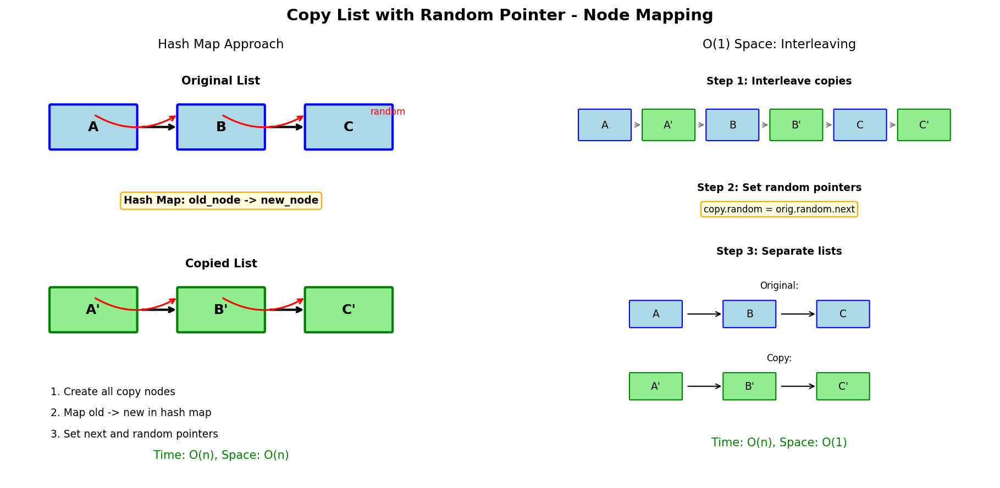

# Copy List with Random Pointer

## Problem Statement

A linked list of length `n` is given such that each node contains an additional random pointer, which could point to any node in the list, or `null`.

Construct a **deep copy** of the list. The deep copy should consist of exactly `n` brand new nodes, where each new node has its value set to the value of its corresponding original node. Both the `next` and `random` pointer of the new nodes should point to new nodes in the copied list such that the pointers in the original list and copied list represent the same list state. None of the pointers in the new list should point to nodes in the original list.

Return the head of the copied linked list.

**LeetCode:** [138. Copy List with Random Pointer](https://leetcode.com/problems/copy-list-with-random-pointer/)

## Examples

**Example 1:**
```
Input: head = [[7,null],[13,0],[11,4],[10,2],[1,0]]
Output: [[7,null],[13,0],[11,4],[10,2],[1,0]]
```

**Example 2:**
```
Input: head = [[1,1],[2,1]]
Output: [[1,1],[2,1]]
```

**Example 3:**
```
Input: head = [[3,null],[3,0],[3,null]]
Output: [[3,null],[3,0],[3,null]]
```

## Constraints

- `0 <= n <= 1000`
- `-10^4 <= Node.val <= 10^4`
- `Node.random` is `null` or is pointing to some node in the linked list.

## Hash Map Approach



### Key Insight

Use a hash map to map original nodes to their copies. This allows O(1) lookup when setting random pointers.

### Algorithm

1. First pass: Create copy of each node, store in hash map (old -> new)
2. Second pass: Set next and random pointers using the map

## Solution

```python
class Node:
    def __init__(self, x: int, next: 'Node' = None, random: 'Node' = None):
        self.val = x
        self.next = next
        self.random = random


def copyRandomList(head: 'Node') -> 'Node':
    """
    Deep copy linked list with random pointers using HashMap.

    Time: O(n) - two passes
    Space: O(n) - hash map storage
    """
    if not head:
        return None

    # Map original nodes to copies
    old_to_new = {}

    # First pass: create all nodes
    current = head
    while current:
        old_to_new[current] = Node(current.val)
        current = current.next

    # Second pass: set next and random pointers
    current = head
    while current:
        copy = old_to_new[current]
        copy.next = old_to_new.get(current.next)
        copy.random = old_to_new.get(current.random)
        current = current.next

    return old_to_new[head]


# Single pass with lazy creation
def copyRandomListSinglePass(head: 'Node') -> 'Node':
    """
    Single pass approach - create nodes on demand.

    Time: O(n)
    Space: O(n)
    """
    if not head:
        return None

    old_to_new = {}

    def get_copy(node):
        if not node:
            return None
        if node not in old_to_new:
            old_to_new[node] = Node(node.val)
        return old_to_new[node]

    current = head
    while current:
        copy = get_copy(current)
        copy.next = get_copy(current.next)
        copy.random = get_copy(current.random)
        current = current.next

    return old_to_new[head]
```

## O(1) Space: Interleaving Approach

```python
def copyRandomListO1Space(head: 'Node') -> 'Node':
    """
    O(1) space using interleaving technique.

    Time: O(n) - three passes
    Space: O(1) - no extra data structures
    """
    if not head:
        return None

    # Step 1: Create interleaved list
    # Original: A -> B -> C
    # After:    A -> A' -> B -> B' -> C -> C'
    current = head
    while current:
        copy = Node(current.val)
        copy.next = current.next
        current.next = copy
        current = copy.next

    # Step 2: Set random pointers
    current = head
    while current:
        if current.random:
            current.next.random = current.random.next
        current = current.next.next

    # Step 3: Separate the lists
    dummy = Node(0)
    copy_current = dummy
    current = head

    while current:
        # Extract copy node
        copy_current.next = current.next
        copy_current = copy_current.next

        # Restore original list
        current.next = current.next.next
        current = current.next

    return dummy.next
```

## Complexity Analysis

| Approach | Time | Space |
|----------|------|-------|
| Hash Map (2 pass) | O(n) | O(n) |
| Hash Map (1 pass) | O(n) | O(n) |
| Interleaving | O(n) | O(1) |

## Why Interleaving Works

By placing copies directly after originals:
- `original.next` points to `copy`
- `original.random.next` points to `copy of random`

This gives us O(1) access to copy nodes without a hash map.

## Edge Cases

1. **Empty list:** `head = None` - Return None
2. **Single node:** `[[1, null]]` - Handle correctly
3. **Self-referencing random:** `[[1, 0]]` - Random points to self
4. **All random null:** No random pointers to copy
5. **Cycle in random:** Random pointers can form cycles

## Recursive Approach

```python
def copyRandomListRecursive(head: 'Node') -> 'Node':
    """
    Recursive DFS approach.

    Time: O(n)
    Space: O(n) - recursion stack + hash map
    """
    visited = {}

    def copy_node(node):
        if not node:
            return None

        if node in visited:
            return visited[node]

        # Create copy
        copy = Node(node.val)
        visited[node] = copy

        # Recursively copy next and random
        copy.next = copy_node(node.next)
        copy.random = copy_node(node.random)

        return copy

    return copy_node(head)
```

## Variations

### Clone Graph (Similar Problem)

```python
class GraphNode:
    def __init__(self, val=0, neighbors=None):
        self.val = val
        self.neighbors = neighbors if neighbors else []


def cloneGraph(node: 'GraphNode') -> 'GraphNode':
    """
    Clone an undirected graph using BFS.

    Time: O(V + E)
    Space: O(V)
    """
    if not node:
        return None

    from collections import deque

    visited = {node: GraphNode(node.val)}
    queue = deque([node])

    while queue:
        current = queue.popleft()

        for neighbor in current.neighbors:
            if neighbor not in visited:
                visited[neighbor] = GraphNode(neighbor.val)
                queue.append(neighbor)

            visited[current].neighbors.append(visited[neighbor])

    return visited[node]
```

### Clone Binary Tree with Random Pointer

```python
class TreeNode:
    def __init__(self, val=0, left=None, right=None, random=None):
        self.val = val
        self.left = left
        self.right = right
        self.random = random


def copyRandomBinaryTree(root: 'TreeNode') -> 'TreeNode':
    """Clone binary tree with random pointers."""
    if not root:
        return None

    old_to_new = {}

    def copy_tree(node):
        if not node:
            return None

        if node in old_to_new:
            return old_to_new[node]

        copy = TreeNode(node.val)
        old_to_new[node] = copy

        copy.left = copy_tree(node.left)
        copy.right = copy_tree(node.right)
        copy.random = copy_tree(node.random)

        return copy

    return copy_tree(root)
```

## Interview Tips

1. **Clarify deep vs shallow copy:** Ensure understanding of requirements
2. **Draw the interleaving:** Visualize the O(1) space approach
3. **Handle None checks:** Random and next can be null
4. **Discuss trade-offs:** Space vs complexity of implementation

## Common Mistakes

1. Forgetting to handle None random pointers
2. Not restoring original list in interleaving approach
3. Creating cycles by not tracking visited nodes
4. Shallow copying (pointing to original nodes)

## Related Problems

::: details Clone Graph (LeetCode 133)
**Problem:** Deep copy a graph where each node has neighbors list.

**Key Insight:** Use hash map to track cloned nodes, avoid revisiting.

**Approach:** BFS/DFS with hash map mapping original to clone. Clone neighbors recursively.

**Complexity:** Time O(V+E), Space O(V)
:::

::: details Clone Binary Tree With Random Pointer (LeetCode 1485)
**Problem:** Deep copy binary tree where nodes have random pointers.

**Key Insight:** Same two-pass approach as linked list: clone structure, then set random pointers.

**Approach:** First pass clones tree structure with hash map. Second pass sets random pointers.

**Complexity:** Time O(n), Space O(n)
:::

::: details Reverse Linked List (LeetCode 206)
**Problem:** Reverse a singly linked list.

**Key Insight:** Track previous, current, next pointers. Iterative or recursive.

**Approach:** For each node, save next, point to prev, advance prev and current.

**Complexity:** Time O(n), Space O(1) iterative, O(n) recursive
:::

::: details Add Two Numbers (LeetCode 2)
**Problem:** Add two numbers represented as linked lists (digits in reverse order).

**Key Insight:** Simulate digit-by-digit addition with carry.

**Approach:** Traverse both lists together, add digits + carry, create new nodes for result.

**Complexity:** Time O(max(n, m)), Space O(max(n, m))
:::
