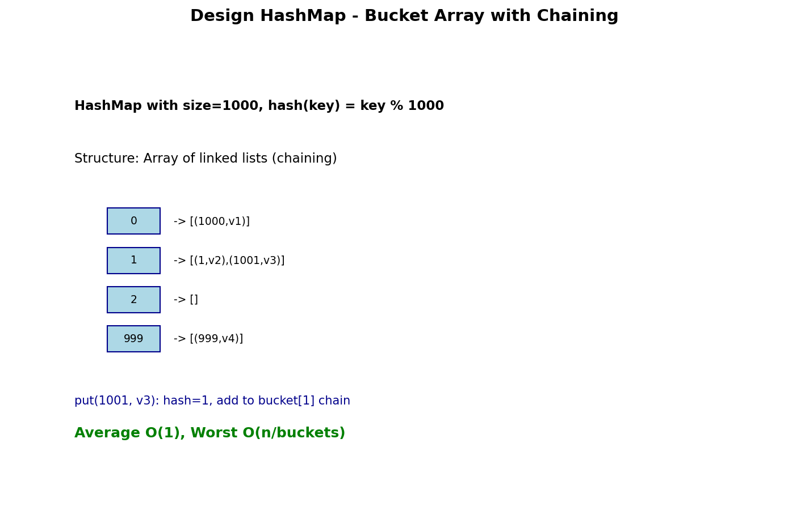

# Design HashMap

## Problem Statement

Design a HashMap without using any built-in hash table libraries.

Implement the `MyHashMap` class:

- `MyHashMap()` initializes the object with an empty map.
- `void put(int key, int value)` inserts a `(key, value)` pair into the HashMap. If the `key` already exists in the map, update the corresponding `value`.
- `int get(int key)` returns the `value` to which the specified `key` is mapped, or `-1` if this map contains no mapping for the `key`.
- `void remove(int key)` removes the `key` and its corresponding `value` if the map contains the mapping for the `key`.

**LeetCode:** [706. Design HashMap](https://leetcode.com/problems/design-hashmap/)

## Examples

**Example 1:**
```text
Input:
["MyHashMap", "put", "put", "get", "get", "put", "get", "remove", "get"]
[[], [1, 1], [2, 2], [1], [3], [2, 1], [2], [2], [2]]

Output:
[null, null, null, 1, -1, null, 1, null, -1]

Explanation:
MyHashMap myHashMap = new MyHashMap();
myHashMap.put(1, 1); // The map is now [[1,1]]
myHashMap.put(2, 2); // The map is now [[1,1], [2,2]]
myHashMap.get(1);    // return 1
myHashMap.get(3);    // return -1 (not found)
myHashMap.put(2, 1); // The map is now [[1,1], [2,1]] (update existing)
myHashMap.get(2);    // return 1
myHashMap.remove(2); // The map is now [[1,1]]
myHashMap.get(2);    // return -1 (not found)
```

## Constraints

- `0 <= key, value <= 10^6`
- At most `10^4` calls will be made to `put`, `get`, and `remove`.

## Array of Buckets with Chaining



### Key Insight

Use an array of buckets where each bucket is a linked list (chaining) to handle collisions. Hash function: `key % bucket_size`.

### Data Structure

```text
Buckets Array (size = 1000):
[0] -> (key1, val1) -> (key2, val2)
[1] -> (key3, val3)
[2] -> None
...
[999] -> (key4, val4)

Hash function: bucket_index = key % 1000
```

## Solution

::: code-group

```python [Python]
class ListNode:
    """Node for chaining in bucket."""
    def __init__(self, key: int = -1, val: int = -1):
        self.key = key
        self.val = val
        self.next = None


class MyHashMap:
    """
    HashMap using array of buckets with chaining.

    Time: O(n/k) average, O(n) worst for operations
    Space: O(k + n) where k = bucket size, n = elements
    """

    def __init__(self):
        self.size = 1000  # Number of buckets
        self.buckets = [ListNode() for _ in range(self.size)]  # Dummy heads

    def _hash(self, key: int) -> int:
        """Hash function."""
        return key % self.size

    def _find(self, key: int) -> ListNode:
        """Find node before the one with key (or last node)."""
        bucket_idx = self._hash(key)
        prev = self.buckets[bucket_idx]

        curr = prev.next
        while curr:
            if curr.key == key:
                return prev
            prev = curr
            curr = curr.next

        return prev

    def put(self, key: int, value: int) -> None:
        """Insert or update key-value pair."""
        prev = self._find(key)

        if prev.next:
            # Key exists, update value
            prev.next.val = value
        else:
            # Key doesn't exist, insert new node
            prev.next = ListNode(key, value)

    def get(self, key: int) -> int:
        """Get value by key, -1 if not found."""
        prev = self._find(key)

        if prev.next:
            return prev.next.val
        return -1

    def remove(self, key: int) -> None:
        """Remove key-value pair."""
        prev = self._find(key)

        if prev.next:
            prev.next = prev.next.next
```

```java [Java]
import java.util.*;

class MyHashMap {
    private static final int SIZE = 1000;

    // Inner node for chaining
    private static class Node {
        int key, val;
        Node next;
        Node(int key, int val) { this.key = key; this.val = val; }
    }

    private final Node[] buckets;

    public MyHashMap() {
        buckets = new Node[SIZE];
        // Each bucket has a dummy head
        for (int i = 0; i < SIZE; i++) buckets[i] = new Node(-1, -1);
    }

    private int hash(int key) { return key % SIZE; }

    /** Find node before the one with key (or last node). */
    private Node find(int key) {
        Node prev = buckets[hash(key)];
        while (prev.next != null && prev.next.key != key) {
            prev = prev.next;
        }
        return prev;
    }

    public void put(int key, int value) {
        Node prev = find(key);
        if (prev.next != null) {
            prev.next.val = value;      // Key exists: update
        } else {
            prev.next = new Node(key, value);  // Insert new
        }
    }

    public int get(int key) {
        Node prev = find(key);
        return prev.next != null ? prev.next.val : -1;
    }

    public void remove(int key) {
        Node prev = find(key);
        if (prev.next != null) prev.next = prev.next.next;
    }
}
```

:::

::: info Complexity: Time O(n/k) average · Space O(k + n)
- **Time:** O(n/k) average case where k is number of buckets; O(n) worst case when all keys hash to same bucket
- **Space:** O(k + n) for k buckets with linked list nodes, where n is number of stored key-value pairs
:::

## Alternative: Using List of Lists

```python
class MyHashMapSimpler:
    """
    Simpler implementation using list of lists.
    """

    def __init__(self):
        self.size = 1000
        self.buckets = [[] for _ in range(self.size)]

    def put(self, key: int, value: int) -> None:
        bucket_idx = key % self.size
        bucket = self.buckets[bucket_idx]

        for i, (k, v) in enumerate(bucket):
            if k == key:
                bucket[i] = (key, value)
                return

        bucket.append((key, value))

    def get(self, key: int) -> int:
        bucket_idx = key % self.size
        bucket = self.buckets[bucket_idx]

        for k, v in bucket:
            if k == key:
                return v

        return -1

    def remove(self, key: int) -> None:
        bucket_idx = key % self.size
        bucket = self.buckets[bucket_idx]

        for i, (k, v) in enumerate(bucket):
            if k == key:
                bucket.pop(i)
                return
```

::: info Complexity: Time O(n/k) average · Space O(k + n)
- **Time:** O(n/k) average for operations; list iteration within bucket is O(bucket_size)
- **Space:** O(k + n) for k empty bucket lists plus tuples for n stored elements
:::

## Open Addressing (Linear Probing)

```python
class MyHashMapOpenAddressing:
    """
    HashMap using open addressing with linear probing.
    """

    def __init__(self):
        self.size = 10007  # Prime number for better distribution
        self.keys = [None] * self.size
        self.vals = [None] * self.size
        self.DELETED = -1  # Marker for deleted slots

    def _hash(self, key: int) -> int:
        return key % self.size

    def _find_slot(self, key: int) -> int:
        """Find slot for key (existing or empty)."""
        idx = self._hash(key)
        first_deleted = -1

        while self.keys[idx] is not None:
            if self.keys[idx] == key:
                return idx
            if self.keys[idx] == self.DELETED and first_deleted == -1:
                first_deleted = idx
            idx = (idx + 1) % self.size

        return first_deleted if first_deleted != -1 else idx

    def put(self, key: int, value: int) -> None:
        idx = self._find_slot(key)
        self.keys[idx] = key
        self.vals[idx] = value

    def get(self, key: int) -> int:
        idx = self._hash(key)

        while self.keys[idx] is not None:
            if self.keys[idx] == key:
                return self.vals[idx]
            idx = (idx + 1) % self.size

        return -1

    def remove(self, key: int) -> None:
        idx = self._hash(key)

        while self.keys[idx] is not None:
            if self.keys[idx] == key:
                self.keys[idx] = self.DELETED
                self.vals[idx] = None
                return
            idx = (idx + 1) % self.size
```

::: info Complexity: Time O(1) average · Space O(size)
- **Time:** O(1) average case with good hash distribution; O(n) worst case with clustering
- **Space:** O(size) for the fixed-size arrays storing keys and values
:::

## With Dynamic Resizing

```python
class MyHashMapDynamic:
    """
    HashMap with dynamic resizing.
    Doubles size when load factor > 0.75.
    """

    def __init__(self):
        self.size = 16
        self.count = 0
        self.buckets = [[] for _ in range(self.size)]
        self.load_factor_threshold = 0.75

    def _hash(self, key: int) -> int:
        return key % self.size

    def _resize(self) -> None:
        """Double the size and rehash all elements."""
        old_buckets = self.buckets
        self.size *= 2
        self.buckets = [[] for _ in range(self.size)]
        self.count = 0

        for bucket in old_buckets:
            for key, value in bucket:
                self.put(key, value)

    def put(self, key: int, value: int) -> None:
        # Check if resize needed
        if self.count / self.size > self.load_factor_threshold:
            self._resize()

        bucket_idx = self._hash(key)
        bucket = self.buckets[bucket_idx]

        for i, (k, v) in enumerate(bucket):
            if k == key:
                bucket[i] = (key, value)
                return

        bucket.append((key, value))
        self.count += 1

    def get(self, key: int) -> int:
        bucket_idx = self._hash(key)
        for k, v in self.buckets[bucket_idx]:
            if k == key:
                return v
        return -1

    def remove(self, key: int) -> None:
        bucket_idx = self._hash(key)
        bucket = self.buckets[bucket_idx]

        for i, (k, v) in enumerate(bucket):
            if k == key:
                bucket.pop(i)
                self.count -= 1
                return
```

::: info Complexity: Time O(1) amortized · Space O(n)
- **Time:** O(1) amortized - occasional O(n) resize operations are spread across many insertions
- **Space:** O(n) for storing n elements; doubles capacity when load factor exceeds threshold
:::

## Complexity Analysis

| Operation | Average | Worst Case |
|-----------|---------|------------|
| put | O(1) | O(n) |
| get | O(1) | O(n) |
| remove | O(1) | O(n) |
| Space | O(k + n) | O(k + n) |

Where k = number of buckets, n = number of elements.

## Choosing Bucket Size

- **Too small:** More collisions, longer chains
- **Too large:** Wasted memory
- **Prime numbers:** Better distribution (e.g., 10007, 1009, 769)
- **Powers of 2:** Faster modulo (use bitmask)

## Edge Cases

1. **Key 0:** Valid key, don't confuse with "not found"
2. **Same key twice:** Update value, don't add duplicate
3. **Remove non-existent:** No-op, don't throw error
4. **All same hash:** All in one bucket (worst case)

## Hash Function Improvements

```python
def better_hash(self, key: int) -> int:
    """
    Better hash function for integer keys.
    Uses bit manipulation for better distribution.
    """
    key = ((key >> 16) ^ key) * 0x45d9f3b
    key = ((key >> 16) ^ key) * 0x45d9f3b
    key = (key >> 16) ^ key
    return key % self.size


def string_hash(self, key: str) -> int:
    """Hash function for string keys."""
    h = 0
    for char in key:
        h = (h * 31 + ord(char)) % self.size
    return h
```

## Interview Tips

1. **Discuss collision handling:** Chaining vs open addressing
2. **Mention load factor:** When to resize
3. **Hash function quality:** Distribution, speed
4. **Trade-offs:** Space vs time, simplicity vs efficiency

## Related Problems

::: details Design HashSet (LeetCode 705)
**Problem:** Implement HashSet with add, remove, contains operations.

**Key Insight:** Same as HashMap but only store keys (no values).

**Approach:** Array of buckets with chaining or open addressing. Hash function maps key to bucket.

**Complexity:** Time O(1) average, O(n/k) worst case per operation
:::

::: details LRU Cache (LeetCode 146)
**Problem:** Design cache evicting least recently used item first.

**Key Insight:** Combine HashMap with doubly linked list for O(1) operations.

**Approach:** HashMap maps keys to list nodes. Move accessed items to front, evict from back.

**Complexity:** Time O(1) for get/put, Space O(capacity)
:::

::: details Insert Delete GetRandom O(1) (LeetCode 380)
**Problem:** Design set supporting O(1) insert, delete, and random access.

**Key Insight:** Array for random access + HashMap for O(1) lookup + swap-delete trick.

**Approach:** Store elements in array, indices in map. Swap with last to delete in O(1).

**Complexity:** Time O(1) for all operations, Space O(n)
:::

::: details All O(1) Data Structure (LeetCode 432)
**Problem:** Design structure for O(1) inc, dec, getMaxKey, getMinKey.

**Key Insight:** Doubly linked list of frequency buckets + hash map for key lookup.

**Approach:** Each bucket holds keys with same count. Move keys between adjacent buckets.

**Complexity:** Time O(1) for all operations, Space O(n)
:::
