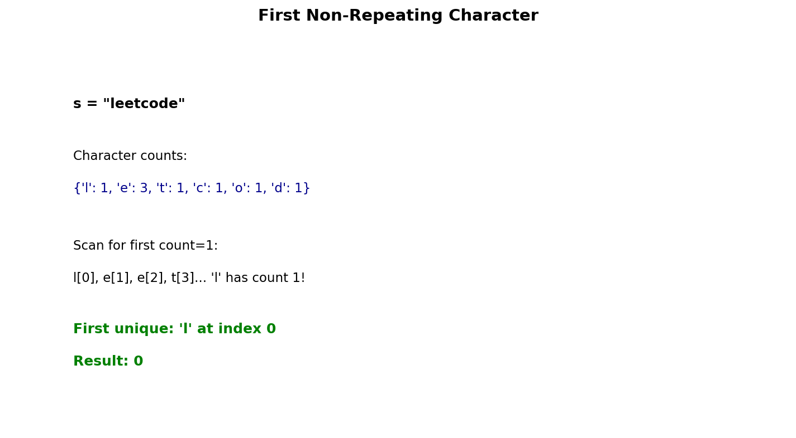

# First Unique Character in a String

## Problem Statement

Given a string `s`, find the first non-repeating character in it and return its index. If it does not exist, return `-1`.

**LeetCode:** [387. First Unique Character in a String](https://leetcode.com/problems/first-unique-character-in-a-string/)

## Examples

**Example 1:**
```text
Input: s = "leetcode"
Output: 0
Explanation: The character 'l' at index 0 is the first non-repeating character.
```

**Example 2:**
```text
Input: s = "loveleetcode"
Output: 2
Explanation: The character 'v' at index 2 is the first non-repeating character.
```

**Example 3:**
```text
Input: s = "aabb"
Output: -1
Explanation: All characters repeat.
```

## Constraints

- `1 <= s.length <= 10^5`
- `s` consists of only lowercase English letters.

## Hash Map Approach



### Key Insight

1. First pass: Count frequency of each character
2. Second pass: Find first character with count = 1

### Algorithm

1. Build a frequency map of all characters
2. Iterate through string again
3. Return index of first character with frequency 1
4. If no such character exists, return -1

## Solution

```python
from collections import Counter

def firstUniqChar(s: str) -> int:
    """
    Find index of first non-repeating character.

    Time: O(n) - two passes through string
    Space: O(1) - at most 26 characters
    """
    # Count character frequencies
    count = Counter(s)

    # Find first unique character
    for i, char in enumerate(s):
        if count[char] == 1:
            return i

    return -1


# Manual counting approach
def firstUniqCharManual(s: str) -> int:
    """Without using Counter."""
    count = {}

    # First pass: count frequencies
    for char in s:
        count[char] = count.get(char, 0) + 1

    # Second pass: find first unique
    for i, char in enumerate(s):
        if count[char] == 1:
            return i

    return -1


# Array-based approach (faster for lowercase letters)
def firstUniqCharArray(s: str) -> int:
    """
    Use fixed array for lowercase letters.

    Time: O(n)
    Space: O(1) - always 26 elements
    """
    count = [0] * 26

    for char in s:
        count[ord(char) - ord('a')] += 1

    for i, char in enumerate(s):
        if count[ord(char) - ord('a')] == 1:
            return i

    return -1
```

::: info Complexity: Time O(n) · Space O(1)
- **Time:** O(n) for two passes through the string - first to count frequencies, second to find first unique character
- **Space:** O(1) because at most 26 lowercase English letters can be stored in the hash map
:::

## Alternative: Single Pass with Index Tracking

```python
def firstUniqCharSinglePass(s: str) -> int:
    """
    Track first occurrence index for each character.

    Time: O(n)
    Space: O(1)
    """
    # Store (count, first_index) for each character
    char_info = {}

    for i, char in enumerate(s):
        if char in char_info:
            char_info[char] = (char_info[char][0] + 1, char_info[char][1])
        else:
            char_info[char] = (1, i)

    # Find minimum index with count = 1
    min_index = float('inf')
    for char, (count, index) in char_info.items():
        if count == 1:
            min_index = min(min_index, index)

    return min_index if min_index != float('inf') else -1
```

::: info Complexity: Time O(n) · Space O(1)
- **Time:** O(n) for single pass through string plus O(26) to find minimum index among unique characters
- **Space:** O(1) because hash map stores at most 26 characters with their count and first index
:::

## Complexity Analysis

| Approach | Time | Space |
|----------|------|-------|
| Two Pass Hash Map | O(n) | O(1)* |
| Array (26 chars) | O(n) | O(1) |
| Single Pass | O(n) | O(1)* |

*Space is O(1) for fixed character set (26 lowercase letters)

## Edge Cases

1. **Single character:** `"a"` - Return 0
2. **All same characters:** `"aaaa"` - Return -1
3. **All repeating:** `"aabbcc"` - Return -1
4. **Unique at end:** `"aabbccd"` - Return 6

## Variations

### First Unique Character in a Stream

Design a data structure that supports finding the first unique character at any point:

```python
from collections import OrderedDict

class FirstUnique:
    """
    Maintain first unique character in a stream.

    Uses OrderedDict to maintain insertion order and track unique characters.
    """
    def __init__(self):
        self.char_count = {}
        self.unique_chars = OrderedDict()

    def add(self, char: str) -> None:
        """Add a character to the stream."""
        self.char_count[char] = self.char_count.get(char, 0) + 1

        if self.char_count[char] == 1:
            self.unique_chars[char] = True
        elif char in self.unique_chars:
            del self.unique_chars[char]

    def getFirstUnique(self) -> str:
        """Get the first unique character, or '#' if none."""
        if self.unique_chars:
            return next(iter(self.unique_chars))
        return '#'


# Using Queue approach
from collections import deque

class FirstUniqueQueue:
    def __init__(self):
        self.queue = deque()
        self.char_count = {}

    def add(self, char: str) -> None:
        self.char_count[char] = self.char_count.get(char, 0) + 1
        self.queue.append(char)

        # Clean up front of queue
        while self.queue and self.char_count[self.queue[0]] > 1:
            self.queue.popleft()

    def getFirstUnique(self) -> str:
        return self.queue[0] if self.queue else '#'
```

### All Unique Characters

Find all positions of unique characters:

```python
from typing import List

def allUniqCharIndices(s: str) -> List[int]:
    """Return indices of all non-repeating characters."""
    count = Counter(s)
    return [i for i, char in enumerate(s) if count[char] == 1]
```

### Last Unique Character

```python
def lastUniqChar(s: str) -> int:
    """Find index of last non-repeating character."""
    count = Counter(s)

    for i in range(len(s) - 1, -1, -1):
        if count[s[i]] == 1:
            return i

    return -1
```

## Interview Tips

1. **Clarify constraints:** Ask about character set (lowercase only? Unicode?)
2. **Consider streaming:** What if characters come one at a time?
3. **Discuss trade-offs:** Two-pass vs single-pass approaches

## Related Problems

::: details Sort Characters By Frequency (LeetCode 451)
**Problem:** Sort string so most frequent characters come first.

**Key Insight:** Count frequencies, then sort/bucket by count.

**Approach:** Build frequency map, sort by frequency, reconstruct string.

**Complexity:** Time O(n log n) or O(n) with bucket sort, Space O(n)
:::

::: details Count Substrings with Only One Distinct Letter (LeetCode 1180)
**Problem:** Count substrings that have only one distinct character.

**Key Insight:** Consecutive same characters form n*(n+1)/2 valid substrings.

**Approach:** Find runs of same character, add n*(n+1)/2 for each run of length n.

**Complexity:** Time O(n), Space O(1)
:::

::: details Valid Anagram (LeetCode 242)
**Problem:** Determine if two strings are anagrams.

**Key Insight:** Same character frequencies means anagram.

**Approach:** Count chars in both strings, compare. Or sort both and compare.

**Complexity:** Time O(n), Space O(1)
:::
