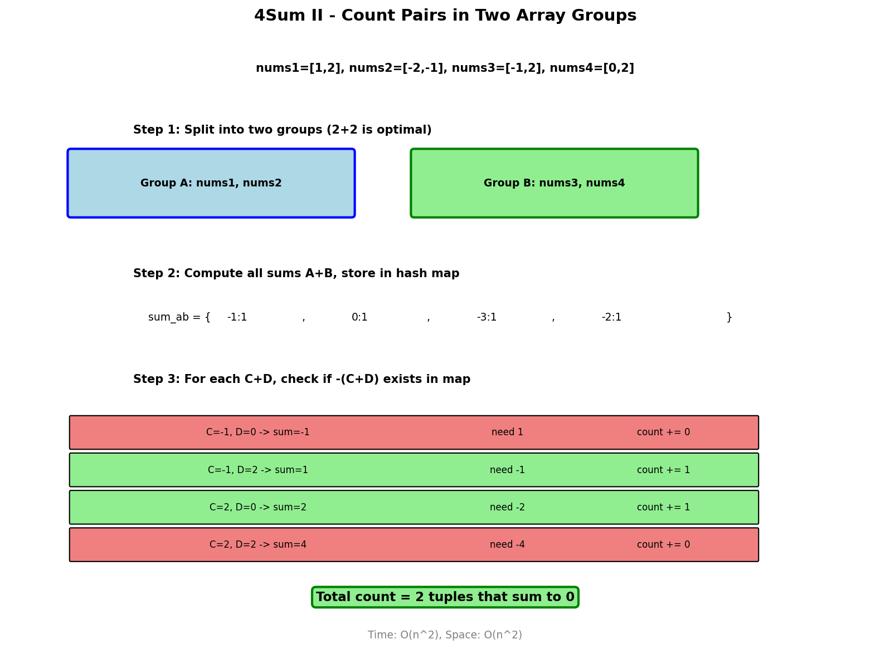

# 4Sum II

## Problem Statement

Given four integer arrays `nums1`, `nums2`, `nums3`, and `nums4` all of length `n`, return the number of tuples `(i, j, k, l)` such that:

- `0 <= i, j, k, l < n`
- `nums1[i] + nums2[j] + nums3[k] + nums4[l] == 0`

**LeetCode:** [454. 4Sum II](https://leetcode.com/problems/4sum-ii/)

## Examples

**Example 1:**
```text
Input: nums1 = [1,2], nums2 = [-2,-1], nums3 = [-1,2], nums4 = [0,2]
Output: 2
Explanation:
The two tuples are:
1. (0, 0, 0, 1) -> nums1[0] + nums2[0] + nums3[0] + nums4[1] = 1 + (-2) + (-1) + 2 = 0
2. (1, 1, 0, 0) -> nums1[1] + nums2[1] + nums3[0] + nums4[0] = 2 + (-1) + (-1) + 0 = 0
```

**Example 2:**
```text
Input: nums1 = [0], nums2 = [0], nums3 = [0], nums4 = [0]
Output: 1
```

## Constraints

- `n == nums1.length == nums2.length == nums3.length == nums4.length`
- `1 <= n <= 200`
- `-2^28 <= nums1[i], nums2[i], nums3[i], nums4[i] <= 2^28`

## Two HashMap Approach



### Key Insight

Split the four arrays into two groups. Store all sums from the first group in a hash map, then check if the negation of sums from the second group exists.

### Algorithm

1. Calculate all possible sums of `nums1[i] + nums2[j]`, store in hash map with counts
2. For each sum `nums3[k] + nums4[l]`, check if `-(nums3[k] + nums4[l])` exists in hash map
3. Add the count from hash map to result

## Solution

```python
from typing import List
from collections import Counter

def fourSumCount(nums1: List[int], nums2: List[int],
                 nums3: List[int], nums4: List[int]) -> int:
    """
    Count 4-tuples that sum to zero.

    Time: O(n^2) - two nested loops twice
    Space: O(n^2) - hash map for pair sums
    """
    # Store all sums of nums1[i] + nums2[j]
    sum_ab = Counter()
    for a in nums1:
        for b in nums2:
            sum_ab[a + b] += 1

    # Check for complementary sums in nums3, nums4
    count = 0
    for c in nums3:
        for d in nums4:
            target = -(c + d)
            count += sum_ab[target]

    return count
```

::: info Complexity: Time O(n^2) · Space O(n^2)
- **Time:** Two O(n^2) passes: first builds hash map of all AB sums, second checks all CD sums
- **Space:** Hash map stores up to n^2 unique sum values with their counts
:::

```python
# Alternative: Using defaultdict
from collections import defaultdict

def fourSumCountDefaultDict(nums1: List[int], nums2: List[int],
                            nums3: List[int], nums4: List[int]) -> int:
    """Using defaultdict for clarity."""
    sum_ab = defaultdict(int)

    for a in nums1:
        for b in nums2:
            sum_ab[a + b] += 1

    count = 0
    for c in nums3:
        for d in nums4:
            count += sum_ab.get(-(c + d), 0)

    return count
```

::: info Complexity: Time O(n^2) · Space O(n^2)
- **Time:** Same as Counter approach - two nested loop pairs
- **Space:** defaultdict stores same n^2 potential unique sums
:::

```python
# One-liner with Counter
def fourSumCountOneLiner(nums1: List[int], nums2: List[int],
                         nums3: List[int], nums4: List[int]) -> int:
    """Concise version using Counter."""
    sum_ab = Counter(a + b for a in nums1 for b in nums2)
    return sum(sum_ab[-c - d] for c in nums3 for d in nums4)
```

::: info Complexity: Time O(n^2) · Space O(n^2)
- **Time:** Generator expressions evaluate n^2 pairs for AB sums, then n^2 lookups for CD
- **Space:** Counter stores up to n^2 distinct AB sums
:::

## Complexity Analysis

| Approach | Time | Space |
|----------|------|-------|
| Two HashMap | O(n^2) | O(n^2) |
| Brute Force | O(n^4) | O(1) |

## Why Split 2+2?

- **Split 1+3:** O(n) + O(n^3) = O(n^3) - worse
- **Split 2+2:** O(n^2) + O(n^2) = O(n^2) - optimal
- **Split 3+1:** O(n^3) + O(n) = O(n^3) - worse

The 2+2 split minimizes the total work.

## Edge Cases

1. **All zeros:** `[0], [0], [0], [0]` - Return 1
2. **No valid tuples:** Arrays with no combinations summing to 0
3. **Large numbers:** May overflow if not careful (use appropriate types)
4. **Duplicate values:** Each index counts separately

## Variations

### K-Sum with K Arrays

```python
def kSumCount(arrays: List[List[int]], target: int = 0) -> int:
    """
    Generalized K-Sum for K arrays.
    Split arrays in half for optimal O(n^(k/2)) complexity.
    """
    k = len(arrays)
    if k == 0:
        return 0

    # Split arrays into two halves
    mid = k // 2
    first_half = arrays[:mid]
    second_half = arrays[mid:]

    def get_all_sums(arrs):
        """Get all possible sums from multiple arrays."""
        if not arrs:
            return Counter([0])

        sums = Counter([0])
        for arr in arrs:
            new_sums = Counter()
            for prev_sum, count in sums.items():
                for num in arr:
                    new_sums[prev_sum + num] += count
            sums = new_sums
        return sums

    first_sums = get_all_sums(first_half)
    count = 0

    # Generate second half sums and check
    second_sums = get_all_sums(second_half)
    for s, c in second_sums.items():
        count += first_sums[target - s] * c

    return count
```

::: info Complexity: Time O(n^(k/2)) · Space O(n^(k/2))
- **Time:** Each half generates n^(k/2) sums; matching is linear in the number of sums
- **Space:** Hash map for each half stores up to n^(k/2) distinct sums
:::

### 4Sum (Find All Unique Quadruplets)

```python
def fourSum(nums: List[int], target: int) -> List[List[int]]:
    """
    Find all unique quadruplets that sum to target.
    Different from 4Sum II - single array, unique values.

    Time: O(n^3)
    Space: O(1) excluding output
    """
    nums.sort()
    n = len(nums)
    result = []

    for i in range(n - 3):
        # Skip duplicates for first number
        if i > 0 and nums[i] == nums[i - 1]:
            continue

        for j in range(i + 1, n - 2):
            # Skip duplicates for second number
            if j > i + 1 and nums[j] == nums[j - 1]:
                continue

            # Two-pointer for remaining two numbers
            left, right = j + 1, n - 1
            while left < right:
                total = nums[i] + nums[j] + nums[left] + nums[right]

                if total == target:
                    result.append([nums[i], nums[j], nums[left], nums[right]])
                    # Skip duplicates
                    while left < right and nums[left] == nums[left + 1]:
                        left += 1
                    while left < right and nums[right] == nums[right - 1]:
                        right -= 1
                    left += 1
                    right -= 1
                elif total < target:
                    left += 1
                else:
                    right -= 1

    return result
```

::: info Complexity: Time O(n^3) · Space O(log n) to O(n)
- **Time:** Two outer loops O(n^2) with inner two-pointer O(n) each
- **Space:** Sorting uses O(log n) to O(n); result space excluded from analysis
:::

### 3Sum

```python
def threeSum(nums: List[int]) -> List[List[int]]:
    """
    Find all unique triplets that sum to zero.

    Time: O(n^2)
    Space: O(1) excluding output
    """
    nums.sort()
    result = []

    for i in range(len(nums) - 2):
        if i > 0 and nums[i] == nums[i - 1]:
            continue

        left, right = i + 1, len(nums) - 1
        while left < right:
            total = nums[i] + nums[left] + nums[right]

            if total == 0:
                result.append([nums[i], nums[left], nums[right]])
                while left < right and nums[left] == nums[left + 1]:
                    left += 1
                while left < right and nums[right] == nums[right - 1]:
                    right -= 1
                left += 1
                right -= 1
            elif total < 0:
                left += 1
            else:
                right -= 1

    return result
```

::: info Complexity: Time O(n^2) · Space O(log n) to O(n)
- **Time:** Sorting O(n log n) plus outer loop O(n) with inner two-pointer O(n) = O(n^2)
- **Space:** Sorting uses O(log n) to O(n) depending on implementation
:::

## Interview Tips

1. **Clarify the problem:** 4Sum II vs 4Sum are different problems
2. **Discuss time complexity:** Explain why 2+2 split is optimal
3. **Handle duplicates:** This problem counts duplicate indices separately
4. **Consider memory:** O(n^2) space might be significant for large n

## Common Mistakes

1. Confusing with 4Sum (single array, unique quadruplets)
2. Not counting duplicate sums correctly
3. Using wrong split (1+3 instead of 2+2)
4. Integer overflow with large numbers

## Related Problems

::: details Two Sum (LeetCode 1)
**Problem:** Find two numbers in array that sum to target.

**Key Insight:** Use hash map to store values and check for complements in one pass.

**Approach:** For each num, check if complement exists. If not, store current num with index.

**Complexity:** Time O(n), Space O(n)
:::

::: details 3Sum (LeetCode 15)
**Problem:** Find all unique triplets that sum to zero.

**Key Insight:** Sort array, fix one element, use two-pointer for remaining.

**Approach:** For each i, use two pointers from i+1 and end. Skip duplicates.

**Complexity:** Time O(n^2), Space O(1) extra
:::

::: details 4Sum (LeetCode 18)
**Problem:** Find all unique quadruplets in single array summing to target.

**Key Insight:** Unlike 4Sum II, requires unique quadruplets from one array. Use two loops + two-pointer.

**Approach:** Two outer loops fix first two elements. Two-pointer finds remaining two.

**Complexity:** Time O(n^3), Space O(1) extra
:::

::: details Two Sum II - Input Array Is Sorted (LeetCode 167)
**Problem:** Find two numbers in sorted array summing to target.

**Key Insight:** Sorted array allows two-pointer approach, no hash map needed.

**Approach:** Left and right pointers, move based on sum comparison with target.

**Complexity:** Time O(n), Space O(1)
:::
