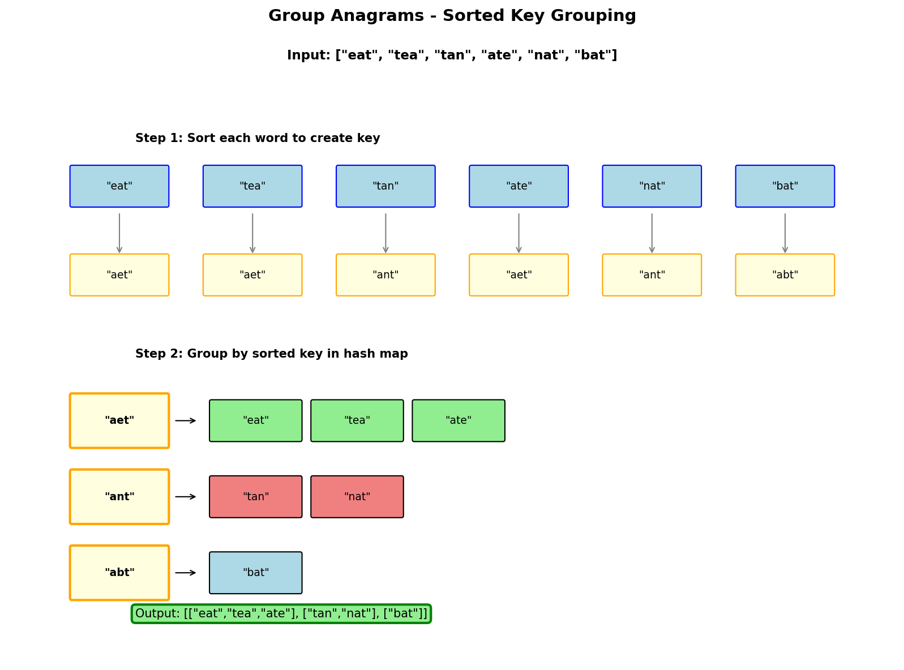

# Group Anagrams

## Problem Statement

Given an array of strings `strs`, group the anagrams together. You can return the answer in any order.

An **Anagram** is a word or phrase formed by rearranging the letters of a different word or phrase, typically using all the original letters exactly once.

**LeetCode:** [49. Group Anagrams](https://leetcode.com/problems/group-anagrams/)

## Examples

**Example 1:**
```text
Input: strs = ["eat","tea","tan","ate","nat","bat"]
Output: [["bat"],["nat","tan"],["ate","eat","tea"]]
```

**Example 2:**
```text
Input: strs = [""]
Output: [[""]]
```

**Example 3:**
```text
Input: strs = ["a"]
Output: [["a"]]
```

## Constraints

- `1 <= strs.length <= 10^4`
- `0 <= strs[i].length <= 100`
- `strs[i]` consists of lowercase English letters.

## Hash Map Approach



### Key Insight

Anagrams have the same characters with the same frequencies. Use a canonical form (sorted string or character count) as the hash map key.

### Algorithm

1. Create a hash map where key = canonical form, value = list of anagrams
2. For each string, compute its canonical form
3. Add the string to the corresponding group
4. Return all groups

## Solution

::: code-group

```python [Python]
from collections import defaultdict
from typing import List

def groupAnagrams(strs: List[str]) -> List[List[str]]:
    """
    Group anagrams using sorted string as key.

    Time: O(n * k log k) where n = len(strs), k = max string length
    Space: O(n * k) - storing all strings
    """
    groups = defaultdict(list)

    for s in strs:
        # Sorted string as key
        key = tuple(sorted(s))
        groups[key].append(s)

    return list(groups.values())
```

```java [Java]
import java.util.*;

class Solution {
    public List<List<String>> groupAnagrams(String[] strs) {
        Map<String, List<String>> groups = new HashMap<>();

        for (String s : strs) {
            char[] chars = s.toCharArray();
            Arrays.sort(chars);
            String key = new String(chars);

            groups.computeIfAbsent(key, k -> new ArrayList<>()).add(s);
        }

        return new ArrayList<>(groups.values());
    }
}
```

:::

::: info Complexity: Time O(n * k log k) · Space O(n * k)
- **Time:** For each of n strings, sorting k characters takes O(k log k); total is O(n * k log k)
- **Space:** Hash map stores all n strings; each key is a tuple of length k
:::

```python
# Optimized: Character count as key (avoids sorting)
def groupAnagramsOptimized(strs: List[str]) -> List[List[str]]:
    """
    Use character count tuple as key.

    Time: O(n * k) - no sorting needed
    Space: O(n * k)
    """
    groups = defaultdict(list)

    for s in strs:
        # Count characters
        count = [0] * 26
        for char in s:
            count[ord(char) - ord('a')] += 1

        # Tuple of counts as key
        groups[tuple(count)].append(s)

    return list(groups.values())
```

::: info Complexity: Time O(n * k) · Space O(n * k)
- **Time:** Counting k characters per string is O(k); no sorting needed - linear in total characters
- **Space:** Hash map stores n strings; keys are 26-element tuples (constant per key)
:::

```python
# Using Counter as key
from collections import Counter

def groupAnagramsCounter(strs: List[str]) -> List[List[str]]:
    """
    Use frozenset of Counter items as key.

    Time: O(n * k)
    Space: O(n * k)
    """
    groups = defaultdict(list)

    for s in strs:
        # frozenset of (char, count) pairs
        key = frozenset(Counter(s).items())
        groups[key].append(s)

    return list(groups.values())
```

::: info Complexity: Time O(n * k) · Space O(n * k)
- **Time:** Counter creation is O(k) per string; frozenset creation is O(unique chars) per string
- **Space:** Hash map for n strings; frozenset keys store only non-zero character counts
:::

## Complexity Analysis

| Approach | Time | Space |
|----------|------|-------|
| Sorted Key | O(n * k log k) | O(n * k) |
| Count Key | O(n * k) | O(n * k) |
| Counter Key | O(n * k) | O(n * k) |

Where n = number of strings, k = maximum string length

## Why Count Key is Faster

- Sorting each string: O(k log k)
- Counting characters: O(k)

For long strings, the count-based approach is more efficient.

## Edge Cases

1. **Empty string:** `[""]` - Empty string is its own group
2. **Single string:** `["a"]` - One group with one element
3. **All same:** `["a","a","a"]` - All in one group
4. **No anagrams:** `["a","b","c"]` - Each in separate group
5. **Different lengths:** Cannot be anagrams, separate groups

## Variations

### Find All Anagrams in a String

Find all start indices of `p`'s anagrams in `s`:

```python
def findAnagrams(s: str, p: str) -> List[int]:
    """
    Sliding window approach.

    Time: O(n)
    Space: O(1)
    """
    if len(p) > len(s):
        return []

    result = []
    p_count = [0] * 26
    s_count = [0] * 26

    # Count characters in p
    for char in p:
        p_count[ord(char) - ord('a')] += 1

    # Initialize window
    for i in range(len(p)):
        s_count[ord(s[i]) - ord('a')] += 1

    if s_count == p_count:
        result.append(0)

    # Slide window
    for i in range(len(p), len(s)):
        # Add new character
        s_count[ord(s[i]) - ord('a')] += 1
        # Remove old character
        s_count[ord(s[i - len(p)]) - ord('a')] -= 1

        if s_count == p_count:
            result.append(i - len(p) + 1)

    return result
```

::: info Complexity: Time O(n) · Space O(1)
- **Time:** Single pass with fixed-size array comparison (O(26) = O(1) per position)
- **Space:** Two 26-element arrays regardless of input size
:::

### Group Shifted Strings

Group strings that can be shifted to form each other (e.g., "abc" -> "bcd"):

```python
def groupStrings(strings: List[str]) -> List[List[str]]:
    """
    Group strings by their shift pattern.

    Time: O(n * k)
    Space: O(n * k)
    """
    groups = defaultdict(list)

    for s in strings:
        if not s:
            groups[()].append(s)
            continue

        # Calculate shift pattern (differences between consecutive chars)
        key = tuple((ord(s[i]) - ord(s[i-1])) % 26 for i in range(1, len(s)))
        groups[key].append(s)

    return list(groups.values())
```

::: info Complexity: Time O(n * k) · Space O(n * k)
- **Time:** Computing shift pattern for each string is O(k); n strings total
- **Space:** Hash map stores n strings; keys are tuples of length k-1 differences
:::

### Check If Two Strings Are K-Anagrams

Two strings are k-anagrams if they can become anagrams by changing at most k characters:

```python
def areKAnagrams(s1: str, s2: str, k: int) -> bool:
    """
    Check if s1 and s2 are k-anagrams.

    Time: O(n)
    Space: O(1)
    """
    if len(s1) != len(s2):
        return False

    count = [0] * 26

    for char in s1:
        count[ord(char) - ord('a')] += 1

    for char in s2:
        count[ord(char) - ord('a')] -= 1

    # Count characters that need to change
    changes_needed = sum(c for c in count if c > 0)

    return changes_needed <= k
```

::: info Complexity: Time O(n) · Space O(1)
- **Time:** Two passes through strings of length n, plus O(26) sum operation
- **Space:** Fixed 26-element array for lowercase letter counts
:::

## Interview Tips

1. **Clarify constraints:** ASCII only? Case sensitive?
2. **Discuss trade-offs:** Sorting vs counting approaches
3. **Consider edge cases:** Empty strings, single characters
4. **Mention optimizations:** Count-based key for long strings

## Common Mistakes

1. Using string as key instead of tuple (strings are mutable in some contexts)
2. Not handling empty strings
3. Forgetting to convert Counter to hashable type

## Related Problems

::: details Valid Anagram (LeetCode 242)
**Problem:** Determine if two strings are anagrams of each other.

**Key Insight:** Anagrams have identical character frequencies.

**Approach:** Count characters in both strings. Compare counts - must be equal.

**Complexity:** Time O(n), Space O(1) - only 26 letters
:::

::: details Find All Anagrams in a String (LeetCode 438)
**Problem:** Find all starting indices of p's anagrams in s.

**Key Insight:** Sliding window of fixed size with frequency matching.

**Approach:** Maintain window of size len(p). Compare frequency counts at each position.

**Complexity:** Time O(n), Space O(1)
:::

::: details Group Shifted Strings (LeetCode 249)
**Problem:** Group strings that can become each other by shifting all characters.

**Key Insight:** Normalize by computing relative differences between consecutive characters.

**Approach:** Create key from character differences (mod 26). Group by this key.

**Complexity:** Time O(n * k), Space O(n * k)
:::

::: details Permutation in String (LeetCode 567)
**Problem:** Check if s2 contains a permutation of s1.

**Key Insight:** A permutation has the same character frequency as original.

**Approach:** Fixed-size sliding window over s2 with frequency comparison against s1.

**Complexity:** Time O(n), Space O(1)
:::
